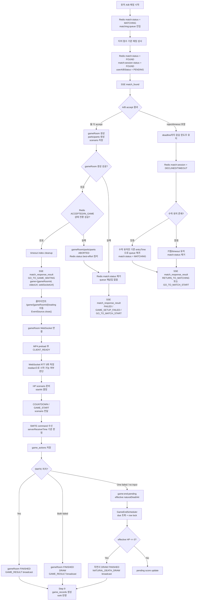

# Issue 36. Game Session Plan Checkpoint

## 전체 구현 흐름



## 1. 현재 구현 상태

- 매칭 큐 진입/취소 구현 완료
- 티어 점수 기반 매칭 구현 완료
- match session 생성 구현 완료
- `match_found` SSE 구현 완료
- accept/reject/timeout 처리 구현 완료
- 양쪽 수락 시 `match_response_result` 발행 구현 완료
- `match_response_result.game` payload는 `gameRoomId`, `videoUrl`, `webSocketUrl`을 포함한다.
- `game_rooms`, `game_participants`, `game_actions`, `game_records` 도메인과 DDL은 준비됨
- 매칭 성공 이후 게임방 생성, 대기 WebSocket, RTT 측정, GAME_START, SMITE 입력 저장/판정, SMITE 즉시 종료, 서버 scheduler 자연사 종료 보장, `NATURAL_DEATH_DRAW` 결과 전송까지 구현됨

## 2. 핵심 결정

- 우리 게임은 P2P/유저 호스트 방식이 아니라 중앙 백엔드 서버 권위 방식으로 구현한다.
- MP4는 gameRoom별로 생성하거나 전송하지 않는다.
- MP4는 공통 static resource로 제공한다.
- gameRoom별로 달라지는 것은 참가자, HP 시나리오, 시작 시간, RTT, 액션, 결과다.
- 클라이언트가 보낸 시간은 신뢰하지 않는다.
- 최종 판정은 RTT 보정 없이 서버 수신 시각과 서버 시나리오 기준으로 한다.
- 매칭 SSE는 매칭 결과와 게임 대기 화면 진입 정보까지만 담당한다.
- `GO_TO_GAME_WAITING`은 gameRoom/scenario 생성과 Redis `ACCEPTED`/`IN_GAME` 상태 전환이 모두 끝난 뒤 발행한다.
- `GO_TO_GAME_WAITING` 이후 게임 준비/RTT/카운트다운/SMITE/종료 처리는 WebSocket으로 담당한다.
- 별도의 SSE `game_ready` 이벤트는 만들지 않는다.
- `match_response_result`는 해당 matchId의 매칭 SSE 최종 이벤트다.
- 클라이언트는 `match_response_result` 수신 후 매칭 SSE `EventSource.close()`를 호출한다.
- `GO_TO_GAME_WAITING`이면 매칭 SSE를 닫은 뒤 gameRoom WebSocket으로 전환한다.

## 3. 사용자 시나리오 기준 흐름

1. 유저 A/B가 매칭 시작
2. 서버가 티어 점수 기준으로 두 유저 매칭
3. 두 유저에게 `match_found` SSE 전송
4. 두 유저가 accept
5. 양쪽 수락 확정 시 gameRoom 생성
6. `game_rooms` insert
7. `game_participants` 2명 insert
8. HP 감소 scenario 생성 및 저장
9. `match_response_result.game` payload에 `gameRoomId`, `videoUrl`, `webSocketUrl` 포함
10. 클라이언트는 `/game/{gameRoomId}/waiting` 이동
11. 클라이언트는 `match_response_result` 수신 후 매칭 SSE `EventSource.close()` 호출
12. 클라이언트가 gameRoom WebSocket 연결
13. MP4 preload
14. 클라이언트가 `CLIENT_READY` 전송
15. 서버가 RTT 5회 측정
16. 서버가 RTT 정상 여부를 확정
17. 서버가 HP scenario 준비, `startAt` 결정, gameRoom 시작 처리를 수행
18. WebSocket으로 `COUNTDOWN`/`GAME_START`와 scenario를 전달
19. 클라이언트가 `startAt` 기준으로 MP4 재생 + HP overlay 렌더링
20. 유저가 D/F 입력 시 WebSocket으로 `SMITE` 전송
21. 서버가 수신 시각 기준으로 HP 역산
22. 승패 판정
23. `game_actions` 저장
24. `game_records` 생성 및 랭크 반영

## 4. 구현 단계

### Step 1. 매칭 성공과 게임방 생성 연결

- [x] `MatchResponseResultService`의 양쪽 수락 완료 지점에서 게임 생성 유스케이스 호출
- [x] `game_rooms` 생성
- [x] `game_participants` 생성
- [x] scenario 생성/저장
- [x] `match_response_result.game` payload에 `gameRoomId`, `videoUrl`, `webSocketUrl` 채우기
- [x] gameRoom 생성 실패 시 `GO_TO_GAME_WAITING`을 발행하지 않고 매칭 성공 정산 실패로 격리할 정책 정의
- [x] 이 단계에서는 WebSocket 연결/RTT/SMITE 판정은 구현하지 않음

### Step 2. MP4 정적 서빙

- [x] Spring Boot static resource 디렉토리 준비
- [x] `/assets/game/dragon-view.mp4` 접근을 위한 경로 구조 구성
- [x] 실제 MP4 배치 경로 명시
- [x] 실제 MP4 파일은 repo에 포함하지 않고 `.gitkeep`만 유지
- [x] gameRoom마다 MP4를 따로 만들지 않음
- [x] gameRoom 생성 시 payload에는 고정 `videoUrl`만 포함
- [x] CDN/S3 static asset 분리는 MVP 이후로 유지

### Step 3. 게임 대기 WebSocket 연결

- [x] gameRoomId별 WebSocket 채널 추가
- [x] WebSocket 인증 및 gameRoom 참가자 검증
- [x] 두 참가자의 입장/이탈 상태 관리
- [x] 클라이언트 `CLIENT_READY` 수신
- [x] MP4 preload 완료 여부는 클라이언트가 `CLIENT_READY`로 보고
- [x] `GO_TO_GAME_WAITING` 이후 WebSocket 미접속 timeout 정책 정의
- [x] `CLIENT_READY` 미수신 timeout 정책 정의
- [x] GAME_START 이전 이탈과 GAME_START 이후 disconnect 정책 분리
- [x] 매칭 SSE와 게임 WebSocket의 책임 경계 문서화

### Step 4. 게임 대기 timeout 정산

- [x] gameRoom 생성 성공 후 `createdAt + 30초` waiting deadline 저장
- [x] WebSocket 미접속 timeout 감지
- [x] `CLIENT_READY` 미수신 timeout 감지
- [x] RTT 단계 진입 전 대기 실패 감지
- [x] timeout 시 gameRoom 상태를 `ABORTED`로 전환
- [x] timeout 시 game_participants 상태를 `ABORTED`로 전환
- [x] timeout 시 Redis `match:status:{userId}` 제거
- [x] timeout 시 game_records 생성하지 않음
- [x] timeout 시 LP/배치/승급전 반영하지 않음
- [x] timeout 시 클라이언트 start 버튼 화면 복귀 이벤트/응답 정책 확정
- [x] timeout scheduler/worker 중복 처리 방지 정책 정의

### Step 5. RTT 측정

- [x] WebSocket ping-pong으로 각 유저별 RTT 5회 측정
- [x] median RTT 계산으로 게임 시작 가능 여부 판단
- [x] median RTT 2000ms 초과 시 게임 시작 차단
- [x] 각 `RTT_PING`은 2500ms 안에 `RTT_PONG` 응답을 받아야 함
- [x] gameRoom 전체 RTT 측정은 5회 측정과 per-ping 2500ms timeout 기준 최대 15초 안에 완료되어야 함
- [x] `RTT_PONG` 응답 누락, WebSocket close/error, 측정 중 예외는 `RTT_FAILED`로 게임 시작 차단
- [x] 양쪽 RTT 정상 여부를 Step 6에서 조회할 수 있게 저장
- [x] RTT 실패/초과 시 gameRoom `ABORTED`, record/LP 미반영, `GAME_START_FAILED` 전송 정책 정의

### Step 6. GAME_START와 HP 시나리오 전달

- [x] HP scenario 생성/조회 및 시작 payload 확정
- [x] 양쪽 RTT 정상 상태 확인 후 `startAt = serverNow + 4000ms` 결정
- [x] gameRoom 상태를 `IN_PROGRESS`로 전환
- [x] `COUNTDOWN`/`GAME_START` 이벤트를 countdown 종료 후가 아니라 `startAt` 전에 미리 전달
- [x] 클라이언트는 남은 시간이 3000ms 이하일 때 `3, 2, 1` countdown을 렌더링하고 `startAt` 기준으로 HP bar overlay 계산
- [x] MP4 preload 완료 여부는 `CLIENT_READY` 전제로 보고 Step 6에서 다시 검증하지 않음
- [x] MP4는 배경으로만 사용
- [x] `GAME_START` 시 서버 기준 game end timer/scheduler 등록

### Step 7. SMITE 입력과 서버 판정

- [x] 클라이언트는 WebSocket으로 `SMITE` 명령만 전송
- [x] 서버는 `serverReceiveTime` 기록
- [x] `smiteTimeMs = serverReceiveTime - gameStartTime`
- [x] scenario에서 HP 역산
- [x] `game_actions` 저장
- [x] 중복 SMITE 차단
- [x] 같은 WebSocket 경로에서 RTT 측정과 SMITE 수신을 처리하되, SMITE 판정은 RTT 보정 없이 서버 수신 시각 기준으로 처리
- [x] SMITE로 HP가 `0` 이하가 되면 gameRoom을 즉시 `FINISHED`로 확정하고 `GAME_RESULT`를 broadcast
- [x] 두 유저가 모두 실패 SMITE를 사용하면 gameRoom을 즉시 `DRAW`로 확정하고 `GAME_RESULT`를 broadcast
- [x] 이미 `FINISHED`인 gameRoom에 늦게 도착한 SMITE는 새 action 없이 현재 `GAME_RESULT`를 재응답

### Step 8. 서버 timer/scheduler 기반 게임 종료 보장

- [x] WebSocket 연결 유무와 무관하게 gameRoom 종료 scheduler 실행
- [x] `GAME_START` 시 최초 `naturalDeathAt = startAt + scenario.durationMs` 기준 종료 후보 등록
- [x] 실패 SMITE 누적 데미지 기준 effective naturalDeathAt을 계산해 pending score를 앞당김
- [x] scheduler 지연 시에도 `game:end:pending` due 조회 후 DB row lock 안에서 최종 상태를 재판정
- [x] 이미 FINISHED/ABORTED 된 gameRoom은 종료 job이 no-op 처리
- [x] GAME_START 이후 양쪽 WebSocket이 끊겨도 서버가 자연사 DRAW를 확정
- [x] 자연사 DRAW로 새로 종료된 경우 `GAME_RESULT(reason=NATURAL_DEATH_DRAW)` broadcast
- [x] 전송 실패/미연결과 DB 결과 확정을 분리하고 pending cleanup은 best-effort로 수행

### Step 9. 게임 종료와 기록

- [x] Step 7/8에서 확정한 `game_rooms.status/result/winnerId`를 record/rank 정산의 source of truth로 사용
- [x] gameRoom 종료 확정 transaction과 record/rank 정산 transaction 분리
- [x] 새로 `FINISHED` 된 gameRoom에 대해서만 즉시 record/rank 정산 호출
- [x] 이미 FINISHED인 current result 재응답, scheduler no-op, ABORTED 흐름에서는 record/rank 정산 미호출
- [x] 멀티 인스턴스 환경에서 local memory가 아니라 DB row lock, record count, unique constraint 기준으로 정산 멱등성 보장
- [x] `game_records` 2행 생성
- [x] `GameRecord`의 `promotionSeriesId`/`isPromotionGame`을 `rankSeriesId`/`seriesType`으로 전환
- [x] `seriesType=RANK/PLACEMENT/PROMOTION`으로 일반 랭크, 배치, 승급전을 명시
- [x] `UserRankInfo` 누적 승/패/무 반영
- [x] 일반 RANK 게임 WIN/LOSS/DRAW LP 반영
- [x] 배치 RankSeries 반영 및 10판 완료 시 최종 rank/LP 배정
- [x] 승급전 RankSeries 반영 및 성공/실패 시 rank/LP 확정
- [x] record/rank 정산 내부에서 record 생성, 누적 전적, LP, RankSeries 반영을 같은 transaction으로 처리
- [x] `countByGameRoomId == 0/2/1` 기준 멱등성 및 불완전 정산 정책 구현
- [x] FINISHED인데 record count가 2가 아닌 gameRoom을 복구하는 scheduler 추가
- [x] `GAME_RESULT` payload에는 LP/rank/series delta를 포함하지 않고, Step 11 summary 조회 API에서 read-only로 제공

### Step 10. 정상 종료 후 매칭 점유 상태 cleanup

- [x] `FINISHED` gameRoom 참가자의 Redis `match:status:{userId}=IN_GAME` 제거 지점 확정
- [x] record/rank 정산 성공 여부와 Redis cleanup transaction/실패 영향을 분리
- [x] Redis cleanup 실패가 gameRoom `FINISHED`, `GAME_RESULT`, record/rank 정산을 rollback하지 않도록 처리
- [x] cleanup 실패 시 별도 cleanup scheduler를 추가하지 않고 기존 record/rank recovery 흐름에서 best-effort 재시도
- [x] Step 13의 DB 기준 active gameRoom 검증과 충돌하지 않도록 FINISHED/ABORTED 유저 재매칭 허용 기준 정리
- [x] 정상 종료 후 유저가 다시 매칭 큐에 진입 가능한지 테스트 추가

### Step 11. record/rank summary 조회 API

- [x] `GET /api/v1/games/{gameId}/summary` endpoint 설계
- [x] `GAME_RESULT` payload는 확장하지 않고 최종 결과 화면에서 summary API를 polling하도록 계약 정리
- [x] summary API는 record/rank 정산을 수행하지 않고 Step 9 결과를 read-only로 조회
- [x] 전체 전적 공개 API, record 상세 API, profile API는 이번 Step 11 범위에서 제외
- [x] core read service로 gameRoom summary read model, gameRecord count/list, user bulk 조회 제공
- [x] `PENDING`/`DONE` summary 응답 DTO와 player summary DTO 설계
- [x] `FINISHED + game_records 0/1행`은 `PENDING`, `2행`은 `DONE`으로 반환
- [x] `DONE` 응답은 `gameResult`, `winnerUserId`, `finishedAt`, `me`, `opponent`를 포함
- [x] `me/opponent`는 `result`, `lpBefore/After/Change`, `rankBefore/After`, `seriesType`, `rankSeriesId`, `nickname`을 같은 schema로 반환
- [x] rank는 enum 문자열만 반환하고 record id는 노출하지 않음
- [x] participant가 아닌 유저의 결과 조회를 `403`으로 차단
- [x] `/api/v1/games/{gameId}/summary` endpoint를 인증 필수 API로 연결
- [x] 클라이언트 최종 결과 화면에 필요한 응답 DTO와 문서 테스트 추가

### Step 12. Apex rank 자동 승급/강등 정산

- [x] Apex 유저도 LP 증감량은 일반 `Rank.calculateWinLp`, `Rank.calculateLossLp` 공식을 재사용
- [x] Master LP 200 도달 시 Grandmaster로 자동 승급
- [x] Grandmaster LP 500 도달 시 Challenger로 자동 승급
- [x] Challenger LP 500 미만 하락 시 Grandmaster로 자동 강등
- [x] Grandmaster LP 200 미만 하락 시 Master로 자동 강등
- [x] Master LP 0에서 패배 시 Diamond I LP 75로 강등
- [x] Apex 자동 승급/강등 전후 `rankBefore/rankAfter`, `lpBefore/lpAfter` record snapshot 검증
- [x] 일반 티어 승급전 정책과 Apex 자동 승급/강등 정책이 충돌하지 않는지 테스트 추가

### Step 13. 큐 진입 전 진행 중 gameRoom DB 검증

- [x] `joinQueue` 전에 DB 기준 진행 중 gameRoom 존재 여부를 조회
- [x] Redis `match:status:{userId}`만으로 중복 진입을 판단하지 않도록 보강
- [x] READY/IN_PROGRESS gameRoom이 있으면 매칭 큐 진입 차단
- [x] FINISHED/ABORTED gameRoom은 큐 진입을 막지 않도록 상태 기준 명확화
- [x] Redis TTL 만료 또는 cleanup 실패 이후에도 DB source of truth 기준으로 재진입을 막는 테스트 추가

### Step 14. Apex 티어 매칭 정책 정합성

- [x] Master+ 유저가 `Rank.getTierScore()` 기준 Master 29, Grandmaster 33, Challenger 37로 큐에 들어가는지 확인
- [x] 매칭 엔진 스캔 범위를 `matching:queue:1`부터 `matching:queue:37`까지 확장해 Apex 큐 누락 방지
- [x] 같은 Apex tierScore끼리는 기존 diff 0 정책으로 30초 이전에도 즉시 매칭되도록 검증
- [x] 30초 이전 매칭 범위는 기존 `±1 / ±2 / ±4 tierScore` 정책 유지
- [x] 30초 정확히는 `<= 30초` 구간으로 보고 `±4 tierScore` 유지
- [x] 30초 초과부터는 `TIER_SCORE_MAX - TIER_SCORE_MIN` 기준 전체 tierScore 범위 허용
- [x] 일반 티어 `1~28`과 Apex `29/33/37`이 기존 `matching:queue:{tierScore}` key 구조를 공유하도록 정리
- [x] Redis `findAll`, `countByTierScore`, `atomicPairRemove`가 Apex tierScore key에서도 동작하는지 테스트 추가
- [x] Apex LP 근접도 기반 후보 정렬/필터링은 MVP 범위에서 제외하고 후속 고도화 범위로 문서화

### Step 15. 배치 유저 매칭 정책 정합성

- [x] 배치 진행 중 기준을 `RankSeries.type=PLACEMENT`, `status=IN_PROGRESS`로 확정
- [x] 배치 유저의 실제 `UserRankInfo.rank`와 매칭용 tierScore를 분리하고, 매칭용 tierScore를 Silver IV 기준 `9`로 확정
- [x] 배치 유저도 기존 `±1 / ±2 / ±4 / 30초 초과 전체` 매칭 범위 확장 정책을 재사용하도록 확정
- [x] 배치 유저끼리는 tierScore `9` diff `0` 기준으로 즉시 매칭 가능하도록 확정
- [x] 배치 유저와 일반 유저가 매칭될 때 opponent profile/payload의 rank 표시는 `Unranked`로 확정
- [x] core read service에서 `RankSeries.type=PLACEMENT`, `status=IN_PROGRESS` 진행 중 여부를 조회할 수 있도록 구현
- [x] `RankSeries.type=PLACEMENT`, `status=IN_PROGRESS` 진행 중인 유저를 queue join 시 식별
- [x] 배치 유저는 queue join에서 매칭용 tierScore `9`를 사용하도록 구현
- [x] `RankSeries.type=PLACEMENT`, `status=IN_PROGRESS` 진행 중인 유저를 queue leave 시 식별
- [x] 배치 유저는 queue leave에서 매칭용 tierScore `9`를 사용하도록 구현
- [x] 기존 `MatchPairingService`가 배치 tierScore `9`를 기존 대기 시간별 diff 정책으로 처리하는지 검증
- [x] match 응답 상대 프로필에서 배치 진행 중 유저를 `Unranked`로 표시
- [x] 배치 유저 매칭 단위 테스트 추가
- [x] 일반/Apex/재큐잉/active gameRoom/Redis 중복 큐 정책 회귀 방지 검증
- [x] policy/issue/checkpoint 문서 정합성 반영

### Step 16. match_found 후처리 실패 복구

- [x] queue 원자 제거 이후 session 저장, timeout 등록, user status 갱신, event 발행 실패 지점을 구분
- [x] `FOUND` 노출 전에 session과 timeout pending을 먼저 생성하도록 처리 순서 재구성
- [x] session 저장 실패 시 두 유저를 기존 `MatchTicket.entryTime`/`tierScore`로 queue 복귀하고 `MATCHING` status 복구
- [x] timeout pending 등록 실패 시 저장된 session 삭제 후 두 유저 queue 복귀와 `MATCHING` status 복구
- [x] user status `FOUND` 갱신 실패 시 timeout cleanup, session 삭제, 두 유저 queue 복귀와 `MATCHING` status 복구
- [x] `MatchFoundEvent` 발행 실패 시 session/status/timeout을 유지하고 기존 timeout scheduler 정산에 위임
- [x] 후처리 보상은 Redis best-effort helper로 처리하고 outbox/saga, metric/Grafana는 후속 범위로 분리
- [x] 후처리 실패 복구와 `MatchPairingService` scan loop 회귀 테스트 추가

### Step 17. 동일 IP 셀프 매칭 방지

- [ ] 매칭 큐 진입 시 요청 IP 또는 셀프 매칭 방지용 식별자를 ticket에 포함할지 결정
- [ ] proxy/load balancer 환경에서 신뢰할 IP header 정책 정의
- [ ] 동일 IP 유저끼리는 후보 매칭에서 제외
- [ ] 동일 IP 후보 제외로 인해 오래 대기하는 유저의 범위 확장 정책과 충돌하지 않도록 처리
- [ ] 개인정보/보관 기간 관점에서 Redis ticket에 저장할 IP 값 형태를 결정
- [ ] 동일 IP 셀프 매칭 방지 테스트 추가

## 5. MVP 기준

MVP에서 반드시 포함할 것:

- 양쪽 수락 후 gameRoom 생성
- game payload에 `gameRoomId`, `videoUrl`, `webSocketUrl` 포함
- MP4 static serving
- 게임 대기 WebSocket
- RTT 측정
- `GAME_START` scenario 전달
- SMITE 서버 판정
- `game_actions` 저장
- `game_records` 저장

MVP 이후로 미뤄도 되는 것:

- CDN/S3 static asset 분리
- 고급 이탈 복구
- 리플레이/관전
- 복잡한 anti-cheat
- 자체 게임 에셋 교체

## 6. Redis 상태 전이 정책

현재 Redis는 매칭 큐, 유저 매칭 상태, match session, timeout index를 관리한다.
게임 진행 상태의 source of truth는 Redis가 아니라 DB의 `game_rooms`, `game_participants`, `game_actions`, `game_records`로 둔다.

### 6.1 Redis key별 책임

| Redis 데이터 | key | 책임 | 게임 구현 이후 정책 |
| :--- | :--- | :--- | :--- |
| 매칭 큐 | `matching:queue:{tierScore}` | 매칭 대기 유저 ZSET | gameRoom 생성 이후에는 사용하지 않음 |
| 유저 상태 | `match:status:{userId}` | 유저가 매칭/게임 플로우에 묶여 있는지 확인 | gameRoom 생성 후 Redis 상태 전환까지 성공하면 `IN_GAME`으로 유지 |
| match session | `match:session:{matchId}` | `match_found` 이후 accept/reject/timeout 정산 | gameRoom 생성과 Redis 상태 전환 성공 후 `ACCEPTED` 최종 세션으로 TTL 유지 |
| timeout pending | `match:response:timeout:pending` | 응답 deadline claim 대상 | 양쪽 accept 성공 시 cleanup |
| timeout processing | `match:response:timeout:processing` | timeout worker 중복 처리 방지 | 양쪽 accept 성공 시 cleanup |

### 6.2 정상 흐름 상태 전이

```text
매칭 시작
-> match:status:{userId} = MATCHING
-> matching:queue:{tierScore}에 userId 추가

매칭 성사
-> matching:queue에서 두 유저 제거
-> match:status:{userA/userB} = FOUND
-> match:session:{matchId}.status = FOUND
-> match:session:{matchId}.userAStatus/userBStatus = PENDING
-> timeout pending index 추가

A만 accept
-> match:session:{matchId}.userAStatus = ACCEPTED
-> match:status:{userA} = ACCEPTED
-> match:status:{userB} = FOUND 유지
-> match_response_result 발행 없음

B도 accept
-> gameRoom 생성
-> game_participants 2명 생성
-> scenario 생성/저장
-> match:session:{matchId}.status = ACCEPTED
-> match:session:{matchId}.userAStatus/userBStatus = ACCEPTED
-> match:status:{userA/userB} = IN_GAME
-> timeout pending/processing cleanup
-> match_response_result 발행
   outcome=MATCHED
   reason=BOTH_ACCEPTED
   action=GO_TO_GAME_WAITING
   game={gameRoomId, videoUrl, webSocketUrl}
```

핵심 기준:

- `match:session:{matchId}.status=ACCEPTED`는 게임방 생성과 Redis 유저 상태 전환이 모두 성공해 매칭 응답 정산이 성공했다는 뜻이다.
- `match:status:{userId}=IN_GAME`은 유저가 더 이상 매칭 큐에 들어갈 수 없고 게임 플로우에 묶였다는 뜻이다.
- gameRoom 생성 성공 이후 유저 상태를 `ACCEPTED`에 계속 두지 않는다.
- 게임방의 실제 진행 상태는 Redis user status가 아니라 DB `game_rooms.status`로 판단한다.

### 6.3 실패/timeout 흐름 상태 전이

```text
reject 단독 발생
-> match:session:{matchId}.userStatus = REJECTED
-> match:status:{userId}는 즉시 제거하지 않음
-> 상대의 10초 응답 윈도우 유지
-> match_response_result 발행 없음

deadline 정산: ACCEPTED + REJECTED
-> match:session:{matchId}.status = DECLINED
-> ACCEPTED 유저는 matching:queue에 기존 entryTime으로 복귀
-> ACCEPTED 유저 match:status = MATCHING
-> REJECTED 유저 match:status 제거
-> match_response_result 발행

deadline 정산: ACCEPTED + TIMEOUT
-> match:session:{matchId}.status = TIMEOUT
-> ACCEPTED 유저는 matching:queue에 기존 entryTime으로 복귀
-> ACCEPTED 유저 match:status = MATCHING
-> TIMEOUT 유저 match:status 제거
-> match_response_result 발행

deadline 정산: REJECTED/TIMEOUT 유저만 존재
-> match:session:{matchId}.status = DECLINED 또는 TIMEOUT
-> 두 유저 match:status 제거
-> match_response_result 발행
```

이 정책은 기존 issue-34의 `RETURN_TO_MATCHING`, `GO_TO_MATCH_START` 정책과 일치한다.
수락했지만 상대 문제로 게임에 가지 못한 유저만 기존 `entryTime`으로 큐에 복귀한다.

### 6.4 gameRoom 생성 실패 정책

양쪽 accept 이후 `GO_TO_GAME_WAITING`은 gameRoom/scenario 생성과 Redis 상태 전환이 모두 끝난 뒤에만 발행한다.
따라서 gameRoom 생성 실패와 Redis 상태 전환 실패는 명시적인 실패 정책이 필요하다.

권장 정책:

- gameRoom 생성 실패 시 `GO_TO_GAME_WAITING`을 발행하지 않는다.
- 두 유저를 매칭 큐에 자동 복귀시키지 않는다.
- 두 유저의 `match:status:{userId}`는 제거한다.
- `match:session:{matchId}`는 게임 세팅 실패로 최종 정산된 상태를 남긴다.
- 클라이언트에는 `match_response_result` 실패 이벤트를 발행한다.
- 클라이언트는 안내 메시지를 표시하고 start 버튼 화면으로 돌아간다.

추가로 필요한 enum/API 변경:

- `MatchResponseReason.GAME_SETUP_FAILED` 추가
- 두 유저 모두 `outcome=FAILED`, `reason=GAME_SETUP_FAILED`, `action=GO_TO_MATCH_START`
- 별도 `message` 필드는 추가하지 않고, 클라이언트가 `GAME_SETUP_FAILED` reason 기준으로 안내 문구를 매핑한다.
- 필요하면 `MatchStatus.GAME_SETUP_FAILED`를 추가해 `DECLINED`/`TIMEOUT`과 구분한다.

이 실패 정책을 추가하지 않으면 gameRoom 생성 실패 시 유저가 Redis `ACCEPTED` 상태에 남아 재매칭도 게임 진입도 못 하는 상태가 될 수 있다.

### 6.4.1 Redis 상태 전환 실패 보상 정책

gameRoom 생성이 성공했더라도 Redis match session 또는 두 유저 `IN_GAME` 상태 전환이 실패하면 `GO_TO_GAME_WAITING`을 발행하지 않는다.
Redis는 게임 진행의 source of truth는 아니지만, 성공 이벤트 발행 전 유저 점유 상태를 확정하는 마지막 게이트다.

```text
gameRoom 생성 성공
-> Redis 상태 전환 실패
-> game_rooms.status = ABORTED
-> game_participants.status = ABORTED
-> match:status:{userA/userB} best-effort 제거
-> matching:queue 재삽입 없음
-> match:session:{matchId}.status = GAME_SETUP_FAILED
-> match_response_result
   outcome=FAILED
   reason=GAME_SETUP_FAILED
   action=GO_TO_MATCH_START
   game=null
```

현재 단계에서는 DB와 Redis를 하나의 원자적 transaction으로 묶지 않고 보상 transaction으로 정리한다.
outbox/saga/2PC는 Redis 장애, 이벤트 발행 실패, 서버 중단 복구까지 요구되는 단계에서 후속 이슈로 검토한다.

### 6.5 게임 진행 중 상태

gameRoom 생성 이후의 상태 기준은 다음처럼 분리한다.

| 시점 | Redis `match:status:{userId}` | DB `game_rooms.status` | DB `game_participants.status` |
| :--- | :--- | :--- | :--- |
| 게임 대기 진입 확정 후 | `IN_GAME` | `READY` | `READY` |
| gameRoom 생성 후 Redis 상태 전환 실패 | 제거 | `ABORTED` | `ABORTED` |
| WebSocket 연결/READY 대기 | `IN_GAME` | `READY` | `READY` |
| WebSocket 미접속/READY timeout | 제거 | `ABORTED` | `ABORTED` |
| GAME_START | `IN_GAME` | `IN_PROGRESS` | `PLAYING` |
| 정상 종료 | 제거 | `FINISHED` | `FINISHED` |
| GAME_START 이후 disconnect | `IN_GAME` 또는 종료 시 제거 | `IN_PROGRESS` 유지 후 `FINISHED` | `DISCONNECTED` 또는 결과에 따라 `FINISHED` |

Redis의 `IN_GAME`은 매칭 중복 진입을 막기 위한 유저 점유 상태다.
게임의 정확한 생명주기와 결과 판정은 DB 상태를 기준으로 한다.

### 6.5.1 게임 시작 전/후 이탈 정책

`GO_TO_GAME_WAITING` 이후 URL 자체에 TTL을 두지는 않는다.
`/ws/game/{gameRoomId}`는 라우팅 주소로 유지하고, gameRoom `READY` 상태에서 WebSocket 접속과 `CLIENT_READY` 응답 제한 시간을 둔다.
waiting timeout은 클라이언트 수신 시각이나 `GO_TO_GAME_WAITING` 발행 시각이 아니라 DB gameRoom `createdAt` 기준 30초로 계산한다.

```text
gameRoom.status = READY
-> waiting deadline = gameRoom.createdAt + 30초
-> GO_TO_GAME_WAITING
-> 두 유저 WebSocket connect
-> MP4 preload 후 CLIENT_READY
-> 양쪽 READY + RTT 정상
-> HP scenario 준비 + startAt 결정
-> COUNTDOWN / GAME_START
```

게임 시작 전 timeout:

```text
WebSocket 미접속 또는 CLIENT_READY 미수신
-> gameRoom.status = ABORTED
-> game_participants.status = ABORTED
-> match:status:{userId} 제거
-> GAME_WAITING_TIMEOUT Pub/Sub 발행
-> game_records 생성 없음
-> LP 반영 없음
-> 클라이언트는 start 버튼 화면 복귀
```

게임 시작 후 disconnect:

```text
GAME_START 이후 WebSocket disconnect
-> disconnect 유저는 이후 추가 입력 불가
-> disconnect 전에 서버가 수신한 SMITE는 유효
-> WebSocket 연결이 모두 끊겨도 서버 timer/scheduler가 gameRoom 종료 작업 완료
-> 게임 clock/scenario는 서버 기준으로 계속 진행
-> 상대가 유효한 SMITE로 처치하면 서버 최종 판정 결과대로 승/패 확정
-> 상대가 처치하지 못하고 자연사하면 무승부
-> 자연사 DRAW로 새로 종료되면 연결된 local session에 NATURAL_DEATH_DRAW GAME_RESULT 전송
-> game_records 생성과 LP/배치/승급전 반영은 Issue 52에서 처리
```

따라서 WebSocket 대기 timeout은 URL 만료 정책이 아니라 gameRoom `READY` 상태의 준비 응답 timeout으로 구현한다.

### 6.6 정합성 검증 결과

- 매칭 SSE는 `match_found`와 `match_response_result`까지만 담당한다는 정책과 일치한다.
- `GO_TO_GAME_WAITING`을 gameRoom 생성 이후 발행하므로 클라이언트가 빈 game payload로 대기 화면에 진입하지 않는다.
- WebSocket은 게임 준비/RTT/카운트다운/SMITE/종료를 담당하므로 SSE 단방향 한계와 충돌하지 않는다.
- 기존 timeout/reject 정책은 유지된다. reject 단독 발생 시 즉시 실패 이벤트를 보내지 않는 정책도 유지된다.
- Redis match session은 매칭 응답 정산 기록으로만 쓰고, 게임 상태를 Redis match session에 계속 확장하지 않으므로 DB DDL의 `game_rooms` 생명주기와 충돌하지 않는다.
- gameRoom 생성 실패 이벤트는 Issue 36의 필수 범위로 포함한다. 기존 issue-34 reason/action mapping에는 `GAME_SETUP_FAILED`가 없으므로 Step 1 구현에서 enum, factory mapping, 문서를 함께 확장해야 한다.
- Redis 상태 전환 실패는 성공 이벤트 발행 전 실패로 취급하고, 이미 생성된 gameRoom/participant는 `ABORTED`로 보상 처리하므로 확정 정책과 일치한다.

## 7. 이슈 분할안

### Issue 36. 매칭 성공과 gameRoom 생성 연결

목표:

- 양쪽 accept 완료 시점에 gameRoom을 생성한다.
- gameRoom participants와 HP scenario를 함께 생성한다.
- `match_response_result.game`에 게임 대기 화면 진입에 필요한 값을 채운다.

범위:

- `MatchResponseResultService` 양쪽 수락 완료 지점에서 game 생성 유스케이스 호출
- `game_rooms` insert
- `game_participants` 2명 insert
- scenario 생성/저장
- `gameRoomId`, `videoUrl`, `webSocketUrl` payload 추가
- 기존 `GO_TO_GAME_WAITING` 액션 유지
- gameRoom 생성 성공 후 두 유저 Redis 상태를 `IN_GAME`으로 전환
- Redis 상태 전환까지 모두 성공한 뒤에만 `GO_TO_GAME_WAITING` 이벤트 발행
- gameRoom 생성 실패 또는 Redis 상태 전환 실패 시 두 유저 Redis 상태를 제거하고 `GAME_SETUP_FAILED` 이벤트 발행
- Redis 상태 전환 실패 시 생성된 gameRoom/participant를 `ABORTED`로 보상 처리
- gameRoom 생성 실패 또는 Redis 상태 전환 실패 시 매칭 큐에 자동 복귀시키지 않음
- `GAME_SETUP_FAILED` reason/action factory mapping 추가
- Issue 34의 `match_response_result` API/SSE 문서 갱신

gameRoom 생성 실패 mapping:

| 항목 | 값 |
| :--- | :--- |
| `outcome` | `FAILED` |
| `reason` | `GAME_SETUP_FAILED` |
| `action` | `GO_TO_MATCH_START` |
| `game` | `null` |
| 대상 | 양쪽 유저 모두 |
| Redis 후처리 | 두 유저 `match:status` 제거, queue 재삽입 없음 |
| 안내 문구 | 클라이언트가 `GAME_SETUP_FAILED` reason 기준으로 표시 |

제외:

- WebSocket 연결
- RTT 측정
- countdown
- SMITE 판정
- game_actions/game_records 저장

완료 기준:

- 양쪽 accept 시 `match_response_result.action=GO_TO_GAME_WAITING`
- `match_response_result.game != null`
- 클라이언트가 payload만으로 `/game/{gameRoomId}/waiting` 화면으로 이동 가능
- MP4는 gameRoom 생성 과정에서 만들지 않고 static URL만 전달
- gameRoom 생성 성공 후 `match:status:{userA/userB}=IN_GAME`
- gameRoom 생성 실패 시 두 유저가 `ACCEPTED` 상태에 갇히지 않고 start 버튼 화면으로 복귀 가능

### Issue 38. MP4 static resource 제공

목표:

- 공통 MP4를 `/assets/game/dragon-view.mp4`로 제공한다.

범위:

- Spring Boot static resource 위치 정리
- `backend/smite-api/src/main/resources/static/assets/game/.gitkeep` 추가
- 실제 MP4 배치 경로 명시
- 실제 `dragon-view.mp4` 파일은 Git에 포함하지 않음
- API 문서 또는 체크포인트 문서에 고정 `videoUrl` 명시
- gameRoom별 MP4 생성/복제 없음
- CDN/S3 static asset 분리는 MVP 이후 검토

완료 기준:

- 로컬/배포 환경에서 `dragon-view.mp4`를 배치하면 `/assets/game/dragon-view.mp4` 접근 가능
- `match_response_result.game.videoUrl`이 같은 URL을 반환
- 실제 MP4 파일 없이도 테스트 통과

### Issue 40. 게임 대기 WebSocket 연결

목표:

- gameRoom별 WebSocket 채널을 열고 참가자 연결/READY 상태를 관리한다.

범위:

- WebSocket endpoint 추가
- gameRoom 참가자 인증/인가
- `PLAYER_JOINED`, `CLIENT_READY`, `PLAYER_READY`, `PLAYER_LEFT`, `ERROR` 수준의 대기 상태 처리
- 양쪽 READY 전까지 게임 시작하지 않음
- GAME_START 이전 timeout과 GAME_START 이후 disconnect 정책 문서화

완료 기준:

- 두 참가자가 같은 gameRoom WebSocket에 연결 가능
- 참가자가 아닌 유저는 연결 또는 구독 거부
- 양쪽 READY 상태를 서버가 식별 가능
- 양쪽 READY 상태가 되어도 이번 이슈에서는 GAME_START를 전송하지 않음

### Issue 42. 게임 대기 timeout 정산

목표:

- GAME_START 이전 WebSocket 미접속/READY timeout을 감지하고 gameRoom을 안전하게 중단한다.

범위:

- gameRoom 생성 성공 후 `createdAt + 30초` waiting deadline 저장
- WebSocket 미접속 timeout 감지
- `CLIENT_READY` 미수신 timeout 감지
- RTT 단계 진입 전 대기 실패 감지
- timeout 시 gameRoom `ABORTED`
- timeout 시 game_participants `ABORTED`
- timeout 시 Redis `match:status:{userId}` 제거
- timeout 시 game_records 생성 금지
- timeout 시 LP/배치/승급전 반영 금지
- timeout 시 클라이언트 start 버튼 화면 복귀 이벤트/응답 정책 확정
- timeout scheduler/worker 중복 처리 방지

완료 기준:

- WebSocket 미접속/READY timeout 시 게임이 시작되지 않음
- timeout 된 gameRoom은 `ABORTED`로 정리됨
- timeout 된 게임은 record/LP/배치/승급전에 반영되지 않음
- 두 유저는 큐 자동 복귀 없이 start 버튼 화면으로 복귀함

### Issue 44. RTT 측정

목표:

- WebSocket 경로에서 RTT를 측정하고, 양쪽 유저가 게임 시작 가능한 네트워크 상태인지 확정한다.

범위:

- 각 유저별 ping-pong 5회
- median RTT 계산으로 게임 시작 가능 여부 판단
- median RTT 2000ms 초과 시 시작 차단
- 각 `RTT_PING` 응답 제한 2500ms
- gameRoom 전체 RTT 측정 제한은 5회 측정과 per-ping 2500ms timeout 기준 최대 15초
- `RTT_PONG` 응답 누락, WebSocket close/error, 측정 중 예외 시 시작 차단
- 양쪽 RTT 정상 여부 저장
- RTT 실패/초과 시 gameRoom `ABORTED`, record/LP 미반영, `GAME_START_FAILED` 정책 정의

완료 기준:

- 양쪽 유저의 median RTT를 저장함
- 양쪽 RTT 정상 여부를 Step 6에서 조회할 수 있음
- RTT 실패/초과 시 gameRoom이 시작되지 않고 `ABORTED`로 정리됨

### Issue 46. GAME_START와 HP 시나리오 전달

목표:

- RTT 정상 확인 이후 HP scenario와 서버 기준 `startAt`을 확정하고, 클라이언트가 `startAt`에 즉시 게임을 시작할 수 있게 한다.

범위:

- HP scenario 생성/조회
- gameRoom `IN_PROGRESS` 전환
- 서버 기준 `startAt = serverNow + 4000ms` 결정
- `COUNTDOWN`/`GAME_START` 메시지를 `startAt` 전에 미리 전송하고 같은 `startAt`과 scenario 전달
- `GAME_START` 시 서버 기준 game end timer/scheduler 등록

완료 기준:

- 양쪽 정상 RTT일 때 같은 `startAt`을 받음
- 클라이언트는 남은 시간이 3000ms 이하일 때 `3, 2, 1` countdown을 렌더링하고 `startAt` 기준으로 MP4 재생과 HP overlay 계산 가능
- 카운트다운 종료 후 추가 서버 메시지 대기 없이 게임을 시작할 수 있음

### Issue 48. SMITE 서버 판정과 action 저장

목표:

- 클라이언트 입력을 서버 수신 시각 기준으로 판정한다.

범위:

- WebSocket `SMITE` command 수신
- `serverReceiveTime` 기록
- `smiteTimeMs = serverReceiveTime - gameStartTime`
- scenario 기준 HP 역산
- 중복 SMITE 차단
- `game_actions` 저장

완료 기준:

- 한 유저가 SMITE를 보내면 서버가 성공/실패/판정 HP를 계산
- 같은 유저의 두 번째 SMITE는 거부 또는 무시
- 판정 결과가 서버 로그와 DB에 남음

### Issue 50. 서버 timer/scheduler 기반 gameRoom 종료

목표:

- WebSocket 연결 유무와 무관하게 서버 기준으로 gameRoom 종료를 보장한다. 완료됨.

범위:

- [x] `GAME_START` 시 game end pending 등록
- [x] HP scenario와 실패 SMITE action을 합성한 effective naturalDeathAt 기준 종료 scheduler 실행
- [x] 종료 시점에 저장된 `game_actions`와 scenario 기준으로 자연사 `DRAW` 판정
- [x] 양쪽 WebSocket이 모두 끊겨도 gameRoom 종료 처리 계속 진행
- [x] 이미 `FINISHED`/`ABORTED` 된 gameRoom에 대한 종료 job no-op 처리
- [x] scheduler 지연 시 종료 대상 gameRoom 재조회 후 row lock 안에서 복구 정산
- [x] 자연사 `DRAW` 결과를 공용 `GAME_RESULT(reason=NATURAL_DEATH_DRAW)`로 전송
- [x] record/LP/시리즈 반영은 Issue 52 범위로 분리

완료 기준:

- [x] `GAME_START` 이후 WebSocket 연결이 없어도 gameRoom이 서버 기준으로 종료됨
- [x] scenario 종료 시점 또는 effective naturalDeathAt 시점에 자연사 `DRAW` 결과가 확정됨
- [x] 종료 job 중복 실행 시에도 상태가 중복 변경되지 않음

### Issue 52. 게임 종료와 record/rank 연결

목표:

- Step 7/8에서 이미 확정된 gameRoom 결과를 기준으로 전적 기록과 랭크 정산을 멱등하게 연결한다.

범위:

- `FINISHED` gameRoom 결과를 참가자 관점 `WIN`/`LOSS`/`DRAW` record로 변환
- `game_records` 2행 생성 및 `uk_game_records_room_user` 기반 중복 방어
- `promotionSeriesId`/`isPromotionGame`을 `rankSeriesId`/`seriesType`으로 전환
- `seriesType=RANK/PLACEMENT/PROMOTION` 정책 적용
- `UserRankInfo` totalWins/totalLosses/totalDraws 반영
- 일반 RANK LP 반영, 배치 완료 rank 배정, 승급전 성공/실패 반영
- gameRoom 종료 transaction과 record/rank 정산 transaction 분리
- 새로 FINISHED 된 gameRoom 즉시 정산 및 FINISHED 미정산 gameRoom 복구 scheduler
- 멀티 인스턴스 환경에서 DB row lock, record count, unique constraint 기반 멱등성 보장
- `GAME_RESULT` payload 미확장, record/rank summary 조회 API는 Issue 56에서 read-only 조회로 구현

완료 기준:

- 한 판 종료 후 두 참가자의 game record가 생성됨
- 같은 gameRoom을 중복 정산해도 record/rank가 중복 반영되지 않음
- 결과에 따라 누적 전적, LP, 배치/승급전 상태가 정책대로 갱신됨
- record/rank 정산 실패가 gameRoom FINISHED 확정과 GAME_RESULT 전송을 rollback하지 않음
- `GAME_RESULT` payload를 확장하지 않아도 record/rank 정산 저장 책임이 DB 기준으로 완료됨

### Issue 54. 정상 종료 후 매칭 점유 상태 cleanup

목표:

- 정상 종료된 gameRoom 참가자의 Redis `IN_GAME` 점유 상태를 해제해 재매칭 가능 상태로 복구한다.

범위:

- `FINISHED` gameRoom 참가자의 `match:status:{userId}` cleanup 지점 정의
- cleanup과 record/rank 정산 transaction 분리
- Redis cleanup 실패가 gameRoom `FINISHED`, `GAME_RESULT`, record/rank 정산을 rollback하지 않도록 처리
- cleanup 실패 시 별도 cleanup scheduler를 두지 않고 기존 record/rank recovery 흐름에서 best-effort 재시도
- Step 13의 DB active gameRoom 검증과 함께 FINISHED/ABORTED 유저 재매칭 허용 기준 정리
- 정상 종료 후 재매칭 가능 여부 테스트 추가

완료 기준:

- 정상 종료된 게임의 참가자는 Redis `IN_GAME` 상태에 갇히지 않음
- Redis cleanup 실패가 DB gameRoom 결과와 record/rank 정산을 되돌리지 않음
- cleanup 실패 이후에도 기존 record/rank recovery 재시도 또는 Redis TTL 안전장치로 재매칭 가능 상태가 회복됨

### Issue 56. record/rank summary 조회 API

목표:

- `GAME_RESULT` payload를 확장하지 않고, 최종 결과 화면에 필요한 record/rank 정보를 별도 조회 API로 제공한다.

범위:

- `GET /api/v1/games/{gameId}/summary` endpoint 설계
- `GAME_RESULT` 수신 후 summary API를 polling하는 결과 화면 계약 정의
- 정산 미완료 상태는 `PENDING + retryAfterMillis`, 정산 완료 상태는 `DONE`으로 반환
- `DONE` 응답은 `gameResult`, `winnerUserId`, `finishedAt`, `me`, `opponent`를 포함
- 참가자별 `result`, `lpBefore`, `lpAfter`, `lpChange`, `rankBefore`, `rankAfter`, `seriesType`, `rankSeriesId`, `nickname` 반환
- rank는 enum 문자열로 반환하고 record id는 노출하지 않음
- participant가 아닌 유저의 결과 조회 차단
- `docs/project/websocket client.md`와 API 문서에 `GAME_RESULT` 후 별도 조회 흐름 반영

완료 기준:

- 클라이언트가 `GAME_RESULT` 수신 후 별도 API로 최종 결과 화면 정보를 조회할 수 있음
- 정산 완료 전 조회는 명시적인 pending/재시도 응답으로 처리됨
- `GAME_RESULT` payload에는 LP/rank/series 정보가 추가되지 않음

### Issue 58. Apex rank 자동 승급/강등 정산

목표:

- Apex 티어의 LP 기준 자동 승급/강등을 game result 정산 이후 랭크 정책으로 반영한다.

범위:

- Apex 유저도 LP 증감량은 일반 `Rank.calculateWinLp`, `Rank.calculateLossLp` 공식 재사용
- Master LP 200 도달 시 Grandmaster 자동 승급
- Grandmaster LP 500 도달 시 Challenger 자동 승급
- Challenger LP 500 미만 하락 시 Grandmaster 자동 강등
- Grandmaster LP 200 미만 하락 시 Master 자동 강등
- Master LP 0에서 패배 시 Diamond I LP 75 강등
- Apex 자동 승급/강등 전후 record snapshot 정합성 검증
- 일반 티어 승급전 정책과 Apex 자동 승급/강등 정책의 경계 테스트 추가

완료 기준:

- Apex 유저의 LP 변화 후 자동 승급/강등이 정책대로 반영됨
- Apex LP 증감 공식은 일반 랭크 공식과 동일하게 유지됨
- record의 `rankBefore/rankAfter`, `lpBefore/lpAfter`가 Apex 자동 변동 결과를 정확히 남김

### Issue 60. 큐 진입 전 진행 중 gameRoom DB 검증

목표:

- Redis status만이 아니라 DB gameRoom 상태 기준으로 진행 중 게임 유저의 큐 재진입을 차단한다.

범위:

- `joinQueue` 전 userId 기준 활성 gameRoom 조회 유스케이스 추가
- READY/IN_PROGRESS 상태의 gameRoom이 있으면 큐 진입 차단
- FINISHED/ABORTED 상태는 큐 진입 차단 대상에서 제외
- Redis `match:status` TTL 만료 또는 cleanup 실패 케이스 보강
- API/matching 경계에서 DB 조회 책임 위치 결정

완료 기준:

- Redis status가 비어 있어도 DB에 활성 gameRoom이 있으면 큐 진입 실패
- 종료/중단된 gameRoom만 있으면 큐 진입 가능
- 기존 중복 큐 진입 차단 정책이 유지됨

### Issue 62. Apex 큐 스캔 포함 및 30초 이후 전체 티어 매칭 허용

목표:

- Apex 유저가 매칭 엔진 스캔 대상에서 누락되지 않도록 하고, 사용자 수가 적은 MVP 환경에서 30초 초과 대기 시 전체 tierScore 범위 매칭을 허용한다.

범위:

- `Rank.getTierScore()` 기준 Master 29, Grandmaster 33, Challenger 37과 기존 `MatchingConstants.TIER_SCORE_MAX=28` 스캔 범위의 불일치 해소
- Redis queue scan range를 `matching:queue:1`부터 `matching:queue:37`까지 확장
- 30초 이전 `±1 / ±2 / ±4 tierScore` 정책 유지
- 30초 정확히는 `<= 30초` 구간으로 보고 `±4 tierScore` 유지
- 30초 초과부터 전체 tierScore 범위 매칭 허용
- 같은 Apex tierScore끼리는 diff 0 기준으로 30초 이전에도 즉시 매칭 가능하게 검증
- Apex LP 근접도 기반 후보 정렬/필터링은 이번 MVP 범위에서 제외

완료 기준:

- Master+ 유저가 큐에 들어간 뒤 매칭 엔진 스캔 대상에서 누락되지 않음
- Master/Grandmaster/Challenger 동일 tierScore끼리는 즉시 매칭될 수 있음
- 30초 초과 대기 시 일반 티어와 Apex 티어를 포함한 전체 tierScore 매칭이 가능함
- 일반 티어 유저 매칭 결과가 기존 정책과 동일하게 유지됨
- Redis `findAll`, `countByTierScore`, `atomicPairRemove`가 Apex tierScore key에서도 정상 동작함

### Issue 64. 배치 유저 매칭 정책 정합성

목표:

- 배치 게임 중인 유저가 사용자 수가 적은 MVP 환경에서도 매칭될 수 있도록 매칭용 tierScore를 Silver IV 기준 `9`로 보정하고, 기존 대기 시간별 매칭 범위 확장 정책을 그대로 적용한다.

범위:

- `RankSeries.type=PLACEMENT`, `status=IN_PROGRESS` 진행 중 여부 조회
- 큐 진입/취소 시 실제 `UserRankInfo.rank` tierScore와 배치 매칭용 tierScore `9` 분리
- 기존 `±1 / ±2 / ±4 / 30초 초과 전체` 매칭 범위 확장 정책 재사용
- 배치 유저끼리 tierScore `9` diff `0` 기준 즉시 매칭 가능 검증
- opponent profile/payload에서 배치 진행 중 유저를 `Unranked`로 표시
- 배치 유저 매칭 테스트 추가

완료 기준:

- 배치 진행 중 유저가 queue join/leave에서 같은 매칭용 tierScore `9`를 사용함
- 배치 유저끼리 즉시 매칭될 수 있음
- 배치 유저도 30초 초과 시 전체 tierScore 범위 매칭 정책을 따름
- 배치 진행 중 유저가 opponent profile/payload에서 `Unranked`로 표시됨
- 배치 유저와 일반 유저 매칭이 기존 accept/reject/timeout 흐름과 동일하게 동작함
- 배치가 아닌 유저의 기존 매칭 범위가 깨지지 않음

### Issue 66. match_found 후처리 실패 복구

목표:

- queue 원자 제거 이후 session/timeout/status/event 후처리 실패가 발생해도 유저가 유실되거나 불완전 `FOUND` 상태에 갇히지 않도록 한다.

범위:

- `MatchFoundService.process` 처리 순서를 session 저장, timeout 등록, user status `FOUND`, event 발행 순서로 재구성
- match session 저장 실패 시 두 유저 queue 복귀와 `MATCHING` status 복구
- timeout pending 등록 실패 시 session 삭제 후 두 유저 queue 복귀와 `MATCHING` status 복구
- user status `FOUND` 갱신 실패 시 timeout cleanup, session 삭제, 두 유저 queue 복귀와 `MATCHING` status 복구
- event 발행 실패 시 session/status/timeout을 유지하고 기존 timeout scheduler 정산에 위임
- 보상 작업은 Redis best-effort helper로 격리하고 새 로그/metric은 추가하지 않음
- 후처리 실패 복구 테스트 추가

완료 기준:

- 큐에서 제거된 유저가 session 없이 방치되지 않음
- timeout pending 없는 FOUND session이 생기지 않음
- 알림 발행 실패가 발생해도 session/status/timeout은 유지되어 10초 timeout scheduler가 정산 가능함
- 같은 scan cycle에서 이미 paired 처리된 유저는 재매칭되지 않고 다음 scheduler tick에서 다시 후보가 됨

### Issue 67. 동일 IP 셀프 매칭 방지

목표:

- 동일 IP 또는 동일 네트워크 식별자로 양쪽 플레이어가 매칭되는 것을 차단한다.

범위:

- 매칭 큐 진입 시 client IP 식별자 수집 위치 결정
- proxy/load balancer 환경에서 신뢰할 header 정책 정의
- Redis `MatchTicket`에 저장할 IP/hash 식별자 형태 결정
- 후보 탐색 시 동일 IP 매칭 제외
- 개인정보 보관 범위와 TTL 정책 확인
- 동일 IP 매칭 제외 테스트 추가

완료 기준:

- 동일 IP 유저끼리는 같은 match session으로 묶이지 않음
- 서로 다른 IP 유저의 기존 매칭 성능과 정책은 유지됨
- IP 식별자 저장 방식이 운영/개인정보 정책과 충돌하지 않음

## 8. 변경 이력

| 날짜 | 변경 내용 |
| :--- | :--- |
| 2026-05-13 | 매칭 성공 이후 게임 세션 구현 흐름 정리. `GO_TO_GAME_WAITING` 발행 시점, Redis 상태 전이, gameRoom 생성 실패 시 `GAME_SETUP_FAILED` mapping, Issue 36~43 분할안 확정 |
| 2026-05-13 | gameRoom 생성 실패 정책을 큐 자동 복귀에서 안내 메시지 후 start 화면 복귀로 변경 |
| 2026-05-13 | Redis 상태 전환 실패 시 gameRoom/participant `ABORTED` 보상 처리 및 성공 SSE 발행 금지 정책 반영 |
| 2026-05-13 | 게임 대기 WebSocket 미접속/READY timeout 정책과 GAME_START 전후 이탈 처리 분리 반영 |
| 2026-05-14 | `match_response_result` 수신 후 클라이언트가 매칭 SSE `EventSource.close()`를 호출하는 책임 명시 |
| 2026-05-18 | 게임 대기 timeout 정산을 Step 4 / Issue 42로 분리하고, GAME_START 이후 WebSocket 연결 유무와 무관하게 gameRoom 종료를 보장하는 서버 timer/scheduler step을 Issue 50으로 정리 |
| 2026-05-19 | Step 4 게임 대기 timeout 정산 구현 완료 상태, gameRoom `createdAt + 30초`, participants `ABORTED`, Pub/Sub 복귀 이벤트 정책 반영 |
| 2026-05-22 | 매칭 정책 정합성 후속 항목으로 Step 10~14 및 Issue 53~57 추가. Apex, 배치, 진행 중 gameRoom DB 검증, match_found 후처리 복구, 동일 IP 셀프 매칭 방지 추적 |
| 2026-05-24 | Step 9 / Issue 52 범위를 record/rank 정산 기준으로 상세화. `rankSeriesId`, `seriesType`, 누적 전적, transaction 분리, 멀티 인스턴스 멱등성, 복구 scheduler, `GAME_RESULT` payload 미확장 정책 반영 |
| 2026-05-24 | 후속 구현 순서 재정리. Step 10 Redis `IN_GAME` cleanup, Step 11 record/rank summary 조회 API, Step 12 Apex rank 자동 승급/강등, Step 13~17 매칭 정책 보강 순서로 분리 |
| 2026-05-27 | Step 10 정상 종료 후 매칭 점유 상태 cleanup 문서를 Issue 54로 생성하고, cleanup 범위를 Redis 전체 삭제가 아니라 `match:status:{userId}=IN_GAME` 해제로 고정 |
| 2026-05-27 | Step 10 구현 결과를 policy/domain/matching 문서에 반영하고, 기존 배치 유저 매칭 정책 정합성 번호를 Issue 58로 조정해 Issue 54 중복 제거 |
| 2026-05-27 | Step 11 summary 조회 API 구현 결과를 policy/domain/WebSocket/checkpoint 문서에 반영하고, 중복된 Issue 56 번호를 Issue 60으로 조정 |
| 2026-05-28 | 현재 작업 브랜치 기준으로 Step 12 Apex rank 자동 승급/강등 정산을 Issue 58로 확정하고, 배치 유저 매칭 정책 정합성을 Issue 59로 조정 |
| 2026-05-28 | Step 12 Apex rank 자동 승급/강등 정산 구현 완료. Apex LP band 자동 승급/강등, Master 0LP 강등, record snapshot, 일반 승급전 경계 테스트 반영 |
| 2026-05-28 | Step 13 큐 진입 전 진행 중 gameRoom DB 검증 구현 완료. READY/IN_PROGRESS 차단, FINISHED/ABORTED 허용, Redis 큐 진입 회귀 테스트 반영 |
| 2026-05-29 | Step 16 / Issue 66 match_found 후처리 실패 복구 구현 결과 반영. session/timeout/status 실패는 queue 복귀 보상, event 실패는 timeout 정산 위임으로 확정 |
