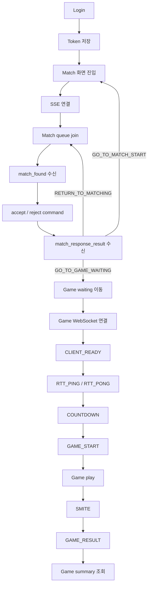

# Frontend Backend Flow Implementation Plan

## Feature Description

백엔드에서 구현된 인증, 매칭, SSE 알림, 게임 WebSocket, 결과 summary 흐름에 맞춰 Vue 프론트엔드 구현 순서를 정리한다.

이번 문서는 특정 화면 하나의 작업 문서가 아니라, 이후 프론트엔드 이슈를 어떤 순서로 나눠 구현해야 하는지 검증한 기준 문서다. 프론트는 백엔드 RestDocs, Controller, DTO, WebSocket message contract를 source of truth로 삼는다.

핵심 정책은 다음과 같다.

- `accept/reject` HTTP 응답은 화면 전환 기준이 아니라 command ack로 처리.
- 최종 매칭 결과와 게임 대기방 이동은 `match_response_result` SSE 이벤트 기준으로 처리.
- 게임 WebSocket은 `/ws/game/{gameRoomId}?token={accessToken}` 형식으로 연결.
- 게임 결과 화면의 summary 조회는 현재 백엔드 기준 `gameId = gameRoomId`로 처리.
- SSE는 백엔드가 `Authorization: Bearer`를 요구하지만 native `EventSource`는 Authorization header를 보낼 수 없으므로 인증 방식 계약 조정 필요.



## Backend Contract

| Flow | Backend Contract | Frontend 기준 |
|------|------------------|---------------|
| Login | `POST /api/v1/auth/login` | token 저장 후 `/match` 이동 |
| Match stream | `GET /api/v1/notifications/match/stream` | 매칭 화면 진입 시 연결 |
| Match join | `POST /api/v1/match/join` | 매칭 대기 상태 진입 |
| Match leave | `DELETE /api/v1/match/leave` | 매칭 시작 가능 상태 복귀 |
| Match found | SSE `match_found` | 수락/거절 모달 표시 |
| Match accept | `POST /api/v1/match/{matchId}/accept` | command ack로만 처리 |
| Match reject | `POST /api/v1/match/{matchId}/reject` | command ack로만 처리 |
| Match result | SSE `match_response_result` | 최종 화면 전환 기준 |
| Game socket | `/ws/game/{gameRoomId}?token={accessToken}` | 대기/RTT/게임 진행 message 처리 |
| Game summary | `GET /api/v1/games/{gameId}/summary` | 결과 화면 source of truth |

## Implementation Steps

### 1. Auth login 구현

- `/login` 페이지에 email/password 입력 폼 구현.
- `POST /api/v1/auth/login` 호출 구현.
- request `{ email, password }` 반영.
- response `{ accessToken, refreshToken, userId, nickname }` 반영.
- 성공 시 기존 `authToken.ts`에 access/refresh token 저장 구현.
- 성공 후 `/match` 이동 구현.
- 실패 시 전역 `ErrorResponse.message` 기준 에러 메시지 표시 구현.
- 회원가입, 비밀번호 찾기, OAuth 로그인은 후속 작업으로 보류.

### 2. Protected route guard 구현

- `/match`, `/game/:gameRoomId/waiting`, `/game/:gameRoomId/play`, `/game/:gameRoomId/result` 인증 필요 route로 처리.
- token 없으면 `/login` 이동 구현.
- token 있는 상태에서 `/login` 접근 시 `/match` 이동 구현.
- refresh token 자동 재발급은 후속 작업으로 보류.
- Pinia는 아직 도입하지 않고 기존 token storage와 작은 helper 중심으로 처리.

### 3. Match SSE 연결 정책 구현

- 매칭 화면 진입 시 `GET /api/v1/notifications/match/stream` 연결 구현.
- event `connected`, `heartbeat`, `match_found`, `match_response_result` 처리 구현.
- `connected`는 연결 확인 상태로 처리.
- `heartbeat`는 연결 유지 신호로 처리.
- `match_found`는 수락/거절 UI 표시 기준으로 처리.
- `match_response_result`는 최종 화면 전환 기준으로 처리.
- 현재 백엔드 Authorization header 요구와 native `EventSource` 제약 충돌은 blocker로 문서화.
- 실제 브라우저 연동 전 backend cookie auth, query token, fetch-event-source 중 하나로 계약 확정 필요.

### 4. Match queue 구현

- `/match` 페이지에서 매칭 시작/취소 UI 구현.
- `POST /api/v1/match/join` 호출 구현.
- `DELETE /api/v1/match/leave` 호출 구현.
- join 성공 후 “매칭 대기 중” 상태 표시 구현.
- leave 성공 후 “매칭 시작 가능” 상태 복귀 구현.
- 400/409 에러는 메시지 표시 후 현재 화면 유지 구현.
- 매칭 상태는 우선 페이지 로컬 상태로 처리.

### 5. match_found 처리 구현

- SSE `match_found` payload 수신 처리 구현.
- payload shape 반영.

```ts
interface MatchFoundNotification {
  matchId: string
  userId: number
  opponentUserId: number
  acceptTimeoutSeconds: number
  eventCreatedAt: string
}
```

- `matchId`를 accept/reject command에 사용할 값으로 저장.
- `acceptTimeoutSeconds` 기준 countdown 표시 구현.
- 수락/거절 모달 표시 구현.
- timeout 자체 판정은 프론트가 확정하지 않고 서버의 `match_response_result`를 최종 기준으로 사용.

### 6. Match accept/reject command 구현

- 수락 시 `POST /api/v1/match/{matchId}/accept` 호출 구현.
- 거절 시 `POST /api/v1/match/{matchId}/reject` 호출 구현.
- HTTP 200은 “요청 접수됨”으로만 처리.
- HTTP 성공 직후 게임방 이동 금지.
- HTTP 실패 응답에는 화면 전환용 action이 없으므로 에러 메시지 표시 후 SSE 최종 결과 대기 또는 매칭 시작 상태 복귀 정책 적용.
- `MATCH_012` 같은 lock 처리 중 에러는 모달 유지 후 SSE 최종 결과 대기 기준으로 처리.
- 그 외 매칭 응답 실패는 start 버튼 화면 복귀 기준으로 처리.

### 7. match_response_result 화면 전환 구현

- SSE `match_response_result` payload shape 반영.

```ts
interface MatchResponseResultNotification {
  matchId: string
  outcome: 'MATCHED' | 'FAILED'
  reason:
    | 'BOTH_ACCEPTED'
    | 'MY_REJECTED'
    | 'OPPONENT_REJECTED'
    | 'MY_TIMEOUT'
    | 'OPPONENT_TIMEOUT'
    | 'BOTH_TIMEOUT'
    | 'GAME_SETUP_FAILED'
  action: 'GO_TO_GAME_WAITING' | 'GO_TO_MATCH_START' | 'RETURN_TO_MATCHING'
  opponent: {
    userId: number
    nickname: string
    tier: string
    tierScore: number
  } | null
  game: {
    gameRoomId: number
    videoUrl: string
    webSocketUrl: string
  } | null
}
```

- `GO_TO_GAME_WAITING`이면 `game.gameRoomId` 기준으로 `/game/:gameRoomId/waiting` 이동 구현.
- `GO_TO_MATCH_START`이면 매칭 시작 가능 상태 복귀 구현.
- `RETURN_TO_MATCHING`이면 매칭 대기 상태 복귀 구현.
- `game`이 null인 실패 이벤트에서는 게임 화면 이동 금지.
- `game.videoUrl`, `game.webSocketUrl`은 게임 화면에서 사용할 수 있도록 route state 또는 session storage로 최소 보관 구현.
- 최종 전환 기준은 HTTP accept/reject 응답이 아니라 이 이벤트의 `action`임을 테스트로 검증.

### 8. Game waiting WebSocket 구현

- `/game/:gameRoomId/waiting` 페이지에서 WebSocket 연결 구현.
- 연결 URL은 `/ws/game/{gameRoomId}?token={accessToken}`로 구성.
- 연결 성공 후 `CLIENT_READY` 전송 버튼 또는 자동 ready 정책 구현.
- server message 처리 구현.

```ts
type GameWaitingServerMessage =
  | 'PLAYER_JOINED'
  | 'PLAYER_READY'
  | 'PLAYER_LEFT'
  | 'RTT_PING'
  | 'GAME_WAITING_TIMEOUT'
  | 'GAME_START_FAILED'
  | 'COUNTDOWN'
  | 'GAME_START'
  | 'ERROR'
```

- `PLAYER_JOINED`, `PLAYER_READY`, `PLAYER_LEFT`는 대기 상태 표시로 처리.
- `RTT_PING` 수신 시 즉시 `{ type: 'RTT_PONG', payload: { seq } }` 전송 구현.
- `GAME_WAITING_TIMEOUT`, `GAME_START_FAILED`, `ERROR`는 에러 표시 후 매칭 화면 복귀 기준으로 처리.
- WebSocket 재접속/복구는 후속 작업으로 보류.

### 9. Game start 처리 구현

- `COUNTDOWN` 수신 시 countdown 표시 구현.
- `GAME_START` 수신 시 `serverTime`, `startAt`, `scenario` 저장 구현.
- payload shape 반영.

```ts
interface GameStartPayload {
  gameRoomId: number
  serverTime: number
  startAt: number
  scenario: {
    dragonMaxHp: number
    durationMs: number
    hpTimeline: {
      timeMs: number
      hp: number
    }[]
  }
}
```

- `GAME_START` 수신 후 `/game/:gameRoomId/play` 이동 구현.
- HP 계산은 `startAt`과 `scenario.hpTimeline` 기준으로 구현.
- server/client clock 보정은 후속 고도화로 보류하고, 현재 단계에서는 백엔드가 내려준 `serverTime`, `startAt`을 그대로 사용.

### 10. Game play 구현

- `/game/:gameRoomId/play` 페이지에서 MP4 video 표시 구현.
- HP bar, countdown, smite button HUD 구현.
- `requestAnimationFrame` 기반 HP 표시 구현.
- SMITE 클릭 시 `{ type: 'SMITE', payload: null }` 전송 구현.
- SMITE payload에 임의 데이터 추가 금지.
- `ERROR` 수신 시 message 표시 구현.
- `GAME_RESULT` 수신 전까지 결과 화면 이동 금지.
- PixiJS, canvas, Web Worker는 MVP에서 도입하지 않음.

### 11. Game result WebSocket 처리 구현

- `GAME_RESULT` payload shape 반영.

```ts
interface GameResultPayload {
  gameRoomId: number
  result: 'PLAYER1_WIN' | 'PLAYER2_WIN' | 'DRAW'
  winnerUserId: number | null
  reason: string
  finishedAt: number
  actions: {
    userId: number
    serverReceiveTime: number
    smiteTimeMs: number
    dragonHpAtSmite: number
    damage: number
    afterHp: number
    isKill: boolean
  }[]
}
```

- `GAME_RESULT` 수신 후 `/game/:gameRoomId/result` 이동 구현.
- WebSocket result payload는 즉시 전환/임시 표시용으로만 사용.
- 최종 결과 source of truth는 summary API로 처리.

### 12. Game summary 구현

- `/game/:gameRoomId/result` 페이지에서 `GET /api/v1/games/{gameId}/summary` 호출 구현.
- 현재 백엔드 기준 `gameId = gameRoomId`로 호출.
- `PENDING`이면 `retryAfterMillis` 기준 polling 구현.
- `DONE`이면 `gameResult`, `winnerUserId`, `finishedAt`, `me`, `opponent` 표시 구현.
- 403/404/409 전역 `ErrorResponse` 처리 구현.
- `/match` 복귀 동선 구현.

```ts
type GameSummaryResponse =
  | {
      summaryStatus: 'PENDING'
      gameId: number
      retryAfterMillis: number
    }
  | {
      summaryStatus: 'DONE'
      gameId: number
      gameResult: 'PLAYER1_WIN' | 'PLAYER2_WIN' | 'DRAW'
      winnerUserId: number | null
      finishedAt: string
      me: GameSummaryPlayer
      opponent: GameSummaryPlayer
    }
```

## Implementation Policy

- `pages`는 route 단위 흐름 조립 담당.
- `services`는 HTTP/SSE/WebSocket 호출 담당.
- `components`는 표현 담당.
- `game`은 HP scenario, message factory, runtime 계산 담당.
- `types`는 백엔드 DTO, SSE event, WebSocket message type 담당.
- API 호출, 라우터 이동, WebSocket/EventSource 연결은 presentational component에 넣지 않음.
- Pinia, TanStack Query Vue, OAuth, 회원가입, 비밀번호 재설정, 자동 token refresh는 이번 흐름 구현에서 제외.
- accept/reject 이후 전환을 HTTP response 기준으로 구현하지 않도록 테스트에 명시.
- SSE 인증 충돌은 프론트 단독으로 숨기지 않고 blocker로 명시.

## Test Plan

- 로그인 성공 시 token 저장 및 `/match` 이동 검증.
- 로그인 실패 시 에러 메시지 표시 검증.
- protected route token 없을 때 `/login` 이동 검증.
- token 있는 상태에서 `/login` 접근 시 `/match` 이동 검증.
- match SSE event listener 등록 검증.
- join/leave API 호출 검증.
- `match_found` 수신 시 수락/거절 UI 표시 검증.
- accept/reject 200 이후 즉시 이동하지 않는 것 검증.
- `match_response_result.action === GO_TO_GAME_WAITING`일 때만 waiting 이동 검증.
- 실패 action 수신 시 매칭 화면 상태 복귀 검증.
- WebSocket URL에 `?token=` 포함 검증.
- `RTT_PING` 수신 시 `RTT_PONG` 전송 검증.
- `COUNTDOWN` 수신 시 countdown 상태 표시 검증.
- `GAME_START` 수신 시 play 이동 및 scenario 저장 검증.
- SMITE 전송 payload가 null인지 검증.
- `GAME_RESULT` 수신 후 result 이동 검증.
- summary `PENDING` polling 검증.
- summary `DONE` 결과 표시 검증.

## Known Blocker

### SSE 인증 방식 충돌

현재 백엔드 RestDocs는 match stream 요청에 `Authorization: Bearer access-token` header를 요구한다.

```text
GET /api/v1/notifications/match/stream
Authorization: Bearer access-token
Accept: text/event-stream
```

하지만 브라우저 native `EventSource`는 custom `Authorization` header를 설정할 수 없다.

따라서 실제 브라우저 연동 전 다음 중 하나를 백엔드/프론트 계약으로 확정해야 한다.

- Cookie 기반 인증으로 SSE 연결 구현.
- SSE 전용 query token 정책 구현.
- native `EventSource` 대신 header 설정이 가능한 fetch 기반 SSE client 사용.

현재 프론트 skeleton은 native `EventSource` 기준이므로, 이 계약이 확정되기 전까지 SSE 실연동은 blocker로 본다.

## Issue Split Recommendation

- Issue 1: 로그인 페이지와 인증 route guard 구현.
- Issue 2: 매칭 페이지 join/leave 구현.
- Issue 3: SSE 인증 계약 확정 및 match stream 연결 구현.
- Issue 4: match_found 모달과 accept/reject command 구현.
- Issue 5: match_response_result 기반 화면 전환 구현.
- Issue 6: game waiting WebSocket과 ready/RTT 처리 구현.
- Issue 7: game play video/HUD/SMITE 구현.
- Issue 8: GAME_RESULT 처리와 summary 결과 화면 구현.
- Issue 9: 공통 UI, 테스트, 문서 정합성 정리.

## Assumptions

- 이 문서는 `docs/antigravity/frontend/font-plan.md`로 유지.
- 백엔드 RestDocs와 Java DTO를 source of truth로 사용.
- `match_response_result.game.webSocketUrl`은 `/ws/game/{gameRoomId}` 형식이며, 실제 프론트 연결 시 access token query를 붙임.
- 결과 summary의 `gameId`는 현재 백엔드 문서 기준 `gameRoomId`와 동일하게 사용.
- 프론트는 “작게 연결하고 후속 고도화” 원칙을 유지.
