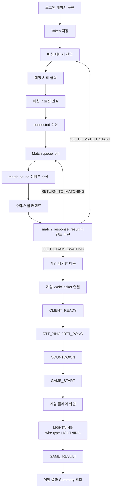

# Frontend Backend Flow Implementation Plan

## Feature Description

백엔드에서 구현된 인증, 매칭, SSE 알림, 게임 WebSocket, 결과 summary 흐름에 맞춰 Vue 프론트엔드 구현 순서를 정리한다.

이번 문서는 특정 화면 하나의 작업 문서가 아니라, 이후 프론트엔드 이슈를 어떤 순서로 나눠 구현해야 하는지 검증한 기준 문서다. 프론트는 백엔드 RestDocs, Controller, DTO, WebSocket message contract를 source of truth로 삼는다.

핵심 정책은 다음과 같다.

- `accept/reject` HTTP 응답은 화면 전환 기준이 아니라 command ack로 처리.
- 최종 매칭 결과와 게임 대기방 이동은 `match_response_result` SSE 이벤트 기준으로 처리.
- 게임 WebSocket은 백엔드가 내려준 `game.webSocketUrl`을 source로 사용하고, access token은 query parameter로 붙여 연결.
- 게임 결과 화면의 summary 조회는 현재 백엔드 기준 `gameId = gameRoomId`로 처리.
- SSE는 백엔드의 `Authorization: Bearer` 계약을 유지하고, native `EventSource` 대신 `@microsoft/fetch-event-source`로 header 기반 연결을 구현.
- 사용자-facing 명칭은 League of Star / LIGHTNING / Star Core로 통일하되, 현재 백엔드 WebSocket wire type `LIGHTNING`와 `lightningTimeMs`, `starCoreHpAtLightning`, `starCoreMaxHp` 레거시 payload 필드는 호환 계약으로 유지.



## Backend Contract

| Flow         | Backend Contract                             | Frontend 기준                          |
| ------------ | -------------------------------------------- | -------------------------------------- |
| Login        | `POST /api/v1/auth/login`                    | token 저장 후 `/match` 이동            |
| Match stream | `GET /api/v1/notifications/match/stream`     | 매칭 시작 클릭 후, join 호출 전에 연결 |
| Match join   | `POST /api/v1/match/join`                    | 매칭 대기 상태 진입                    |
| Match leave  | `DELETE /api/v1/match/leave`                 | 매칭 시작 가능 상태 복귀               |
| Match found  | SSE `match_found`                            | 수락/거절 모달 표시                    |
| Match accept | `POST /api/v1/match/{matchId}/accept`        | command ack로만 처리                   |
| Match reject | `POST /api/v1/match/{matchId}/reject`        | command ack로만 처리                   |
| Match result | SSE `match_response_result`                  | 최종 화면 전환 기준                    |
| Game socket  | `game.webSocketUrl` + `?token={accessToken}` | 대기/RTT/게임 진행 message 처리        |
| Game summary | `GET /api/v1/games/{gameId}/summary`         | 결과 화면 source of truth              |

## Implementation Steps

### 1. [x] 로그인 페이지 구현

- `/login` 페이지에 email/password 입력 폼 구현.
- `POST /api/v1/auth/login` 호출 구현.
- request `{ email, password }` 반영.
- response `{ accessToken, refreshToken, userId, nickname }` 반영.
- 성공 시 기존 `authToken.ts`에 access/refresh token 저장 구현.
- `userId`, `nickname`은 이번 단계에서 전역 저장하지 않고 후속 profile/auth state 정책에서 결정.
- 성공 후 `/match` 이동 구현.
- 실패 시 전역 `ErrorResponse.message` 기준 에러 메시지 표시 구현.
- 네트워크 오류, CORS 오류, AbortError, timeout 등 transport 계층 오류는 이번 단계에서 client fallback message로 처리하고, 세분화는 공통 error handling 이슈에서 진행.
- 회원가입은 issue-98에서 `/signup` 독립 페이지와 `POST /api/v1/auth/signUp` 연동으로 구현.
- 비밀번호 찾기, OAuth 로그인은 후속 작업으로 보류.

### 1-1. [x] 회원가입 페이지 구현

- `/signup` route를 `guestOnly`로 추가.
- `POST /api/v1/auth/signUp` 호출 구현.
- request `{ email, password, nickname }` 반영.
- response `{ id, email, nickname }` 반영.
- 회원가입 성공은 로그인 상태가 아니므로 access/refresh token을 저장하지 않음.
- 성공 후 `/login?signup=success` 이동 구현.
- 실패 시 전역 `ErrorResponse.message` 기준 에러 메시지 표시 구현.
- LoginPage의 회원가입 버튼을 `/signup` route로 연결.
- 회원가입은 모달이 아니라 독립 페이지로 구현해 직접 접근, 새로고침, 뒤로가기, route guard 정책을 명확히 유지.

### 2. [x] 인증 라우트 가드 구현

- `/match`, `/game/:gameRoomId/waiting`, `/game/:gameRoomId/play`, `/game/:gameRoomId/result` 인증 필요 route로 처리.
- token 없으면 `/login` 이동 구현.
- token 있는 상태에서 `/login` 접근 시 `/match` 이동 구현.
- refresh token 자동 재발급은 후속 작업으로 보류.
- 만료된 access token으로 API 호출 시 refresh/retry 처리 정책은 후속 token refresh 이슈에서 결정.
- Pinia는 아직 도입하지 않고 기존 token storage와 작은 helper 중심으로 처리.
- 현재 token 저장소는 `localStorage`이며, XSS 대비 저장 전략 변경 여부는 인증 보안 고도화 이슈에서 결정.
- route guard는 access token 존재 여부만 판단하는 MVP 정책으로 구현.
- route guard 단위 테스트와 router meta 정합성 테스트로 protected/guest only/public route 정책 검증.

### 2-1. [x] 로그아웃 구현

- MatchPage 로그아웃 버튼을 실제 인증 세션 종료 흐름에 연결.
- 로그아웃 버튼 클릭 시 즉시 logout하지 않고 확인 모달을 먼저 표시.
- `POST /api/v1/auth/logout` 호출 구현.
- request `{ refreshToken }` 반영.
- logout API는 인증 API이므로 기존 `apiClient` Authorization header 기본 정책 유지.
- backend logout 성공/실패와 무관하게 `clearAuthTokens()` 호출 구현.
- refresh token이 없으면 backend logout 호출 없이 local token clear 후 `/login` 이동 구현.
- queued/joining 상태에서는 `leaveMatchQueue()`를 먼저 시도한 뒤 logout 진행.
- queue leave 실패는 local logout을 막지 않음.
- `match_found`, accept/reject command 진행 중 logout은 매칭 응답 정책과 섞지 않도록 차단.
- 게임 대기/플레이 중 logout과 이탈 정산은 후속 이슈에서 다룸.

### 3. [x] SSE 인증 계약 확정 및 매칭 스트림 연결 구현

- `GET /api/v1/notifications/match/stream` 연결 client 구현.
- issue-78부터 화면 진입 즉시 연결하지 않고, 매칭 시작 클릭 후 `connected` 수신까지 확인한 뒤 join을 호출하는 lifecycle로 사용.
- event `connected`, `heartbeat`, `match_found`, `match_response_result` 처리 구현.
- `connected`는 연결 확인 상태로 처리.
- `heartbeat`는 연결 유지 신호로 처리.
- `match_found`는 이번 단계에서 payload 보관까지만 처리하고, 수락/거절 UI는 후속 이슈에서 구현.
- `match_response_result`는 이번 단계에서 payload 보관까지만 처리하고, 최종 화면 전환은 후속 이슈에서 구현.
- 백엔드 Authorization header 요구와 native `EventSource` 제약 충돌은 `@microsoft/fetch-event-source` 도입으로 해소.
- query token 방식은 token 노출 위험 때문에 사용하지 않음.
- cookie auth 전환은 백엔드 인증 전략 변경 범위이므로 이번 단계에서 제외.
- token 만료에 따른 refresh/retry는 후속 token refresh 이슈에서 구현.

### 4. [x] 매칭 페이지 구현

- `/match` 페이지에서 매칭 시작/취소 UI 구현.
- 매칭 시작 클릭 시 먼저 `GET /api/v1/notifications/match/stream` 연결 구현.
- SSE `connected` 수신 후 `POST /api/v1/match/join` 호출 구현.
- `POST /api/v1/match/join` 호출 구현.
- `DELETE /api/v1/match/leave` 호출 구현.
- join 성공 후 “매칭 대기 중” 상태 표시 구현.
- leave 성공 후 “매칭 시작 가능” 상태 복귀 및 매칭 SSE close 구현.
- 400/409 에러는 메시지 표시 후 현재 화면 유지 구현.
- 매칭 상태는 우선 페이지 로컬 상태로 처리.

### 5. [x] 매칭 성사 모달 구현

- SSE `match_found` payload 수신 처리 구현.
- payload shape 반영.

```ts
interface MatchFoundNotification {
  matchId: string;
  userId: number;
  opponentUserId: number;
  acceptTimeoutSeconds: number;
  eventCreatedAt: string;
}
```

- `matchId`를 accept/reject command에 사용할 값으로 저장.
- `acceptTimeoutSeconds` 기준 countdown 표시 구현.
- 수락/거절 모달 표시 구현.
- timeout 자체 판정은 프론트가 확정하지 않고 서버의 `match_response_result`를 최종 기준으로 사용.

### 6. [x] 매칭 수락/거절 커맨드 구현

- 수락 시 `POST /api/v1/match/{matchId}/accept` 호출 구현.
- 거절 시 `POST /api/v1/match/{matchId}/reject` 호출 구현.
- HTTP 200은 “요청 접수됨”으로만 처리.
- HTTP 성공 직후 게임방 이동 금지.
- HTTP 실패 응답에는 화면 전환용 action이 없으므로 에러 메시지 표시 후 SSE 최종 결과 대기 또는 매칭 시작 상태 복귀 정책 적용.
- `MATCH_012` 같은 lock 처리 중 에러는 모달 유지 후 SSE 최종 결과 대기 기준으로 처리.
- 그 외 매칭 응답 실패는 start 버튼 화면 복귀 기준으로 처리.

### 7. [x] 매칭 응답 결과 화면 전환 구현

- SSE `match_response_result` payload shape 반영.

```ts
interface MatchResponseResultNotification {
  matchId: string;
  outcome: "MATCHED" | "FAILED";
  reason:
    | "BOTH_ACCEPTED"
    | "MY_REJECTED"
    | "OPPONENT_REJECTED"
    | "MY_TIMEOUT"
    | "OPPONENT_TIMEOUT"
    | "BOTH_TIMEOUT"
    | "GAME_SETUP_FAILED";
  action: "GO_TO_GAME_WAITING" | "GO_TO_MATCH_START" | "RETURN_TO_MATCHING";
  opponent: {
    userId: number;
    nickname: string;
    tier: string;
    tierScore: number;
  } | null;
  game: {
    gameRoomId: number;
    webSocketUrl: string;
  } | null;
}
```

- `GO_TO_GAME_WAITING`이면 `game.gameRoomId` 기준으로 `/game/:gameRoomId/waiting` 이동 구현.
- `GO_TO_MATCH_START`이면 매칭 시작 가능 상태 복귀 구현.
- `RETURN_TO_MATCHING`이면 매칭 대기 상태 복귀 구현.
- `GO_TO_GAME_WAITING`, `GO_TO_MATCH_START`는 매칭 SSE를 닫고, `RETURN_TO_MATCHING`은 백엔드 큐 복귀 완료 이벤트로 보고 SSE를 유지.
- `RETURN_TO_MATCHING`에서는 `joinMatchQueue`, `leaveMatchQueue`를 호출하지 않음.
- `game`이 null인 실패 이벤트에서는 게임 화면 이동 금지.
- 최종 전환 기준은 HTTP accept/reject 응답이 아니라 이 이벤트의 `action`임을 테스트로 검증.

### 8. [x] 게임 대기방 WebSocket 구현

- `/game/:gameRoomId/waiting` 페이지에서 WebSocket 연결 구현.
- 연결 URL은 백엔드가 `match_response_result.game.webSocketUrl`로 내려준 값을 source로 사용하고, access token query를 append해 구성.
- server message 처리 구현.

```ts
type GameWaitingServerMessage =
  | "PLAYER_JOINED"
  | "PLAYER_READY"
  | "PLAYER_LEFT"
  | "RTT_PING"
  | "GAME_WAITING_TIMEOUT"
  | "GAME_START_FAILED"
  | "COUNTDOWN"
  | "GAME_START"
  | "ERROR";
```

- `PLAYER_JOINED`, `PLAYER_READY`, `PLAYER_LEFT`는 대기 상태 표시로 처리.
- `RTT_PING` 수신 시 즉시 `{ type: 'RTT_PONG', payload: { seq } }` 전송 구현.
- `GAME_WAITING_TIMEOUT`, `GAME_START_FAILED`, `ERROR`는 에러 표시 후 매칭 화면 복귀 기준으로 처리.
- `COUNTDOWN`, `GAME_START`는 수신 가능하게 유지하되 이번 단계에서는 play route 이동을 발생시키지 않음.
- Game Waiting loading bar는 payload 수신율로 유지하고 WebSocket progress와 섞지 않음.
- WebSocket 재접속/복구는 후속 작업으로 보류.

### 9. [x] 게임 시작 처리 구현

- `COUNTDOWN` 수신 시 countdown 표시 구현.
- `GAME_START` 수신 시 `serverTime`, `startAt`, `scenario` 저장 구현.
- payload shape 반영.

```ts
interface GameStartPayload {
  gameRoomId: number;
  serverTime: number;
  startAt: number;
  scenario: {
    starCoreMaxHp?: number;
    starCoreMaxHp?: number; // legacy backend payload
    durationMs: number;
    hpTimeline: {
      timeMs: number;
      hp: number;
    }[];
  };
}
```

- `GAME_START` 수신 후 `/game/:gameRoomId/play` 이동 구현.
- HP 계산은 `startAt`과 `scenario.hpTimeline` 기준으로 구현.
- server/client clock 보정은 후속 고도화로 보류하고, 현재 단계에서는 백엔드가 내려준 `serverTime`, `startAt`을 그대로 사용.

### 10. [x] 게임 플레이 화면 구현

- `/game/:gameRoomId/play` 페이지에서 Three.js 기반 galaxy background 구현.
- galaxy background는 카메라 주변 star sphere와 전방 star mist로 구성해 진입 직후 확대된 별무리가 화면을 채우게 구현.
- 배경 animation은 별 평면 이동이 아니라 viewer/camera 기준의 느린 시점 회전으로 구현.
- 게임 진입마다 카메라 yaw/pitch/roll, 배경 회전 phase, 스타 코어 이동 phase를 프론트 랜덤 시각 연출로 다르게 시작하게 구현.
- 이 랜덤값은 화면 재미를 위한 visual-only 값이며 `LIGHTNING` 판정 payload나 백엔드 source of truth에는 포함하지 않음.
- 움직이는 타겟의 본체 이미지는 `frontend/img/character-cutout.png`를 사용하고, 기존 glow/빛 잔상 motion은 유지함.
- 체크무늬 배경이 제거된 `character-cutout.png` alpha PNG만 런타임 asset으로 유지함.
- HP indicator는 캐릭터 얼굴을 가리지 않도록 타겟 위쪽으로 분리하고, 잔상은 캐릭터 뒤쪽 레이어로 유지함.
- 타겟 이동은 목적지마다 감속하는 segment easing 대신 velocity steering으로 처리해 중간 멈칫임을 줄임.
- 캐릭터 texture는 alpha edge, texture filter, halo opacity를 조정해 배경 glow 속에서도 더 선명하게 보이도록 처리함.
- 백엔드 payload 필드명 `starCoreMaxHp`/`hpTimeline`은 HP source 계약으로 유지하며 visual asset 이름과 섞지 않음.
- HP bar, countdown, LIGHTNING button HUD는 후속 전투 UI 단계로 보류.
- `requestAnimationFrame` 기반 배경 animation 구현.
- LIGHTNING 클릭 UI와 `{ type: 'LIGHTNING', payload: null }` 전송은 후속 전투 UI 단계로 보류.
- `ERROR` 수신 상태는 data attribute로 유지하고 message 표시는 후속 전투 UI 단계로 보류.
- `GAME_RESULT` 수신 전까지 결과 화면 이동 금지.
- PixiJS, Web Worker는 MVP에서 도입하지 않음.
- Three.js 구현을 위해 `three`, `@types/three` 추가.

### 11. [x] LIGHTNING 전투 입력 UI 구현

- `/game/:gameRoomId/play`에서 사용자가 LIGHTNING을 2초 쿨타임으로 반복 입력할 수 있는 UI 구현.
- 입력 방식은 D/F 키로 스킬을 시전하고, Three.js 스타 코어 hover 중일 때만 백엔드 LIGHTNING을 전송하도록 구현. 최종 HP/kill 판정은 프론트가 하지 않음.
- WebSocket 전송 payload는 백엔드 계약대로 `{ type: 'LIGHTNING', payload: null }`만 사용.
- 클라이언트 timestamp, HP, elapsed time, target 좌표는 payload에 포함하지 않음.
- 서버 판정 source of truth는 WebSocket 수신 시각과 백엔드 `GAME_START` scenario임.
- 유저별 2초 쿨타임으로 반복 전송을 제한하고, 서버 LIGHTNING_APPLIED.cooldownUntil 기준으로 내 cooldown을 보정.
- 내 스펠 HUD만 중앙 하단에 표시하고, LIGHTNING 시각 효과는 번개 줄기가 아닌 impact burst로 표현. hover miss는 흰색, 내 hit는 파란색, 상대 hit는 빨간색으로 구분.
- 전송 직후 승패를 프론트에서 확정하지 않고 `GAME_RESULT` 수신을 기다림.
- 전송 실패나 WebSocket close/error는 화면 상태로 표시하고, 서버 결과를 임의 생성하지 않음.
- `GAME_RESULT` route 이동과 summary API 호출은 다음 이슈로 유지.

### 12. [x] 게임 결과 WebSocket 처리 구현

- `GAME_RESULT` payload shape 반영.

```ts
interface GameResultPayload {
  gameRoomId: number;
  result: "PLAYER1_WIN" | "PLAYER2_WIN" | "DRAW";
  winnerUserId: number | null;
  reason: string;
  finishedAt: number;
  actions: {
    userId: number;
    serverReceiveTime: number;
    lightningTimeMs: number;
    starCoreHpAtLightning: number;
    damage: number;
    afterHp: number;
    isKill: boolean;
  }[];
}
```

- `GAME_RESULT` 수신 후 `/game/:gameRoomId/result` 이동 구현.
- WebSocket result payload는 즉시 전환/임시 표시용으로만 사용.
- 최종 결과 source of truth는 summary API로 처리.
- `YOU WIN`/`YOU LOSE`/`DRAW` 최소 표시는 저장된 `GAME_RESULT.winnerUserId`와 waiting payload의 opponent 기준으로 해석.

### 13. [x] 게임 결과 Summary 화면 구현

- `/game/:gameRoomId/result` 페이지에서 `GET /api/v1/games/{gameId}/summary` 호출 구현.
- 현재 백엔드 기준 `gameId = gameRoomId`로 호출.
- `PENDING`이면 `retryAfterMillis` 기준 polling 구현.
- `DONE`이면 `gameResult`, `winnerUserId`, `finishedAt`, `me`, `opponent` 표시 구현.
- 403/404/409 전역 `ErrorResponse` 처리 구현.
- `/match` 복귀 동선 구현.

```ts
type GameSummaryResponse =
  | {
      summaryStatus: "PENDING";
      gameId: number;
      retryAfterMillis: number;
    }
  | {
      summaryStatus: "DONE";
      gameId: number;
      gameResult: "PLAYER1_WIN" | "PLAYER2_WIN" | "DRAW";
      winnerUserId: number | null;
      finishedAt: string;
      me: GameSummaryPlayer;
      opponent: GameSummaryPlayer;
    };
```

## Implementation Policy

- `pages`는 route 단위 흐름 조립 담당.
- `services`는 HTTP/SSE/WebSocket 호출 담당.
- `components`는 표현 담당.
- `game`은 HP scenario, message factory, runtime 계산 담당.
- `types`는 백엔드 DTO, SSE event, WebSocket message type 담당.
- API 호출, 라우터 이동, WebSocket/EventSource 연결은 presentational component에 넣지 않음.
- Pinia, TanStack Query Vue, OAuth, 비밀번호 재설정, 자동 token refresh는 이번 흐름 구현에서 제외.
- `accessToken`, `refreshToken` 외 `userId`, `nickname` 저장 위치와 profile 조회 전략은 후속 auth state/profile 이슈에서 결정.
- transport error 세분화와 request abort 처리는 공통 service/error handling 이슈에서 결정.
- accept/reject 이후 전환을 HTTP response 기준으로 구현하지 않도록 테스트에 명시.
- SSE는 `@microsoft/fetch-event-source`로 Authorization header를 전달하고, native `EventSource`와 query token은 사용하지 않음.

## Test Plan

- 로그인 성공 시 token 저장 및 `/match` 이동 검증.
- 로그인 실패 시 에러 메시지 표시 검증.
- protected route token 없을 때 `/login` 이동 검증.
- token 있는 상태에서 `/login` 접근 시 `/match` 이동 검증.
- match SSE Authorization header 연결 검증.
- match SSE event dispatch 검증.
- match page mount/unmount stream lifecycle 검증.
- join/leave API 호출 검증.
- `match_found` 수신 시 수락/거절 UI 표시 검증.
- accept/reject 200 이후 즉시 이동하지 않는 것 검증.
- `match_response_result.action === GO_TO_GAME_WAITING`일 때만 waiting 이동 검증.
- 실패 action 수신 시 매칭 화면 상태 복귀 검증.
- WebSocket URL에 `?token=` 포함 검증.
- `RTT_PING` 수신 시 `RTT_PONG` 전송 검증.
- `COUNTDOWN` 수신 시 countdown 상태 표시 검증.
- `GAME_START` 수신 시 play 이동 및 scenario 저장 검증.
- hover + `D`/`F` 입력 시 `{ type: 'LIGHTNING', payload: null }`이 전송되고, 2초 cooldown 중 재입력이 막히는지 검증.
- hover가 아닌 상태의 `D`/`F` 입력은 마우스 위치 impact와 cooldown만 적용하고 payload를 전송하지 않는지 검증.
- LIGHTNING 전송 payload에 timestamp, HP, elapsed time, target 좌표가 포함되지 않는지 검증.
- LIGHTNING 전송 후 프론트가 HP/승패를 즉시 확정하지 않고 `LIGHTNING_APPLIED`와 `GAME_RESULT`를 기다리는지 검증.
- 2초 쿨타임 중 LIGHTNING 재입력이 막히는지 검증.
- 2초 쿨타임 종료 후 LIGHTNING 재입력이 가능한지 검증.
- 내 스펠 HUD 중앙 하단 배치와 상대 스펠 HUD 미표시 검증.
- hover miss 흰색 impact, 내 LIGHTNING hit 파란 impact, 상대 LIGHTNING hit 빨간 impact 검증.
- 처치 승자는 `GAME_RESULT.winnerUserId` 기준으로 해석되는지 검증.
- `GAME_RESULT` 수신 후 result 이동 검증.
- summary `PENDING` polling 검증.
- summary `DONE` 결과 표시 검증.

## Resolved Decision

### SSE 인증 방식

백엔드 RestDocs는 match stream 요청에 `Authorization: Bearer access-token` header를 요구한다.

```text
GET /api/v1/notifications/match/stream
Authorization: Bearer access-token
Accept: text/event-stream
```

브라우저 native `EventSource`는 custom `Authorization` header를 설정할 수 없으므로 사용하지 않는다.

확정한 방식은 다음과 같다.

- `@microsoft/fetch-event-source` 기반으로 SSE 연결 구현.
- 기존 백엔드 `Authorization: Bearer {accessToken}` header 계약 유지.
- query token 방식은 token 노출 위험 때문에 사용하지 않음.
- cookie auth 전환은 백엔드 인증 전략 변경 범위이므로 이번 흐름에서 제외.
- access token 없음, 401/403, 네트워크 오류는 page local error 상태로 처리.
- token refresh/retry는 후속 auth 이슈에서 구현.

## Issue Split Recommendation

- [x] 로그인 페이지 구현.
- [x] 인증 라우트 가드 구현.
- [x] SSE 인증 계약 확정 및 매칭 스트림 연결 구현.
- [x] 매칭 페이지 구현.
- [x] 매칭 성사 모달 구현.
- [x] 매칭 수락/거절 커맨드 구현.
- [x] 매칭 응답 결과 화면 전환 구현.
- [x] 게임 대기방 WebSocket 구현.
- [x] 게임 시작 처리 구현.
- [x] 게임 플레이 화면 구현.
- [x] LIGHTNING 전투 입력 UI 구현.
- [x] 게임 결과 WebSocket 처리 구현.
- [x] 게임 결과 Summary 화면 구현.
- [x] 공통 UI, 테스트, 문서 정합성 정리.

## Assumptions

- 이 문서는 `docs/antigravity/frontend/front-plan.md`로 유지.
- 백엔드 RestDocs와 Java DTO를 source of truth로 사용.
- `match_response_result.game.webSocketUrl`은 `/ws/game/{gameRoomId}` 형식이며, 실제 프론트 연결 시 access token query를 붙임.
- 결과 summary의 `gameId`는 현재 백엔드 문서 기준 `gameRoomId`와 동일하게 사용.
- 프론트는 “작게 연결하고 후속 고도화” 원칙을 유지.
