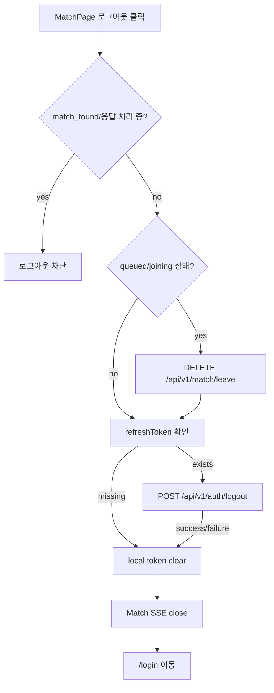
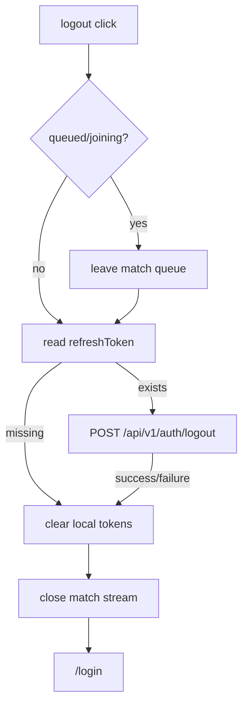

# Issue 100. Logout

## Feature Description

이번 이슈는 `docs/last-구현.md`의 `Section 1-2. 로그아웃 구현` 범위를 구현한다. 현재 `MatchPage` 상단에는 로그아웃 버튼 UI가 있지만 실제 인증 정보 제거, 백엔드 refresh token revoke, route 이동이 연결되어 있지 않다.



이번 이슈의 핵심은 서버 refresh token revoke와 브라우저 세션 종료 책임을 분리하는 것이다. 백엔드 logout API는 가능하면 호출하지만, 실패하더라도 사용자가 로그아웃을 요청한 현재 브라우저 세션은 반드시 종료한다.

이번 이슈에 포함되는 범위:

- `POST /api/v1/auth/logout` service 추가.
- MatchPage 로그아웃 버튼 handler 연결.
- 로그아웃 확인 모달 추가.
- queued/joining 상태에서 queue leave 후 logout 진행.
- backend logout 실패 여부와 무관한 local token clear.
- logout 후 `/login` 이동.
- Test/문서 정합성 반영.

후속 이슈로 미루는 범위:

- token refresh/retry 공통 처리.
- access token blacklist 정책.
- 게임 대기/플레이 중 이탈 정산과 로그아웃 정책.
- OAuth logout.
- 새 패키지 추가.

## Backend Contract

Logout API:

```http
POST /api/v1/auth/logout
Authorization: Bearer {accessToken}
Content-Type: application/json
```

Request:

```ts
interface LogoutRequest {
  refreshToken: string;
}
```

Response:

```http
200 OK
```

백엔드 계약 기준:

- 현재 백엔드 `AuthPath.LOGOUT`는 `/api/v1/auth/logout`이다.
- request body는 기존 `TokenRefreshRequest`와 동일하게 `{ refreshToken }`이다.
- logout 성공 응답은 body 없는 `200 OK`다.
- refresh token revoke는 백엔드 `AuthService.logout(refreshToken)` 책임이다.
- access token blacklist는 후속 검토 범위다.

프론트 처리 기준:

- access token은 기존 `apiClient` 기본 Authorization header 정책을 그대로 사용한다.
- logout API에는 `auth: false`를 설정하지 않는다.
- refresh token은 `getRefreshToken()`에서 읽어 request body로 전달한다.
- refresh token이 없으면 backend logout 호출 없이 local token clear 후 `/login`으로 이동한다.
- backend logout 실패 여부와 무관하게 `clearAuthTokens()`는 반드시 수행한다.
- logout은 인증 세션 종료 기능이며 게임 결과/이탈 정산과 섞지 않는다.

## Scope Boundary

이번 이슈에 포함:

- `LogoutRequest` 타입 추가.
- `authService.logout` 구현.
- MatchPage 로그아웃 버튼 handler 연결.
- 로그아웃 버튼 클릭 시 즉시 logout하지 않고 확인 모달 표시.
- 로그아웃 중 중복 클릭 방지.
- queued/joining 상태에서는 `leaveMatchQueue()` 후 logout 진행.
- ready 상태에서는 바로 logout 진행.
- backend logout 성공/실패/refreshToken 없음 모두 local token clear.
- logout finalizer에서 Match SSE close.
- `/login` 이동.
- Unit test 추가.
- `docs/last-구현.md`, `front-plan.md` 정합성 반영.
- issue-100 PR 섹션 보강.

이번 이슈에서 제외:

- backend logout endpoint 변경.
- refresh token rotation/retry.
- access token blacklist.
- MatchPage profile/rank 실데이터 전환.
- 게임 대기/플레이 화면 logout.
- match_found/accept/reject 진행 중 logout 허용.
- 새 패키지 추가.

## Tasks

### 1. Backend Contract 재확인

- [x] 백엔드 `AuthPath.LOGOUT`가 `/api/v1/auth/logout`인지 확인.
- [x] request body가 `{ refreshToken }`인지 확인.
- [x] response가 body 없는 `200 OK`인지 확인.
- [x] logout API는 Authorization header 기본 정책을 따른다는 점 문서화.
- [x] backend logout 실패와 local token clear 책임을 분리해 문서화.

### 2. Auth Logout Service 구현

- [x] `LogoutRequest` 타입 추가.
- [x] `authService.logout(refreshToken)` 구현.
- [x] `POST /api/v1/auth/logout` 호출 구현.
- [x] request body `{ refreshToken }` 전달.
- [x] `auth: false`를 사용하지 않도록 구현.
- [x] service는 API 호출만 담당하고 token clear/router 이동을 하지 않음.

### 3. MatchPage Logout Flow 구현

- [x] 로그아웃 버튼에 click handler 연결.
- [x] 로그아웃 버튼 클릭 시 확인 모달 표시.
- [x] `isLoggingOut` 상태 추가.
- [x] 로그아웃 중 버튼 중복 클릭 방지.
- [x] ready 상태에서는 바로 logout 진행.
- [x] queued/joining 상태에서는 `leaveMatchQueue()` 후 logout 진행.
- [x] queue leave 실패 여부와 무관하게 logout finalizer 진행.
- [x] refresh token이 있으면 backend logout 호출.
- [x] refresh token이 없으면 backend logout 호출 생략.
- [x] backend logout 실패 여부와 무관하게 `clearAuthTokens()` 호출.
- [x] Match SSE close.
- [x] `/login` 이동.

### 4. Active Match Response 상태 정책 구현

- [x] `match_found` modal open 상태에서 logout 차단.
- [x] accept/reject command pending 상태에서 logout 차단.
- [x] match response result 처리 중 logout 차단.
- [x] 차단 상태는 기존 매칭 응답/전환 정책과 섞지 않도록 문서화.

### 5. Test 구현

- [x] `authService.logout` endpoint/body/auth 기본 정책 검증.
- [x] ready 상태 logout 성공 시 backend logout, token clear, `/login` 이동 검증.
- [x] 로그아웃 확인 모달 취소 시 backend logout과 token clear 미호출 검증.
- [x] refresh token 없음 상태에서 backend logout 미호출, token clear, `/login` 이동 검증.
- [x] backend logout 실패 시에도 token clear, `/login` 이동 검증.
- [x] queued 상태 logout 시 `leaveMatchQueue()` 후 logout 진행 검증.
- [x] queue leave 실패 시에도 logout finalizer 진행 검증.
- [x] match_found/accept/reject 진행 중 logout 차단 검증.
- [x] logout 중 중복 클릭이 추가 요청을 만들지 않는지 검증.
- [x] logout 후 `/match` 접근 시 route guard가 `/login`으로 보내는지 기존 테스트와 정합성 확인.

### 6. 문서 정합성 구현

- [x] `docs/last-구현.md` Section 1-2 완료 상태 반영.
- [x] `front-plan.md` logout 구현 상태 반영.
- [x] issue-100 task 완료 상태 반영.
- [x] PR 섹션을 계약/정책 중심으로 보강.

### 7. 검증

- [x] `npm run test -- authService MatchPage authGuard router` 검증.
- [x] `npm run format` 검증.
- [x] `npm run lint` 검증.
- [x] `npm run typecheck` 검증.
- [x] `npm run test` 검증.
- [x] `npm run build` 검증.

## Implementation Policy

- 백엔드 endpoint는 현재 계약인 `/api/v1/auth/logout`을 그대로 사용한다.
- logout API는 인증 API이므로 기존 `apiClient` Authorization header 기본 정책을 유지한다.
- request body는 `{ refreshToken }`이다.
- `authService.logout`은 API 호출만 담당한다.
- `clearAuthTokens()`와 route 이동은 page flow에서 조립한다.
- 로그아웃 버튼 클릭은 즉시 logout이 아니라 사용자 확인 모달을 먼저 표시한다.
- backend logout 실패는 local logout을 막지 않는다.
- refresh token이 없으면 backend logout은 호출하지 않고 local logout만 수행한다.
- queued/joining 상태에서는 queue leave를 먼저 시도한다.
- queue leave 실패는 local logout을 막지 않는다.
- match_found/accept/reject 진행 중 logout은 이번 이슈에서 차단한다.
- 게임 대기/플레이 중 logout과 이탈 정산은 이번 이슈에서 다루지 않는다.
- 새 패키지를 추가하지 않는다.

## Acceptance Criteria

- MatchPage 로그아웃 버튼 클릭 시 로그아웃 흐름이 시작된다.
- MatchPage 로그아웃 버튼 클릭 시 확인 모달이 먼저 표시된다.
- 확인 모달에서 취소하면 backend logout과 local token clear를 수행하지 않는다.
- ready 상태에서 refresh token이 있으면 `POST /api/v1/auth/logout`을 호출한다.
- logout API request body는 `{ refreshToken }`이다.
- logout API는 Authorization header 기본 정책을 따른다.
- backend logout 성공 후 local token이 제거되고 `/login`으로 이동한다.
- backend logout 실패 후에도 local token이 제거되고 `/login`으로 이동한다.
- refresh token이 없으면 backend logout 호출 없이 local token이 제거되고 `/login`으로 이동한다.
- queued/joining 상태에서는 queue leave를 먼저 시도한다.
- match_found/accept/reject 진행 중에는 로그아웃이 매칭 응답 정책과 섞이지 않도록 차단된다.
- format/lint/typecheck/test/build가 통과한다.

## PR Message

## PR 작성 방법

## 📌 Summary

이번 PR은 MatchPage 로그아웃 버튼을 실제 인증 세션 종료 흐름에 연결함.



핵심 정책:

- backend refresh token revoke와 browser session clear 책임을 분리함.
- backend logout 실패 여부와 무관하게 local token은 제거함.
- queued 상태에서는 서버 큐 정합성을 위해 leave를 먼저 시도함.
- match_found/accept/reject 진행 중 logout은 이번 PR에서 차단함.

백엔드와의 구현 계약:

- `POST /api/v1/auth/logout`를 호출함.
- request는 `{ refreshToken }`임.
- access token은 기존 `apiClient` Authorization header 정책을 따름.
- response는 body 없는 `200 OK`임.

## 📚 Changes

- logout을 단순 localStorage 삭제로만 처리하지 않고 백엔드 revoke API를 먼저 시도함.
  서버 refresh token 저장소와 브라우저 세션을 가능한 한 같이 정리하기 위함임.
- backend logout 실패가 사용자의 로그아웃을 막지 않게 함.
  서버 revoke 실패와 별개로 현재 브라우저에서 인증 token을 제거해야 사용자가 명시적으로 로그아웃한 상태가 보장됨.
- queued/joining 상태에서는 queue leave를 먼저 시도함.
  서버 queue에 남은 상태로 token만 제거하면 매칭 상태가 어긋날 수 있으므로 기존 match leave 계약을 우선 적용함.
- match_found/accept/reject 진행 중 logout은 차단함.
  이 상태는 서버의 `match_response_result`가 최종 전환 기준이므로 logout과 섞으면 매칭 응답 정책이 흐려질 수 있음.
- 새 패키지를 추가하지 않음.

## 📝 Note

- 게임 대기/플레이 중 로그아웃과 이탈 정산은 이번 PR에서 제외함.
- access token blacklist, token refresh/retry, OAuth logout은 후속 이슈로 유지함.
- `npm run test -- MatchPage` 검증 완료함.
- `npm run test -- authService MatchPage` 검증 완료함.
- `npm run test -- authService MatchPage authGuard router` 검증 완료함.
- `npm run format`, `npm run lint`, `npm run typecheck`, `npm run test`, `npm run build` 검증 완료함.
- 전체 테스트 20 files / 196 passed 확인함.

## 📌 Related Issue

- Closes #100
