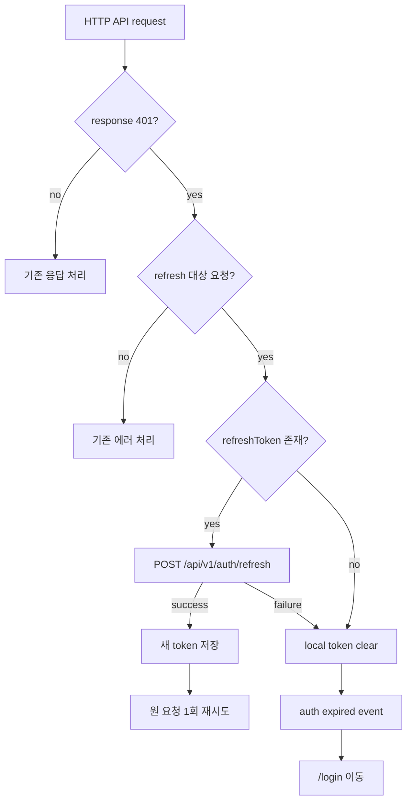
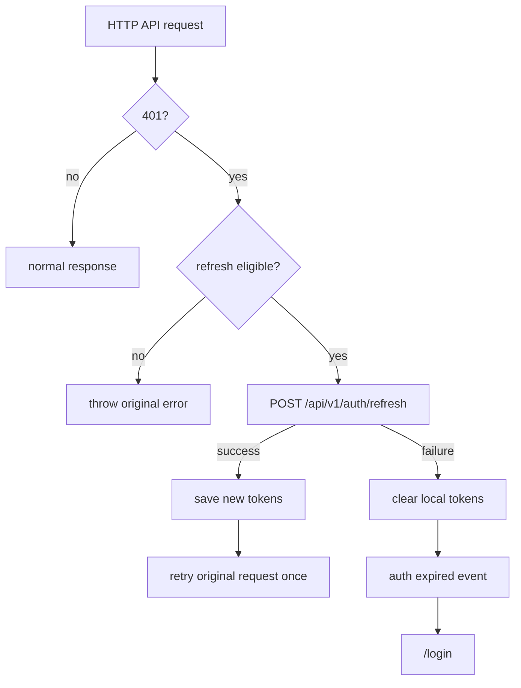

# Issue 102. Token Refresh

## Feature Description

이번 이슈는 만료된 access token으로 HTTP API 요청이 `401`을 반환했을 때, 저장된 refresh token으로 access token을 재발급하고 원 요청을 1회 재시도하는 공통 인증 흐름을 구현한다.



이번 이슈의 핵심은 route guard가 아닌 HTTP API client 계층에서 token 만료 복구를 처리하는 것이다. route guard는 기존처럼 access token 존재 여부만 확인하고, 실제 만료는 백엔드의 `401` 응답을 source of truth로 삼는다.

이번 이슈에 포함되는 범위:

- `POST /api/v1/auth/refresh` service 추가.
- HTTP API `401` refresh/retry 공통 처리.
- refresh 동시 요청 단일화.
- refresh 실패 시 local token clear 및 `/login` 이동.
- Unit test와 문서 정합성 반영.

후속 이슈로 미루는 범위:

- SSE token refresh/retry.
- Game WebSocket token refresh/reconnect 정책 변경.
- JWT exp 사전 파싱/검증.
- refresh token rotation 서버 정책 변경.
- user profile 전역 auth store.
- 새 패키지 추가.

## Backend Contract

Refresh API:

```http
POST /api/v1/auth/refresh
Content-Type: application/json
```

Request:

```ts
interface TokenRefreshRequest {
  refreshToken: string;
}
```

Response:

```ts
interface TokenRefreshResponse {
  accessToken: string;
  refreshToken: string;
}
```

백엔드 계약 기준:

- 현재 백엔드 `AuthPath.REFRESH`는 `/api/v1/auth/refresh`이다.
- request body는 `{ refreshToken }`이다.
- response body는 `{ accessToken, refreshToken }`이다.
- access token 만료 판정은 HTTP `401` 응답을 기준으로 한다.
- refresh token 유효성 및 새 token 발급은 백엔드 `AuthService.refresh(refreshToken)` 책임이다.

프론트 처리 기준:

- refresh API는 만료된 access token에 의존하면 안 되므로 `auth: false`로 호출한다.
- refresh 성공 응답의 `accessToken`, `refreshToken`을 기존 `authToken.ts` 저장소에 반영한다.
- 원 요청은 refresh 성공 후 1회만 재시도한다.
- refresh 실패, refresh token 없음, 재시도 후 실패는 세션 만료로 처리한다.
- 세션 만료 시 local token을 삭제하고 auth expired event를 발행한다.
- app bootstrap은 auth expired event를 받아 `/login`으로 이동한다.

## Scope Boundary

이번 이슈에 포함:

- `TokenRefreshRequest`, `TokenRefreshResponse` 타입 추가.
- `authService.refresh(refreshToken)` 구현.
- `ApiRequestOptions.skipAuthRefresh` 옵션 추가.
- 일반 HTTP 인증 API의 `401` refresh/retry 구현.
- 동시 `401`에 대한 refresh 요청 단일화.
- refresh 실패 시 local token clear.
- auth expired event service 추가.
- app bootstrap의 `/login` 이동 연결.
- `authService`, `apiClient` unit test 추가.
- `front-plan.md` 정합성 반영.
- issue-102 PR 섹션 보강.

이번 이슈에서 제외:

- `auth: false` 요청의 refresh/retry.
- `skipAuthRefresh: true` 요청의 refresh/retry.
- logout API의 refresh/retry.
- Match SSE refresh/retry.
- Game WebSocket refresh/retry.
- 게임 대기/플레이 중 이탈 정산 변경.
- 새 패키지 추가.

## Tasks

### 1. Backend Contract 재확인

- [x] 백엔드 `AuthPath.REFRESH`가 `/api/v1/auth/refresh`인지 확인.
- [x] request body가 `{ refreshToken }`인지 확인.
- [x] response body가 `{ accessToken, refreshToken }`인지 확인.
- [x] refresh API는 `auth: false`로 호출한다는 정책 문서화.
- [x] HTTP `401`을 access token 만료 복구 기준으로 삼는 정책 문서화.

### 2. Auth Refresh Service 구현

- [x] `TokenRefreshRequest` 타입 추가.
- [x] `TokenRefreshResponse` 타입 추가.
- [x] `authService.refresh(refreshToken)` 구현.
- [x] `POST /api/v1/auth/refresh` 호출 구현.
- [x] request body `{ refreshToken }` 전달.
- [x] `auth: false`로 refresh 요청을 보내도록 구현.

### 3. API Client Refresh / Retry 구현

- [x] `ApiRequestOptions.skipAuthRefresh` 옵션 추가.
- [x] `auth: false` 요청은 refresh 대상에서 제외.
- [x] `skipAuthRefresh: true` 요청은 refresh 대상에서 제외.
- [x] 최초 요청 `401`에서만 refresh 시도.
- [x] refresh 성공 시 새 token 저장.
- [x] 원 요청을 새 access token으로 1회 재시도.
- [x] 재시도 실패 시 추가 refresh를 반복하지 않도록 구현.
- [x] 동시 `401` 요청은 refresh API 1회만 호출하도록 구현.

### 4. Auth Expired Event / Routing 구현

- [x] auth expired event service 추가.
- [x] refresh token 없음 상태에서 token clear 후 event 발행.
- [x] refresh 실패 상태에서 token clear 후 event 발행.
- [x] app bootstrap에서 event를 구독해 `/login` 이동.
- [x] 이미 `/login`에 있으면 중복 이동하지 않도록 구현.

### 5. Test 구현

- [x] `authService.refresh` endpoint/body/auth 정책 검증.
- [x] `401` 후 refresh 성공 시 원 요청이 새 access token으로 재시도되는지 검증.
- [x] refresh token 없음 상태에서 token clear 및 auth expired event 발생 검증.
- [x] refresh 실패 시 token clear 및 auth expired event 발생 검증.
- [x] 동시 `401` 요청에서 refresh API가 1회만 호출되는지 검증.
- [x] 재시도 요청이 다시 `401`이어도 refresh를 반복하지 않는지 검증.
- [x] `auth: false` 요청은 refresh를 시도하지 않는지 검증.
- [x] `skipAuthRefresh: true` 요청은 refresh를 시도하지 않는지 검증.

### 6. 문서 정합성 구현

- [x] `front-plan.md` token refresh 항목 완료 상태 반영.
- [x] issue-102 task 완료 상태 반영.
- [x] PR 섹션을 계약/정책 중심으로 보강.
- [x] 기존 문서의 token refresh 후속 범위와 충돌하지 않는지 확인.

### 7. 검증

- [x] `npm run test -- apiClient authService authSessionEvents` 검증.
- [x] `npm run format` 검증.
- [x] `npm run lint` 검증.
- [x] `npm run typecheck` 검증.
- [x] `npm run test` 검증.
- [x] `npm run build` 검증.

## Implementation Policy

- HTTP `401`은 access token 만료 복구 트리거로 처리한다.
- refresh 성공 응답이 새 token의 source of truth다.
- refresh API는 `auth: false`로 호출한다.
- 원 요청 재시도는 1회만 허용한다.
- 동시 `401` 요청은 하나의 refresh promise를 공유한다.
- `auth: false` 요청은 refresh 대상에서 제외한다.
- `skipAuthRefresh: true` 요청은 refresh 대상에서 제외한다.
- logout API는 refresh/retry 대상에서 제외한다.
- Match SSE와 Game WebSocket은 이번 이슈에서 refresh/retry 대상이 아니다.
- route guard는 JWT 만료를 직접 판정하지 않는다.
- 서비스 계층에서 router를 직접 import하지 않고 auth expired event로 이동을 위임한다.
- 새 패키지를 추가하지 않는다.

## Acceptance Criteria

- 만료된 access token으로 일반 인증 HTTP API 요청이 `401`을 받으면 refresh API를 호출한다.
- refresh request body는 `{ refreshToken }`이다.
- refresh response의 `accessToken`, `refreshToken`이 local storage에 저장된다.
- refresh 성공 후 원 요청이 새 access token으로 1회 재시도된다.
- refresh token이 없으면 local token이 삭제되고 `/login`으로 이동한다.
- refresh 실패 시 local token이 삭제되고 `/login`으로 이동한다.
- 동시 `401` 요청 여러 개가 refresh API를 중복 호출하지 않는다.
- logout, login, signup, refresh 요청은 refresh/retry 루프에 들어가지 않는다.
- SSE/WebSocket 기존 인증 정책은 변경되지 않는다.
- format/lint/typecheck/test/build가 통과한다.

## PR Message

## PR 작성 방법

## 📌 Summary

이번 PR은 HTTP API access token 만료 시 refresh token으로 세션을 복구하고, 원 요청을 1회 재시도하는 공통 인증 흐름을 구현함.



핵심 정책:

- HTTP `401`을 access token 만료 복구 기준으로 처리함.
- refresh 성공 응답의 token을 source of truth로 삼음.
- 원 요청 재시도는 1회만 허용함.
- login/signup/refresh/logout은 refresh 루프에서 제외함.
- `auth: false` 요청과 `skipAuthRefresh: true` 요청은 refresh 대상에서 제외함.
- 동시에 여러 HTTP API가 `401`을 받아도 refresh 요청은 1회만 발생하도록 단일 promise를 공유함.
- SSE/WebSocket 인증 정책은 변경하지 않음.

백엔드와의 구현 계약:

- `POST /api/v1/auth/refresh`를 호출함.
- request는 `{ refreshToken }`임.
- response는 `{ accessToken, refreshToken }`임.
- refresh API는 만료된 access token에 의존하지 않도록 `auth: false`로 호출함.
- logout API는 기존 Authorization header 계약을 유지하되, 세션 종료 요청이므로 `skipAuthRefresh: true`로 refresh/retry 대상에서 제외함.

## 📚 Changes

- API client 계층에 refresh/retry를 넣음.
  모든 HTTP API 요청이 공통으로 지나는 계층이므로 각 page나 service에 token 만료 복구 로직을 중복하지 않기 위함임.
- route guard는 기존처럼 token 존재 여부만 확인하게 둠.
  token 만료의 source of truth는 백엔드 HTTP `401` 응답이므로 guard에서 JWT를 임의로 해석하지 않음.
- refresh 동시 요청을 단일화함.
  여러 API가 동시에 `401`을 받아도 refresh token rotation 또는 서버 부하 문제가 생기지 않도록 하나의 refresh promise를 공유함.
- refresh 성공 후 원 요청을 재시도할 때도 `skipAuthRefresh`를 적용함.
  재시도 요청이 다시 `401`을 반환해도 refresh를 반복하지 않아 무한 루프가 생기지 않게 하기 위함임.
- 인증 만료 이동은 event로 분리함.
  service 계층이 router에 직접 의존하지 않게 해서 API client와 UI routing 책임을 분리함.
- logout은 refresh/retry 대상에서 제외함.
  사용자가 세션 종료를 요청한 흐름이므로 access token 만료 복구와 섞지 않고 기존 logout 정책을 유지함.

## 📝 Note

- Match SSE refresh/retry는 이번 PR에서 제외함.
- Game WebSocket refresh/reconnect 정책은 이번 PR에서 제외함.
- JWT exp 사전 파싱, profile 전역 store, 새 패키지 추가는 제외함.
- `npm run test -- apiClient authService authSessionEvents` 검증 완료함.
- `npm run format`, `npm run lint`, `npm run typecheck`, `npm run test`, `npm run build` 검증 완료함.
- 전체 테스트 21 files / 205 passed 확인함.

## 📌 Related Issue

- Closes #102
