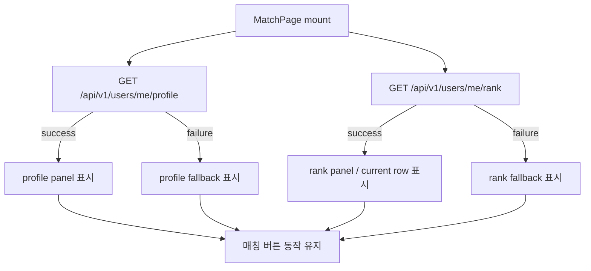
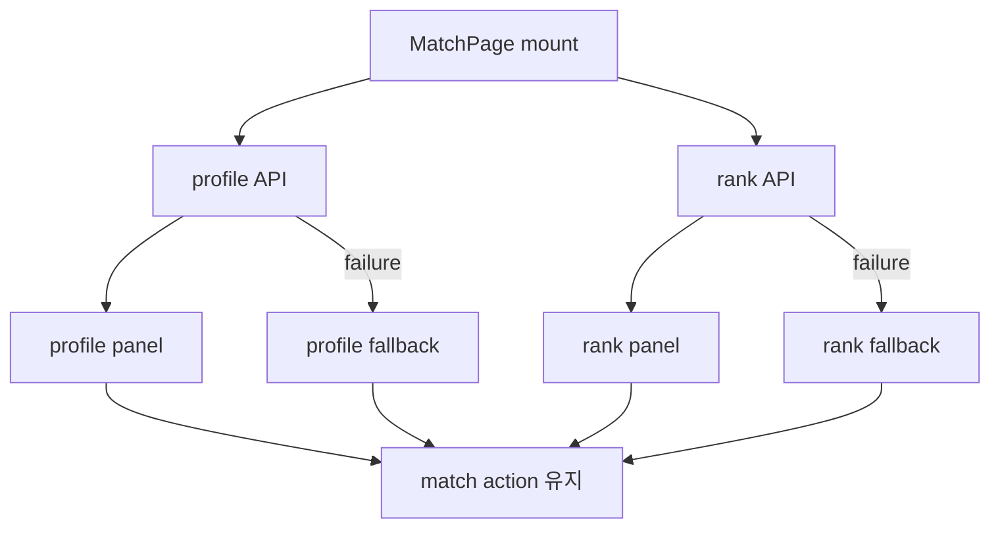

# Issue 108. MatchPage 내 프로필 / 랭크 실데이터 구현

## Feature Description

MatchPage의 정적 사용자/랭크 표시를 백엔드 API 실데이터로 교체한다.

현재 MatchPage는 `Summoner`, `BRONZE IV`, `1,248 LP` 같은 정적 표시를 사용한다. 이번 이슈에서는 `GET /api/v1/users/me/profile`, `GET /api/v1/users/me/rank`를 병렬 조회해 닉네임, 현재 랭크, LP, 누적 승/패/무 요약을 화면에 표시한다.



이번 이슈의 핵심은 profile/rank API의 source of truth를 프론트 화면에 연결하되, 매칭 기능과 조회 실패 상태를 분리하는 것이다.

이번 이슈에 포함되는 범위:

- profile/rank frontend service 추가.
- MatchPage mount 시 profile/rank 병렬 조회.
- MatchPage의 정적 nickname/rank/lp/current ranking row 표시 제거.
- profile/rank loading, error, empty 상태 추가.
- profile 실패와 rank 실패를 독립적으로 표시.
- 조회 실패가 매칭 시작/취소, match SSE, logout 흐름을 막지 않게 유지.
- locale, test, 문서 정합성 반영.
- 작업 단위별 오토 커밋.

후속 이슈로 미루는 범위:

- 랭킹 리스트 전체 실데이터 전환.
- `#128`, top %, season best 실데이터 전환.
- ProfilePage 구현.
- 전적 상세/랭킹 API 연동.
- Game Summary payload를 현재 계정 상태로 재사용하는 처리.
- 새 패키지 추가.

## Backend Contract

### Profile API

```http
GET /api/v1/users/me/profile
Authorization: Bearer {accessToken}
```

Response:

```ts
interface UserProfileResponse {
  userId: number
  email: string
  nickname: string
  createdAt: string
}
```

프론트 사용 기준:

- `nickname`은 MatchPage profile panel의 사용자 표시 source로 사용한다.
- `userId`, `email`, `createdAt`은 이번 MatchPage 화면에서 필요할 때만 보관하고, rank 표시와 섞지 않는다.
- `avatarUrl`은 백엔드 응답에 없으므로 사용하지 않는다.

### Rank API

```http
GET /api/v1/users/me/rank
Authorization: Bearer {accessToken}
```

Response:

```ts
interface UserRankResponse {
  userId: number
  tier: string
  division: string | null
  rank: string
  lp: number
  tierScore: number
  wins: number
  losses: number
  draws: number
  rankUpdatedAt: string
}
```

프론트 사용 기준:

- `rank`는 화면 표시용 rank 문자열의 source로 사용한다.
- `lp`는 현재 LP 표시의 source로 사용한다.
- `wins`, `losses`, `draws`는 누적 전적 요약의 source로 사용한다.
- `division`은 null 가능하므로 rank 표시에는 `rank` 필드를 우선 사용한다.
- `rankUpdatedAt`은 이번 MatchPage 기본 UI에 직접 표시하지 않는다.

### Auth / Error Policy

- Authorization header는 기존 `apiClient` 정책을 따른다.
- token 만료는 issue-102의 HTTP `401` refresh/retry 정책을 따른다.
- profile/rank API 실패는 MatchPage 진입 실패로 처리하지 않는다.
- profile 실패와 rank 실패는 독립적으로 표시한다.
- `USER_NOT_FOUND`, `RANK_NOT_FOUND`, 네트워크 실패 모두 해당 영역 fallback으로 표시하고 매칭 버튼은 유지한다.

## Scope Boundary

이번 이슈에 포함:

- `frontend/src/services`에 profile/rank 조회 service 추가.
- `frontend/src/types`에 profile/rank response type 추가.
- MatchPage mount 시 profile/rank 병렬 조회.
- MatchPage unmount 시 profile/rank 요청 abort.
- 정적 `Summoner`, `BRONZE IV`, `1,248 LP` 표시 제거.
- profile/rank loading/error/fallback 표시.
- current ranking row에 nickname/LP 실데이터 반영.
- locale 문구 추가.
- MatchPage/service 테스트 추가.
- `docs/last-구현.md` Section 2-3 정합성 반영.
- issue-108 PR 섹션 보강.
- 작업 단위별 오토 커밋.

이번 이슈에서 제외:

- 랭킹 목록 API 연동.
- 내 순위 `#128`, top %, season best API 연동.
- rank progression 계산.
- 다음 랭크까지 LP 계산.
- profile 수정/아바타 업로드.
- Game Summary API 변경.
- backend API 변경.
- 새 패키지 추가.

## Tasks

### 1. Frontend API Contract 정리

- [ ] profile response type을 `userId`, `email`, `nickname`, `createdAt`으로 확정.
- [ ] rank response type을 `userId`, `tier`, `division`, `rank`, `lp`, `tierScore`, `wins`, `losses`, `draws`, `rankUpdatedAt`으로 확정.
- [ ] rank 표시에는 `rank` field를 우선 사용하는 정책 문서화.
- [ ] profile/rank 실패가 매칭 동작을 막지 않는 정책 문서화.
- [ ] Game Summary payload를 현재 계정 상태로 재사용하지 않는 정책 문서화.

### 2. Profile / Rank Service 구현

- [ ] profile 조회 service 추가.
- [ ] rank 조회 service 추가.
- [ ] 두 service 모두 `requestJson` 기반으로 구현.
- [ ] Authorization header와 token refresh는 `apiClient` 정책에 위임.
- [ ] AbortSignal 전달을 지원.
- [ ] 새 패키지를 추가하지 않음.

### 3. MatchPage 실데이터 연결

- [ ] MatchPage mount 시 profile/rank API를 병렬 조회.
- [ ] unmount 시 profile/rank request abort.
- [ ] profile loading/error/data state 구현.
- [ ] rank loading/error/data state 구현.
- [ ] profile panel의 `Summoner`를 nickname 기반 표시로 교체.
- [ ] avatar initial을 nickname 첫 글자 기반으로 표시.
- [ ] rank panel의 `BRONZE IV`, `1,248 LP`를 API 값으로 교체.
- [ ] current ranking row의 `Summoner`, `1,248 LP`를 API 값으로 교체.
- [ ] profile/rank 실패 시 fallback 표시.
- [ ] 조회 실패가 매칭 시작/취소, SSE, logout 동작을 막지 않게 유지.

### 4. Locale / UI 상태 구현

- [ ] profile loading 문구 추가.
- [ ] profile unavailable 문구 추가.
- [ ] rank loading 문구 추가.
- [ ] rank unavailable 문구 추가.
- [ ] wins/losses/draws 요약 문구 추가.
- [ ] 한국어/영어 locale 정합성 반영.
- [ ] compact panel 안에서 텍스트 overflow가 나지 않도록 스타일 확인.

### 5. Test 구현

- [ ] profile service endpoint/method/signal 테스트.
- [ ] rank service endpoint/method/signal 테스트.
- [ ] MatchPage mount 시 profile/rank 병렬 조회 테스트.
- [ ] profile 성공 시 nickname 표시 테스트.
- [ ] rank 성공 시 rank/lp/전적 표시 테스트.
- [ ] profile 실패 시 rank 표시와 매칭 버튼 유지 테스트.
- [ ] rank 실패 시 profile 표시와 매칭 버튼 유지 테스트.
- [ ] Game Summary service를 현재 계정 상태 표시로 호출하지 않는지 구조 검증.
- [ ] 기존 match start/accept/reject/logout 테스트 유지.

### 6. 문서 정합성 구현

- [ ] `docs/last-구현.md` Section 2-3 완료 상태 반영.
- [ ] 2-1 profile API, 2-2 rank API, 2-3 frontend 연결 책임 분리 문구 정리.
- [ ] `front-plan.md` Issue Split Recommendation 또는 관련 항목과 정합성 확인.
- [ ] issue-108 task 완료 상태 반영.
- [ ] PR 섹션을 계약/정책 중심으로 보강.

### 7. 검증

- [ ] `npm run test -- profileService rankService MatchPage` 검증.
- [ ] `npm run typecheck` 검증.
- [ ] `npm run lint` 검증.
- [ ] `npm run test` 검증.
- [ ] 필요 시 `npm run build` 검증.

## Implementation Policy

- Profile API는 account/user 기본 정보의 source of truth다.
- Rank API는 현재 최종 rank/stat 상태의 source of truth다.
- Game Summary API는 방금 끝난 게임의 변화량 source of truth이며 MatchPage 현재 상태 표시로 재사용하지 않는다.
- profile/rank 응답을 프론트에서 영속 저장하거나 합성 저장하지 않는다.
- MatchPage 화면 표시용으로만 profile/rank 응답을 조합한다.
- profile 실패와 rank 실패는 서로 독립적으로 처리한다.
- profile/rank 실패가 매칭 시작/취소, SSE 연결, logout을 막지 않는다.
- `apiClient`의 Authorization header와 token refresh/retry 정책을 그대로 사용한다.
- 새 패키지를 추가하지 않는다.
- 작업 단위별 오토 커밋을 진행한다.
- 현재 워킹트리에 섞여 있는 issue-106 및 배경 이미지 변경은 되돌리지 않고, 커밋 시 이슈 108 관련 파일만 명시적으로 stage한다.

## Acceptance Criteria

- MatchPage에서 정적 `Summoner` 표시가 profile API nickname으로 대체된다.
- MatchPage에서 정적 `BRONZE IV`, `1,248 LP` 표시가 rank API 값으로 대체된다.
- rank API 성공 시 current rank, LP, wins/losses/draws 요약이 표시된다.
- profile API 실패 시 profile 영역에 fallback이 표시되고 MatchPage 진입/매칭 버튼은 유지된다.
- rank API 실패 시 rank 영역에 fallback이 표시되고 MatchPage 진입/매칭 버튼은 유지된다.
- profile/rank 중 하나만 성공해도 성공한 영역은 정상 표시된다.
- Game Summary payload를 현재 계정 상태 표시로 재사용하지 않는다.
- 관련 service/unit test가 통과한다.
- typecheck/lint/test가 통과한다.
- `docs/last-구현.md`, `front-plan.md`, issue-108 문서 정합성이 맞는다.

## Commit Plan

오토 커밋은 다음 단위로 진행한다.

- `feat: MatchPage 프로필 랭크 조회 서비스 추가`
- `feat: MatchPage 프로필 랭크 실데이터 표시`
- `feat: MatchPage 프로필 랭크 테스트 구현`
- `docs: MatchPage 실데이터 전환 문서 정합성 반영`

## PR Message

## PR 작성 방법

## 📌 Summary

이번 PR은 MatchPage의 정적 사용자/랭크 표시를 profile API와 rank API 실데이터로 교체한다.



핵심 정책:

- Profile API는 account/user 기본 정보의 source of truth로 사용함.
- Rank API는 현재 최종 rank/stat 상태의 source of truth로 사용함.
- Game Summary API는 직전 게임 변화량 전용이므로 MatchPage 현재 상태 표시로 재사용하지 않음.
- profile/rank 실패는 각각 독립적으로 표시하고 매칭 동작을 막지 않음.
- token 만료 처리는 기존 `apiClient` refresh/retry 정책을 따름.

백엔드와의 구현 계약:

- `GET /api/v1/users/me/profile` 응답의 `nickname`을 사용자 표시 source로 사용함.
- `GET /api/v1/users/me/rank` 응답의 `rank`, `lp`, `wins`, `losses`, `draws`를 현재 랭크 표시 source로 사용함.
- `division`은 null 가능하므로 rank panel 표시는 `rank` field를 우선 사용함.

## 📚 Changes

- profile/rank service를 추가함.
  기존 `apiClient`를 통과시켜 Authorization header와 token refresh/retry 정책을 중복 구현하지 않기 위함임.
- MatchPage 표시 모델을 실데이터 기반으로 바꿈.
  정적 텍스트를 제거하고 백엔드가 확정한 profile/rank 응답을 화면 표시 source로 사용함.
- profile/rank 실패를 독립 상태로 분리함.
  사용자 정보 조회 실패가 매칭 시작/취소 같은 핵심 동작을 막지 않도록 하기 위함임.
- 랭킹 리스트 전체 전환은 제외함.
  랭킹 API가 아직 별도 이슈이므로 current user row 일부만 profile/rank 값으로 보정하고 전체 랭킹 데이터는 후속으로 넘김.

## 📝 Note

- 랭킹 리스트 전체 실데이터 전환은 후속 2-4 이후 진행함.
- ProfilePage 구현은 후속 이슈에서 진행함.
- 새 패키지를 추가하지 않음.
- 검증 결과는 구현 후 갱신함.

## 📌 Related Issue

- Closes #108
