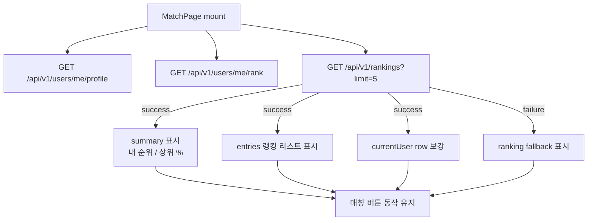
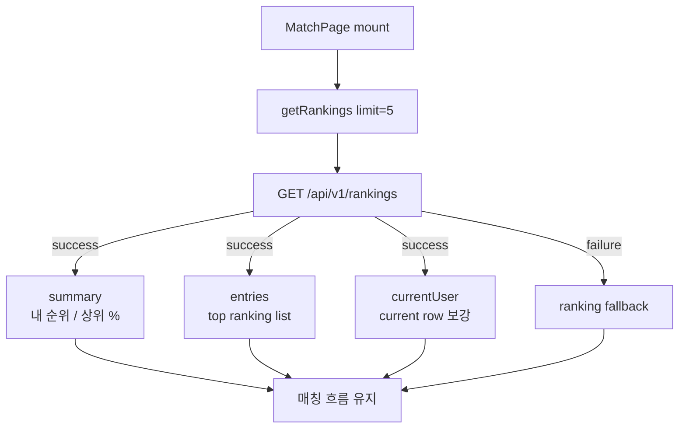

# Issue 112. MatchPage 랭킹 실데이터 구현

## Feature Description

MatchPage 왼쪽 랭킹 영역을 하드코딩 데이터에서 백엔드 랭킹 조회 API 실데이터로 전환한다.

이번 이슈는 issue-110에서 확정한 `GET /api/v1/rankings?limit=5` 계약을 프론트에 연결하는 작업이다. 랭킹 API는 MatchPage 랭킹 리스트, 내 순위, 상위 %의 source of truth다. 프론트는 백엔드가 내려준 `summary`, `entries`, `currentUser`를 화면 표시용으로만 사용하고, 순위/퍼센트/정렬을 다시 계산하지 않는다.



이번 이슈의 핵심은 랭킹 표시를 실데이터로 바꾸되, 랭킹 조회 상태와 매칭 코어 상태를 섞지 않는 것이다.

이번 이슈에 포함되는 범위:

- ranking frontend type 추가.
- ranking service 추가.
- MatchPage mount 시 ranking API 조회.
- MatchPage unmount 시 ranking request abort.
- 정적 랭킹 summary/list 제거.
- `내 순위`, `상위 %`, top ranking list 실데이터 연결.
- `season best` UI 제거.
- ranking loading/error/empty 상태 구현.
- ranking 실패가 매칭 시작/취소, match SSE, match response, 게임 진입 흐름을 막지 않게 유지.
- locale, test, 문서 정합성 반영.
- 작업 단위별 오토 커밋.

후속 이슈로 미루는 범위:

- 랭킹 pagination / 더 보기.
- 랭킹 상세 페이지.
- profile link / avatar 표시.
- season best 저장/정산/표시.
- backend API 변경.
- cursor pagination.
- ranking cache/revalidate 정책.
- 새 패키지 추가.

## Backend Contract

### Ranking API

```http
GET /api/v1/rankings?limit=5
Authorization: Bearer {accessToken}
```

Query parameter:

| parameter | required | default | policy |
|-----------|----------|---------|--------|
| `limit` | false | `5` | `1~50` 범위만 허용 |

Response:

```ts
interface RankingResponse {
  summary: RankingSummaryResponse
  entries: RankingEntryResponse[]
  currentUser: RankingEntryResponse
}

interface RankingSummaryResponse {
  myRankPosition: number
  topPercent: number
  totalRankers: number
}

interface RankingEntryResponse {
  rankPosition: number
  userId: number
  nickname: string
  tier: string
  division: string | null
  rank: string
  lp: number
  tierScore: number
  wins: number
  losses: number
  draws: number
  isCurrentUser: boolean
}
```

프론트 사용 기준:

- 실제 백엔드 `RankingEntryResponse` DTO와 RestDocs 기준으로 `tier`, `division`도 응답에 포함된다.
- `summary.myRankPosition`은 MatchPage `내 순위` 표시 source로 사용한다.
- `summary.topPercent`는 MatchPage `상위 %` 표시 source로 사용한다.
- `entries`는 top ranking list 표시 source로 사용한다.
- `currentUser`는 현재 유저가 top list 밖이어도 current row를 표시하기 위한 source로 사용한다.
- `rankPosition`, `rank`, `lp`, `nickname`, `isCurrentUser`는 랭킹 row 표시와 highlight 기준으로 사용한다.
- `tier`, `division`, `tierScore`, `wins`, `losses`, `draws`, `totalRankers`는 응답 타입에는 보존하되 이번 기본 UI에서 필요한 값만 표시한다.
- `seasonBest` 관련 field는 백엔드 계약에 없으므로 프론트 UI에서도 제거한다.

### Source Of Truth Policy

- 랭킹 순위와 정렬은 백엔드가 source of truth다.
- 프론트는 `rankPosition`과 `topPercent`를 재계산하지 않는다.
- 프론트는 `entries` 순서를 재정렬하지 않는다.
- 랭킹 조회 실패는 매칭 코어 실패로 취급하지 않는다.
- Authorization header, 401 refresh/retry는 기존 `apiClient` 정책을 따른다.

### Error Policy

- 인증 없음/만료/유효하지 않은 token은 기존 `apiClient`와 auth route 정책을 따른다.
- `USER_NOT_FOUND`, `RANK_NOT_FOUND`, `COMMON_003`, 네트워크 실패는 ranking 영역 fallback으로 표시한다.
- ranking API 실패 시 MatchPage 진입, 매칭 시작/취소, match SSE, match response, logout은 막지 않는다.

## Scope Boundary

이번 이슈에 포함:

- `RankingResponse` type 추가.
- `getRankings(signal?: AbortSignal, limit = 5)` service 추가.
- MatchPage에 `rankingStatus`, `ranking`, `rankingErrorMessage`, `rankingAbortController` 추가.
- MatchPage mount 시 profile/rank/ranking 독립 조회.
- MatchPage unmount 시 ranking request abort.
- ranking summary의 `#128`, `7%`, `#94` 하드코딩 제거.
- ranking list의 `Legendary Star`, `ShadowWalker`, `K-God Z`, `SoloQueueKing` 하드코딩 제거.
- `season best` summary 칸 제거.
- current user가 `entries`에 있으면 해당 row highlight.
- current user가 `entries`에 없으면 `currentUser`를 목록 끝에 추가 표시.
- ranking loading/error/empty 문구 추가.
- locale 한국어/영어 정합성 반영.
- service/unit/component test 추가.
- `docs/last-구현.md` Section 2-5 정합성 반영.
- issue-112 PR 섹션 보강.
- 작업 단위별 오토 커밋.

이번 이슈에서 제외:

- 백엔드 랭킹 API 변경.
- 랭킹 limit UI 추가.
- pagination / infinite scroll.
- 랭킹 row 클릭 이동.
- avatarUrl 표시.
- email 표시.
- season best UI 유지.
- season best 저장/정산 구현.
- Game Summary API 변경.
- Profile API 변경.
- Rank API 변경.
- 새 패키지 추가.

## Tasks

### 1. Frontend Ranking Contract 정리

- [x] issue-110의 `GET /api/v1/rankings?limit=5` 계약 확인.
- [x] `RankingResponse`, `RankingSummaryResponse`, `RankingEntryResponse` type 정의.
- [x] `summary.myRankPosition`을 `내 순위` source로 사용하는 정책 문서화.
- [x] `summary.topPercent`를 `상위 %` source로 사용하는 정책 문서화.
- [x] `entries`를 top ranking list source로 사용하는 정책 문서화.
- [x] `currentUser`를 current row 보강 source로 사용하는 정책 문서화.
- [x] `season best` UI 제거 정책 문서화.

### 2. Ranking Service 구현

- [x] `getRankings(signal?: AbortSignal, limit = 5)` 추가.
- [x] `requestJson` 기반으로 `GET /api/v1/rankings?limit=5` 호출.
- [x] Authorization header와 token refresh는 `apiClient` 정책에 위임.
- [x] AbortSignal 전달 지원.
- [x] 새 패키지를 추가하지 않음.

### 3. MatchPage 랭킹 실데이터 연결

- [x] `rankingStatus` 상태 추가.
- [x] `ranking` response state 추가.
- [x] `rankingErrorMessage` 추가.
- [x] `rankingAbortController` 추가.
- [x] MatchPage mount 시 ranking API 조회.
- [x] MatchPage unmount 시 ranking request abort.
- [x] ranking success 시 summary/list 표시.
- [x] ranking loading 시 ranking 영역 loading 표시.
- [x] ranking error 시 ranking 영역 fallback 표시.
- [x] ranking empty 시 empty 표시.
- [x] ranking 실패 시 매칭 버튼 enabled 정책 유지.
- [x] queue/SSE/match response 상태와 ranking 상태를 섞지 않음.

### 4. Ranking UI / Locale 구현

- [ ] `season best` summary 칸 제거.
- [ ] summary grid를 `내 순위`, `상위` 2칸 기준으로 정리.
- [ ] top entries를 API `entries` 기반으로 렌더링.
- [ ] current user가 top entries에 있으면 해당 row `is-current` 적용.
- [ ] current user가 top entries에 없으면 목록 끝에 current row 추가.
- [ ] LP는 기존 `formatNumber(value) + ' LP'` 포맷 사용.
- [ ] rank position은 `#${rankPosition}` 포맷 사용.
- [ ] 한국어 `rankingLoading`, `rankingUnavailable`, `rankingEmpty` 문구 추가.
- [ ] 영어 `rankingLoading`, `rankingUnavailable`, `rankingEmpty` 문구 추가.
- [ ] compact ranking panel에서 텍스트 overflow가 나지 않도록 기존 스타일 범위에서 조정.

### 5. Test 구현

- [ ] ranking service endpoint/method/signal 테스트.
- [ ] MatchPage mount 시 `getRankings(signal, 5)` 호출 테스트.
- [ ] ranking success 시 내 순위 표시 테스트.
- [ ] ranking success 시 top % 표시 테스트.
- [ ] ranking success 시 top entries 표시 테스트.
- [ ] `season best` 문구가 렌더링되지 않는지 테스트.
- [ ] current user가 entries 안에 있으면 해당 row highlight 테스트.
- [ ] current user가 entries 밖에 있으면 currentUser row 추가 표시 테스트.
- [ ] ranking 실패 시 fallback 표시와 매칭 버튼 유지 테스트.
- [ ] ranking empty 시 empty 문구 표시 테스트.
- [ ] 기존 profile/rank/match/logout 테스트 유지.

### 6. 문서 정합성 구현

- [ ] `docs/last-구현.md` Section 2-5 완료 상태 반영.
- [ ] Section 2-5에 season best UI 제거 완료 반영.
- [ ] issue-112 task 완료 상태 반영.
- [ ] PR 섹션을 백엔드 계약/프론트 정책/검증 결과 중심으로 보강.

### 7. 검증

- [ ] `npm run test -- rankingService` 검증.
- [ ] `npm run test -- MatchPage` 검증.
- [ ] `npm run test -- MatchPage rankingService` 검증.
- [ ] `npm run format` 검증.
- [ ] `npm run lint` 검증.
- [ ] `npm run typecheck` 검증.
- [ ] `npm run test` 검증.
- [ ] `npm run build` 검증.

## Implementation Policy

- 랭킹 API는 MatchPage 랭킹 영역의 source of truth다.
- 프론트는 순위, top %, 정렬을 재계산하지 않는다.
- 프론트는 `entries` 순서를 재정렬하지 않는다.
- `currentUser`는 top entries 밖 현재 유저 row 표시를 위한 보강 데이터로 사용한다.
- `season best`는 제품 범위에서 제거했으므로 UI에서도 제거한다.
- ranking 실패는 부가 UI 실패로만 처리한다.
- ranking 실패가 매칭 시작/취소, SSE 연결, match response, game waiting 이동을 막지 않는다.
- profile/rank/ranking 조회 상태는 서로 독립이다.
- `apiClient`의 Authorization header와 token refresh/retry 정책을 그대로 사용한다.
- 새 패키지를 추가하지 않는다.
- 작업 단위별 오토 커밋을 진행한다.
- 커밋 시 관련 파일만 명시적으로 stage하고, unrelated 변경은 포함하지 않는다.

## Acceptance Criteria

- MatchPage 랭킹 summary의 `내 순위`가 `summary.myRankPosition`으로 표시된다.
- MatchPage 랭킹 summary의 `상위 %`가 `summary.topPercent`로 표시된다.
- `season best` UI가 표시되지 않는다.
- MatchPage top ranking list가 API `entries`로 표시된다.
- current user가 top entries에 있으면 해당 row가 highlight된다.
- current user가 top entries 밖이면 `currentUser` row가 목록 끝에 표시된다.
- ranking loading/error/empty 상태가 ranking 영역 안에서만 표시된다.
- ranking 실패 시 매칭 시작 버튼과 기존 match flow가 유지된다.
- 관련 service/component test가 통과한다.
- format/lint/typecheck/test/build가 통과한다.
- `docs/last-구현.md`, issue-112 문서 정합성이 맞는다.

## Commit Plan

오토 커밋은 다음 단위로 진행한다.

- `feat: 랭킹 조회 프론트 서비스 구현`
  - ranking type/service/test 추가 후 관련 테스트 통과 시 커밋.
- `feat: MatchPage 랭킹 실데이터 연결`
  - MatchPage state/UI/locale/test 구현 후 관련 테스트 통과 시 커밋.
- `docs: MatchPage 랭킹 실데이터 문서 정합성 반영`
  - `docs/last-구현.md`, issue-112 task/PR 섹션 정합성 반영 후 `git diff --check` 통과 시 커밋.

## PR Message

## PR 작성 방법

## 📌 Summary

이번 PR은 MatchPage 왼쪽 랭킹 영역을 백엔드 랭킹 조회 API 실데이터로 전환한다.



핵심 정책:

- 랭킹 순위와 top %는 백엔드 응답을 source of truth로 사용함.
- 프론트는 랭킹 목록을 재정렬하거나 순위를 재계산하지 않음.
- season best는 API 계약에서 제외됐으므로 UI에서도 제거함.
- ranking 실패는 매칭 코어 흐름을 막지 않음.

백엔드와의 구현 계약:

- endpoint는 `GET /api/v1/rankings?limit=5`임.
- 인증은 기존 Authorization header 정책을 따름.
- response는 `summary`, `entries`, `currentUser` 구조임.
- `summary.myRankPosition`은 내 순위 표시 source임.
- `summary.topPercent`는 상위 % 표시 source임.
- `entries`는 top ranking list source임.
- `currentUser`는 top list 밖 현재 유저 row 표시 source임.
- `seasonBest` 관련 field는 응답하지 않음.

## 📚 Changes

- ranking service를 추가함.
  기존 profile/rank service와 같은 `requestJson` 패턴을 사용해 `apiClient`의 인증/refresh 정책을 재사용함.
- MatchPage 랭킹 상태를 profile/rank 상태와 독립적으로 추가함.
  랭킹 조회는 부가 표시 데이터이므로 실패해도 매칭 시작/취소/SSE 흐름을 막지 않게 함.
- 하드코딩 랭킹 summary/list를 제거함.
  백엔드가 내려준 `summary`, `entries`, `currentUser`만 화면 source로 사용해 서버와 클라이언트 순위 기준이 어긋나지 않게 함.
- season best UI를 제거함.
  백엔드 계약에서 제외된 값을 프론트가 임의 표시하지 않기 위함임.

## 📝 Note

- 이번 PR에서 pagination, ranking detail page, avatar 표시, season best 저장/정산은 제외함.
- 새 패키지는 추가하지 않음.
- 검증 결과를 작성함.

## 📌 Related Issue

- Closes #112
