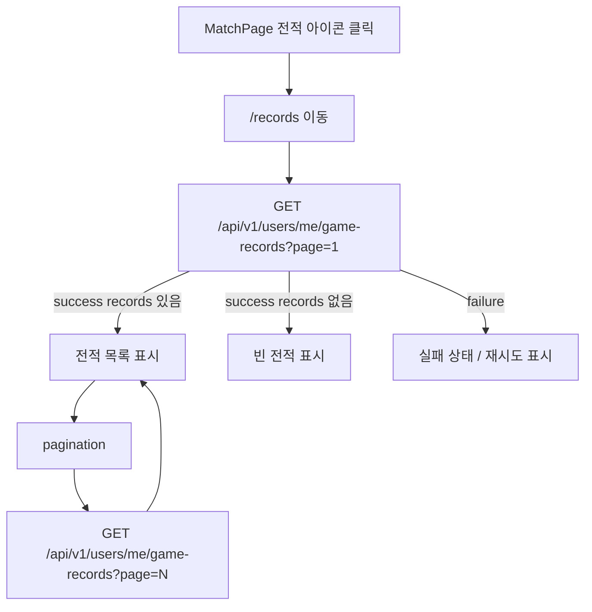
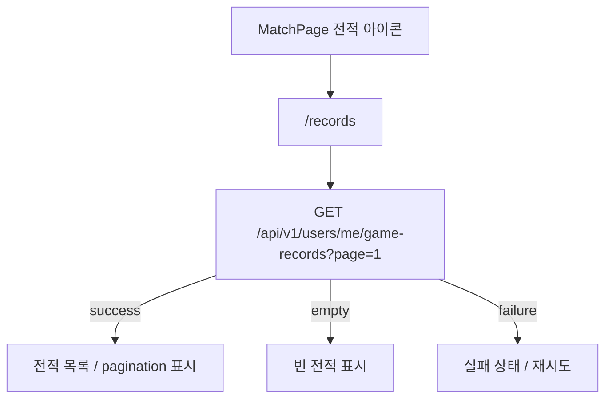

# Issue 116. 전적 페이지 구현

## Feature Description

로그인한 사용자가 최근 전적을 확인할 수 있는 전적 페이지를 구현한다.

이번 이슈는 issue-114에서 확정한 `GET /api/v1/users/me/game-records?page=1` 계약을 프론트에 연결하는 작업이다. 전적 페이지의 source of truth는 백엔드 전적 목록 API이며, Game Result Summary payload, WebSocket result payload, sessionStorage payload를 전적 목록 source로 사용하지 않는다.



이번 이슈의 핵심은 전적 목록 조회와 게임 결과 Summary 책임을 분리하는 것이다. Game Result Summary는 방금 끝난 단일 게임의 정산 결과를 보여주는 화면이고, 전적 페이지는 계정에 누적된 최근 30경기 목록을 조회하는 화면이다.

이번 이슈에 포함되는 범위:

- 전적 목록 frontend type 추가.
- 전적 목록 service 추가.
- `/records` route 추가.
- MatchPage 상단 전적 아이콘을 `/records` route로 연결.
- `GameRecordsPage` 구현.
- 전적 목록 loading/error/empty/success 상태 구현.
- 백엔드 metadata 기반 pagination 구현.
- 승/패/무, 상대 닉네임, rank 변화, LP 변화, 플레이 시각 표시.
- locale, test, 문서 정합성 반영.
- 작업 단위별 오토 커밋.

후속 이슈로 미루는 범위:

- 전적 상세 페이지.
- 전적 row 클릭 이동.
- result reason 표시.
- game room UI 표시.
- 30경기 초과 조회.
- cursor pagination.
- 전적 필터/검색.
- 상대 프로필 이동.
- 백엔드 API 변경.
- 새 패키지 추가.

## Backend Contract

### Game Records API

```http
GET /api/v1/users/me/game-records?page=1
Authorization: Bearer {accessToken}
```

Query parameter:

| parameter | required | default | policy |
|-----------|----------|---------|--------|
| `page` | false | `1` | 1-based. `1~3` 범위만 허용 |

`size`는 query parameter로 보내지 않는다. 서버 정책상 항상 10개씩 조회한다.

Response:

```ts
interface GameRecordListResponse {
  page: number
  size: number
  totalPages: number
  totalElements: number
  hasNext: boolean
  records: GameRecordEntryResponse[]
}

interface GameRecordEntryResponse {
  gameId: number
  result: 'WIN' | 'LOSS' | 'DRAW'
  opponentUserId: number
  opponentNickname: string
  rankBefore: string
  rankAfter: string
  lpBefore: number
  lpAfter: number
  lpChange: number
  playedAt: string
}
```

프론트 사용 기준:

- `records`는 전적 row 표시 source로 사용한다.
- `page`는 현재 page 표시 source로 사용한다.
- `totalPages`는 page button 생성 기준으로 사용한다.
- `hasNext`는 다음 page button 활성화 기준으로 사용한다.
- `size`는 표시 정책 확인용 metadata로만 사용한다.
- `totalElements`는 최근 30경기 cap이 반영된 총 표시 가능 전적 수로 사용한다.
- `rankBefore`, `rankAfter`는 rank 변화 표시 source로 사용한다.
- `lpBefore`, `lpAfter`, `lpChange`는 LP 변화 표시 source로 사용한다.
- `playedAt`은 전적 시각 표시 source로 사용한다.
- `reason`은 백엔드 계약에 없으므로 표시하지 않는다.

### Source Of Truth Policy

- 전적 페이지 source of truth는 `GET /api/v1/users/me/game-records`다.
- Game Result Summary API는 방금 끝난 단일 게임 결과 화면의 source of truth다.
- Game Result WebSocket payload는 결과 화면 전환 기준이고 전적 목록 source가 아니다.
- sessionStorage payload는 waiting/play/result handoff용이며 전적 목록 source가 아니다.
- 프론트는 최근 30경기 cap, total page, hasNext를 임의로 재계산하지 않는다.
- Authorization header와 401 refresh/retry는 기존 `apiClient` 정책을 따른다.

### Error Policy

- 인증 없음/만료/유효하지 않은 token은 기존 `apiClient`와 auth route 정책을 따른다.
- `page` validation 실패는 백엔드 `COMMON_003` error response를 따른다.
- 전적이 없는 상태는 error가 아니라 empty response다.
- 네트워크 실패나 서버 오류는 전적 페이지 내부 실패 상태로 표시하고 재시도 버튼을 제공한다.

## Scope Boundary

이번 이슈에 포함:

- `GameRecordListResponse`, `GameRecordEntryResponse` type 추가.
- `getMyGameRecords(page, signal?)` service 추가.
- `ROUTE_PATHS.records`, `ROUTE_NAMES.records` 추가.
- `/records` route 추가 및 `requiresAuth: true` 적용.
- MatchPage 전적 아이콘 click handler 추가.
- `GameRecordsPage` 구현.
- mount 시 page 1 조회.
- page 변경 시 해당 page 조회.
- unmount 또는 page 변경 시 기존 request abort.
- loading/error/empty/success 상태 구현.
- rank 변화 표시 정책 구현.
- LP 변화 표시 정책 구현.
- pagination UI 구현.
- locale 한국어/영어 문구 추가.
- service/router/page/MatchPage 테스트 추가.
- `docs/last-구현.md` Section 3-2 정합성 반영.
- `front-plan.md` 관련 항목 정합성 확인.
- issue-116 PR 섹션 보강.
- 작업 단위별 오토 커밋.

이번 이슈에서 제외:

- 백엔드 전적 API 변경.
- Game Result Summary API 변경.
- WebSocket 결과 payload 변경.
- 전적 상세 페이지.
- 전적 row click route 이동.
- result reason 표시.
- game room id 표시.
- 상대 프로필 route 이동.
- filter/search/sort UI.
- 30경기 초과 조회.
- cursor pagination.
- 새 패키지 추가.

## Tasks

### 1. Frontend Game Records Contract 정리

- [x] issue-114의 `GET /api/v1/users/me/game-records?page=1` 계약 확인.
- [x] `GameRecordListResponse`, `GameRecordEntryResponse` type 정의.
- [x] `page`만 query로 보내고 `size`는 보내지 않는 정책 문서화.
- [x] `totalPages`, `hasNext`, `page`를 pagination source로 사용하는 정책 문서화.
- [x] Game Result Summary와 전적 목록 API 책임 분리 문서화.
- [x] sessionStorage payload를 전적 목록 source로 사용하지 않는 정책 문서화.

### 2. Game Records Service / Route 구현

- [x] `getMyGameRecords(page, signal?)` service 추가.
- [x] `requestJson` 기반으로 `GET /api/v1/users/me/game-records?page=${page}` 호출.
- [x] Authorization header와 token refresh는 `apiClient` 정책에 위임.
- [x] AbortSignal 전달 지원.
- [x] `/records` route path 추가.
- [x] `records` route name 추가.
- [x] `records` route에 `requiresAuth: true` 적용.
- [x] MatchPage 전적 아이콘 클릭 시 records route로 이동.
- [x] 새 패키지를 추가하지 않음.

### 3. GameRecordsPage 구현

- [x] `GameRecordsPage` 추가.
- [x] mount 시 page 1 전적 조회.
- [x] `recordsStatus` 상태 구현.
- [x] `recordsErrorMessage` 상태 구현.
- [x] `recordsResponse` 상태 구현.
- [x] loading 상태 표시.
- [x] error 상태와 재시도 버튼 표시.
- [x] empty 상태 표시.
- [x] success 상태에서 전적 목록 표시.
- [x] page 변경 시 기존 request abort 후 새 page 조회.
- [x] unmount 시 request abort.
- [x] `/match` 복귀 버튼 구현.

### 4. Records UI / Locale 구현

- [x] 승/패/무 표시 구현.
- [x] 상대 닉네임 표시 구현.
- [x] `rankBefore !== rankAfter`이면 `GOLD_IV -> GOLD_III` 형태로 표시.
- [x] rank 변화가 없으면 `GOLD_IV` 단일 값으로 표시.
- [x] `lpBefore -> lpAfter` 표시 구현.
- [x] `lpChange`를 `+25`, `-10`, `0` 형태로 표시.
- [x] `playedAt`을 사용자에게 읽기 좋은 날짜/시간으로 표시.
- [x] `totalElements` 기반 최근 전적 개수 표시.
- [x] `totalPages` 기반 page button 생성.
- [x] `hasNext` 기반 다음 버튼 활성화.
- [x] mobile/desktop에서 horizontal overflow가 없도록 스타일 구현.
- [x] 한국어 records locale 추가.
- [x] 영어 records locale 추가.

### 5. Test 구현

- [x] game record service endpoint/method/signal 테스트.
- [x] service가 `size` query를 보내지 않는지 테스트.
- [x] router protected route 테스트에 records 추가.
- [x] MatchPage 전적 아이콘 클릭 시 records route 이동 테스트.
- [x] GameRecordsPage mount 시 page 1 조회 테스트.
- [x] loading 상태 테스트.
- [x] error 상태와 재시도 테스트.
- [x] empty 상태 테스트.
- [x] success 목록 표시 테스트.
- [x] pagination page 이동 테스트.
- [x] rank 변화 표시 테스트.
- [x] rank 변화 없음 표시 테스트.
- [x] LP 변화 표시 테스트.

### 6. 문서 정합성 구현

- [ ] `docs/last-구현.md` Section 3-2 완료 상태 반영.
- [ ] `docs/last-구현.md`에 전적 페이지 source of truth를 전적 목록 API로 명시.
- [ ] `front-plan.md` 관련 항목과 정합성 확인.
- [ ] issue-116 task 완료 상태 반영.
- [ ] PR 섹션을 백엔드 계약/프론트 정책/검증 결과 중심으로 보강.

### 7. 검증

- [ ] `npm run test -- gameRecordService` 검증.
- [ ] `npm run test -- GameRecordsPage` 검증.
- [ ] `npm run test -- MatchPage` 검증.
- [ ] `npm run test -- router` 검증.
- [ ] `npm run format` 검증.
- [ ] `npm run lint` 검증.
- [ ] `npm run typecheck` 검증.
- [ ] `npm run test` 검증.
- [ ] `npm run build` 검증.
- [ ] desktop `1440x900` overflow 검증.
- [ ] mobile `390x844` overflow 검증.
- [ ] `git diff --check` 검증.

## Implementation Policy

- 전적 페이지 source of truth는 `GET /api/v1/users/me/game-records`다.
- HTTP 응답 metadata를 pagination source로 사용한다.
- 프론트는 `totalPages`, `hasNext`, 최근 30경기 cap을 임의로 재계산하지 않는다.
- `size` query를 보내지 않는다.
- `page`는 1-based로 취급한다.
- page UI는 `1~3` 범위 밖 요청을 만들지 않는다.
- 빈 전적은 error가 아니라 empty state로 표시한다.
- Game Result Summary API를 전적 목록 source로 재사용하지 않는다.
- WebSocket result payload를 전적 목록 source로 재사용하지 않는다.
- sessionStorage handoff payload를 전적 목록 source로 재사용하지 않는다.
- `apiClient`의 Authorization header와 token refresh/retry 정책을 그대로 사용한다.
- 전적 조회 실패가 MatchPage 매칭 코어 흐름에 영향을 주지 않는다.
- 새 패키지를 추가하지 않는다.
- 작업 단위별 오토 커밋을 진행한다.
- 커밋 시 관련 파일만 명시적으로 stage하고, unrelated 변경은 포함하지 않는다.

## Acceptance Criteria

- MatchPage 전적 아이콘 클릭 시 `/records`로 이동한다.
- `/records`는 인증 route로 보호된다.
- 전적 페이지 최초 진입 시 `GET /api/v1/users/me/game-records?page=1`을 호출한다.
- service는 `size` query를 보내지 않는다.
- 전적 목록이 백엔드 `records` 응답으로 표시된다.
- 빈 전적이면 empty state가 표시된다.
- 실패 시 error state와 재시도 버튼이 표시된다.
- page button은 백엔드 `totalPages` 기준으로 생성된다.
- 다음 버튼은 백엔드 `hasNext` 기준으로 활성화된다.
- rank 변화가 있으면 `before -> after`로 표시된다.
- rank 변화가 없으면 단일 rank만 표시된다.
- LP 변화가 `+`, `-`, `0` 정책에 맞게 표시된다.
- desktop/mobile에서 horizontal overflow가 없다.
- 관련 테스트와 전체 검증이 통과한다.

## PR Message

## PR 작성 방법

## 📌 Summary

전적 페이지를 추가하고 issue-114에서 확정한 내 전적 목록 API를 프론트에 연결함.



핵심 정책:

- 전적 페이지 source of truth는 `GET /api/v1/users/me/game-records` 응답으로 처리함.
- `size` query를 보내지 않고 서버 고정 10개 정책을 따름.
- Game Result Summary, WebSocket result, sessionStorage payload를 전적 목록 source로 사용하지 않음.
- 빈 전적은 error가 아니라 empty state로 처리함.
- 새 패키지를 추가하지 않음.

백엔드와의 구현 계약:

- `GET /api/v1/users/me/game-records?page={page}`를 호출함.
- `page`는 1-based이며 `1~3` 범위로 요청함.
- `records`는 row 표시 source로 사용함.
- `page`, `totalPages`, `hasNext`, `totalElements`는 pagination source로 사용함.
- 인증과 token refresh는 기존 `apiClient` 정책을 따름.

## 📚 Changes

- 전적 페이지의 source를 백엔드 전적 목록 API로 고정함.
  전적 목록은 누적 계정 기록이므로 방금 끝난 게임의 Summary payload나 WebSocket payload를 재사용하지 않는다. 이렇게 분리해야 결과 화면과 전적 목록 화면의 책임이 섞이지 않는다.
- pagination 책임을 백엔드 metadata에 맞춤.
  최근 30경기 cap, page 수, 다음 page 여부는 서버가 확정한 응답을 기준으로 표시한다. 프론트는 표시 상태만 관리하고 total page를 임의로 재계산하지 않는다.
- MatchPage의 기존 전적 아이콘을 route 진입점으로 사용함.
  이미 상단 account action 영역에 전적 버튼이 있으므로 새 CTA를 늘리지 않고 기존 UI 의미를 실제 기능과 연결한다.
- rank/LP 변화 표시는 목록 화면에 필요한 최소 정보만 사용함.
  `reason`, game room 정보, 상세 result는 이번 목록 화면 책임 밖이므로 후속 상세 페이지로 분리한다.

## 📝 Note

- 이번 PR에서 전적 상세 페이지, row click 이동, result reason 표시는 제외함.
- 30경기 초과 조회와 cursor pagination은 후속 이슈로 둠.
- 새 패키지 추가 없음.
- 검증 결과:
  - `npm run test -- gameRecordService` 통과함.
  - `npm run test -- GameRecordsPage` 통과함.
  - `npm run test -- MatchPage` 통과함.
  - `npm run test -- router` 통과함.
  - `npm run format` 통과함.
  - `npm run lint` 통과함.
  - `npm run typecheck` 통과함.
  - `npm run test` 통과함.
  - `npm run build` 통과함.
  - desktop/mobile overflow 확인함.

## 📌 Related Issue

- Closes #116
