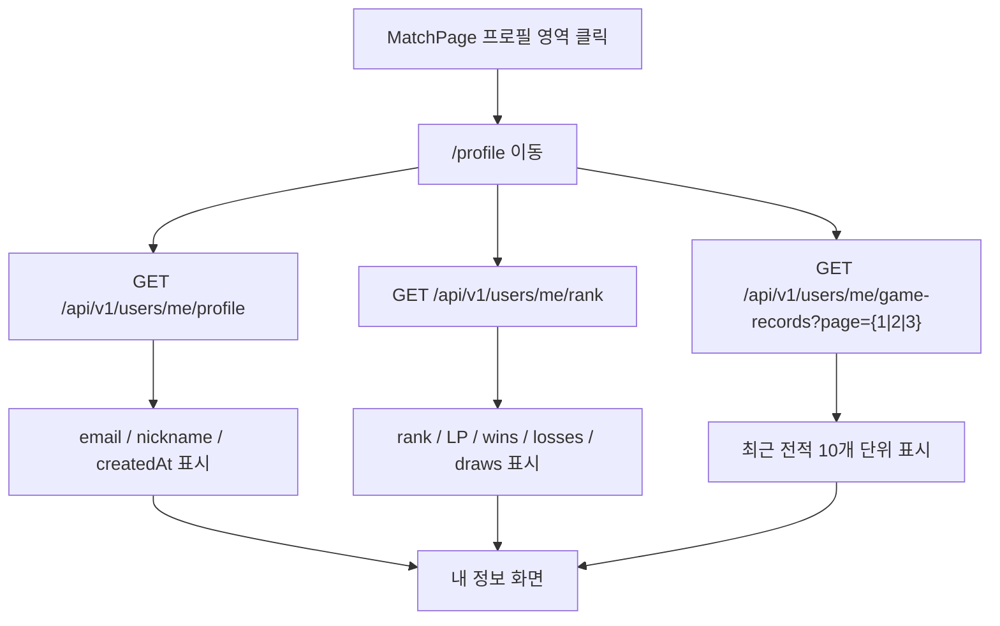
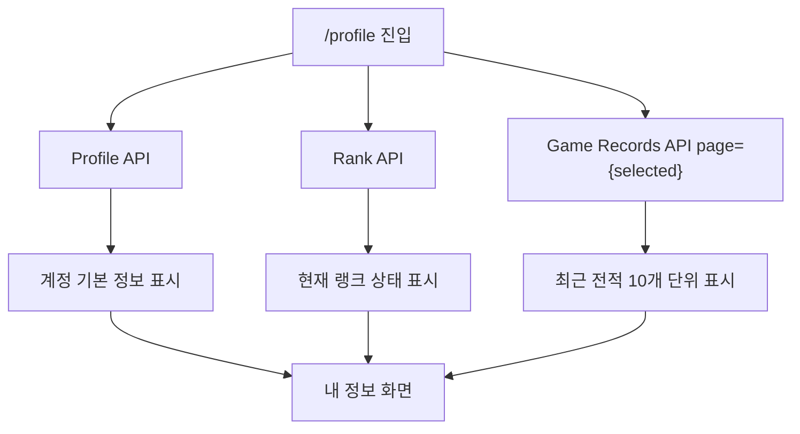

# Issue 118. 내 정보 화면 구현

## Feature Description

로그인한 사용자가 자신의 계정 정보, 현재 랭크 상태, 최근 전적 최대 30경기를 10개 단위 페이지로 확인할 수 있는 내 정보 화면을 구현한다.

이번 이슈는 신규 profile detail API를 만들지 않고, 이미 확정된 기존 3개 API를 프론트에서 조합하는 방식으로 진행한다. Profile API는 계정 기본 정보, Rank API는 현재 랭크 상태, Game Records API는 최근 전적 목록의 source of truth로 유지한다.



이번 이슈의 핵심은 API를 통합하는 것이 아니라, 각 API의 책임을 유지한 상태로 화면에서만 조합하는 것이다. 계정 정보, 랭크 상태, 전적 목록은 변경 주기와 도메인 책임이 다르므로 하나의 통합 응답으로 합치지 않는다.

이번 이슈에 포함되는 범위:

- `/profile` route 추가.
- `ProfilePage` 구현.
- MatchPage 프로필 영역을 `/profile` 진입점으로 연결.
- 기존 profile/rank/game-records service 재사용.
- 내 정보 화면 loading/error/empty/success 상태 구현.
- 사용자 기본 정보, 현재 랭크, 승패무, 최근 전적 최대 30경기 1/2/3 페이지 표시.
- `/match` 복귀 구현.
- MatchPage 상단 내 정보 버튼 연결.
- locale, test, 문서 정합성 반영.
- 작업 단위별 오토 커밋.

후속 이슈로 미루는 범위:

- 신규 profile detail API.
- 프로필 수정.
- 닉네임 변경.
- 이메일 변경.
- avatar/profile image 추가.
- 프로필 이미지 업로드.
- 전적 상세 페이지.
- 상대 프로필 이동.
- 백엔드 API 변경.
- 새 패키지 추가.

## Backend Contract

이번 이슈는 신규 백엔드 endpoint를 만들지 않는다. 내 정보 화면은 이미 구현된 기존 API 3개를 조합한다.

### Profile API

```http
GET /api/v1/users/me/profile
Authorization: Bearer {accessToken}
```

Response:

```ts
interface UserProfileResponse {
  userId: number
  email: string
  nickname: string
  createdAt: string
}
```

프론트 사용 기준:

- `userId`는 사용자 식별 표시와 테스트 식별값으로 사용한다.
- `email`은 내 정보 계정 이메일 표시 source로 사용한다.
- `nickname`은 내 정보 닉네임 표시 source로 사용한다.
- `createdAt`은 가입일 표시 source로 사용한다.
- rank, LP, 승패, 전적, avatarUrl은 이 API에서 기대하지 않는다.

### Rank API

```http
GET /api/v1/users/me/rank
Authorization: Bearer {accessToken}
```

Response:

```ts
interface UserRankResponse {
  userId: number
  tier: string
  division: string | null
  rank: string
  lp: number
  tierScore: number
  wins: number
  losses: number
  draws: number
  rankUpdatedAt: string
}
```

프론트 사용 기준:

- `rank`는 화면 표시용 현재 랭크 source로 사용한다.
- `lp`는 현재 LP source로 사용한다.
- `wins`, `losses`, `draws`는 전적 요약 source로 사용한다.
- `rankUpdatedAt`은 랭크 갱신 시각 표시 source로 사용한다.
- nickname, email, avatarUrl은 이 API에서 기대하지 않는다.

### Game Records API

```http
GET /api/v1/users/me/game-records?page={1|2|3}
Authorization: Bearer {accessToken}
```

Response:

```ts
interface GameRecordListResponse {
  page: number
  size: number
  totalPages: number
  totalElements: number
  hasNext: boolean
  records: GameRecordEntryResponse[]
}

interface GameRecordEntryResponse {
  gameId: number
  result: 'WIN' | 'LOSS' | 'DRAW'
  opponentUserId: number
  opponentNickname: string
  rankBefore: string
  rankAfter: string
  lpBefore: number
  lpAfter: number
  lpChange: number
  playedAt: string
}
```

프론트 사용 기준:

- ProfilePage 최초 진입 시 `page=1`을 조회한다.
- ProfilePage 페이지 버튼 클릭 시 선택한 `page=1|2|3`만 조회한다.
- `records`는 현재 선택한 최근 전적 페이지 표시 source로 사용한다.
- `totalElements`는 최근 전적 보유 개수 표시 source로 사용한다.
- `totalPages`는 ProfilePage 전적 pagination UI 표시 기준으로 사용하되 프론트는 최대 3페이지까지만 노출한다.
- ProfilePage는 한 화면에 전체 30경기를 합쳐 표시하지 않고, 서버 고정 size 10개 단위로 표시한다.
- `size` query를 보내지 않는다.

### Source Of Truth Policy

- 계정 기본 정보 source of truth는 Profile API다.
- 현재 랭크/LP/승패 source of truth는 Rank API다.
- 최근 전적 source of truth는 Game Records API다.
- Game Result Summary API는 방금 끝난 단일 게임 결과 화면의 source of truth다.
- Game Result WebSocket payload는 결과 화면 전환 기준이고 내 정보 화면 source가 아니다.
- sessionStorage payload는 waiting/play/result handoff용이며 내 정보 화면 source가 아니다.
- Authorization header와 401 refresh/retry는 기존 `apiClient` 정책을 따른다.

### Backend Module Policy

- core module은 user/rank/record 도메인의 영속성 접근과 도메인 조회 책임을 가진다.
- api module은 controller/service orchestration과 HTTP response 조립 책임을 가진다.
- api module은 core repository를 직접 참조하지 않는다.
- 기존 Profile API는 api `UserProfileService`가 core `UserReadService`를 사용한다.
- 기존 Rank API는 api `UserRankService`가 core `UserReadService`, `RankReadService`를 사용한다.
- 기존 Game Records API는 api `UserGameRecordService`가 core `GameRecordReadService`, `UserReadService`를 사용한다.
- 이번 이슈에서 신규 백엔드 service/repository/controller를 추가하지 않는다.

### Backend Test Policy

이번 이슈에서 백엔드 코드를 변경하지 않지만, 문서상 테스트 정책은 기존 프로젝트 기준을 따른다.

- Controller 테스트는 `RestAssuredMockMvc` 기반으로 수행한다.
- RestDocs는 `RestDocsSupport`와 `RestAssuredMockMvc` 기반으로 request/response/ErrorResponse를 문서화한다.
- 영속성 계층은 core module에서 `@DataJpaTest`로 실제 repository save/query를 검증한다.
- Service 계층은 Mockito 기반 unit test로 검증한다.
- api service는 core service를 mock 처리한다.
- core service는 repository를 mock 처리한다.

## Scope Boundary

이번 이슈에 포함:

- `ROUTE_PATHS.profile`, `ROUTE_NAMES.profile` 추가.
- `/profile` route 추가 및 `requiresAuth: true` 적용.
- `ProfilePage` 추가.
- MatchPage 프로필 영역 클릭 시 `/profile` 이동.
- `getMyProfile(signal?)` 재사용.
- `getMyRank(signal?)` 재사용.
- `getMyGameRecords(1, signal?)` 재사용.
- mount 시 profile/rank/game-records를 병렬 조회.
- unmount 시 pending request abort.
- profile/rank/records 상태를 독립 관리.
- profile loading/error/success 상태 표시.
- rank loading/error/success 상태 표시.
- records loading/error/empty/success 상태 표시.
- `/match` 복귀 버튼 구현.
- MatchPage 상단 내 정보 버튼 구현.
- 한국어/영어 locale 추가.
- router/MatchPage/ProfilePage 테스트 추가.
- `docs/last-구현.md` Section 3-3, 3-4 정합성 반영.
- `front-plan.md` 관련 항목 정합성 확인.
- issue-118 PR 섹션 보강.
- 작업 단위별 오토 커밋.

이번 이슈에서 제외:

- 백엔드 신규 profile detail API.
- 기존 Profile API response 변경.
- 기존 Rank API response 변경.
- 기존 Game Records API response 변경.
- core module 신규 영속성 조회 추가.
- api module 신규 controller 추가.
- 프로필 수정 기능.
- avatar/profile image 기능.
- 전적 상세 route.
- ProfilePage 내부 전적 pagination UI.
- 상대 프로필 route 이동.
- Game Result Summary API 변경.
- WebSocket payload 변경.
- 새 패키지 추가.

## Tasks

### 1. Frontend Profile Contract 정리

- [x] 기존 `GET /api/v1/users/me/profile` 계약 확인.
- [x] 기존 `GET /api/v1/users/me/rank` 계약 확인.
- [x] 기존 `GET /api/v1/users/me/game-records?page=1~3` 계약 확인.
- [x] 신규 profile detail API를 만들지 않는 정책 문서화.
- [x] profile/rank/game-records source of truth 분리 문서화.
- [x] core module과 api module 책임 분리 정책 문서화.
- [x] 백엔드 테스트 정책 문서화.

### 2. Profile Route / Navigation 구현

- [x] `ROUTE_PATHS.profile` 추가.
- [x] `ROUTE_NAMES.profile` 추가.
- [x] `/profile` route 추가.
- [x] `/profile` route에 `requiresAuth: true` 적용.
- [x] MatchPage 프로필 영역을 button 또는 link 역할로 정리.
- [x] MatchPage 프로필 영역 클릭 시 `/profile`로 이동.
- [x] 기존 전적/로그아웃/매칭 버튼 동작을 유지.

### 3. ProfilePage Data 구현

- [x] `ProfilePage` 추가.
- [x] mount 시 profile/rank/game-records page 1 조회.
- [x] 전적 페이지 버튼 클릭 시 선택한 page만 조회.
- [x] `AbortController`로 요청 취소 처리.
- [x] profile 상태를 `idle/loading/success/error`로 관리.
- [x] rank 상태를 `idle/loading/success/error`로 관리.
- [x] records 상태를 `idle/loading/success/error`로 관리.
- [x] 한 API 실패가 다른 섹션 표시를 막지 않게 구현.
- [x] token refresh/retry는 `apiClient`에 위임.

### 4. Profile UI / Locale 구현

- [x] 내 정보 제목 표시.
- [x] nickname 표시.
- [x] email 표시.
- [x] 가입일 표시.
- [x] 현재 rank 표시.
- [x] 현재 LP 표시.
- [x] wins/losses/draws 표시.
- [x] rank 갱신 시각 표시.
- [x] 최근 전적 최대 30경기를 10개 단위 1/2/3 페이지로 표시.
- [x] 최근 전적이 없으면 empty 상태 표시.
- [x] 최근 전적 조회 실패 시 records 섹션 내부 error 표시.
- [x] `/match` 복귀 버튼 구현.
- [x] MatchPage 상단 내 정보 버튼 구현.
- [x] 한국어 locale 추가.
- [x] 영어 locale 추가.
- [x] desktop/mobile horizontal overflow가 없도록 스타일 구현.

### 5. Test 구현

- [x] ProfilePage mount 시 3개 API를 호출하는지 테스트.
- [x] profile 성공 표시 테스트.
- [x] rank 성공 표시 테스트.
- [x] records 성공 표시 테스트.
- [x] records empty 상태 테스트.
- [x] profile 실패가 rank/records 표시를 막지 않는지 테스트.
- [x] rank 실패가 profile/records 표시를 막지 않는지 테스트.
- [x] records 실패가 profile/rank 표시를 막지 않는지 테스트.
- [x] MatchPage 상단 내 정보 버튼 이동 테스트.
- [x] `/match` 복귀 이동 테스트.
- [x] router protected route 테스트에 profile 추가.
- [x] MatchPage 프로필 영역 클릭 시 profile route 이동 테스트.

### 6. 문서 정합성 구현

- [x] `docs/last-구현.md` Section 3-3을 기존 API 조합 계약 확정으로 갱신.
- [x] `docs/last-구현.md` Section 3-4를 내 정보 화면 구현으로 갱신.
- [x] `front-plan.md`에 ProfilePage 조합 정책 반영.
- [x] issue-118 task 완료 상태 반영.
- [x] PR 섹션을 백엔드 계약/프론트 정책/검증 결과 중심으로 보강.

### 7. 검증

- [x] `npm run test -- ProfilePage` 검증.
- [x] `npm run test -- MatchPage` 검증.
- [x] `npm run test -- router` 검증.
- [x] `npm run test -- ProfilePage MatchPage router` 검증.
- [x] `npm run format` 검증.
- [x] `npm run lint` 검증.
- [x] `npm run typecheck` 검증.
- [x] `npm run test` 검증.
- [x] `npm run build` 검증.
- [x] desktop `1440x900` overflow 검증.
- [x] mobile `390x844` overflow 검증.
- [x] `git diff --check` 검증.

## Implementation Policy

- 신규 profile detail API를 만들지 않는다.
- 기존 3개 API를 ProfilePage에서만 조합한다.
- Profile API는 계정 기본 정보 source of truth다.
- Rank API는 현재 랭크/LP/승패 source of truth다.
- Game Records API는 최근 전적 source of truth다.
- ProfilePage에서는 Game Records API `page=1|2|3` 중 현재 선택한 page만 조회한다.
- ProfilePage는 pagination UI로 최근 전적을 10개 단위로 표시한다.
- Game Result Summary payload를 내 정보 source로 사용하지 않는다.
- Game Result WebSocket payload를 내 정보 source로 사용하지 않는다.
- sessionStorage payload를 내 정보 source로 사용하지 않는다.
- profile/rank/records 조회 상태는 서로 독립적으로 관리한다.
- 한 섹션의 조회 실패가 다른 섹션의 표시를 막지 않는다.
- Authorization header와 token refresh/retry는 기존 `apiClient` 정책을 따른다.
- route guard는 기존 `requiresAuth` 정책을 따른다.
- 새 패키지를 추가하지 않는다.
- 백엔드 코드를 변경하지 않는다.
- core module은 영속성 접근과 도메인 조회 책임을 유지한다.
- api module은 core service를 통해서만 도메인 데이터를 조회한다.

## Acceptance Criteria

- `/profile` route가 인증 route로 보호된다.
- MatchPage 프로필 영역 클릭 시 `/profile`로 이동한다.
- Profile API 성공 시 nickname, email, createdAt이 표시된다.
- Rank API 성공 시 rank, LP, wins, losses, draws가 표시된다.
- Game Records API 성공 시 현재 선택한 최근 전적 페이지가 표시된다.
- 최근 전적이 없으면 empty 상태가 표시된다.
- profile/rank/records 중 하나가 실패해도 나머지 성공 섹션은 표시된다.
- MatchPage 상단 내 정보 버튼 클릭 시 `/profile`로 이동한다.
- ProfilePage에서 복귀 버튼 클릭 시 `/match`로 이동한다.
- ProfilePage는 Game Result Summary, WebSocket, sessionStorage를 source로 사용하지 않는다.
- 백엔드 신규 API 없이 기존 3개 API 조합 정책이 문서화된다.
- `docs/last-구현.md`, `front-plan.md`, issue-118 문서가 서로 같은 정책을 가진다.
- 관련 테스트, 전체 테스트, lint, typecheck, build가 통과한다.
- desktop/mobile overflow 검증이 완료된다.

## PR Message

## PR 작성 방법

PR 섹션은 아래 형식 고정:

## 📌 Summary

내 정보 화면을 기존 Profile API, Rank API, Game Records API 조합으로 구현함.



핵심 정책:

- 신규 profile detail API를 만들지 않고 기존 3개 API를 조합함.
- Profile API, Rank API, Game Records API의 source of truth 책임을 분리함.
- ProfilePage에서는 최근 전적 현재 page만 조회하고 1/2/3 버튼으로 10개 단위 전환함.
- 백엔드 영속성 접근은 core module service 책임으로 유지하고, api module은 repository를 직접 참조하지 않음.

백엔드와의 구현 계약:

- `GET /api/v1/users/me/profile`은 nickname, email, createdAt의 source of truth임.
- `GET /api/v1/users/me/rank`는 rank, LP, wins, losses, draws의 source of truth임.
- `GET /api/v1/users/me/game-records?page=1|2|3`은 최근 전적 최대 30경기 source of truth임.
- HTTP API 인증과 401 refresh/retry는 기존 `apiClient` 정책을 따름.
- Game Result Summary, WebSocket payload, sessionStorage payload는 내 정보 화면 source로 사용하지 않음.

## 📚 Changes

- 내 정보 화면을 통합 API 없이 구현함.
  계정 정보, 랭크 상태, 전적 목록은 도메인 책임과 변경 주기가 다르므로 하나의 profile detail 응답으로 합치지 않음. 기존 API 계약을 유지하면 백엔드 core/api 책임 분리도 깨지지 않고, 각 화면이 필요한 source만 명확히 사용할 수 있음.
- ProfilePage의 전적 표시를 10개 단위 pagination으로 정리함.
  백엔드는 최근 30경기를 `page=1~3`, 서버 고정 size 10으로 제공한다. 프론트가 page 1~3을 한 번에 합치면 백엔드 pagination 계약이 화면에서 흐려지므로, 현재 선택한 page만 조회하고 1/2/3 버튼으로 전환하게 함.
- 조회 실패를 섹션 단위로 분리함.
  profile, rank, records 중 하나가 실패해도 다른 성공 섹션은 표시되게 하여 부가 정보 조회 실패가 전체 내 정보 화면을 막지 않게 함.
- 백엔드 테스트 정책을 문서에 명시함.
  controller는 RestAssuredMockMvc와 RestDocs, 영속성 계층은 `@DataJpaTest`, service 계층은 unit test를 따른다는 기존 컨벤션을 유지함.

## 📝 Note

- 신규 백엔드 API는 추가하지 않음.
- 기존 Profile API, Rank API, Game Records API response는 변경하지 않음.
- 프로필 수정, avatar, 전적 상세, 상대 프로필 이동은 후속 이슈로 제외함.
- 새 패키지는 추가하지 않음.
- 검증 결과:
  - `npm run test -- ProfilePage` 통과함. `1 file / 7 passed`
  - `npm run test -- MatchPage` 통과함. `1 file / 49 passed`
  - `npm run test -- router` 통과함. `2 files / 18 passed`
  - `npm run test -- ProfilePage MatchPage router` 통과함. `4 files / 73 passed`
  - `npm run format` 통과함.
  - `npm run lint` 통과함.
  - `npm run typecheck` 통과함.
  - `npm run test` 통과함. `26 files / 224 passed`
  - `npm run build` 통과함.
  - `git diff --check` 통과함.
  - desktop `1440x900` `/profile` 검증 통과함.
    Profile API, Rank API, Game Records API success이며 전적 pagination 표시, horizontal overflow 없음, text overflow 후보 없음.
  - mobile `390x844` `/profile` 검증 통과함.
    Profile API, Rank API, Game Records API success이며 전적 pagination 표시, horizontal overflow 없음, text overflow 후보 없음.

## 📌 Related Issue

- Closes #118
