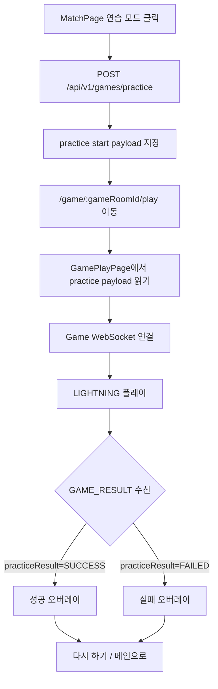
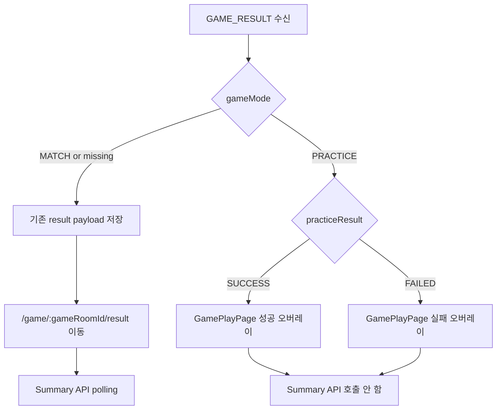
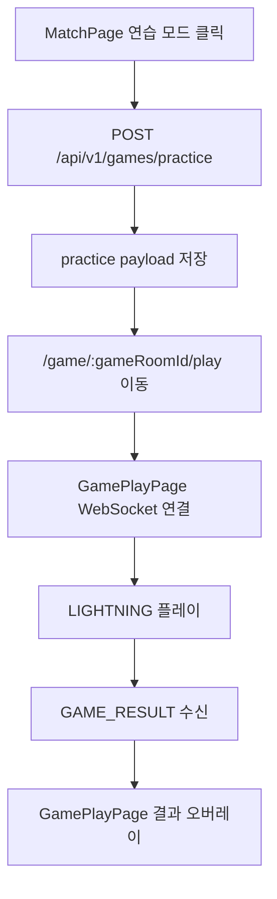

# Issue 122. 연습 모드 프론트 진입 구현

## Feature Description

로그인한 사용자가 MatchPage의 `연습 모드` 버튼을 눌러 매칭 큐, 상대 수락, GameWaitingPage 없이 혼자 바로 GamePlayPage에 진입하고, LIGHTNING 플레이 후 GamePlayPage 내부에서 성공/실패 결과를 확인할 수 있게 구현한다.

이번 이슈는 `docs/antigravity/backend/issue-120-practice-mode-api.md`에서 확정한 백엔드 연습 모드 계약을 프론트에 연결하는 작업이다. 연습 모드는 랭크/LP/전적에 영향을 주지 않는 모드이므로 일반 게임의 `GAME_RESULT -> GameResultPage -> Summary API` 흐름을 타지 않는다. 최종 결과는 WebSocket `GAME_RESULT` payload의 `practiceResult`를 source of truth로 삼고, GamePlayPage 내부 오버레이에서만 표시한다.



일반 랭크 게임과 연습 모드의 결과 흐름은 분리한다.



이번 이슈에 포함되는 범위:

- `POST /api/v1/games/practice` service 구현.
- practice start response type/validator 구현.
- practice start payload sessionStorage 저장/조회 구현.
- MatchPage `연습 모드` 버튼과 Practice Start API 연결.
- Practice Start 성공 시 `/game/:gameRoomId/play` 이동.
- GamePlayPage에서 practice payload만으로 play state 구성.
- practice WebSocket 연결은 기존 `connectGameWebSocket` 정책 재사용.
- practice `GAME_RESULT` 수신 시 GamePlayPage 내부 결과 오버레이 표시.
- `다시 하기 / 메인으로` 액션 구현.
- `gameMode`, `practiceResult`를 프론트 `GameResultPayload`에 반영.
- Locale, Test, 문서 정합성 반영.

후속 이슈로 미루는 범위:

- 연습 결과 저장 테이블.
- 연습 히스토리 조회.
- 연습 통계/성공률 표시.
- 연습 결과 Summary HTTP API.
- 연습 결과를 GameResultPage route로 이동시키는 흐름.
- 연습 모드 랭크/LP/전적 반영.
- 연습 모드 전용 백엔드 API 변경.
- target 좌표 기반 서버 hit 판정.
- 새 외부 패키지 추가.

## Backend Contract

이번 이슈는 백엔드 신규 구현을 하지 않는다. 백엔드 계약은 issue-120에서 구현된 Practice API와 Game WebSocket payload를 그대로 사용한다.

### Practice Start API

```http
POST /api/v1/games/practice
Authorization: Bearer {accessToken}
```

Request body는 없다. 인증/Authorization/401 refresh retry는 기존 `apiClient` 정책을 따른다.

Response:

```ts
interface PracticeGameStartResponse {
  gameRoomId: number
  serverTime: number
  startAt: number
  webSocketUrl: string
  scenario: {
    starCoreMaxHp: number
    durationMs: number
    hpTimeline: {
      timeMs: number
      hp: number
    }[]
  }
}
```

프론트 사용 기준:

- `gameRoomId`는 `/game/:gameRoomId/play` route와 WebSocket handoff key로 사용한다.
- `serverTime`은 백엔드가 응답한 서버 시각이며 storage payload 검증 대상이다.
- `startAt`은 GamePlayPage countdown/play 시작 기준으로 사용한다.
- `webSocketUrl`은 `connectGameWebSocket`의 입력값으로 사용한다.
- `scenario`는 practice HP timeline source of truth로 사용한다.
- `opponent`, `matchId`, rank, LP, record field는 응답에 없다고 가정한다.

### WebSocket Contract

연습 모드는 기존 Game WebSocket endpoint와 message type을 재사용한다.

```http
/ws/game/{gameRoomId}?token={accessToken}
```

token query parameter 연결 정책은 기존 `connectGameWebSocket` 구현을 그대로 따른다.

LIGHTNING client message:

```json
{ "type": "LIGHTNING", "payload": null }
```

LIGHTNING 적용 중간 이벤트:

```ts
interface GameLightningAppliedPayload {
  gameRoomId: number
  userId: number
  serverReceiveTime: number
  lightningTimeMs: number
  starCoreHpAtLightning: number
  damage: number
  afterHp: number
  isKill: boolean
  cooldownUntil: number
}
```

연습 성공 결과:

```json
{
  "type": "GAME_RESULT",
  "payload": {
    "gameRoomId": 123,
    "gameMode": "PRACTICE",
    "result": "PLAYER1_WIN",
    "winnerUserId": 1,
    "reason": "PRACTICE_LIGHTNING_KILL",
    "practiceResult": "SUCCESS",
    "finishedAt": 1710000003000,
    "actions": []
  }
}
```

연습 실패 결과:

```json
{
  "type": "GAME_RESULT",
  "payload": {
    "gameRoomId": 123,
    "gameMode": "PRACTICE",
    "result": "DRAW",
    "winnerUserId": null,
    "reason": "PRACTICE_TIMEOUT",
    "practiceResult": "FAILED",
    "finishedAt": 1710000012000,
    "actions": []
  }
}
```

프론트 `GameResultPayload` 확장 기준:

```ts
type GameMode = 'MATCH' | 'PRACTICE'
type PracticeResult = 'SUCCESS' | 'FAILED'

interface GameResultPayload {
  gameRoomId: number
  gameMode?: GameMode
  result: 'PLAYER1_WIN' | 'PLAYER2_WIN' | 'DRAW'
  winnerUserId: number | null
  reason: string
  practiceResult?: PracticeResult | null
  finishedAt: number
  actions: GameActionSummary[]
}
```

`gameMode`를 optional로 둔다. 기존 일반 게임 테스트/저장 payload가 `gameMode` 없이도 동작할 수 있게 하되, 백엔드 최신 payload가 `gameMode=MATCH|PRACTICE`를 내려주면 그대로 저장/판별한다.

### Source Of Truth Policy

- Practice start source of truth는 `POST /api/v1/games/practice` 응답이다.
- Practice scenario source of truth는 practice start 응답의 `scenario`다.
- Practice LIGHTNING 적용 여부는 `LIGHTNING_APPLIED` WebSocket 이벤트 기준이다.
- Practice final result source of truth는 `GAME_RESULT` WebSocket payload다.
- Practice result는 Game Result Summary API를 source로 사용하지 않는다.
- Practice result는 rank/LP/record source로 사용하지 않는다.
- Practice result는 GamePlayPage 내부 표시 상태로만 사용한다.

### Error Policy

- Practice Start API 실패 시 GamePlayPage로 이동하지 않는다.
- API 실패는 MatchPage의 기존 error modal 패턴으로 표시한다.
- 이미 active game room이 있어 backend가 차단하면 사용자는 현재 화면에 남긴다.
- practice payload가 없거나 route `gameRoomId`와 mismatch면 기존 GamePlayPage 정책처럼 `/match`로 복귀한다.
- practice WebSocket 연결 실패는 GamePlayPage socket error 상태로 표시한다.
- practice 결과 수신 후 들어오는 WebSocket close/error는 결과 오버레이 상태를 덮어쓰지 않는다.

## Scope Boundary

이번 이슈에 포함:

- `practiceService.startPractice(signal?)` 추가.
- `PracticeGameStartResponse` type 추가.
- practice start response validator 구현.
- `practiceGameStartPayload` storage service 추가.
- `league-of-star.practiceGameStartPayload:{gameRoomId}` key 정책 추가.
- MatchPage practice 상태 추가.
- MatchPage 연습 모드 버튼 loading/disabled/error 처리.
- MatchPage 연습 모드 성공 시 practice payload 저장 후 `/game/:gameRoomId/play` 이동.
- GamePlayPage에서 일반 게임 payload와 practice payload source 분기.
- GamePlayPage에서 practice payload만으로 play state 구성.
- GamePlayPage에서 practice `GAME_RESULT` 수신 시 route 이동 없이 결과 오버레이 표시.
- practice 결과 수신 후 LIGHTNING 입력 비활성화.
- practice 결과 오버레이의 `다시 하기 / 메인으로` 버튼 구현.
- GameResultPayload의 `gameMode`, `practiceResult` 정합성 반영.
- 한국어/영어 locale 추가.
- service/storage/MatchPage/GamePlayPage 테스트 추가.
- `front-plan.md` GameResultPayload 및 연습 모드 정책 정합성 반영.
- `docs/last-구현.md` Section 4-2 정합성 반영.
- issue-122 PR 섹션 보강.

이번 이슈에서 제외:

- 백엔드 Practice API 변경.
- 백엔드 WebSocket 계약 변경.
- GameWaitingPage 연습 모드 연결.
- GameResultPage 연습 모드 연결.
- Summary API practice 호출.
- 연습 결과 저장/조회.
- 연습 통계/성공률 표시.
- 랭크/LP/전적 반영.
- 사용자 지정 게임.
- 새 외부 패키지 추가.

## Tasks

### 1. Frontend Practice Contract 정리

- [ ] issue-120 Practice Start API 계약 재확인.
- [ ] practice response shape를 프론트 type으로 문서화.
- [ ] `gameMode`, `practiceResult`가 GameResultPayload에 필요함을 문서화.
- [ ] 연습 모드는 GameWaitingPage를 생략함을 문서화.
- [ ] 연습 모드는 GameResultPage/Summary API를 사용하지 않음을 문서화.
- [ ] 일반 ranked match의 result route/Summary API 흐름은 유지함을 문서화.
- [ ] 연습 결과 미저장/미정산 정책 문서화.

### 2. Practice Service / Storage 구현

- [ ] `practiceService.startPractice(signal?)` 구현.
- [ ] `POST /api/v1/games/practice` path와 method 고정.
- [ ] request body를 보내지 않음.
- [ ] `PracticeGameStartResponse` type 추가.
- [ ] response validator 구현.
- [ ] invalid response는 route 이동하지 않게 처리.
- [ ] `practiceGameStartPayload` storage service 추가.
- [ ] 저장 payload에 `receivedAt` 포함.
- [ ] broken JSON, invalid payload, route id mismatch는 `null` 반환.

### 3. MatchPage Practice Entry 구현

- [ ] 연습 모드 버튼에 클릭 handler 연결.
- [ ] 연습 모드 버튼에 `data-testid` 추가.
- [ ] practice pending 상태 추가.
- [ ] practice pending 중 중복 클릭 방지.
- [ ] practice pending 중 match start/custom/logout 등 충돌 가능 동작을 최소한으로 방어.
- [ ] API 성공 시 practice payload 저장.
- [ ] 저장 성공 시 `/game/:gameRoomId/play`로 이동.
- [ ] API 실패 시 기존 error modal 패턴으로 표시.
- [ ] practice 시작 중 match queue join/leave, match SSE, accept/reject API를 호출하지 않음.

### 4. GamePlayPage Practice Source 구현

- [ ] route `gameRoomId` 기준 practice payload 조회.
- [ ] 일반 게임 payload가 있으면 기존 `gameStartPayload + gameWaitingPayload` 흐름 유지.
- [ ] practice payload가 있으면 waiting payload 없이 playState 생성.
- [ ] practice playState의 `webSocketUrl`은 practice response를 사용.
- [ ] practice playState의 `scenario`, `startAt`, `durationMs`는 practice response를 사용.
- [ ] practice mode data attribute 추가.
- [ ] practice mode에서 상대 userId가 없어도 LIGHTNING/HP/Three.js 로직이 동작하게 처리.
- [ ] payload가 없거나 mismatch면 `/match` 복귀.

### 5. Practice GAME_RESULT / Overlay 구현

- [ ] `GameResultPayload` type에 `gameMode`, `practiceResult` 추가.
- [ ] `gameResultPayload` validator가 `gameMode`, `practiceResult`를 허용하게 수정.
- [ ] `GAME_RESULT.gameMode === 'PRACTICE'` 분기 추가.
- [ ] practice `GAME_RESULT` 수신 시 `/result` route로 이동하지 않음.
- [ ] `practiceResult=SUCCESS`면 성공 오버레이 표시.
- [ ] `practiceResult=FAILED`면 실패 오버레이 표시.
- [ ] invalid practice result는 socket error 상태로 표시.
- [ ] practice result 수신 후 LIGHTNING 입력 비활성화.
- [ ] result 이후 WebSocket close/error가 overlay 상태를 덮지 않게 유지.
- [ ] `다시 하기` 클릭 시 새 practice start API 호출 후 새 room으로 `router.replace`.
- [ ] `메인으로` 클릭 시 `/match` 이동.

### 6. UI / Locale 구현

- [ ] MatchPage practice loading label 추가.
- [ ] MatchPage practice error fallback 문구 추가.
- [ ] GamePlayPage practice result overlay UI 추가.
- [ ] 성공 문구 추가.
- [ ] 실패 문구 추가.
- [ ] 다시 하기 버튼 문구 추가.
- [ ] 메인으로 버튼 문구 추가.
- [ ] practice result overlay에서 LP/rank/record/상대 정보 표시하지 않음.
- [ ] 한국어/영어 locale 정합성 반영.

### 7. Test 구현

- [ ] `practiceService` path/method/body 없음 검증.
- [ ] `practiceGameStartPayload` 저장/조회/invalid/mismatch 테스트.
- [ ] MatchPage 연습 모드 클릭 성공 시 service 호출, payload 저장, play route 이동 검증.
- [ ] MatchPage 연습 모드 pending 중 중복 클릭 방지 검증.
- [ ] MatchPage 연습 모드 실패 시 error modal 표시 검증.
- [ ] 연습 모드 시작이 match queue/SSE를 호출하지 않는지 검증.
- [ ] GamePlayPage가 practice payload만으로 playState를 구성하는지 검증.
- [ ] GamePlayPage practice mode에서 WebSocket 연결 URL을 practice response에서 사용하는지 검증.
- [ ] practice `GAME_RESULT SUCCESS` 수신 시 route 이동 없이 성공 오버레이 표시 검증.
- [ ] practice `GAME_RESULT FAILED` 수신 시 route 이동 없이 실패 오버레이 표시 검증.
- [ ] 일반 match `GAME_RESULT`는 기존처럼 result route로 이동하는지 회귀 검증.
- [ ] 다시 하기 / 메인으로 버튼 동작 검증.

### 8. 문서 정합성 구현

- [ ] `front-plan.md` GameResultPayload에 `gameMode`, `practiceResult` 확장 반영.
- [ ] `front-plan.md` 일반 game result 흐름과 practice result 흐름 분리 설명 반영.
- [ ] `docs/last-구현.md` Section 4-2 완료 상태 반영.
- [ ] issue-120 백엔드 계약과 response/source of truth 정합성 확인.
- [ ] issue-92 LIGHTNING 입력 정책과 충돌 없는지 확인.
- [ ] issue-94 GAME_RESULT route 이동 정책이 일반 game 기준임을 보강.
- [ ] issue-122 PR 섹션 보강.

### 9. 검증

- [ ] `npm run test -- practice`
- [ ] `npm run test -- MatchPage`
- [ ] `npm run test -- GamePlayPage`
- [ ] `npm run test -- gameResultPayload`
- [ ] `npm run format`
- [ ] `npm run lint`
- [ ] `npm run typecheck`
- [ ] `npm run test`
- [ ] `npm run build`
- [ ] 브라우저에서 연습 모드 클릭 후 GamePlayPage 진입 확인.
- [ ] mock WebSocket으로 practice `GAME_RESULT SUCCESS` 오버레이 확인.
- [ ] mock WebSocket으로 practice `GAME_RESULT FAILED` 오버레이 확인.
- [ ] 일반 매칭 게임 result route 이동 회귀 확인.

## Implementation Policy

- Practice Start HTTP 응답은 play 진입 handoff source로 처리한다.
- Practice Start API는 match queue/SSE/accept/reject 흐름과 연결하지 않는다.
- 연습 모드는 GameWaitingPage를 거치지 않는다.
- 연습 모드는 GameResultPage를 거치지 않는다.
- 연습 모드는 Summary API를 호출하지 않는다.
- practice 최종 성공/실패는 `GAME_RESULT.practiceResult` 기준으로 표시한다.
- practice LIGHTNING/HP/쿨타임은 기존 GamePlayPage 로직을 재사용한다.
- practice payload는 sessionStorage handoff 용도로만 저장한다.
- practice 결과는 히스토리/통계/전적 source로 저장하지 않는다.
- 일반 ranked match의 기존 `GAME_RESULT -> GameResultPage -> Summary API` 흐름은 유지한다.
- WebSocket access token query parameter 정책은 기존 `connectGameWebSocket`을 따른다.
- 새 외부 패키지를 추가하지 않는다.

## Acceptance Criteria

- MatchPage에서 연습 모드 버튼을 누르면 `POST /api/v1/games/practice`가 호출된다.
- Practice Start 성공 시 `/game/:gameRoomId/play`로 이동한다.
- 연습 모드 시작 중 match queue join/leave, match SSE, accept/reject API가 호출되지 않는다.
- GamePlayPage는 practice payload만으로 scenario, startAt, webSocketUrl을 구성한다.
- GamePlayPage는 practice room WebSocket에 연결한다.
- LIGHTNING 입력과 HP 표시는 기존 GamePlayPage 전투 UX와 동일하게 동작한다.
- practice `GAME_RESULT.practiceResult=SUCCESS` 수신 시 성공 오버레이가 표시된다.
- practice `GAME_RESULT.practiceResult=FAILED` 수신 시 실패 오버레이가 표시된다.
- practice 결과 수신 시 `/game/:gameRoomId/result`로 이동하지 않는다.
- practice 결과에서 Summary API를 호출하지 않는다.
- 다시 하기 버튼으로 새 practice room을 시작할 수 있다.
- 메인으로 버튼으로 `/match`에 복귀할 수 있다.
- 일반 ranked match의 result route/Summary API 흐름은 깨지지 않는다.
- format/lint/typecheck/test/build가 통과한다.

## PR Message

## PR 작성 방법

## 📌 Summary

연습 모드 프론트 진입과 GamePlayPage 내부 결과 오버레이를 구현함.



핵심 정책:

- 연습 모드는 match queue, match response, GameWaitingPage를 거치지 않음.
- 연습 시작 API 응답은 GamePlayPage 진입 handoff source로 사용함.
- 연습 결과는 WebSocket `GAME_RESULT.practiceResult`를 최종 source로 사용함.
- 연습 모드는 GameResultPage와 Summary API를 사용하지 않음.
- 일반 ranked match의 결과 route/Summary API 흐름은 유지함.

백엔드와의 구현 계약:

- `POST /api/v1/games/practice`는 request body 없이 호출함.
- 응답의 `gameRoomId`, `serverTime`, `startAt`, `webSocketUrl`, `scenario`를 저장하고 play 화면 source로 사용함.
- WebSocket은 기존 `/ws/game/{gameRoomId}`와 token query parameter 정책을 재사용함.
- practice 성공/실패는 `GAME_RESULT.gameMode=PRACTICE`, `practiceResult=SUCCESS|FAILED`로 판단함.
- rank/LP/record는 practice 결과에 표시하거나 저장하지 않음.

## 📚 Changes

- 사용자가 연습 모드를 누르면 바로 게임 화면으로 갈 수 있게 함.
  일반 매칭은 상대를 찾고 수락을 기다려야 하지만, 연습 모드는 혼자 하는 모드라서 Practice Start API 응답만 있으면 바로 플레이할 수 있음.
- 연습 모드 전용 payload 저장 흐름을 추가함.
  기존 waiting payload는 상대와 matchId가 필요하므로 연습 모드에 맞지 않는다. 그래서 practice start 응답만 저장하고 GamePlayPage가 이 값을 읽어 시작하게 함.
- GamePlayPage에서 일반 게임과 연습 모드 결과 처리를 분리함.
  일반 게임은 결과 route와 Summary API를 유지하고, 연습 모드는 play 화면 안에서 성공/실패만 보여줌.
- 연습 결과가 랭크/전적처럼 보이지 않게 함.
  연습 모드는 LP나 전적에 반영되지 않으므로 결과 오버레이에도 정산 정보나 상대 정보를 표시하지 않음.

## 📝 Note

- 연습 결과 저장/히스토리/통계는 이번 PR에서 제외함.
- 백엔드 Practice API 변경은 없음.
- 새 패키지 추가 없음.
- 검증 결과를 기입함.

## 📌 Related Issue

- Closes #122
