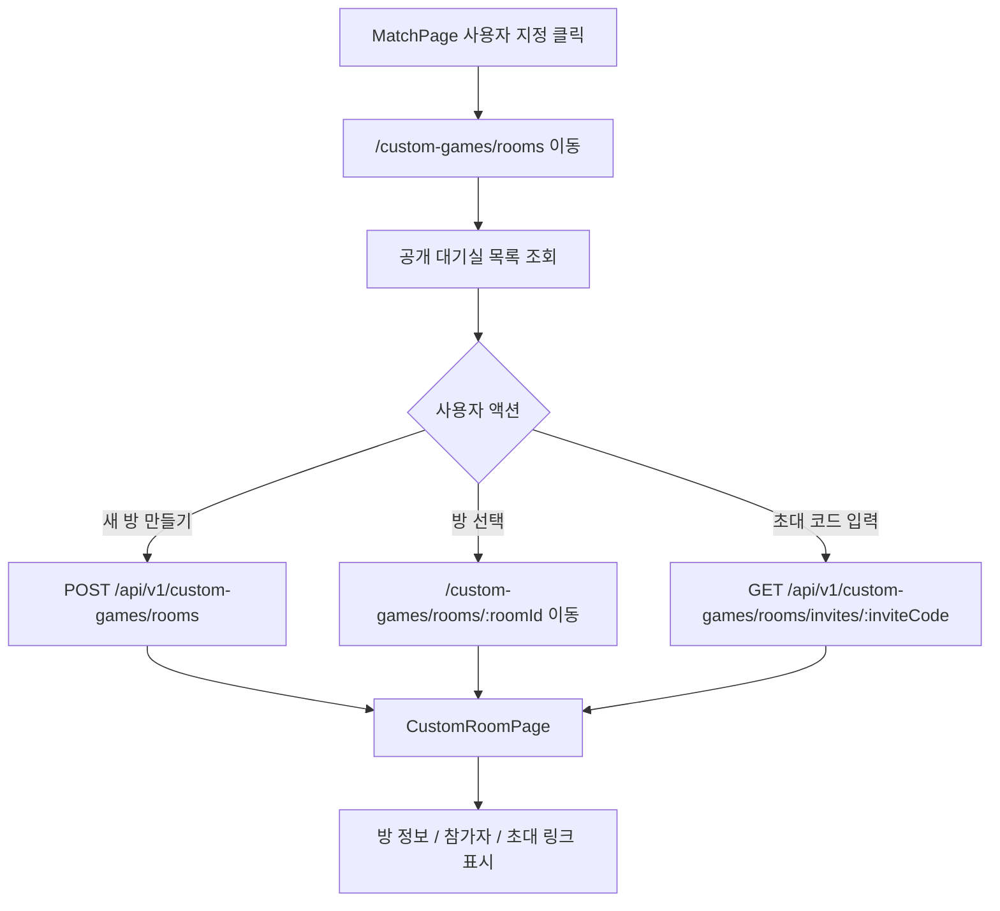
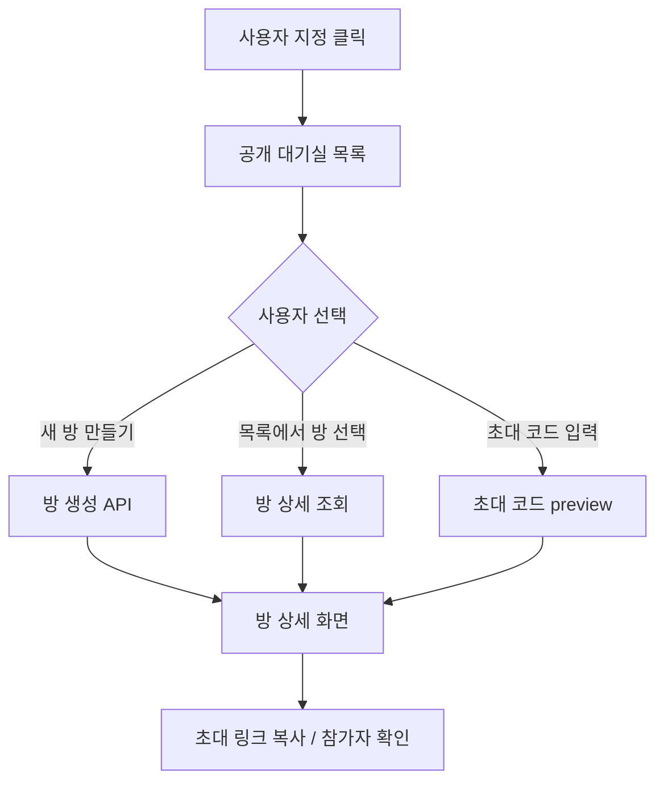

# Issue 134. Custom Room 공개 대기실 / 초대 링크 프론트 구현

## Feature Description

MatchPage의 `사용자 지정` 버튼에서 공개 대기실 목록으로 이동하고, 사용자가 custom room을 만들거나 공개 목록/초대 코드로 방을 확인할 수 있게 구현한다.

이번 이슈는 사용자 지정 게임 프론트 흐름의 첫 진입 단계다. 아직 실제 참가, 나가기, Room WebSocket 동기화, 게임 시작, GamePlay 이동은 처리하지 않는다. 방을 찾고 확인하는 단계와 방에 참가해서 실시간으로 동기화되는 단계를 분리해, 사용자 지정 게임 흐름이 일반 매칭 큐와 섞이지 않게 한다.



이번 이슈에 포함되는 범위:

- custom room frontend type/service 구현.
- MatchPage `사용자 지정` 버튼 route 연결.
- 공개 대기실 목록 화면 구현.
- 새 방 만들기 API 연결.
- 초대 코드 preview API 연결.
- CustomRoomPage route 구현.
- CustomRoomPage에서 room 단건 조회 API 호출.
- 방 이름, 현재 인원, 방장, 참가자 목록 표시.
- 초대 링크 생성/복사 UI 구현.
- Locale, Test, 문서 정합성 반영.

후속 이슈로 미루는 범위:

- 초대 링크로 들어온 사용자의 실제 참가 처리.
- `POST /api/v1/custom-games/rooms/{inviteCode}/join` 프론트 연결.
- `POST /api/v1/custom-games/rooms/{roomId}/leave` 프론트 연결.
- Custom Room WebSocket 연결.
- `ROOM_UPDATED`, `ROOM_CLOSED`, `ROOM_STARTED` 처리.
- 방장 start 버튼.
- Custom GamePlay route 이동.
- Custom Game 결과 화면 연결.
- 새 외부 패키지 추가.

## Backend Contract

이번 이슈는 기존 Custom Room API를 프론트에 연결한다. 다만 `/custom-games/rooms/:roomId` route에서 새로고침/직접 진입 시 방 상세를 다시 불러와야 하므로, roomId 단건 조회 API를 최소 보강한다.

기존 backend custom room 이슈와의 정합성:

- issue-124는 방 생성, 공개 목록, 초대 코드 preview까지만 담당한다. 이번 프론트 이슈는 이 세 API를 화면에 연결한다.
- issue-126은 실제 join/leave command를 담당한다. 이번 프론트 이슈는 방을 보는 단계만 담당하므로 join/leave API를 호출하지 않는다.
- issue-128은 Custom Room WebSocket 동기화를 담당한다. 해당 WebSocket은 room participant만 연결할 수 있으므로, 아직 참가 처리를 하지 않는 이번 preview/detail 화면에서는 연결하지 않는다.
- issue-130은 방장 start와 `ROOM_STARTED` handoff를 담당한다. 이번 프론트 이슈는 start 버튼과 play 이동을 포함하지 않는다.
- issue-132는 Custom Game 결과와 전적/랭크 정책을 담당한다. 이번 프론트 이슈는 게임 시작 전 대기실 탐색 범위라 결과 정책을 호출하지 않는다.

### Custom Room Create API

```http
POST /api/v1/custom-games/rooms
Authorization: Bearer {accessToken}
```

Request body는 없다.

Response:

```ts
interface CustomRoomResponse {
  roomId: number
  roomName: string
  inviteCode: string
  ownerUserId: number
  status: 'WAITING' | 'STARTED' | 'CLOSED'
  maxParticipants: number
  participants: CustomRoomParticipant[]
}

interface CustomRoomParticipant {
  userId: number
  nickname: string
  role: 'OWNER' | 'PLAYER'
}
```

프론트 사용 기준:

- `roomId`는 CustomRoomPage route parameter로 사용한다.
- `inviteCode`는 초대 링크 생성 기준으로 사용한다.
- `participants`는 방 상세의 참가자 목록 source of truth로 사용한다.
- HTTP 200은 방 생성 완료 응답이다. WebSocket ack가 아니다.

### Public Room List API

```http
GET /api/v1/custom-games/rooms
```

인증 없이 호출 가능하다. 모든 `WAITING` custom room을 공개 대기실 목록으로 반환한다.

Response:

```ts
interface CustomRoomListResponse {
  rooms: CustomRoomListItem[]
}

interface CustomRoomListItem {
  roomId: number
  roomName: string
  inviteCode: string
  ownerUserId: number
  status: 'WAITING'
  maxParticipants: number
  currentParticipants: number
}
```

프론트 사용 기준:

- 목록은 대기실 탐색용이다.
- 목록 클릭은 실제 참가가 아니라 방 상세 보기로 처리한다.
- 실제 참가는 후속 이슈의 join API에서 처리한다.

### Invite Preview API

```http
GET /api/v1/custom-games/rooms/invites/{inviteCode}
```

인증 없이 호출 가능하다. 초대 코드로 `WAITING` custom room을 조회한다.

프론트 사용 기준:

- 초대 코드 입력 후 방 존재 여부와 현재 상태를 확인하는 preview로만 사용한다.
- preview 성공 시 응답의 `roomId`로 CustomRoomPage에 이동한다.
- preview는 참가 처리하지 않는다.

### Room Detail API

```http
GET /api/v1/custom-games/rooms/{roomId}
```

이번 이슈에서 프론트 상세 route 새로고침을 위해 추가한다.

프론트 사용 기준:

- `CustomRoomPage` mount 시 호출한다.
- 응답은 `CustomRoomResponse`를 사용한다.
- `WAITING` room만 조회 대상으로 삼는다.
- 조회만 수행하고 참가자 추가, 상태 변경, WebSocket 연결은 하지 않는다.
- 공개 목록에 이미 노출된 `roomId`를 상세 조회에만 사용한다.
- 외부 공유 링크는 `roomId`가 아니라 `inviteCode`로 생성한다.

### Source Of Truth Policy

- 공개 대기실 목록 source of truth는 `GET /api/v1/custom-games/rooms` 응답이다.
- 방 상세 source of truth는 `GET /api/v1/custom-games/rooms/{roomId}` 응답이다.
- 초대 코드 preview source of truth는 `GET /api/v1/custom-games/rooms/invites/{inviteCode}` 응답이다.
- 초대 링크 source는 백엔드가 내려준 `inviteCode`다.
- 참가자 목록은 `CustomRoomResponse.participants`를 사용한다.
- Room WebSocket이 없는 이번 이슈에서는 실시간 변경을 자동 반영하지 않는다.

### Error Policy

- 목록 조회 실패 시 공개 대기실 화면에 재시도 가능한 error state를 표시한다.
- 방 생성 실패 시 CustomRoomPage로 이동하지 않는다.
- 이미 사용자가 `WAITING` custom room을 가지고 있어 생성이 실패하면 backend error를 표시한다.
- 초대 코드가 비어 있으면 API를 호출하지 않고 입력 오류를 표시한다.
- 초대 코드 preview 실패 시 현재 공개 대기실 화면에 남긴다.
- room detail 조회 실패 시 방 상세 화면에 error state와 공개 대기실 복귀 액션을 표시한다.

## Scope Boundary

이번 이슈에 포함:

- `CustomRoomResponse`, `CustomRoomListResponse` frontend type 추가.
- `customRoomService` 추가.
- `GET /api/v1/custom-games/rooms/{roomId}` backend 최소 보강.
- MatchPage `사용자 지정` 버튼 route 연결.
- `/custom-games/rooms` route 추가.
- `/custom-games/rooms/:roomId` route 추가.
- `CustomRoomsPage` 구현.
- `CustomRoomPage` 구현.
- 초대 링크 복사 버튼 구현.
- custom room locale 추가.
- service/page/router 테스트 추가.
- `docs/last-구현.md` Section 4-8 체크 반영.
- `front-plan.md`, 관련 issue 문서 정합성 반영.
- issue-134 PR 섹션 보강.

이번 이슈에서 제외:

- 실제 방 참가 API 연결.
- 방 나가기 API 연결.
- Custom Room WebSocket 연결.
- Room WebSocket session 관리.
- 참가자 실시간 동기화.
- 방장 게임 시작 버튼.
- `ROOM_STARTED` 수신 처리.
- GamePlayPage 이동.
- custom game result 처리.
- 새 패키지 추가.

## Tasks

### 1. Frontend Custom Room Contract 정리

- [x] 기존 issue-124/126/128/130/132 custom room backend 계약을 재확인한다.
- [x] 공개 목록, 방 생성, 초대 코드 preview, room detail API 역할을 문서화한다.
- [x] roomId는 내부 상세 조회 route에만 사용하고, 초대 링크는 inviteCode를 사용함을 문서화한다.
- [x] 이번 이슈에서 join/leave/WebSocket/start/GamePlay를 제외함을 문서화한다.
- [x] `last-구현.md` 4-8 범위와 정합성을 확인한다.

### 2. Backend Room Detail API 보강

- [ ] `CustomGamePath`에 room detail path 상수를 추가한다.
- [ ] `CustomGameRoomController`에 `GET /api/v1/custom-games/rooms/{roomId}`를 추가한다.
- [ ] 기존 `CustomGameRoomService.getWaitingRoom(roomId)` 흐름을 재사용한다.
- [ ] API 모듈에서 repository를 직접 참조하지 않는다.
- [ ] RestDocs/OpenAPI 문서에 room detail API를 추가한다.
- [ ] room not found / invalid state error 계약을 확인한다.

### 3. Custom Room Service / Type 구현

- [ ] `CustomRoomResponse`, `CustomRoomListResponse`, `CustomRoomParticipant` type을 추가한다.
- [ ] `getCustomRooms(signal?)`를 구현한다.
- [ ] `createCustomRoom(signal?)`를 구현한다.
- [ ] `getCustomRoom(roomId, signal?)`를 구현한다.
- [ ] `getCustomRoomInvitePreview(inviteCode, signal?)`를 구현한다.
- [ ] 새 외부 패키지를 추가하지 않는다.

### 4. Route / MatchPage 연결

- [ ] `/custom-games/rooms` route를 추가한다.
- [ ] `/custom-games/rooms/:roomId` route를 추가한다.
- [ ] 두 route 모두 로그인 사용자 route로 처리한다.
- [ ] MatchPage `사용자 지정` 버튼을 공개 대기실 route로 연결한다.
- [ ] 매칭 진행 중 사용자 지정 진입 정책을 기존 match queue 상태와 충돌하지 않게 정리한다.
- [ ] router/auth guard 테스트를 갱신한다.

### 5. CustomRoomsPage 구현

- [ ] mount 시 공개 대기실 목록을 조회한다.
- [ ] loading / empty / success / error state를 구현한다.
- [ ] 목록에서 roomName, 현재 인원, 최대 인원, 방장 정보를 표시한다.
- [ ] 목록 row 클릭 시 상세 route로 이동한다.
- [ ] 새 방 만들기 버튼을 create room API와 연결한다.
- [ ] 방 생성 성공 시 상세 route로 이동한다.
- [ ] 초대 코드 입력 UI를 구현한다.
- [ ] 초대 코드 preview 성공 시 상세 route로 이동한다.
- [ ] 초대 코드 preview 실패 state를 구현한다.

### 6. CustomRoomPage 구현

- [ ] route `roomId`로 room detail API를 호출한다.
- [ ] 방 이름, 상태, 현재 인원, 최대 인원을 표시한다.
- [ ] 참가자 목록과 방장 badge를 표시한다.
- [ ] `inviteCode` 기반 초대 링크를 생성한다.
- [ ] 초대 링크 복사 버튼을 구현한다.
- [ ] clipboard 실패 시 fallback error message를 표시한다.
- [ ] WebSocket이 없으므로 수동 새로고침 버튼을 제공한다.
- [ ] 공개 대기실 복귀 액션을 제공한다.

### 7. UI / Locale 구현

- [ ] 한국어 locale을 추가한다.
- [ ] 영어 locale을 추가한다.
- [ ] Match/Profile 계열 배경과 시각 톤을 맞춘다.
- [ ] 버튼 hover/disabled/loading 상태를 명확히 한다.
- [ ] desktop/mobile에서 text overflow와 horizontal overflow를 방지한다.

### 8. Test 구현

- [ ] custom room service path/method 테스트를 추가한다.
- [ ] CustomRoomsPage 목록 조회 성공/빈 목록/실패 테스트를 추가한다.
- [ ] CustomRoomsPage 새 방 만들기 성공/실패 테스트를 추가한다.
- [ ] CustomRoomsPage 초대 코드 preview 성공/실패 테스트를 추가한다.
- [ ] CustomRoomPage 상세 조회 성공/실패 테스트를 추가한다.
- [ ] CustomRoomPage 초대 링크 복사 테스트를 추가한다.
- [ ] MatchPage 사용자 지정 버튼 route 이동 테스트를 추가한다.
- [ ] router protected route 테스트를 갱신한다.

### 9. 문서 정합성 구현

- [ ] `docs/last-구현.md` 4-8 세부 체크박스를 완료 처리한다.
- [ ] `docs/last-구현.md` 하단 Section 4-8 체크를 완료 처리한다.
- [ ] `docs/antigravity/frontend/front-plan.md` custom room 프론트 흐름과 정합성을 확인한다.
- [ ] `docs/antigravity/backend/issue-124-custom-room-create-read-api.md`에 room detail API 보강 내용을 맞춘다.
- [ ] issue-134 Tasks 완료 상태를 반영한다.
- [ ] issue-134 PR 섹션을 설계 중심으로 보강한다.

### 10. 검증

- [ ] backend custom room controller 테스트를 통과시킨다.
- [ ] backend build를 통과시킨다.
- [ ] frontend 관련 테스트를 통과시킨다.
- [ ] `npm run format`을 통과시킨다.
- [ ] `npm run lint`를 통과시킨다.
- [ ] `npm run typecheck`를 통과시킨다.
- [ ] `npm run test`를 통과시킨다.
- [ ] `npm run build`를 통과시킨다.
- [ ] desktop `1440x900` UI overflow를 확인한다.
- [ ] mobile `390x844` UI overflow를 확인한다.

## Implementation Policy

- 공개 대기실 목록 조회는 참가 처리가 아니다.
- 초대 코드 preview는 참가 처리가 아니다.
- CustomRoomPage 진입은 참가 처리가 아니다.
- 실제 참가 처리는 후속 join API 프론트 이슈에서 처리한다.
- Room WebSocket은 이번 이슈에서 연결하지 않는다.
- roomId는 내부 route/detail 조회에 사용한다.
- 외부 공유 링크는 inviteCode를 사용한다.
- 초대 링크를 복사할 수 있게 하되, 초대 링크 route의 실제 참가 처리는 후속 이슈로 둔다.
- HTTP 응답을 WebSocket 이벤트처럼 해석하지 않는다.
- 실시간 참가자 목록 변경은 이번 이슈에서 자동 반영하지 않는다.
- 수동 새로고침은 room detail API를 다시 호출한다.
- API 모듈은 backend repository를 직접 참조하지 않는다.
- 프론트는 백엔드 응답을 source of truth로 사용하고 임의 참가자 상태를 만들지 않는다.
- 새 패키지를 추가하지 않는다.

## Acceptance Criteria

- MatchPage의 `사용자 지정` 버튼으로 공개 대기실 목록에 진입할 수 있다.
- 공개 대기실 목록에서 `WAITING` custom room을 확인할 수 있다.
- 새 방 만들기로 custom room을 생성하고 상세 화면으로 이동할 수 있다.
- 초대 코드 입력으로 방을 찾고 상세 화면으로 이동할 수 있다.
- CustomRoomPage에서 방 이름, 참가자 목록, 방장, 초대 링크를 확인할 수 있다.
- 초대 링크는 inviteCode 기반으로 생성된다.
- 초대 링크를 복사할 수 있다.
- 이번 이슈에서 join/leave/WebSocket/start/GamePlay가 실행되지 않는다.
- 일반 match queue 상태와 custom room 생성/조회 흐름이 섞이지 않는다.
- 문서에서 4-8 완료 범위와 4-9 이후 범위가 명확히 분리된다.
- backend/frontend 테스트, lint, typecheck, build가 통과한다.

## PR Message

## PR 작성 방법

## 📌 Summary

MatchPage에서 사용자 지정 게임 공개 대기실로 들어가 방을 만들고, 공개 목록이나 초대 코드로 방을 확인할 수 있게 구현함.

이번 PR은 “방을 찾고 확인하는 단계”만 만든다. 실제 방 참가, 나가기, WebSocket 동기화, 게임 시작은 후속 이슈로 분리한다. 이렇게 나눈 이유는 사용자가 목록을 보는 행위와 서버가 참가자로 등록하는 행위가 다르기 때문임.



핵심 정책:

- 공개 대기실 목록 조회는 참가 처리가 아님.
- 초대 코드 preview도 참가 처리가 아님.
- 초대 링크는 roomId가 아니라 inviteCode를 기준으로 만듦.
- Room WebSocket 연결과 실시간 동기화는 후속 이슈에서 처리함.
- 새 패키지를 추가하지 않음.

백엔드와의 구현 계약:

- `GET /api/v1/custom-games/rooms`는 공개 대기실 목록 source of truth임.
- `POST /api/v1/custom-games/rooms`는 방 생성 완료 응답이며 WebSocket ack가 아님.
- `GET /api/v1/custom-games/rooms/invites/{inviteCode}`는 초대 코드 preview source of truth임.
- `GET /api/v1/custom-games/rooms/{roomId}`는 상세 route 새로고침을 위한 room detail source of truth임.
- 참가/나가기/시작은 이번 PR에서 호출하지 않음.

## 📚 Changes

- 공개 대기실과 실제 참가를 분리함.
  사용자가 방 목록을 보는 것만으로 서버 참가자가 되면, 뒤로 가기나 새로고침 같은 단순 탐색도 DB 상태 변경으로 이어진다. 그래서 이번 PR에서는 목록 보기, 초대 코드 preview, 상세 보기를 모두 read-only 흐름으로 유지하고 실제 참가 처리는 후속 join 이슈로 분리함.

- roomId 상세 조회 API를 최소 보강함.
  프론트 route가 `/custom-games/rooms/:roomId` 형태이면 사용자가 상세 화면에서 새로고침했을 때 다시 방 정보를 가져올 수 있어야 한다. 기존에는 inviteCode preview와 목록 조회만 있어 상세 route source가 애매했으므로, roomId 단건 조회 API를 추가해 화면 복구 기준을 명확히 함.

- 초대 링크는 inviteCode 기준으로 생성함.
  roomId는 내부 상세 route와 API 조회에만 사용한다. 외부에 공유되는 링크는 inviteCode를 사용해야 방 식별 정책이 일관되고, 후속 초대 참가 이슈에서 그대로 join 흐름으로 이어갈 수 있음.

- WebSocket을 일부러 연결하지 않음.
  이번 화면은 “방을 확인하는 단계”다. 실시간 참가자 변경, 퇴장, 시작 이벤트를 받기 시작하면 join/leave/start 정책까지 같이 들어와야 한다. 그래서 이번 PR은 HTTP 조회 기반으로 두고, Room WebSocket은 후속 이슈에서 참가 처리와 함께 연결함.

- API/프론트 책임을 분리함.
  백엔드 API 모듈은 HTTP 계약과 response 변환만 담당하고, custom room 조회는 core service를 통해 수행한다. 프론트도 service/type/page를 분리해 화면이 직접 URL 문자열을 흩뿌리지 않게 함.

## 📝 Note

- 이번 PR에서 실제 방 참가, 나가기, WebSocket 연결, 방 시작, GamePlay 이동은 제외함.
- 초대 링크 route의 실제 참가 처리는 후속 4-9 범위임.
- 방장 start와 `ROOM_STARTED` 처리는 후속 4-10 범위임.
- 새 패키지 추가 없음.
- 검증 결과:
  - backend custom room controller test 통과.
  - backend build 통과.
  - frontend format/lint/typecheck/test/build 통과.
  - desktop/mobile overflow 확인 완료.

## 📌 Related Issue

- Closes #134
