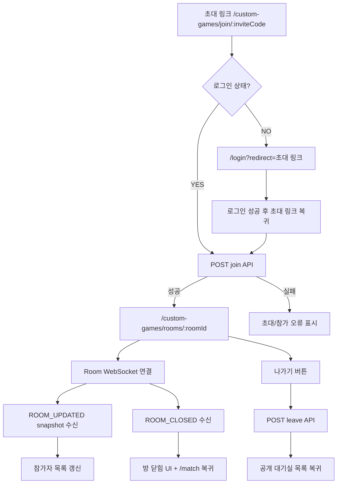
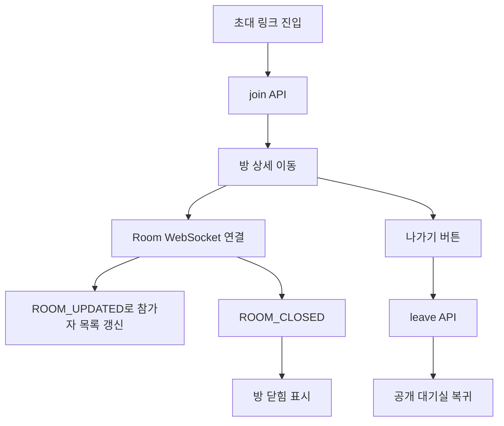

# Issue 136. Custom Room 참가 / 나가기 및 실시간 대기실 동기화 구현

## Feature Description

초대 링크 또는 공개 대기실에서 사용자가 사용자 지정 방에 실제 참가하고, 방 안의 참가자 변경을 Room WebSocket으로 실시간 동기화할 수 있게 구현한다.

이번 이슈는 issue-134에서 만든 “방을 찾고 확인하는 화면” 다음 단계다. issue-134는 preview/read 흐름까지만 담당했고, 이번 이슈는 `join`, `leave`, `ROOM_UPDATED`, `ROOM_CLOSED`를 프론트에 연결한다. 게임 시작 버튼, `ROOM_STARTED` 수신, GamePlay 이동은 후속 4-10 범위로 남긴다.



이번 이슈에 포함되는 범위:

- `join` / `leave` API 프론트 service 연결.
- 초대 링크 route에서 실제 join 수행.
- 비로그인 사용자의 로그인 후 초대 링크 복귀 처리.
- CustomRoomPage에서 Room WebSocket 연결.
- `ROOM_UPDATED`, `ROOM_CLOSED`, `ERROR` 처리.
- 나가기 버튼 구현.
- Locale, Test, 문서 정합성 반영.

후속 이슈로 미루는 범위:

- 방장 시작 버튼.
- `POST /api/v1/custom-games/rooms/{roomId}/start` 프론트 연결.
- `ROOM_STARTED` 수신 처리.
- Custom Game start payload 저장.
- GamePlayPage 이동.
- custom game 결과 화면 연결.
- 친구 목록 기반 초대.
- 새 외부 패키지 추가.

## Backend Contract

이번 이슈는 기존 backend issue-126, issue-128 계약을 프론트에 연결한다. 백엔드 API, WebSocket payload, 인증 정책은 새로 바꾸지 않는다.

### Custom Room Join API

```http
POST /api/v1/custom-games/rooms/{inviteCode}/join
Authorization: Bearer {accessToken}
```

Request body는 없다. 인증 사용자 식별은 기존 access token 정책을 따른다.

Response:

```ts
interface CustomRoomResponse {
  roomId: number
  roomName: string
  inviteCode: string
  ownerUserId: number
  status: 'WAITING' | 'STARTED' | 'CLOSED'
  maxParticipants: number
  participants: CustomRoomParticipant[]
}
```

프론트 사용 기준:

- `/custom-games/join/:inviteCode` 진입 시 호출한다.
- 성공하면 응답의 `roomId`로 `/custom-games/rooms/:roomId` 이동한다.
- 이미 참가한 사용자의 join은 멱등 응답이므로 동일하게 상세 화면으로 이동한다.
- 다른 `WAITING` custom room에 참가 중인 사용자의 초대 join은 백엔드가 기존 room 이탈 후 새 room 참가로 처리한다.
- 공개 대기실 목록에서 방을 선택하는 동작도 상세 preview가 아니라 초대 join route로 이동한다.
- HTTP 200은 join command 성공이다. 다른 참가자 화면의 최종 갱신 기준은 `ROOM_UPDATED`다.

### Custom Room Leave API

```http
POST /api/v1/custom-games/rooms/{roomId}/leave
Authorization: Bearer {accessToken}
```

Request body는 없다.

프론트 사용 기준:

- CustomRoomPage의 나가기 버튼에서 호출한다.
- 성공하면 호출자는 공개 대기실 목록으로 이동한다.
- 방장이 leave해서 room이 `CLOSED`가 되더라도 호출자는 `/custom-games/rooms`로 복귀한다.
- 남은 참가자 화면의 닫힘 반영 기준은 `ROOM_CLOSED`다.
- WebSocket close/error는 leave API를 호출하지 않는다.

### Custom Room WebSocket

```http
GET /ws/custom-games/rooms/{roomId}?token={accessToken}
```

native WebSocket 제약 때문에 기존 Game WebSocket과 동일하게 access token을 query parameter로 붙인다.

Server message:

```ts
type CustomRoomWebSocketServerMessage =
  | { type: 'ROOM_UPDATED'; payload: CustomRoomResponse }
  | { type: 'ROOM_CLOSED'; payload: CustomRoomResponse }
  | { type: 'ERROR'; payload: { code: string; reason: string } }
```

프론트 사용 기준:

- Room WebSocket은 `/custom-games/rooms/:roomId` 페이지에서만 연결한다.
- 참가자가 아닌 사용자는 backend handshake에서 거부된다.
- 연결 성공 직후 backend가 보내는 `ROOM_UPDATED` snapshot을 room state source of truth로 사용한다.
- `ROOM_UPDATED` 수신 시 `CustomRoomResponse` payload로 화면 상태를 교체한다.
- `ROOM_CLOSED` 수신 시 방 닫힘 UI를 표시하고 `/match` 복귀 액션을 제공한다.
- `ERROR`, socket error, socket close는 DB leave가 아니다.
- client message는 이번 이슈에서 보내지 않는다.

### Login Redirect Contract

현재 auth guard는 보호 route 접근 시 `/login`으로만 이동한다. 이번 이슈에서는 초대 링크 UX를 위해 redirect query를 추가한다.

```http
/login?redirect=/custom-games/join/{inviteCode}
```

프론트 사용 기준:

- 비로그인 사용자가 초대 링크 route에 접근하면 login route로 보내되, 원래 path를 `redirect` query에 담는다.
- 로그인 성공 후 `redirect` query가 있으면 해당 path로 이동한다.
- redirect 값은 앱 내부 path만 허용한다. 외부 URL은 사용하지 않고 `/match`로 fallback한다.

### Error Policy

- join 실패 시 현재 초대 링크 화면에 backend error message를 표시한다.
- 닫힌 방, 시작된 방, 가득 찬 방은 join 실패로 표시한다.
- WebSocket handshake 실패는 방 상세 화면의 연결 오류로 표시한다.
- leave 실패 시 방 상세 화면에 오류를 표시하고 route 이동하지 않는다.
- `ROOM_CLOSED`를 받으면 leave API를 추가 호출하지 않는다.

## Scope Boundary

이번 이슈에 포함:

- `joinCustomRoom(inviteCode)` service 구현.
- `leaveCustomRoom(roomId)` service 구현.
- Custom Room WebSocket service 구현.
- `CustomRoomWebSocketServerMessage` type 구현.
- `/custom-games/join/:inviteCode` route의 실제 join 연결.
- auth guard redirect query 보강.
- LoginPage redirect query 처리.
- CustomRoomPage Room WebSocket 연결.
- `ROOM_UPDATED`, `ROOM_CLOSED`, `ERROR` 처리.
- 나가기 버튼과 leave loading/error 상태 구현.
- 방 닫힘 UI와 `/match` 복귀 액션 구현.
- Locale 구현.
- Test 구현.
- `docs/last-구현.md` Section 4-9 정합성 반영.
- issue-136 PR 섹션 보강.

이번 이슈에서 제외:

- 방장 시작 버튼.
- `ROOM_STARTED` 수신 처리.
- Custom Game start API 프론트 연결.
- GamePlayPage 이동.
- custom game 결과 화면 연결.
- 친구 목록 기반 초대.
- WebSocket client message 전송.
- 새 외부 패키지 추가.

## Tasks

### 1. Frontend Custom Room Contract 정리

- [x] backend issue-126 join/leave 계약을 재확인한다.
- [x] backend issue-128 Room WebSocket 계약을 재확인한다.
- [x] HTTP join/leave는 command이고 화면 동기화는 WebSocket event 기준임을 문서화한다.
- [x] disconnect/error는 DB leave가 아님을 문서화한다.
- [x] 4-10 start/GamePlay 범위를 제외함을 문서화한다.

### 2. Custom Room Service / Type 구현

- [x] `joinCustomRoom(inviteCode, signal?)`를 추가한다.
- [x] `leaveCustomRoom(roomId, signal?)`를 추가한다.
- [x] inviteCode와 roomId를 `encodeURIComponent`로 처리한다.
- [x] `CustomRoomWebSocketServerMessage` type을 추가한다.
- [x] `ROOM_UPDATED`, `ROOM_CLOSED`, `ERROR` payload type을 명확히 한다.

### 3. Login Redirect 구현

- [x] auth guard가 보호 route 접근 시 현재 fullPath를 `redirect` query로 넘기게 한다.
- [x] LoginPage가 로그인 성공 후 안전한 내부 redirect path로 이동하게 한다.
- [x] redirect query가 없거나 외부 URL이면 기존처럼 MatchPage로 이동하게 한다.
- [x] 비로그인 초대 링크 진입 후 로그인하면 초대 링크로 복귀하게 한다.

### 4. Invite Join Route 구현

- [x] `/custom-games/join/:inviteCode` route에서 join API를 호출한다.
- [x] join 성공 시 응답의 `roomId`로 CustomRoomPage에 이동한다.
- [x] join 실패 시 backend error message를 표시한다.
- [x] 빈 inviteCode는 API 호출 없이 오류 처리한다.
- [x] join 중 중복 호출을 막는다.

### 5. Room WebSocket Service 구현

- [x] `/ws/custom-games/rooms/{roomId}?token={accessToken}` URL을 구성한다.
- [x] access token이 없으면 연결하지 않고 명확한 에러를 반환한다.
- [x] relative WebSocket path는 `WS_BASE_URL` 기준으로 resolve한다.
- [x] server message JSON parse와 invalid JSON error 처리를 구현한다.
- [x] close가 중복 호출되지 않게 한다.

### 6. CustomRoomPage WebSocket 연결

- [x] CustomRoomPage mount/roomId 변경 시 Room WebSocket을 연결한다.
- [x] unmount 시 WebSocket을 닫는다.
- [x] `ROOM_UPDATED` 수신 시 room state를 payload로 교체한다.
- [x] `ROOM_CLOSED` 수신 시 closed state를 표시한다.
- [x] `ERROR`, socket error, socket close 상태를 UI에 표시한다.
- [x] socket error/close에서 leave API를 호출하지 않는다.

### 7. Leave UI 구현

- [x] CustomRoomPage에 나가기 버튼을 추가한다.
- [x] leave API 호출 중 버튼을 비활성화한다.
- [x] leave 성공 시 `/custom-games/rooms`로 이동한다.
- [x] leave 실패 시 현재 페이지에 error message를 표시한다.
- [x] closed state에서는 나가기 버튼 대신 `/match` 복귀 액션을 표시한다.

### 8. UI / Locale 구현

- [x] join loading/error 문구를 추가한다.
- [x] leave loading/error 문구를 추가한다.
- [x] WebSocket 연결 오류 문구를 추가한다.
- [x] 방 닫힘 문구와 `/match` 복귀 버튼 문구를 추가한다.
- [x] 기존 대기실 UI와 톤을 맞추고 불필요한 상태 노출을 늘리지 않는다.

### 9. Test 구현

- [x] customRoomService join/leave path 테스트를 추가한다.
- [x] customRoomWebSocket URL/token/message/close 테스트를 추가한다.
- [x] auth guard redirect query 테스트를 추가한다.
- [x] LoginPage redirect 성공 테스트를 추가한다.
- [x] invite join route 성공/실패 테스트를 추가한다.
- [x] CustomRoomPage `ROOM_UPDATED` 갱신 테스트를 추가한다.
- [x] CustomRoomPage `ROOM_CLOSED` UI 테스트를 추가한다.
- [x] leave 성공/실패 테스트를 추가한다.
- [x] socket error/close가 leave API를 호출하지 않는지 테스트한다.

### 10. 문서 정합성 구현

- [x] `docs/last-구현.md` 4-9 세부 체크박스를 완료 처리한다.
- [x] `docs/last-구현.md` 하단 Section 4-9 체크를 완료 처리한다.
- [x] issue-134의 후속 범위와 issue-136 구현 범위가 충돌하지 않는지 확인한다.
- [x] backend issue-126/128 계약과 프론트 문서가 일치하는지 확인한다.
- [x] issue-136 Tasks 완료 상태를 반영한다.
- [x] issue-136 PR 섹션을 설계 중심으로 보강한다.

### 11. 검증

- [x] `npm run format`을 통과시킨다.
- [x] `npm run lint`를 통과시킨다.
- [x] `npm run typecheck`를 통과시킨다.
- [x] `npm run test`를 통과시킨다.
- [x] `npm run build`를 통과시킨다.
- [x] desktop `1440x900` UI overflow를 확인한다.
- [x] mobile `390x844` UI overflow를 확인한다.

## Implementation Policy

- HTTP join/leave 응답은 command 결과다.
- 다른 참가자의 최종 화면 동기화는 `ROOM_UPDATED`, `ROOM_CLOSED` event 기준이다.
- Room WebSocket은 `/custom-games/rooms/:roomId` 페이지에서만 연결한다.
- CustomRoomPage는 참가자만 접근하는 화면이며, 공개 목록으로 돌아가는 버튼을 제공하지 않는다.
- 사용자가 방을 벗어나는 동작은 나가기 버튼의 leave API로만 수행한다.
- WebSocket disconnect/error는 DB leave가 아니다.
- leave API는 사용자가 나가기 버튼을 누른 경우에만 호출한다.
- `ROOM_CLOSED` 수신 시 leave API를 추가 호출하지 않는다.
- 초대 링크 route는 인증 사용자에게 실제 join을 수행한다.
- 로그인 redirect는 내부 path만 허용한다.
- `ROOM_STARTED`와 GamePlay 이동은 후속 4-10 범위다.
- 새 패키지를 추가하지 않는다.

## Acceptance Criteria

- 초대 링크로 방에 실제 참가할 수 있다.
- 비로그인 사용자는 로그인 후 초대 링크로 복귀해 참가할 수 있다.
- 참가자 입장/퇴장이 `ROOM_UPDATED`로 실시간 반영된다.
- 방장이 나가 닫힌 방은 `ROOM_CLOSED`로 표시된다.
- 나가기 버튼으로 방을 나갈 수 있다.
- WebSocket disconnect/error만으로 leave API가 호출되지 않는다.
- 닫힌 방, 가득 찬 방, 시작된 방 오류가 사용자에게 표시된다.
- 이번 이슈에서 start/GamePlay 이동이 실행되지 않는다.
- 문서에서 4-9 완료 범위와 4-10 이후 범위가 명확히 분리된다.
- frontend 테스트, lint, typecheck, build가 통과한다.

## PR Message

## PR 작성 방법

## 📌 Summary

초대 링크로 사용자 지정 방에 실제 참가하고, 방 안의 참가자 변경을 Room WebSocket으로 실시간 반영할 수 있게 구현함.

이번 PR은 “대기실에 실제로 들어가고 나가는 단계”다. 게임 시작과 GamePlay 이동은 다음 이슈로 남긴다. 이렇게 나눈 이유는 대기실 생명주기와 게임 시작 생명주기가 서로 다른 source of truth를 가지기 때문임.



핵심 정책:

- HTTP join/leave는 command로 처리함.
- 참가자 목록 최종 동기화는 WebSocket event 기준으로 처리함.
- WebSocket disconnect/error는 leave가 아님.
- 실제 게임 시작은 후속 이슈에서 처리함.

백엔드와의 구현 계약:

- `POST /api/v1/custom-games/rooms/{inviteCode}/join`은 인증 사용자를 room participant로 추가함.
- 사용자가 다른 `WAITING` custom room에 참가 중이면 join command 안에서 기존 room을 먼저 이탈시키고 새 room에 참가시킴.
- `POST /api/v1/custom-games/rooms/{roomId}/leave`는 인증 사용자를 room에서 제거하거나 room을 닫음.
- `GET /api/v1/custom-games/rooms/{roomId}`는 참가자만 상세 상태를 볼 수 있음.
- `/ws/custom-games/rooms/{roomId}?token={accessToken}`은 참가자만 연결 가능함.
- `ROOM_UPDATED` payload는 room state source of truth임.
- `ROOM_CLOSED` payload는 방 닫힘 source of truth임.

## 📚 Changes

- 초대 링크를 preview에서 실제 참가 흐름으로 확장함.
  issue-134에서는 링크가 깨지지 않게 preview만 수행했다. 이번 PR에서는 사용자가 명확히 초대 링크로 들어온 경우 join API를 호출해 실제 참가자로 등록함.

- 공개 대기실의 방 선택을 “보기”가 아니라 “참가”로 바꿈.
  참가하지 않은 사용자가 방 상세를 볼 수 있으면 다른 방 상태를 엿보는 흐름이 생긴다. 그래서 목록에서 방을 누르면 바로 join route로 보내고, 상세 페이지는 참가자만 보는 화면으로 둠.

- 초대 join 시 기존 방 자동 이탈 정책을 프론트 흐름에 반영함.
  사용자가 초대 링크를 누르는 것은 새 방으로 이동하겠다는 명시적인 선택이다. 백엔드가 기존 `WAITING` room 이탈과 새 room 참가를 한 command 안에서 처리하므로, 프론트는 실패/성공 결과만 화면에 반영함.

- 방 상세 조회를 참가자 전용으로 강화함.
  roomId를 주소로 직접 입력해서 다른 방을 들여다보면 start, leave, WebSocket 상태가 꼬일 수 있다. 그래서 상세 조회는 인증 사용자와 participant 검증을 통과해야만 성공하고, 프론트의 `getCustomRoom`도 인증 요청으로 바꿈.

- HTTP command와 WebSocket 동기화를 분리함.
  join/leave HTTP 응답은 요청한 사용자에게 command 성공을 알려준다. 다른 참가자 화면까지 맞추는 기준은 backend가 commit 이후 발행하는 `ROOM_UPDATED`, `ROOM_CLOSED` event로 둠.

- disconnect를 leave로 처리하지 않음.
  새로고침, 네트워크 흔들림, 브라우저 일시 중단만으로 DB participant를 삭제하면 사용자가 의도하지 않게 방에서 나가게 된다. 그래서 실제 leave는 나가기 버튼의 HTTP leave API로만 수행함.

- 로그인 후 초대 링크 복귀를 보강함.
  초대 링크는 외부에서 들어오는 진입점이므로 비로그인 사용자를 로그인으로 보낸 뒤 원래 초대 링크로 되돌려야 흐름이 끊기지 않음.

- Room WebSocket 연결 위치를 방 상세 화면으로 제한함.
  공개 대기실 목록이나 초대 참가 route에서 WebSocket을 열면 사용자가 아직 방 상태를 보고 있지 않은데도 세션이 생긴다. 방 상세 화면에서만 연결하면 “현재 이 방을 보고 있는 사용자”에게만 실시간 동기화 책임을 부여할 수 있음.

- 현재 참가 중인 방이 있으면 공개 목록으로 빠지지 않게 함.
  create/join/detail 성공 시 현재 custom room id를 localStorage에 저장하고, 목록 페이지 진입 시 백엔드 detail 조회로 아직 참가 중인지 확인한다. 유효하면 자기 방으로 되돌리고, 유효하지 않으면 stale 값만 지운 뒤 목록을 보여줌. 실제 권한 판단은 백엔드 참가자 검증을 따른다.

- start/GamePlay 이동을 이번 PR에 섞지 않음.
  참가/나가기는 room membership 문제이고, start는 같은 gameRoom/scenario로 두 사용자를 이동시키는 문제다. 둘을 한 PR에 섞으면 어느 event가 화면 전환 기준인지 흐려지므로 `ROOM_STARTED` 처리는 후속 4-10에서 다룸.

## 📝 Note

- 이번 PR에서 방장 start 버튼, `ROOM_STARTED`, GamePlay 이동은 제외함.
- 친구 목록 기반 초대는 제외함.
- 새 패키지 추가 없음.
- 검증 결과:
  - `npm run format` 통과함.
  - `npm run lint` 통과함.
  - `npm run typecheck` 통과함.
  - `npm run test` 통과함. 34 files / 303 tests passed 확인함.
  - `npm run build` 통과함.
  - backend `./gradlew test` 통과함.
  - Chrome headless UI 확인 완료함. `/custom-games/rooms`, `/custom-games/join/NOVA99`, `/custom-games/rooms/102`에서 desktop `1440x900`, mobile `390x844` 모두 horizontal overflow 없음, text overflow 후보 없음.
  - 8081 목서버 기준 초대 링크 참가 후 `/custom-games/rooms/102` 이동, WebSocket `open`, 참가자 수 2명 표시, 방 상세 내 `대기실 목록` escape 없음 확인함.

## 📌 Related Issue

- Closes #136
