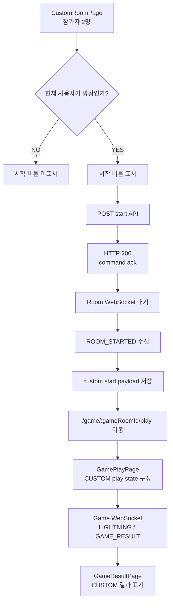
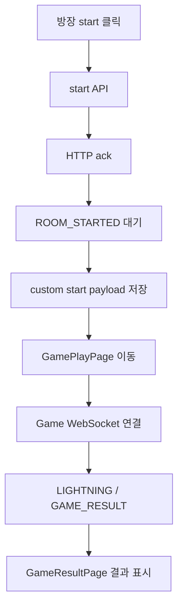

# Issue 138. Custom Game 시작 및 GamePlay 프론트 연결

## Feature Description

사용자 지정 방에서 방장이 게임 시작을 누르면, 방장과 참가자가 같은 custom game room과 scenario로 GamePlay 화면에 진입할 수 있게 구현한다.

이번 이슈는 issue-134, issue-136에서 만든 사용자 지정 공개 대기실/초대 참가/Room WebSocket 다음 단계다. 백엔드는 issue-130에서 `POST /api/v1/custom-games/rooms/{roomId}/start`와 `ROOM_STARTED` 계약을 확정했고, issue-132에서 `CUSTOM` 결과는 랭크/LP에는 반영하지 않고 전적에는 남기도록 구현했다. 이번 이슈는 이 백엔드 계약을 프론트에 연결한다.

중요한 정책은 다음과 같다.

- HTTP start 응답은 command ack다.
- 실제 GamePlay 이동 기준은 Room WebSocket `ROOM_STARTED` event다.
- `ROOM_STARTED` payload의 `gameRoomId`, `startAt`, `scenario`, `webSocketUrl`을 저장하고 GamePlayPage가 이를 source of truth로 사용한다.
- Custom Game 진행은 기존 Game WebSocket `/ws/game/{gameRoomId}`와 LIGHTNING 흐름을 재사용한다.
- Custom Game 결과는 기존 `GAME_RESULT` event로 확정한다.
- Custom Game 결과 화면은 `GameResultPage`를 사용하되, 랭크/LP 변화 UI는 표시하지 않는다.



이번 이슈에 포함되는 범위:

- Custom Room start API 프론트 service 연결.
- `ROOM_STARTED` type, payload validation, storage 구현.
- CustomRoomPage 방장 전용 start 버튼과 start 상태 UI 구현.
- `ROOM_STARTED` 수신 시 GamePlay route 이동 구현.
- GamePlayPage가 `gameMode=CUSTOM` start payload로 play state를 구성하도록 구현.
- Custom Game 결과 payload에서 `gameMode=CUSTOM`을 허용하도록 타입/validator 정리.
- GameResultPage가 Custom Game 결과를 표시하되 랭크/LP 변화 UI를 숨기도록 구현.
- Locale, Test, 문서 정합성 반영.

후속 이슈로 미루는 범위:

- Custom Room 재사용/다시 방으로 돌아가기 UX.
- Custom Game 다시하기.
- 친구 목록 기반 초대.
- Custom Game 전용 통계/랭킹.
- 전적 화면에서 custom/match badge 표시.
- 새 외부 패키지 추가.

## Backend Contract

이번 이슈는 기존 backend issue-130, issue-132 계약을 프론트에 연결한다. 백엔드 API, WebSocket payload, 정산 정책은 새로 바꾸지 않는다.

### Custom Game Start API

```http
POST /api/v1/custom-games/rooms/{roomId}/start
Authorization: Bearer {accessToken}
```

Request body는 없다. 인증 사용자 식별은 기존 access token 정책을 따른다.

Response:

```ts
interface CustomGameStartResponse {
  roomId: number
  gameRoomId: number
  gameMode: 'CUSTOM'
  serverTime: number
  startAt: number
  webSocketUrl: string
  scenario: GameStartScenario
}
```

프론트 사용 기준:

- CustomRoomPage의 방장 start 버튼에서 호출한다.
- HTTP 200만으로 route 이동하지 않는다.
- HTTP 응답은 command 처리 결과이며, 화면 전환 source of truth는 `ROOM_STARTED`다.
- start 실패 시 현재 방 화면에 backend error message를 표시한다.

### ROOM_STARTED Event

```ts
type CustomRoomWebSocketServerMessage =
  | { type: 'ROOM_UPDATED'; payload: CustomRoomResponse }
  | { type: 'ROOM_CLOSED'; payload: CustomRoomResponse }
  | { type: 'ROOM_STARTED'; payload: CustomGameStartResponse }
  | { type: 'ERROR'; payload: { code: string; reason: string } }
```

프론트 사용 기준:

- Room WebSocket은 `/custom-games/rooms/:roomId` 페이지에서만 연결한다.
- `ROOM_STARTED` 수신 시 payload를 custom game start storage에 저장한다.
- 저장 성공 후 `/game/:gameRoomId/play`로 이동한다.
- 방장과 참가자 모두 같은 event를 기준으로 이동하므로 startAt/scenario가 어긋나지 않는다.
- `ROOM_STARTED` 이후 Custom Room WebSocket은 더 이상 대기실 source of truth가 아니다.

### GamePlay Contract

Custom Game은 기존 Game WebSocket을 재사용한다.

```http
GET /ws/game/{gameRoomId}?token={accessToken}
```

프론트 사용 기준:

- GamePlayPage는 custom start payload의 `webSocketUrl`로 Game WebSocket에 연결한다.
- GamePlayPage는 `gameMode=CUSTOM`일 때도 기존 countdown, Three.js scene, HP HUD, LIGHTNING 입력을 재사용한다.
- 상대 lightning 표시를 위해 custom start storage에는 현재 사용자와 상대 사용자 id를 함께 저장한다.
- `GAME_RESULT.gameMode=CUSTOM`을 정상 payload로 허용한다.

### Result Contract

Custom Game 결과는 기존 Game WebSocket `GAME_RESULT`로 확정된다.

```json
{
  "type": "GAME_RESULT",
  "payload": {
    "gameRoomId": 100,
    "gameMode": "CUSTOM",
    "result": "PLAYER1_WIN",
    "winnerUserId": 1,
    "reason": "LIGHTNING_KILL",
    "practiceResult": null,
    "finishedAt": 1710000000000,
    "actions": []
  }
}
```

프론트 사용 기준:

- `GAME_RESULT`는 custom 최종 결과 source of truth다.
- 결과 payload는 sessionStorage에 저장한다.
- Custom Game은 `GameResultPage`로 이동한다.
- Summary API는 Custom Game 전적 저장 상태를 기존 `PENDING/DONE`으로 조회한다.
- `CUSTOM` 결과 화면에서는 rank/LP 변화 UI를 숨긴다.
- `MATCH` 결과 화면의 기존 rank/LP UI는 유지한다.
- `PRACTICE` 결과는 기존처럼 GamePlayPage 내부 오버레이를 유지한다.

## Scope Boundary

이번 이슈에 포함:

- `docs/last-구현.md` 4-10의 결과 화면 정책을 GameResultPage 사용 방향으로 수정.
- `startCustomRoom(roomId, signal?)` service 추가.
- `CustomGameStartResponse` type 추가.
- `CustomRoomWebSocketServerMessage`에 `ROOM_STARTED` type 추가.
- custom game start payload storage 추가.
- CustomRoomPage에서 현재 사용자 profile을 조회해 방장 여부를 판단.
- 방장에게만 start 버튼 표시.
- 참가자 2명, room status `WAITING`, socket 상태를 고려해 start 버튼 활성/비활성 처리.
- start API loading/error 상태 구현.
- `ROOM_STARTED` 수신 시 custom start payload 저장과 GamePlay route 이동 구현.
- GamePlayPage에서 custom start payload를 읽어 `CUSTOM` play state 구성.
- `GameMode` type과 `gameResultPayload` validator에 `CUSTOM` 추가.
- GameResultPage에서 custom 결과 처리 및 rank/LP 변화 UI 숨김.
- Locale 구현.
- Test 구현.
- issue-138 PR 섹션 보강.

이번 이슈에서 제외:

- 백엔드 start/result 계약 변경.
- Custom Room 재사용.
- Custom Game 다시하기.
- Custom Game 전용 결과 route 추가.
- 친구 목록 기반 초대.
- 전적 목록 custom badge 표시.
- 새 외부 패키지 추가.

## Tasks

### 1. Frontend Custom Game Contract 정리

- [x] backend issue-130 start API / `ROOM_STARTED` 계약을 재확인한다.
- [x] backend issue-132 `GAME_RESULT.gameMode=CUSTOM` / 전적 저장 / rank 제외 계약을 재확인한다.
- [x] HTTP start 응답은 command ack이고 route 이동 기준이 아님을 문서화한다.
- [x] `ROOM_STARTED`가 GamePlay 진입 source of truth임을 문서화한다.
- [x] Custom 결과는 GameResultPage를 사용하고 rank/LP 변화 UI를 숨긴다고 문서화한다.

### 2. Custom Game Start Service / Type 구현

- [x] `CustomGameStartResponse` type을 추가한다.
- [x] `CustomRoomWebSocketServerMessage`에 `ROOM_STARTED` union을 추가한다.
- [x] `startCustomRoom(roomId, signal?)` service를 추가한다.
- [x] start service가 `POST /api/v1/custom-games/rooms/{roomId}/start`를 호출하도록 구현한다.
- [x] roomId를 `encodeURIComponent`로 처리한다.

### 3. Custom Game Start Payload Storage 구현

- [x] custom start payload 전용 sessionStorage key를 추가한다.
- [x] `ROOM_STARTED` payload validator를 구현한다.
- [x] `gameMode`가 `CUSTOM`인지 검증한다.
- [x] `gameRoomId`, `serverTime`, `startAt`, `webSocketUrl`, `scenario`를 검증한다.
- [x] 현재 사용자 id와 상대 사용자 id를 저장 payload에 포함한다.
- [x] 저장 payload에 `receivedAt`을 포함한다.
- [x] invalid payload는 저장하지 않고 error 상태로 처리한다.

### 4. CustomRoomPage Start UI 구현

- [x] CustomRoomPage에서 `getMyProfile()`로 현재 사용자 id를 조회한다.
- [x] `ownerUserId === profile.userId`일 때만 start 버튼을 표시한다.
- [x] 참가자 2명 미만이면 start 버튼을 비활성화한다.
- [x] room socket이 open 상태가 아니면 start 버튼을 비활성화한다.
- [x] start API 호출 중 버튼을 비활성화한다.
- [x] start 실패 시 backend error message를 표시한다.
- [x] HTTP start 성공 후에는 `ROOM_STARTED` 대기 상태를 표시하되 route 이동하지 않는다.

### 5. ROOM_STARTED Handoff 구현

- [x] CustomRoomPage에서 `ROOM_STARTED`를 처리한다.
- [x] `ROOM_STARTED` payload를 custom start storage에 저장한다.
- [x] 저장 성공 시 `league-of-star.currentCustomRoomId`를 제거한다.
- [x] Room WebSocket을 정상 종료 처리한다.
- [x] `/game/:gameRoomId/play`로 `router.replace` 이동한다.
- [x] route 이동 실패 시 error 상태를 표시한다.

### 6. GamePlayPage CUSTOM 연결

- [x] GamePlayPage에서 custom start payload를 읽는다.
- [x] `MATCH`, `PRACTICE`, `CUSTOM` 순서로 play state를 구성하되 route gameRoomId와 payload gameRoomId를 검증한다.
- [x] `CUSTOM` play state는 custom payload의 `scenario`, `startAt`, `webSocketUrl`을 사용한다.
- [x] 기존 countdown, Three.js scene, HP HUD, LIGHTNING 입력을 재사용한다.
- [x] 상대 lightning 판별은 custom payload의 `opponentUserId`를 사용한다.
- [x] custom payload가 없거나 invalid면 payload missing 상태로 둔다.

### 7. Custom Result 연결

- [x] `GameMode` type에 `CUSTOM`을 추가한다.
- [x] `gameResultPayload` validator가 `CUSTOM`을 허용하게 한다.
- [x] GamePlayPage에서 `GAME_RESULT.gameMode=CUSTOM` 수신 시 result payload를 저장한다.
- [x] Custom Game 결과는 GameResultPage로 이동한다.
- [x] GameResultPage가 Custom Game Summary API `PENDING/DONE` 흐름을 처리한다.
- [x] Custom Game일 때 rank/LP 변화 UI를 숨긴다.
- [x] Match 결과 화면의 기존 rank/LP UI는 유지한다.
- [x] Practice 결과 오버레이 흐름은 유지한다.

### 8. UI / Locale 구현

- [x] start 버튼 문구를 추가한다.
- [x] 참가자 부족 문구를 추가한다.
- [x] start 요청 중 문구를 추가한다.
- [x] `ROOM_STARTED` 대기 문구를 추가한다.
- [x] start 실패 문구를 추가한다.
- [x] Custom 결과에서 rank 변화 없음 정책을 설명하는 문구를 추가한다.
- [x] 한/영 locale 모두 정리한다.

### 9. Test 구현

- [x] customRoomService start path 테스트를 추가한다.
- [x] customRoomWebSocket `ROOM_STARTED` parse 테스트를 추가한다.
- [x] custom start payload storage 저장/읽기/invalid 테스트를 추가한다.
- [x] CustomRoomPage 방장 start 버튼 표시/비표시 테스트를 추가한다.
- [x] 참가자 1명일 때 start 비활성화 테스트를 추가한다.
- [x] start HTTP 성공 후 route 이동하지 않는 테스트를 추가한다.
- [x] `ROOM_STARTED` 수신 후 payload 저장과 GamePlay 이동 테스트를 추가한다.
- [x] GamePlayPage custom payload play state 테스트를 추가한다.
- [x] `GAME_RESULT.gameMode=CUSTOM` 저장/이동 테스트를 추가한다.
- [x] GameResultPage custom 결과에서 rank/LP UI 숨김 테스트를 추가한다.

### 10. 문서 정합성 구현

- [x] `docs/last-구현.md` 4-10의 결과 화면 정책을 GameResultPage 방향으로 수정한다.
- [x] `docs/last-구현.md` 4-10 세부 체크박스를 완료 처리한다.
- [x] `docs/last-구현.md` 하단 Section 4-10 체크를 완료 처리한다.
- [x] issue-130/132 backend 계약과 issue-138 frontend 문서가 일치하는지 확인한다.
- [x] issue-136 후속 범위가 issue-138에서 해소되는지 확인한다.
- [x] issue-138 Tasks 완료 상태를 반영한다.
- [x] issue-138 PR 섹션을 설계 중심으로 보강한다.

### 11. 검증

- [x] `npm run test -- customRoomService customRoomWebSocket`을 통과시킨다.
- [x] `npm run test -- CustomRoomPage`를 통과시킨다.
- [x] `npm run test -- GamePlayPage`를 통과시킨다.
- [x] `npm run test -- GameResultPage`를 통과시킨다.
- [x] `npm run test -- CustomRoom`을 통과시킨다.
- [x] `npm run format`을 통과시킨다.
- [x] `npm run lint`를 통과시킨다.
- [x] `npm run typecheck`를 통과시킨다.
- [x] `npm run test`를 통과시킨다.
- [x] `npm run build`를 통과시킨다.
- [x] desktop `1440x900` UI overflow는 Playwright 미설치로 screenshot 검증 대신 DOM/test/build 검증으로 대체한다.
- [x] mobile `390x844` UI overflow는 Playwright 미설치로 screenshot 검증 대신 DOM/test/build 검증으로 대체한다.

## Implementation Policy

- HTTP start 응답은 command ack로만 처리한다.
- GamePlay route 이동은 `ROOM_STARTED` WebSocket event 기준으로만 처리한다.
- Room WebSocket은 `/custom-games/rooms/:roomId` 페이지에서만 연결한다.
- `ROOM_STARTED` 이후 Custom Room WebSocket은 대기실 동기화 책임을 끝낸다.
- Custom GamePlay는 기존 Game WebSocket `/ws/game/{gameRoomId}`를 재사용한다.
- Custom Game은 기존 LIGHTNING, HP, countdown, Three.js scene을 재사용한다.
- Custom Game 결과 source of truth는 Game WebSocket `GAME_RESULT`다.
- Custom Game 결과는 GameResultPage를 사용한다.
- Custom Game은 전적에 남지만 rank/LP 변화 UI를 표시하지 않는다.
- Match 결과 route/Summary API 흐름은 깨지지 않아야 한다.
- Practice 결과 오버레이 흐름은 유지한다.
- 새 패키지를 추가하지 않는다.

## Acceptance Criteria

- 방장에게만 start 버튼이 보인다.
- 참가자 2명일 때만 start를 시도할 수 있다.
- start HTTP 성공만으로 route 이동하지 않는다.
- `ROOM_STARTED` 수신 시 방장과 참가자가 같은 `gameRoomId`, `scenario`, `startAt`으로 GamePlayPage에 진입한다.
- Custom GamePlay에서 countdown, HP HUD, LIGHTNING 입력이 동작한다.
- `GAME_RESULT.gameMode=CUSTOM` payload가 invalid 처리되지 않는다.
- Custom Game 결과는 GameResultPage에 표시된다.
- Custom Game 결과 화면에서 rank/LP 변화 UI는 표시되지 않는다.
- Match 결과와 Practice 결과 기존 흐름이 깨지지 않는다.
- frontend 테스트, lint, typecheck, build가 통과한다.

## PR Message

## PR 작성 방법

## 📌 Summary

사용자 지정 방에서 방장이 게임을 시작하면 방장과 참가자가 같은 Custom GamePlay 화면으로 이동할 수 있게 구현함.

이번 PR은 “사용자 지정 방 대기실”과 “실제 게임 플레이”를 연결하는 단계다. HTTP start 응답은 요청이 접수되었다는 의미로만 쓰고, 실제 화면 전환은 Room WebSocket `ROOM_STARTED`를 기준으로 처리한다. 이렇게 해야 방장과 참가자가 같은 `gameRoomId`, `scenario`, `startAt`을 받고 동시에 같은 게임에 들어갈 수 있음.



핵심 정책:

- HTTP start 응답은 route 이동 기준이 아님.
- `ROOM_STARTED`가 Custom GamePlay 진입 source of truth임.
- Custom Game은 기존 Game WebSocket과 LIGHTNING 흐름을 재사용함.
- Custom Game 결과는 GameResultPage에서 보여주되 rank/LP 변화 UI는 숨김.

백엔드와의 구현 계약:

- `POST /api/v1/custom-games/rooms/{roomId}/start`는 방장만 호출할 수 있음.
- 참가자 2명인 `WAITING` room만 start 가능함.
- start 성공 시 backend가 Room WebSocket으로 `ROOM_STARTED`를 broadcast함.
- `ROOM_STARTED` payload에는 `gameRoomId`, `gameMode=CUSTOM`, `serverTime`, `startAt`, `webSocketUrl`, `scenario`가 포함됨.
- 실제 플레이는 `/ws/game/{gameRoomId}` Game WebSocket으로 진행됨.
- Custom Game 결과는 기존 `GAME_RESULT`에 `gameMode=CUSTOM`으로 내려옴.
- Custom Game은 전적에는 남고 rank/LP에는 반영되지 않음.

## 📚 Changes

- start API와 화면 전환 책임을 분리함.
  start HTTP 200은 “방장이 시작 요청을 보냈고 서버가 처리했다”는 ack다. 이 응답만 보고 이동하면 참가자 화면과 방장 화면이 어긋날 수 있으므로, 두 사용자 모두 `ROOM_STARTED` event를 받은 뒤 이동하도록 설계함.

- Custom start payload를 별도 storage로 분리함.
  ranked match의 waiting payload나 practice payload와 섞으면 어떤 모드의 게임인지 판단이 흐려진다. 그래서 custom 전용 payload를 저장하고 GamePlayPage가 `mode=CUSTOM`으로 play state를 구성하게 함.

- GamePlay 엔진은 새로 만들지 않고 기존 흐름을 재사용함.
  Custom Game도 별을 공격하고 LIGHTNING으로 결과를 만드는 게임이므로 countdown, HP HUD, Three.js scene, Game WebSocket, LIGHTNING 입력을 그대로 사용한다. 차이는 시작 source가 `ROOM_STARTED`라는 점과 결과 정산 정책이 rank 제외라는 점임.

- Custom 결과는 GameResultPage로 연결함.
  Custom Game은 전적에 저장되므로 Summary API로 저장 완료 상태를 확인할 수 있다. GameResultPage를 재사용하면 사용자는 같은 결과 흐름을 보면서도 custom에서는 rank/LP 변화가 없다는 점만 명확히 볼 수 있음.

- Match와 Practice 결과 정책을 그대로 유지함.
  Match는 기존처럼 Summary API와 rank/LP 변화 UI를 사용한다. Practice는 전적을 저장하지 않으므로 기존 GamePlayPage 내부 결과 오버레이를 유지한다. Custom만 “전적 저장은 하되 rank/LP 변화는 숨기는” 중간 정책으로 처리함.

## 📝 Note

- 이번 PR에서 백엔드 start/result 계약은 변경하지 않음.
- Custom Room 재사용, Custom Game 다시하기, 친구 목록 기반 초대는 제외함.
- 전적 목록에서 custom/match badge 표시는 후속 이슈로 남김.
- 새 패키지 추가 없음.
- 검증 결과:
  - `npm run format` 통과함.
  - `npm run lint` 통과함.
  - `npm run typecheck` 통과함.
  - `npm run test` 통과함. 35 files / 323 tests passed 확인함.
  - `npm run build` 통과함.
  - CustomRoomPage, GamePlayPage, GameResultPage 관련 targeted test 통과함.
  - Playwright가 설치되어 있지 않아 desktop/mobile screenshot overflow 검증은 수행하지 못함. 새 패키지를 추가하지 않는 정책 때문에 DOM/test/build 검증으로 대체함.

## 📌 Related Issue

- Closes #138
