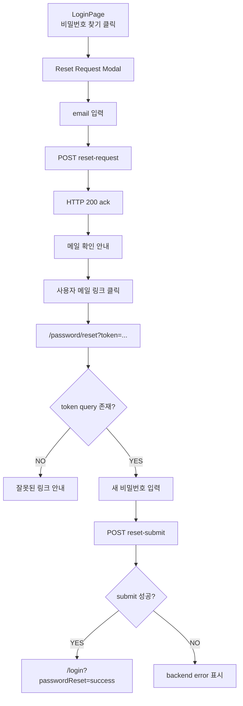
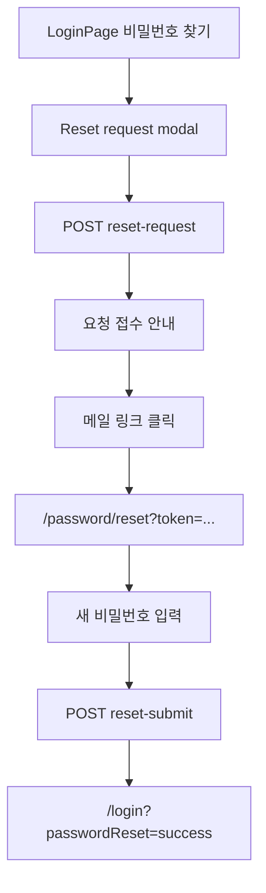

# Issue 142. 비밀번호 찾기 프론트 구현

## Feature Description

로그인 화면에서 비밀번호 찾기 이메일 요청을 보내고, 메일 링크로 진입한 사용자가 새 비밀번호를 설정할 수 있는 프론트 account recovery 흐름을 구현한다.

이번 이슈는 backend issue-140에서 확정한 비밀번호 재설정 API / 메일 정책을 프론트에 연결하는 작업이다. 백엔드는 reset link를 프론트 `/password/reset?token=...` 화면으로 보내도록 확정했고, 프론트는 이 token을 URL query에서 읽어 `reset-submit` API를 호출한다.

중요한 정책은 다음과 같다.

- LoginPage의 `비밀번호 찾기`는 모달로 처리한다.
- 메일 링크로 진입하는 새 비밀번호 설정은 별도 route `/password/reset?token=...`에서 처리한다.
- `reset-request` HTTP 200은 비밀번호 변경 완료가 아니라 요청 접수 ack다.
- 프론트는 이메일 존재 여부를 구분하거나 추측할 수 있는 메시지를 표시하지 않는다.
- 실제 비밀번호 변경 source of truth는 `reset-submit` API 성공이다.
- reset token은 URL query에서만 읽고 localStorage/sessionStorage에 저장하지 않는다.
- 새 패키지를 추가하지 않는다.



이번 이슈에 포함되는 범위:

- LoginPage 비밀번호 찾기 모달 구현.
- `reset-request`, `reset-submit` auth service/type 구현.
- `/password/reset?token=...` route/page 구현.
- 새 비밀번호 입력/확인 UI 구현.
- backend issue-140 ErrorResponse를 사용자 메시지로 표시.
- Locale, Test, 문서 정합성 반영.

후속 이슈로 미루는 범위:

- 백엔드 password reset 계약 변경.
- 메일 템플릿 HTML 디자인 변경.
- rate limit, captcha, abuse 방지 UI.
- OAuth-only 계정 별도 안내.
- 사용자 세션 강제 로그아웃.
- reset token 재발급 UX 고도화.
- 새 외부 패키지 추가.

## Backend Contract

이번 이슈는 backend issue-140 계약을 그대로 사용한다. 백엔드 API, payload, ErrorResponse 정책은 새로 바꾸지 않는다.

### Password Reset Request API

```http
POST /api/v1/auth/password/reset-request
Content-Type: application/json
```

Request:

```ts
interface PasswordResetRequest {
  email: string
}
```

Response:

```text
재설정 링크가 이메일로 발송되었습니다.
```

프론트 사용 기준:

- LoginPage 비밀번호 찾기 모달에서 호출한다.
- public endpoint이므로 `auth: false`로 호출한다.
- HTTP 200은 command ack다.
- 이메일 존재 여부를 사용자에게 구분해서 보여주지 않는다.
- 성공 시 “가입 여부와 관계없이 메일함을 확인해 주세요” 계열의 일반 메시지를 표시한다.
- 실패 시 네트워크/서버 오류로 보고 일반 실패 메시지 또는 `ApiClientError.message`를 표시한다.

### Password Reset Submit API

```http
POST /api/v1/auth/password/reset-submit
Content-Type: application/json
```

Request:

```ts
interface PasswordResetSubmitRequest {
  token: string
  newPassword: string
}
```

Response:

```text
비밀번호가 성공적으로 변경되었습니다.
```

프론트 사용 기준:

- `/password/reset?token=...` page에서 호출한다.
- public endpoint이므로 `auth: false`로 호출한다.
- token은 URL query에서만 읽는다.
- token이 없으면 API를 호출하지 않고 잘못된 링크 안내를 표시한다.
- 새 비밀번호는 영문+숫자 포함 8자 이상으로 선검증한다.
- 확인 비밀번호가 다르면 API를 호출하지 않는다.
- 성공 시 `/login?passwordReset=success`로 이동한다.
- invalid/expired token은 backend `ApiClientError.message`를 표시한다.

### Route Policy

`/password/reset` route는 `requiresAuth`도 `guestOnly`도 붙이지 않는다.

이 정책을 사용하는 이유:

- 메일 링크는 로그인 여부와 무관하게 열려야 한다.
- `guestOnly`를 붙이면 이미 로그인된 브라우저에서 reset link를 열 때 `/match`로 튕길 수 있다.
- `requiresAuth`를 붙이면 비밀번호를 잊은 사용자가 reset page에 접근할 수 없다.

### Source Of Truth Policy

- reset 요청 접수 source of truth는 `reset-request` HTTP 200 ack다.
- 비밀번호 변경 source of truth는 `reset-submit` HTTP 200이다.
- token 유효성 source of truth는 backend Redis reset token이다.
- 프론트는 token을 저장하지 않고 URL query에서만 사용한다.
- 프론트는 이메일 존재 여부를 판단하거나 표시하지 않는다.

## Scope Boundary

이번 이슈에 포함:

- `PasswordResetRequest`, `PasswordResetSubmitRequest` type 추가.
- `requestPasswordReset()`, `submitPasswordReset()` service 추가.
- LoginPage 비밀번호 찾기 버튼에 모달 연결.
- LoginPage 이메일 입력값을 모달 초기 이메일로 사용.
- reset-request loading/success/error 상태 구현.
- `/password/reset` route 추가.
- PasswordResetPage 구현.
- token query 누락 처리.
- 새 비밀번호/확인 비밀번호 validation 구현.
- reset-submit loading/success/error 상태 구현.
- 성공 시 `/login?passwordReset=success` 이동.
- LoginPage에서 `passwordReset=success` query 성공 메시지 표시.
- 한/영 locale 추가.
- Test 구현.
- `docs/last-구현.md` 5-2 정합성 갱신.
- issue-142 PR 섹션 보강.

이번 이슈에서 제외:

- backend issue-140 계약 변경.
- 백엔드 메일 발송 정책 변경.
- 메일 HTML 템플릿 변경.
- OAuth 계정 별도 정책.
- rate limit/captcha UI.
- reset 완료 후 전체 세션 강제 만료.
- 비밀번호 보기/숨기기 토글.
- 새 외부 패키지 추가.

## Tasks

### 1. Frontend Password Reset Contract 정리

- [ ] backend issue-140 `reset-request` / `reset-submit` 계약을 재확인한다.
- [ ] `reset-request` HTTP 200은 요청 접수 ack임을 문서화한다.
- [ ] 이메일 존재 여부를 프론트에서 구분하지 않는 정책을 문서화한다.
- [ ] `reset-submit` 성공이 실제 비밀번호 변경 기준임을 문서화한다.
- [ ] `/password/reset` route가 auth guard 대상이 아닌 이유를 문서화한다.
- [ ] token은 URL query에서만 읽고 저장하지 않는 정책을 문서화한다.

### 2. Auth Service / Type 구현

- [ ] `PasswordResetRequest` type을 추가한다.
- [ ] `PasswordResetSubmitRequest` type을 추가한다.
- [ ] `requestPasswordReset(request, signal?)` service를 추가한다.
- [ ] `requestPasswordReset`이 `POST /api/v1/auth/password/reset-request`를 호출하게 한다.
- [ ] `submitPasswordReset(request, signal?)` service를 추가한다.
- [ ] `submitPasswordReset`이 `POST /api/v1/auth/password/reset-submit`을 호출하게 한다.
- [ ] 두 API 모두 `auth: false`로 호출한다.

### 3. LoginPage Reset Request Modal 구현

- [ ] LoginPage 비밀번호 찾기 버튼에 click handler를 연결한다.
- [ ] 비밀번호 찾기 모달 open/close 상태를 추가한다.
- [ ] LoginPage email 입력값을 모달 email 초기값으로 사용한다.
- [ ] 모달 email required validation을 구현한다.
- [ ] reset-request loading 상태를 구현한다.
- [ ] reset-request 성공 시 일반 성공 메시지를 표시한다.
- [ ] reset-request 실패 시 `ApiClientError.message` 또는 fallback 메시지를 표시한다.
- [ ] 모달 닫기/취소 동작을 구현한다.
- [ ] 로그인 submit 상태와 reset-request submit 상태가 서로 섞이지 않게 한다.

### 4. PasswordReset Route / Page 구현

- [ ] `ROUTE_PATHS.passwordReset = '/password/reset'`를 추가한다.
- [ ] `ROUTE_NAMES.passwordReset = 'password-reset'`를 추가한다.
- [ ] router에 PasswordResetPage route를 추가한다.
- [ ] PasswordResetPage는 `requiresAuth`, `guestOnly` meta를 사용하지 않는다.
- [ ] PasswordResetPage에서 token query를 읽는다.
- [ ] token이 없으면 API 호출 없이 잘못된 링크 메시지를 표시한다.
- [ ] 새 비밀번호 입력 UI를 구현한다.
- [ ] 새 비밀번호 확인 입력 UI를 구현한다.
- [ ] 로그인 화면과 같은 배경/카드 계열 디자인을 사용한다.

### 5. PasswordReset Submit 구현

- [ ] 새 비밀번호 required validation을 구현한다.
- [ ] 영문+숫자 포함 8자 이상 validation을 구현한다.
- [ ] 확인 비밀번호 일치 validation을 구현한다.
- [ ] validation 실패 시 API를 호출하지 않는다.
- [ ] submit loading 상태를 구현한다.
- [ ] submit 성공 시 `/login?passwordReset=success`로 이동한다.
- [ ] submit 실패 시 backend error message를 표시한다.
- [ ] invalid/expired token 메시지를 사용자에게 표시한다.

### 6. Locale / UI 구현

- [ ] LoginPage reset modal 한글 locale을 추가한다.
- [ ] LoginPage reset modal 영어 locale을 추가한다.
- [ ] PasswordResetPage 한글 locale을 추가한다.
- [ ] PasswordResetPage 영어 locale을 추가한다.
- [ ] LoginPage `passwordReset=success` 성공 메시지를 추가한다.
- [ ] 모달 버튼 hover/focus/disabled 상태를 구현한다.
- [ ] 모바일 viewport에서 모달/card overflow가 없게 스타일링한다.

### 7. Test 구현

- [ ] authService `requestPasswordReset` contract test를 추가한다.
- [ ] authService `submitPasswordReset` contract test를 추가한다.
- [ ] LoginPage 비밀번호 찾기 모달 open 테스트를 추가한다.
- [ ] LoginPage email prefill 테스트를 추가한다.
- [ ] reset-request required validation 테스트를 추가한다.
- [ ] reset-request 성공 메시지 테스트를 추가한다.
- [ ] reset-request 실패 메시지 테스트를 추가한다.
- [ ] LoginPage `passwordReset=success` 메시지 테스트를 추가한다.
- [ ] PasswordResetPage token 누락 테스트를 추가한다.
- [ ] PasswordResetPage password validation 테스트를 추가한다.
- [ ] PasswordResetPage confirm mismatch 테스트를 추가한다.
- [ ] PasswordResetPage submit 성공 route 이동 테스트를 추가한다.
- [ ] PasswordResetPage invalid token error 표시 테스트를 추가한다.
- [ ] router route 등록 테스트 필요 여부를 확인한다.

### 8. 문서 정합성 구현

- [ ] `docs/last-구현.md` 5-2 체크리스트를 구현 결과와 맞게 갱신한다.
- [ ] issue-142 Tasks 완료 상태를 반영한다.
- [ ] backend issue-140 계약과 issue-142 frontend 문서가 일치하는지 확인한다.
- [ ] issue-140 후속 범위가 issue-142에서 해소되는지 확인한다.
- [ ] PR Message 섹션을 설계 중심으로 보강한다.

### 9. 검증

- [ ] `npm run test -- authService LoginPage PasswordResetPage`
- [ ] `npm run format`
- [ ] `npm run lint`
- [ ] `npm run typecheck`
- [ ] `npm run test`
- [ ] `npm run build`
- [ ] desktop `1440x900`에서 LoginPage modal overflow 확인.
- [ ] mobile `390x844`에서 LoginPage modal / PasswordResetPage overflow 확인.

## Implementation Policy

- `reset-request` HTTP 200은 요청 접수 ack로만 처리한다.
- 이메일 존재 여부는 사용자에게 노출하지 않는다.
- reset-request 성공 메시지는 가입 여부와 무관한 일반 문구로 표시한다.
- 실제 비밀번호 변경 기준은 `reset-submit` 성공이다.
- `/password/reset` route는 인증 요구도 guest-only도 아니다.
- token은 URL query에서만 읽고 저장하지 않는다.
- token이 없으면 API를 호출하지 않는다.
- reset-submit 실패 시 backend ErrorResponse message를 우선 표시한다.
- LoginPage 로그인 submit 상태와 password reset submit 상태를 분리한다.
- 새 패키지를 추가하지 않는다.

## Acceptance Criteria

- LoginPage에서 비밀번호 찾기 버튼을 누르면 reset request 모달이 열린다.
- LoginPage 이메일 입력값이 모달 email 입력값으로 prefill된다.
- reset-request 성공 시 이메일 존재 여부를 노출하지 않는 성공 안내가 표시된다.
- `/password/reset?token=...`로 직접 진입할 수 있다.
- `/password/reset`에 token이 없으면 API 호출 없이 잘못된 링크 안내가 표시된다.
- 새 비밀번호가 영문+숫자 포함 8자 이상이 아니면 API를 호출하지 않는다.
- 확인 비밀번호가 다르면 API를 호출하지 않는다.
- reset-submit 성공 시 `/login?passwordReset=success`로 이동한다.
- LoginPage가 `passwordReset=success` query를 성공 메시지로 표시한다.
- invalid/expired token이면 backend error message가 표시된다.
- frontend 테스트, lint, typecheck, build가 통과한다.
- desktop/mobile에서 모달과 reset page에 horizontal overflow가 없다.

## PR Message

## PR 작성 방법

## 📌 Summary

비밀번호 찾기 프론트 흐름을 LoginPage 모달과 `/password/reset` 페이지로 나누어 구현함.

사용자가 로그인 화면에서 이메일을 입력하는 단계는 현재 로그인 맥락을 유지하는 모달로 처리한다. 반면 메일 링크로 들어오는 새 비밀번호 설정은 브라우저가 직접 열 수 있는 route가 필요하므로 별도 페이지로 처리한다. 이 구조는 backend issue-140에서 확정한 `/password/reset?token=...` 메일 링크 정책과 맞다.



핵심 정책:

- `reset-request`는 비밀번호 변경 완료가 아니라 요청 접수 ack임.
- 프론트는 이메일 존재 여부를 구분하지 않음.
- 메일 링크 진입은 `/password/reset` route가 담당함.
- reset token은 URL query에서만 읽고 저장하지 않음.
- 실제 비밀번호 변경 기준은 `reset-submit` 성공임.

백엔드와의 구현 계약:

- `POST /api/v1/auth/password/reset-request`
  - request: `{ email }`
  - HTTP 200은 요청 접수 ack
  - public endpoint이므로 `auth: false`
- `POST /api/v1/auth/password/reset-submit`
  - request: `{ token, newPassword }`
  - 성공 시 비밀번호 변경 완료
  - invalid/expired token은 backend ErrorResponse message 표시
  - public endpoint이므로 `auth: false`

## 📚 Changes

- 이메일 요청은 모달로 처리함.
  별도 페이지로 빼면 로그인 화면에서 단순히 이메일만 입력하는 작업치고 이동이 커진다. 모달은 현재 로그인 맥락을 유지하면서 recovery 요청만 처리하기에 적합하다.

- 새 비밀번호 설정은 별도 route로 처리함.
  메일 링크는 사용자가 브라우저에서 직접 여는 URL이다. 따라서 모달만으로 처리하면 새로고침/직접 진입/공유 URL 흐름이 약해진다. `/password/reset?token=...` 페이지를 두어 백엔드 메일 링크 계약과 정확히 맞춘다.

- 이메일 존재 여부를 숨기는 백엔드 정책을 프론트에서도 유지함.
  reset-request 성공 메시지는 가입 여부를 암시하지 않는 일반 안내로 표시한다. 이렇게 해야 이메일 열거 공격 방지 정책이 화면에서도 깨지지 않는다.

- token 저장을 하지 않음.
  reset token은 비밀번호 변경 권한을 가진 민감 값이다. localStorage/sessionStorage에 저장하지 않고 URL query에서 읽어 submit에만 사용한다.

## 📝 Note

- 이번 PR에서 backend API 계약은 변경하지 않음.
- 메일 HTML 템플릿, rate limit, captcha, OAuth 계정 별도 정책은 후속 이슈로 둠.
- 새 패키지는 추가하지 않음.
- 검증 결과를 여기에 기재함.

## 📌 Related Issue

- Closes #142
