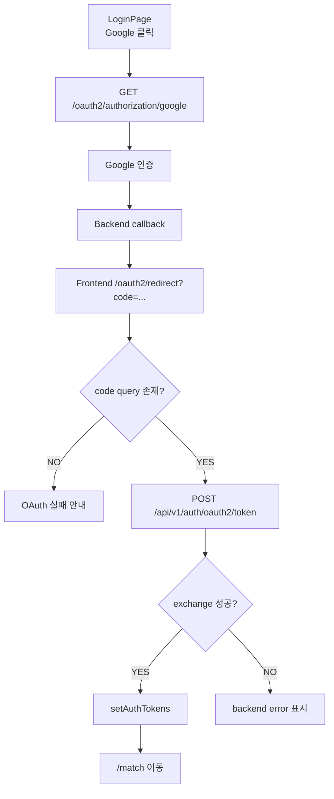
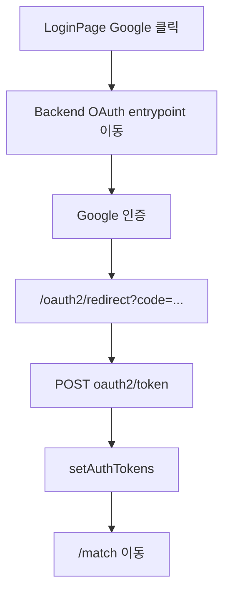

# Issue 146. OAuth 로그인 프론트 구현

## Feature Description

LoginPage의 Google 로그인 버튼을 백엔드 OAuth redirect 흐름에 연결하고, OAuth 성공 후 프론트가 받은 one-time code를 access/refresh token으로 교환해 기존 로그인과 같은 세션 저장 흐름으로 처리한다.

이번 이슈는 backend issue-144에서 확정한 OAuth 로그인 백엔드 계약을 프론트에 연결하는 작업이다. 백엔드는 OAuth 성공 redirect에 access/refresh token을 직접 싣지 않고 `/oauth2/redirect?code=...`로 one-time code만 전달한다. 프론트는 이 code를 `POST /api/v1/auth/oauth2/token`으로 교환하고 기존 `setAuthTokens()` 흐름을 재사용한다.

추가로 LoginPage의 OAuth 주변 UX를 정리한다.

- Google 로그인 버튼은 백엔드 OAuth entrypoint로 브라우저 이동한다.
- `/oauth2/redirect` route는 auth guard 대상이 아니다.
- OAuth 성공 redirect의 `code`는 URL query에서만 읽고 저장하지 않는다.
- OAuth token exchange 성공이 프론트 로그인 완료 기준이다.
- `Or bridge with` 문구는 `Or continue with`로 바꾼다.
- `게임 소개` 버튼은 LoginPage 내부 모달로 처리한다.
- 게임 소개 모달에는 기존 별 캐릭터 이미지를 보여주고, League of Legends Smite 싸움 오마주 콘셉트를 간단히 설명한다.
- 새 패키지를 추가하지 않는다.



이번 이슈에 포함되는 범위:

- LoginPage Google 버튼 OAuth redirect 연결.
- OAuth token exchange service/type 구현.
- `/oauth2/redirect?code=...` route/page 구현.
- OAuth code 누락/만료/실패 처리.
- OAuth 성공 시 기존 token 저장/MatchPage 이동 흐름 연결.
- LoginPage OAuth 실패 query 메시지 처리.
- `Or continue with` 문구 변경.
- LoginPage 게임 소개 모달 구현.
- Locale, Test, 문서 정합성 반영.

후속 이슈로 미루는 범위:

- 백엔드 OAuth 계약 변경.
- Google 외 provider 추가.
- OAuth 계정 연결 해제.
- OAuth 자동 연결 정책 변경.
- cookie 기반 인증 전환.
- 게임 소개 전용 페이지.
- 게임 소개 영상/튜토리얼 고도화.
- 새 외부 패키지 추가.

## Backend Contract

이번 이슈는 backend issue-144 계약을 그대로 사용한다. 백엔드 API, redirect URL, payload shape는 새로 바꾸지 않는다.

### OAuth Login Entry

```http
GET /oauth2/authorization/google
```

프론트 사용 기준:

- LoginPage Google 버튼 클릭 시 브라우저 이동으로 호출한다.
- `fetch`나 `requestJson`으로 호출하지 않는다.
- URL은 기존 `API_BASE_URL`을 기준으로 만든다.
- 이 endpoint는 JSON API가 아니라 Spring Security OAuth2 redirect entrypoint다.
- access/refresh token을 직접 반환하지 않는다.

### OAuth Success Redirect

백엔드 성공 redirect 예시:

```text
http://localhost:5173/oauth2/redirect?code={oneTimeCode}
```

프론트 사용 기준:

- `/oauth2/redirect` route에서 `code` query를 읽는다.
- `code`가 없거나 blank면 token exchange API를 호출하지 않는다.
- `code`는 localStorage/sessionStorage에 저장하지 않는다.
- `code`는 token exchange 요청에만 사용한다.

### OAuth Token Exchange API

```http
POST /api/v1/auth/oauth2/token
Content-Type: application/json
```

Request:

```ts
interface OAuthTokenRequest {
  code: string
}
```

Response:

```ts
interface LoginResponse {
  accessToken: string
  refreshToken: string
  userId: number
  nickname: string
}
```

프론트 사용 기준:

- `/oauth2/redirect?code=...` page에서 호출한다.
- public endpoint이므로 `auth: false`로 호출한다.
- 성공 응답은 기존 email/password login과 같은 `LoginResponse` shape다.
- 성공 시 기존 `setAuthTokens(accessToken, refreshToken)`을 사용한다.
- 성공 후 `/match`로 이동한다.
- invalid/expired code는 backend `ApiClientError.message`를 표시한다.

### Route Policy

`/oauth2/redirect` route는 `requiresAuth`도 `guestOnly`도 붙이지 않는다.

이 정책을 사용하는 이유:

- OAuth 성공 직후에는 아직 프론트 token 저장이 끝나지 않았다.
- `requiresAuth`를 붙이면 exchange 전에 로그인 화면으로 튕길 수 있다.
- `guestOnly`를 붙이면 이미 토큰이 있는 브라우저에서 OAuth 재시도 시 `/match`로 먼저 튕겨 code 처리가 누락될 수 있다.
- OAuth redirect page 자체가 token exchange를 완료하고 이후 `/match` 이동을 책임진다.

### Source Of Truth Policy

- OAuth 로그인 시작 source of truth는 백엔드 `/oauth2/authorization/google` redirect entrypoint다.
- OAuth 성공 여부 source of truth는 `/oauth2/redirect`의 `code`와 token exchange API 결과다.
- OAuth token source of truth는 `POST /api/v1/auth/oauth2/token` 성공 응답이다.
- 프론트 로그인 완료 기준은 `setAuthTokens()` 완료 후 `/match` 이동이다.
- `code`는 저장하지 않고 URL query에서만 사용한다.

## Scope Boundary

이번 이슈에 포함:

- `OAuthTokenRequest` type 추가.
- `exchangeOAuthToken(request, signal?)` service 추가.
- `exchangeOAuthToken`이 `POST /api/v1/auth/oauth2/token`을 `auth:false`로 호출하게 한다.
- `ROUTE_PATHS.oauth2Redirect = '/oauth2/redirect'` 추가.
- `ROUTE_NAMES.oauth2Redirect = 'oauth2-redirect'` 추가.
- router에 OAuthRedirectPage route 추가.
- OAuthRedirectPage 구현.
- code query 누락 처리.
- OAuth token exchange loading/success/error 상태 구현.
- 성공 시 `setAuthTokens()` 호출.
- 성공 시 `/match` 이동.
- 실패 시 backend error message 표시.
- LoginPage Google 버튼을 OAuth entrypoint 이동으로 연결.
- LoginPage OAuth 실패 query 메시지 표시.
- `Or bridge with`를 `Or continue with`로 변경.
- LoginPage 게임 소개 모달 구현.
- 게임 소개 모달에 `character-cutout.png` 표시.
- 한/영 locale 추가.
- Test 구현.
- `docs/last-구현.md` 5-4 정합성 갱신.
- issue-146 PR 섹션 보강.

이번 이슈에서 제외:

- backend issue-144 계약 변경.
- Google Cloud Console 설정 변경.
- OAuth provider 추가.
- OAuth 계정 연결 해제.
- OAuth 자동 연결 정책 변경.
- token cookie 저장 방식 전환.
- 별도 게임 소개 페이지.
- 게임 튜토리얼 구현.
- 새 외부 패키지 추가.

## Tasks

### 1. Frontend OAuth Contract 정리

- [ ] backend issue-144 OAuth redirect/token exchange 계약을 재확인한다.
- [ ] Google 버튼은 backend OAuth entrypoint로 browser redirect한다고 문서화한다.
- [ ] `/oauth2/redirect`가 auth guard 대상이 아닌 이유를 문서화한다.
- [ ] token exchange API 성공이 OAuth 로그인 완료 기준임을 문서화한다.
- [ ] OAuth code는 URL query에서만 읽고 저장하지 않는 정책을 문서화한다.
- [ ] `Or continue with` 문구 변경과 게임 소개 모달 범위를 문서화한다.

### 2. Auth Service / Type 구현

- [ ] `OAuthTokenRequest` type을 추가한다.
- [ ] 기존 `LoginResponse` type을 OAuth token exchange 응답으로 재사용한다.
- [ ] `exchangeOAuthToken(request, signal?)` service를 추가한다.
- [ ] `exchangeOAuthToken`이 `POST /api/v1/auth/oauth2/token`을 호출하게 한다.
- [ ] `exchangeOAuthToken`을 `auth: false`로 호출한다.
- [ ] authService contract test를 추가한다.

### 3. OAuth Redirect Route / Page 구현

- [ ] `ROUTE_PATHS.oauth2Redirect = '/oauth2/redirect'`를 추가한다.
- [ ] `ROUTE_NAMES.oauth2Redirect = 'oauth2-redirect'`를 추가한다.
- [ ] router에 OAuthRedirectPage route를 추가한다.
- [ ] OAuthRedirectPage는 `requiresAuth`, `guestOnly` meta를 사용하지 않는다.
- [ ] OAuthRedirectPage에서 code query를 읽는다.
- [ ] code가 없으면 API 호출 없이 실패 상태를 표시한다.
- [ ] code가 있으면 token exchange API를 호출한다.
- [ ] 성공 시 `setAuthTokens()`를 호출한다.
- [ ] 성공 시 `/match`로 이동한다.
- [ ] 실패 시 backend error message 또는 fallback message를 표시한다.
- [ ] 같은 route instance에서 code query가 바뀌면 최신 code를 사용하게 한다.

### 4. LoginPage Google OAuth 연결

- [ ] Google 버튼 click handler를 추가한다.
- [ ] OAuth 시작 URL을 `${API_BASE_URL}/oauth2/authorization/google`로 구성한다.
- [ ] 버튼 클릭 시 `window.location.assign()`으로 브라우저 이동한다.
- [ ] OAuth 시작 중 버튼 disabled 상태를 구현한다.
- [ ] OAuth 시작 중 문구를 locale로 표시한다.
- [ ] `/login?oauth=failed` query 실패 메시지를 표시한다.
- [ ] 기존 email/password login submit 상태와 OAuth 시작 상태를 분리한다.

### 5. LoginPage Copy / About Modal 구현

- [ ] 영어 `login.bridgeWith`를 `Or continue with`로 변경한다.
- [ ] 한국어 `login.bridgeWith`는 기존 자연스러운 문구를 유지한다.
- [ ] `게임 소개` 버튼에 click handler를 연결한다.
- [ ] 게임 소개 모달 open/close 상태를 추가한다.
- [ ] 모달에 `character-cutout.png`를 표시한다.
- [ ] League of Legends Smite 싸움 오마주 문구를 표시한다.
- [ ] 움직이는 별을 LIGHTNING으로 잡는 게임임을 설명한다.
- [ ] 모달 닫기 버튼과 backdrop close를 구현한다.
- [ ] 모바일 viewport에서 모달 overflow가 없게 스타일링한다.

### 6. Locale / UI 구현

- [ ] OAuth redirect page 한글 locale을 추가한다.
- [ ] OAuth redirect page 영어 locale을 추가한다.
- [ ] LoginPage OAuth 시작/실패 한글 locale을 추가한다.
- [ ] LoginPage OAuth 시작/실패 영어 locale을 추가한다.
- [ ] 게임 소개 모달 한글 locale을 추가한다.
- [ ] 게임 소개 모달 영어 locale을 추가한다.
- [ ] Google 버튼 hover/focus/disabled 상태를 유지한다.
- [ ] OAuthRedirectPage를 LoginPage와 같은 배경/카드 계열 디자인으로 구현한다.

### 7. Test 구현

- [ ] authService `exchangeOAuthToken` contract test를 추가한다.
- [ ] LoginPage Google 버튼 redirect URL 테스트를 추가한다.
- [ ] LoginPage OAuth 실패 query 메시지 테스트를 추가한다.
- [ ] LoginPage 영어 locale `Or continue with` 테스트를 추가한다.
- [ ] LoginPage 게임 소개 모달 open 테스트를 추가한다.
- [ ] LoginPage 게임 소개 모달 이미지/문구 표시 테스트를 추가한다.
- [ ] LoginPage 게임 소개 모달 close 테스트를 추가한다.
- [ ] OAuthRedirectPage code 누락 테스트를 추가한다.
- [ ] OAuthRedirectPage token exchange 성공 테스트를 추가한다.
- [ ] OAuthRedirectPage token 저장 + `/match` 이동 테스트를 추가한다.
- [ ] OAuthRedirectPage invalid code error 표시 테스트를 추가한다.
- [ ] OAuthRedirectPage 최신 code query 사용 테스트를 추가한다.
- [ ] router route 등록 테스트 필요 여부를 확인한다.

### 8. 문서 정합성 구현

- [ ] `docs/last-구현.md` 5-4 체크리스트를 구현 결과와 맞게 갱신한다.
- [ ] issue-146 Tasks 완료 상태를 반영한다.
- [ ] backend issue-144 계약과 issue-146 frontend 문서가 일치하는지 확인한다.
- [ ] issue-144 후속 범위가 issue-146에서 해소되는지 확인한다.
- [ ] PR Message 섹션을 설계 중심으로 보강한다.

### 9. 검증

- [ ] `npm run test -- authService LoginPage OAuthRedirectPage`
- [ ] `npm run format`
- [ ] `npm run lint`
- [ ] `npm run typecheck`
- [ ] `npm run test`
- [ ] `npm run build`
- [ ] desktop `1440x900`에서 LoginPage modal / OAuthRedirectPage overflow 확인.
- [ ] mobile `390x844`에서 LoginPage modal / OAuthRedirectPage overflow 확인.

## Implementation Policy

- Google OAuth는 backend OAuth entrypoint로 browser redirect한다.
- 프론트는 Google API를 직접 호출하지 않는다.
- OAuth success redirect에는 token이 아니라 code만 존재한다고 가정한다.
- OAuth code는 URL query에서만 읽고 저장하지 않는다.
- OAuth token exchange API는 `auth:false`로 호출한다.
- OAuth token exchange 성공 응답은 기존 `LoginResponse`로 처리한다.
- OAuth 로그인 성공 시 기존 `setAuthTokens()`를 재사용한다.
- `/oauth2/redirect` route는 인증 요구도 guest-only도 아니다.
- OAuth 실패 시 backend ErrorResponse message를 우선 표시한다.
- 기존 email/password login 흐름을 변경하지 않는다.
- 게임 소개는 별도 페이지가 아니라 LoginPage 모달로 처리한다.
- 새 패키지를 추가하지 않는다.

## Acceptance Criteria

- LoginPage Google 버튼 클릭 시 `${API_BASE_URL}/oauth2/authorization/google`로 이동한다.
- `/oauth2/redirect?code=...`로 직접 진입할 수 있다.
- `/oauth2/redirect`에 code가 없으면 token exchange API를 호출하지 않는다.
- 유효 code면 `POST /api/v1/auth/oauth2/token`을 호출한다.
- OAuth exchange 성공 시 access/refresh token이 저장된다.
- OAuth exchange 성공 시 `/match`로 이동한다.
- invalid/expired code면 backend error message가 표시된다.
- `/oauth2/redirect` route가 auth guard와 충돌하지 않는다.
- 영어 LoginPage에 `Or continue with`가 표시된다.
- 게임 소개 버튼을 누르면 별 이미지와 게임 설명 모달이 표시된다.
- 게임 소개 모달을 닫을 수 있다.
- frontend 테스트, lint, typecheck, build가 통과한다.
- desktop/mobile에서 OAuthRedirectPage와 소개 모달에 horizontal overflow가 없다.

## PR Message

## PR 작성 방법

## 📌 Summary

Google OAuth 로그인 프론트 흐름을 백엔드 issue-144의 one-time code 계약에 맞춰 연결함.

프론트는 Google API를 직접 호출하지 않고 백엔드 OAuth entrypoint로 브라우저를 이동시킨다. OAuth 성공 후 백엔드가 `/oauth2/redirect?code=...`로 돌려보내면, 프론트는 이 code를 token exchange API로 교환하고 기존 email/password 로그인과 같은 token 저장 흐름을 사용한다.



핵심 정책:

- 프론트는 Google OAuth provider API를 직접 호출하지 않음.
- redirect URL의 code는 token이 아니라 일회성 교환 값임.
- code는 storage에 저장하지 않고 token exchange에만 사용함.
- OAuth exchange 성공 응답은 기존 login response와 같은 shape로 처리함.
- `/oauth2/redirect`는 auth guard 대상이 아님.
- 게임 소개는 로그인 맥락을 유지하는 모달로 처리함.

백엔드와의 구현 계약:

- `GET /oauth2/authorization/google`
  - 브라우저 redirect 기반 OAuth 시작 URL
- `/oauth2/redirect?code=...`
  - 백엔드 OAuth 성공 후 프론트 redirect URL
- `POST /api/v1/auth/oauth2/token`
  - request: `{ code }`
  - response: `{ accessToken, refreshToken, userId, nickname }`
  - invalid/expired code는 ErrorResponse 반환

## 📚 Changes

- Google 버튼을 backend OAuth entrypoint 이동으로 연결함.
  프론트에서 Google SDK나 provider API를 직접 다루면 provider token, callback, state 검증 책임이 프론트로 퍼진다. 현재 백엔드는 Spring Security OAuth2로 provider 인증을 처리하므로, 프론트는 시작 URL로 이동하고 결과 code만 처리하는 쪽이 책임 분리가 명확하다.

- OAuth redirect page를 auth guard 밖에 둠.
  OAuth redirect 시점에는 아직 프론트 token 저장 전이다. `requiresAuth`를 붙이면 exchange 전에 로그인으로 튕기고, `guestOnly`를 붙이면 기존 세션이 있을 때 code 처리 전에 `/match`로 이동할 수 있다. 그래서 redirect page가 code exchange를 완료한 뒤 직접 `/match`로 이동하게 한다.

- token exchange 응답을 기존 login 흐름에 맞춤.
  백엔드가 OAuth도 기존 login과 같은 `{ accessToken, refreshToken, userId, nickname }`을 내려주므로 프론트는 `setAuthTokens()`를 그대로 재사용한다. 이렇게 해야 OAuth와 email/password login의 세션 저장 정책이 갈라지지 않는다.

- `Or bridge with`를 `Or continue with`로 정리함.
  OAuth 로그인 문맥에서 bridge는 어색하고 일반적인 인증 UI 표현과도 맞지 않는다. 영어 문구만 `Or continue with`로 바꿔 Google 로그인 섹션의 의미를 명확히 한다.

- 게임 소개를 LoginPage 모달로 처리함.
  소개는 로그인 전 간단히 컨셉을 확인하는 보조 정보다. 별도 페이지로 빼면 이동 비용이 크고 OAuth/login 흐름과도 섞일 수 있다. 모달로 유지하면 사용자는 로그인 화면 맥락을 잃지 않고 게임 콘셉트만 확인할 수 있다.

## 📝 Note

- 이번 PR에서 backend OAuth 계약은 변경하지 않음.
- Google 외 provider 추가는 제외함.
- OAuth 계정 연결/해제 UX는 제외함.
- 게임 소개 전용 페이지와 튜토리얼은 제외함.
- 새 패키지는 추가하지 않음.
- 검증 결과를 여기에 기재함.

## 📌 Related Issue

- Closes #146
