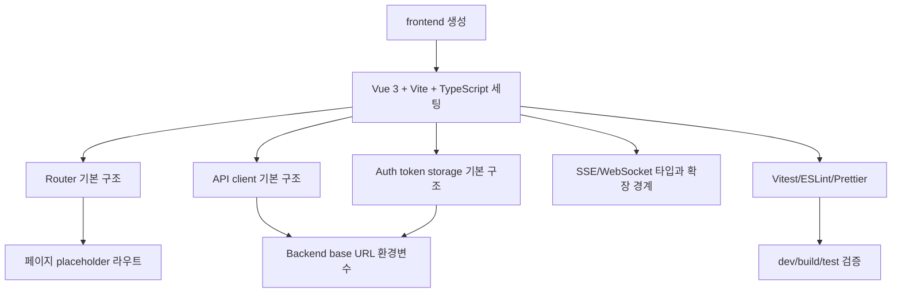

# Issue 66. Frontend Vue Vite Basic Setup

## Feature Description

루트 경로에 `frontend/` 애플리케이션을 새로 생성하고, 이후 로그인, 매칭, 게임 대기, 게임 진행, 결과 화면을 구현하기 위한 Vue 3 + Vite + TypeScript 기반 골격을 준비한다.

이번 이슈는 특정 페이지 기능을 구현하지 않는다. 목적은 프론트엔드 작업을 안정적으로 이어갈 수 있는 프로젝트 구조, 라우팅, API 통신 경계, SSE/WebSocket 확장 지점, 테스트/린트/빌드 명령을 먼저 고정하는 것이다.

기존 프로젝트 문서와 `.agents/rules/frontend-convention.md`는 React 기준으로 작성되어 있었다. 이번 이슈에서 Vue + Vite로 방향을 확정했으므로, 프론트엔드 convention과 프로젝트 문서의 React 기준 설명은 Vue 기준으로 갱신한다.



## Current Backend Contracts

프론트 골격은 현재 백엔드 API와 통신 계약을 기준으로 잡는다.

| 영역 | Backend Contract | Frontend 준비 범위 |
|------|------------------|-------------------|
| Auth | `/api/v1/auth/**` | token 저장/조회 유틸, API client 인증 헤더 주입 구조 |
| Match queue | `POST /api/v1/match/join`, `DELETE /api/v1/match/leave` | `services/match` 확장 자리만 준비 |
| Match response | `POST /api/v1/match/{matchId}/accept`, `POST /api/v1/match/{matchId}/reject` | match response 타입/서비스 확장 자리 준비 |
| Match notification | `GET /api/v1/notifications/match/stream` | native `EventSource` wrapper 확장 자리 준비 |
| Game WebSocket | `/ws/game/{gameRoomId}` | native `WebSocket` wrapper 확장 자리 준비 |
| Game summary | `GET /api/v1/games/{gameId}/summary` | summary API 타입/서비스 확장 자리 준비 |
| Static game asset | `/assets/game/dragon-view.mp4` | asset URL 상수와 game rendering 확장 자리 준비 |

이번 이슈에서는 위 API를 실제로 호출하는 사용자 플로우를 완성하지 않는다. 다만 이후 이슈에서 바로 기능을 얹을 수 있도록 환경변수, 서비스 레이어, 타입 디렉토리, 라우트 shell을 만든다.

## Stack Decision

| 항목 | 선택 | 이유 |
|------|------|------|
| Framework | Vue 3 | SFC 기반 화면 단위 구현, 명확한 template/script/style 분리 |
| Build tool | Vite | 빠른 dev server, 단순한 TS 설정, Vue 공식 경로 |
| Language | TypeScript | 백엔드 계약 DTO와 WebSocket/SSE message 타입 안정성 확보 |
| Router | Vue Router | 페이지 shell과 인증 라우팅 확장 |
| State | Pinia는 보류 | 현재 이슈는 뼈대 작업이다. auth/session 전역 상태가 실제로 필요해지는 이슈에서 도입 |
| Server state | TanStack Query Vue는 보류 | API 호출 패턴이 쌓인 뒤 도입 판단. 초기에는 typed service 함수만 준비 |
| Test | Vitest + Vue Test Utils | Vite/Vue 표준 테스트 조합 |
| Styling | CSS variables + scoped CSS | MVP 단계에서 가벼운 구조 유지 |

### Vue Transition Decision

기준 충돌 지점은 다음과 같이 정리한다.

| 기존 React 기준 | Vue 전환 기준 |
|----------------|---------------|
| React 19 | Vue 3 |
| React Router | Vue Router |
| `.tsx` page/component | `.vue` SFC page/component |
| React hooks | Vue composables. 단, 이번 이슈에서는 필요한 경우에만 생성 |
| `useState`, `useReducer`, `useEffect` | `ref`, `reactive`, `computed`, lifecycle hook |
| TanStack Query | 이번 이슈 미도입. typed service 함수로 시작 |
| React Testing Library | Vue Test Utils |
| React/CSS overlay | Vue/CSS overlay |

유지하는 정책:

- 매칭 알림은 native `EventSource` 사용
- 게임 통신은 native `WebSocket` 사용
- MP4 배경은 HTML `<video>` 사용
- HP bar, countdown, result HUD는 CSS overlay로 렌더링
- `requestAnimationFrame` 기반 HP overlay 갱신 방향 유지
- STOMP.js, SockJS, PixiJS, Web Worker, OffscreenCanvas는 MVP에서 미도입

## Directory Plan

```text
frontend/
├── index.html
├── package.json
├── vite.config.ts
├── tsconfig.json
├── tsconfig.app.json
├── tsconfig.node.json
├── .env.example
├── eslint.config.js
├── .prettierrc
└── src/
    ├── main.ts
    ├── App.vue
    ├── router/
    │   └── index.ts
    ├── pages/
    │   ├── HomePage.vue
    │   ├── LoginPage.vue
    │   ├── MatchPage.vue
    │   ├── GameWaitingPage.vue
    │   ├── GamePlayPage.vue
    │   └── GameResultPage.vue
    ├── components/
    ├── composables/
    ├── services/
    │   ├── apiClient.ts
    │   ├── authToken.ts
    │   ├── matchService.ts
    │   ├── gameSummaryService.ts
    │   └── realtime/
    │       ├── matchEventSource.ts
    │       └── gameWebSocket.ts
    ├── game/
    │   ├── hpScenario.ts
    │   └── gameMessages.ts
    ├── types/
    │   ├── api.ts
    │   ├── match.ts
    │   └── game.ts
    ├── constants/
    │   ├── env.ts
    │   └── routes.ts
    ├── assets/
    └── styles/
        ├── base.css
        └── variables.css
```

### Dependency Direction

```text
pages -> components, composables, services, game, types, constants
components -> composables, game, types, constants
composables -> services, game, utils, types, constants
services -> types, constants
game -> types, constants
types/constants -> no app dependency
```

- `components`는 API를 직접 호출하지 않는다.
- `composables`는 Vue 컴포넌트를 import하지 않는다.
- `services`는 UI 상태를 알지 않는다.
- `game`은 HP scenario, message parsing, countdown 계산 같은 순수 런타임 로직 중심으로 둔다.
- `pages`가 라우트 단위 조립과 이벤트 연결을 담당한다.

## Route Shell Plan

이번 이슈에서는 페이지 내용을 구현하지 않고 라우트 shell만 만든다.

| Route | Component | 이번 이슈 범위 |
|-------|-----------|----------------|
| `/` | `HomePage.vue` | 앱 진입 placeholder |
| `/login` | `LoginPage.vue` | 인증 페이지 placeholder |
| `/match` | `MatchPage.vue` | 매칭 페이지 placeholder |
| `/game/:gameRoomId/waiting` | `GameWaitingPage.vue` | 게임 대기 페이지 placeholder |
| `/game/:gameRoomId/play` | `GamePlayPage.vue` | 게임 진행 페이지 placeholder |
| `/game/:gameRoomId/result` | `GameResultPage.vue` | 결과 페이지 placeholder |

## Environment Plan

`.env.example`은 다음 값을 제공한다.

```env
VITE_API_BASE_URL=http://localhost:8080
VITE_WS_BASE_URL=ws://localhost:8080
VITE_GAME_VIDEO_URL=/assets/game/dragon-view.mp4
```

로컬 개발 기준:

- 백엔드 API: `http://localhost:8080`
- 게임 WebSocket: `ws://localhost:8080/ws/game/{gameRoomId}`
- 매칭 SSE: `http://localhost:8080/api/v1/notifications/match/stream`

## Scope Boundary

이번 이슈에 포함한다.

- 루트 `frontend/` 프로젝트 생성
- Vue 3 + Vite + TypeScript 기본 설정
- Vue Router 설정
- route placeholder page 생성
- API base client 기본 구조
- token storage 유틸 기본 구조
- SSE/WebSocket wrapper 파일 골격 생성
- game runtime 유틸 디렉토리 생성
- Vitest 테스트 환경 기본 설정
- ESLint/Prettier 설정
- `.env.example` 작성
- `npm run dev`, `npm run build`, `npm run test` 검증
- React 기준 문서/convention을 Vue 기준으로 갱신

이번 이슈에서 제외한다.

- 실제 로그인 화면 구현
- 회원가입/비밀번호 찾기 화면 구현
- 매칭 start/accept/reject UI 구현
- SSE 연결 플로우 완성
- WebSocket 게임 준비/RTT/SMITE 플로우 완성
- HP bar, countdown, video overlay 구현
- 결과 화면 summary polling 구현
- Pinia 도입
- TanStack Query Vue 도입
- 디자인 시스템 구축
- 배포 파이프라인 변경

## Tasks

### 1. Vue 전환 기준 확정

- [x] 기존 React 기준 프론트 문서와 convention 충돌 지점 정리
- [x] Vue 3 + Vite + TypeScript를 프론트 기본 스택으로 명시
- [x] Pinia와 TanStack Query Vue는 이번 이슈에서 보류한다고 명시
- [x] native `EventSource`, native `WebSocket`, HTML video + CSS overlay 정책은 유지한다고 명시

### 2. 프로젝트 생성

- [x] 루트에 `frontend/` 생성
- [x] Vue 3 + TypeScript + Vite scaffold 생성
- [x] 불필요한 예제 파일 제거
- [x] `package.json` scripts 정리
- [x] `.env.example` 추가

### 3. TypeScript/Vite 설정

- [x] `vite.config.ts` 설정
- [x] `@` alias를 `src`로 연결
- [x] TS strict 설정 확인
- [x] Vite dev server 기본 포트 `5173` 사용
- [x] backend proxy 도입 여부는 이번 이슈에서 보류하고 env base URL 방식 유지

### 4. Router와 페이지 shell

- [x] Vue Router 설치 및 `src/router/index.ts` 생성
- [x] `routes.ts` 상수 생성
- [x] 기본 route 6개 등록
- [x] 각 route별 placeholder page 생성
- [x] `App.vue`는 router-view 중심의 최소 shell로 구성

### 5. Service layer 골격

- [ ] `apiClient.ts` 생성
- [ ] `authToken.ts` 생성
- [ ] API base URL env 검증 helper 생성
- [ ] JSON request/response 처리 기본 함수 생성
- [ ] 인증 토큰이 있으면 Authorization header를 주입할 수 있는 구조 준비
- [ ] `matchService.ts`, `gameSummaryService.ts`는 함수 signature 중심으로 skeleton 작성

### 6. Realtime 골격

- [ ] `matchEventSource.ts` 생성
- [ ] `gameWebSocket.ts` 생성
- [ ] SSE/WebSocket message 타입 위치 확정
- [ ] reconnect, heartbeat, RTT 처리 구현은 후속 이슈로 분리
- [ ] 브라우저 native API 사용 원칙 명시

### 7. Game runtime 골격

- [ ] `gameMessages.ts`에 WebSocket client/server message type 초안 작성
- [ ] `hpScenario.ts`에 HP scenario 계산 함수 자리 생성
- [ ] `requestAnimationFrame` 기반 overlay 갱신은 후속 게임 화면 이슈로 분리
- [ ] MP4 URL 상수 위치 확정

### 8. Styling 기본값

- [ ] `styles/base.css` 생성
- [ ] `styles/variables.css` 생성
- [ ] 전역 reset은 최소화
- [ ] 특정 페이지 디자인은 구현하지 않음
- [ ] card-heavy landing page 형태를 만들지 않고 앱 shell 중심으로 유지

### 9. Test/Lint/Format

- [ ] Vitest 설정
- [ ] Vue Test Utils 설정
- [ ] 기본 mount smoke test 추가
- [ ] ESLint 설정 파일 생성 또는 scaffold 결과 정리
- [ ] Prettier 설정
- [ ] `npm run lint`, `npm run test`, `npm run build` scripts 검증

### 10. 문서 정합성

- [x] `.agents/rules/frontend-convention.md`를 Vue 기준으로 갱신
- [x] `docs/project/overallplan.md` 프론트 스택 설명을 Vue 기준으로 갱신
- [x] `docs/project/websocket client.md`에서 프레임워크 의존 문구가 있으면 Vue 기준과 충돌하지 않게 정리
- [ ] 이번 이슈 문서에 구현 결과와 검증 명령 기록

## Implementation Report Before Coding

실제 구현은 다음 순서로 진행한다.

1. 문서와 convention부터 Vue 기준으로 정리한다.
2. `npm create vite@latest frontend -- --template vue-ts` 계열로 scaffold를 만든다.
3. 예제 코드를 제거하고 League of Smite 앱 shell만 남긴다.
4. Router, services, realtime, game, types, constants 디렉토리를 먼저 만든다.
5. 실제 화면 기능은 넣지 않고 placeholder page와 확장 가능한 service signature만 둔다.
6. `npm install` 후 `npm run build`, `npm run test`, `npm run lint`가 통과하도록 조정한다.
7. Vite dev server를 띄워 접속 가능 여부를 확인한다.

이번 이슈의 완료 기준은 “사용자 기능이 보인다”가 아니라 “다음 이슈에서 로그인/매칭/게임 화면을 바로 구현할 수 있는 안정적인 Vue 프론트 작업대가 준비됐다”이다.

## Verification Plan

구현 후 아래 명령으로 검증한다.

```bash
cd frontend
npm install
npm run lint
npm run test
npm run build
npm run dev
```

브라우저 확인:

- `http://localhost:5173`
- 등록된 route placeholder 이동
- console error 없음

## Notes

- 현재 백엔드는 `localhost:8080`을 기본 개발 포트로 사용한다.
- Docker MySQL/Redis는 로컬 바인딩으로 잠근 상태다.
- 프론트 dev server는 Vite 기본 포트 `5173`을 사용한다.
- 실제 API 호출과 인증 플로우는 후속 기능 이슈에서 구현한다.

## Progress

### 2026-06-01 - Task 2 Project Creation

- `frontend/`를 Vue 3 + TypeScript + Vite scaffold로 생성했다.
- `npm install`로 `package-lock.json`을 생성했다.
- Vite 예제 컴포넌트와 로고 자산을 제거했다.
- `package.json` 이름을 `smite-frontend`로 정리하고 `typecheck` script를 추가했다.
- `.env.example`에 백엔드 API, WebSocket, 게임 MP4 URL 기본값을 추가했다.
- `npm run typecheck`, `npm run build` 통과를 확인했다.

### 2026-06-01 - Task 3 TypeScript/Vite Settings

- `vite.config.ts`에 `@` alias를 `frontend/src`로 연결했다.
- Vite dev server 기본 포트를 `5173`으로 명시했다.
- backend proxy는 설정하지 않고 `.env.example`의 base URL 방식 유지로 확정했다.
- `tsconfig.app.json`에 `strict`, `noImplicitOverride`, `noUncheckedIndexedAccess`를 명시했다.
- Vue 프로젝트 기준에 맞게 app TS include에서 `src/**/*.tsx`를 제거했다.
- `tsconfig.node.json`에도 `strict`를 명시했다.
- `npm run typecheck`, `npm run build` 통과를 확인했다.

### 2026-06-01 - Task 4 Router and Page Shell

- `vue-router`를 설치하고 `src/router/index.ts`를 생성했다.
- `src/constants/routes.ts`에 route path/name 상수를 추가했다.
- `/`, `/login`, `/match`, `/game/:gameRoomId/waiting`, `/game/:gameRoomId/play`, `/game/:gameRoomId/result` 6개 route를 등록했다.
- 각 route에 대응하는 placeholder page를 `src/pages/`에 생성했다.
- `App.vue`는 `RouterView`만 렌더링하는 최소 shell로 변경했다.
- `main.ts`에서 Vue app에 router plugin을 등록했다.
- TypeScript가 `@` alias를 해석하도록 `tsconfig.app.json`에 `paths`를 추가했다.
- `npm run typecheck`, `npm run build` 통과를 확인했다.
