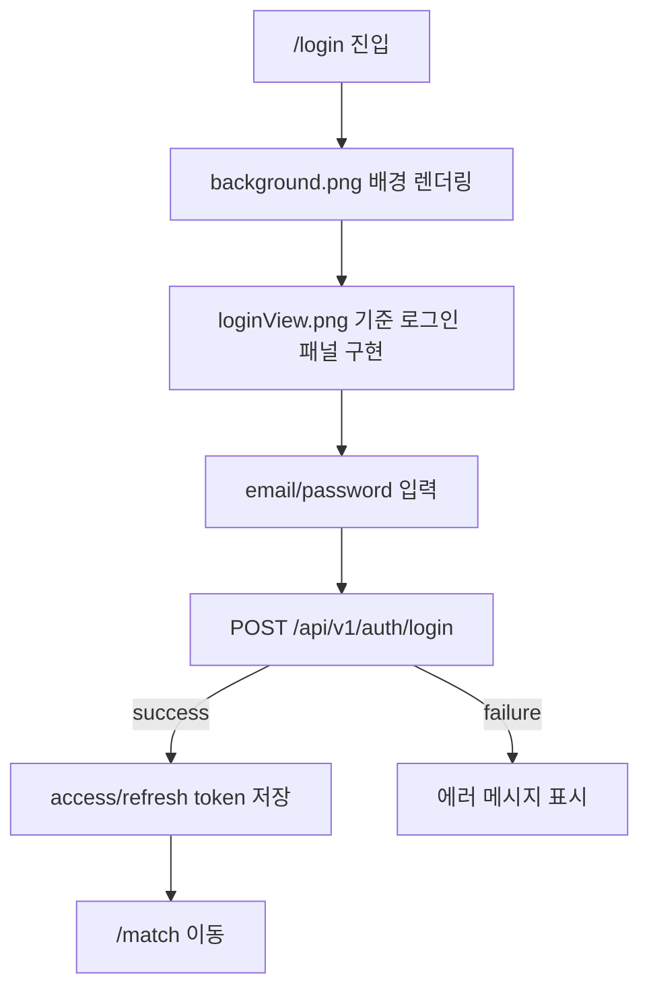
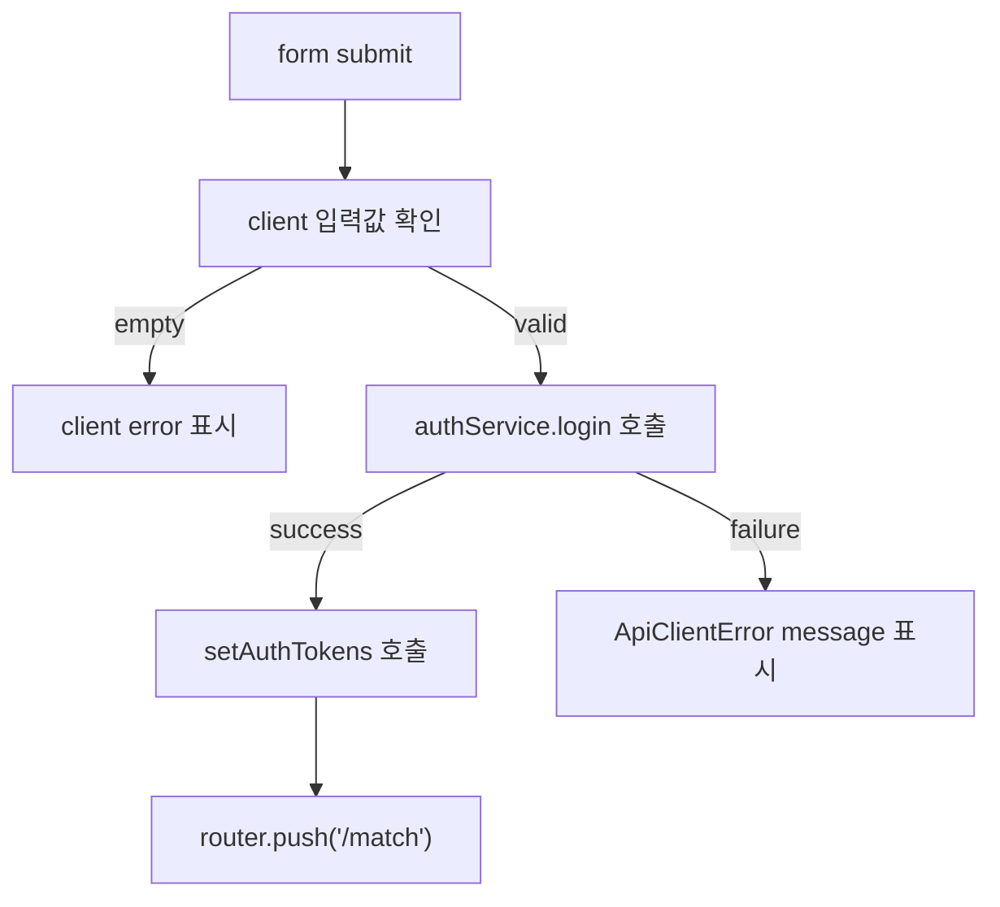
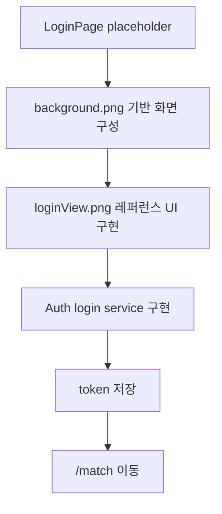

# Issue 72. Login Page Implementation

## Feature Description

Vue 프론트엔드의 `/login` 페이지를 실제 로그인 화면으로 구현한다.

현재 프론트엔드는 Vue + Vite + TypeScript 기반 skeleton과 `/login` route placeholder만 존재한다. 이번 이슈에서는 `frontend/img/loginView.png`를 화면 레퍼런스로 삼고, `frontend/img/background.png`를 실제 배경 이미지로 사용해 로그인 페이지 UI를 구현한다.

로그인 기능은 백엔드 `POST /api/v1/auth/login` 계약에 맞춰 email/password 인증 요청을 보내고, 성공 시 access token과 refresh token을 저장한 뒤 `/match`로 이동하는 흐름까지 구현한다.

이번 작업은 로그인 페이지 1차 구현 범위로 제한한다. 회원가입, 비밀번호 찾기, Google OAuth, 자동 token refresh, 전역 auth store, 상세 validation 정책은 후속 이슈에서 진행한다.

## Backend Contract

| 항목 | 기준 |
|------|------|
| Endpoint | `POST /api/v1/auth/login` |
| Auth | public API. Authorization header 불필요 |
| Request | `{ email: string, password: string }` |
| Response | `{ accessToken: string, refreshToken: string, userId: number, nickname: string }` |
| Success action | token 저장 후 `/match` 이동 |
| Failure action | 전역 `ErrorResponse.message` 또는 client fallback message 표시 |

## Asset 기준

| Asset | 용도 | 기준 |
|-------|------|------|
| `frontend/img/background.png` | 로그인 페이지 full-screen 배경 | `LoginPage.vue`에서 import asset으로 사용 |
| `frontend/img/loginView.png` | 디자인 레퍼런스 | 직접 화면에 통째로 올리지 않고 레이아웃/색상/간격 기준으로 사용 |

구현 기준:

- 배경은 viewport 전체를 채우도록 구현.
- 로그인 패널은 desktop에서 좌측 정렬 기준으로 구현.
- 패널은 밝은 반투명 카드 톤으로 구현.
- 타이틀은 `LEAGUE OF SMITE`, subtitle은 `PROVE YOUR REACTION`으로 구현.
- 입력 필드는 email/password 2개만 실제 동작 구현.
- `FORGOT PASSWORD?`, `SIGN UP`, `Google`, `ABOUT THIS GAME`은 레퍼런스에 맞춰 표시하되 실제 기능 연결은 보류.
- 모바일에서는 패널이 화면 중앙 또는 상단 중심으로 안정적으로 보이도록 반응형 구현.

이미지 사용 정책:

- `background.png`는 `src/pages/LoginPage.vue`에서 `../../img/background.png` 상대 경로 import로 사용.
- `loginView.png`는 구현 산출물에 import하지 않고, 작업자가 레이아웃을 비교하는 기준 이미지로만 사용.
- 이미지 파일을 이번 이슈에서 이동하지 않음.

## Scope Boundary

이번 이슈에 포함한다.

- `/login` placeholder를 실제 로그인 페이지로 교체 구현.
- 로그인 배경 이미지 적용.
- 로그인 패널 레이아웃 구현.
- email/password form 상태 구현.
- login service 함수 구현.
- 백엔드 로그인 API 호출 구현.
- 성공 시 `setAuthTokens(accessToken, refreshToken)` 호출 구현.
- 성공 시 `/match` 이동 구현.
- 실패 시 오류 메시지 표시 구현.
- submit 중 버튼 disabled/loading 상태 구현.
- 최소 테스트 추가.
- lint / format / typecheck / build 검증.

이번 이슈에서 제외한다.

- 회원가입 페이지 구현.
- 비밀번호 찾기 페이지 구현.
- Google OAuth 실제 연동.
- user profile 전역 저장.
- Pinia 도입.
- refresh token 자동 재발급.
- route guard 전체 구현.
- 접근성 고도화.
- 디자인 시스템 구축.

## Tasks

### 1. 백엔드 로그인 계약 반영

- [ ] `POST /api/v1/auth/login` request/response 타입 정의 구현.
- [ ] 로그인 API는 `auth: false`로 호출하도록 구현.
- [ ] response의 `accessToken`, `refreshToken`, `userId`, `nickname` 타입 반영.
- [ ] 전역 `ErrorResponse` 실패 메시지 처리 기준 정리.

### 2. Auth service 구현

- [ ] `src/services/authService.ts` 생성 구현.
- [ ] `login` 함수 구현.
- [ ] `LoginRequest`, `LoginResponse` 타입 추가 구현.
- [ ] 기존 `apiClient.ts`와 `authToken.ts` 구조 재사용.
- [ ] `authService.ts`는 API 호출만 담당하도록 구현.
- [ ] access/refresh token 저장은 기존 `authToken.ts`의 `setAuthTokens`로 처리.
- [ ] `LoginPage.vue`는 `login` 호출, token 저장, router 이동을 조립하는 page 역할로 구현.

### 3. Login page UI 구현

- [ ] `src/pages/LoginPage.vue` placeholder 제거 구현.
- [ ] `background.png` full-screen 배경 적용 구현.
- [ ] `loginView.png` 레퍼런스 기준 좌측 로그인 패널 구현.
- [ ] email input 구현.
- [ ] password input 구현.
- [ ] Login submit button 구현.
- [ ] `FORGOT PASSWORD?`, `SIGN UP`, `Google`, `ABOUT THIS GAME` 표시 구현.
- [ ] 기능 미연결 요소는 button 또는 anchor 형태만 두고 실제 route 연결은 보류.

### 4. Login interaction 구현

- [ ] form submit 시 기본 새로고침 방지 구현.
- [ ] submit 중 중복 요청 방지 구현.
- [ ] email/password 값이 비어 있으면 client message 표시 구현.
- [ ] API 성공 시 token 저장 구현.
- [ ] API 성공 시 `/match` 이동 구현.
- [ ] API 실패 시 backend message 또는 기본 실패 메시지 표시 구현.
- [ ] password input에서 enter submit 동작 구현.

구현 흐름:

### 5. Styling 구현

- [ ] page scoped style 중심으로 구현.
- [ ] 기존 `styles/variables.css` 토큰을 가능한 범위에서 재사용.
- [ ] background image는 화면 비율에 따라 깨지지 않도록 `cover` 기준 구현.
- [ ] desktop 기준 패널 좌측 배치 구현.
- [ ] mobile 기준 패널 폭/여백/텍스트 크기 조정 구현.
- [ ] 버튼과 input text가 container 밖으로 넘치지 않도록 검증.

### 6. Test 구현

- [ ] 로그인 페이지 렌더링 테스트 추가.
- [ ] email/password 입력 후 submit 시 login service 호출 검증.
- [ ] 성공 시 token 저장 및 `/match` 이동 검증.
- [ ] 실패 시 오류 메시지 표시 검증.
- [ ] submit 중 버튼 disabled 상태 검증.

### 7. 검증

- [ ] `npm run lint` 검증.
- [ ] `npm run format` 검증.
- [ ] `npm run typecheck` 검증.
- [ ] `npm run test` 검증.
- [ ] `npm run build` 검증.
- [ ] dev server 실행 후 `/login` 화면 확인.
- [ ] desktop/mobile viewport에서 배경, 패널, 입력 필드, 버튼 겹침 여부 확인.

## Implementation Policy

- 로그인 화면은 이번 이슈에서 실제 구현하되, 인증 시스템 전체 고도화는 하지 않음.
- UI는 `loginView.png`를 그대로 이미지로 붙이지 않고 Vue template/CSS로 재현.
- `background.png`는 `LoginPage.vue`에서 import해 실제 화면 배경으로 사용.
- Google 로그인 버튼은 표시만 구현하고 실제 OAuth endpoint 연결은 후속 작업으로 보류.
- `SIGN UP`, `FORGOT PASSWORD?`, `ABOUT THIS GAME`은 표시만 구현하고 route 이동은 후속 작업으로 보류.
- API 계약은 백엔드 `AuthController`와 RestDocs 기준을 따른다.
- token 저장은 기존 `authToken.ts`를 재사용한다.
- 로그인 성공 후 이동 경로는 `/match`로 고정한다.
- `authService.ts`는 token 저장이나 router 이동을 직접 수행하지 않는다.
- `LoginPage.vue`가 form 상태, submit 상태, token 저장 호출, router 이동을 조립한다.

## Acceptance Criteria

- `/login` 진입 시 `background.png` 기반 full-screen 로그인 화면 표시.
- desktop에서 레퍼런스처럼 좌측 로그인 패널 표시.
- mobile에서 패널과 입력 요소가 화면 밖으로 밀리지 않음.
- email/password 입력 후 Login 클릭 시 `/api/v1/auth/login` 호출.
- 로그인 성공 시 access/refresh token 저장.
- 로그인 성공 시 `/match` 이동.
- 로그인 실패 시 사용자에게 에러 메시지 표시.
- Google, Sign up, Forgot password, About this game은 클릭해도 실제 인증 흐름을 방해하지 않음.
- lint / format / typecheck / test / build 통과.

## PR Message

## 📌 Summary

## 📚 Changes

- 백엔드 `POST /api/v1/auth/login` 계약 기준 로그인 요청/응답 타입 구현.
- 로그인 API는 public endpoint이므로 Authorization header 없이 호출하도록 구현.
- access/refresh token 저장은 기존 `authToken.ts` 정책을 재사용하도록 구현.
- 로그인 성공 이후 사용자는 매칭 플로우로 진입해야 하므로 `/match` 이동으로 구현.
- `loginView.png`는 디자인 기준으로 사용하고, `background.png`는 실제 배경 자산으로 사용하도록 구현.
- 회원가입, 비밀번호 찾기, Google OAuth는 백엔드/라우팅 후속 계약이 필요하므로 표시만 구현.

## 📝 Note

- 이번 이슈는 로그인 페이지와 일반 로그인 연동 1차 구현 범위.
- route guard, refresh token 자동 재발급, OAuth 로그인은 후속 이슈에서 진행.
- 구현 후 `npm run lint`, `npm run format`, `npm run typecheck`, `npm run test`, `npm run build` 검증.

## 📌 Related Issue

- Closes #72
