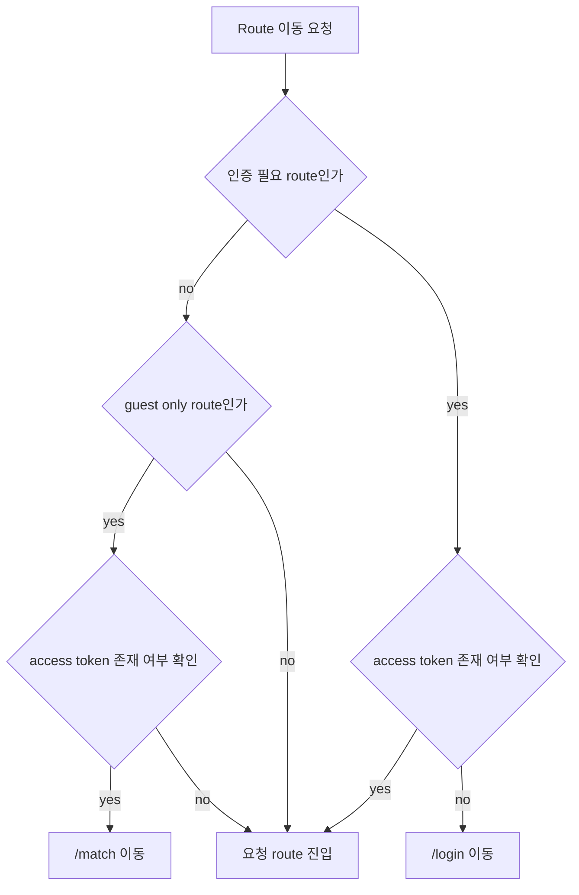
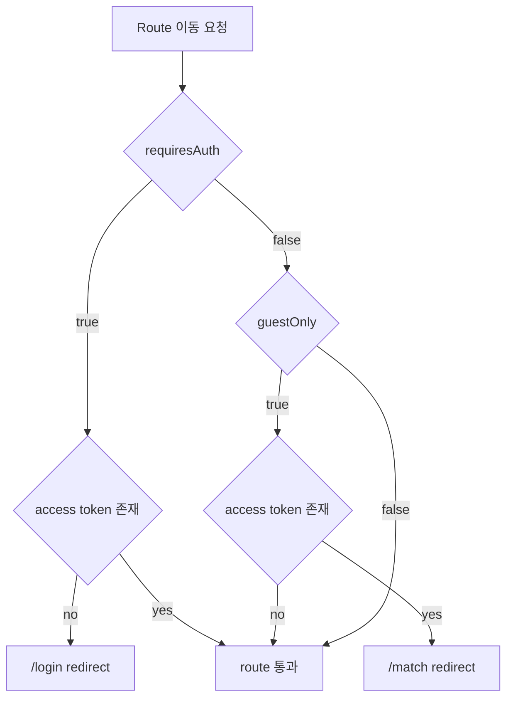

# Issue 74. Auth Route Guard Implementation

## Feature Description

Vue 프론트엔드의 인증 필요 route를 보호하는 route guard를 구현한다.

현재 로그인 페이지는 성공 시 access token과 refresh token을 저장하고 `/match`로 이동한다. 하지만 token이 없는 사용자가 `/match`, `/game/:gameRoomId/waiting`, `/game/:gameRoomId/play`, `/game/:gameRoomId/result`에 직접 접근하는 것을 막는 처리는 아직 없다.

이번 이슈는 `docs/antigravity/frontend/front-plan.md`의 `2. [ ] 인증 라우트 가드 구현`을 구현 기준으로 삼는다. `1. [x] 로그인 페이지 구현`에서 저장한 access token을 기준으로 최소 인증 상태를 판단하고, route 전환 정책만 구현한다.

이번 작업은 route guard 1차 구현 범위로 제한한다. JWT 만료 검증, refresh token 자동 재발급, API 401 retry, profile 전역 저장, Pinia 도입, 보안 저장소 변경은 후속 이슈에서 진행한다.

## Route Policy

| Route | Meta | 인증 상태 기준 동작 |
|-------|------|----------------------|
| `/` | public | 인증 여부와 무관하게 접근 허용 |
| `/login` | guest only | token 있으면 `/match` 이동 |
| `/match` | protected | token 없으면 `/login` 이동 |
| `/game/:gameRoomId/waiting` | protected | token 없으면 `/login` 이동 |
| `/game/:gameRoomId/play` | protected | token 없으면 `/login` 이동 |
| `/game/:gameRoomId/result` | protected | token 없으면 `/login` 이동 |

인증 상태 기준:

- `accessToken`이 존재하면 인증 상태로 판단.
- `accessToken`이 `null`이거나 빈 문자열이면 미인증 상태로 판단.
- refresh token 존재 여부는 이번 route guard 판단에 사용하지 않음.
- access token 만료 여부는 이번 route guard 판단에 사용하지 않음.
- 로그인 후 원래 접근하려던 route로 복귀하지 않고 기존 로그인 정책대로 `/match`로 이동.

## Scope Boundary

이번 이슈에 포함한다.

- 인증 필요 route meta 정의 구현.
- guest only route meta 정의 구현.
- access token 존재 여부 기반 인증 상태 helper 구현.
- Vue Router `beforeEach` 기반 route guard 구현.
- 미인증 사용자의 protected route 접근 시 `/login` 이동 구현.
- 인증 사용자의 `/login` 접근 시 `/match` 이동 구현.
- public route는 인증 여부와 무관하게 통과하도록 구현.
- route guard 단위 테스트 구현.
- router meta 정합성 테스트 구현.
- lint / format / typecheck / test / build 검증.

이번 이슈에서 제외한다.

- JWT decode 기반 token 만료 검증.
- refresh token 자동 재발급.
- API 401 발생 시 refresh/retry 처리.
- 로그인 후 redirect query 기반 원래 route 복귀.
- user profile 전역 저장.
- Pinia 또는 전역 auth store 도입.
- logout flow 구현.
- localStorage 외 token 저장소 변경.
- XSS 대응 저장 전략 고도화.

## Tasks

### 1. 인증 상태 helper 구현

- [x] `src/services/authSession.ts` 생성 구현.
- [x] `hasAuthSession` 함수 구현.
- [x] `hasAuthSession`은 기존 `authToken.ts`의 `getAccessToken`만 재사용하도록 구현.
- [x] access token이 존재하고 빈 문자열이 아니면 인증 상태로 판단하도록 구현.
- [x] refresh token은 route guard 판단에 사용하지 않도록 구현.
- [x] router가 `localStorage`나 token key를 직접 알지 않도록 책임 분리 구현.

### 2. Route meta 정책 구현

- [x] `/login` route에 `guestOnly` meta 설정 구현.
- [x] `/match` route에 `requiresAuth` meta 설정 구현.
- [x] `/game/:gameRoomId/waiting` route에 `requiresAuth` meta 설정 구현.
- [x] `/game/:gameRoomId/play` route에 `requiresAuth` meta 설정 구현.
- [x] `/game/:gameRoomId/result` route에 `requiresAuth` meta 설정 구현.
- [x] `/` route는 public route로 유지하도록 구현.
- [x] route meta 타입 확장 필요 여부 확인 후 TypeScript 오류 없이 구현.

### 3. Auth route guard 구현

- [x] `src/router/authGuard.ts` 생성 구현.
- [x] `to.meta.requiresAuth === true`이고 미인증이면 login route redirect 반환 구현.
- [x] `to.meta.guestOnly === true`이고 인증 상태면 match route redirect 반환 구현.
- [x] 그 외 route는 통과하도록 구현.
- [x] redirect target은 route path string이 아니라 `ROUTE_NAMES` 기반 name 객체로 구현.
- [x] redirect query는 이번 이슈에서 추가하지 않도록 구현.
- [x] guard 내부에서 token 만료 검증이나 refresh 호출을 하지 않도록 구현.

### 4. Router 연결 구현

- [x] `src/router/index.ts`에 auth guard 등록 구현.
- [x] router 생성 이후 `beforeEach`로 guard를 연결하도록 구현.
- [x] 기존 route path/name 상수 구조를 유지하도록 구현.
- [x] page component가 인증 여부를 직접 판단하지 않도록 구현.
- [x] `LoginPage.vue`의 로그인 성공 후 `/match` 이동 정책은 유지하도록 구현.

### 5. Test 구현

- [ ] 미인증 사용자가 `/match` 접근 시 `/login` redirect 검증.
- [ ] 미인증 사용자가 game waiting route 접근 시 `/login` redirect 검증.
- [ ] 미인증 사용자가 game play route 접근 시 `/login` redirect 검증.
- [ ] 미인증 사용자가 game result route 접근 시 `/login` redirect 검증.
- [ ] 인증 사용자가 protected route 접근 시 통과 검증.
- [ ] 인증 사용자가 `/login` 접근 시 `/match` redirect 검증.
- [ ] 미인증 사용자가 `/login` 접근 시 통과 검증.
- [ ] 인증 여부와 무관하게 `/` public route 접근 통과 검증.
- [ ] protected route meta 정합성 검증.
- [ ] guest only route meta 정합성 검증.

### 6. 문서 정합성 구현

- [ ] `front-plan.md`의 `2. [ ] 인증 라우트 가드 구현` 완료 상태 반영.
- [ ] route guard가 access token 존재 여부만 판단하는 MVP 정책 명시.
- [ ] refresh token 자동 재발급과 token 만료 검증은 후속 이슈로 유지.
- [ ] profile/auth state 저장 정책은 후속 이슈로 유지.
- [ ] 이번 이슈 PR 메시지 섹션 작성.

### 7. 검증

- [ ] `npm run lint` 검증.
- [ ] `npm run format` 검증.
- [ ] `npm run typecheck` 검증.
- [ ] `npm run test` 검증.
- [ ] `npm run build` 검증.
- [ ] dev server 실행 후 token 없는 상태에서 `/match` 접근 시 `/login` 이동 확인.
- [ ] token 있는 상태에서 `/login` 접근 시 `/match` 이동 확인.

## Implementation Policy

- route guard는 router 계층에서 route 전환만 담당한다.
- 인증 상태 판단은 `authSession` helper가 담당한다.
- token 저장소 접근은 기존 `authToken.ts`로 제한한다.
- page component는 인증 여부를 직접 판단하지 않는다.
- presentational component에 token 조회, route guard, storage 접근을 넣지 않는다.
- 이번 이슈에서 인증 상태는 access token 존재 여부만 기준으로 한다.
- refresh token은 저장되어 있어도 route guard 판단에는 사용하지 않는다.
- access token 만료 여부는 검사하지 않는다.
- API 401 처리와 refresh/retry는 후속 공통 API/auth 이슈에서 구현한다.
- 로그인 성공 후 이동은 기존 정책대로 `/match`로 유지한다.

## Acceptance Criteria

- token 없는 사용자가 `/match`에 직접 접근하면 `/login`으로 이동.
- token 없는 사용자가 게임 route에 직접 접근하면 `/login`으로 이동.
- token 있는 사용자가 `/match`와 게임 route에 접근하면 통과.
- token 있는 사용자가 `/login`에 접근하면 `/match`로 이동.
- `/` route는 인증 여부와 무관하게 접근 가능.
- router가 localStorage key를 직접 알지 않음.
- page component에 인증 판단 로직이 들어가지 않음.
- lint / format / typecheck / test / build 통과.

## PR Message

## 📌 Summary

## 📚 Changes

- `front-plan.md`의 인증 라우트 가드 단계 기준으로 protected route와 guest only route 정책 구현.
- 인증 상태 판단은 access token 존재 여부만 사용하도록 구현.
- router가 token storage 세부 구현을 알지 않도록 `authSession` helper로 관심사 분리.
- `/match` 및 game route는 token 없을 때 `/login`으로 이동하도록 구현.
- `/login`은 token 있는 상태에서 접근 시 `/match`로 이동하도록 구현.
- refresh token 자동 재발급, token 만료 검증, profile 전역 저장은 후속 이슈로 유지.

## 📝 Note

- 이번 이슈는 route 접근 제어 1차 구현 범위.
- access token 만료 여부는 검사하지 않음.
- 로그인 후 redirect query 기반 원래 route 복귀는 구현하지 않음.
- Pinia 또는 전역 auth store는 도입하지 않음.
- 구현 후 `npm run lint`, `npm run format`, `npm run typecheck`, `npm run test`, `npm run build` 검증.

## 📌 Related Issue

- Closes #74
