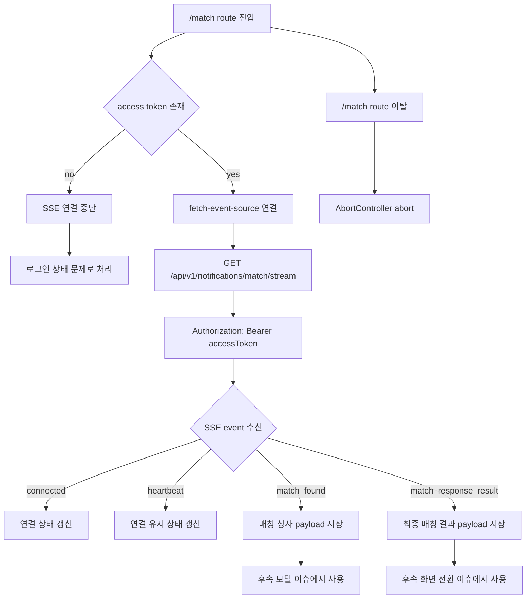
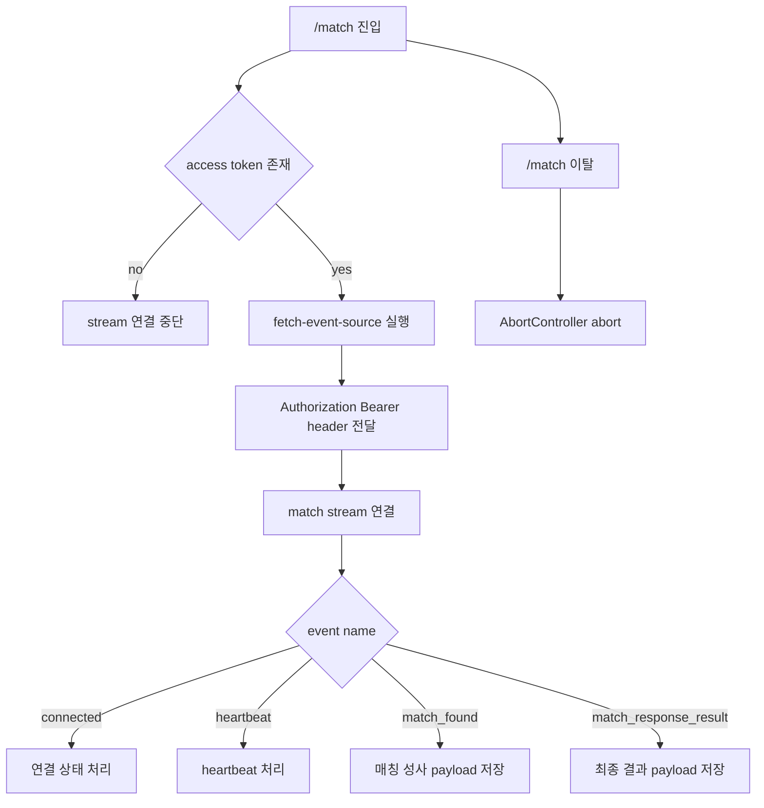

# Issue 76. SSE Auth Contract And Match Stream Implementation

## Feature Description

Vue 프론트엔드에서 백엔드 매칭 알림 SSE 스트림을 Bearer token 기반으로 연결한다.

백엔드 RestDocs 기준 매칭 알림 스트림은 `GET /api/v1/notifications/match/stream`이며, `Authorization: Bearer {accessToken}` header를 요구한다. 하지만 브라우저 native `EventSource`는 custom header를 보낼 수 없으므로, 기존 `EventSource` 기반 골격을 유지하면 현재 백엔드 계약과 실연동할 수 없다.

이번 이슈는 `docs/antigravity/frontend/front-plan.md`의 `3. [ ] SSE 인증 계약 확정 및 매칭 스트림 연결 구현`을 구현 기준으로 삼는다. 인증 방식은 `@microsoft/fetch-event-source` 기반으로 확정하고, 기존 백엔드 Authorization header 계약을 유지한다.

이번 작업은 매칭 스트림 연결 골격과 event dispatch 정책까지만 구현한다. 매칭 시작/취소 UI, 수락/거절 모달, accept/reject command, 최종 게임 대기방 이동은 후속 이슈에서 구현한다.



## Backend Contract

| 항목 | 계약 |
|------|------|
| Endpoint | `GET /api/v1/notifications/match/stream` |
| Accept | `text/event-stream` |
| Auth | `Authorization: Bearer {accessToken}` |
| 연결 시점 | 매칭 화면 진입 시 연결 |
| 연결 유지 | `match_found` 수신 후에도 같은 연결 유지 |
| 최종 전환 기준 | HTTP accept/reject 응답이 아니라 `match_response_result` |

백엔드 event name:

| Event | Frontend 처리 기준 |
|-------|--------------------|
| `connected` | SSE 연결 확인 상태로 처리 |
| `heartbeat` | 연결 유지 신호로 처리 |
| `match_found` | 수락/거절 모달 표시를 위한 payload로 저장 |
| `match_response_result` | 최종 매칭 결과와 이후 화면 전환 기준 payload로 저장 |

## Auth Contract Decision

이번 이슈에서 확정하는 정책:

- native `EventSource`를 사용하지 않음.
- query token 방식으로 access token을 URL에 노출하지 않음.
- cookie auth 전환을 이번 이슈에서 진행하지 않음.
- `@microsoft/fetch-event-source`를 사용해 `Authorization: Bearer` header를 직접 전달.
- 기존 백엔드 RestDocs의 Authorization header 계약을 유지.
- access token이 없으면 SSE 연결을 시도하지 않음.
- token 만료로 인한 401/403 refresh/retry는 후속 token refresh 이슈에서 처리.

선택 이유:

- 현재 프론트는 로그인 후 access token을 저장하고 API 요청에 Bearer header를 붙이는 SPA 구조.
- 백엔드 SSE RestDocs도 Bearer header를 source of truth로 명시.
- query token은 URL, proxy log, monitoring log에 token이 노출될 수 있어 일반 access token 전달 방식으로 부적합.
- cookie auth는 백엔드 인증 전략 변경이 필요하므로 이번 프론트 이슈의 범위를 벗어남.

## Contract Verification

확인한 백엔드 source of truth:

- `backend/smite-api/build/generated-snippets/notification-match-stream/resource.json`
- `backend/smite-api/build/generated-snippets/notification-match-stream/http-request.adoc`
- `backend/smite-api/src/main/java/com/sang/smite/notification/match/controller/MatchNotificationController.java`
- `backend/smite-api/src/main/java/com/sang/smite/common/path/notification/NotificationPath.java`

확인 결과:

- endpoint는 `GET /api/v1/notifications/match/stream`.
- request header는 `Authorization: Bearer access-token` 필수.
- request `Accept`는 `text/event-stream`.
- controller는 `@AuthUser Long userId`를 받아 `matchNotificationService.connect(userId)`로 SSE 연결을 생성.
- 따라서 프론트는 token을 URL query가 아니라 Authorization header로 전달해야 함.
- native `EventSource`는 Authorization header를 설정할 수 없으므로 현재 백엔드 계약과 직접 호환되지 않음.
- 이번 이슈의 구현 방향은 `@microsoft/fetch-event-source` 기반 Bearer header 연결로 확정.
- `front-plan.md` 3번 단계의 blocker였던 `Authorization header 요구와 native EventSource 제약 충돌`은 fetch 기반 SSE client 도입으로 해소하는 방향이 issue-76에 반영됨.

## Payload Contract

```ts
interface MatchSseConnectedEvent {
  userId: number
  connectedAt: string
}

interface MatchSseHeartbeatEvent {
  sentAt: string
}

interface MatchFoundNotification {
  matchId: string
  userId: number
  opponentUserId: number
  acceptTimeoutSeconds: number
  eventCreatedAt: string
}

interface MatchResponseResultNotification {
  matchId: string
  outcome: 'MATCHED' | 'FAILED'
  reason:
    | 'BOTH_ACCEPTED'
    | 'MY_REJECTED'
    | 'OPPONENT_REJECTED'
    | 'MY_TIMEOUT'
    | 'OPPONENT_TIMEOUT'
    | 'BOTH_TIMEOUT'
    | 'GAME_SETUP_FAILED'
  action: 'GO_TO_GAME_WAITING' | 'GO_TO_MATCH_START' | 'RETURN_TO_MATCHING'
  opponent: {
    userId: number
    nickname: string
    tier: string
    tierScore: number
  } | null
  game: {
    gameRoomId: number
    videoUrl: string
    webSocketUrl: string
  } | null
}
```

## Scope Boundary

이번 이슈에 포함한다.

- SSE 인증 방식 `fetch-event-source + Authorization Bearer header` 확정.
- `@microsoft/fetch-event-source` 의존성 추가.
- 기존 `matchEventSource.ts`를 fetch 기반 SSE client로 변경.
- access token 없을 때 연결을 시도하지 않는 정책 구현.
- `connected`, `heartbeat`, `match_found`, `match_response_result` event dispatch 구현.
- JSON parse 실패 및 알 수 없는 event 처리 정책 구현.
- `/match` 페이지 진입 시 SSE 연결 골격 구현.
- `/match` 페이지 이탈 시 SSE 연결 해제 구현.
- SSE 연결 상태를 페이지 로컬 상태로 최소 표시 또는 보관 구현.
- SSE client 단위 테스트 구현.
- Match page lifecycle 테스트 구현.
- lint / format / typecheck / test / build 검증.

이번 이슈에서 제외한다.

- 매칭 시작/취소 UI 구현.
- `POST /api/v1/match/join` 실사용 UI 연결.
- `DELETE /api/v1/match/leave` 실사용 UI 연결.
- `match_found` 수락/거절 모달 구현.
- accept/reject command 구현.
- `match_response_result.action` 기준 실제 route 이동 구현.
- 게임 대기방 화면 구현.
- SSE 자동 재연결 고도화 구현.
- token refresh/retry 구현.
- Pinia 또는 전역 match store 도입.
- backend cookie auth 전환.
- query token 인증 방식 도입.

## Tasks

### 1. SSE 인증 계약 확정 문서화

- [x] 백엔드 RestDocs의 `GET /api/v1/notifications/match/stream` 계약 확인 구현.
- [x] Authorization header 필수 계약 확인 구현.
- [x] native `EventSource`의 custom header 제약 문서화.
- [x] `fetch-event-source + Authorization Bearer header` 방식 확정 구현.
- [x] cookie auth와 query token을 이번 이슈에서 제외하는 이유 문서화.
- [x] `front-plan.md`의 3번 단계와 issue-76 정책 정합성 확인 구현.

### 2. 패키지 의존성 구현

- [x] `@microsoft/fetch-event-source` dependency 추가 구현.
- [x] package lock 변경 사항 확인 구현.
- [x] 기존 Vue/Vite/TypeScript 설정과 충돌 없는지 확인 구현.
- [x] native `EventSource` 타입에 의존하던 반환 타입 제거 구현.

### 3. Match SSE client 구현

- [x] `src/services/realtime/matchEventSource.ts`를 fetch 기반 SSE client로 변경 구현.
- [x] `API_BASE_URL` 기준 `/api/v1/notifications/match/stream` URL 생성 구현.
- [x] `getAccessToken`으로 access token 조회 구현.
- [x] access token이 없으면 연결 시도 없이 명확한 error 반환 구현.
- [x] `Authorization: Bearer {accessToken}` header 전달 구현.
- [x] `Accept: text/event-stream` header 전달 구현.
- [x] `AbortController` 기반 close 함수 구현.
- [x] connection 반환 객체를 fetch 기반 구조에 맞게 재정의 구현.
- [x] token 저장소 key를 SSE client가 직접 알지 않도록 구현.

### 4. SSE event dispatch 구현

- [x] `connected` event JSON parse 후 `onConnected` handler 호출 구현.
- [x] `heartbeat` event JSON parse 후 `onHeartbeat` handler 호출 구현.
- [x] `match_found` event JSON parse 후 `onMatchFound` handler 호출 구현.
- [x] `match_response_result` event JSON parse 후 `onMatchResponseResult` handler 호출 구현.
- [x] 알 수 없는 event name은 무시하도록 구현.
- [x] 빈 event data는 handler 호출하지 않도록 구현.
- [x] JSON parse 실패 시 `onError` 또는 error callback으로 전달 구현.
- [x] `onOpen` equivalent callback 처리 방식 구현.
- [x] stream close 또는 abort 시 중복 close가 터지지 않도록 구현.

### 5. Match page 연결 골격 구현

- [x] `/match` 페이지 mount 시 match SSE 연결 구현.
- [x] `/match` 페이지 unmount 시 SSE 연결 close 구현.
- [x] `connected` 수신 상태를 page local state로 보관 구현.
- [x] `heartbeat` 수신 시 마지막 수신 시각을 page local state로 보관 구현.
- [x] `match_found` payload를 page local state로 보관 구현.
- [x] `match_response_result` payload를 page local state로 보관 구현.
- [x] 이번 단계에서 수락/거절 모달을 띄우지 않도록 유지 구현.
- [x] 이번 단계에서 `match_response_result.action` route 이동을 하지 않도록 유지 구현.
- [x] 페이지 이탈 후 handler가 상태를 변경하지 않도록 연결 해제 구현.

### 6. Error policy 구현

- [x] access token 없음 error 정책 구현.
- [x] 401/403 수신 시 refresh/retry 없이 error 상태로 처리 구현.
- [x] 네트워크 오류 발생 시 page local error 상태로 처리 구현.
- [x] 자동 재연결 고도화는 후속 이슈로 유지 구현.
- [x] 사용자에게 노출할 메시지는 최소 fallback message로 처리 구현.
- [x] token 만료와 refresh token 사용은 후속 token refresh 이슈로 유지 구현.

### 7. Test 구현

- [ ] access token이 없으면 SSE 연결을 시도하지 않는지 검증.
- [ ] access token이 있으면 Authorization header가 포함되는지 검증.
- [ ] `/api/v1/notifications/match/stream` URL로 연결하는지 검증.
- [ ] `connected` event dispatch 검증.
- [ ] `heartbeat` event dispatch 검증.
- [ ] `match_found` event dispatch 검증.
- [ ] `match_response_result` event dispatch 검증.
- [ ] 알 수 없는 event는 무시하는지 검증.
- [ ] JSON parse 실패 시 error callback이 호출되는지 검증.
- [ ] close 호출 시 AbortController가 abort되는지 검증.
- [ ] Match page mount 시 연결되는지 검증.
- [ ] Match page unmount 시 close되는지 검증.

### 8. 문서 정합성 구현

- [ ] `front-plan.md`의 3번 단계에 fetch 기반 SSE 인증 확정 정책 반영.
- [ ] issue-76에 백엔드 Authorization header 계약 반영.
- [ ] issue-76에 native `EventSource` 미사용 정책 반영.
- [ ] issue-76에 query token 미사용 정책 반영.
- [ ] issue-76에 token refresh/retry 후속 이슈 분리 정책 반영.
- [ ] 이번 이슈 PR 메시지 섹션 작성.

### 9. 검증

- [ ] `npm run lint` 검증.
- [ ] `npm run format` 검증.
- [ ] `npm run typecheck` 검증.
- [ ] `npm run test` 검증.
- [ ] `npm run build` 검증.
- [ ] dev server 실행 후 `/match` 진입 시 SSE 연결 시도 확인.
- [ ] token 없는 상태에서 `/match` 진입 시 SSE 연결이 시도되지 않는지 확인.
- [ ] token 있는 상태에서 Authorization header 기반 연결 시도 확인.

## Implementation Policy

- SSE client는 realtime service 계층에 둔다.
- page component는 stream 연결 lifecycle만 담당한다.
- token 조회는 기존 `authToken.ts`를 통해서만 수행한다.
- SSE client는 localStorage key를 직접 알지 않는다.
- `fetch-event-source` 외 추가 realtime abstraction은 만들지 않는다.
- `match_found`와 `match_response_result`는 수신/보관까지만 처리한다.
- 화면 전환은 후속 `match_response_result` 이슈에서 구현한다.
- 매칭 수락/거절 command는 후속 이슈에서 구현한다.
- 자동 refresh/retry는 후속 auth 이슈에서 구현한다.
- native `EventSource`와 `withCredentials` cookie 방식은 사용하지 않는다.

## Acceptance Criteria

- SSE 인증 방식이 `fetch-event-source + Authorization Bearer header`로 문서화됨.
- native `EventSource` 기반 연결이 제거됨.
- token 없는 상태에서는 match stream 연결을 시도하지 않음.
- token 있는 상태에서는 `Authorization: Bearer {accessToken}` header로 match stream 연결을 시도함.
- `connected`, `heartbeat`, `match_found`, `match_response_result` event가 handler로 dispatch됨.
- `/match` 페이지 진입 시 stream 연결 lifecycle이 동작함.
- `/match` 페이지 이탈 시 stream 연결이 해제됨.
- 이번 이슈에서 match modal, accept/reject, game route 이동이 구현되지 않음.
- lint / format / typecheck / test / build 통과.

## PR Message

## 📌 Summary

Bearer token 기반 SPA 구조에 맞춰 매칭 SSE 인증 방식을 fetch 기반 SSE client로 확정 구현.
백엔드 `Authorization: Bearer` 계약을 유지하면서 `/match` 페이지에서 매칭 알림 스트림 연결 골격 구현.



## 📚 Changes

- 백엔드 RestDocs의 `GET /api/v1/notifications/match/stream` Authorization header 계약 기준으로 SSE 인증 방식 구현.
- native `EventSource`가 custom header를 지원하지 않는 제약을 반영해 `@microsoft/fetch-event-source` 기반 연결로 변경.
- query token 방식은 token 노출 위험이 있어 사용하지 않도록 정책화.
- cookie auth 전환은 백엔드 인증 전략 변경 범위이므로 이번 이슈에서 제외.
- access token이 없으면 SSE 연결을 시도하지 않도록 구현.
- `connected`, `heartbeat`, `match_found`, `match_response_result` event dispatch 구현.
- `/match` 페이지 mount/unmount 기준 stream 연결 lifecycle 구현.
- `match_found`와 `match_response_result`는 수신/보관까지만 처리하고, 모달/화면 전환은 후속 이슈로 유지.

## 📝 Note

- 이번 이슈는 SSE 인증 계약 확정과 매칭 스트림 연결 골격 구현 범위.
- 매칭 시작/취소 UI는 구현하지 않음.
- 수락/거절 모달은 구현하지 않음.
- accept/reject command는 구현하지 않음.
- `match_response_result.action` 기반 route 이동은 구현하지 않음.
- token refresh/retry는 구현하지 않음.
- `npm run lint`, `npm run format`, `npm run typecheck`, `npm run test`, `npm run build` 검증.

## 📌 Related Issue

- Closes #76
