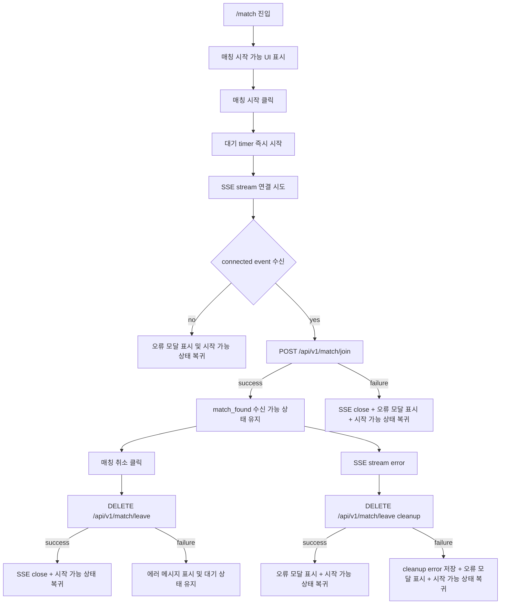
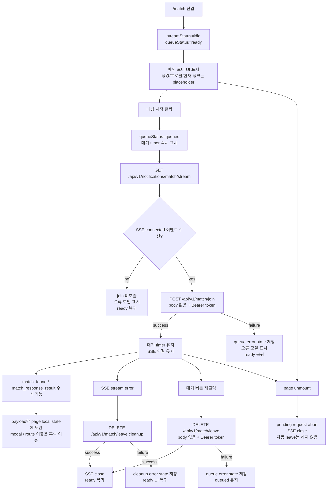

# Issue 78. Match Page Implementation

## Feature Description

Vue 프론트엔드의 `/match` 페이지를 실제 매칭 시작/취소 화면으로 구현한다.

현재 `/match` 페이지는 `GET /api/v1/notifications/match/stream` SSE client와 event payload 보관 골격을 가지고 있다. 이번 이슈에서는 `frontend/img/matchingPage.jpeg`를 화면 레퍼런스로 삼고, `frontend/img/background.png`를 실제 배경 이미지로 사용해 매칭 페이지 UI를 구현한다.

매칭 기능은 백엔드 `POST /api/v1/match/join`, `DELETE /api/v1/match/leave` 계약에 맞춰 매칭 대기열 진입/취소 요청을 보낸다. 단, `/match` 화면 진입 즉시 SSE를 열지 않고, 사용자가 매칭 시작을 클릭했을 때 먼저 SSE를 연결한 뒤 `connected` 이벤트를 받은 다음 `join` 요청을 보낸다.

이번 작업은 매칭 페이지 1차 구현 범위로 제한한다. `match_found` 수락/거절 모달, accept/reject command, `match_response_result.action` 기반 게임 대기방 이동, 랭킹/프로필 API 실연동, 전역 match store는 후속 이슈에서 진행한다.

이 이슈는 `docs/antigravity/frontend/front-plan.md`의 `4. [ ] 매칭 페이지 구현`을 구현 기준으로 삼는다. `5. [ ] 매칭 성사 모달 구현`, `6. [ ] 매칭 수락/거절 커맨드 구현`, `7. [ ] 매칭 응답 결과 화면 전환 구현`은 `front-plan.md`상 후속 단계이므로 이번 이슈에서는 제외한다.

## Backend Contract

| 항목 | 기준 |
|------|------|
| Match stream | `GET /api/v1/notifications/match/stream` |
| Match stream auth | `Authorization: Bearer {accessToken}` |
| Match stream timing | 매칭 시작 클릭 후, `POST /api/v1/match/join` 호출 전 |
| Match join | `POST /api/v1/match/join` |
| Match leave | `DELETE /api/v1/match/leave` |
| Join/Leave auth | `Authorization: Bearer {accessToken}` |
| Join/Leave body | 없음 |
| Join success | `200 OK` |
| Leave success | `200 OK` |
| Join failure | `400 BAD_REQUEST`, `409 CONFLICT`, `500` 계열 가능 |
| Leave failure | `400 BAD_REQUEST`, `500` 계열 가능 |

프론트 처리 기준:

- `POST /api/v1/match/join` 성공은 “매칭 대기열 진입 요청 성공”으로만 처리.
- `DELETE /api/v1/match/leave` 성공은 “매칭 대기열 취소 요청 성공”으로 처리.
- 매칭 성사 여부는 join HTTP 응답으로 판단하지 않음.
- 최종 매칭 결과와 게임 대기방 이동은 후속 `match_response_result` 이벤트 처리 이슈에서 구현.
- 백엔드는 join 시 진행 중 game room 여부와 rank/tierScore를 내부에서 조회하므로 프론트가 rank/tierScore를 request로 보내지 않음.
- 백엔드는 현재 SSE 연결이 있는 유저에게 `match_found`를 전송하므로, 프론트는 SSE `connected` 확인 전 `join` 요청을 보내지 않음.
- 백엔드는 SSE disconnect를 queue leave로 처리하지 않으므로, 프론트는 `joining` 또는 `queued` 중 stream error 발생 시 `DELETE /api/v1/match/leave` cleanup을 시도.
- 사용자가 매칭 시작을 누르면 UX 피드백을 위해 대기 timer는 즉시 시작하되, 백엔드 `join` 호출은 SSE `connected` 수신 이후에만 수행.
- `/match`가 메인 화면 역할을 하므로 화면 진입만으로 SSE를 열지 않고, 매칭 시작 의도가 생긴 뒤에만 SSE 연결을 생성.

## Asset 기준

| Asset | 용도 | 기준 |
|-------|------|------|
| `frontend/img/background.png` | 매칭 페이지 full-screen 배경 | `MatchPage.vue`에서 import asset으로 사용 |
| `frontend/img/matchingPage.jpeg` | 디자인 레퍼런스 | 직접 화면에 통째로 올리지 않고 레이아웃/색상/간격 기준으로 사용 |

구현 기준:

- 배경은 viewport 전체를 채우도록 구현.
- `matchingPage.jpeg` 기준 상단 app bar, 좌측 ranking panel, 우측 하단 rank/CTA 영역 구현.
- 실제 조작 가능한 primary action은 매칭 시작/매칭 취소만 구현.
- 랭킹/프로필/현재 랭크 값은 아직 백엔드 API 계약이 없으므로 정적 placeholder로 표시.
- `연습 모드`, `사용자 지정`, 상단 icon button은 표시만 구현하고 실제 기능 연결은 보류.
- 모바일에서는 주요 CTA가 먼저 보이도록 세로 배치 기준으로 반응형 구현.

이미지 사용 정책:

- `background.png`는 `src/pages/MatchPage.vue`에서 `../../img/background.png` 상대 경로 import로 사용.
- `matchingPage.jpeg`는 구현 산출물에 import하지 않고, 작업자가 레이아웃을 비교하는 기준 이미지로만 사용.
- 이미지 파일을 이번 이슈에서 이동하지 않음.

## Scope Boundary

이번 이슈에 포함한다.

- `/match` page placeholder UI 제거 구현.
- `background.png` full-screen 배경 적용 구현.
- `matchingPage.jpeg` 레퍼런스 기준 매칭 페이지 레이아웃 구현.
- 상단 app bar 구현.
- 좌측 ranking/profile placeholder panel 구현.
- 우측 하단 current rank/CTA panel 구현.
- 매칭 시작 클릭 시 on-demand SSE 연결 lifecycle 구현.
- SSE `connected` 수신 전 `join` 요청 차단 구현.
- `POST /api/v1/match/join` 버튼 연결 구현.
- `DELETE /api/v1/match/leave` 버튼 연결 구현.
- join/leave pending 중 중복 요청 방지 구현.
- 매칭 시작 클릭 즉시 optimistic waiting timer 표시 구현.
- join 성공 전 취소 시 local reset 및 SSE close 구현.
- join 성공 후 waiting 상태 유지 구현.
- joining/queued 중 SSE error 발생 시 leave cleanup 구현.
- leave 성공 후 “매칭 시작 가능” 상태 복귀 및 SSE close 구현.
- join/leave 실패 시 오류 메시지 표시 구현.
- page unmount 시 pending join/leave request abort 구현.
- Match page 테스트 보강.
- lint / format / typecheck / test / build 검증.

이번 이슈에서 제외한다.

- 랭킹 API 실연동.
- 프로필 API 실연동.
- 현재 랭크 API 실연동.
- match queue 상태 조회 API 구현.
- `match_found` 수락/거절 모달 구현.
- accept/reject command 구현.
- `match_response_result.action` 기준 route 이동 구현.
- game waiting route 이동 구현.
- 매칭 페이지 이탈 시 자동 leave 구현.
- Pinia 또는 전역 match store 도입.
- SSE 자동 재연결 고도화.
- token refresh/retry 구현.

## Tasks

### 1. 백엔드 매칭 계약 반영

- [x] `POST /api/v1/match/join` 계약 확인 구현.
- [x] `DELETE /api/v1/match/leave` 계약 확인 구현.
- [x] join/leave request body가 없다는 기준 반영 구현.
- [x] join/leave가 Authorization Bearer header 기반 API라는 기준 반영 구현.
- [x] 백엔드가 rank/tierScore를 내부 조회하므로 프론트 request에 rank 값을 넣지 않도록 구현.
- [x] SSE `connected` 전 `join` 요청 차단 정책 반영 구현.
- [x] `/match` 화면 진입 즉시 SSE를 열지 않는 on-demand 연결 정책 반영 구현.

### 2. Match page 상태 모델 구현

- [x] `streamStatus`와 `queueStatus`를 분리 구현.
- [x] `streamStatus`는 `idle`, `connecting`, `connected`, `error` 기준으로 처리 구현.
- [x] `queueStatus`는 `ready`, `joining`, `queued`, `leaving` 기준으로 처리 구현.
- [x] join/leave error message 상태 구현.
- [x] 기존 `match_found`, `match_response_result` payload 보관 상태 유지 구현.
- [x] page unmount 이후 late callback 무시 정책 유지 구현.

### 3. Match page UI 구현

- [x] `MatchPage.vue` placeholder 제거 구현.
- [x] `background.png` full-screen 배경 적용 구현.
- [x] 상단 app bar 구현.
- [x] 좌측 user profile placeholder 구현.
- [x] 좌측 ranking summary placeholder 구현.
- [x] 좌측 ranking list placeholder 구현.
- [x] 우측 하단 current rank placeholder 구현.
- [x] 매칭 시작/취소 primary CTA 구현.
- [x] `연습 모드`, `사용자 지정` secondary button 표시 구현.
- [x] SSE 연결 상태와 매칭 대기 상태를 page state/data attribute로 구분 구현.

### 4. Match interaction 구현

- [x] `/match` mount 시 SSE를 자동 연결하지 않도록 구현.
- [x] 매칭 시작 클릭 시 SSE stream 연결 구현.
- [x] SSE `connected` 수신 전 `joinMatchQueue` 호출 차단 구현.
- [x] stream 연결 중 매칭 시작 중복 클릭 방지 구현.
- [x] SSE 연결 실패 시 `joinMatchQueue`를 호출하지 않고 message 표시 구현.
- [x] SSE `connected` 수신 후 `joinMatchQueue` 호출 구현.
- [x] 매칭 시작 클릭 즉시 대기 timer 시작 구현.
- [x] join 시작 전 취소 시 `leaveMatchQueue` 미호출 및 local reset 구현.
- [x] join 요청 중 중복 클릭 방지 구현.
- [x] join 성공 시 `queued` 상태 전환 구현.
- [x] join 실패 시 SSE close 후 `ApiClientError.message` 또는 fallback message 표시 구현.
- [x] queued 상태에서 CTA를 매칭 취소로 전환 구현.
- [x] 매칭 취소 클릭 시 `leaveMatchQueue` 호출 구현.
- [x] leave 요청 중 중복 클릭 방지 구현.
- [x] leave 성공 시 `ready` 상태 전환 및 SSE close 구현.
- [x] leave 실패 시 `queued` 상태 유지 및 message 표시 구현.
- [x] joining/queued 중 stream error 발생 시 `leaveMatchQueue` cleanup 호출 구현.
- [x] stream error cleanup 성공 시 `ready` 상태 복귀 구현.
- [x] stream error cleanup 실패 시 cleanup error state 저장 구현.
- [x] page unmount 시 pending stream/join/leave 요청 abort 및 SSE close 구현.

### 5. Styling 구현

- [x] page scoped style 중심으로 구현.
- [x] 기존 `styles/variables.css` 토큰을 가능한 범위에서 재사용.
- [x] desktop 기준 `matchingPage.jpeg`의 좌측 panel + 우측 하단 CTA 구조 구현.
- [x] mobile 기준 주요 CTA와 상태가 화면 밖으로 밀리지 않도록 구현.
- [x] full viewport 배경에서 불필요한 body scroll이 생기지 않도록 구현.
- [x] 버튼과 상태 text가 container 밖으로 넘치지 않도록 검증.
- [x] 배경 이미지 위 텍스트 가독성을 위해 overlay 또는 panel contrast 구현.

### 6. Test 구현

- [x] 매칭 페이지 렌더링 테스트 추가 또는 기존 테스트 보강.
- [x] mount 시 SSE가 자동 연결되지 않는지 검증.
- [x] 매칭 시작 클릭 시 SSE 연결이 시작되는지 검증.
- [x] SSE `connected` 전 `joinMatchQueue`를 호출하지 않는지 검증.
- [x] SSE 연결 실패 시 message 표시 및 join 미호출 검증.
- [x] SSE `connected` 후 `joinMatchQueue` 호출 검증.
- [x] 매칭 시작 클릭 즉시 대기 timer 표시 검증.
- [x] join 시작 전 취소 시 local reset 및 leave 미호출 검증.
- [x] join 성공 시 `queued` 상태와 취소 CTA 표시 검증.
- [x] join 실패 시 message 표시 및 현재 상태 유지 검증.
- [x] 매칭 취소 클릭 시 `leaveMatchQueue` 호출 검증.
- [x] leave 성공 시 `ready` 상태 복귀 및 SSE close 검증.
- [x] leave 실패 시 `queued` 상태 유지 검증.
- [x] joining 중 stream error 발생 시 leave cleanup 호출 검증.
- [x] queued 중 stream error 발생 시 leave cleanup 후 `ready` 복귀 검증.
- [x] stream error cleanup 실패 시 error state 저장 검증.
- [x] unmount 시 pending stream/request abort 및 SSE close 검증.

### 7. 문서 정합성 구현

- [x] `front-plan.md`의 4번 단계와 issue-78 범위 정합성 확인 구현.
- [x] issue-76에서 구현한 SSE 연결 골격과 issue-78의 UI/interaction 범위 연결 확인 구현.
- [x] issue-78에서 `match_found` 모달, accept/reject, result routing을 제외한다는 정책 확인 구현.
- [x] 이번 이슈 PR 메시지 섹션 작성.

### 8. 검증

- [x] `npm run lint` 검증.
- [x] `npm run format` 검증.
- [x] `npm run typecheck` 검증.
- [x] `npm run test` 검증.
- [x] `npm run build` 검증.
- [x] desktop viewport에서 배경, 좌측 panel, CTA 영역 겹침 여부 확인.
- [x] mobile viewport에서 CTA와 상태 text가 화면 밖으로 밀리지 않는지 확인.

## Implementation Policy

- 매칭 페이지는 이번 이슈에서 실제 구현하되, 매칭 전체 플로우를 완성하지 않음.
- `MatchPage.vue`는 page local state로 stream 상태와 queue 상태를 조립한다.
- `matchService.ts`는 기존 `joinMatchQueue`, `leaveMatchQueue`를 재사용한다.
- page component는 join/leave API 호출을 조립하되, backend rank/tierScore 정책을 알지 않는다.
- `/match` mount 시점에는 SSE를 자동 연결하지 않는다.
- `/match` mount 시점의 `streamStatus`는 `idle`이다.
- 매칭 시작 버튼 클릭 시 SSE stream을 먼저 연결한다.
- SSE `connected` 이벤트 수신 이후에만 `joinMatchQueue`를 호출한다.
- SSE 연결 실패 상태에서는 join 요청을 보내지 않는다.
- `joining` 또는 `queued` 상태에서 SSE 연결이 끊기면 백엔드 queue가 자동 제거되지 않으므로 `leaveMatchQueue` cleanup을 시도한다.
- HTTP join 성공은 queue 진입 성공으로만 처리하고 match found로 간주하지 않는다.
- HTTP leave 성공은 queue 이탈 성공으로 처리하고 매칭 SSE를 닫는다.
- HTTP join 실패 시 열린 매칭 SSE를 닫고 start 버튼 상태로 복귀한다.
- `match_found` 수신 시 payload 보관은 유지하되, 이번 이슈에서 모달을 띄우지 않는다.
- `match_response_result` 수신 시 payload 보관은 유지하되, 이번 이슈에서 route 이동하지 않는다.
- 페이지 이탈 시 SSE close는 유지한다.
- 페이지 이탈 시 자동 leave는 구현하지 않는다.
- pending join/leave request는 AbortController로 취소 가능하게 구성한다.
- 랭킹/프로필/현재 랭크는 정적 placeholder로 두고 API 실연동은 후속 이슈에서 결정한다.
- `matchingPage.jpeg`는 레퍼런스로만 사용하고 화면에 직접 렌더링하지 않는다.

## Acceptance Criteria

- `/match` 진입 시 `background.png` 기반 full-screen 매칭 페이지 표시.
- desktop에서 레퍼런스처럼 좌측 panel과 우측 하단 CTA 영역 표시.
- mobile에서 주요 CTA와 상태 text가 화면 밖으로 밀리지 않음.
- `/match` 진입만으로 SSE stream이 자동 연결되지 않음.
- `/match` 진입 직후 `streamStatus=idle` 상태임.
- 매칭 시작 클릭 시 SSE stream 연결이 먼저 시도됨.
- SSE `connected` 수신 전에는 `/api/v1/match/join`이 호출되지 않음.
- SSE `connected` 수신 후 `/api/v1/match/join` 호출.
- join 성공 시 “매칭 대기 중” 상태와 취소 CTA 표시.
- join 실패 시 열린 SSE를 닫고 사용자에게 에러 메시지 표시.
- 매칭 취소 클릭 시 `/api/v1/match/leave` 호출.
- leave 성공 시 매칭 SSE를 닫고 매칭 시작 가능 상태로 복귀.
- leave 실패 시 대기 상태를 유지하고 에러 메시지 표시.
- 이번 이슈에서 match found modal, accept/reject, game route 이동이 구현되지 않음.
- lint / format / typecheck / test / build 통과.

## PR Message

## 📌 Summary

Issue 78은 `/match`를 메인 매칭 로비 화면으로 세우되, 매칭 전체 플로우를 한 번에 완성하지 않고 백엔드 매칭 계약에 맞는 1차 interaction 경계까지만 구현함.

핵심 정책은 다음과 같음.

- `/match` 진입만으로 모든 사용자가 SSE를 계속 점유하지 않도록, stream은 매칭 시작 클릭 이후에만 on-demand 연결함.
- 사용자가 매칭 시작을 누르면 UX 피드백을 위해 대기 timer는 즉시 시작함. 단, 이 timer는 백엔드 queue 진입 확정이 아니라 사용자 매칭 시도 경과 시간으로 취급함.
- 백엔드는 SSE 연결이 살아 있는 유저에게 `match_found`를 전송하므로, queue join은 반드시 SSE `connected` 이벤트 이후에만 호출함.
- HTTP join 성공은 match 확정이 아니라 queue 진입 command ack로 해석함. 화면은 `queued`로만 전환하고, 매칭 성사 판단은 SSE `match_found`/`match_response_result` 계열 이벤트에 위임함.
- HTTP leave 성공은 queue 이탈 command ack로 해석함. leave 성공 시 더 이상 match event를 받을 필요가 없으므로 SSE close 후 ready 상태로 복귀함.
- SSE disconnect는 백엔드 queue leave가 아니므로, `joining` 또는 `queued` 중 stream error 발생 시 프론트가 `DELETE /api/v1/match/leave` cleanup을 시도함.
- join 전 stream error는 queue 미진입 상태로 해석함. 이 경우 join/leave를 보내지 않고 오류 모달 표시 후 ready 상태로 복귀함.
- `match_found` modal, accept/reject command, `match_response_result.action` 기반 route 이동은 이번 이슈에서 제외함. 이번 이슈는 payload 보관까지만 담당함.
- 랭킹/프로필/현재 랭크 API 계약은 아직 확정되지 않았으므로 정적 placeholder로 렌더링함. 프론트가 rank/tierScore를 계산하거나 매칭 request에 포함하지 않음.

백엔드와의 구현 계약은 다음과 같음.

- `GET /api/v1/notifications/match/stream`: 매칭 시작 클릭 이후 연결함. `connected` 이벤트가 도착해야 프론트가 join을 보낼 수 있음.
- `POST /api/v1/match/join`: request body 없이 Authorization Bearer header 기반으로 호출함. 백엔드가 진행 중 game room 여부, rank, tierScore를 내부에서 조회함.
- `DELETE /api/v1/match/leave`: request body 없이 Authorization Bearer header 기반으로 호출함. 성공하면 프론트는 queue 이탈로 보고 SSE close 처리함.
- SSE connection registry는 연결 completion/timeout/error 시 SSE 연결만 제거함. queue 제거는 `DELETE /api/v1/match/leave` 계약으로만 수행함.
- `match_found`: 이번 이슈에서는 수락/거절 UI를 띄우지 않고 payload만 저장함.
- `match_response_result`: 이번 이슈에서는 game waiting route로 이동하지 않고 payload만 저장함.

## 📚 Changes

- `/match`를 인증 이후 첫 화면이자 매칭 로비로 설계함. 화면 진입과 매칭 참여를 분리한 이유는 메인 화면을 보는 모든 사용자가 곧바로 SSE 연결을 점유하지 않게 하면서도, 실제 매칭을 시작한 사용자는 `match_found`를 받을 준비가 된 뒤 queue에 들어가게 하기 위함.
- UI feedback과 backend command 순서를 분리함. 버튼 클릭 즉시 `queued` UI와 대기 timer를 표시해 사용자의 클릭 피드백을 보장하되, 실제 백엔드 `join`은 “stream 연결 → `connected` 확인 → join” 순서로만 수행함.
- SSE lifecycle은 “시작 클릭 → timer 즉시 시작 → stream 연결 → `connected` 확인 → join” 순서로 고정함. `match_found`는 이미 연결된 stream으로 전달되는 이벤트이기 때문에, join을 stream 연결보다 먼저 보내면 백엔드가 매칭을 성사시켜도 프론트가 이벤트를 놓칠 수 있음. 이 순서를 테스트로 고정해 회귀 방지함.
- join/leave는 REST 응답을 화면 전환의 최종 근거로 사용하지 않고 command ack로만 해석함. join 성공은 queue 진입 성공일 뿐 match 확정이 아니므로 이미 표시 중인 `queued` timer를 유지함. leave 성공은 queue 이탈 성공이므로 더 이상 match event를 기다리지 않고 SSE close 처리함.
- stream error 처리는 join 전과 join 이후를 분리함. `connected` 전 stream error는 join 미호출 상태이므로 오류 모달 표시 후 ready 복귀함. `queued` 중 stream error가 발생했고 join 요청이 백엔드에 도달했을 수 있으면 pending join abort 후 `leaveMatchQueue` cleanup을 시도함.
- stream error cleanup 성공 시 ready로 복귀함. cleanup 실패 시 active SSE가 없어 더 이상 `match_found`를 받을 수 없으므로 ready UI로 복귀하되, `data-*` error state에 cleanup 실패를 남김. 실제 queue 상태 재조회/복구는 후속 이슈에서 별도 API 계약이 필요함.
- `match_found`와 `match_response_result`는 page local state에 저장만 함. 이번 이슈에서 모달, accept/reject, route 이동까지 붙이면 HTTP command ack와 SSE final result의 책임 경계가 섞이므로, 후속 이슈에서 수락/거절 UI와 최종 이동 정책을 별도로 구현할 수 있게 경계 유지함.
- 상태 모델은 전역 store 대신 `MatchPage.vue` 내부 local state로 구성함. 현재 범위는 단일 page interaction이고 다른 화면과 공유해야 하는 match state가 아직 없으므로, Pinia를 먼저 도입하지 않아 상태 소유권과 테스트 범위를 좁힘. 전역 match store는 accept/reject와 route 이동이 들어오는 후속 단계에서 판단함.
- queue error와 stream error는 사용자가 요구한 대로 visible status UI로 노출하지 않고 `data-*` 상태로 남김. 매칭 버튼 주변의 핵심 CTA를 단순하게 유지하면서도 테스트와 디버깅에서 상태를 확인할 수 있게 하기 위한 절충.
- pending join/leave는 `AbortController`로 취소 가능하게 구성하고, page unmount 시 stream close와 pending request abort를 수행함. 다만 page 이탈 자동 leave는 서버 queue 정책과 UX 영향이 별도로 결정되어야 하므로 이번 이슈에서 구현하지 않음.
- 랭킹/프로필/현재 랭크는 placeholder로 유지함. 백엔드 join 계약이 rank/tierScore를 request에서 받지 않고 서버 내부에서 조회하는 구조이므로, 프론트는 매칭 요청에 랭크 정보를 싣거나 계산하지 않음. 실제 랭킹 API 계약이 확정되기 전까지는 UI 구조만 준비함.
- `/match` UI는 `matchingPage.jpeg`를 직접 렌더링하지 않고 디자인 레퍼런스로만 사용함. 실제 화면은 `background.png` asset과 scoped CSS로 구성해 버튼 상태, locale 전환, responsive layout, 테스트 가능한 DOM 구조 유지함.
- 데스크톱은 좌측 랭킹 panel과 우측 하단 CTA를 분리하고, 모바일은 CTA와 상태가 화면 밖으로 밀리지 않도록 1열 layout으로 전환함. 매칭 화면은 메인 화면이므로 hero/landing page가 아니라 즉시 조작 가능한 lobby 화면으로 구성함.
- 테스트는 단순 렌더링 확인이 아니라 계약 순서를 검증함. mount 시 SSE 미연결, 클릭 즉시 timer 표시, `connected` 전 join 미호출, `connected` 후 join 호출, join 시작 전 cancel local reset, join/leave 성공·실패 상태 전환, stream error cleanup, unmount close, late callback 무시를 검증해 백엔드 계약과 프론트 상태 모델이 어긋나지 않게 함.

## 📝 Note

- 이번 이슈는 매칭 페이지 1차 구현 범위.
- match found 수락/거절 모달은 후속 이슈에서 진행.
- accept/reject command는 후속 이슈에서 진행.
- `match_response_result.action` 기반 게임 대기방 이동은 후속 이슈에서 진행.
- 랭킹/프로필/현재 랭크 실연동은 백엔드 API 계약 확정 후 후속 이슈에서 진행.
- 페이지 이탈 시 자동 leave는 이번 이슈에서 구현하지 않음.
- Pinia 또는 전역 match store는 도입하지 않음.
- `npm run lint`, `npm run format`, `npm run typecheck`, `npm run test`, `npm run build` 검증.

## 📌 Related Issue

- Closes #78
