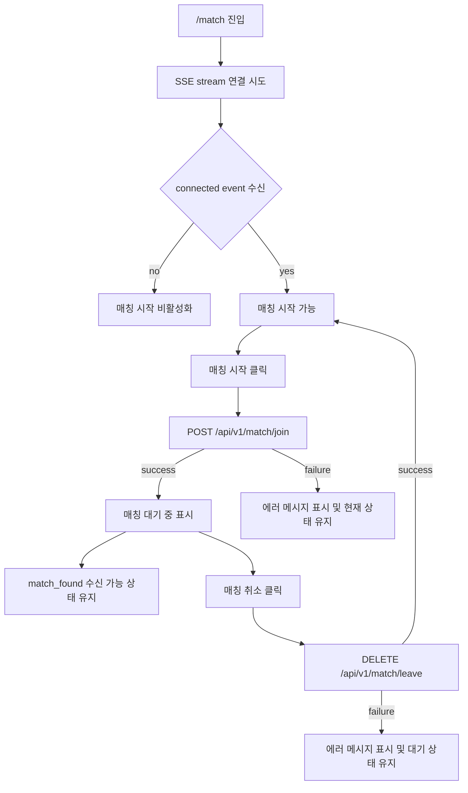
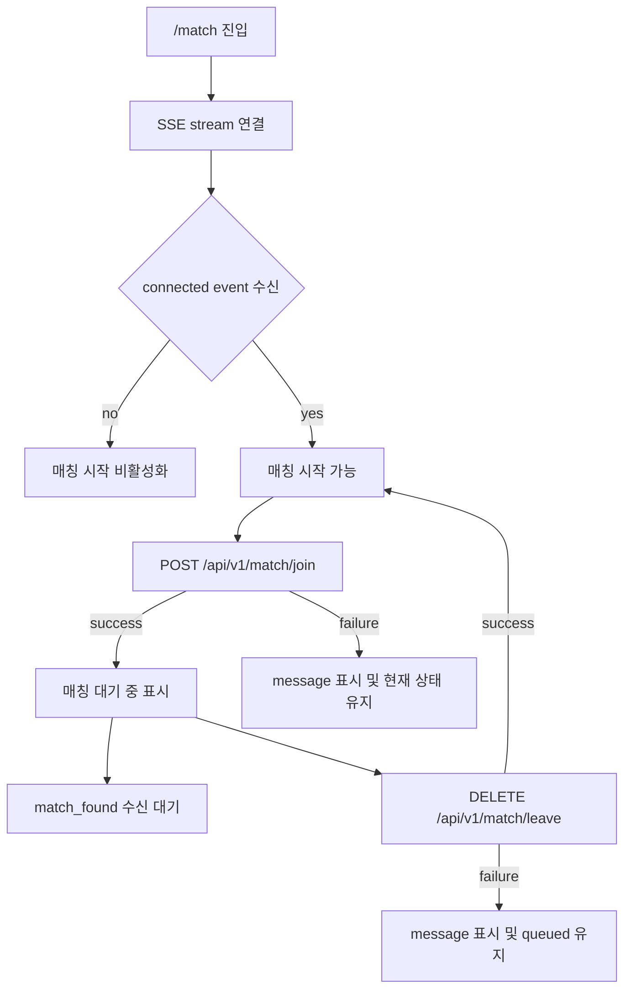

# Issue 78. Match Page Implementation

## Feature Description

Vue 프론트엔드의 `/match` 페이지를 실제 매칭 시작/취소 화면으로 구현한다.

현재 `/match` 페이지는 `GET /api/v1/notifications/match/stream` SSE 연결과 event payload 보관 골격만 가지고 있다. 이번 이슈에서는 `frontend/img/matchingPage.jpeg`를 화면 레퍼런스로 삼고, `frontend/img/background.png`를 실제 배경 이미지로 사용해 매칭 페이지 UI를 구현한다.

매칭 기능은 백엔드 `POST /api/v1/match/join`, `DELETE /api/v1/match/leave` 계약에 맞춰 매칭 대기열 진입/취소 요청을 보내고, 기존 SSE 연결 상태를 기준으로 매칭 시작 가능 여부를 제어하는 흐름까지 구현한다.

이번 작업은 매칭 페이지 1차 구현 범위로 제한한다. `match_found` 수락/거절 모달, accept/reject command, `match_response_result.action` 기반 게임 대기방 이동, 랭킹/프로필 API 실연동, 전역 match store는 후속 이슈에서 진행한다.

이 이슈는 `docs/antigravity/frontend/front-plan.md`의 `4. [ ] 매칭 페이지 구현`을 구현 기준으로 삼는다. `5. [ ] 매칭 성사 모달 구현`, `6. [ ] 매칭 수락/거절 커맨드 구현`, `7. [ ] 매칭 응답 결과 화면 전환 구현`은 `front-plan.md`상 후속 단계이므로 이번 이슈에서는 제외한다.

## Backend Contract

| 항목 | 기준 |
|------|------|
| Match stream | `GET /api/v1/notifications/match/stream` |
| Match stream auth | `Authorization: Bearer {accessToken}` |
| Match join | `POST /api/v1/match/join` |
| Match leave | `DELETE /api/v1/match/leave` |
| Join/Leave auth | `Authorization: Bearer {accessToken}` |
| Join/Leave body | 없음 |
| Join success | `200 OK` |
| Leave success | `200 OK` |
| Join failure | `400 BAD_REQUEST`, `409 CONFLICT`, `500` 계열 가능 |
| Leave failure | `400 BAD_REQUEST`, `500` 계열 가능 |

프론트 처리 기준:

- `POST /api/v1/match/join` 성공은 “매칭 대기열 진입 요청 성공”으로만 처리.
- `DELETE /api/v1/match/leave` 성공은 “매칭 대기열 취소 요청 성공”으로 처리.
- 매칭 성사 여부는 join HTTP 응답으로 판단하지 않음.
- 최종 매칭 결과와 게임 대기방 이동은 후속 `match_response_result` 이벤트 처리 이슈에서 구현.
- 백엔드는 join 시 진행 중 game room 여부와 rank/tierScore를 내부에서 조회하므로 프론트가 rank/tierScore를 request로 보내지 않음.
- 백엔드는 현재 SSE 연결이 있는 유저에게 `match_found`를 전송하므로, 프론트는 SSE `connected` 확인 전 매칭 시작을 비활성화.

## Asset 기준

| Asset | 용도 | 기준 |
|-------|------|------|
| `frontend/img/background.png` | 매칭 페이지 full-screen 배경 | `MatchPage.vue`에서 import asset으로 사용 |
| `frontend/img/matchingPage.jpeg` | 디자인 레퍼런스 | 직접 화면에 통째로 올리지 않고 레이아웃/색상/간격 기준으로 사용 |

구현 기준:

- 배경은 viewport 전체를 채우도록 구현.
- `matchingPage.jpeg` 기준 상단 app bar, 좌측 ranking panel, 우측 하단 rank/CTA 영역 구현.
- 실제 조작 가능한 primary action은 매칭 시작/매칭 취소만 구현.
- 랭킹/프로필/현재 랭크 값은 아직 백엔드 API 계약이 없으므로 정적 placeholder로 표시.
- `연습 모드`, `사용자 지정`, 상단 icon button은 표시만 구현하고 실제 기능 연결은 보류.
- 모바일에서는 주요 CTA가 먼저 보이도록 세로 배치 기준으로 반응형 구현.

이미지 사용 정책:

- `background.png`는 `src/pages/MatchPage.vue`에서 `../../img/background.png` 상대 경로 import로 사용.
- `matchingPage.jpeg`는 구현 산출물에 import하지 않고, 작업자가 레이아웃을 비교하는 기준 이미지로만 사용.
- 이미지 파일을 이번 이슈에서 이동하지 않음.

## Scope Boundary

이번 이슈에 포함한다.

- `/match` page placeholder UI 제거 구현.
- `background.png` full-screen 배경 적용 구현.
- `matchingPage.jpeg` 레퍼런스 기준 매칭 페이지 레이아웃 구현.
- 상단 app bar 구현.
- 좌측 ranking/profile placeholder panel 구현.
- 우측 하단 current rank/CTA panel 구현.
- 기존 SSE 연결 lifecycle 유지 구현.
- SSE `connected` 수신 전 매칭 시작 비활성화 구현.
- `POST /api/v1/match/join` 버튼 연결 구현.
- `DELETE /api/v1/match/leave` 버튼 연결 구현.
- join/leave pending 중 중복 요청 방지 구현.
- join 성공 후 “매칭 대기 중” 상태 표시 구현.
- leave 성공 후 “매칭 시작 가능” 상태 복귀 구현.
- join/leave 실패 시 오류 메시지 표시 구현.
- page unmount 시 pending join/leave request abort 구현.
- Match page 테스트 보강.
- lint / format / typecheck / test / build 검증.

이번 이슈에서 제외한다.

- 랭킹 API 실연동.
- 프로필 API 실연동.
- 현재 랭크 API 실연동.
- match queue 상태 조회 API 구현.
- `match_found` 수락/거절 모달 구현.
- accept/reject command 구현.
- `match_response_result.action` 기준 route 이동 구현.
- game waiting route 이동 구현.
- 매칭 페이지 이탈 시 자동 leave 구현.
- Pinia 또는 전역 match store 도입.
- SSE 자동 재연결 고도화.
- token refresh/retry 구현.

## Tasks

### 1. 백엔드 매칭 계약 반영

- [ ] `POST /api/v1/match/join` 계약 확인 구현.
- [ ] `DELETE /api/v1/match/leave` 계약 확인 구현.
- [ ] join/leave request body가 없다는 기준 반영 구현.
- [ ] join/leave가 Authorization Bearer header 기반 API라는 기준 반영 구현.
- [ ] 백엔드가 rank/tierScore를 내부 조회하므로 프론트 request에 rank 값을 넣지 않도록 구현.
- [ ] SSE `connected` 전 매칭 시작 비활성화 정책 반영 구현.

### 2. Match page 상태 모델 구현

- [ ] `streamStatus`와 `queueStatus`를 분리 구현.
- [ ] `streamStatus`는 `connecting`, `connected`, `error` 기준으로 처리 구현.
- [ ] `queueStatus`는 `ready`, `joining`, `queued`, `leaving` 기준으로 처리 구현.
- [ ] join/leave error message 상태 구현.
- [ ] 기존 `match_found`, `match_response_result` payload 보관 상태 유지 구현.
- [ ] page unmount 이후 late callback 무시 정책 유지 구현.

### 3. Match page UI 구현

- [ ] `MatchPage.vue` placeholder 제거 구현.
- [ ] `background.png` full-screen 배경 적용 구현.
- [ ] 상단 app bar 구현.
- [ ] 좌측 user profile placeholder 구현.
- [ ] 좌측 ranking summary placeholder 구현.
- [ ] 좌측 ranking list placeholder 구현.
- [ ] 우측 하단 current rank placeholder 구현.
- [ ] 매칭 시작/취소 primary CTA 구현.
- [ ] `연습 모드`, `사용자 지정` secondary button 표시 구현.
- [ ] SSE 연결 상태와 매칭 대기 상태가 화면에서 구분되도록 구현.

### 4. Match interaction 구현

- [ ] SSE `connected` 수신 전 매칭 시작 버튼 disabled 처리 구현.
- [ ] 매칭 시작 클릭 시 `joinMatchQueue` 호출 구현.
- [ ] join 요청 중 중복 클릭 방지 구현.
- [ ] join 성공 시 `queued` 상태 전환 구현.
- [ ] join 실패 시 `ApiClientError.message` 또는 fallback message 표시 구현.
- [ ] queued 상태에서 CTA를 매칭 취소로 전환 구현.
- [ ] 매칭 취소 클릭 시 `leaveMatchQueue` 호출 구현.
- [ ] leave 요청 중 중복 클릭 방지 구현.
- [ ] leave 성공 시 `ready` 상태 전환 구현.
- [ ] leave 실패 시 `queued` 상태 유지 및 message 표시 구현.
- [ ] page unmount 시 pending join/leave 요청 abort 구현.

### 5. Styling 구현

- [ ] page scoped style 중심으로 구현.
- [ ] 기존 `styles/variables.css` 토큰을 가능한 범위에서 재사용.
- [ ] desktop 기준 `matchingPage.jpeg`의 좌측 panel + 우측 하단 CTA 구조 구현.
- [ ] mobile 기준 주요 CTA와 상태가 화면 밖으로 밀리지 않도록 구현.
- [ ] full viewport 배경에서 불필요한 body scroll이 생기지 않도록 구현.
- [ ] 버튼과 상태 text가 container 밖으로 넘치지 않도록 검증.
- [ ] 배경 이미지 위 텍스트 가독성을 위해 overlay 또는 panel contrast 구현.

### 6. Test 구현

- [ ] 매칭 페이지 렌더링 테스트 추가 또는 기존 테스트 보강.
- [ ] SSE mount 시 연결되는지 검증 유지.
- [ ] SSE unmount 시 close되는지 검증 유지.
- [ ] SSE `connected` 전 매칭 시작 버튼 disabled 검증.
- [ ] SSE `connected` 후 매칭 시작 버튼 enabled 검증.
- [ ] 매칭 시작 클릭 시 `joinMatchQueue` 호출 검증.
- [ ] join 성공 시 `queued` 상태와 취소 CTA 표시 검증.
- [ ] join 실패 시 message 표시 및 현재 상태 유지 검증.
- [ ] 매칭 취소 클릭 시 `leaveMatchQueue` 호출 검증.
- [ ] leave 성공 시 `ready` 상태 복귀 검증.
- [ ] leave 실패 시 `queued` 상태 유지 검증.
- [ ] unmount 시 pending request abort 검증.

### 7. 문서 정합성 구현

- [ ] `front-plan.md`의 4번 단계와 issue-78 범위 정합성 확인 구현.
- [ ] issue-76에서 구현한 SSE 연결 골격과 issue-78의 UI/interaction 범위 연결 확인 구현.
- [ ] issue-78에서 `match_found` 모달, accept/reject, result routing을 제외한다는 정책 확인 구현.
- [ ] 이번 이슈 PR 메시지 섹션 작성.

### 8. 검증

- [ ] `npm run lint` 검증.
- [ ] `npm run format` 검증.
- [ ] `npm run typecheck` 검증.
- [ ] `npm run test` 검증.
- [ ] `npm run build` 검증.
- [ ] desktop viewport에서 배경, 좌측 panel, CTA 영역 겹침 여부 확인.
- [ ] mobile viewport에서 CTA와 상태 text가 화면 밖으로 밀리지 않는지 확인.

## Implementation Policy

- 매칭 페이지는 이번 이슈에서 실제 구현하되, 매칭 전체 플로우를 완성하지 않음.
- `MatchPage.vue`는 page local state로 stream 상태와 queue 상태를 조립한다.
- `matchService.ts`는 기존 `joinMatchQueue`, `leaveMatchQueue`를 재사용한다.
- page component는 join/leave API 호출을 조립하되, backend rank/tierScore 정책을 알지 않는다.
- 매칭 시작 버튼은 SSE `connected` 이벤트 수신 이후에만 활성화한다.
- SSE 연결 실패 상태에서는 join 요청을 보내지 않는다.
- HTTP join 성공은 queue 진입 성공으로만 처리하고 match found로 간주하지 않는다.
- HTTP leave 성공은 queue 이탈 성공으로 처리한다.
- `match_found` 수신 시 payload 보관은 유지하되, 이번 이슈에서 모달을 띄우지 않는다.
- `match_response_result` 수신 시 payload 보관은 유지하되, 이번 이슈에서 route 이동하지 않는다.
- 페이지 이탈 시 SSE close는 유지한다.
- 페이지 이탈 시 자동 leave는 구현하지 않는다.
- pending join/leave request는 AbortController로 취소 가능하게 구성한다.
- 랭킹/프로필/현재 랭크는 정적 placeholder로 두고 API 실연동은 후속 이슈에서 결정한다.
- `matchingPage.jpeg`는 레퍼런스로만 사용하고 화면에 직접 렌더링하지 않는다.

## Acceptance Criteria

- `/match` 진입 시 `background.png` 기반 full-screen 매칭 페이지 표시.
- desktop에서 레퍼런스처럼 좌측 panel과 우측 하단 CTA 영역 표시.
- mobile에서 주요 CTA와 상태 text가 화면 밖으로 밀리지 않음.
- SSE `connected` 전에는 매칭 시작 버튼이 비활성화됨.
- SSE `connected` 후 매칭 시작 버튼이 활성화됨.
- 매칭 시작 클릭 시 `/api/v1/match/join` 호출.
- join 성공 시 “매칭 대기 중” 상태와 취소 CTA 표시.
- join 실패 시 사용자에게 에러 메시지 표시.
- 매칭 취소 클릭 시 `/api/v1/match/leave` 호출.
- leave 성공 시 매칭 시작 가능 상태로 복귀.
- leave 실패 시 대기 상태를 유지하고 에러 메시지 표시.
- 이번 이슈에서 match found modal, accept/reject, game route 이동이 구현되지 않음.
- lint / format / typecheck / test / build 통과.

## PR Message

## 📌 Summary

## 📚 Changes

- `front-plan.md`의 `4. 매칭 페이지 구현` 단계 기준으로 `/match` 페이지 UI와 매칭 시작/취소 interaction 구현.
- 백엔드 `GET /api/v1/notifications/match/stream` 연결이 있어야 `match_found` 이벤트를 받을 수 있으므로, SSE `connected` 수신 전에는 `POST /api/v1/match/join` 요청을 막는 정책 구현.
- 백엔드 `POST /api/v1/match/join` 계약이 body 없이 Authorization Bearer header만 요구하므로, 기존 `matchService.joinMatchQueue`를 사용해 queue 진입 command만 전송하도록 구현.
- 백엔드 `DELETE /api/v1/match/leave` 계약이 body 없이 Authorization Bearer header만 요구하므로, 기존 `matchService.leaveMatchQueue`를 사용해 queue 이탈 command만 전송하도록 구현.
- 백엔드는 join 시 진행 중 game room 여부와 rank/tierScore를 내부에서 조회하므로, 프론트는 rank/tierScore를 계산하거나 request에 포함하지 않도록 구현.
- HTTP join 성공은 매칭 성사 확정이 아니라 queue 진입 성공이므로, 화면은 “매칭 대기 중” 상태로만 전환하도록 구현.
- HTTP leave 성공은 queue 이탈 성공으로 처리하고, 화면은 “매칭 시작 가능” 상태로 복귀하도록 구현.
- `match_found`와 `match_response_result` payload 보관은 기존 SSE 골격을 유지하되, 모달 표시와 route 이동은 후속 이슈로 분리.
- `matchingPage.jpeg`는 디자인 레퍼런스로만 사용하고, `background.png`를 실제 화면 배경 asset으로 import하여 매칭 페이지 레이아웃 구현.
- 랭킹/프로필/현재 랭크 API 계약은 아직 없으므로 정적 placeholder로 표시하고, 실제 동작 가능한 영역은 매칭 시작/취소 CTA로 제한.
- pending join/leave 요청 중 중복 클릭을 방지하고, page unmount 시 request abort가 가능하도록 구현.
- Match page 테스트로 SSE 연결 전 CTA 비활성화, 연결 후 CTA 활성화, join/leave 성공/실패 상태 전환, lifecycle 동작을 검증.

## 📝 Note

- 이번 이슈는 매칭 페이지 1차 구현 범위.
- match found 수락/거절 모달은 후속 이슈에서 진행.
- accept/reject command는 후속 이슈에서 진행.
- `match_response_result.action` 기반 게임 대기방 이동은 후속 이슈에서 진행.
- 랭킹/프로필/현재 랭크 실연동은 백엔드 API 계약 확정 후 후속 이슈에서 진행.
- 페이지 이탈 시 자동 leave는 이번 이슈에서 구현하지 않음.
- Pinia 또는 전역 match store는 도입하지 않음.
- `npm run lint`, `npm run format`, `npm run typecheck`, `npm run test`, `npm run build` 검증.

## 📌 Related Issue

- Closes #78
