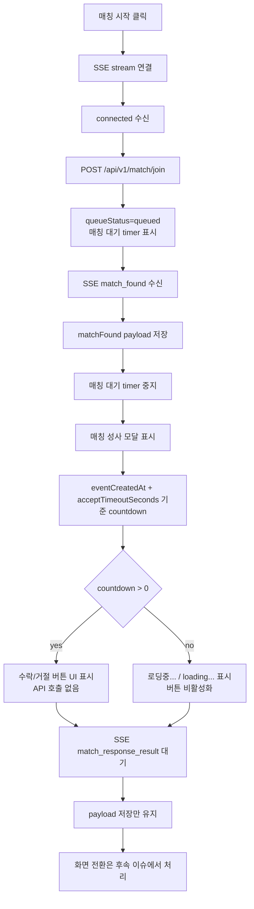
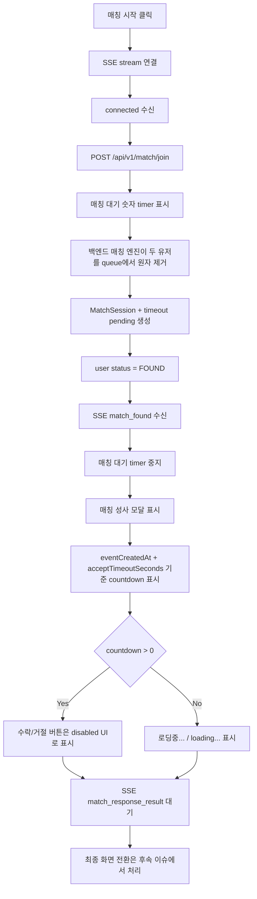

# Issue 80. Match Found Modal Implementation

## Feature Description

Vue 프론트엔드의 `/match` 페이지에서 SSE `match_found` 이벤트 수신 시 매칭 성사 모달을 표시한다.

이번 이슈는 `docs/antigravity/frontend/front-plan.md`의 `5. [ ] 매칭 성사 모달 구현`을 구현 기준으로 삼는다. `match_found` payload를 받아 모달을 표시하고, `acceptTimeoutSeconds` 기준 countdown을 보여준다. 단, 수락/거절 API 호출과 `match_response_result.action` 기반 화면 전환은 후속 이슈에서 구현한다.

`frontend/img/matchfound.jpeg`는 디자인 레퍼런스로만 사용하고 실제 화면에 import하지 않는다. 실제 모달은 Vue template과 scoped CSS로 구현하며, 모달 중앙 원형 영역에는 `frontend/img/logo.png`를 사용한다.



## Backend Contract

| 항목 | 기준 |
|------|------|
| Match stream | `GET /api/v1/notifications/match/stream` |
| Match found event | SSE `match_found` |
| Match result event | SSE `match_response_result` |
| Match accept | `POST /api/v1/match/{matchId}/accept` |
| Match reject | `POST /api/v1/match/{matchId}/reject` |
| Accept/Reject success | `200 OK` empty body |
| Final transition source | `match_response_result.action` |

`match_found` payload:

```ts
interface MatchFoundNotification {
  matchId: string
  userId: number
  opponentUserId: number
  acceptTimeoutSeconds: number
  eventCreatedAt: string
}
```

프론트 처리 기준:

- `match_found`는 HTTP join 성공이 아니라 SSE 이벤트 기준으로만 판단.
- `match_found` 수신 후 SSE 연결을 닫지 않음.
- `matchId`는 후속 accept/reject command에서 사용할 수 있도록 보관.
- countdown은 사용자 응답 가능 시간을 보여주는 UI 상태이며 timeout 확정 기준이 아님.
- timeout 자체 판정은 프론트가 확정하지 않고 서버의 `match_response_result`를 최종 기준으로 사용.
- countdown 0초에 `leaveMatchQueue`, ready reset, route 이동, SSE close를 호출하지 않음.
- `acceptTimeoutSeconds`가 유효하지 않은 값이면 countdown은 0초로 방어 처리하고 서버 최종 이벤트를 기다림.
- `match_found` 이후 SSE가 끊기면 큐 단계가 아니라 match session 응답 단계로 보고 `leaveMatchQueue`를 호출하지 않음.
- `GO_TO_MATCH_START`, `RETURN_TO_MATCHING`, `GO_TO_GAME_WAITING` 처리는 후속 `match_response_result` 이슈에서 구현.

## Asset 기준

| Asset | 용도 | 기준 |
|-------|------|------|
| `frontend/img/matchfound.jpeg` | 매칭 성사 모달 디자인 레퍼런스 | 실제 구현 산출물에 import하지 않음 |
| `frontend/img/logo.png` | 모달 중앙 원형 영역 logo | `MatchPage.vue`에서 import asset으로 사용 |

구현 기준:

- `matchfound.jpeg`의 어두운 overlay, 중앙 panel, cyan title, 원형 logo frame, cyan accept button, outlined decline button 구성을 CSS로 재현.
- `matchfound.jpeg`를 배경 이미지로 사용하지 않음.
- 모달은 Vue template과 scoped CSS로 구현.
- 새 이미지 파일을 추가하지 않음.

## Scope Boundary

이번 이슈에 포함한다.

- SSE `match_found` payload 수신 시 매칭 성사 모달 표시 구현.
- `matchId`, `userId`, `opponentUserId`, `acceptTimeoutSeconds`, `eventCreatedAt` payload 보관 구현.
- `eventCreatedAt + acceptTimeoutSeconds` 기준 countdown 구현.
- `eventCreatedAt` 파싱 실패 시 `acceptTimeoutSeconds` fallback countdown 구현.
- `match_found` 수신 시 기존 매칭 대기 숫자 timer 중지 구현.
- countdown 0초 이후 `로딩중...` / `loading...` 표시 구현.
- `acceptTimeoutSeconds` 비정상 값 수신 시 countdown 0초 fallback 구현.
- 수락/거절 버튼 UI 표시 구현.
- 수락/거절 버튼 disabled 처리 구현.
- 모달 표시 중 배경 매칭 CTA 조작 차단 구현.
- stream error, cancel, reset, unmount 시 match found modal countdown 정리 구현.
- `match_found` 이후 stream error 시 `leaveMatchQueue` 없이 에러 확인 후 ready 복귀 구현.
- 한/영 locale 문구 추가 구현.
- Match page 테스트 보강.
- lint / format / typecheck / test / build 검증.

이번 이슈에서 제외한다.

- accept/reject API 호출 구현.
- accept/reject pending, success, failure 상태 구현.
- `MATCH_RESPONSE_LOCK_FAILED` 처리 구현.
- `match_response_result.action` 기준 ready 복귀 구현.
- `match_response_result.action` 기준 매칭 대기 복귀 구현.
- `match_response_result.action` 기준 game waiting route 이동 구현.
- match session 상태 조회/복구 API 구현.
- Pinia 또는 전역 match store 도입.
- 새 패키지 추가.

## Tasks

### 1. 백엔드 매칭 성사 계약 반영

- [x] `match_found` payload shape 재확인 구현.
- [x] `match_found` 이후 SSE 연결 유지 정책 반영 구현.
- [x] countdown이 timeout 확정 기준이 아니라는 정책 반영 구현.
- [x] `match_response_result.action` 기반 화면 전환을 이번 이슈에서 제외하는 정책 반영 구현.
- [x] accept/reject API 호출을 이번 이슈에서 제외하는 정책 반영 구현.

### 2. Match found 상태 모델 구현

- [x] match found modal open 상태 구현.
- [x] match found countdown 상태 구현.
- [x] match found loading 상태 구현.
- [x] `matchFound` payload 보관 상태 유지 구현.
- [x] `match_found` 수신 시 기존 match waiting timer 중지 구현.
- [x] reset/cancel/unmount 시 match found modal countdown 정리 구현.
- [x] 모달 표시 중 배경 CTA 조작 차단 guard 구현.

### 3. Match found modal UI 구현

- [x] `matchfound.jpeg` 레퍼런스 기준 중앙 modal panel 구현.
- [x] `logo.png` import 및 원형 logo frame 구현.
- [x] cyan countdown ring 스타일 구현.
- [x] match found title 구현.
- [x] countdown text 구현.
- [x] accept filled button UI 구현.
- [x] decline outlined button UI 구현.
- [x] accept/decline disabled 처리 구현.
- [x] countdown 0초 이후 `로딩중...` / `loading...` 표시 구현.
- [x] modal 접근성 `role="dialog"`, `aria-modal`, `aria-labelledby` 구현.
- [x] desktop/mobile viewport에서 모달이 화면 밖으로 밀리지 않도록 반응형 구현.

### 4. Locale 구현

- [x] `match.foundTitle` 문구 추가 구현.
- [x] `match.foundSubtitle` 문구 추가 구현.
- [x] `match.responseTime` 문구 추가 구현.
- [x] `match.accept` 문구 추가 구현.
- [x] `match.decline` 문구 추가 구현.
- [x] `match.loading` 문구 추가 구현.
- [x] 한/영 전환 시 모달 문구 갱신 구현.

### 5. Test 구현

- [x] `match_found` 수신 시 모달 표시 검증.
- [x] `data-match-found-id` 저장 검증.
- [x] logo, title, countdown, accept/decline button 표시 검증.
- [x] `eventCreatedAt + acceptTimeoutSeconds` 기준 countdown 감소 검증.
- [x] `eventCreatedAt` 파싱 실패 시 fallback countdown 검증.
- [x] `acceptTimeoutSeconds` 비정상 값 수신 시 loading fallback 검증.
- [x] countdown 0초 도달 시 모달 유지 및 `로딩중...` 표시 검증.
- [x] countdown 0초 도달 시 `leaveMatchQueue`, accept/reject API, route 이동, ready reset 미발생 검증.
- [x] `match_found` 수신 시 기존 매칭 대기 timer 중지 검증.
- [x] 모달 표시 중 배경 CTA click이 start/cancel을 트리거하지 않는지 검증.
- [x] stream error, cancel, reset, unmount 시 modal countdown timer 정리 검증.
- [x] `match_found` 이후 stream error 시 `leaveMatchQueue` 미호출 및 에러 확인 후 ready 복귀 검증.
- [x] locale toggle 시 모달 문구 전환 검증.

### 6. 문서 정합성 구현

- [x] `front-plan.md`의 5번 단계와 issue-80 범위 정합성 확인 구현.
- [x] issue-78 구현 완료에 따라 `front-plan.md`의 4번 매칭 페이지 구현 완료 표시 확인 및 반영 구현.
- [x] issue-76의 SSE event dispatch 정책과 issue-80의 modal 표시 범위 연결 확인 구현.
- [x] issue-78의 on-demand stream lifecycle과 issue-80의 `match_found` 처리 시점 정합성 확인 구현.
- [x] backend issue-34의 `match_response_result` 최종 전환 정책과 countdown 0초 처리 정합성 확인 구현.
- [x] `matchfound.jpeg`는 레퍼런스 전용이고 `logo.png`만 실제 asset으로 사용한다는 문서 기준 확인 구현.
- [x] accept/reject command와 result routing을 후속 이슈로 제외한다는 정책 확인 구현.
- [x] 이번 이슈 PR 메시지 섹션 작성.

### 7. 검증

- [x] `npm run format` 검증.
- [x] `npm run lint` 검증.
- [x] `npm run typecheck` 검증.
- [x] `npm run test` 검증.
- [x] `npm run build` 검증.
- [x] desktop viewport에서 modal panel, logo, button 겹침 여부 확인.
- [x] mobile viewport에서 modal panel과 button이 화면 밖으로 밀리지 않는지 확인.

## Implementation Policy

- 이번 이슈는 `match_found` 모달 표시 범위만 담당한다.
- `matchfound.jpeg`는 레퍼런스 전용으로만 사용하고 실제 화면 asset으로 import하지 않는다.
- 실제 모달 내부 이미지는 `logo.png`만 사용한다.
- 새 패키지를 추가하지 않는다.
- 상태는 `MatchPage.vue` page local state로 유지한다.
- `match_found` 수신 시 queue 상태를 `ready`로 바꾸지 않는다.
- `match_found` 수신 시 기존 매칭 대기 숫자 timer는 중지한다.
- 모달이 떠 있는 동안 배경의 매칭 시작/취소 CTA는 조작할 수 없다.
- 수락/거절 버튼은 이번 이슈에서 API 호출 없는 disabled UI로 둔다.
- countdown은 `eventCreatedAt + acceptTimeoutSeconds` 기준으로 계산한다.
- `eventCreatedAt` 파싱 실패 시 `acceptTimeoutSeconds`를 표시용 fallback으로 사용한다.
- `acceptTimeoutSeconds`가 유효하지 않은 값이면 countdown을 0초로 처리하고 `로딩중...` / `loading...` 상태로 서버 최종 이벤트를 기다린다.
- countdown 0초 이후에도 모달을 유지하고 `로딩중...` / `loading...`을 표시한다.
- countdown 0초에 ready 복귀, leave 호출, route 이동, SSE close를 수행하지 않는다.
- countdown은 timeout을 확정하는 로직이 아니라 사용자에게 남은 응답 시간을 보여주는 표시용 상태다.
- 장시간 `match_response_result`가 오지 않는 상황의 watchdog, session recovery, 재조회 API는 후속 이슈에서 다룬다.
- `match_found` 이전 stream error는 기존 queued cleanup 정책을 유지한다.
- `match_found` 이후 stream error는 match session 응답 단계로 보고 `leaveMatchQueue`를 호출하지 않는다.
- `match_found` 이후 stream error는 modal/timer를 정리하고 error modal을 표시한 뒤, 사용자가 확인하면 화면만 ready 상태로 복귀한다.
- 최종 상태 전환은 후속 이슈에서 `match_response_result.action` 기준으로 구현한다.

## Acceptance Criteria

- SSE `match_found` 수신 시 매칭 성사 모달이 표시됨.
- `match_found.matchId`가 후속 command에 사용할 수 있는 상태로 보관됨.
- `match_found` 수신 시 기존 매칭 대기 숫자 timer가 멈춤.
- 모달 중앙 원형 영역에 `logo.png`가 표시됨.
- `matchfound.jpeg`는 구현 asset으로 import되지 않음.
- countdown이 `eventCreatedAt + acceptTimeoutSeconds` 기준으로 감소함.
- `acceptTimeoutSeconds`가 유효하지 않으면 countdown이 0초 loading 상태로 방어 처리됨.
- countdown 0초 이후 모달이 유지되고 `로딩중...` / `loading...`이 표시됨.
- countdown 0초 이후 ready 복귀, leave 호출, route 이동, SSE close가 발생하지 않음.
- 수락/거절 버튼이 표시되지만 API 호출은 발생하지 않음.
- 모달 표시 중 배경 CTA가 start/cancel을 트리거하지 않음.
- stream error, cancel, reset, unmount 시 modal countdown이 정리됨.
- `match_found` 이후 stream error 발생 시 `leaveMatchQueue`가 호출되지 않고 에러 확인 후 ready로 복귀함.
- 한/영 전환 시 모달 문구가 전환됨.
- lint / format / typecheck / test / build 통과.

## PR Message

## 📌 Summary

`/match` 페이지에서 백엔드가 보내는 SSE `match_found` 이벤트를 매칭 성사 모달로 보여주는 흐름을 구현함.



핵심 정책은 다음과 같음.

- 프론트는 `match_found`를 받으면 “큐 대기 중”이 아니라 “매칭 세션 응답 대기 중”으로 판단함.
- `match_found` 이후에는 백엔드가 이미 Redis queue에서 두 유저를 제거하고 `FOUND` 세션과 timeout 정산 경로를 만든 상태임.
- 그래서 `match_found` 이후 SSE가 끊겨도 프론트가 `leaveMatchQueue`를 호출하지 않음.
- countdown은 사용자가 보기 위한 남은 응답 시간 표시일 뿐, timeout 확정 기준이 아님.
- 최종 성공, 실패, 복귀, 게임 대기 이동은 백엔드의 `match_response_result.action`을 기준으로 후속 이슈에서 처리함.

백엔드와의 소통 방식은 다음과 같음.

- 프론트는 매칭 시작 시 SSE를 먼저 연결함.
- SSE `connected`를 받은 뒤 `POST /api/v1/match/join`을 호출함.
- 백엔드가 매칭을 성사시키면 SSE `match_found`를 보냄.
- 프론트는 같은 SSE 연결을 유지한 채 `match_response_result`를 기다림.
- 이번 이슈에서는 accept/reject command를 보내지 않고, 모달과 countdown 표시까지만 담당함.

## 📚 Changes

- `match_found` 이후 상태를 큐 상태가 아니라 match session 응답 상태로 해석하도록 정리함.
  이 결정 때문에 `match_found` 이후 stream error에서 `leaveMatchQueue`를 호출하지 않음. 이미 백엔드가 Lua `atomic_pair_remove`로 큐에서 제거한 유저를 프론트가 다시 큐 leave로 정리하려 하면 책임 경계가 섞이기 때문임.

- countdown 0초를 프론트 timeout 확정으로 사용하지 않도록 정리함.
  사용자는 0초를 보면 응답 시간이 끝났다고 이해할 수 있지만, 실제 최종 판정은 서버 timeout scheduler와 `match_response_result`가 담당함. 그래서 0초에는 ready 복귀, route 이동, SSE close를 하지 않고 `로딩중...` 상태로 서버 결과를 기다리게 함.

- `eventCreatedAt` 파싱 실패와 `acceptTimeoutSeconds` 비정상 값에 대한 방어 기준을 정리함.
  `eventCreatedAt`이 깨지면 payload의 `acceptTimeoutSeconds`를 표시용 fallback으로 사용함. `acceptTimeoutSeconds` 자체가 유효하지 않으면 countdown을 0초로 두고 서버 최종 이벤트를 기다림. 프론트 표시가 깨지는 것보다 “결정은 서버가 한다”는 계약을 유지하는 쪽을 선택함.

- `match_found` 이후 SSE 에러 복구 방식을 명확히 함.
  에러가 나면 매칭 성사 모달과 timer는 정리하고 에러 모달을 보여줌. 사용자가 확인하면 화면은 다시 `ready`로 돌아감. 단, 서버의 `FOUND` 세션 정산은 프론트가 취소하지 않음.

- 모달 UI 범위를 command 없이 표시 전용으로 제한함.
  수락/거절 API와 최종 화면 전환까지 한 번에 넣으면 이벤트 흐름, 실패 처리, 중복 응답 제어가 같이 커짐. 이번 이슈는 `match_found`를 사용자에게 안정적으로 보여주는 것까지로 자르고, command와 result routing은 다음 단계에서 다룸.

## 📝 Note

- `acceptMatch`, `rejectMatch` 호출은 후속 이슈에서 구현함.
- `match_response_result.action` 기반 ready 복귀, 매칭 대기 복귀, game waiting 이동은 후속 이슈에서 구현함.
- 장시간 `match_response_result`가 오지 않는 상황의 watchdog, session recovery, 재조회 API는 후속 이슈에서 다룸.
- 새 패키지는 추가하지 않음.
- `matchfound.jpeg`는 디자인 레퍼런스로만 사용하고 실제 화면 asset으로 import하지 않음.
- 실제 모달 중앙 이미지는 `logo.png`를 사용함.

## 📌 Related Issue

- Closes #80
