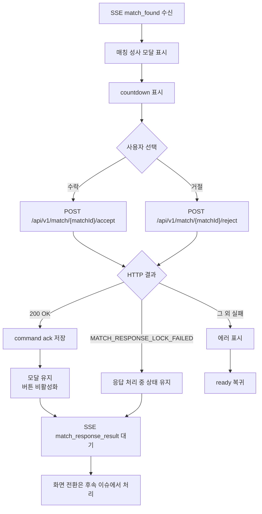
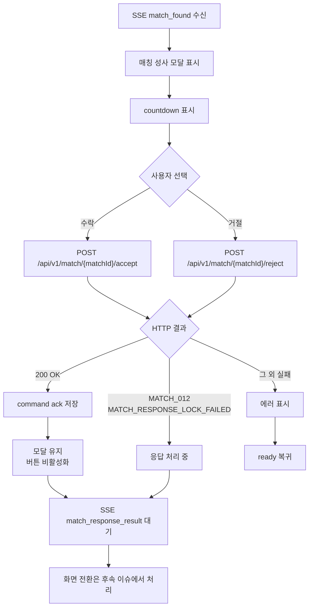

# Issue 82. Match Accept Reject Command Implementation

## Feature Description

Vue 프론트엔드의 `/match` 페이지에서 매칭 성사 모달의 수락/거절 버튼을 백엔드 accept/reject command API와 연결한다.

이번 이슈는 `docs/antigravity/frontend/front-plan.md`의 `6. [ ] 매칭 수락/거절 커맨드 구현`을 구현 기준으로 삼는다. Issue 80에서 구현한 `match_found` 모달은 현재 수락/거절 버튼 UI만 표시한다. 이번 이슈에서는 버튼을 활성화하고, 사용자의 선택을 백엔드에 HTTP command로 전송한다.

핵심은 HTTP 응답과 SSE 최종 결과를 분리하는 것이다. accept/reject HTTP `200 OK`는 "요청이 서버에 접수됨"만 의미한다. 게임 대기방 이동, 매칭 시작 화면 복귀, 매칭 대기 복귀 같은 최종 화면 전환은 이번 이슈에서 처리하지 않고 후속 `match_response_result` 이슈에서 처리한다.

## Backend Contract

| 항목                    | 기준                                       |
| ----------------------- | ------------------------------------------ |
| Match accept            | `POST /api/v1/match/{matchId}/accept`      |
| Match reject            | `POST /api/v1/match/{matchId}/reject`      |
| Success response        | `200 OK` empty body                        |
| Failure response        | 전역 `ErrorResponse`                       |
| Lock failure            | `MATCH_012` / `MATCH_RESPONSE_LOCK_FAILED` |
| Final transition source | SSE `match_response_result.action`         |

프론트 처리 기준:

- `matchId`는 기존 `match_found.matchId`를 사용한다.
- accept/reject 성공 HTTP 응답은 command ack로만 처리한다.
- accept/reject 성공 직후 route 이동, ready 복귀, game waiting 이동을 수행하지 않는다.
- 같은 `matchId`의 `match_response_result`가 HTTP 응답보다 먼저 도착할 수 있으므로 최종 전환은 SSE를 우선한다.
- `MATCH_RESPONSE_LOCK_FAILED`는 서버가 같은 match session 정산 중인 상태로 보고 모달을 유지한 채 SSE 최종 결과를 기다린다.
- 그 외 accept/reject 실패는 에러를 표시하고 매칭 시작 가능 상태로 복귀한다.
- timeout 판정은 프론트가 확정하지 않고 서버의 `match_response_result`를 기다린다.

## Scope Boundary

이번 이슈에 포함한다.

- 수락 버튼 활성화 구현.
- 거절 버튼 활성화 구현.
- 수락 클릭 시 `acceptMatch(matchId)` 호출 구현.
- 거절 클릭 시 `rejectMatch(matchId)` 호출 구현.
- accept/reject 요청 중 버튼 중복 클릭 방지 구현.
- accept/reject 성공 후 모달 유지 및 버튼 비활성화 구현.
- accept/reject 성공 후 SSE 연결 유지 구현.
- `MATCH_RESPONSE_LOCK_FAILED` 수신 시 응답 처리 중 상태 유지 구현.
- 그 외 accept/reject 실패 시 에러 표시 후 ready 복귀 구현.
- accept/reject in-flight request unmount abort 구현.
- 한/영 locale 문구 추가 구현.
- Match page 테스트 보강.
- match service 테스트 보강.
- lint / format / typecheck / test / build 검증.

이번 이슈에서 제외한다.

- `match_response_result.action` 기준 화면 전환 구현.
- `GO_TO_GAME_WAITING` route 이동 구현.
- `GO_TO_MATCH_START` ready 복귀 최종 처리 구현.
- `RETURN_TO_MATCHING` 매칭 대기 복귀 최종 처리 구현.
- 게임 대기방 route 및 WebSocket 구현.
- match session 재조회 API 구현.
- watchdog/session recovery 구현.
- Pinia 또는 전역 match store 도입.
- 새 패키지 추가.

## Tasks

### 1. 백엔드 accept/reject command 계약 반영

- [x] `POST /api/v1/match/{matchId}/accept` 호출 흐름 확인.
- [x] `POST /api/v1/match/{matchId}/reject` 호출 흐름 확인.
- [x] 성공 응답이 `200 OK` empty body이고 command ack라는 정책 반영.
- [x] HTTP 성공 직후 화면 전환 금지 정책 반영.
- [x] 최종 전환은 `match_response_result.action` 기준이라는 정책 반영.
- [x] `MATCH_RESPONSE_LOCK_FAILED`는 모달 유지 후 SSE 대기 기준으로 반영.
- [x] 그 외 실패 응답은 에러 표시 후 ready 복귀 기준으로 반영.

### 2. Match found 응답 상태 모델 구현

- [x] match found response local state 구현.
  - `idle`
  - `accepting`
  - `rejecting`
  - `accepted`
  - `rejected`
  - `lockWaiting`
- [x] accept/reject 요청용 `AbortController` 구현.
- [x] unmount 시 accept/reject in-flight request abort 구현.
- [x] reset/cancel/error 경로에서 response state 초기화 구현.
- [x] countdown 0초 이후 accept/reject 클릭 불가 구현.
- [x] `matchId`가 없으면 accept/reject 클릭 불가 구현.
- [x] 응답 전송 중 중복 클릭 방지 구현.

### 3. Match found modal command UI 구현

- [x] 기존 disabled 수락/거절 버튼을 상태 기반 활성/비활성으로 변경.
- [x] 수락 클릭 handler 구현.
- [x] 거절 클릭 handler 구현.
- [x] 요청 중 버튼 disabled 및 pending 문구 표시 구현.
- [x] 수락 성공 후 `상대 응답 대기` 상태 표시 구현.
- [x] 거절 성공 후 `결과 대기` 상태 표시 구현.
- [x] lock failure 후 `응답 처리 중...` 상태 표시 구현.
- [x] 버튼 disabled 스타일이 기존 modal design과 어울리도록 보강.
- [x] 배경 CTA 차단 정책 유지.

### 4. Locale 구현

- [x] `match.accepting` 문구 추가.
- [x] `match.declining` 문구 추가.
- [x] `match.accepted` 문구 추가.
- [x] `match.declined` 문구 추가.
- [x] `match.waitingForOpponent` 문구 추가.
- [x] `match.waitingForResult` 문구 추가.
- [x] `match.processingResponse` 문구 추가.
- [x] `match.responseFailed` 문구 추가.
- [x] 한/영 전환 시 응답 상태 문구 갱신 구현.

### 5. Test 구현

- [x] `acceptMatch(matchId)`가 accept endpoint로 요청하는지 검증.
- [x] `rejectMatch(matchId)`가 reject endpoint로 요청하는지 검증.
- [x] `matchId` URL encoding 검증.
- [x] `match_found` 수신 후 countdown 중 수락/거절 버튼 활성화 검증.
- [x] 수락 클릭 시 `acceptMatch(matchId)` 호출 검증.
- [x] 거절 클릭 시 `rejectMatch(matchId)` 호출 검증.
- [x] accept/reject 요청 중 중복 클릭 방지 검증.
- [x] accept 성공 후 모달 유지, SSE close 미발생, 화면 전환 미발생 검증.
- [x] reject 성공 후 모달 유지, ready 즉시 복귀 미발생 검증.
- [x] `MATCH_RESPONSE_LOCK_FAILED` 실패 시 모달 유지 및 응답 처리 중 상태 검증.
- [x] 그 외 실패 시 에러 표시 후 ready 복귀 검증.
- [x] countdown 0초 이후 accept/reject 클릭 불가 검증.
- [x] unmount 시 accept/reject abort 검증.
- [x] locale toggle 시 응답 상태 문구 전환 검증.

### 6. 문서 정합성 구현

- [x] `front-plan.md`의 6번 단계와 issue-82 범위 정합성 확인.
- [x] issue-80의 match found modal 범위와 issue-82 command 범위 연결 확인.
- [x] backend issue-34의 HTTP command ack + SSE final result 정책 반영 확인.
- [x] accept/reject 성공 직후 화면 전환 금지 정책 확인.
- [x] `match_response_result.action` 기반 화면 전환을 후속 이슈로 제외한다는 정책 확인.
- [x] 이번 이슈 PR 메시지 섹션 작성.

### 7. 검증

- [x] `npm run format` 검증.
- [x] `npm run lint` 검증.
- [x] `npm run typecheck` 검증.
- [x] `npm run test` 검증.
- [x] `npm run build` 검증.
- [x] desktop viewport에서 버튼 pending/disabled 상태 겹침 확인.
- [x] mobile viewport에서 버튼 문구가 화면 밖으로 밀리지 않는지 확인.

## Implementation Policy

- 이번 이슈는 accept/reject command 전송까지만 담당한다.
- HTTP `200 OK`는 command ack로만 처리한다.
- HTTP 성공 직후 route 이동, ready 복귀, game waiting 이동을 수행하지 않는다.
- 최종 화면 전환은 후속 이슈에서 `match_response_result.action` 기준으로 구현한다.
- `match_response_result`는 HTTP 응답보다 화면 전환 우선순위가 높다.
- accept/reject 요청 중에는 수락/거절 버튼을 모두 비활성화한다.
- accept 성공 후 모달을 유지하고 상대 응답 또는 서버 최종 결과를 기다린다.
- reject 성공 후에도 즉시 ready로 복귀하지 않고 서버 최종 결과를 기다린다.
- `MATCH_RESPONSE_LOCK_FAILED`는 서버 정산 진행 중으로 보고 모달을 유지한다.
- 그 외 command 실패는 모달을 닫고 에러 표시 후 ready로 복귀한다.
- countdown 0초 이후에는 accept/reject command를 보내지 않는다.
- SSE 연결은 command 성공 후에도 유지한다.
- 상태는 `MatchPage.vue` page local state로 유지한다.
- `matchService.ts`는 HTTP command 호출만 담당한다.
- `matchEventSource.ts`는 SSE event dispatch만 담당한다.
- 새 패키지를 추가하지 않는다.

## Acceptance Criteria

- `match_found` 모달에서 countdown 중 수락/거절 버튼을 클릭할 수 있음.
- 수락 클릭 시 `POST /api/v1/match/{matchId}/accept`가 호출됨.
- 거절 클릭 시 `POST /api/v1/match/{matchId}/reject`가 호출됨.
- accept/reject 요청 중 중복 요청이 발생하지 않음.
- accept/reject `200 OK` 이후 모달이 유지됨.
- accept/reject `200 OK` 이후 route 이동, ready 복귀, SSE close가 발생하지 않음.
- accept 성공 후 상대 응답 대기 문구가 표시됨.
- reject 성공 후 결과 대기 문구가 표시됨.
- `MATCH_RESPONSE_LOCK_FAILED` 시 모달 유지 및 응답 처리 중 상태가 표시됨.
- 그 외 command 실패 시 에러 표시 후 ready로 복귀함.
- countdown 0초 이후 accept/reject 버튼이 비활성화됨.
- unmount 시 in-flight accept/reject 요청이 abort됨.
- 한/영 전환 시 command 상태 문구가 전환됨.
- lint / format / typecheck / test / build 통과.

## PR Message

## 📌 Summary

`/match` 페이지의 매칭 성사 모달에서 수락/거절 command를 백엔드 API와 연결함.

이번 PR의 핵심은 수락/거절 버튼 클릭을 "최종 화면 전환"이 아니라 "서버에 내 선택을 접수하는 command"로 다루는 것임. HTTP 응답은 내 요청이 서버에 들어갔는지만 알려주고, 최종 성공/실패와 다음 화면 이동은 후속 `match_response_result` SSE 이벤트가 결정함.

핵심 정책:

- HTTP `200 OK`는 command ack로만 처리함.
- HTTP 성공 직후 route 이동, ready 복귀, game waiting 이동을 수행하지 않음.
- accept 성공 후 모달을 유지하고 상대 응답 또는 서버 최종 결과를 기다림.
- reject 성공 후에도 즉시 ready로 복귀하지 않고 서버 최종 결과를 기다림.
- `MATCH_012` / `MATCH_RESPONSE_LOCK_FAILED`는 서버 정산 진행 중으로 보고 모달을 유지함.
- 그 외 실패는 모달을 닫고 에러 표시 후 ready로 복귀함.
- countdown 0초 이후에는 accept/reject command를 보내지 않음.
- command 성공 후에도 SSE 연결을 유지함.

백엔드와의 구현 계약 사항:

- 수락은 `POST /api/v1/match/{matchId}/accept`로 보냄.
- 거절은 `POST /api/v1/match/{matchId}/reject`로 보냄.
- 성공 응답은 `200 OK` empty body임.
- 실패 응답은 전역 `ErrorResponse`를 사용함.
- `MATCH_012` / `MATCH_RESPONSE_LOCK_FAILED`는 같은 `matchId` 응답 또는 timeout 정산이 진행 중이라는 신호로 처리함.
- 최종 화면 전환은 후속 `match_response_result.action` 기준으로 처리함.

## 📚 Changes

- HTTP command와 SSE final result의 책임을 분리함.
  accept/reject HTTP `200 OK`는 "내 버튼 입력이 서버에 접수됨"만 의미함. 두 유저가 모두 수락했는지, 누가 거절했는지, timeout인지 같은 최종 결과는 서버가 `match_response_result` SSE로 한 번만 확정하는 구조가 더 안전함. 그래서 HTTP 성공 직후 게임 대기 화면 이동, ready 복귀, 매칭 대기 복귀를 하지 않도록 설계함.

- 수락/거절 성공 후에도 모달을 유지하도록 설계함.
  accept 성공은 "내가 수락함"이지 "게임방 이동 확정"이 아님. 상대가 아직 응답하지 않았을 수 있으므로 `상대 응답 대기`로 보여줌. reject 성공도 바로 ready로 돌리지 않음. 백엔드가 최종 정산을 끝내고 SSE 결과를 보내기 전까지는 `결과 대기`로 보여줌.

- 중복 클릭을 프론트 상태 모델에서 먼저 차단함.
  같은 `matchId`에 대해 수락/거절을 여러 번 보내면 사용자는 버튼을 여러 번 누른 것처럼 보이고, 백엔드는 lock과 session 상태로 방어해야 함. 프론트에서 `accepting`, `rejecting`, `accepted`, `rejected`, `lockWaiting` 상태를 분리해 요청 중이거나 이미 응답한 상태에서는 버튼을 비활성화함. 백엔드 lock은 최종 방어선으로 유지하고, 프론트는 불필요한 중복 요청을 줄이는 역할을 함.

- `MATCH_RESPONSE_LOCK_FAILED`를 일반 실패와 분리함.
  `MATCH_012` / `MATCH_RESPONSE_LOCK_FAILED`는 서버가 같은 `matchId` 응답 또는 timeout 정산을 처리 중이라는 뜻으로 봄. 이때 모달을 닫고 ready로 돌리면 서버는 아직 정산 중인데 사용자는 새 매칭을 시작할 수 있는 것처럼 보일 수 있음. 그래서 이 에러만은 모달을 유지하고 `응답 처리 중...` 상태로 SSE 최종 결과를 기다림.

- command 실패 복구 기준을 명확히 함.
  lock failure가 아닌 실패는 해당 command 흐름을 계속 붙잡지 않고 에러 표시 후 ready로 복귀함. 실패 HTTP 응답에는 화면 전환용 `action`이 없으므로, 프론트가 그 응답만 보고 게임 대기나 재매칭 같은 최종 전환을 추정하지 않음.

- countdown 0초 이후 command 전송을 막음.
  countdown 0초는 사용자가 응답할 수 있는 시간이 끝났다는 표시임. 하지만 timeout 최종 판정은 프론트가 확정하지 않고 서버의 `match_response_result`를 기다림. 그래서 0초 이후에는 수락/거절 버튼을 비활성화하고 `로딩중...` 상태로 둠.

- 응답 상태 문구를 명시적으로 분리함.
  countdown 0초는 `로딩중...`, 수락 요청 중은 `수락 중...`, 수락 성공 후는 `상대 응답 대기`, 거절 요청 중은 `거절 중...`, 거절 성공 후는 `결과 대기`, lock failure는 `응답 처리 중...`으로 표시함. 모두 `로딩중...`으로 처리하면 사용자가 버튼이 눌렸는지, 상대를 기다리는지, 서버 정산을 기다리는지 알기 어려움.

- 패키지 책임을 유지함.
  HTTP 호출은 `matchService.ts`, SSE 수신은 `matchEventSource.ts`, 페이지 상태 조합과 UI는 `MatchPage.vue`가 담당함. 새 전역 store와 새 패키지는 도입하지 않음. 이번 범위는 page local state로 충분하고, 후속 `match_response_result.action` 화면 전환 단계에서 전역 상태가 필요하면 그때 판단하는 편이 변경 범위를 작게 유지함.

## 📝 Note

- `match_response_result.action` 기반 화면 전환은 후속 이슈에서 구현함.
- `GO_TO_GAME_WAITING`, `GO_TO_MATCH_START`, `RETURN_TO_MATCHING` 처리는 이번 이슈 범위가 아님.
- timeout 확정은 프론트가 하지 않고 서버 최종 이벤트를 기다림.
- 새 패키지는 추가하지 않음.
- 검증은 `npm run format`, `npm run lint`, `npm run typecheck`, `npm run test`, `npm run build`로 수행함.
- desktop/mobile viewport에서 pending/disabled 문구가 모달 밖으로 밀리지 않는지 확인함.

## 📌 Related Issue

- Closes #82
