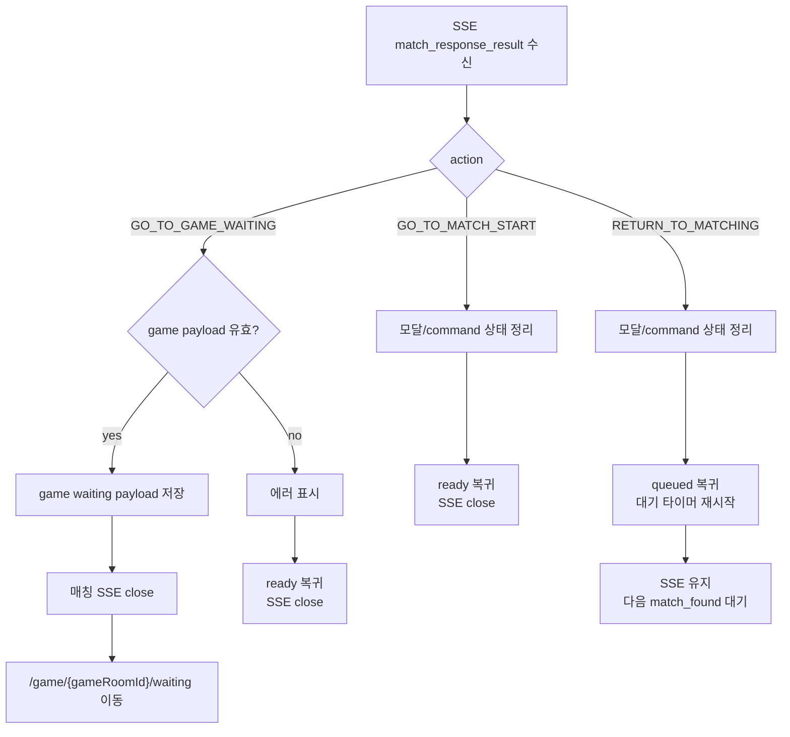
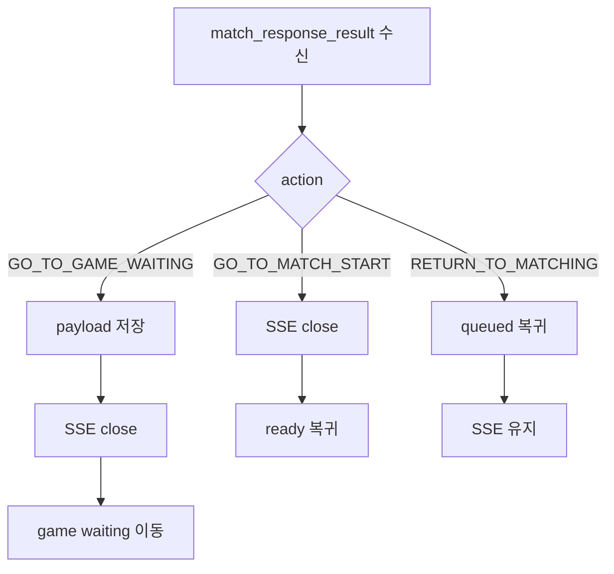

# Issue 84. Match Response Result Transition Implementation

## Feature Description

Vue 프론트엔드의 `/match` 페이지에서 SSE `match_response_result` 최종 이벤트를 기준으로 action별 화면 전환을 구현한다.

이번 이슈는 `docs/antigravity/frontend/front-plan.md`의 `7. [ ] 매칭 응답 결과 화면 전환 구현`을 구현 기준으로 삼는다. Issue 82에서 accept/reject HTTP command는 연결됐지만, 최종 화면 전환은 아직 처리하지 않는다. 이번 이슈에서는 `match_response_result.action`을 받아 게임 대기 화면 이동, 매칭 시작 가능 상태 복귀, 매칭 대기 상태 복귀를 구현한다.

핵심은 action별 SSE 연결 정책을 분리하는 것이다. 백엔드 코드 확인 결과 `RETURN_TO_MATCHING`은 수락 유저를 기존 `entryTime/tierScore`로 큐에 다시 넣고 `userStatus=MATCHING`으로 바꾼 뒤 발행된다. 따라서 프론트는 `RETURN_TO_MATCHING`에서 join/leave API를 호출하지 않고, SSE 연결을 유지한 채 queued 상태를 표시한다.



## Backend Contract

| 항목 | 기준 |
| ---- | ---- |
| Final event | SSE `match_response_result` |
| Transition source | `match_response_result.action` |
| Game waiting action | `GO_TO_GAME_WAITING` |
| Start screen action | `GO_TO_MATCH_START` |
| Queue return action | `RETURN_TO_MATCHING` |
| Game waiting route | `/game/:gameRoomId/waiting` |

`match_response_result` payload:

```ts
interface MatchResponseResultNotification {
  matchId: string
  outcome: 'MATCHED' | 'FAILED'
  reason:
    | 'BOTH_ACCEPTED'
    | 'MY_REJECTED'
    | 'OPPONENT_REJECTED'
    | 'MY_TIMEOUT'
    | 'OPPONENT_TIMEOUT'
    | 'BOTH_TIMEOUT'
    | 'GAME_SETUP_FAILED'
  action: 'GO_TO_GAME_WAITING' | 'GO_TO_MATCH_START' | 'RETURN_TO_MATCHING'
  opponent: {
    userId: number
    nickname: string
    tier: string
    tierScore: number
  } | null
  game: {
    gameRoomId: number
    videoUrl: string
    webSocketUrl: string
  } | null
}
```

프론트 처리 기준:

- `GO_TO_GAME_WAITING`은 `game.gameRoomId`, `game.videoUrl`, `game.webSocketUrl`이 있어야 게임 대기 화면으로 이동한다.
- `GO_TO_GAME_WAITING` 이동 전 `matchId`, `opponent`, `game`, `receivedAt`을 `sessionStorage`에 저장한다.
- `GO_TO_GAME_WAITING`은 매칭 SSE를 닫고 게임 대기 화면으로 이동한다.
- `GO_TO_MATCH_START`는 매칭 SSE를 닫고 ready 상태로 복귀한다.
- `RETURN_TO_MATCHING`은 백엔드가 이미 큐 복귀를 완료한 상태로 보고 queued 상태로 복귀한다.
- `RETURN_TO_MATCHING`은 매칭 SSE를 닫지 않는다.
- `RETURN_TO_MATCHING`에서는 `joinMatchQueue`, `leaveMatchQueue`를 호출하지 않는다.

## Scope Boundary

이번 이슈에 포함한다.

- `match_response_result.action` 기반 화면 전환 구현.
- `GO_TO_GAME_WAITING` route 이동 구현.
- `GO_TO_MATCH_START` ready 복귀 구현.
- `RETURN_TO_MATCHING` queued 복귀 구현.
- action별 매칭 SSE close / 유지 정책 구현.
- game waiting payload `sessionStorage` 저장/조회 구현.
- `GameWaitingPage.vue` loading UI 구현.
- `background.png` 기반 game waiting background 구현.
- `gameloading.png` 참고 디자인 기반 CSS 재현.
- game waiting loading bar payload 확보율 구현.
- 한/영 locale 문구 추가.
- Match page / Game waiting page 테스트 구현.
- 문서 정합성 반영.
- lint / format / typecheck / test / build 검증.

이번 이슈에서 제외한다.

- game waiting WebSocket 연결 구현.
- `CLIENT_READY` 전송 구현.
- `GAME_WAITING_TIMEOUT`, `GAME_START_FAILED`, `COUNTDOWN`, `GAME_START` 처리 구현.
- game play / game result route 전환 구현.
- match session 재조회 API 구현.
- watchdog/session recovery 구현.
- Pinia 또는 전역 match store 도입.
- 새 패키지 추가.

## Tasks

### 1. 백엔드 match_response_result 계약 반영

- [x] `match_response_result` payload shape 확인.
- [x] `GO_TO_GAME_WAITING` action 정책 반영.
- [x] `GO_TO_MATCH_START` action 정책 반영.
- [x] `RETURN_TO_MATCHING` action 정책 반영.
- [x] `RETURN_TO_MATCHING`은 백엔드 큐 복귀 완료 후 발행된다는 정책 반영.
- [x] `GO_TO_GAME_WAITING`에서 필요한 `game` 필수 payload 기준 반영.
- [x] 실패 이벤트에서 `game === null`일 수 있다는 정책 반영.

### 2. Match page result transition 구현

- [x] `onMatchResponseResult`에서 action별 handler 분기 구현.
- [x] result 수신 시 match found modal 닫기 구현.
- [x] result 수신 시 countdown timer 정리 구현.
- [x] result 수신 시 accept/reject command state 초기화 구현.
- [x] `GO_TO_GAME_WAITING` route 이동 구현.
- [x] `GO_TO_GAME_WAITING` 처리 시 매칭 SSE close 구현.
- [x] `GO_TO_MATCH_START` ready 복귀 구현.
- [x] `GO_TO_MATCH_START` 처리 시 매칭 SSE close 구현.
- [x] `RETURN_TO_MATCHING` queued 복귀 구현.
- [x] `RETURN_TO_MATCHING` 처리 시 매칭 SSE 유지 구현.
- [x] `RETURN_TO_MATCHING` 처리 시 waiting timer 재시작 구현.
- [x] `RETURN_TO_MATCHING` 처리 시 join/leave API 미호출 유지 구현.
- [x] `game` 필수 payload 누락 시 game waiting 이동 금지 구현.

### 3. Game waiting payload storage 구현

- [x] `sessionStorage` 저장 helper 구현.
- [x] `sessionStorage` 조회 helper 구현.
- [x] 저장 key를 `smite.gameWaitingPayload:{gameRoomId}` 기준으로 구현.
- [x] 저장 payload에 `matchId`, `opponent`, `game`, `receivedAt` 포함.
- [x] route param `gameRoomId`와 저장 payload 불일치 시 안전 복귀 구현.
- [x] payload 없음 또는 parse 실패 시 안전 복귀 구현.

### 4. Game waiting UI 구현

- [x] `GameWaitingPage.vue` placeholder 제거.
- [x] `background.png` 기반 full-screen background 구현.
- [x] `gameloading.png` 참고 디자인을 CSS로 재현.
- [x] `gameloading.png` runtime import 금지 유지.
- [x] `LEAGUE OF SMITE` title 구현.
- [x] 게임 준비 중 title 구현.
- [x] 상대 nickname / tier / gameRoomId 표시 구현.
- [x] segmented loading bar 구현.
- [x] payload 확보율 기반 loading progress 구현.
- [x] desktop/mobile responsive layout 구현.

### 5. Loading bar 정책 구현

- [ ] 필수 payload 항목을 5개로 정의.
  - `matchId`
  - `opponent`
  - `game.gameRoomId`
  - `game.videoUrl`
  - `game.webSocketUrl`
- [ ] 각 항목을 20%로 계산.
- [ ] 1개 확보 시 20%, 2개 확보 시 40%, 3개 확보 시 60%, 4개 확보 시 80%, 5개 확보 시 100% 표시.
- [ ] 정상 `GO_TO_GAME_WAITING` payload는 route 진입 직후 100%가 될 수 있음을 UI 정책에 반영.
- [ ] WebSocket 연결률과 `CLIENT_READY` progress는 이번 이슈에서 제외.

### 6. Locale 구현

- [ ] match result 실패 안내 문구 추가.
- [ ] game waiting title 문구 추가.
- [ ] game waiting status 문구 추가.
- [ ] game waiting payload missing 문구 추가.
- [ ] loading step 문구 추가.
- [ ] 한/영 전환 시 game waiting 문구 갱신 구현.

### 7. Test 구현

- [ ] `GO_TO_GAME_WAITING` 수신 시 route 이동 검증.
- [ ] `GO_TO_GAME_WAITING` 수신 시 match SSE close 검증.
- [ ] `GO_TO_GAME_WAITING` 수신 시 payload 저장 검증.
- [ ] `GO_TO_GAME_WAITING` payload 누락 시 route 이동 금지 검증.
- [ ] `GO_TO_MATCH_START` 수신 시 ready 복귀 검증.
- [ ] `GO_TO_MATCH_START` 수신 시 match SSE close 검증.
- [ ] `RETURN_TO_MATCHING` 수신 시 queued 복귀 검증.
- [ ] `RETURN_TO_MATCHING` 수신 시 match SSE close 미호출 검증.
- [ ] `RETURN_TO_MATCHING` 수신 시 join/leave API 미호출 검증.
- [ ] `RETURN_TO_MATCHING` 이후 다음 `match_found` 수신 가능 검증.
- [ ] Game waiting page payload 표시 검증.
- [ ] loading bar 20/40/60/80/100% 계산 검증.
- [ ] payload 없음 또는 route param 불일치 시 `/match` 복귀 검증.
- [ ] locale toggle 시 game waiting 문구 전환 검증.

### 8. 문서 정합성 구현

- [ ] `front-plan.md` 7번 단계와 issue-84 범위 정합성 확인.
- [ ] issue-82에서 제외한 `match_response_result.action` 전환을 issue-84에서 구현한다는 연결 확인.
- [ ] backend issue-34의 action mapping과 프론트 처리 정책 정합성 확인.
- [ ] project policy의 SSE close 정책과 action별 처리 정책 정합성 확인.
- [ ] “`match_response_result` 수신 후 항상 SSE close” 표현이 남아 있으면 action별 정책으로 수정.
- [ ] `RETURN_TO_MATCHING`은 SSE 유지 + queued 복귀 정책으로 문서화.
- [ ] `gameloading.png`는 참고 디자인이며 runtime import하지 않는 정책 문서화.
- [ ] loading bar는 필수 payload 확보율 기준이라는 정책 문서화.
- [ ] 이번 이슈 PR 메시지 섹션 작성.

### 9. 검증

- [ ] `npm run format` 검증.
- [ ] `npm run lint` 검증.
- [ ] `npm run typecheck` 검증.
- [ ] `npm run test` 검증.
- [ ] `npm run build` 검증.
- [ ] desktop viewport에서 game waiting UI overflow 확인.
- [ ] mobile viewport에서 game waiting UI overflow 확인.
- [ ] loading bar segment가 desktop/mobile에서 겹치지 않는지 확인.

## Implementation Policy

- 최종 화면 전환 기준은 HTTP accept/reject 응답이 아니라 SSE `match_response_result.action`이다.
- `GO_TO_GAME_WAITING`은 `game` payload가 유효할 때만 route 이동한다.
- `GO_TO_GAME_WAITING`은 match SSE를 닫고 game waiting 화면으로 이동한다.
- `GO_TO_MATCH_START`는 match SSE를 닫고 ready 상태로 복귀한다.
- `RETURN_TO_MATCHING`은 match SSE를 유지하고 queued 상태로 복귀한다.
- `RETURN_TO_MATCHING`은 join/leave API를 호출하지 않는다.
- `RETURN_TO_MATCHING`은 백엔드 큐 복귀 완료 이벤트로 해석한다.
- `game` payload는 `sessionStorage`에 최소 저장한다.
- `GameWaitingPage.vue`는 payload 표시와 loading UI까지만 담당한다.
- game waiting WebSocket 연결은 후속 이슈에서 구현한다.
- `gameloading.png`는 참고 디자인으로만 사용하고 import하지 않는다.
- 새 패키지를 추가하지 않는다.

## Acceptance Criteria

- `GO_TO_GAME_WAITING` 수신 시 `/game/:gameRoomId/waiting`으로 이동함.
- `GO_TO_GAME_WAITING` 수신 시 game waiting payload가 저장됨.
- `GO_TO_GAME_WAITING` 수신 시 match SSE가 닫힘.
- `GO_TO_GAME_WAITING`인데 `game` 필수 payload가 누락되면 game waiting으로 이동하지 않음.
- `GO_TO_MATCH_START` 수신 시 ready 상태로 복귀함.
- `GO_TO_MATCH_START` 수신 시 match SSE가 닫힘.
- `RETURN_TO_MATCHING` 수신 시 queued 상태로 복귀함.
- `RETURN_TO_MATCHING` 수신 시 match SSE가 유지됨.
- `RETURN_TO_MATCHING` 수신 시 join/leave API를 호출하지 않음.
- Game waiting page는 저장된 opponent/game 정보를 표시함.
- Loading bar는 5개 필수 payload 기준으로 20% 단위로 표시됨.
- `gameloading.png`는 runtime asset으로 사용되지 않음.
- lint / format / typecheck / test / build 통과.

## PR Message

## 📌 Summary

`/match` 페이지에서 SSE `match_response_result.action`을 기준으로 최종 화면 전환을 처리함.



핵심 정책:

- 최종 전환은 HTTP accept/reject 응답이 아니라 `match_response_result.action` 기준으로 처리함.
- `RETURN_TO_MATCHING`은 백엔드가 이미 큐 복귀를 완료한 상태로 보고 SSE를 유지함.
- `GO_TO_GAME_WAITING`, `GO_TO_MATCH_START`는 현재 매칭 흐름이 끝난 상태로 보고 SSE를 닫음.
- 게임 대기 화면은 이번 이슈에서 payload 표시와 loading UI까지만 구현함.

## 📚 Changes

- action별 화면 전환 정책을 구현함.
  `GO_TO_GAME_WAITING`, `GO_TO_MATCH_START`, `RETURN_TO_MATCHING`은 서로 다른 상태 전환과 SSE 연결 정책을 가진다.

- `RETURN_TO_MATCHING`을 rejoin API 없이 처리함.
  백엔드가 수락 유저를 기존 우선순위로 큐에 복귀시킨 뒤 이벤트를 보내므로, 프론트는 join/leave를 호출하지 않고 queued 상태와 SSE 연결을 유지한다.

- Game waiting payload 저장 경계를 추가함.
  후속 WebSocket 이슈에서 사용할 수 있도록 `matchId`, `opponent`, `game`, `receivedAt`만 `sessionStorage`에 저장한다.

- Game waiting loading UI를 추가함.
  `gameloading.png`는 참고만 하고, 실제 화면은 `background.png`와 CSS로 구현한다.

- Loading bar를 필수 payload 확보율 기준으로 설계함.
  `matchId`, `opponent`, `gameRoomId`, `videoUrl`, `webSocketUrl` 5개 항목을 각각 20%로 계산한다.

## 📝 Note

- Game waiting WebSocket 연결은 후속 이슈에서 구현함.
- `CLIENT_READY`, timeout, countdown, game start 처리는 이번 이슈 범위가 아님.
- 문서에 남아 있는 “항상 SSE close” 표현은 action별 정책으로 정리함.
- 새 패키지는 추가하지 않음.

## 📌 Related Issue

- Closes #84
