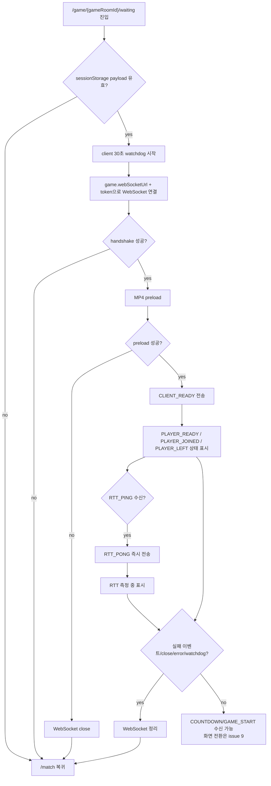
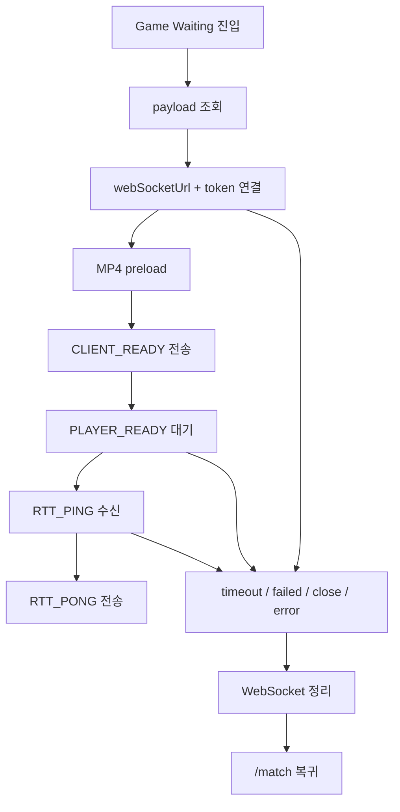

# Issue 86. Game Waiting WebSocket Implementation

## Feature Description

Vue 프론트엔드의 `/game/:gameRoomId/waiting` 페이지에서 백엔드 Game WebSocket에 연결하고, 게임 시작 전 대기/READY/RTT/실패 복귀 흐름을 구현한다.

이번 이슈는 `docs/antigravity/frontend/front-plan.md`의 `8. [ ] 게임 대기방 WebSocket 구현`을 구현 기준으로 삼는다. Issue 84에서 `GO_TO_GAME_WAITING` 수신 후 game waiting 화면 이동과 payload 저장까지 완료했으므로, 이번 이슈에서는 저장된 `game.webSocketUrl`, `game.videoUrl`을 사용해 WebSocket 대기방 흐름을 연결한다.

핵심은 Game Waiting 화면의 책임을 "게임 시작 전 연결 준비"로 제한하는 것이다. `COUNTDOWN`, `GAME_START`의 countdown UI, scenario 저장, `/game/:gameRoomId/play` 이동은 `front-plan.md` 9번 이슈에서 구현한다. 이번 이슈에서는 `COUNTDOWN`, `GAME_START` 메시지가 와도 화면이 깨지지 않도록 수신 가능한 상태까지만 맞춘다.



## Backend Contract

| 항목                    | 기준                                                                  |
| ----------------------- | --------------------------------------------------------------------- |
| Game WebSocket endpoint | `/ws/game/{gameRoomId}`                                               |
| Connection source       | `match_response_result.game.webSocketUrl`에 access token query append |
| Token 전달              | native WebSocket 제약으로 query parameter `token` 사용                |
| Ready command           | `CLIENT_READY`                                                        |
| RTT response            | `RTT_PONG`                                                            |
| Timeout event           | `GAME_WAITING_TIMEOUT`                                                |
| Start failure event     | `GAME_START_FAILED`                                                   |
| Countdown / start       | `COUNTDOWN`, `GAME_START`                                             |

저장된 game waiting payload:

```ts
interface GameWaitingPayload {
  matchId: string;
  opponent: {
    userId: number;
    nickname: string;
    tier: string;
    tierScore: number;
  } | null;
  game: {
    gameRoomId: number;
    videoUrl: string;
    webSocketUrl: string;
  };
  receivedAt: string;
}
```

클라이언트 메시지:

```ts
type GameWebSocketClientMessage =
  | {
      type: "CLIENT_READY";
      payload: {};
    }
  | {
      type: "RTT_PONG";
      payload: {
        seq: number;
      };
    };
```

서버 메시지:

```ts
type GameWaitingServerMessage =
  | {
      type: "PLAYER_JOINED";
      payload: { userId: number };
    }
  | {
      type: "PLAYER_READY";
      payload: { userId: number; bothReady: boolean };
    }
  | {
      type: "PLAYER_LEFT";
      payload: { userId: number };
    }
  | {
      type: "RTT_PING";
      payload: { seq: number };
    }
  | {
      type: "GAME_WAITING_TIMEOUT";
      payload: {
        gameRoomId: number;
        reason: string;
        action: "GO_TO_MATCH_START";
      };
    }
  | {
      type: "GAME_START_FAILED";
      payload: {
        gameRoomId: number;
        reason: string;
        action: "GO_TO_MATCH_START";
      };
    }
  | {
      type: "COUNTDOWN";
      payload: {
        gameRoomId: number;
        serverTime: number;
        startAt: number;
        countdownDisplaySeconds: number;
      };
    }
  | {
      type: "GAME_START";
      payload: {
        gameRoomId: number;
        serverTime: number;
        startAt: number;
        scenario: {
          dragonMaxHp: number;
          durationMs: number;
          hpTimeline: {
            timeMs: number;
            hp: number;
          }[];
        };
      };
    }
  | {
      type: "ERROR";
      payload: { code: string; reason: string };
    };
```

프론트 처리 기준:

- `game.webSocketUrl`을 WebSocket 연결 source로 사용한다.
- `game.webSocketUrl`이 `/ws/game/{gameRoomId}` 같은 relative path이면 `VITE_WS_BASE_URL`과 합친다.
- token query는 기존 query 존재 여부에 따라 `?token=` 또는 `&token=`으로 붙인다.
- WebSocket 연결 후 `game.videoUrl` MP4 preload가 완료되면 `CLIENT_READY`를 한 번만 전송한다.
- `RTT_PING`을 받으면 payload의 `seq`를 그대로 담아 `RTT_PONG`을 즉시 전송한다.
- `GAME_WAITING_TIMEOUT`, `GAME_START_FAILED`, `ERROR`, handshake 실패, close/error, client watchdog 만료는 `/match` 복귀 기준으로 처리한다.
- `COUNTDOWN`, `GAME_START`는 이번 이슈에서 route 이동하지 않고 후속 9번 이슈 입력으로만 안전하게 수신한다.

## Scope Boundary

이번 이슈에 포함한다.

- `/game/:gameRoomId/waiting` WebSocket 연결 구현.
- `game.webSocketUrl` 기반 WebSocket URL 조립 구현.
- access token query parameter 연결 구현.
- MP4 preload 완료 후 `CLIENT_READY` 1회 전송 구현.
- `PLAYER_JOINED`, `PLAYER_READY`, `PLAYER_LEFT` 대기 상태 표시 구현.
- `RTT_PING` 수신 시 `RTT_PONG` 즉시 전송 구현.
- `GAME_WAITING_TIMEOUT`, `GAME_START_FAILED`, `ERROR` 실패 복귀 구현.
- handshake 실패, close/error, client 30초 watchdog 실패 복귀 구현.
- WebSocket/timer/preload listener cleanup 구현.
- Game waiting WebSocket 상태 한/영 locale 구현.
- WebSocket service / GameWaitingPage 테스트 구현.
- `front-plan.md` 이전 완료 단계 체크 정합성 정리.
- 문서 정합성 반영.
- lint / format / typecheck / test / build 검증.

이번 이슈에서 제외한다.

- `COUNTDOWN` countdown UI 구현.
- `GAME_START` scenario 저장 구현.
- `GAME_START` 수신 후 `/game/:gameRoomId/play` 이동 구현.
- `/game/:gameRoomId/play` 실제 게임 플레이 UI 구현.
- SMITE 버튼 및 `{ type: 'SMITE', payload: null }` 전송 구현.
- `GAME_RESULT` 수신 후 결과 화면 이동 구현.
- Game summary API 호출 구현.
- WebSocket 재접속/복구 구현.
- match session 재조회 API 구현.
- Pinia 또는 전역 game store 도입.
- 새 패키지 추가.

## Tasks

### 1. 백엔드 Game WebSocket 계약 반영

- [x] backend issue-40의 WebSocket endpoint, token query, handshake 정책 확인.
- [x] backend issue-42의 `GAME_WAITING_TIMEOUT` 정책 확인.
- [x] backend RTT/start 관련 문서의 `RTT_PING`, `GAME_START_FAILED`, `COUNTDOWN`, `GAME_START` 정책 확인.
- [x] `docs/project/websocket client.md`의 client 처리 기준 확인.
- [x] `CLIENT_READY` payload를 `{}`로 전송하도록 프론트 타입과 message factory 정합성 반영.
- [x] `RTT_PONG` payload shape `{ seq }` 반영.
- [x] `GAME_WAITING_TIMEOUT`, `GAME_START_FAILED`는 `/match` 복귀 action으로 처리한다는 정책 반영.
- [x] `COUNTDOWN`, `GAME_START`는 수신 가능하되 이번 이슈에서 route 이동하지 않는 정책 반영.

### 2. Game WebSocket service 구현

- [x] `connectGameWebSocket`이 `gameRoomId`만이 아니라 `webSocketUrl` 기반 연결을 지원하도록 구현.
- [x] relative `webSocketUrl`은 `VITE_WS_BASE_URL`과 합치도록 구현.
- [x] absolute `ws://`, `wss://` URL은 그대로 사용하도록 구현.
- [x] token query parameter append 구현.
- [x] access token 없을 때 명확한 error 발생 구현.
- [x] message JSON parse 실패 시 page handler가 복구할 수 있도록 error callback 처리 구현.
- [x] `sendClientReady`가 `{ type: 'CLIENT_READY', payload: {} }` 전송하도록 구현.
- [x] `sendRttPong(seq)`가 `{ type: 'RTT_PONG', payload: { seq } }` 전송하도록 구현.
- [x] close helper는 중복 close에 안전하도록 유지.

### 3. Game Waiting 상태 모델 구현

- [x] WebSocket 상태 local state 구현.
  - `idle`
  - `connecting`
  - `connected`
  - `preloading`
  - `readySent`
  - `waitingOpponent`
  - `bothReady`
  - `rttMeasuring`
  - `failed`
- [x] `PLAYER_JOINED` 수신 시 연결 상태 표시 구현.
- [x] `PLAYER_READY bothReady=false` 수신 시 상대 준비 대기 표시 구현.
- [x] `PLAYER_READY bothReady=true` 수신 시 양쪽 준비 완료 표시 구현.
- [x] `PLAYER_LEFT` 수신 시 상대 이탈 상태 표시 구현.
- [x] `RTT_PING` 수신 시 `rttMeasuring` 상태 전환 및 `RTT_PONG` 전송 구현.
- [x] `GAME_WAITING_TIMEOUT`, `GAME_START_FAILED`, `ERROR` 수신 시 실패 상태 전환 구현.
- [x] `COUNTDOWN`, `GAME_START` 수신 시 현재 이슈에서는 상태를 깨지 않도록 안전 처리 구현.
- [x] final failure 이후 늦은 WebSocket callback은 상태를 다시 흔들지 않도록 guard 구현.

### 4. MP4 preload + CLIENT_READY 구현

- [x] `game.videoUrl`로 hidden preload video element 또는 `HTMLVideoElement` 기반 preload 구현.
- [x] preload 성공 시 `CLIENT_READY` 1회 전송 구현.
- [x] preload 실패 시 WebSocket close 후 `/match` 복귀 구현.
- [x] preload 완료 전 WebSocket failure 발생 시 listener/timer 정리 구현.
- [x] unmount 시 preload listener 정리 구현.
- [x] `CLIENT_READY` 중복 전송 방지 guard 구현.

### 5. Timeout / 실패 복귀 구현

- [x] waiting page 진입 시 client 30초 watchdog 시작 구현.
- [x] `PLAYER_READY bothReady=true` 또는 `RTT_PING` 수신 시 watchdog 정리 구현.
- [x] watchdog 만료 시 실패 안내 후 `/match` 복귀 구현.
- [x] WebSocket handshake 실패 또는 open 전 close 발생 시 `/match` 복귀 구현.
- [x] WebSocket error/close 발생 시 `/match` 복귀 구현.
- [x] `GAME_WAITING_TIMEOUT` 수신 시 WebSocket 정리 후 `/match` 복귀 구현.
- [x] `GAME_START_FAILED` 수신 시 WebSocket 정리 후 `/match` 복귀 구현.
- [x] 실패 복귀 시 match join/leave API는 호출하지 않음.
- [x] 실패 복귀 시 큐 자동 복귀는 하지 않음.

### 6. Game Waiting UI / Locale 구현

- [x] WebSocket 연결 중 문구 추가.
- [x] MP4 preload 중 문구 추가.
- [x] `CLIENT_READY` 전송 완료 문구 추가.
- [x] 상대 준비 대기 문구 추가.
- [x] 양쪽 준비 완료 문구 추가.
- [x] RTT 측정 중 문구 추가.
- [x] 실패 복귀 안내 문구 추가.
- [x] 한/영 locale 모두 추가.
- [x] 기존 loading bar는 payload 수신율 의미로 유지하고 WebSocket progress와 섞지 않음.

### 7. Test 구현

- [x] WebSocket URL 조립 테스트.
- [x] token query append 테스트.
- [x] access token 없음 테스트.
- [x] invalid JSON 수신 테스트.
- [x] `CLIENT_READY` payload `{}` 전송 테스트.
- [x] `RTT_PONG` payload `{ seq }` 전송 테스트.
- [x] GameWaitingPage mount 시 WebSocket 연결 테스트.
- [x] preload 완료 후 `CLIENT_READY` 1회 전송 테스트.
- [x] `PLAYER_READY bothReady=false` 상태 표시 테스트.
- [x] `PLAYER_READY bothReady=true` 상태 표시 테스트.
- [x] `RTT_PING` 수신 시 `RTT_PONG` 전송 테스트.
- [x] `GAME_WAITING_TIMEOUT` 수신 시 `/match` 복귀 테스트.
- [x] `GAME_START_FAILED` 수신 시 `/match` 복귀 테스트.
- [x] `ERROR` 수신 시 `/match` 복귀 테스트.
- [x] WebSocket close/error 시 `/match` 복귀 테스트.
- [x] client 30초 watchdog 만료 시 `/match` 복귀 테스트.
- [x] unmount 시 WebSocket/timer/preload listener 정리 테스트.
- [x] `COUNTDOWN`, `GAME_START` 수신이 이번 이슈 UI를 깨지 않는지 테스트.
- [x] locale toggle 시 WebSocket 상태 문구 전환 테스트.

### 8. 문서 정합성 구현

- [x] `front-plan.md` 4번 매칭 페이지 구현 완료 체크 정리.
- [x] `front-plan.md` 5번 매칭 성사 모달 구현 완료 체크 정리.
- [x] `front-plan.md` 6번 매칭 수락/거절 커맨드 구현 완료 체크 정리.
- [x] `front-plan.md` 7번 매칭 응답 결과 화면 전환 구현 완료 체크 정리.
- [x] `front-plan.md` 8번 게임 대기방 WebSocket 구현 범위와 issue-86 범위 정합성 확인.
- [x] `front-plan.md` 9번 게임 시작 처리 구현은 후속으로 유지.
- [x] issue-84의 "game waiting WebSocket은 후속 이슈" 문구와 issue-86 연결 확인.
- [x] `docs/project/websocket client.md`와 URL/token/READY/RTT/timeout 정책 정합성 확인.
- [x] `docs/project/policy.md`의 GAME_START 이전 실패 복귀 정책 정합성 확인.
- [x] backend issue-40/42와 WebSocket/timeout 정책 정합성 확인.
- [x] 이번 이슈 PR 메시지 섹션 작성.

### 9. 검증

- [ ] `npm run format` 검증.
- [ ] `npm run lint` 검증.
- [ ] `npm run typecheck` 검증.
- [ ] `npm run test` 검증.
- [ ] `npm run build` 검증.
- [ ] desktop viewport에서 game waiting UI overflow 확인.
- [ ] mobile viewport에서 game waiting UI overflow 확인.

## Implementation Policy

- Game Waiting WebSocket은 `/game/:gameRoomId/waiting` 페이지에서만 연결한다.
- 연결 source는 `game.webSocketUrl`이다.
- access token은 WebSocket query parameter로 붙인다.
- `CLIENT_READY`는 MP4 preload 완료 후 한 번만 전송한다.
- `CLIENT_READY`는 게임 시작이 아니라 대기 준비 완료 신호다.
- `PLAYER_READY bothReady=true`도 게임 시작이 아니며 RTT 단계 진입 신호로만 본다.
- `RTT_PING`에는 즉시 `RTT_PONG`으로 응답한다.
- `GAME_WAITING_TIMEOUT`, `GAME_START_FAILED`, `ERROR`, WebSocket close/error, client watchdog 만료는 `/match` 복귀로 처리한다.
- GAME_START 이전 실패는 유효한 판이 아니므로 큐 자동 복귀나 LP/전적 표시 흐름을 만들지 않는다.
- `COUNTDOWN`, `GAME_START` route 전환은 이번 이슈에서 하지 않는다.
- WebSocket 재접속/복구는 이번 이슈에서 하지 않는다.
- Game Waiting loading bar는 payload 수신율이며 WebSocket progress가 아니다.
- 상태 관리는 page local state로 유지하고 Pinia를 도입하지 않는다.
- 새 패키지를 추가하지 않는다.

## Acceptance Criteria

- `/game/:gameRoomId/waiting` 진입 시 저장된 payload 기준으로 Game WebSocket 연결을 시도함.
- WebSocket URL에 access token query가 포함됨.
- MP4 preload 완료 후 `CLIENT_READY`가 한 번만 전송됨.
- `PLAYER_JOINED`, `PLAYER_READY`, `PLAYER_LEFT` 수신 시 대기 상태 UI가 갱신됨.
- `RTT_PING` 수신 시 즉시 `RTT_PONG`이 전송됨.
- `GAME_WAITING_TIMEOUT`, `GAME_START_FAILED`, `ERROR` 수신 시 `/match`로 복귀함.
- WebSocket close/error 또는 client 30초 watchdog 만료 시 `/match`로 복귀함.
- 실패 복귀 시 match join/leave API를 호출하지 않음.
- `COUNTDOWN`, `GAME_START` 수신이 이번 이슈에서 play route 이동을 발생시키지 않음.
- unmount 시 WebSocket, timer, preload listener가 정리됨.
- lint / format / typecheck / test / build 통과.

## PR Message

## 📌 Summary

`/game/:gameRoomId/waiting` 화면에서 Game WebSocket을 연결하고, 게임 시작 전 대기/READY/RTT/실패 복귀 흐름을 처리함.



핵심 정책:

- Game WebSocket은 `game.webSocketUrl`을 source로 사용함.
- access token은 native WebSocket 제약 때문에 query parameter로 전달함.
- `CLIENT_READY`는 MP4 preload 완료 후 한 번만 전송함.
- `RTT_PING`은 화면 상태보다 우선해 즉시 `RTT_PONG`으로 응답함.
- `GAME_WAITING_TIMEOUT`, `GAME_START_FAILED`, WebSocket close/error는 유효한 판 시작 전 실패로 보고 `/match`로 복귀함.
- `COUNTDOWN`, `GAME_START`의 실제 시작 전환은 후속 issue 9에서 처리함.

## 📚 Changes

- Game Waiting WebSocket 연결 경계를 명확히 함.
  매칭 SSE는 `GO_TO_GAME_WAITING`까지 담당하고, 이후 대기/READY/RTT는 Game WebSocket이 담당한다.

- `CLIENT_READY`를 MP4 preload 이후로 제한함.
  백엔드 timeout 조건이 WebSocket 연결과 `CLIENT_READY` 완료이므로, 프론트는 영상 리소스가 준비된 뒤 준비 신호를 보낸다.

- 실패 복귀 정책을 단순하게 유지함.
  GAME_START 이전 실패는 아직 유효한 게임이 아니므로 큐 자동 복귀나 join/leave 재호출을 하지 않고 start 버튼 화면으로 복귀한다.

- RTT 응답을 transport 책임으로 처리함.
  `RTT_PING`은 사용자 UI 판단과 무관하게 즉시 `RTT_PONG`을 보내야 하므로 WebSocket message handler에서 바로 처리한다.

- 8번과 9번 이슈 범위를 분리함.
  이번 이슈는 Game Waiting WebSocket 연결과 대기 안정화까지이고, countdown/game start 화면 전환은 다음 이슈에서 구현한다.

## 📝 Note

- WebSocket 재접속/복구는 이번 범위가 아님.
- `COUNTDOWN`, `GAME_START`, game play, SMITE, result summary는 후속 이슈에서 구현함.
- 새 패키지는 추가하지 않음.

## 📌 Related Issue

- Closes #86
