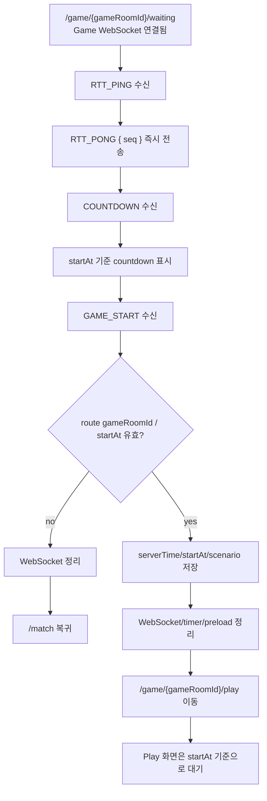
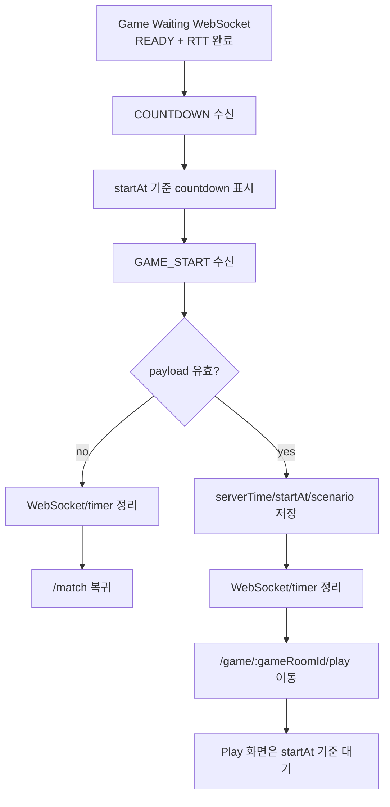

# Issue 88. Game Start Handling

## Feature Description

Vue 프론트엔드의 `/game/:gameRoomId/waiting` 페이지에서 Game WebSocket `COUNTDOWN`, `GAME_START` 이벤트를 실제 게임 시작 흐름으로 연결한다.

이번 이슈는 `docs/antigravity/frontend/front-plan.md`의 `9. [ ] 게임 시작 처리 구현`을 구현 기준으로 삼는다. Issue 86에서 Game Waiting WebSocket 연결, MP4 preload, `CLIENT_READY`, READY 대기, RTT 응답, 실패 복귀까지 완료했고, `COUNTDOWN`, `GAME_START`는 수신 가능하게만 두었다. 이번 이슈에서는 그 후속으로 countdown 표시, `GAME_START` payload 저장, `/game/:gameRoomId/play` 이동을 구현한다.

핵심은 `GAME_START`를 실제 게임 시작 데이터의 source of truth로 삼되, 클라이언트가 즉시 게임이 시작됐다고 판단하지 않는 것이다. 서버는 `COUNTDOWN`과 `GAME_START`를 `startAt` 전에 미리 전송하고, 프론트는 `GAME_START` 수신 후 play route로 이동하되 실제 게임 시작 기준은 payload의 `startAt`으로 유지한다.



이번 이슈에 포함되는 play route 작업은 저장된 game start payload를 읽고 다음 이슈가 사용할 시작 기준 데이터를 확인하는 최소 연결까지다. MP4 재생, HP bar/HUD, SMITE 버튼, `GAME_RESULT` 처리는 `front-plan.md` 10번 이후 이슈로 넘긴다.

## Backend Contract

| 항목                   | 기준                                               |
| ---------------------- | -------------------------------------------------- |
| Game WebSocket         | `/ws/game/{gameRoomId}?token={accessToken}`        |
| Countdown event        | `COUNTDOWN`                                        |
| Start event            | `GAME_START`                                       |
| Start source of truth  | `GAME_START.payload`                               |
| Start route transition | `GAME_START` 수신 후 `/game/:gameRoomId/play` 이동 |
| Actual start 기준      | `GAME_START.payload.startAt`                       |
| Clock 보정             | 이번 이슈에서 하지 않음                            |

`COUNTDOWN` payload:

```ts
interface CountdownPayload {
  gameRoomId: number;
  serverTime: number;
  startAt: number;
  countdownDisplaySeconds: number;
}
```

`GAME_START` payload:

```ts
interface GameStartPayload {
  gameRoomId: number;
  serverTime: number;
  startAt: number;
  scenario: {
    dragonMaxHp: number;
    durationMs: number;
    hpTimeline: {
      timeMs: number;
      hp: number;
    }[];
  };
}
```

저장할 game start payload:

```ts
interface StoredGameStartPayload {
  gameRoomId: number;
  serverTime: number;
  startAt: number;
  scenario: {
    dragonMaxHp: number;
    durationMs: number;
    hpTimeline: {
      timeMs: number;
      hp: number;
    }[];
  };
  receivedAt: string;
}
```

프론트 처리 기준:

- `COUNTDOWN`은 시작 예고 이벤트다.
- `COUNTDOWN` 수신 시 `startAt`까지 남은 시간을 계산하고, 남은 시간이 `countdownDisplaySeconds` 이하이면 countdown 숫자를 표시한다.
- 클라이언트가 메시지를 늦게 받으면 `3`이 아니라 `2` 또는 `1`부터 표시할 수 있다.
- `GAME_START`는 실제 게임 시작 데이터 이벤트다.
- `GAME_START` payload의 `serverTime`, `startAt`, `scenario`를 `sessionStorage`에 저장한다.
- `GAME_START` 수신 후 `/game/:gameRoomId/play`로 이동한다.
- `COUNTDOWN`과 `GAME_START`를 모두 수신한 경우 두 이벤트의 `startAt`은 같아야 한다.
- `COUNTDOWN` 없이 `GAME_START`가 먼저 오면 `GAME_START` payload를 source of truth로 삼아 저장하고 play로 이동한다.
- route param `gameRoomId`와 `GAME_START.payload.gameRoomId`가 다르면 잘못된 메시지로 보고 play 이동하지 않는다.
- `GAME_START` 수신 후 play route로 이동해도 실제 시작 기준은 `startAt`이다.
- server/client clock 보정은 후속 고도화로 보류하고, 현재 단계에서는 백엔드가 내려준 `serverTime`, `startAt`을 그대로 사용한다.

## Scope Boundary

이번 이슈에 포함한다.

- `COUNTDOWN` 수신 시 countdown 상태 표시 구현.
- `COUNTDOWN` payload의 `gameRoomId`, `serverTime`, `startAt`, `countdownDisplaySeconds` 반영.
- `GAME_START` 수신 시 `serverTime`, `startAt`, `scenario` 저장 구현.
- game start payload `sessionStorage` 저장/조회 helper 구현.
- 저장 key를 `smite.gameStartPayload:{gameRoomId}` 기준으로 구현.
- route param `gameRoomId`와 `GAME_START.payload.gameRoomId` 불일치 시 play 이동 금지 구현.
- `COUNTDOWN.startAt`과 `GAME_START.startAt` 불일치 시 play 이동 금지 구현.
- `GAME_START` 수신 후 `/game/:gameRoomId/play` 이동 구현.
- `GAME_START` 이후 늦은 WebSocket close/error callback이 waiting 상태를 다시 흔들지 않도록 guard 구현.
- `/game/:gameRoomId/play`에서 저장된 game start payload를 읽고 최소 시작 데이터 상태를 표시하는 stub 구현.
- Game Waiting / Game Play / storage helper 테스트 구현.
- 한/영 locale 문구 추가.
- 문서 정합성 반영.
- lint / format / typecheck / test / build 검증.
- desktop/mobile overflow 확인.

이번 이슈에서 제외한다.

- `/game/:gameRoomId/play` 실제 MP4 video 표시 구현.
- HP bar, countdown, smite button HUD 구현.
- `requestAnimationFrame` 기반 HP 표시 구현.
- SMITE 클릭 시 `{ type: 'SMITE', payload: null }` 전송 구현.
- `ERROR` 수신 시 play 화면 내 message 표시 구현.
- `GAME_RESULT` 수신 후 result route 이동 구현.
- Game summary API 호출 구현.
- server/client clock skew 보정 구현.
- WebSocket 재접속/복구 구현.
- Pinia 또는 전역 game store 도입.
- 새 패키지 추가.

## Tasks

### 1. 백엔드 GAME_START 계약 반영

- [x] backend issue-46의 `COUNTDOWN`, `GAME_START`, `startAt = serverNow + 4000ms` 정책 확인.
- [x] `docs/project/policy.md`의 GAME_START 시작 동기화 정책 확인.
- [x] `docs/project/websocket client.md`의 `COUNTDOWN`, `GAME_START` 클라이언트 처리 기준 확인.
- [x] `COUNTDOWN` payload shape가 프론트 타입에 이미 반영되어 있는지 확인.
- [x] `GAME_START` payload shape가 프론트 타입에 이미 반영되어 있는지 확인.
- [x] `COUNTDOWN`과 `GAME_START`가 같은 `startAt`을 써야 한다는 정책 문서 반영.
- [x] `GAME_START` 수신 후 play route 이동 정책 문서 반영.
- [x] 실제 시작 기준은 route 이동 시점이 아니라 `GAME_START.payload.startAt`이라는 정책 문서 반영.
- [ ] `COUNTDOWN` payload를 page handler에서 countdown 상태에 사용하도록 구현.
- [ ] `GAME_START` payload를 storage helper에 저장하도록 구현.

### 2. Game start payload storage 구현

- [x] `sessionStorage` 저장 helper 구현.
- [x] `sessionStorage` 조회 helper 구현.
- [x] 저장 key를 `smite.gameStartPayload:{gameRoomId}` 기준으로 구현.
- [x] 저장 payload에 `gameRoomId`, `serverTime`, `startAt`, `scenario`, `receivedAt` 포함.
- [x] route param `gameRoomId`와 저장 payload 불일치 시 `null` 반환 구현.
- [x] malformed JSON, payload shape 불일치, 빈 scenario 필수 값 누락 시 `null` 반환 구현.
- [x] `scenario.hpTimeline`은 `timeMs`, `hp` 숫자 배열로 검증.
- [x] storage 접근 불가능 환경에서는 안전하게 no-op 또는 `null` 반환.

### 3. GameWaitingPage countdown 처리 구현

- [ ] WebSocket 상태 모델에 countdown 표시 상태 추가.
- [ ] `COUNTDOWN` 수신 시 `gameRoomId`, `serverTime`, `startAt`, `countdownDisplaySeconds` 저장.
- [ ] route param `gameRoomId`와 `COUNTDOWN.payload.gameRoomId` 불일치 시 실패 복귀.
- [ ] `startAt`까지 남은 시간을 계산하는 timer 구현.
- [ ] 남은 시간이 `countdownDisplaySeconds` 이하가 되면 `3`, `2`, `1` 표시.
- [ ] 메시지를 늦게 받아 남은 시간이 2초대이면 `2`부터 표시 가능하도록 구현.
- [ ] countdown timer는 unmount, 실패 복귀, `GAME_START` 처리 시 정리.
- [ ] Game Waiting loading bar는 payload 수신율 의미로 유지하고 countdown 진행률과 섞지 않음.

### 4. GameWaitingPage GAME_START 처리 구현

- [ ] `GAME_START` 수신 시 route param `gameRoomId`와 payload `gameRoomId` 일치 검증.
- [ ] `COUNTDOWN`을 먼저 받은 경우 `COUNTDOWN.startAt`과 `GAME_START.startAt` 일치 검증.
- [ ] `COUNTDOWN` 없이 `GAME_START`가 먼저 오면 `GAME_START` payload를 source of truth로 저장.
- [ ] `GAME_START` payload를 `sessionStorage`에 저장.
- [ ] 저장 성공 후 WebSocket, watchdog, countdown timer, preload listener 정리.
- [ ] `GAME_START`를 final transition으로 표시해 늦은 close/error callback 무시.
- [ ] `/game/:gameRoomId/play` 이동 구현.
- [ ] play route 이동 실패 시 waiting 화면에 실패 상태를 유지하고 error message 표시.

### 5. GamePlayPage 최소 연결 구현

- [ ] `/game/:gameRoomId/play`에서 저장된 game start payload 조회.
- [ ] payload 없음, parse 실패, route param 불일치 시 `/match` 복귀.
- [ ] 유효 payload가 있으면 `gameRoomId`, `startAt`, `dragonMaxHp`, `durationMs`를 내부 상태로 보관.
- [ ] 화면에는 이번 이슈 범위가 시작 데이터 수신/대기임을 나타내는 최소 상태만 표시.
- [ ] 실제 MP4, HP bar, SMITE HUD는 구현하지 않음.
- [ ] `startAt` 기준 runtime 계산은 후속 play UI가 사용할 수 있도록 `getHpAtElapsedMs` helper와 연결 가능한 구조로 유지.

### 6. Locale 구현

- [ ] Game Waiting countdown 상태 문구 한/영 추가.
- [ ] Game Waiting game start 저장/이동 상태 문구 한/영 추가.
- [ ] Game Waiting start payload 오류 문구 한/영 추가.
- [ ] Game Play start payload missing 문구 한/영 추가.
- [ ] Locale toggle 시 countdown/start 상태 문구가 전환되는지 확인.

### 7. Test 구현

- [ ] game start payload 저장/조회 단위 테스트.
- [ ] malformed payload, route param 불일치, storage missing 테스트.
- [ ] `COUNTDOWN` 수신 시 countdown 상태와 문구 표시 테스트.
- [ ] countdown 남은 시간이 늦게 시작되는 경우 `2` 또는 `1`부터 표시 가능한지 테스트.
- [ ] `GAME_START` 수신 시 payload 저장 테스트.
- [ ] `GAME_START` 수신 시 `/game/:gameRoomId/play` 이동 테스트.
- [ ] `COUNTDOWN.startAt`과 `GAME_START.startAt` 불일치 시 play 이동 금지 테스트.
- [ ] `GAME_START.payload.gameRoomId`와 route param 불일치 시 play 이동 금지 테스트.
- [ ] `GAME_START` 이후 늦은 WebSocket close/error callback 무시 테스트.
- [ ] unmount 시 countdown timer 정리 테스트.
- [ ] GamePlayPage payload missing 또는 mismatch 시 `/match` 복귀 테스트.
- [ ] GamePlayPage 유효 payload 표시 테스트.
- [ ] locale toggle 시 countdown/start 문구 전환 테스트.

### 8. 문서 정합성 구현

- [ ] `front-plan.md` 9번 `게임 시작 처리 구현` 범위와 issue-88 범위 정합성 확인.
- [ ] 구현 완료 후 `front-plan.md` 9번 `게임 시작 처리 구현`을 `[x]`로 체크.
- [ ] 구현 완료 후 `front-plan.md`의 `## Issue Split Recommendation`에서 `게임 시작 처리 구현`을 `[x]`로 체크.
- [ ] `front-plan.md` 10번 `게임 플레이 화면 구현`은 후속으로 유지.
- [ ] `front-plan.md` 11번 `게임 결과 WebSocket 처리 구현`은 후속으로 유지.
- [ ] `front-plan.md` 12번 `게임 결과 Summary 화면 구현`은 후속으로 유지.
- [ ] issue-86의 `COUNTDOWN`, `GAME_START` 후속 이슈 문구와 issue-88 연결 확인.
- [ ] `docs/project/websocket client.md`의 `COUNTDOWN`, `GAME_START` 클라이언트 처리 정책과 정합성 확인.
- [ ] `docs/project/policy.md`의 GAME_START 시작 동기화 정책과 정합성 확인.
- [ ] backend issue-46의 `startAt`, countdown, scenario 전달 정책과 정합성 확인.
- [ ] 이번 이슈 PR 메시지 섹션 작성.

### 9. 검증

- [ ] `npm run test -- GameWaitingPage gameStart` 검증.
- [ ] `npm run format` 검증.
- [ ] `npm run lint` 검증.
- [ ] `npm run typecheck` 검증.
- [ ] `npm run test` 검증.
- [ ] `npm run build` 검증.
- [ ] desktop viewport에서 countdown/start UI overflow 확인.
- [ ] mobile viewport에서 countdown/start UI overflow 확인.

## Implementation Policy

- Game start 처리는 Game WebSocket 이벤트 기준으로 수행한다.
- `COUNTDOWN`은 시작 예고이며 scenario source가 아니다.
- `GAME_START`가 `serverTime`, `startAt`, `scenario`의 source of truth다.
- `GAME_START` 수신 후 `/game/:gameRoomId/play`로 이동한다.
- 실제 게임 시작 기준은 route 이동 시각이 아니라 `GAME_START.payload.startAt`이다.
- `COUNTDOWN`과 `GAME_START`가 모두 있으면 두 이벤트는 같은 `startAt`을 사용해야 한다.
- `COUNTDOWN` 없이 `GAME_START`가 먼저 와도 `GAME_START` payload가 유효하면 play로 이동한다.
- route param `gameRoomId`와 payload `gameRoomId`가 다르면 시작하지 않는다.
- server/client clock 보정은 이번 이슈에서 구현하지 않는다.
- MP4 preload 완료 여부는 `CLIENT_READY` 전제로 보고 `GAME_START` 단계에서 다시 검증하지 않는다.
- `GAME_START` 이전 실패는 유효한 판이 아니므로 큐 자동 복귀, LP, 전적 흐름과 섞지 않는다.
- 실패 복귀 시 `joinMatchQueue`, `leaveMatchQueue`를 호출하지 않는다.
- Game Waiting loading bar는 payload 수신율이며 countdown 진행률이나 게임 시작 준비율이 아니다.
- 상태 관리는 page local state와 `sessionStorage` helper로 유지하고 Pinia를 도입하지 않는다.
- 새 패키지를 추가하지 않는다.

## Acceptance Criteria

- `COUNTDOWN` 수신 시 `/game/:gameRoomId/waiting`에 countdown 상태가 표시됨.
- countdown은 `startAt`까지 남은 시간 기준으로 표시됨.
- `GAME_START` 수신 시 `serverTime`, `startAt`, `scenario`가 저장됨.
- `GAME_START` 수신 후 `/game/:gameRoomId/play`로 이동함.
- play route는 저장된 game start payload를 읽을 수 있음.
- payload 없음 또는 route param 불일치 시 play route에서 `/match`로 복귀함.
- `COUNTDOWN.startAt`과 `GAME_START.startAt` 불일치 시 play route 이동이 발생하지 않음.
- `GAME_START` 이후 늦은 WebSocket close/error callback이 waiting 상태를 실패로 되돌리지 않음.
- Game Waiting loading bar 의미가 payload 수신율로 유지됨.
- 실제 MP4/HP/SMITE/GAME_RESULT는 이번 이슈에서 구현하지 않음.
- lint / format / typecheck / test / build 통과.
- desktop/mobile viewport에서 horizontal overflow와 text overflow 후보가 없음.

## PR Message

## 📌 Summary

`/game/:gameRoomId/waiting` 화면에서 Game WebSocket `COUNTDOWN`, `GAME_START`를 처리해 게임 시작 payload를 저장하고 `/game/:gameRoomId/play`로 전환함.

이번 PR의 핵심은 Game Waiting 화면을 **게임 시작 직전 이벤트 수신 구간**까지 확장하되, 실제 게임 플레이 UI 책임은 `/game/:gameRoomId/play` 후속 이슈로 넘기는 것임. `GAME_START`는 scenario source of truth이고, route 이동이 일어나도 실제 시작 기준은 payload의 `startAt`으로 유지함.



핵심 정책:

- `COUNTDOWN`은 시작 예고 이벤트임.
- `GAME_START`가 시작 데이터와 scenario의 source of truth임.
- `GAME_START` 수신 후 play route로 이동하지만 실제 시작 기준은 `startAt`임.
- `COUNTDOWN`과 `GAME_START`가 모두 있으면 같은 `startAt`을 사용해야 함.
- server/client clock 보정은 이번 PR에서 하지 않음.
- Game Waiting loading bar는 payload 수신율 의미로 유지함.
- 실제 MP4 재생, HP bar, SMITE, `GAME_RESULT`는 후속 이슈 범위임.

백엔드와의 구현 계약:

- `COUNTDOWN` payload는 `gameRoomId`, `serverTime`, `startAt`, `countdownDisplaySeconds`를 사용함.
- `GAME_START` payload는 `gameRoomId`, `serverTime`, `startAt`, `scenario`를 사용함.
- `scenario`는 `dragonMaxHp`, `durationMs`, `hpTimeline`으로 구성됨.
- 프론트는 백엔드가 내려준 `serverTime`, `startAt`을 그대로 저장함.
- `GAME_START` 이전 실패는 유효한 판이 아니므로 record/LP/큐 자동 복귀 흐름을 만들지 않음.

## 📚 Changes

- `COUNTDOWN`을 시작 예고로 처리함.
  서버는 `startAt` 전에 `COUNTDOWN`을 미리 보내며, 프론트는 남은 시간이 표시 구간에 들어왔을 때 countdown을 렌더링함. 메시지를 늦게 받으면 `3`이 아니라 `2` 또는 `1`부터 보일 수 있지만, 실제 시작 기준은 계속 `startAt`임.

- `GAME_START`를 시작 데이터의 source of truth로 저장함.
  scenario를 route state가 아니라 `sessionStorage`에 저장해 새로고침과 route 이동 사이의 최소 지속성을 확보함. 기존 game waiting payload 저장 정책과 같은 방식이므로 새 전역 store나 패키지를 추가하지 않음.

- waiting과 play의 책임을 분리함.
  waiting은 `COUNTDOWN`, `GAME_START`를 받고 안전하게 play로 넘기는 역할만 담당함. play 화면은 저장된 시작 데이터를 확인하지만, 실제 MP4/HUD/SMITE 구현은 다음 이슈에서 처리함.

- `startAt` 검증을 엄격하게 유지함.
  `COUNTDOWN`과 `GAME_START`가 서로 다른 `startAt`을 가지면 두 클라이언트의 시작 기준이 어긋날 수 있으므로 시작하지 않음. 이는 백엔드가 두 메시지에 같은 `startAt`을 사용한다는 계약을 프론트에서도 방어하는 처리임.

- 실패 복귀 정책을 issue-86과 동일하게 유지함.
  `GAME_START` 이전 실패는 아직 유효한 판이 아니므로 LP, 전적, 큐 자동 복귀와 섞지 않고 `/match`로 복귀함. 실패 복귀 시 match join/leave API도 호출하지 않음.

- 문서 정합성을 같이 관리함.
  `front-plan.md`의 9번 구현 단계와 `Issue Split Recommendation` 체크 상태를 구현 완료 후 함께 갱신하고, 10번 이후 play/result/summary 범위는 후속으로 유지함.

## 📝 Note

- 실제 MP4 video 표시, HP bar, countdown HUD, SMITE 버튼은 이번 범위가 아님.
- `SMITE` 전송과 `GAME_RESULT` 수신 후 result route 이동은 후속 이슈에서 구현함.
- Game summary API 호출은 후속 결과 화면 이슈에서 구현함.
- clock skew 보정과 WebSocket 재접속/복구는 이번 범위가 아님.
- 새 패키지는 추가하지 않음.
- 검증 예정: `format`, `lint`, `typecheck`, 전체 test, production build, desktop/mobile overflow 확인.

## 📌 Related Issue

- Closes #88
