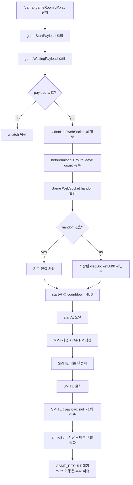
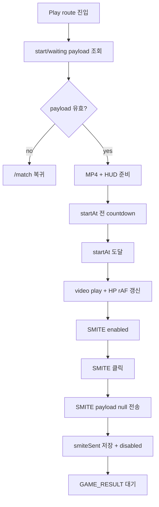

# Issue 90. Game Play Screen

## Feature Description

Vue 프론트엔드의 `/game/:gameRoomId/play` 페이지에서 저장된 `GAME_START` payload를 기준으로 실제 게임 플레이 화면을 구현한다.

이번 이슈는 `docs/antigravity/frontend/front-plan.md`의 `10. [ ] 게임 플레이 화면 구현`을 구현 기준으로 삼는다. Issue 88에서 `GAME_START` payload 저장, `/game/:gameRoomId/play` 이동, play route 최소 연결까지 완료했다. 이번 이슈에서는 그 후속으로 MP4 video 표시, countdown HUD, HP bar, SMITE button, `ERROR` 표시, 새로고침 경고/복구 정책을 구현한다.

핵심은 실제 시작 기준을 route 진입 시각이나 video 재생 시각이 아니라 백엔드가 확정한 `GAME_START.payload.startAt`으로 유지하는 것이다. 클라이언트 MP4 재생이 늦거나 브라우저 렌더링이 지연되어도 서버 종료 기준은 `startAt + scenario.durationMs`이며, 프론트는 그 기준을 화면에 반영한다.

MP4 파일은 Git에 포함하지 않는다. 백엔드 Issue 38 정책에 따라 실제 파일은 로컬/배포 환경에서 `backend/smite-api/src/main/resources/static/assets/game/dragon-view.mp4`에 배치하고, 서버는 모든 gameRoom에 동일한 `match_response_result.game.videoUrl=/assets/game/dragon-view.mp4`를 내려준다. 프론트는 이 `videoUrl`을 source of truth로 사용하며, 로컬 UI 검증에서는 동일 파일을 mock/static server로 서빙할 수 있다.



이번 이슈에 포함되는 `GAME_RESULT` 처리는 수신 안정성 확인과 route 이동 금지까지다. `GAME_RESULT` payload shape 반영, `/game/:gameRoomId/result` 이동, summary API 호출은 `front-plan.md` 11번 이후 이슈로 넘긴다.

## Backend Contract

| 항목                  | 기준                                                                 |
| --------------------- | -------------------------------------------------------------------- |
| MP4 source            | `match_response_result.game.videoUrl`                                |
| MP4 local path        | `backend/smite-api/src/main/resources/static/assets/game/dragon-view.mp4` |
| MP4 Git policy        | 실제 `dragon-view.mp4`는 Git에 포함하지 않음                         |
| Game WebSocket source | `match_response_result.game.webSocketUrl`                            |
| Start source of truth | `GAME_START.payload.startAt`                                         |
| HP source of truth    | `GAME_START.payload.scenario.hpTimeline`                             |
| SMITE client message  | `{ type: 'SMITE', payload: null }`                                    |
| SMITE timestamp       | 클라이언트가 전송하지 않음                                           |
| ERROR handling        | play 화면 내 message 표시                                            |
| GAME_RESULT handling  | 이번 이슈에서는 result route 이동 금지                               |
| Clock 보정            | 이번 이슈에서 하지 않음                                              |
| Refresh policy        | 완전 차단이 아니라 경고 + 저장 payload 기반 복구/재연결 정책으로 처리 |

`StoredGameStartPayload`:

```ts
interface StoredGameStartPayload {
  gameRoomId: number;
  serverTime: number;
  startAt: number;
  scenario: {
    dragonMaxHp: number;
    durationMs: number;
    hpTimeline: {
      timeMs: number;
      hp: number;
    }[];
  };
  receivedAt: string;
}
```

`GameWaitingPayload` 중 play에서 다시 사용하는 값:

```ts
interface GameWaitingPayload {
  game: {
    gameRoomId: number;
    videoUrl: string;
    webSocketUrl: string;
  };
}
```

SMITE client message:

```ts
interface SmiteClientMessage {
  type: 'SMITE';
  payload: null;
}
```

`ERROR` server message:

```ts
interface ErrorServerMessage {
  type: 'ERROR';
  payload: {
    code: string;
    reason: string;
  };
}
```

프론트 처리 기준:

- MP4 preload 완료 여부는 waiting 단계의 `CLIENT_READY` 전제로 본다.
- play 단계에서 MP4 load 완료를 게임 시작 조건으로 다시 사용하지 않는다.
- `startAt` 도달 전에는 countdown HUD를 표시하고 SMITE를 비활성화한다.
- `startAt` 도달 후 MP4 재생과 HP 갱신을 시작한다.
- HP는 `scenario.hpTimeline` 기준으로 계산한다.
- SMITE payload에는 client timestamp, elapsedMs, HP 등 임의 데이터를 넣지 않는다.
- SMITE는 한 번만 전송한다.
- SMITE 전송 후 중간 ack를 기대하지 않는다.
- `ERROR` 수신 시 play 화면 내 message를 표시한다.
- `GAME_RESULT` 수신 전까지 result route로 이동하지 않는다.
- `GAME_START` 이후 disconnect는 서버에서 gameRoom `ABORTED`가 아니다. 서버는 기존 `startAt`, HP scenario, 수신된 SMITE action 기준으로 판을 끝까지 판정한다.
- WebSocket이 끊기거나 새로고침되어도 서버 DB 결과가 최종 기준이다. 프론트는 저장된 payload로 복구/재연결을 시도한다.

## Scope Boundary

이번 이슈에 포함한다.

- MP4 파일을 백엔드 static resource 경로에 로컬 배치하고 Git 추적 대상에서 제외.
- MP4 프레임을 확인해 HP bar, countdown HUD, SMITE button 위치 결정.
- `/game/:gameRoomId/play`에서 저장된 `GAME_START` payload 조회.
- `/game/:gameRoomId/play`에서 저장된 `gameWaitingPayload`의 `videoUrl`, `webSocketUrl` 조회.
- MP4 video 표시.
- `startAt` 전 countdown HUD 구현.
- `startAt` 도달 시 video 재생 시작.
- `requestAnimationFrame` 기반 elapsed time 계산.
- `scenario.hpTimeline` 기준 HP bar와 HP text 표시.
- waiting/play `beforeunload` 경고 구현.
- waiting/play route leave guard 구현.
- 새로고침 후 waiting은 저장된 waiting payload로 복구 시도.
- 새로고침 후 play는 저장된 start payload와 waiting payload로 복구 시도.
- Play WebSocket은 waiting에서 handoff하는 구조로 우선 설계.
- handoff가 없으면 저장된 `webSocketUrl`로 재연결 허용.
- `startAt` 전 SMITE button 비활성화.
- `startAt` 이후 SMITE button 활성화.
- SMITE 클릭 시 `{ type: 'SMITE', payload: null }` 1회 전송.
- SMITE 전송 상태를 `sessionStorage`에 저장해 새로고침 후 중복 활성화 방지.
- `ERROR` 수신 시 play 화면 내 message 표시.
- `GAME_RESULT` 수신 시 result route 이동 금지.
- Game Play locale 문구 한/영 추가.
- Game Play 관련 테스트 구현.
- 문서 정합성 반영.
- lint / format / typecheck / test / build 검증.
- desktop/mobile overflow 확인.
- SMITE `{ payload: null }` 전송 브라우저 검증.

이번 이슈에서 제외한다.

- `GAME_RESULT` payload 상세 처리.
- `GAME_RESULT` 수신 후 `/game/:gameRoomId/result` 이동.
- Game summary API 호출.
- LP/rank/series 표시.
- WebSocket 재접속 고도화.
- clock skew 보정.
- PixiJS, canvas, Web Worker 도입.
- 새 패키지 추가.

## MP4 Frame Analysis

- MP4 파일은 `backend/smite-api/src/main/resources/static/assets/game/dragon-view.mp4`에 로컬 배치하며 Git에는 포함하지 않음.
- 프레임 분석은 동일 파일을 로컬 정적 경로로 서빙해 `/assets/game/dragon-view.mp4`로 `200 OK`, `Content-Type: video/mp4` 응답을 확인한 뒤 진행함.
- video metadata는 `1920x1080`, `32.6796s`로 확인함.
- desktop `1440x900`에서 `object-fit: cover` 적용 시 source 좌우 약 `96px`씩 crop되고 세로 crop은 없음. 중앙 드래곤/플레이어 영역과 하단 원본 게임 HUD가 핵심 시각 영역임.
- mobile `390x844`에서 `object-fit: cover` 적용 시 source 좌우 약 `710px`씩 crop되고 세로 crop은 없음. 모바일은 중앙 전투 영역이 화면 대부분을 차지하므로 큰 고정 UI를 중앙에 두지 않음.
- HP bar는 상단 band에 compact하게 배치함. 백엔드 HP source는 `GAME_START.payload.scenario.hpTimeline`이며, 영상 내부 원본 HUD와 섞지 않기 위해 프론트 HP bar는 별도 overlay로 표시함.
- countdown HUD는 startAt 이전 짧은 전환 피드백이므로 전체 화면 translucent overlay로 허용하되 중앙 피사체를 완전히 가리지 않도록 투명도와 duration을 조정함.
- SMITE button은 하단 원본 HUD와 겹치지 않게 bottom edge에 붙이지 않고, desktop/mobile 모두 하단 HUD 위 또는 우측 하단 상단부에 floating 배치함.

## Tasks

### 1. MP4 asset / 프레임 분석

- [x] `backend/smite-api/src/main/resources/static/assets/game/dragon-view.mp4` 경로에 로컬 MP4 파일 배치.
- [x] 실제 MP4 파일을 Git 추적 대상에서 제외.
- [x] local static/mock server에서 `/assets/game/dragon-view.mp4` 접근 확인.
- [x] Chrome video element 기반으로 대표 프레임 확인.
- [x] desktop `1440x900`에서 video crop과 핵심 피사체 위치 확인.
- [x] mobile `390x844`에서 video crop과 핵심 피사체 위치 확인.
- [x] HP bar, countdown HUD, SMITE button이 핵심 피사체를 가리지 않는 위치 결정.

### 2. Play state source 정리

- [x] `gameStartPayload`를 play 시작 데이터 source로 유지.
- [x] `gameWaitingPayload`에서 `videoUrl`, `webSocketUrl` 조회.
- [x] route param `gameRoomId`와 저장 payload 불일치 시 `/match` 복귀 유지.
- [x] payload missing 또는 malformed 시 `/match` 복귀 유지.
- [x] `startAt`, `scenario.durationMs`, `scenario.hpTimeline`을 play state로 연결.
- [x] `startAt` 기준 elapsed 계산 구조 구현.

### 3. Refresh / leave guard 구현

- [x] waiting page에 `beforeunload` 경고 추가.
- [x] play page에 `beforeunload` 경고 추가.
- [x] waiting page 내부 route leave guard 추가.
- [x] play page 내부 route leave guard 추가.
- [x] 정상 `/game/:gameRoomId/play` 전환은 waiting route leave guard에서 허용.
- [x] 새로고침 후 waiting은 저장된 waiting payload로 WebSocket/preload 흐름 복구 시도.
- [x] 새로고침 후 play는 저장된 start payload와 waiting payload로 화면 복구 시도.
- [ ] 새로고침 후 `smiteSent`가 저장되어 있으면 SMITE button을 다시 활성화하지 않음.

### 4. Game WebSocket handoff / reconnect 구현

- [x] waiting에서 play로 Game WebSocket 연결을 handoff하는 구조 설계.
- [x] `GAME_START` 성공 후 waiting에서 WebSocket을 즉시 close하지 않도록 정책 조정.
- [x] play가 handoff 받은 WebSocket으로 `SMITE`, `ERROR`, `GAME_RESULT`를 처리할 수 있게 연결.
- [x] handoff가 없는 직접 진입/새로고침은 저장된 `webSocketUrl`로 재연결 허용.
- [x] access token은 기존 native WebSocket 정책대로 query parameter로 붙임.
- [x] play unmount 시 WebSocket 정리.
- [x] 재연결 실패 시 `/match` 자동 복귀 대신 play 화면 내 오류 표시 우선.

### 5. MP4 / countdown / HP HUD 구현

- [ ] `videoUrl` 기준 MP4 video 표시.
- [ ] `startAt` 전에는 video 자동 재생을 시작하지 않음.
- [ ] `startAt` 전 countdown HUD 표시.
- [ ] `startAt` 도달 시 video play 호출.
- [ ] video load/error 상태 표시.
- [ ] `requestAnimationFrame` loop 구현.
- [ ] `elapsedMs = Date.now() - startAt` 계산.
- [ ] `getHpAtElapsedMs(scenario, elapsedMs)`로 현재 HP 계산.
- [ ] HP bar width와 HP text 표시.
- [ ] `scenario.durationMs` 이후에는 natural death 결과 대기 상태 표시.
- [ ] unmount 시 rAF 정리.

### 6. SMITE UI 구현

- [ ] `startAt` 전 SMITE button disabled.
- [ ] `startAt` 이후 SMITE button enabled.
- [ ] video 재생 지연 여부와 SMITE 활성화 기준을 섞지 않음.
- [ ] SMITE 클릭 시 `{ type: 'SMITE', payload: null }` 전송.
- [ ] SMITE payload에 client timestamp, elapsedMs, HP 등 임의 데이터 추가 금지.
- [ ] SMITE 클릭 후 즉시 button disabled.
- [ ] `smiteSent`를 `sessionStorage`에 저장.
- [ ] 새로고침 후 `smiteSent`가 있으면 button disabled 유지.
- [ ] 중복 클릭과 중복 전송 방지.
- [ ] 서버 중간 ack 없이 `GAME_RESULT`를 기다리는 상태 표시.

### 7. ERROR / GAME_RESULT 수신 처리

- [ ] `ERROR` 수신 시 `payload.reason` 또는 기본 오류 문구를 play 화면에 표시.
- [ ] `ERROR` 수신 시 WebSocket 연결을 임의로 닫지 않음.
- [ ] `GAME_RESULT` 수신 가능 상태로 둠.
- [ ] `GAME_RESULT` 수신 시 이번 이슈에서는 result route 이동하지 않음.
- [ ] `GAME_RESULT` 수신 후 결과 대기/후속 처리 예정 상태를 표시할지 여부 확인.

### 8. Locale 구현

- [ ] Game Play countdown 문구 한/영 추가.
- [ ] HP label 문구 한/영 추가.
- [ ] SMITE button 문구 한/영 추가.
- [ ] SMITE sent / waiting result 문구 한/영 추가.
- [ ] video load/error 문구 한/영 추가.
- [ ] refresh warning 보조 문구 한/영 추가.
- [ ] WebSocket reconnect/error 문구 한/영 추가.

### 9. Test 구현

- [ ] 유효 payload에서 play UI 표시 테스트.
- [ ] payload missing 또는 mismatch 시 `/match` 복귀 테스트 유지/보강.
- [ ] MP4 video가 `videoUrl`을 source로 사용하는지 테스트.
- [ ] `startAt` 전 countdown 표시 테스트.
- [ ] `startAt` 전 SMITE disabled 테스트.
- [ ] `startAt` 이후 SMITE enabled 테스트.
- [ ] SMITE 클릭 시 `{ type: 'SMITE', payload: null }` 전송 테스트.
- [ ] SMITE 중복 전송 방지 테스트.
- [ ] 새로고침 복구 시 `smiteSent`가 있으면 SMITE disabled 유지 테스트.
- [ ] HP timeline 기반 HP 표시 테스트.
- [ ] `ERROR` 수신 시 message 표시 테스트.
- [ ] `GAME_RESULT` 수신 시 result route 이동하지 않는 테스트.
- [ ] route leave guard 테스트.
- [ ] unmount 시 rAF/WebSocket/beforeunload 정리 테스트.

### 10. 문서 정합성 구현

- [ ] `front-plan.md` 10번 `게임 플레이 화면 구현` 범위와 issue-90 범위 정합성 확인.
- [ ] 구현 완료 후 `front-plan.md` 10번 `게임 플레이 화면 구현`을 `[x]`로 체크.
- [ ] 구현 완료 후 `front-plan.md`의 `## Issue Split Recommendation`에서 `게임 플레이 화면 구현`을 `[x]`로 체크.
- [ ] `front-plan.md` 11번 `게임 결과 WebSocket 처리 구현`은 후속으로 유지.
- [ ] `front-plan.md` 12번 `게임 결과 Summary 화면 구현`은 후속으로 유지.
- [ ] issue-88의 play 후속 범위 문구와 issue-90 연결 확인.
- [ ] `docs/project/websocket client.md`의 SMITE/ERROR/GAME_RESULT 정책과 정합성 확인.
- [ ] `docs/project/policy.md`의 GAME_START 이후 disconnect/SMITE/natural death 정책과 정합성 확인.
- [ ] 이번 이슈 PR 메시지 섹션 작성.

### 11. 검증

- [ ] `npm run test -- GamePlayPage gameWebSocket hpScenario` 검증.
- [ ] `npm run format` 검증.
- [ ] `npm run lint` 검증.
- [ ] `npm run typecheck` 검증.
- [ ] `npm run test` 검증.
- [ ] `npm run build` 검증.
- [ ] desktop `1440x900`에서 play UI overflow 확인.
- [ ] mobile `390x844`에서 play UI overflow 확인.
- [ ] MP4 video render 확인.
- [ ] SMITE `{ payload: null }` 전송 브라우저 확인.
- [ ] 새로고침 경고/복구 브라우저 확인.

## Implementation Policy

- 실제 시작 기준은 route 진입 시각이 아니라 `GAME_START.payload.startAt`이다.
- MP4 preload 완료 여부는 waiting 단계의 `CLIENT_READY` 전제로 보고 play에서 다시 시작 조건으로 쓰지 않는다.
- video 재생 지연, 브라우저 pause, 렌더링 지연은 서버 종료 기준을 바꾸지 않는다.
- 서버 종료 기준은 `startAt + scenario.durationMs`다.
- HP 표시는 `scenario.hpTimeline` 기준으로 계산한다.
- clock skew 보정은 이번 이슈에서 구현하지 않는다.
- SMITE payload에는 client timestamp를 넣지 않는다.
- SMITE payload는 `null`로 고정한다.
- SMITE는 한 번만 전송한다.
- SMITE 전송 후 서버 중간 ack를 기대하지 않는다.
- SMITE 전송 상태는 `sessionStorage`에 저장해 새로고침 후 중복 입력을 막는다.
- `ERROR`는 play 화면 내 message로 표시한다.
- `GAME_RESULT` 수신 전까지 result route로 이동하지 않는다.
- 새로고침은 완전 차단이 불가능하므로 경고와 저장 payload 기반 복구/재연결로 처리한다.
- `GAME_START` 이후 disconnect는 서버 기준으로 gameRoom `ABORTED`가 아니므로 play 화면에서는 복구/재연결을 우선한다.
- PixiJS, canvas, Web Worker는 MVP에서 도입하지 않는다.
- 새 패키지를 추가하지 않는다.

## Acceptance Criteria

- 백엔드 static resource 또는 로컬 mock/static server 기준 `/assets/game/dragon-view.mp4`가 정상 접근 가능함.
- `/game/:gameRoomId/play`에서 MP4 video가 표시됨.
- `startAt` 전 countdown HUD가 표시됨.
- `startAt` 도달 후 video play와 HP 갱신이 시작됨.
- HP bar와 HP text가 `scenario.hpTimeline` 기준으로 변함.
- `startAt` 전 SMITE button은 비활성화됨.
- `startAt` 이후 SMITE button은 활성화됨.
- SMITE 클릭 시 `{ type: 'SMITE', payload: null }`만 1회 전송됨.
- SMITE 클릭 후 button이 비활성화됨.
- 새로고침 후 `smiteSent`가 있으면 SMITE button이 다시 활성화되지 않음.
- `ERROR` 수신 시 play 화면 내 message가 표시됨.
- `GAME_RESULT`를 받아도 이번 이슈에서는 result route 이동이 발생하지 않음.
- waiting/play에서 새로고침 경고와 route leave guard가 동작함.
- Game Waiting loading bar 의미가 payload 수신율로 유지됨.
- 실제 result 화면 이동, summary API 호출, LP/rank/series 표시는 이번 이슈에서 구현하지 않음.
- lint / format / typecheck / test / build 통과.
- desktop/mobile viewport에서 horizontal overflow와 text overflow 후보가 없음.

## PR Message

## 📌 Summary

`/game/:gameRoomId/play` 화면에서 저장된 `GAME_START` payload와 `gameWaitingPayload`를 기준으로 실제 게임 플레이 UI를 구현함.

이번 PR의 핵심은 play 화면을 **서버가 확정한 시작 시각과 HP scenario를 표시하는 실행 구간**으로 확장하되, 결과 화면 책임은 후속 이슈로 넘기는 것임. 실제 시작 기준은 route 진입 시각이나 video 재생 시각이 아니라 `GAME_START.payload.startAt`이며, SMITE 판정은 서버 수신 시각 기준이므로 프론트는 timestamp를 보내지 않음.



핵심 정책:

- `GAME_START.payload.startAt`이 실제 시작 기준임.
- `scenario.hpTimeline`이 HP 표시 source of truth임.
- MP4 preload 완료는 waiting 단계의 `CLIENT_READY` 전제로 봄.
- SMITE payload는 `null`이며 client timestamp를 넣지 않음.
- SMITE는 한 번만 전송하고 중간 ack를 기대하지 않음.
- 새로고침은 경고와 저장 payload 기반 복구/재연결로 처리함.
- `GAME_RESULT` 수신 후 result route 이동은 후속 이슈 범위임.

백엔드와의 구현 계약:

- 백엔드가 내려준 `game.videoUrl`을 MP4 source로 사용함.
- 백엔드가 내려준 `game.webSocketUrl`을 SMITE/GAME_RESULT WebSocket source로 사용함.
- `ERROR`는 play 화면 내 message로 표시함.
- `GAME_START` 이후 disconnect는 서버에서 gameRoom `ABORTED`가 아니므로 복구/재연결을 우선함.
- 서버 종료 기준은 `startAt + scenario.durationMs`이며 video 지연이 이 기준을 바꾸지 않음.

## 📚 Changes

- MP4 파일 책임을 백엔드 static resource 정책과 맞춤.
  백엔드 Issue 38 계약에 따라 실제 `dragon-view.mp4`는 Git에 포함하지 않고 `backend/smite-api/src/main/resources/static/assets/game`에 로컬/배포 환경별로 배치함. 프론트는 파일을 import하거나 public asset으로 소유하지 않고, 백엔드가 내려준 `game.videoUrl=/assets/game/dragon-view.mp4`만 source로 사용함.

- Play 화면을 `startAt` 기준 실행 구간으로 구현함.
  route 진입 시각이나 video 재생 준비 시각을 기준으로 삼지 않고, 저장된 `GAME_START.payload.startAt`으로 countdown, video play, HP 갱신, SMITE 활성화를 계산함.

- HP 표시를 scenario 기반으로 구현함.
  `scenario.hpTimeline`과 `requestAnimationFrame` 기반 elapsed time을 연결해 HP bar와 HP text를 갱신함. 서버 판정과 같은 시작 기준을 쓰되, clock 보정은 이번 범위에서 하지 않음.

- SMITE 입력을 서버 권위 정책에 맞춤.
  클라이언트 timestamp나 HP 값을 보내지 않고 `{ type: 'SMITE', payload: null }`만 전송함. 전송 후 버튼을 즉시 비활성화하고 `smiteSent`를 저장해 새로고침 후 중복 입력을 막음.

- 새로고침 완전 차단 대신 경고/복구 정책을 구현함.
  브라우저 새로고침은 100% 금지할 수 없으므로 waiting/play에서 `beforeunload`와 route leave guard를 사용하고, 실제 새로고침 후에는 저장 payload로 복구/재연결을 시도함.

- 결과 화면 책임을 분리함.
  `GAME_RESULT`는 이번 이슈에서 route 이동 기준으로 쓰지 않음. 결과 route 이동과 summary API 호출은 후속 이슈에서 처리함.

## 📝 Note

- `GAME_RESULT` 처리와 `/game/:gameRoomId/result` 이동은 이번 범위가 아님.
- Game summary API 호출, LP/rank/series 표시는 후속 이슈에서 구현함.
- clock skew 보정과 WebSocket 재접속 고도화는 이번 범위가 아님.
- PixiJS, canvas, Web Worker는 도입하지 않음.
- 새 패키지는 추가하지 않음.
- 실제 `dragon-view.mp4`는 Git에 포함하지 않음.
- 로컬 UI 검증 시 백엔드 static 경로의 MP4를 mock/static server로 `/assets/game/dragon-view.mp4`에 서빙함.
- 검증 예정: `format`, `lint`, `typecheck`, 전체 test, production build, desktop/mobile overflow, MP4 render, SMITE payload 확인.

## 📌 Related Issue

- Closes #90
