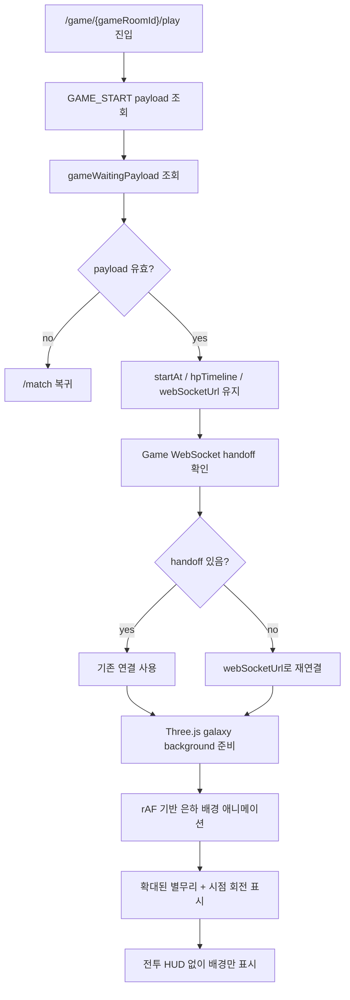
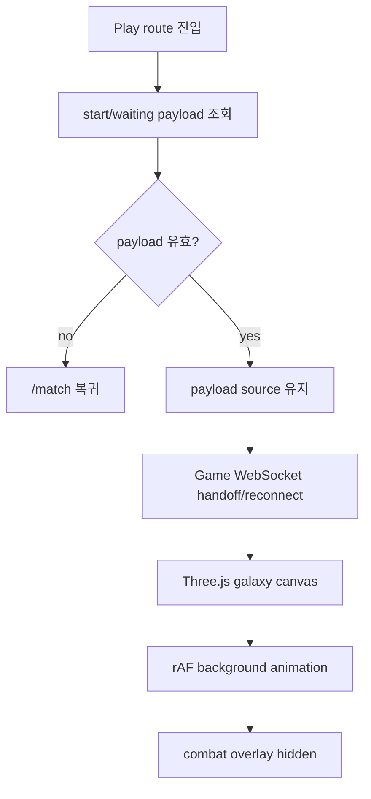

# Issue 90. Game Play Screen

## Feature Description

이번 이슈는 `docs/antigravity/frontend/front-plan.md`의 `10. 게임 플레이 화면 구현` 범위를 구현한다. Issue 86~88에서 `GAME_START` 저장, Game WebSocket handoff, `/game/:gameRoomId/play` 최소 연결까지 끝났으므로, 이번 이슈에서는 play route를 실제 확인 가능한 게임 화면으로 확장한다.

초기 검토에서는 백엔드가 내려준 MP4 위에 HP bar를 tracking overlay로 덮는 방식과 3D 스타 코어 전투 화면을 시도했다. 하지만 현재 디자인 확인 단계에서는 전투 UI보다 배경 품질을 먼저 확정하는 것이 우선이므로, 이번 이슈는 MP4 렌더링과 고정 Star Core/LIGHTNING/HUD 표시를 제거하고 `background-new-sharp.png` 기반의 선명한 우주 배경과 Three.js full-screen 은하 배경을 구현한다. 배경은 멀리 있는 평면 이미지를 보여주는 방식이 아니라, 카메라가 별무리 안에 들어간 것처럼 처음부터 확대된 별들이 화면을 채우고 시점 기준으로 천천히 회전하는 구조로 구현한다.



이번 이슈에 포함되는 화면 범위는 우주 배경과 움직이는 스타 코어 위의 HP indicator까지다. 고정 전투 HUD, countdown, LIGHTNING button, 고도화된 target interaction, result route 이동, summary API 호출은 후속 이슈로 넘긴다.

## Backend Contract

| 항목                  | 기준                                                        |
| --------------------- | ----------------------------------------------------------- |
| Play route source     | `GAME_START.payload` + `gameWaitingPayload`                 |
| Start source of truth | `GAME_START.payload.startAt`                                |
| HP source of truth    | `GAME_START.payload.scenario.hpTimeline`                    |
| Duration source       | `GAME_START.payload.scenario.durationMs`                    |
| Game WebSocket source | `match_response_result.game.webSocketUrl`                   |
| LIGHTNING client wire | 현재 백엔드 호환을 위해 `{ type: 'SMITE', payload: null }` 전송 |
| LIGHTNING timestamp   | 클라이언트가 전송하지 않음                                  |
| ERROR handling        | 이번 배경 단계에서는 data attribute 상태 유지               |
| GAME_RESULT handling  | 이번 이슈에서는 route 이동 금지                             |
| Refresh policy        | 차단이 아니라 경고 + 저장 payload 기반 복구                 |
| MP4 policy            | play 화면에서는 렌더링하지 않음                             |
| 3D render policy      | Three.js WebGL canvas를 full-bleed galaxy background로 사용 |

`StoredGameStartPayload`:

```ts
interface StoredGameStartPayload {
  gameRoomId: number;
  serverTime: number;
  startAt: number;
  scenario: {
    starCoreMaxHp?: number;
    dragonMaxHp?: number; // legacy backend payload
    durationMs: number;
    hpTimeline: {
      timeMs: number;
      hp: number;
    }[];
  };
  receivedAt: string;
}
```

`GameWaitingPayload` 중 play에서 사용하는 값:

```ts
interface GameWaitingPayload {
  game: {
    gameRoomId: number;
    webSocketUrl: string;
  };
}
```

프론트 처리 기준:

- HTTP 응답이나 route 진입 시각은 play 시작 기준이 아님.
- 실제 시작 기준은 백엔드가 발행한 `GAME_START.payload.startAt`임.
- 이번 배경 단계에서는 고정 HUD/LIGHTNING/GAME_RESULT를 화면에 표시하지 않음.
- 저장된 payload와 WebSocket source는 유지해 route 복구/연결 정책이 깨지지 않게 함.
- Game Waiting 단계의 MP4 preload/`CLIENT_READY` 계약은 유지하지만, Play 화면에서는 MP4를 렌더링하지 않음.

## Scope Boundary

이번 이슈에 포함:

- `/game/:gameRoomId/play`에서 저장된 `GAME_START` payload 조회.
- 저장된 `gameWaitingPayload`에서 `webSocketUrl` 조회.
- route param `gameRoomId`와 저장 payload 불일치 시 `/match` 복귀.
- `startAt` 기준 elapsed time 계산 유지.
- Three.js 기반 우주 배경 구현.
- `gamebackground.png` 레퍼런스처럼 좌측 warm pink/gold 고밀도 별무리와 우측 dark violet/blue 저밀도 별무리 구현.
- `galaxy-portfolio`처럼 particle star field를 사용하되, play 화면은 시작 즉시 확대된 별무리 안에서 시점 회전을 보는 구조로 구현.
- 움직이는 스타 코어 위에 `scenario.hpTimeline` 기반 HP indicator와 현재 HP 숫자 표시.
- 전투 HUD 없이 full-screen canvas와 vignette만 표시.
- Game WebSocket handoff 우선 사용.
- handoff가 없으면 저장된 `webSocketUrl`로 재연결.
- WebSocket `ERROR`, `GAME_RESULT` 수신 상태는 data attribute로 유지.
- waiting/play 새로고침 경고와 route leave guard 유지.
- Game Play locale/test/document 정합성 반영.
- format / lint / typecheck / test / build 검증.
- desktop/mobile overflow 확인.

이번 이슈에서 제외:

- Play 화면 MP4 렌더링.
- MP4 위 HP bar 좌표 tracking.
- 3D 스타 코어 모델/타겟팅.
- 고정 전투 HUD HP bar / countdown / LIGHTNING button 표시.
- LIGHTNING 클릭 전송 UI.
- `GAME_RESULT` payload 상세 UI.
- `/game/:gameRoomId/result` route 이동.
- Game summary API 호출.
- LP/rank/series 표시.
- clock skew 보정.
- 고도화된 WebSocket 재접속 backoff.
- PixiJS, Web Worker 도입.
- Three.js 외 새 렌더링 패키지 추가.

## Tasks

### 1. Play state source 정리

- [x] `gameStartPayload`를 play 시작 데이터 source로 유지.
- [x] `gameWaitingPayload`에서 `webSocketUrl` 조회.
- [x] `videoUrl`은 play 화면 렌더링 source에서 제거.
- [x] route param `gameRoomId`와 저장 payload 불일치 시 `/match` 복귀 유지.
- [x] `startAt`, `durationMs`, `hpTimeline`을 play state로 연결.

### 2. Game WebSocket handoff / reconnect 구현

- [x] waiting에서 handoff 받은 Game WebSocket을 우선 사용.
- [x] handoff가 없으면 저장된 `webSocketUrl`로 재연결.
- [x] play에서 LIGHTNING wire type `SMITE`, `ERROR`, `GAME_RESULT`를 처리.
- [x] play unmount 시 WebSocket 정리.
- [x] 재연결 실패 시 play 화면 내 오류 표시.

### 3. Three.js Galaxy Background 구현

- [x] MP4 렌더링 제거.
- [x] Three.js WebGL canvas 기반 우주 배경 렌더링.
- [x] `gamebackground.png` 레퍼런스 기반 warm pink/gold + dark violet/blue 색감 반영.
- [x] 고밀도 immersive star belt 구현.
- [x] 카메라 주변 star sphere와 전방 star mist로 시작 화면을 별들로 채움.
- [x] 레이어 이동이 아니라 viewer/camera 기준 회전이 느껴지도록 애니메이션 구현.
- [x] 빈 어두운 구간을 채우는 저투명 성운 cloud와 glow star field 구현.
- [x] `gamebackground.png`처럼 좌측 warm gold/pink 고밀도 영역과 우측 violet/blue 대각선 sparkle ribbon 보강.
- [x] 큰 성운 cloud 위에 작은 고밀도 sharp galaxy cluster를 얹어 뭉친 은하 영역의 선명도 보강.
- [x] 백엔드 상태와 무관한 순수 배경 효과로 시야 내에서 랜덤 이동하는 스타 코어 구현.
- [x] 스타 코어 위에 `hpPercent` 기반 HP indicator 구현.
- [x] HP indicator 위에 `currentHp` 기반 흰색 숫자 표시.
- [x] `requestAnimationFrame`으로 elapsed time 갱신.
- [x] 상단 navigation/header 제거.
- [x] HP/LIGHTNING/countdown/reticle 등 전투 overlay 제거.
- [x] unmount 시 rAF 정리.

### 4. LIGHTNING UI 구현

- [x] 이번 배경 단계에서는 LIGHTNING button을 렌더링하지 않음.
- [x] `game.webSocketUrl` 연결 source는 유지.
- [x] LIGHTNING 전송 UI와 중복 전송 방지는 후속 전투 UI 단계로 넘김. 실제 전송 wire type은 백엔드 호환상 `SMITE` 유지.

### 5. Locale 구현

- [x] Game Play countdown 문구 한/영 추가.
- [x] HP label 문구 한/영 추가.
- [x] 기존 LIGHTNING 문구는 유지하되 이번 화면에는 표시하지 않음.
- [x] WebSocket reconnect/error 문구 한/영 유지.

### 6. Test 구현

- [x] 유효 payload에서 play UI 표시 테스트.
- [x] payload missing 또는 mismatch 시 `/match` 복귀 테스트.
- [x] MP4/video 없이 Three.js galaxy canvas가 렌더링되는지 테스트.
- [x] 전투 overlay 없이 배경만 렌더링되는지 테스트.
- [x] `startAt`/HP 계산 data attribute 유지 테스트.
- [x] `ERROR` 수신 시 화면 message 없이 data attribute 상태 유지 테스트.
- [x] `GAME_RESULT` 수신 시 result route 이동하지 않는 테스트.
- [x] route leave guard 테스트.
- [x] unmount 시 rAF/WebSocket/beforeunload 정리 테스트.

### 7. 문서 정합성 구현

- [x] issue-90을 MP4/스타 코어 overlay 정책에서 Three.js galaxy background 정책으로 갱신.
- [x] `front-plan.md` 10번 `게임 플레이 화면 구현` 범위와 issue-90 범위 정합성 확인.
- [x] `front-plan.md` `## Issue Split Recommendation`에서 10번 진행 범위 확인.
- [x] `front-plan.md` 11번 `게임 결과 WebSocket 처리 구현`은 후속으로 유지.
- [x] `front-plan.md` 12번 `게임 결과 Summary 화면 구현`은 후속으로 유지.
- [x] `docs/project/websocket client.md`의 LIGHTNING wire type `SMITE`/ERROR/GAME_RESULT 정책과 정합성 확인.
- [x] `docs/project/policy.md`의 GAME_START 이후 disconnect/LIGHTNING/natural death 정책과 정합성 확인.
- [x] 이번 이슈 PR 메시지 섹션 보강.

### 8. 검증

- [x] `npm run test -- GamePlayPage` 검증.
- [x] `npm run format` 검증.
- [x] `npm run lint` 검증.
- [x] `npm run typecheck` 검증.
- [x] `npm run test` 검증.
- [x] `npm run build` 검증.
- [x] desktop `1440x900` overflow 확인.
- [x] mobile `390x844` overflow 확인.
- [x] LIGHTNING wire type `SMITE` `{ payload: null }` 전송 브라우저 확인.

## Implementation Policy

- 실제 시작 기준은 route 진입 시각이 아니라 `GAME_START.payload.startAt`임.
- 이번 배경 단계에서는 스타 코어 HP indicator/숫자 외 고정 HP/LIGHTNING/ERROR message를 화면에 표시하지 않음.
- 프론트는 전투 판정 source of truth가 아님.
- `GAME_RESULT` 수신 전까지 result route로 이동하지 않음.
- 새로고침은 완전 차단이 불가능하므로 경고와 저장 payload 기반 복구/재연결로 처리함.
- Play 화면은 MP4 렌더링과 MP4 좌표 tracking을 사용하지 않음.
- Three.js WebGL canvas는 arena 전체를 채우는 full-bleed galaxy background로 렌더링함.
- Three.js galaxy background는 카메라 주변 particle field를 source로 삼고, 시점 회전을 통해 “별무리 안에서 보는” 느낌을 우선함.
- Game Waiting의 MP4 preload/`CLIENT_READY` 정책은 이번 변경으로 바꾸지 않음.
- PixiJS, Web Worker는 MVP에서 도입하지 않음.
- Three.js 구현을 위해 `three`, `@types/three`를 추가함.

## Acceptance Criteria

- `/game/:gameRoomId/play`에서 MP4 video element가 렌더링되지 않음.
- `/game/:gameRoomId/play`에서 Three.js galaxy canvas와 스타 코어 HP indicator/숫자만 표시됨.
- play 진입 직후 빈 우주가 아니라 확대된 별무리가 화면을 채움.
- galaxy background가 정지 이미지처럼 보이지 않고 시점 기준으로 천천히 회전함.
- MP4 video, 3D Star Core model, 고정 HUD HP bar, countdown, reticle, LIGHTNING button이 표시되지 않음.
- `startAt` 기준 elapsed/HP 계산 data attribute는 유지됨.
- `ERROR` 수신 상태는 data attribute로 유지됨.
- `GAME_RESULT`를 받아도 이번 이슈에서는 result route 이동이 발생하지 않음.
- waiting/play에서 새로고침 경고와 route leave guard가 동작함.
- 실제 result 화면 이동, summary API 호출, LP/rank/series 표시는 이번 이슈에서 구현하지 않음.
- format / lint / typecheck / test / build 통과.
- desktop/mobile viewport에서 horizontal overflow와 text overflow 후보가 없음.

## PR Message

## 📌 Summary

`/game/:gameRoomId/play` 화면을 MP4 overlay/스타 코어 전투 방식에서 Three.js 기반 full-screen galaxy background로 전환함.

이번 PR의 핵심은 전투 UI를 잠시 걷어내고 **우주 배경 품질과 움직이는 스타 코어를 먼저 확정할 수 있는 full-screen WebGL 배경**을 만드는 것임. 저장된 `GAME_START`/waiting payload와 WebSocket source는 유지하지만, 화면에는 고정 HUD/LIGHTNING/countdown/target overlay를 표시하지 않음.



핵심 정책:

- `GAME_START.payload.startAt`이 실제 시작 기준임.
- `scenario.hpTimeline`은 스타 코어 HP indicator의 source로 사용함.
- Play 화면은 MP4 렌더링과 MP4 좌표 tracking을 사용하지 않음.
- Three.js WebGL canvas를 full-bleed galaxy background로 사용함.
- 고정 HP HUD/LIGHTNING/countdown/target overlay는 이번 배경 단계에서 숨김.
- 새로고침은 경고와 저장 payload 기반 복구/재연결로 처리함.
- `GAME_RESULT` 수신 후 result route 이동은 후속 이슈 범위임.

백엔드와의 구현 계약:

- `GAME_START.payload.startAt`과 `scenario.hpTimeline`은 data attribute/source로 유지하고, HP indicator fill은 `hpPercent`, 숫자는 `currentHp`를 사용함.
- `game.webSocketUrl`을 Game WebSocket source로 유지함.
- 이번 배경 단계에서는 LIGHTNING UI를 렌더링하지 않음.
- `ERROR`는 화면 message가 아니라 data attribute 상태로 유지함.
- `GAME_RESULT`는 이번 이슈에서 수신만 확인하고 route 이동은 하지 않음.

## 📚 Changes

- MP4 overlay와 3D 스타 코어 전투 UI를 제거하고 Three.js galaxy background로 전환함.
  원본 영상 위 HP bar tracking은 스타 코어 움직임, viewport crop, object-fit 차이에 따라 좌표가 쉽게 깨지는 구조였음. 이번 단계의 목표는 배경 품질 확인이므로 `gamebackground.png`의 warm pink/gold star field와 dark violet galaxy 느낌을 절차형 Three.js particles/nebula로 구현함.

- 별 배경을 평면 레이어가 아니라 immersive particle field로 구성함.
  참고한 `galaxy-portfolio`는 Three.js 기반 우주 이동 경험을 중심에 둔다. 이 프로젝트의 play 화면은 스크롤 여행이 아니라 게임 배경이므로, 별을 멀리 있는 2D belt처럼 두지 않고 카메라 주변 star sphere와 전방 star mist에 배치해 진입 즉시 별들이 가득 차게 함. 애니메이션도 단순 layer drift보다 viewer/camera 회전을 우선해 사용자가 우주 안에서 둘러보는 느낌을 확인할 수 있게 함.

- Play 화면의 backend source는 유지함.
  route 진입 시각이나 렌더링 준비 시각을 source로 삼지 않고, 저장된 `GAME_START.payload`와 `gameWaitingPayload`를 그대로 읽어 route 복구와 WebSocket 연결 정책을 유지함.

- 전투 overlay를 의도적으로 숨김.
  고정 HUD HP bar, countdown, reticle, LIGHTNING button은 이번 배경 확인을 방해하므로 렌더링하지 않음. 다만 움직이는 스타 코어의 상태를 보여주기 위한 작은 HP indicator/숫자는 WebGL 내부에 붙이고, source는 백엔드 `scenario.hpTimeline`에서 계산된 `hpPercent`와 `currentHp`로 제한함.

- 새로고침 완전 차단 대신 경고/복구 정책을 유지함.
  브라우저 새로고침은 100% 금지할 수 없으므로 waiting/play에서 `beforeunload`와 route leave guard를 사용하고, 실제 새로고침 후에는 저장 payload로 복구/재연결을 시도함.

- 결과 화면 책임을 분리함.
  `GAME_RESULT`는 이번 이슈에서 route 이동 기준으로 쓰지 않음. 결과 route 이동과 summary API 호출은 후속 이슈에서 처리함.

## 📝 Note

- `GAME_RESULT` 처리와 `/game/:gameRoomId/result` 이동은 이번 범위가 아님.
- 고정 HP HUD/LIGHTNING/countdown/target UI는 이번 배경 단계 범위가 아님.
- Game summary API 호출, LP/rank/series 표시는 후속 이슈에서 구현함.
- clock skew 보정과 WebSocket 재접속 고도화는 이번 범위가 아님.
- PixiJS, Web Worker는 도입하지 않음.
- Three.js 구현을 위해 `three`, `@types/three`를 추가함.
- Game Waiting의 MP4 preload/`CLIENT_READY` 정책은 이번 PR에서 바꾸지 않음.
- 검증 완료: `format`, `lint`, `typecheck`, 전체 test, production build, desktop/mobile overflow, WebGL canvas nonblank/frame change 확인.

## 📌 Related Issue

- Closes #90
