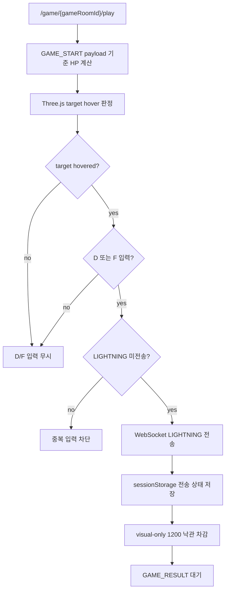
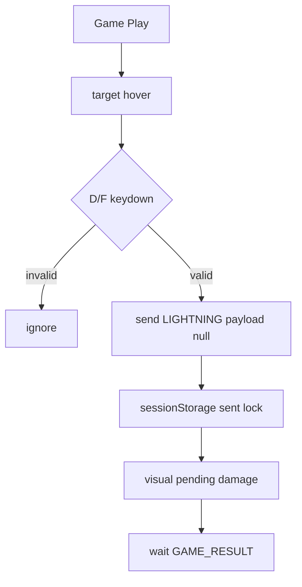

# Issue 92. LIGHTNING Combat Input UI

## Feature Description

이번 이슈는 `docs/antigravity/frontend/front-plan.md`의 `11. LIGHTNING 전투 입력 UI 구현` 범위를 구현한다. `/game/:gameRoomId/play`에서 움직이는 스타 코어 위에 정확히 hover한 상태로 `D` 또는 `F` 키를 누를 때만 LIGHTNING을 1회 전송한다.



이번 이슈의 핵심은 전투 입력 UX를 붙이되, 프론트가 판정 source of truth가 되지 않게 하는 것이다. Three.js hover 판정은 사용자의 입력 가능 조건으로만 사용하고, 백엔드로는 좌표나 키 정보를 보내지 않는다. 백엔드는 기존 계약대로 WebSocket 수신 시각과 `GAME_START` 시나리오, 저장된 `game_actions`를 기준으로 승패와 HP 판정을 수행한다.

이번 이슈에 포함되는 범위:

- 움직이는 스타 코어 hover 판정.
- hover 중 `D` 또는 `F` 키 입력 시 LIGHTNING 1회 전송.
- sessionStorage 기반 gameRoom 단위 중복 전송 방지.
- LIGHTNING 전송 후 visual-only HP 낙관 차감.
- `GAME_RESULT.actions` 수신 시 확정 데미지 기준 HP 보정 모델 준비.
- 서버 결과 전까지 승패/결과 화면 이동 금지.

후속 이슈로 미루는 범위:

- `GAME_RESULT` 수신 후 `/game/:gameRoomId/result` 이동.
- result payload 임시 저장/전환 UX 고도화.
- Game summary API 호출.
- LP/rank/series 표시.
- 상대 LIGHTNING 실패를 실시간으로 반영하는 중간 WebSocket event 추가.

## Backend Contract

Game WebSocket client message:

```json
{ "type": "LIGHTNING", "payload": null }
```

프론트가 보내지 않는 값:

- client timestamp
- 현재 HP
- elapsed time
- target 좌표
- pointer 좌표
- `D`/`F` 중 어떤 키를 눌렀는지

백엔드 source of truth:

- WebSocket `serverReceiveTimeMs`
- `gameRoom.gameStartTime`
- `gameRoom.scenarioData`
- 기존 `game_actions`

백엔드 판정 정책:

- LIGHTNING 데미지는 `1200`.
- `lightningTimeMs = serverReceiveTimeMs - gameStartTime`.
- 현재 HP는 scenario HP에서 이전 LIGHTNING 데미지를 차감해 계산.
- LIGHTNING 적용 전 HP가 `1200` 이하이면 kill.
- kill이면 `GAME_RESULT(reason=LIGHTNING_KILL)` broadcast.
- 두 유저가 모두 LIGHTNING을 사용했고 kill이 없으면 `GAME_RESULT(reason=BOTH_LIGHTNINGS_USED_DRAW)` broadcast.
- 자연사 종료는 scheduler가 `GAME_RESULT(reason=NATURAL_DEATH_DRAW)`를 broadcast.
- kill 실패 LIGHTNING은 중간 성공 이벤트를 보내지 않는다.

`GAME_RESULT` payload shape:

```ts
interface GameResultPayload {
  gameRoomId: number;
  result: "PLAYER1_WIN" | "PLAYER2_WIN" | "DRAW";
  winnerUserId: number | null;
  reason: string;
  finishedAt: number;
  actions: {
    userId: number;
    serverReceiveTime: number;
    lightningTimeMs: number;
    starCoreHpAtLightning: number;
    damage: number;
    afterHp: number;
    isKill: boolean;
  }[];
}
```

프론트 처리 기준:

- HTTP API는 사용하지 않는다.
- WebSocket `LIGHTNING` 전송은 command이고, 전송 성공이 승패 확정 기준이 아니다.
- 최종 승패는 `GAME_RESULT` 수신 기준이다.
- 이번 이슈에서는 `GAME_RESULT` 수신 후 result route로 이동하지 않는다.
- `GAME_RESULT.actions[].afterHp`는 LIGHTNING 수신 시점의 판정 HP이며 현재 프레임 HP로 직접 덮어쓰지 않는다.

## Scope Boundary

이번 이슈에 포함:

- `threeGalaxyBackgroundScene`에서 움직이는 스타 코어 hover 상태 계산.
- hover 상태를 `GamePlayPage`로 callback 전달.
- hover 상태에 따라 입력 가능 시각 상태 표시.
- `D` 또는 `F` keydown 처리.
- hover가 아닐 때 keydown 무시.
- 이미 전송한 gameRoom이면 keydown 무시.
- WebSocket 연결이 없거나 error/close 상태이면 keydown 무시.
- `sendLightning()`으로 `{ type: 'LIGHTNING', payload: null }` 전송.
- 전송 직후 sessionStorage에 `league-of-star.gamePlayLightningSent:{gameRoomId}` 저장.
- 전송 실패 시 sessionStorage 저장하지 않음.
- `pendingDamage=1200` visual-only HP 차감.
- `GAME_RESULT.actions.length * 1200` 확정 데미지 계산.
- display HP 단조 감소 clamp 적용.
- Locale/Test/문서 정합성 반영.

이번 이슈에서 제외:

- 백엔드 WebSocket contract 변경.
- `LIGHTNING_APPLIED` 같은 중간 이벤트 추가.
- target 좌표 기반 hit 판정.
- 클라이언트 timestamp 보정.
- `GAME_RESULT` 수신 후 route 이동.
- summary API 호출.
- 결과 화면 UI.
- LP/rank/series 반영.
- 새 패키지 추가.

## Tasks

### 1. Backend Contract 재확인

- [x] 백엔드 `LIGHTNING` payload가 비어 있어야 하는 계약 확인.
- [x] `sendLightning()`이 `{ type: 'LIGHTNING', payload: null }`만 보내는지 유지.
- [x] `GAME_RESULT.actions[].afterHp`를 현재 HP로 직접 쓰지 않는 정책 문서화.
- [x] kill 실패 LIGHTNING에는 중간 성공 이벤트가 없음을 문서화.

확인 결과:

- 백엔드 `GameWebSocketClientMessage.hasInvalidLightningPayload()`는 `LIGHTNING` payload가 `null` 또는 빈 object가 아니면 invalid로 본다.
- 백엔드 handler는 invalid payload를 `INVALID_LIGHTNING_PAYLOAD` `ERROR`로 응답하고 LIGHTNING service로 넘기지 않는다.
- 프론트 `GameWebSocketConnection.sendLightning()`은 `{ type: 'LIGHTNING', payload: null }`만 전송한다.
- 백엔드 `GameLightningJudgementService`는 client time 없이 `serverReceiveTimeMs - gameStartTime` 기준으로 `lightningTimeMs`를 계산한다.
- 백엔드 `GameResultPayload.ActionSummary.afterHp`는 `starCoreHpAtLightning - 1200`으로 계산된 action 시점 결과이므로, 프론트 현재 HP로 직접 덮어쓰지 않는다.
- 백엔드 `GameLightningService`는 kill 실패 후 양쪽 LIGHTNING이 모두 소모되지 않은 경우 중간 응답 없이 종료 deadline만 앞당기고 `GAME_RESULT`를 보내지 않는다.

### 2. Three.js Hover Contract 구현

- [x] `threeGalaxyBackgroundScene` controller callback에 hover 상태 전달 추가.
- [x] Raycaster 또는 sprite bounds 기준으로 움직이는 스타 코어 hover 판정 구현.
- [x] hover 상태는 visual/input 조건으로만 사용하고 payload로 전달하지 않음.
- [x] hover 중 target glow/outline/커서 상태를 강화.
- [x] unmount 시 pointer listener 정리.

구현 결과:

- `threeGalaxyBackgroundScene`은 canvas `pointermove` / `pointerleave`를 받아 Three.js `Raycaster`로 움직이는 스타 코어 sprite hover 여부를 계산한다.
- hover 결과는 `onTargetHoverChange` callback으로만 `GamePlayPage`에 전달한다.
- `GamePlayPage`는 hover 상태를 `data-game-star-targeted`로 노출하되 LIGHTNING payload나 WebSocket 전송 로직에는 연결하지 않는다.
- hover 중에는 cursor를 `crosshair`로 바꾸고 target halo opacity/scale, 캐릭터 scale/color를 강화한다.
- scene dispose 시 pointer listener를 제거하고 hover 상태를 false로 복귀한다.

### 3. LIGHTNING Keyboard Input 구현

- [x] `GamePlayPage`에서 `D`/`F` keydown listener 등록.
- [x] hover true일 때만 LIGHTNING 입력 허용.
- [x] `D`/`F` 외 키는 무시.
- [x] 이미 전송한 gameRoom이면 중복 전송 차단.
- [x] WebSocket 연결 불가, error, close, result 수신 이후에는 전송 차단.
- [x] key repeat으로 중복 전송되지 않게 방어.

구현 결과:

- `GamePlayPage`는 mount 시 `window.keydown` listener를 등록하고 unmount 시 제거한다.
- LIGHTNING 입력 가능 조건은 `target hover`, `D/F key`, `WebSocket connected 또는 handoff`, `미전송`, `GAME_RESULT 미수신`, `key repeat 아님`으로 제한한다.
- 조건이 맞으면 기존 `GameWebSocketConnection.sendLightning()`을 호출하므로 wire payload는 `{ type: 'LIGHTNING', payload: null }` 계약을 그대로 따른다.
- 전송 성공 직후 페이지 상태의 `lightningSent`를 true로 바꿔 같은 화면 생명주기에서 중복 입력을 막는다.
- 전송 실패 시 `lightningSent`를 false로 유지하고 socket error 상태만 표시한다.
- sessionStorage 영구 저장과 새로고침 후 중복 방지는 4번 `LIGHTNING Storage / State 구현`에서 처리한다.

### 4. LIGHTNING Storage / State 구현

- [ ] sessionStorage key를 `league-of-star.gamePlayLightningSent:{gameRoomId}`로 유지.
- [ ] 전송 성공 직후 sessionStorage 저장.
- [ ] 새로고침/재진입 후 같은 gameRoom이면 전송 불가 상태로 복구.
- [ ] 전송 실패 시 sessionStorage 저장하지 않고 error 상태만 표시.
- [ ] 프론트는 전송 성공 직후 승패를 확정하지 않음.

### 5. HP Display Model 구현

- [ ] 기본 HP는 `GAME_START.scenario.hpTimeline`과 `startAt` 기준으로 계산.
- [ ] LIGHTNING 전송 직후 `pendingDamage=1200` visual-only 차감 적용.
- [ ] `GAME_RESULT.actions` 수신 시 확정 데미지를 `actions.length * 1200`으로 계산.
- [ ] `afterHp`를 현재 HP로 직접 덮어쓰지 않음.
- [ ] `displayHp = min(previousDisplayHp, rawEffectiveHp)`로 HP 증가 방지.
- [ ] HP 보정은 표시용이며 승패 판정과 분리.

### 6. UI / Locale 구현

- [ ] hover 가능 상태를 canvas 위에서 확인 가능하게 표시.
- [ ] `D / F` 입력 준비 상태 HUD 구현.
- [ ] LIGHTNING 전송 후 서버 결과 대기 상태 표시.
- [ ] WebSocket error/close 상태에서 입력 불가 표시.
- [ ] 한국어/영어 locale 문구 추가.
- [ ] 모바일 viewport에서도 텍스트 overflow 없게 구성.

### 7. Test 구현

- [ ] hover false에서 `D`/`F` 입력 시 `sendLightning()` 미호출 검증.
- [ ] hover true에서 `D` 입력 시 `sendLightning()` 1회 호출 검증.
- [ ] hover true에서 `F` 입력 시 `sendLightning()` 1회 호출 검증.
- [ ] 기타 키와 key repeat 무시 검증.
- [ ] 같은 gameRoom 중복 전송 차단 검증.
- [ ] sessionStorage 전송 상태가 있으면 재진입 후 전송 차단 검증.
- [ ] WebSocket 연결 실패/close/error 상태에서 전송 차단 검증.
- [ ] 전송 실패 시 sessionStorage 미저장 검증.
- [ ] LIGHTNING payload가 null만 포함하는지 검증.
- [ ] pending damage와 confirmed damage가 HP display에 반영되는지 검증.
- [ ] `afterHp`로 현재 HP를 덮어쓰지 않는지 검증.
- [ ] display HP가 다시 증가하지 않는지 검증.

### 8. 문서 정합성 구현

- [ ] `front-plan.md` 11번 입력 방식을 `hover + D/F`로 갱신.
- [ ] `front-plan.md` Issue Split Recommendation 상태 확인.
- [ ] issue-90에서 LIGHTNING UI가 후속 범위였다는 설명과 충돌 없는지 확인.
- [ ] 백엔드 issue-48/50의 LIGHTNING/GAME_RESULT 정책과 정합성 확인.
- [ ] PR 섹션을 계약/정책 중심으로 보강.

### 9. 검증

- [ ] `npm run test -- GamePlayPage gameWebSocket` 검증.
- [ ] `npm run format` 검증.
- [ ] `npm run lint` 검증.
- [ ] `npm run typecheck` 검증.
- [ ] `npm run test` 검증.
- [ ] `npm run build` 검증.
- [ ] desktop `1440x900` overflow 확인.
- [ ] mobile `390x844` overflow 확인.
- [ ] 브라우저에서 hover + `D`/`F` 입력 시 payload가 `{ type: 'LIGHTNING', payload: null }`인지 확인.

## Implementation Policy

- 프론트 hover는 입력 가능 조건일 뿐 판정 source가 아니다.
- 프론트는 target 좌표, pointer 좌표, 키 종류, timestamp, HP, elapsed time을 백엔드로 보내지 않는다.
- 최종 승패는 `GAME_RESULT`만 기준으로 한다.
- LIGHTNING 전송 성공은 command ack도 아니며, 브라우저 send 성공은 서버 판정 성공을 의미하지 않는다.
- kill 실패 LIGHTNING은 중간 이벤트가 없으므로 상대 LIGHTNING 실패를 실시간 HP에 반영하지 않는다.
- 낙관 HP 차감은 내 입력에 대한 visual-only feedback이다.
- `GAME_RESULT.actions[].afterHp`는 현재 HP가 아니라 해당 action 시점의 판정 결과다.
- 현재 표시 HP는 `현재 scenario HP - 확정 damage - pending damage`로 계산한다.
- display HP는 단조 감소만 허용한다.
- 실패/close/error 상황에서 서버 결과를 임의 생성하지 않는다.
- 이번 이슈에서 result route 이동과 summary API 호출은 하지 않는다.
- 새 패키지를 추가하지 않는다.

## Acceptance Criteria

- hover하지 않은 상태에서 `D`/`F`를 눌러도 LIGHTNING이 전송되지 않는다.
- 움직이는 스타 코어에 hover한 상태에서 `D` 또는 `F`를 누르면 LIGHTNING이 한 번만 전송된다.
- 전송 payload가 정확히 `{ type: 'LIGHTNING', payload: null }`이다.
- 클라이언트 timestamp/HP/elapsed/좌표/키 정보가 payload에 포함되지 않는다.
- 같은 gameRoom에서 새로고침/재진입 후에도 중복 전송되지 않는다.
- 전송 실패 시 중복 방지 저장을 하지 않고 재시도 가능 상태를 유지한다.
- 전송 직후 HP가 visual-only로 차감된다.
- 서버 결과 보정 시 HP가 다시 차오르지 않는다.
- `afterHp`를 현재 HP로 직접 덮어쓰지 않는다.
- `GAME_RESULT` 수신 전까지 승패/결과 화면 이동이 발생하지 않는다.
- format/lint/typecheck/test/build가 통과한다.
- desktop/mobile viewport에서 horizontal overflow와 text overflow 후보가 없다.

## PR Message

## PR 작성 방법

## 📌 Summary

이번 PR은 Game Play 화면에 LIGHTNING 전투 입력을 추가함. 사용자는 움직이는 스타 코어 위에 정확히 hover한 상태에서 `D` 또는 `F`를 눌러야 하며, 프론트는 이 조건을 입력 UX로만 사용하고 백엔드 판정 payload에는 어떤 좌표나 시간 값도 보내지 않음.



핵심 정책:

- LIGHTNING payload는 `{ type: 'LIGHTNING', payload: null }`만 사용함.
- hover/키 입력/HP/elapsed/좌표는 백엔드로 보내지 않음.
- 프론트 낙관 차감은 visual-only이며 승패 판정 기준이 아님.
- `GAME_RESULT.actions[].afterHp`는 현재 HP가 아니라 action 시점 HP로 해석함.
- result route 이동과 summary API 호출은 후속 이슈로 유지함.

백엔드와의 구현 계약:

- 백엔드는 WebSocket 수신 시각과 저장된 scenario/action을 source of truth로 삼음.
- kill 여부는 서버가 `starCoreHpAtLightning <= 1200` 기준으로 판정함.
- kill 실패 LIGHTNING은 중간 성공 이벤트가 없으므로 프론트가 상대 실패 입력을 실시간 확정하지 않음.
- 최종 전환 기준은 `GAME_RESULT`이며, 이번 이슈에서는 route 이동하지 않음.

## 📚 Changes

- 입력 조건을 hover + `D`/`F`로 좁힘.
  버튼을 누르면 언제든 발동되는 구조보다 게임성이 있고, target 좌표를 서버에 보내는 구조보다 백엔드 판정 계약이 단순함. hover는 클라이언트 UX 조건으로만 쓰고, 서버 판정은 기존 WebSocket 수신 시각 기준을 유지함.

- LIGHTNING 중복 전송을 gameRoom 단위로 막음.
  백엔드는 `game_actions` unique 제약으로 최종 방어하지만, 프론트도 sessionStorage로 같은 gameRoom 중복 입력을 막아 사용자가 같은 입력을 여러 번 눌러도 계약 밖 요청을 반복하지 않게 함.

- HP 표시를 effective HP 모델로 정리함.
  `afterHp`를 현재 HP로 덮어쓰면 서버 결과가 늦게 도착했을 때 HP가 다시 차는 것처럼 보일 수 있음. 그래서 현재 scenario HP에서 확정 데미지와 pending 데미지를 빼고, display HP는 단조 감소만 허용함.

- 결과 책임을 분리함.
  LIGHTNING 전송 후에도 프론트가 승패를 확정하지 않고 `GAME_RESULT`를 기다림. result route 이동과 summary API 호출은 후속 이슈로 유지해 이번 PR이 입력 UI와 표시 모델에 집중하도록 함.

## 📝 Note

- 이번 PR에서 result route 이동은 제외함.
- Game summary API 호출은 제외함.
- 상대 LIGHTNING 실패 실시간 반영은 백엔드 중간 이벤트가 없어 제외함.
- 새 패키지는 추가하지 않음.
- 검증 결과를 여기에 기재함.

## 📌 Related Issue

- Closes #92
