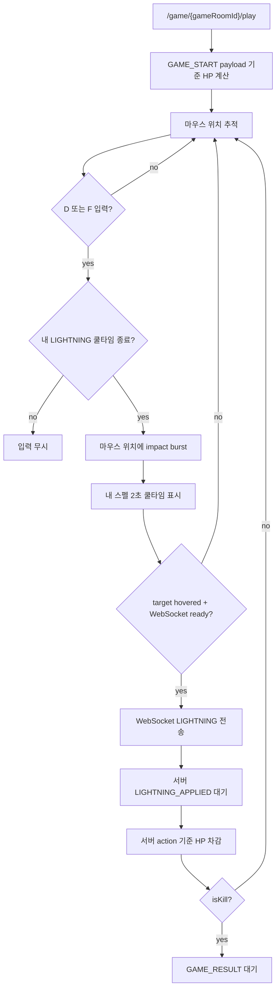
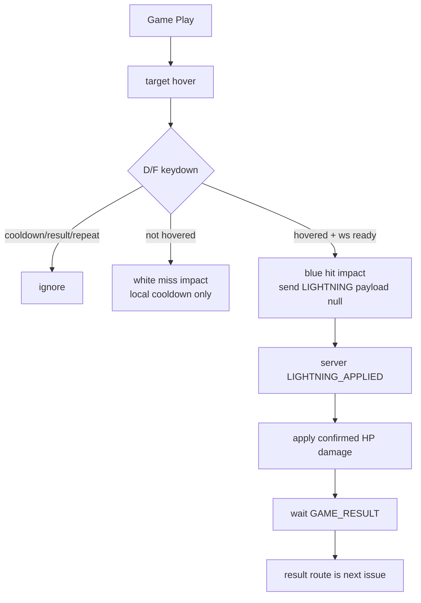

# Issue 92. LIGHTNING Combat Input UI

## Feature Description

이번 이슈는 `docs/antigravity/frontend/front-plan.md`의 `11. LIGHTNING 전투 입력 UI 구현` 범위를 구현한다. `/game/:gameRoomId/play`에서 움직이는 스타 코어 위에 정확히 hover한 상태로 `D` 또는 `F` 키를 누를 때만 LIGHTNING을 전송한다. LIGHTNING은 1회성 스킬이 아니라 2초 쿨타임을 가진 반복 스킬이다.



이번 이슈의 핵심은 반복 전투 입력 UX를 붙이되, 프론트가 판정 source of truth가 되지 않게 하는 것이다. Three.js hover 판정은 사용자의 입력 가능 조건으로만 사용하고, 백엔드로는 좌표나 키 정보를 보내지 않는다. 백엔드는 WebSocket 수신 시각, `GAME_START` 시나리오, 저장된 `game_actions`를 기준으로 HP와 kill을 판정한다.

이번 이슈에 포함되는 범위:

- 움직이는 스타 코어 hover 판정.
- `D` 또는 `F` 키 입력 시 마우스 위치에 LIGHTNING 시전 impact burst 표시.
- hover 중 `D` 또는 `F` 키 입력 시에만 백엔드 LIGHTNING 전송.
- 내 스펠 중앙 하단 배치. 상대 스펠 HUD는 표시하지 않고 상대 LIGHTNING은 빨간 impact burst와 HP 반영으로 표현.
- 2초 쿨타임 시계방향 overlay 표시.
- 서버 `LIGHTNING_APPLIED` 수신 시 HP 확정 차감.
- kill이면 `GAME_RESULT` 수신까지 대기.
- 서버 결과 전까지 승패/결과 화면 이동 금지.

후속 이슈로 미루는 범위:

- `GAME_RESULT` 수신 후 `/game/:gameRoomId/result` 이동.
- result payload 임시 저장/전환 UX 고도화.
- Game summary API 호출.
- LP/rank/series 표시.
- target 좌표 기반 서버 hit 판정.

## Backend Contract

Game WebSocket client message:

```json
{ "type": "LIGHTNING", "payload": null }
```

프론트가 보내지 않는 값:

- client timestamp
- 현재 HP
- elapsed time
- target 좌표
- pointer 좌표
- `D`/`F` 중 어떤 키를 눌렀는지

백엔드 source of truth:

- WebSocket `serverReceiveTimeMs`
- `gameRoom.gameStartTime`
- `gameRoom.scenarioData`
- 기존 `game_actions`

백엔드 판정 정책:

- LIGHTNING 데미지는 `1200`.
- LIGHTNING 쿨타임은 유저별 `2000ms`.
- `lightningTimeMs = serverReceiveTimeMs - gameStartTime`.
- 현재 HP는 scenario HP에서 이전 저장 action 수만큼 LIGHTNING 데미지를 차감해 계산.
- LIGHTNING 적용 전 HP가 `1200` 이하이면 kill.
- LIGHTNING이 저장되면 `LIGHTNING_APPLIED`를 broadcast.
- kill이면 같은 action을 포함해 `GAME_RESULT(reason=LIGHTNING_KILL)`를 broadcast.
- 자연사 종료는 scheduler가 `GAME_RESULT(reason=NATURAL_DEATH_DRAW)`를 broadcast.

`LIGHTNING_APPLIED` payload shape:

```ts
interface GameLightningAppliedPayload {
  gameRoomId: number;
  userId: number;
  serverReceiveTime: number;
  lightningTimeMs: number;
  starCoreHpAtLightning: number;
  damage: 1200;
  afterHp: number;
  isKill: boolean;
  cooldownUntil: number;
}
```

`GAME_RESULT` payload shape:

```ts
interface GameResultPayload {
  gameRoomId: number;
  result: "PLAYER1_WIN" | "PLAYER2_WIN" | "DRAW";
  winnerUserId: number | null;
  reason: string;
  finishedAt: number;
  actions: {
    userId: number;
    serverReceiveTime: number;
    lightningTimeMs: number;
    starCoreHpAtLightning: number;
    damage: number;
    afterHp: number;
    isKill: boolean;
  }[];
}
```

프론트 처리 기준:

- HTTP API는 사용하지 않는다.
- WebSocket `LIGHTNING` 전송은 command이고, 전송 성공이 승패 확정 기준이 아니다.
- HP 차감은 `LIGHTNING_APPLIED` 수신 기준으로 확정한다.
- 최종 승패는 `GAME_RESULT` 수신 기준이다.
- 이번 이슈에서는 `GAME_RESULT` 수신 후 result route로 이동하지 않는다.
- `GAME_RESULT.actions[].afterHp`는 LIGHTNING 수신 시점의 판정 HP이며 현재 프레임 HP로 직접 덮어쓰지 않는다.

## Scope Boundary

이번 이슈에 포함:

- `threeGalaxyBackgroundScene`에서 움직이는 스타 코어 hover 상태 계산.
- hover 상태를 `GamePlayPage`로 callback 전달.
- hover 상태에 따라 입력 가능 시각 상태 표시.
- `D` 또는 `F` keydown 처리.
- hover가 아닐 때 keydown은 마우스 위치 miss impact와 2초 쿨타임만 적용하고 백엔드 전송은 하지 않음.
- 내 LIGHTNING 2초 쿨타임 중이면 keydown 무시.
- WebSocket 연결이 없거나 error/close 상태이면 keydown 무시.
- `sendLightning()`으로 `{ type: 'LIGHTNING', payload: null }` 전송.
- 전송 직후 내 스펠 2초 쿨타임 overlay 표시.
- 전송 실패 시 HP/action을 확정하지 않음.
- `LIGHTNING_APPLIED` 수신 기준 HP 확정 차감.
- `GAME_RESULT.actions.length * 1200` 확정 데미지 계산.
- display HP 단조 감소 clamp 적용.
- Locale/Test/문서 정합성 반영.

이번 이슈에서 제외:

- 백엔드 WebSocket contract 변경.
- 클라이언트 좌표 기반 서버 hit 판정.
- target 좌표 기반 hit 판정.
- 클라이언트 timestamp 보정.
- `GAME_RESULT` 수신 후 route 이동.
- summary API 호출.
- 결과 화면 UI.
- LP/rank/series 반영.
- 새 패키지 추가.

## Tasks

### 1. Backend Contract 재확인

- [x] 백엔드 `LIGHTNING` payload가 비어 있어야 하는 계약 확인.
- [x] `sendLightning()`이 `{ type: 'LIGHTNING', payload: null }`만 보내는지 유지.
- [x] `GAME_RESULT.actions[].afterHp`를 현재 HP로 직접 쓰지 않는 정책 문서화.
- [x] LIGHTNING_APPLIED 중간 이벤트와 GAME_RESULT 최종 이벤트 책임 분리 문서화.

확인 결과:

- 백엔드 `GameWebSocketClientMessage.hasInvalidLightningPayload()`는 `LIGHTNING` payload가 `null` 또는 빈 object가 아니면 invalid로 본다.
- 백엔드 handler는 invalid payload를 `INVALID_LIGHTNING_PAYLOAD` `ERROR`로 응답하고 LIGHTNING service로 넘기지 않는다.
- 프론트 `GameWebSocketConnection.sendLightning()`은 `{ type: 'LIGHTNING', payload: null }`만 전송한다.
- 백엔드 `GameLightningJudgementService`는 client time 없이 `serverReceiveTimeMs - gameStartTime` 기준으로 `lightningTimeMs`를 계산한다.
- 백엔드 `GameResultPayload.ActionSummary.afterHp`는 `starCoreHpAtLightning - 1200`으로 계산된 action 시점 결과이므로, 프론트 현재 HP로 직접 덮어쓰지 않는다.
- 백엔드 `GameLightningService`는 저장된 LIGHTNING마다 `LIGHTNING_APPLIED`를 broadcast하고, kill action이면 `GAME_RESULT`를 이어서 broadcast한다.

### 2. Three.js Hover Contract 구현

- [x] `threeGalaxyBackgroundScene` controller callback에 hover 상태 전달 추가.
- [x] Raycaster 또는 sprite bounds 기준으로 움직이는 스타 코어 hover 판정 구현.
- [x] hover 상태는 visual/input 조건으로만 사용하고 payload로 전달하지 않음.
- [x] hover 중 target glow/outline/커서 상태를 강화.
- [x] unmount 시 pointer listener 정리.

구현 결과:

- `threeGalaxyBackgroundScene`은 canvas `pointermove` / `pointerleave`를 받아 Three.js `Raycaster`로 움직이는 스타 코어 sprite hover 여부를 계산한다.
- hover 결과는 `onTargetHoverChange` callback으로만 `GamePlayPage`에 전달한다.
- `GamePlayPage`는 hover 상태를 `data-game-star-targeted`로 노출하되 LIGHTNING payload나 WebSocket 전송 로직에는 연결하지 않는다.
- hover 중에는 cursor를 `crosshair`로 바꾸고 target halo opacity/scale, 캐릭터 scale/color를 강화한다.
- scene dispose 시 pointer listener를 제거하고 hover 상태를 false로 복귀한다.

### 3. LIGHTNING Keyboard Input 구현

- [x] `GamePlayPage`에서 `D`/`F` keydown listener 등록.
- [x] hover true일 때만 LIGHTNING 입력 허용.
- [x] `D`/`F` 외 키는 무시.
- [x] 내 LIGHTNING 2초 쿨타임 중이면 중복 전송 차단.
- [x] WebSocket 연결 불가, error, close, result 수신 이후에는 전송 차단.
- [x] key repeat으로 중복 전송되지 않게 방어.

구현 결과:

- `GamePlayPage`는 mount 시 `window.keydown` listener를 등록하고 unmount 시 제거한다.
- LIGHTNING 시전 가능 조건은 `D/F key`, `내 cooldown 종료`, `GAME_RESULT 미수신`, `key repeat 아님`으로 제한한다.
- LIGHTNING 백엔드 전송 가능 조건은 시전 가능 조건에 `target hover`, `WebSocket connected 또는 handoff`를 추가한다.
- 백엔드 전송 조건이 맞으면 기존 `GameWebSocketConnection.sendLightning()`을 호출하므로 wire payload는 `{ type: 'LIGHTNING', payload: null }` 계약을 그대로 따른다.
- 시전 직후 내 슬롯을 2초 cooldown 상태로 전환해 같은 cooldown window의 중복 입력을 막는다.
- 전송 실패 시 `lightningSent`를 false로 유지하고 socket error 상태만 표시한다.
- 쿨타임 상태와 서버 `LIGHTNING_APPLIED.cooldownUntil` 보정은 4번 `LIGHTNING Cooldown / State 구현`에서 처리한다.

### 4. LIGHTNING Cooldown / State 구현

- [x] 내 LIGHTNING 2초 쿨타임 상태 관리.
- [x] 상대 LIGHTNING 2초 쿨타임 상태 관리.
- [x] `LIGHTNING_APPLIED.cooldownUntil` 수신 시 서버 기준 쿨타임 보정.
- [x] 전송 실패 시 쿨타임/HP 확정하지 않고 error 상태만 표시.
- [x] 프론트는 전송 성공 직후 승패를 확정하지 않음.

구현 결과:

- `GamePlayPage`는 진입 시 `league-of-star.gamePlayLightningSent:{gameRoomId}`를 읽어 `lightningSent` 상태를 복구한다.
- LIGHTNING 전송이 예외 없이 끝난 뒤에만 같은 key에 `true`를 저장한다.
- 반복 스킬이므로 sessionStorage 기반 영구 lock은 사용하지 않고, 서버 action/cooldown 이벤트를 최종 기준으로 둔다.
- WebSocket `sendLightning()` 예외가 발생하면 storage를 저장하지 않고 `lightningSent=false`를 유지한다.
- 전송 성공 직후에도 `GAME_RESULT`를 받기 전까지 승패/result route 이동을 확정하지 않는다.

### 5. HP Display Model 구현

- [x] 기본 HP는 `GAME_START.scenario.hpTimeline`과 `startAt` 기준으로 계산.
- [x] `LIGHTNING_APPLIED` 수신 시 확정 damage 반영.
- [x] `GAME_RESULT.actions` 수신 시 확정 데미지를 `actions.length * 1200`으로 계산.
- [x] `afterHp`를 현재 HP로 직접 덮어쓰지 않음.
- [x] `displayHp = min(previousDisplayHp, rawEffectiveHp)`로 HP 증가 방지.
- [x] HP 보정은 표시용이며 승패 판정과 분리.

구현 결과:

- `scenarioHp`는 `GAME_START.scenario.hpTimeline`과 `startAt` 기준 자연 HP로 유지한다.
- `currentHp`는 `scenarioHp - confirmedDamage`를 기반으로 한 표시용 effective HP다.
- `LIGHTNING_APPLIED` 수신 후 applied action 수만큼 HP를 확정 차감한다.
- `GAME_RESULT` 수신 후에는 `actions.length * 1200`을 확정 damage로 계산한다.
- `GAME_RESULT.actions[].afterHp`는 action 시점 결과이므로 현재 HP로 직접 덮어쓰지 않는다.
- `displayedHp`는 이전 표시값과 다음 effective HP 중 작은 값만 사용해 HP가 다시 차오르지 않게 한다.
- 이 HP 모델은 visual-only이며 최종 승패와 route 전환은 여전히 `GAME_RESULT`와 후속 result 이슈 기준이다.

### 6. UI / Locale 구현

- [x] hover 가능 상태를 내부 입력 조건으로만 유지하고 화면에는 노출하지 않음.
- [x] 중앙 하단 내 `D / F` 스펠 슬롯 HUD 구현.
- [x] 상대 스펠 HUD 제거.
- [x] hover miss는 흰색 impact, 내 LIGHTNING hit는 파란 impact, 상대 LIGHTNING hit는 빨간 impact로 구분.
- [x] LIGHTNING 전송 후 2초 cooldown overlay 상태 표시.
- [x] WebSocket error/close 상태에서 입력 불가 표시.
- [x] 한국어/영어 locale 문구 추가.
- [x] 모바일 viewport에서도 텍스트 overflow 없게 구성.

구현 결과:

- Game Play canvas 위 중앙 하단에 내 LIGHTNING 스펠 슬롯만 추가한다.
- HUD는 `lightning-spell.png` 이미지와 `D`/`F` key cap만 표시한다.
- `발동 준비`, `타겟 조준 대기`, `타겟 고정` 같은 hover 성공 안내 문구는 표시하지 않는다. hover는 난이도 유지를 위한 내부 입력 조건으로만 사용한다.
- 상태는 `active`, `cooldown`, `result`, `error`, `offline`으로 계산하며 `ready/targeted` 상태를 사용자에게 노출하지 않는다.
- LIGHTNING 전송 성공 후에는 내 슬롯을 2초 쿨타임 상태로 전환하고, 내 `LIGHTNING_APPLIED` 수신 시 서버 `cooldownUntil` 기준으로 보정한다.
- LIGHTNING 시각 효과는 번개 줄기 형태를 쓰지 않고, 타격 지점 중심의 ring/core/particle impact burst로 표시한다.
- hover miss는 마우스 위치에 흰색 impact burst를 표시하되, 백엔드 전송/HP 차감/승패 판정에는 관여하지 않는다.
- 전송 성공 직후 star 위치에 파란 impact burst를 표시하되, 이 연출은 판정 결과가 아니라 입력 피드백으로만 취급한다.
- 상대 `LIGHTNING_APPLIED` 수신 시에는 상대 HUD를 표시하지 않고 star 위치에 빨간 impact burst를 표시한다.
- HUD는 desktop/mobile 모두 중앙 하단에 고정하고 텍스트 상태 label을 제거해 viewport 폭 변화로 인한 overflow 가능성을 낮춘다.

### 7. Test 구현

- [x] hover false에서 `D`/`F` 입력 시 마우스 위치 impact와 cooldown은 적용되고 `sendLightning()`은 미호출되는지 검증.
- [x] cooldown이 없고 hover true에서 `D` 입력 시 `sendLightning()` 1회 호출 검증.
- [x] cooldown이 없고 hover true에서 `F` 입력 시 `sendLightning()` 1회 호출 검증.
- [x] 기타 키와 key repeat 무시 검증.
- [x] 같은 gameRoom의 2초 cooldown 중 재전송 차단 검증.
- [x] 2초 쿨타임 중 재입력 차단 검증.
- [x] WebSocket 연결 실패/close/error 상태에서 전송 차단 검증.
- [x] 전송 실패 시 HP/action 미확정 검증.
- [x] 내 LIGHTNING 스펠 슬롯이 중앙 하단에 렌더링되고 상대 스펠 HUD가 렌더링되지 않는지 검증.
- [x] hover 성공 안내 문구가 화면에 노출되지 않는지 검증.
- [x] LIGHTNING 전송 후 슬롯이 2초 cooldown overlay 상태로 전환되는지 검증.
- [x] hover miss 시 흰색 impact burst가 표시되고 LIGHTNING 전송은 발생하지 않는지 검증.
- [x] 내 LIGHTNING 전송 성공 시 파란 impact burst 연출이 호출되는지 검증.
- [x] 상대 LIGHTNING_APPLIED 수신 시 빨간 impact burst 연출이 호출되는지 검증.
- [x] LIGHTNING payload가 null만 포함하는지 검증.
- [x] pending damage와 confirmed damage가 HP display에 반영되는지 검증.
- [x] `afterHp`로 현재 HP를 덮어쓰지 않는지 검증.
- [x] display HP가 다시 증가하지 않는지 검증.

### 8. 문서 정합성 구현

- [x] `front-plan.md` 11번 입력 방식을 `hover + D/F`로 갱신.
- [x] `front-plan.md` Issue Split Recommendation 상태 확인.
- [x] issue-90에서 LIGHTNING UI가 후속 범위였다는 설명과 충돌 없는지 확인.
- [x] 백엔드 issue-48/50의 LIGHTNING/GAME_RESULT 정책과 정합성 확인.
- [x] PR 섹션을 계약/정책 중심으로 보강.

### 9. 검증

- [x] `npm run test -- GamePlayPage gameWebSocket` 검증.
- [x] `npm run format` 검증.
- [x] `npm run lint` 검증.
- [x] `npm run typecheck` 검증.
- [x] `npm run test` 검증.
- [x] `npm run build` 검증.
- [x] desktop `1440x900` overflow 확인.
- [x] mobile `390x844` overflow 확인.
- [x] 브라우저에서 hover + `D`/`F` 입력 시 payload가 `{ type: 'LIGHTNING', payload: null }`인지 확인.

## Implementation Policy

- 프론트 hover는 입력 가능 조건일 뿐 판정 source가 아니다.
- 프론트는 target 좌표, pointer 좌표, 키 종류, timestamp, HP, elapsed time을 백엔드로 보내지 않는다.
- 최종 승패는 `GAME_RESULT`만 기준으로 한다.
- 최종 처치자/승자는 `LIGHTNING_APPLIED.isKill`이 아니라 `GAME_RESULT.winnerUserId`를 기준으로 한다.
- LIGHTNING 전송 성공은 command ack도 아니며, 브라우저 send 성공은 서버 판정 성공을 의미하지 않는다.
- LIGHTNING_APPLIED 수신 전에는 HP를 확정 차감하지 않는다.
- 낙관 HP 차감은 내 입력에 대한 visual-only feedback이다.
- `GAME_RESULT.actions[].afterHp`는 현재 HP가 아니라 해당 action 시점의 판정 결과다.
- 현재 표시 HP는 `현재 scenario HP - 확정 damage - pending damage`로 계산한다.
- display HP는 단조 감소만 허용한다.
- 실패/close/error 상황에서 서버 결과를 임의 생성하지 않는다.
- 이번 이슈에서 result route 이동과 summary API 호출은 하지 않는다.
- 새 패키지를 추가하지 않는다.

## Acceptance Criteria

- hover하지 않은 상태에서 `D`/`F`를 누르면 마우스 위치에 흰색 impact burst와 2초 cooldown이 적용되지만 LIGHTNING은 전송되지 않는다.
- 움직이는 스타 코어에 hover한 상태에서 `D` 또는 `F`를 누르면 LIGHTNING이 전송되고, 2초 cooldown 중에는 재전송되지 않는다.
- cooldown 종료 후 다시 hover + `D`/`F`를 누르면 LIGHTNING을 다시 전송할 수 있다.
- 전송 payload가 정확히 `{ type: 'LIGHTNING', payload: null }`이다.
- 클라이언트 timestamp/HP/elapsed/좌표/키 정보가 payload에 포함되지 않는다.
- 같은 gameRoom에서 새로고침/재진입 후에도 서버 `cooldownUntil` 기준으로 cooldown 상태가 보정된다.
- 전송 실패 시 중복 방지 저장을 하지 않고 재시도 가능 상태를 유지한다.
- 전송 직후 HP가 visual-only로 차감된다.
- 서버 결과 보정 시 HP가 다시 차오르지 않는다.
- `afterHp`를 현재 HP로 직접 덮어쓰지 않는다.
- `GAME_RESULT` 수신 전까지 승패/결과 화면 이동이 발생하지 않는다.
- 내 스펠 HUD만 중앙 하단에 표시되고 상대 스펠 HUD는 표시되지 않는다.
- LIGHTNING 시각 효과는 번개 줄기가 아닌 impact burst로 표시된다.
- hover miss impact는 흰색, 내 LIGHTNING hit impact는 파란색, 상대 LIGHTNING hit impact는 빨간색으로 표시된다.
- LIGHTNING 처치 승자는 `GAME_RESULT.winnerUserId`로만 해석된다.
- format/lint/typecheck/test/build가 통과한다.
- desktop/mobile viewport에서 horizontal overflow와 text overflow 후보가 없다.

## PR Message

## PR 작성 방법

## 📌 Summary

이번 PR은 Game Play 화면에 LIGHTNING 전투 입력을 추가함. 사용자는 움직이는 스타 코어 위에 정확히 hover한 상태에서 `D` 또는 `F`를 눌러야 하며, 프론트는 이 조건을 입력 UX로만 사용하고 백엔드 판정 payload에는 어떤 좌표나 시간 값도 보내지 않음.

전투 입력은 반복 스킬로 동작함. hover miss는 서버에 보내지 않고 흰색 impact burst와 2초 cooldown만 표시하며, hover hit일 때만 `{ type: 'LIGHTNING', payload: null }`을 전송함. 내 hit는 파란 impact burst, 상대 hit는 `LIGHTNING_APPLIED` 수신 기준 빨간 impact burst로 표시함.



핵심 정책:

- LIGHTNING payload는 `{ type: 'LIGHTNING', payload: null }`만 사용함.
- hover/키 입력/HP/elapsed/좌표는 백엔드로 보내지 않음.
- hover miss는 visual-only 입력 피드백이며 백엔드 전송, HP 차감, 승패 판정에 관여하지 않음.
- 프론트 impact 연출은 visual-only이며 승패 판정 기준이 아님.
- 한글 입력 상태에서도 물리 `D/F` 키로 동작하도록 `KeyboardEvent.code`를 함께 사용함.
- `GAME_RESULT.actions[].afterHp`는 현재 HP가 아니라 action 시점 HP로 해석함.
- result route 이동과 summary API 호출은 후속 이슈로 유지함.

백엔드와의 구현 계약:

- 백엔드는 WebSocket 수신 시각과 저장된 scenario/action을 source of truth로 삼음.
- 프론트 hover는 백엔드 hit 판정 값이 아니며, 서버는 클라이언트 좌표나 클라이언트 timestamp를 신뢰하지 않음.
- kill 여부는 서버가 `starCoreHpAtLightning <= 1200` 기준으로 판정함.
- kill 실패 LIGHTNING도 `LIGHTNING_APPLIED`로 broadcast되며, 프론트는 이 이벤트 기준으로 HP를 확정하고 내 cooldown만 HUD에 표시함.
- 최종 전환 기준은 `GAME_RESULT`이며, 이번 이슈에서는 route 이동하지 않음.

## 📚 Changes

- 입력 조건을 hover + `D`/`F`로 좁힘.
  버튼을 누르면 언제든 발동되는 구조보다 게임성이 있고, target 좌표를 서버에 보내는 구조보다 백엔드 판정 계약이 단순함. hover는 클라이언트 UX 조건으로만 쓰고, 서버 판정은 기존 WebSocket 수신 시각 기준을 유지함.

- miss와 hit의 책임을 분리함.
  `D/F`를 누른 행위 자체에는 2초 cooldown과 흰색 miss impact를 부여하지만, star hover가 아니면 WebSocket `LIGHTNING`을 보내지 않음. 이 구조는 사용자가 스킬을 헛친 느낌을 받을 수 있게 하면서도 백엔드에는 유효한 전투 입력만 전달함.

- impact 색상 정책을 판정 흐름과 맞춤.
  hover miss는 흰색, 내 hit는 파란색, 상대 hit는 빨간색으로 구분함. 상대 hit는 내가 입력한 이벤트가 아니라 서버가 broadcast한 `LIGHTNING_APPLIED` 결과이므로 상대 스펠 HUD 없이 star 위치 impact와 HP 반영으로만 표현함.

- 키보드 레이아웃 영향을 줄임.
  `KeyboardEvent.key`만 보면 한글 입력 상태에서 물리 `D/F` 키가 다른 문자로 들어올 수 있음. 게임 입력은 물리 키가 중요하므로 `KeyboardEvent.code`의 `KeyD`/`KeyF`도 허용해 입력 환경 차이로 스킬이 안 나가는 문제를 줄임.

- LIGHTNING 반복 입력을 2초 cooldown 단위로 제한함.
  백엔드는 gameRoom lock과 유저별 최근 action 시각으로 2초 쿨타임을 판정하고, 프론트도 같은 쿨타임 동안 반복 입력을 막아 불필요한 요청을 줄임.

- HP 표시를 effective HP 모델로 정리함.
  `afterHp`를 현재 HP로 덮어쓰면 서버 결과가 늦게 도착했을 때 HP가 다시 차는 것처럼 보일 수 있음. 그래서 현재 scenario HP에서 확정 데미지와 pending 데미지를 빼고, display HP는 단조 감소만 허용함.

- 결과 책임을 분리함.
  LIGHTNING 전송 후에도 프론트가 승패를 확정하지 않고 `GAME_RESULT`를 기다림. result route 이동과 summary API 호출은 후속 이슈로 유지해 이번 PR이 입력 UI와 표시 모델에 집중하도록 함.

- 새 패키지 없이 기존 구조 안에서 구현함.
  Three.js hover callback, `GamePlayPage` 상태, 기존 `GameWebSocketConnection.sendLightning()` 계약을 연결했으며 WebSocket service의 wire payload는 변경하지 않음. 따라서 백엔드 contract 변경 없이 전투 입력 UX만 확장함.

## 📝 Note

- 이번 PR에서 result route 이동은 제외함.
- Game summary API 호출은 제외함.
- star HP가 0이 되어 서버가 `GAME_RESULT`를 내려주는 계약은 유지하되, `/game/:gameRoomId/result` 이동과 summary polling은 front-plan 12/13번 후속 이슈에서 처리함.
- 상대 LIGHTNING 반영은 `LIGHTNING_APPLIED` 이벤트 기준으로 포함하되, 상대 스펠 HUD는 표시하지 않고 빨간 impact burst로만 표현함.
- 새 패키지는 추가하지 않음.
- 검증 결과: `npm run test -- GamePlayPage gameWebSocket` 통과, 3 files / 37 passed.
- 검증 결과: `npm run format`, `npm run lint`, `npm run typecheck` 통과.
- 검증 결과: `npm run test` 통과, 15 files / 154 passed.
- 검증 결과: `npm run build` 통과.
- 검증 결과: Chrome CDP desktop `1440x900` horizontal overflow 없음, text overflow 후보 없음, Three ready 확인.
- 검증 결과: Chrome CDP mobile `390x844` horizontal overflow 없음, text overflow 후보 없음, Three ready 확인.
- 검증 결과: Chrome CDP hover + `D` 입력 시 `{ type: 'LIGHTNING', payload: null }` 전송 확인.

## 📌 Related Issue

- Closes #92
