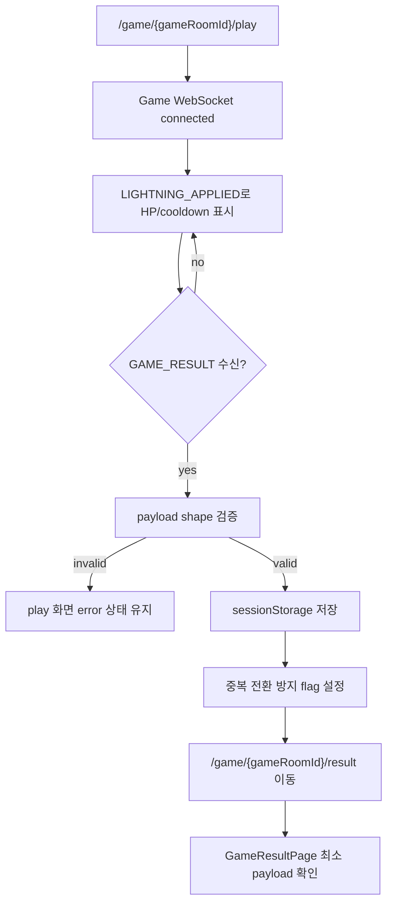
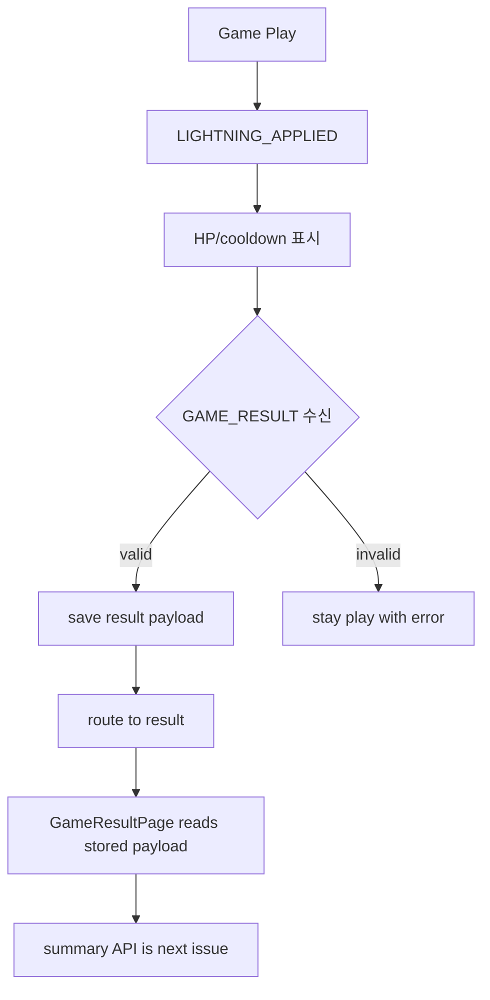

# Issue 94. Game Result WebSocket Transition

## Feature Description

이번 이슈는 `docs/antigravity/frontend/front-plan.md`의 `12. 게임 결과 WebSocket 처리 구현` 범위를 구현한다. `/game/:gameRoomId/play`에서 백엔드가 발행하는 `GAME_RESULT` WebSocket 이벤트를 게임 종료 source of truth로 삼고, 결과 payload를 저장한 뒤 `/game/:gameRoomId/result`로 이동한다.



이번 이슈의 핵심은 게임 종료 알림과 최종 정산 조회의 책임을 분리하는 것이다. WebSocket `GAME_RESULT`는 게임이 끝났다는 즉시 알림이며, LP/rank/series를 포함하지 않는다. 최종 결과 화면의 source of truth는 후속 이슈에서 `GET /api/v1/games/{gameId}/summary`로 조회한다.

이번 이슈에 포함되는 범위:

- `GAME_RESULT` payload shape 검증.
- `GAME_RESULT` payload sessionStorage 저장.
- `GAME_RESULT` 수신 후 `/game/:gameRoomId/result` 이동.
- result route 직접 진입 시 저장 payload 존재 여부 확인.
- 저장 payload 기반 GameResultPage 최소 연결.
- `LIGHTNING_APPLIED.isKill`과 `GAME_RESULT` 책임 분리 유지.
- Test/문서 정합성 반영.

후속 이슈로 미루는 범위:

- Summary API 호출.
- `PENDING` polling.
- `DONE` summary 기반 최종 결과 UI.
- LP/rank/series/record 표시.
- `/match` 복귀 UI 고도화.
- 정산 실패/복구 상태 표시.

## Backend Contract

Game WebSocket server message:

```json
{
  "type": "GAME_RESULT",
  "payload": {
    "gameRoomId": 100,
    "result": "PLAYER1_WIN",
    "winnerUserId": 1,
    "reason": "LIGHTNING_KILL",
    "finishedAt": 1716192017000,
    "actions": [
      {
        "userId": 1,
        "serverReceiveTime": 1716192010000,
        "lightningTimeMs": 6000,
        "starCoreHpAtLightning": 1000,
        "damage": 1200,
        "afterHp": 0,
        "isKill": true
      }
    ]
  }
}
```

`GAME_RESULT` payload shape:

```ts
interface GameResultPayload {
  gameRoomId: number;
  result: "PLAYER1_WIN" | "PLAYER2_WIN" | "DRAW";
  winnerUserId: number | null;
  reason: string;
  finishedAt: number;
  actions: {
    userId: number;
    serverReceiveTime: number;
    lightningTimeMs: number;
    starCoreHpAtLightning: number;
    damage: number;
    afterHp: number;
    isKill: boolean;
  }[];
}
```

백엔드 계약:

- `GAME_RESULT`는 게임 종료 즉시 알림이다.
- `GAME_RESULT`는 LP/rank/series delta를 포함하지 않는다.
- `LIGHTNING` 처치 시 같은 처리 흐름에서 `LIGHTNING_APPLIED`와 `GAME_RESULT(reason=LIGHTNING_KILL)`가 broadcast될 수 있다.
- 자연사 종료 시 scheduler가 `GAME_RESULT(reason=NATURAL_DEATH_DRAW)`를 broadcast할 수 있다.
- 이미 `FINISHED`인 gameRoom에 늦은 `LIGHTNING`이 도착하면 새 action을 저장하지 않고 현재 session에 확정된 `GAME_RESULT`만 재응답한다.
- WebSocket을 받지 못하더라도 서버 DB 결과가 최종 기준이다. 다만 이번 프론트 이슈에서는 summary fallback 조회를 구현하지 않는다.

프론트 처리 기준:

- `LIGHTNING_APPLIED`는 HP/cooldown 표시용 중간 이벤트다.
- `LIGHTNING_APPLIED.isKill === true`만으로 result route로 이동하지 않는다.
- 최종 승패와 route 이동 기준은 `GAME_RESULT`다.
- `GAME_RESULT.actions[].afterHp`는 action 시점 판정 결과이며, 현재 HP를 덮어쓰는 값으로 쓰지 않는다.
- 저장된 `GAME_RESULT` payload는 result page 즉시 진입을 위한 임시 전환 데이터다.
- 최종 결과 source of truth는 후속 Summary API다.

## Scope Boundary

이번 이슈에 포함:

- `gameResultPayload` storage service 추가.
- `GamePlayPage`에서 valid `GAME_RESULT` 수신 시 저장 후 result route 이동.
- 내부 result route 이동 중에는 play route leave confirm이 뜨지 않게 처리.
- 중복 `GAME_RESULT` 수신 시 중복 저장/중복 이동 방지.
- `GAME_RESULT` 이후 WebSocket close/error가 result 상태를 error로 덮어쓰지 않게 처리.
- `GameResultPage`에서 저장 payload를 읽어 최소 상태를 표시.
- 저장 payload가 없거나 route `gameRoomId`와 mismatch면 `/match` 복귀.

이번 이슈에서 제외:

- Summary API 호출.
- Summary `PENDING` polling.
- Summary `DONE` UI.
- LP/rank/series/record 표시.
- WebSocket 재연결 후 누락된 `GAME_RESULT`를 summary API로 복구하는 fallback.
- 백엔드 WebSocket 계약 변경.
- 새 패키지 추가.

## Tasks

### 1. Backend Contract 재확인

- [x] `GAME_RESULT` payload shape와 현재 `frontend/src/types/game.ts` 정합성 확인.
- [x] `LIGHTNING_APPLIED.isKill`은 route 이동 기준이 아니고 `GAME_RESULT`만 이동 기준임을 테스트로 고정.
- [x] `GAME_RESULT`가 종료 즉시 알림이고 summary API가 최종 정산 source인 정책 문서화.
- [x] `LIGHTNING_KILL`, `NATURAL_DEATH_DRAW`, 이미 FINISHED 재응답 흐름을 같은 전환 정책으로 처리.

### 2. Game Result Payload Storage 구현

- [x] `league-of-star.gameResultPayload:{gameRoomId}` key 정책 정의.
- [x] valid `GAME_RESULT` payload 저장.
- [x] `receivedAt` 포함.
- [x] invalid payload, broken JSON, route id mismatch는 `null` 반환.
- [x] action summary 배열 shape 검증.
- [x] storage 단위 테스트 추가.

### 3. GamePlayPage GAME_RESULT Transition 구현

- [x] `GAME_RESULT` 수신 시 payload 저장.
- [x] 저장 성공 시 `gameResultReceived=true`, `gameSocketStatus=resultReceived` 설정.
- [x] 저장 성공 시 `/game/:gameRoomId/result`로 `router.replace`.
- [x] 저장 실패 시 result route로 이동하지 않고 error 상태 표시.
- [x] 중복 `GAME_RESULT` 수신 시 route 이동 1회만 수행.
- [x] `GAME_RESULT` 이후 WebSocket close/error가 상태를 error로 되돌리지 않게 유지.
- [x] 내부 result 이동 시 route leave confirm이 뜨지 않게 처리.

### 4. GameResultPage 최소 연결 구현

- [x] route `gameRoomId` 기준 저장된 result payload 읽기.
- [x] payload가 있으면 최소 결과 상태 렌더링.
- [x] payload가 없거나 mismatch면 `/match`로 복귀.
- [x] Summary API는 호출하지 않음.
- [x] 최소 data attribute 추가.
- [x] 직접 진입/새로고침 테스트 추가.

### 5. Test 구현

- [x] `LIGHTNING_APPLIED.isKill=true`만으로는 이동하지 않는지 검증.
- [x] valid `GAME_RESULT` 수신 시 payload 저장 및 result route 이동 검증.
- [x] invalid `GAME_RESULT` 수신 시 저장/이동하지 않는지 검증.
- [x] 중복 `GAME_RESULT` 수신 시 중복 이동 방지 검증.
- [x] `GAME_RESULT` 이후 close/error가 result 상태를 덮지 않는지 검증.
- [x] 내부 result 이동에서 leave confirm이 호출되지 않는지 검증.
- [x] GameResultPage가 저장 payload를 읽는지 검증.
- [x] GameResultPage payload 누락/mismatch 시 `/match` 복귀 검증.
- [x] Summary API가 이번 이슈에서 호출되지 않는지 검증.

### 6. 문서 정합성 구현

- [x] `front-plan.md` 12번 완료 상태 반영.
- [x] `front-plan.md` 13번 Summary API 범위와 충돌 없는지 확인.
- [x] issue-92에서 result route 이동이 후속 범위였다는 설명과 충돌 없는지 확인.
- [x] `docs/project/websocket client.md`의 `GAME_RESULT`/summary 책임 분리와 정합성 확인.
- [x] PR 섹션을 계약/정책 중심으로 보강.

### 7. 검증

- [x] `npm run test -- GamePlayPage GameResultPage gameResultPayload gameWebSocket` 검증.
- [x] `npm run format` 검증.
- [x] `npm run lint` 검증.
- [x] `npm run typecheck` 검증.
- [x] `npm run test` 검증.
- [x] `npm run build` 검증.
- [x] 브라우저에서 mock WebSocket `GAME_RESULT` 주입 시 `/game/:gameRoomId/result` 이동 확인.

## Implementation Policy

- 최종 route 이동은 `GAME_RESULT` 기준으로만 처리한다.
- `LIGHTNING_APPLIED.isKill`은 HP 표시와 impact 반영에만 사용하고 route 이동 기준으로 쓰지 않는다.
- 저장 성공 전에는 result route로 이동하지 않는다.
- `GAME_RESULT` 저장 payload는 임시 전환 데이터이며 최종 정산 source가 아니다.
- 최종 정산 source는 후속 Summary API다.
- result route 이동은 정상 종료 흐름이므로 leave confirm을 띄우지 않는다.
- WebSocket close/error보다 이미 수신한 `GAME_RESULT`를 우선한다.
- summary API 호출, polling, LP/rank/series 표시는 이번 이슈에서 하지 않는다.
- 새 패키지를 추가하지 않는다.

## Acceptance Criteria

- 별 HP가 0이 되어도 `LIGHTNING_APPLIED`만으로는 결과 화면 이동이 발생하지 않는다.
- `GAME_RESULT(reason=LIGHTNING_KILL)` 수신 시 result payload가 저장되고 `/game/:gameRoomId/result`로 이동한다.
- `GAME_RESULT(reason=NATURAL_DEATH_DRAW)` 수신 시에도 같은 방식으로 이동한다.
- 이미 FINISHED 재응답 `GAME_RESULT`도 같은 방식으로 처리한다.
- invalid `GAME_RESULT` payload는 저장/이동하지 않는다.
- 중복 `GAME_RESULT` 수신에도 route 이동은 한 번만 발생한다.
- result route 직접 진입 시 저장 payload가 없으면 `/match`로 복귀한다.
- GameResultPage는 summary API를 호출하지 않는다.
- format/lint/typecheck/test/build가 통과한다.

## PR Message

## PR 작성 방법

## 📌 Summary

이번 PR은 Game Play 화면에서 `GAME_RESULT` WebSocket 이벤트를 수신했을 때 결과 payload를 저장하고 `/game/:gameRoomId/result`로 이동하는 흐름을 추가함.



핵심 정책:

- `LIGHTNING_APPLIED`는 중간 표시 이벤트이고 route 이동 기준이 아님.
- 최종 화면 전환은 `GAME_RESULT` 수신 기준으로만 처리함.
- `GAME_RESULT`는 종료 즉시 알림이며 최종 정산 source가 아님.
- Summary API 호출과 LP/rank/series 표시는 후속 이슈로 유지함.

백엔드와의 구현 계약:

- 백엔드는 LIGHTNING 처치 또는 자연사 종료 시 `GAME_RESULT`를 발행함.
- 이미 `FINISHED`된 gameRoom의 늦은 LIGHTNING도 현재 session에 확정된 `GAME_RESULT`를 재응답할 수 있음.
- 프론트는 `winnerUserId`, `reason`, `actions`를 임시 전환 데이터로 저장하되 최종 결과 표시는 summary API를 기다림.

## 📚 Changes

- WebSocket 종료 알림과 정산 조회 책임을 분리함.
  `GAME_RESULT`는 게임이 끝났다는 즉시 이벤트로만 사용하고, LP/rank/series 같은 최종 정산 정보는 summary API 이슈로 넘김.

- result route 이동 전에 payload 저장을 강제함.
  결과 화면 직접 진입/새로고침에서 최소 상태를 복구하려면 route 이동보다 저장이 먼저여야 함. 저장 실패나 invalid payload에서는 이동하지 않게 해 빈 결과 화면으로 빠지는 문제를 막음.

- `LIGHTNING_APPLIED.isKill`과 `GAME_RESULT`를 분리함.
  kill action이 먼저 보이더라도 승패와 이동은 백엔드 최종 이벤트인 `GAME_RESULT` 기준으로 처리해 서버/클라이언트 상태가 어긋나지 않게 함.

- 후속 Summary 이슈와 범위를 분리함.
  이번 PR은 WebSocket 전환과 최소 result page 진입까지만 담당하고, `PENDING` polling과 `DONE` 표시 UI는 다음 이슈에서 구현함.

## 📝 Note

- 이번 PR에서 Summary API 호출은 제외함.
- LP/rank/series/record UI는 제외함.
- 새 패키지는 추가하지 않음.
- 검증 결과:
  - `npm run test -- GamePlayPage GameResultPage gameResultPayload gameWebSocket` 통과함. 5 files / 50 passed 확인함.
  - `npm run format` 통과함.
  - `npm run lint` 통과함.
  - `npm run typecheck` 통과함.
  - `npm run test` 통과함. 17 files / 168 passed 확인함.
  - `npm run build` 통과함.
  - 브라우저 mock WebSocket으로 `GAME_RESULT` 주입 시 `/game/100/result` 이동, `YOU WIN` 표시, 저장 reason `LIGHTNING_KILL` 확인함.

## 📌 Related Issue

- Closes #94
