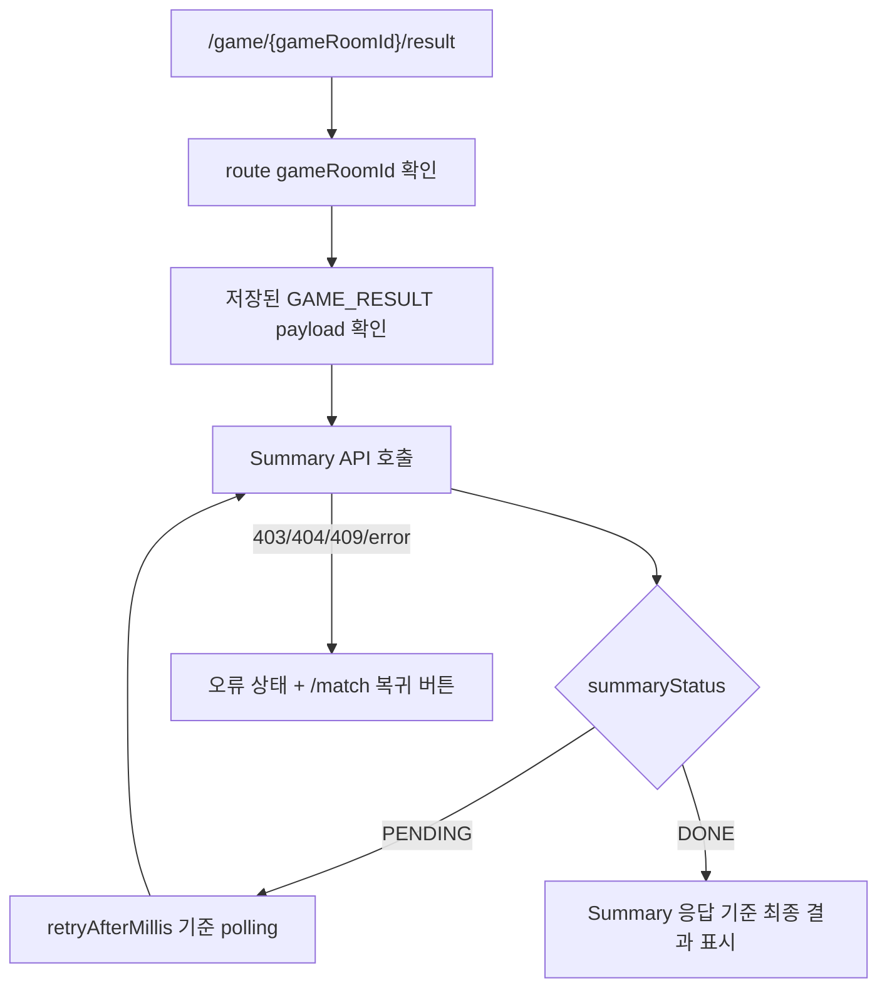
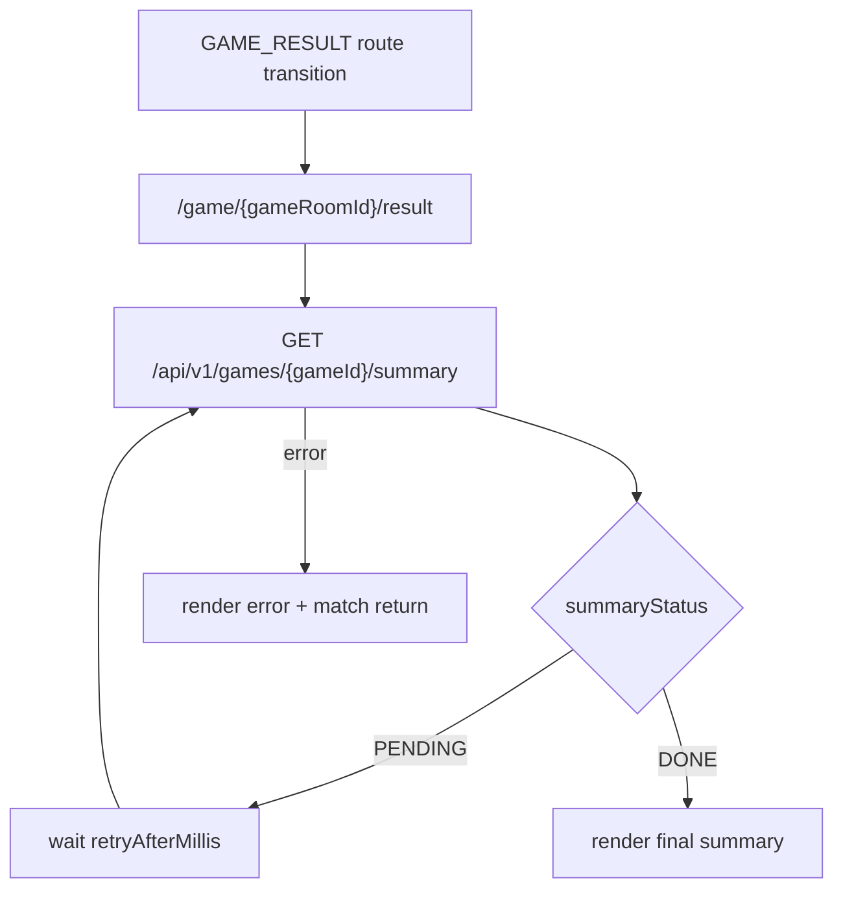

# Issue 96. Game Result Summary Screen

## Feature Description

이번 이슈는 `docs/antigravity/frontend/front-plan.md`의 `13. 게임 결과 Summary 화면 구현` 범위를 구현한다. issue-94에서 `/game/:gameRoomId/result` 진입까지 처리했으므로, 이번 이슈에서는 result page에서 `GET /api/v1/games/{gameId}/summary`를 호출해 최종 정산 결과를 표시한다.



이번 이슈의 핵심은 WebSocket 종료 알림과 최종 정산 화면의 source of truth를 분리하는 것이다. `GAME_RESULT`는 result route 진입 트리거이자 임시 표시 데이터로만 유지하고, 최종 승패/LP/rank/series/record 표시는 Summary API `DONE` 응답을 기준으로 처리한다.

이번 이슈에 포함되는 범위:

- `/game/:gameRoomId/result`에서 Summary API 호출.
- 저장된 `GAME_RESULT` payload가 없어도 route `gameRoomId` 기준으로 summary 복구.
- `PENDING.retryAfterMillis` 기준 polling.
- `DONE` 응답 기준 최종 결과 UI 표시.
- 403/404/409 및 네트워크 오류 상태 표시.
- `/match` 복귀 버튼 제공.
- Test/문서 정합성 반영.

후속 이슈로 미루는 범위:

- 백엔드 Summary API 계약 변경.
- Summary API retry 정책을 전역 query/cache 시스템으로 추상화.
- 결과 공유, 리플레이, 상세 action timeline.
- LP/rank animation 고도화.
- 새 패키지 추가.

## Backend Contract

Summary API:

```http
GET /api/v1/games/{gameId}/summary
Authorization: Bearer {accessToken}
```

현재 백엔드 계약상 `gameId`는 `gameRoomId`와 동일하게 사용한다. `Authorization` header는 기존 `apiClient`가 access token을 읽어 자동 첨부한다.

`PENDING` response:

```ts
interface GameSummaryPendingResponse {
  summaryStatus: "PENDING";
  gameId: number;
  retryAfterMillis: number;
}
```

`DONE` response:

```ts
interface GameSummaryDoneResponse {
  summaryStatus: "DONE";
  gameId: number;
  gameResult: "PLAYER1_WIN" | "PLAYER2_WIN" | "DRAW";
  winnerUserId: number | null;
  finishedAt: string;
  me: GameSummaryPlayer;
  opponent: GameSummaryPlayer;
}

interface GameSummaryPlayer {
  userId: number;
  nickname: string;
  result: "WIN" | "LOSS" | "DRAW";
  lpBefore: number;
  lpAfter: number;
  lpChange: number;
  rankBefore: string;
  rankAfter: string;
  seriesType: "RANK" | "PLACEMENT" | "PROMOTION";
  rankSeriesId: number | null;
}
```

백엔드 계약:

- `GAME_RESULT`는 게임 종료 즉시 알림이며 LP/rank/series delta를 포함하지 않는다.
- Summary API는 최종 결과 화면의 source of truth다.
- `FINISHED + game_records 0/1행`이면 `200 PENDING + retryAfterMillis`를 반환한다.
- `FINISHED + game_records 2행`이면 `200 DONE`을 반환한다.
- `DRAW`는 `gameResult=DRAW`, `winnerUserId=null`, `me.result=DRAW`, `opponent.result=DRAW`로 표현한다.
- 403은 요청 유저가 gameRoom 참가자가 아닌 경우다.
- 404는 gameRoom이 없는 경우다.
- 409는 gameRoom이 아직 종료 전인 경우다.

프론트 처리 기준:

- `GAME_RESULT` 저장 payload는 즉시 진입/임시 title 용도이며 최종 정산 source가 아니다.
- result page는 저장 payload가 없어도 route `gameRoomId`로 Summary API를 호출한다.
- `PENDING`은 실패가 아니므로 `retryAfterMillis` 기준으로 polling한다.
- 프론트는 임의 timeout이나 polling 최대 횟수로 실패 처리하지 않는다.
- `DONE`을 받으면 Summary 응답 기준으로 `YOU WIN`/`YOU LOSE`/`DRAW`와 player summary를 최종 표시한다.
- 종료 시각, 종료 사유, 게임룸, seriesType, rankSeriesId는 화면 UI에 노출하지 않는다.
- rank가 변경되지 않았으면 `SILVER_I -> SILVER_I`가 아니라 `SILVER_I`처럼 단일 값으로 표시한다.
- 오류 상태에서는 서버 `ErrorResponse.message`가 있으면 우선 표시하고 `/match` 복귀 버튼을 제공한다.

## Scope Boundary

이번 이슈에 포함:

- `GameResultPage` Summary API 호출 흐름 구현.
- `PENDING` polling timer와 `AbortController` lifecycle 정리.
- `DONE` summary 기반 최종 결과 UI 구현.
- 저장 payload 없음/새로고침/직접 진입 복구 정책 구현.
- 403/404/409/error 상태 UI 구현.
- Locale 문구 추가.
- Unit test와 브라우저 확인.
- `front-plan.md` 13번 완료 상태 반영.
- issue-94와 Summary 후속 범위 정합성 정리.

이번 이슈에서 제외:

- `/game/:gameRoomId/play` WebSocket 전환 로직 변경.
- `GAME_RESULT` payload 확장.
- Summary API 백엔드 변경.
- 전역 API retry/cache abstraction 도입.
- 결과 공유/리플레이/action timeline.
- 새 패키지 추가.

## Tasks

### 1. Backend Contract 재확인

- [x] `GET /api/v1/games/{gameId}/summary` 경로와 `gameId = gameRoomId` 정책 확인.
- [x] `PENDING` / `DONE` response shape가 `frontend/src/types/game.ts`와 정합한지 확인.
- [x] 403/404/409 전역 `ErrorResponse` 처리 정책 확인.
- [x] `GAME_RESULT`는 전환 트리거, Summary API는 최종 source of truth임을 문서화.

### 2. Summary Fetch / Polling 구현

- [x] 기존 `gameSummaryService.getGameSummary` 사용 여부 확인.
- [x] result route `gameRoomId`를 number로 정규화.
- [x] route id가 invalid면 `/match` 복귀.
- [x] mount 시 Summary API 호출.
- [x] `PENDING.retryAfterMillis` 기준으로 `setTimeout` polling 예약.
- [x] `retryAfterMillis`가 비정상 값이면 기본 `1000ms` 사용.
- [x] `DONE` 수신 시 polling 중단.
- [x] unmount 시 timeout과 `AbortController` 정리.

### 3. GameResultPage 상태 모델 구현

- [x] `idle/loading/pending/done/error` 상태 모델 정리.
- [x] 저장된 `GAME_RESULT` payload가 있으면 즉시 임시 title 표시.
- [x] 저장 payload가 없어도 Summary API로 복구.
- [x] Summary `DONE` 수신 시 title을 Summary 기준으로 최종 보정.
- [x] `DRAW`는 `winnerUserId=null`과 `gameResult=DRAW` 기준으로 처리.
- [x] Summary API error message 추출 및 fallback message 처리.

### 4. Result Summary UI / Locale 구현

- [x] `YOU WIN` / `YOU LOSE` / `DRAW` title 표시.
- [x] `PENDING` 정산 중 상태 표시.
- [x] 내 player summary와 상대 player summary를 나란히 표시.
- [x] nickname, result, rankBefore/rankAfter, lpBefore → lpAfter, lpChange 표시.
- [x] rank 변경이 없으면 단일 rank 값만 표시.
- [x] 종료 시각, 종료 사유, 게임룸, seriesType, rankSeriesId UI는 표시하지 않음.
- [x] `/match` 복귀 버튼 제공.
- [x] desktop/mobile overflow 확인.

### 5. Test 구현

- [x] 저장 payload가 없어도 Summary API를 호출하는지 검증.
- [x] `PENDING` 응답 시 `retryAfterMillis` 기준 재조회 검증.
- [x] `DONE` 응답 시 `YOU WIN` 표시 검증.
- [x] `DONE` 응답 시 `YOU LOSE` 표시 검증.
- [x] `DONE` 응답 시 `DRAW` 표시 검증.
- [x] `me/opponent` LP/rank 표시 검증.
- [x] 403/404/409 error 상태와 `/match` 복귀 버튼 검증.
- [x] unmount 시 polling timeout과 request abort 정리 검증.
- [x] `DONE` 이후 polling 중단 검증.

### 6. 문서 정합성 구현

- [x] `front-plan.md` 13번 완료 상태 반영.
- [x] issue-94에서 후속으로 남긴 Summary API 범위가 이번 이슈에서 완료됨을 반영.
- [x] `docs/project/websocket client.md`의 `GAME_RESULT`/summary 책임 분리와 정합성 확인.
- [x] `docs/project/policy.md`의 record/rank summary 정책과 정합성 확인.
- [x] PR 섹션을 계약/정책 중심으로 보강.

### 7. 검증

- [x] `npm run test -- GameResultPage gameSummaryService` 검증.
- [x] `npm run format` 검증.
- [x] `npm run lint` 검증.
- [x] `npm run typecheck` 검증.
- [x] `npm run test` 검증.
- [x] `npm run build` 검증.
- [x] 브라우저에서 mock API `PENDING -> DONE` 흐름 확인.
- [x] 브라우저에서 mock API `DONE` 직접 응답 확인.
- [x] 브라우저에서 mock API 403/404/409 error 상태 확인.
- [x] desktop 1440x900, mobile 390x844 overflow 확인.

## Implementation Policy

- Summary API `DONE` 응답만 최종 결과 화면의 source of truth로 사용한다.
- `GAME_RESULT` 저장 payload는 즉시 진입/임시 title 용도로만 사용한다.
- 저장 payload가 없어도 result route에서 Summary API로 복구한다.
- `PENDING`은 정상 대기 상태이며 `retryAfterMillis` 기준 polling한다.
- 프론트 임의 timeout이나 최대 polling 횟수로 실패 처리하지 않는다.
- `DONE` 이후 polling은 반드시 중단한다.
- unmount 시 polling timer와 in-flight request를 정리한다.
- 403/404/409는 전역 `ErrorResponse` message를 우선 표시한다.
- 종료 시각, 종료 사유, 게임룸, seriesType, rankSeriesId는 화면 UI에 노출하지 않는다.
- rank 변경이 없으면 단일 rank 값만 표시한다.
- 새 패키지를 추가하지 않는다.

## Acceptance Criteria

- `/game/:gameRoomId/result` 직접 진입 시 저장 payload가 없어도 Summary API를 호출한다.
- `PENDING` 응답을 받으면 `retryAfterMillis` 기준으로 polling한다.
- `DONE` 응답을 받으면 polling을 멈추고 Summary 기준 최종 결과를 표시한다.
- `YOU WIN` / `YOU LOSE` / `DRAW`가 Summary 응답 기준으로 표시된다.
- 내 정보와 상대 정보의 nickname, result, LP 변화, rank 정보가 표시된다.
- rank 변경이 없으면 단일 rank 값만 표시된다.
- 403/404/409 오류 상태에서 사용자에게 안내와 `/match` 복귀 버튼을 제공한다.
- unmount 시 timer와 request가 정리된다.
- 종료 시각, 종료 사유, 게임룸, seriesType, rankSeriesId UI가 표시되지 않는다.
- format/lint/typecheck/test/build가 통과한다.

## PR Message

## PR 작성 방법

## 📌 Summary

이번 PR은 Game Result 화면에서 Summary API를 호출해 최종 정산 결과를 표시하는 흐름을 구현함.



핵심 정책:

- `GAME_RESULT`는 결과 화면 진입 트리거로만 사용함.
- 최종 결과 source of truth는 Summary API `DONE` 응답임.
- `PENDING`은 실패가 아니므로 `retryAfterMillis` 기준으로 polling함.
- 저장 payload가 없어도 route `gameRoomId` 기준으로 Summary API 복구를 시도함.

백엔드와의 구현 계약:

- `GET /api/v1/games/{gameId}/summary`를 호출하며 현재 `gameId = gameRoomId`로 사용함.
- `PENDING`은 record/rank 정산 대기 상태이고 `retryAfterMillis`를 포함함.
- `DONE`은 `gameResult`, `winnerUserId`, `finishedAt`, `me`, `opponent`를 포함함.
- 403/404/409는 전역 `ErrorResponse`로 처리함.

## 📚 Changes

- WebSocket 전환과 최종 정산 표시 책임을 분리함.
  `GAME_RESULT`는 종료 즉시 알림이므로 LP/rank/series를 섞지 않고, 결과 화면은 Summary API `DONE`을 최종 기준으로 삼음.

- result page 복구 정책을 Summary 중심으로 바꿈.
  저장된 `GAME_RESULT` payload가 없어도 route `gameRoomId`로 Summary API를 호출해 새로고침/직접 진입에서도 결과 화면을 복구할 수 있게 함.

- `PENDING` polling을 백엔드 권장 interval 기준으로 처리함.
  프론트 임의 timeout을 두지 않고 `retryAfterMillis`를 source로 삼아 정산 지연을 정상 대기 상태로 표현함.

- 결과 UI는 정산 정보 중심으로 구성함.
  종료 시각, 종료 사유, 게임룸, seriesType, rankSeriesId는 노출하지 않고, `me`/`opponent`의 승패, LP 변화, rank 정보를 표시함. rank가 변경되지 않았으면 단일 rank 값만 표시함.

## 📝 Note

- 이번 PR에서 백엔드 Summary API 계약은 변경하지 않음.
- `GAME_RESULT` payload는 확장하지 않음.
- 새 패키지는 추가하지 않음.
- 검증 결과:
  - `npm run test -- GameResultPage gameSummaryService` 통과함. 2 files / 13 passed 확인함.
  - `npm run format` 통과함.
  - `npm run lint` 통과함.
  - `npm run typecheck` 통과함.
  - `npm run test` 통과함. 18 files / 176 passed 확인함.
  - `npm run build` 통과함.
  - 브라우저 mock API `PENDING -> DONE` 확인함. Summary API GET 2회 호출 후 `YOU WIN`, `done`, `win` 표시 확인함.
  - 브라우저 mock API `DONE` 직접 응답 확인함. mobile 390x844에서 `YOU WIN`, `done`, `win` 표시 확인함.
  - 브라우저 mock API 403 error 확인함. `errorStatus=403`, 오류 상태 표시 확인함.
  - desktop 1440x900, mobile 390x844에서 horizontal overflow 없음, text overflow 후보 없음 확인함.
  - 종료 시각/종료 사유/게임룸/seriesType/rankSeriesId 미노출과 rank 미변경 단일 표시 정책 확인함.

## 📌 Related Issue

- Closes #96
