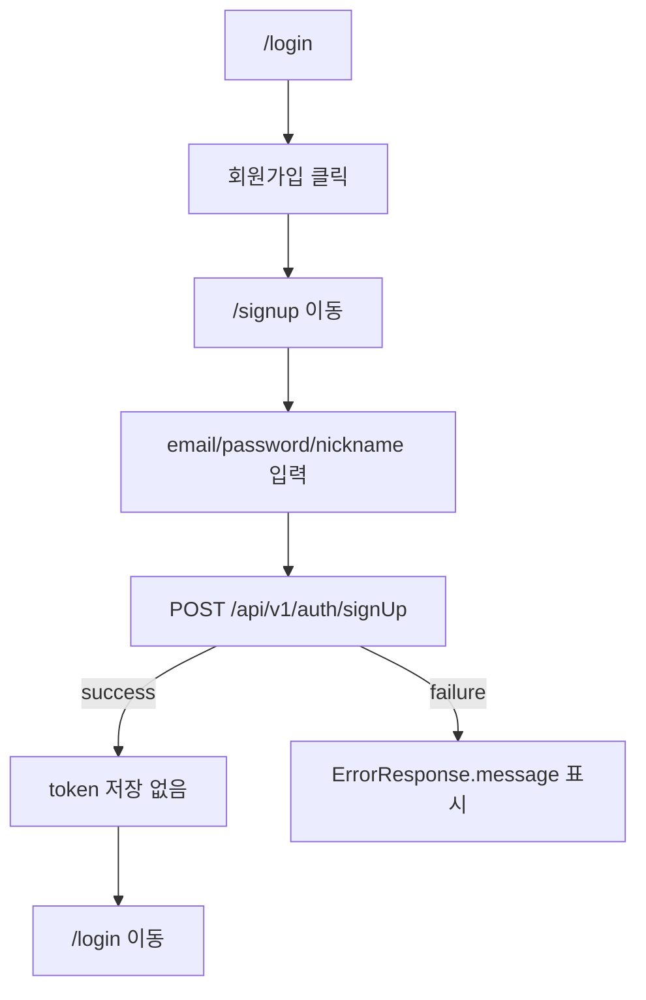
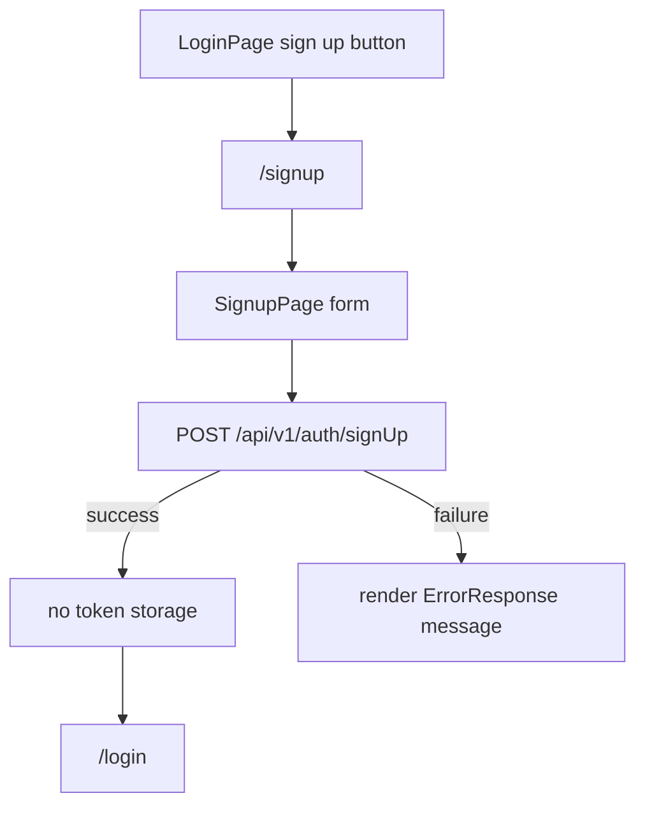

# Issue 98. Signup Page

## Feature Description

이번 이슈는 `docs/last-구현.md`의 `Section 1-1. 회원가입 페이지 구현` 범위를 구현한다. 현재 로그인 화면에는 회원가입 버튼이 있지만 실제 route, page, API service 연결이 없다. 이번 이슈에서는 독립 `/signup` 페이지를 추가하고 백엔드 일반 회원가입 API에 연결한다.



이번 이슈의 핵심은 회원가입과 로그인 책임을 분리하는 것이다. 회원가입 성공 응답은 생성된 사용자 정보 확인용 ack로만 처리하고, access/refresh token 저장은 기존 로그인 성공 응답에서만 수행한다.

이번 이슈에 포함되는 범위:

- `/signup` route 추가.
- `SignupPage` 구현.
- `POST /api/v1/auth/signUp` service 연결.
- `LoginPage` 회원가입 버튼 route 연결.
- client validation과 백엔드 ErrorResponse 표시.
- Test/문서 정합성 반영.

후속 이슈로 미루는 범위:

- 회원가입 성공 후 자동 로그인.
- OAuth 회원가입/로그인.
- 비밀번호 찾기.
- token refresh/retry.
- 로그아웃.
- 프로필/랭크 조회.
- 새 패키지 추가.

## Backend Contract

Signup API:

```http
POST /api/v1/auth/signUp
Content-Type: application/json
```

`Authorization` header는 사용하지 않는다. 기존 `apiClient` 호출 시 `auth: false`로 처리한다.

Request:

```ts
interface SignupRequest {
  email: string;
  password: string;
  nickname: string;
}
```

Response:

```ts
interface SignupResponse {
  id: number;
  email: string;
  nickname: string;
}
```

백엔드 validation 계약:

- `email`: 필수, email 형식.
- `password`: 필수, 8자 이상 20자 이하.
- `nickname`: 필수, 2자 이상 16자 이하.

백엔드 계약 기준:

- 현재 백엔드 `AuthPath.SIGN_UP`는 `/api/v1/auth/signUp`이다.
- 회원가입 성공은 `200 OK + SignupResponse`로 처리한다.
- `SignupResponse`는 token을 포함하지 않는다.
- 로그인 token 발급은 `POST /api/v1/auth/login`의 책임이다.
- validation, 중복 이메일, 중복 닉네임 등 실패는 전역 `ErrorResponse.message`를 우선 표시한다.

프론트 처리 기준:

- 회원가입 성공 시 access/refresh token을 저장하지 않는다.
- 회원가입 성공 시 `/login`으로 이동한다.
- 회원가입 성공 response의 `id/email/nickname`은 세션 source로 저장하지 않는다.
- transport 오류는 signup fallback locale message로 표시한다.

## Scope Boundary

이번 이슈에 포함:

- route 상수와 router에 `/signup` 추가.
- `/signup`은 `guestOnly: true` route로 설정.
- `SignupRequest`, `SignupResponse` 타입 추가.
- `authService.signup` 추가.
- `SignupPage` 구현.
- `LoginPage` 회원가입 버튼을 signup route로 연결.
- locale 문구 추가.
- 회원가입 성공/실패/validation/loading 상태 구현.
- Unit test 추가.
- `docs/last-구현.md`, `front-plan.md` 정합성 반영.
- issue-98 PR 섹션 보강.

이번 이슈에서 제외:

- 백엔드 endpoint rename.
- 회원가입 성공 후 자동 로그인.
- `setAuthTokens` 호출.
- user profile 전역 저장.
- OAuth 연결.
- 비밀번호 찾기.
- token refresh/retry.
- 로그아웃.
- 새 패키지 추가.

## Tasks

### 1. Backend Contract 재확인

- [x] 백엔드 `AuthPath.SIGN_UP`가 `/api/v1/auth/signUp`인지 확인.
- [x] `SignupRequest` request shape 확인.
- [x] `SignupResponse` response shape 확인.
- [x] 회원가입 성공 응답에 token이 없음을 문서화.
- [x] 회원가입 성공 후 `/login` 이동 정책 문서화.

### 2. Signup Route / Service 구현

- [x] `ROUTE_PATHS.signup` 추가.
- [x] `ROUTE_NAMES.signup` 추가.
- [x] router에 `/signup` route 추가.
- [x] `/signup` route에 `guestOnly: true` 적용.
- [x] `SignupRequest`, `SignupResponse` 타입 추가.
- [x] `authService.signup` 구현.
- [x] signup API는 `auth: false`로 호출.

### 3. SignupPage 구현

- [x] `SignupPage.vue` 추가.
- [x] email input 구현.
- [x] password input 구현.
- [x] nickname input 구현.
- [x] 필수 입력 client validation 구현.
- [x] submit 중 중복 요청 방지 구현.
- [x] 성공 시 token 저장 없이 `/login` 이동.
- [x] 실패 시 백엔드 message 또는 fallback message 표시.
- [x] 로그인 페이지로 돌아가기 버튼 구현.

### 4. LoginPage 연결 / Locale 구현

- [x] LoginPage 회원가입 버튼에 signup route 이동 연결.
- [x] 한국어 signup locale 추가.
- [x] 영어 signup locale 추가.
- [x] 기존 로그인 locale과 naming 충돌 없는지 확인.

### 5. Test 구현

- [x] SignupPage 렌더링 테스트.
- [x] 필수 입력 누락 시 API 미호출 검증.
- [x] 성공 시 signup payload 검증.
- [x] 성공 시 `/login` 이동 검증.
- [x] 성공 시 `setAuthTokens` 미호출 검증.
- [x] ApiClientError message 표시 검증.
- [x] LoginPage 회원가입 버튼 route 이동 검증.
- [x] router meta에서 signup guestOnly 검증.

### 6. 문서 정합성 구현

- [x] `docs/last-구현.md` Section 1-1 완료 상태 반영.
- [x] `front-plan.md` 회원가입 후속 범위 문구 정합성 확인.
- [x] issue-98 task 완료 상태 반영.
- [x] PR 섹션을 계약/정책 중심으로 보강.

### 7. 검증

- [x] `npm run test -- SignupPage LoginPage router authService` 검증.
- [x] `npm run format` 검증.
- [x] `npm run lint` 검증.
- [x] `npm run typecheck` 검증.
- [x] `npm run test` 검증.
- [x] `npm run build` 검증.
- [x] desktop 1440x900 overflow 확인.
- [x] mobile 390x844 overflow 확인.

## Implementation Policy

- 백엔드 endpoint는 현재 계약인 `/api/v1/auth/signUp`을 그대로 사용한다.
- signup API는 public API이므로 Authorization header를 붙이지 않는다.
- HTTP 200은 회원가입 성공 ack로 처리한다.
- 회원가입 성공은 로그인 상태가 아니므로 access/refresh token을 저장하지 않는다.
- 최종 인증 세션 생성은 기존 login API 성공 응답 기준으로만 처리한다.
- 회원가입 성공 response의 `id/email/nickname`은 세션 source로 저장하지 않는다.
- `/signup`은 `guestOnly` route로 처리한다.
- `authService.signup`은 API 호출만 담당하고 token 저장이나 router 이동을 수행하지 않는다.
- `SignupPage`가 form 상태, submit 상태, 성공 이동, 오류 표시를 조립한다.
- 새 패키지를 추가하지 않는다.

## Acceptance Criteria

- `/signup` 직접 진입 시 회원가입 화면이 표시된다.
- 로그인 상태에서 `/signup` 접근 시 기존 guestOnly 정책에 따라 `/match`로 이동한다.
- LoginPage 회원가입 버튼 클릭 시 `/signup`으로 이동한다.
- email/password/nickname 입력 후 submit 시 `POST /api/v1/auth/signUp`을 호출한다.
- 회원가입 성공 시 token 저장 없이 `/login`으로 이동한다.
- 회원가입 실패 시 백엔드 `ErrorResponse.message` 또는 fallback message를 표시한다.
- 필수 입력 누락 시 API 호출 없이 client message를 표시한다.
- format/lint/typecheck/test/build가 통과한다.
- desktop/mobile에서 form text와 button overflow가 없다.

## PR Message

## PR 작성 방법

## 📌 Summary

이번 PR은 독립 `/signup` 페이지를 추가하고 백엔드 일반 회원가입 API에 연결함.



핵심 정책:

- 회원가입과 로그인 책임을 분리함.
- 회원가입 성공은 인증 세션 생성이 아니므로 token을 저장하지 않음.
- 백엔드 현재 계약인 `/api/v1/auth/signUp`을 그대로 사용함.

백엔드와의 구현 계약:

- `POST /api/v1/auth/signUp`은 public API이므로 Authorization header를 붙이지 않음.
- request는 `{ email, password, nickname }`임.
- response는 `{ id, email, nickname }`이며 token을 포함하지 않음.
- 프론트는 실패 시 전역 `ErrorResponse.message`를 우선 표시함.

## 📚 Changes

- 회원가입을 모달이 아니라 독립 route로 구현함.
  회원가입은 별도 form validation, 실패 표시, 성공 후 이동 정책이 있는 흐름이므로 URL 직접 접근, 새로고침, 뒤로가기, guestOnly route guard 검증이 명확한 `/signup` 페이지 방식으로 처리함.
- 회원가입 성공 후 자동 로그인하지 않음.
  백엔드 signup response에는 token이 없고, 기존 인증 세션 source는 login response의 access/refresh token이므로 signup 성공은 `/login` 이동으로만 처리함.
- `authService.signup`은 API 호출 책임만 갖게 함.
  token 저장과 route 이동은 page에서 조립해 기존 `authService.login`과 같은 책임 분리 기준을 유지함.
- 새 패키지를 추가하지 않음.

## 📝 Note

- OAuth, 비밀번호 찾기, token refresh/retry, 로그아웃은 이번 PR에서 제외함.
- profile/rank 조회와 MatchPage 실데이터 전환도 후속 이슈로 유지함.
- `npm run test -- SignupPage LoginPage router authService` 검증 완료함.
- `npm run format`, `npm run lint`, `npm run typecheck`, `npm run test`, `npm run build` 검증 완료함.
- 전체 테스트 20 files / 188 passed 확인함.
- headless Chrome 기준 desktop 1440x900, mobile 390x844에서 horizontal overflow 없음과 화면 밖 요소 없음 확인함.

## 📌 Related Issue

- Closes #98
