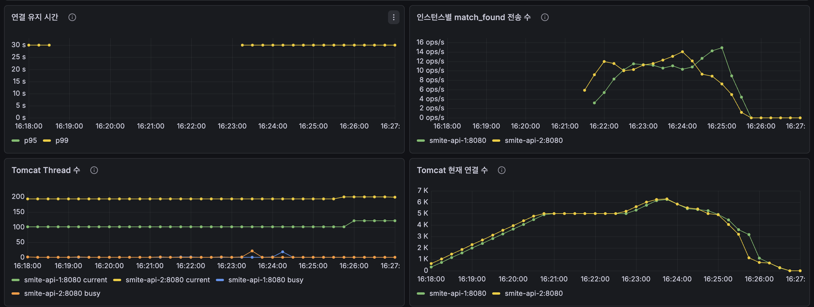

## 연결 유지 테스트 결과

~~~
========== SSE load test summary ==========
mode: connection
connections: 10000
sse connected: 10000/10000 (100.00%)
sse failed: 0
connected events: 10000
heartbeat events: 190796 (19.08 per connection)
open latency p50/p95/p99: 6ms / 16ms / 51ms
bytes received: 13452455
errors: {}
~~~

## 이벤트 전송 테스트

~~~
========== SSE load test summary ==========
mode: match
connections: 10000
sse connected: 10000/10000 (100.00%)
sse failed: 0
connected events: 10000
heartbeat events: 187633 (18.76 per connection)
open latency p50/p95/p99: 7ms / 13ms / 47ms
join success: 10000/10000
match_found received: 5006/10000 (50.06%)
match_found latency p50/p95/p99: 510ms / 981ms / 1038ms
bytes received: 14189771
errors: {}
~~~

## 분석 결과 (Grafana 지표 근거 기반)

### 최종 판단

현재 MVC 기반 SSE 구현에서 **Tomcat/MVC 스레드 병목은 보이지 않는다.**

문제로 볼 부분은 스레드가 아니라, `JOIN_TPS=50` 기준으로 기대한 `match_found` 전송량보다 실제 서버 전송량이 낮게 나온 점이다.

따라서 지금 결과만 놓고 "Netty로 넘어가야 한다"고 결론내리면 안 된다.  
Netty 전환의 근거가 되려면 Tomcat busy thread 비율이 높게 유지되거나, JVM runnable/timed-waiting thread가 연결 수에 따라 비정상적으로 증가해야 한다. 이번 그래프에서는 그런 증거가 없다.

### 1. 연결 유지 안정성: **합격**

판단:
- MVC SSE는 10,000 연결을 안정적으로 유지했다.

근거 지표:
- `sse connected: 10000/10000 (100.00%)`
- `sse failed: 0`
- `errors: {}`
- `open latency p95: 16ms`, `p99: 51ms`

해석:
- 연결 실패가 0건이므로, 인증/연결 생성 단계는 정상.
- 연결 오픈 지연도 매우 낮아(수십 ms), 접속 폭주 상황에서도 연결 수용은 안정적.

---

### 2. heartbeat 전달 안정성: **양호**

판단:
- 연결된 사용자에게 heartbeat는 지속적으로 잘 전달되고 있다.

근거 지표:
- 연결 유지 테스트 `heartbeat events: 190796 (19.08 per connection)`
- 이벤트 전송 테스트 `heartbeat events: 187633 (18.76 per connection)`

해석:
- 연결당 heartbeat 수신이 약 19회 수준으로, 테스트 시간 동안 SSE 스트림이 살아 있었다는 뜻.
- 연결은 열렸지만 이벤트가 안 오는 상태가 아니라, 스트림은 실제로 정상 동작 중.

---

### 3. match_found 전달 완전성: **개선 필요**

판단:
- Grafana 기준으로 보면 `match_found` 서버 전송량이 기대치보다 낮다.

근거 지표:
- 테스트 조건: `JOIN_TPS=50`
- 기대 전송량: 약 `50 match_found events/s`
- Grafana `인스턴스별 match_found 전송 수`: 인스턴스당 약 `10~15 events/s`
- 합산 추정: 약 `20~30 events/s`

해석:
- 50 TPS로 유저가 매칭 진입하면, 유저 2명이 1페어가 되므로 매칭 성사량은 약 `25 pairs/s`가 기대된다.
- 하지만 SSE 이벤트는 페어당 2명에게 보내므로, `match_found` 이벤트 전송량은 다시 약 `50 events/s`가 기대된다.
- Grafana에서 보이는 실제 서버 전송량은 대략 `20~30 events/s` 수준이므로, 기대치보다 낮다.

주의:
- 이전의 `match_found received: 5006/10000` 값은 클라이언트 스크립트 요약 지표다.
- 앞으로 성능 분석 결론은 이 값이 아니라 Grafana 서버 지표를 기준으로 판단한다.
- 따라서 현재 결론은 "50%만 전달됐다"가 아니라, **서버 기준 match_found 전송 처리량이 목표보다 낮다**가 맞다.

---

### 4. match_found 지연 시간: **양호 (현재 목표 기준)**

판단:
- 수신된 match_found 이벤트의 지연 시간은 1초 내외로 안정적이다.

근거 지표:
- `match_found latency p50/p95/p99: 510ms / 981ms / 1038ms`

해석:
- 수신된 이벤트 기준 p95가 약 1초이므로 "이벤트가 온 경우의 체감 속도"는 괜찮다.
- 즉, 현재 문제의 핵심은 지연보다 "전달 완전성(몇 명에게 실제로 도달했는가)"에 가깝다.

---

### 5. 스레드 관점 분석: **병목 아님**

판단:
- 이번 MVC SSE 테스트에서 Tomcat/MVC 스레드 병목은 보이지 않는다.

근거 지표:
- Grafana `Tomcat Thread 수`
  - `tomcat_threads_current`: 약 `100~200`
  - `tomcat_threads_busy`: 대부분 `0` 근처, 순간 spike만 존재
- Grafana `Tomcat 현재 연결 수`
  - 인스턴스별 약 `5,000~6,000` 연결까지 증가
- Grafana `JVM Thread 수`
  - live thread가 약 `240~250` 수준에서 큰 폭으로 증가하지 않음
- Grafana `JVM Thread 상태별 수`
  - `timed-waiting`이 대부분이고, `runnable` 급증이 없음

해석:
- Tomcat은 수천 개 SSE 연결을 유지하고 있지만, busy thread가 거의 차지 않는다.
- 즉, 연결을 유지하는 것 자체가 Tomcat worker thread를 계속 점유하는 형태로 보이지 않는다.
- JVM thread도 연결 수 10,000에 비례해 폭증하지 않았다.
- 따라서 이번 결과에서 Netty 전환의 직접 근거가 되는 "스레드 병목"은 없다.

정리:
- 현재 문제 후보는 스레드가 아니라 `match_found` 이벤트가 기대 TPS만큼 생성/전송되지 않은 지점이다.
- 다음 분석은 매칭 엔진 처리량(`pairs/s`)과 `sse_notification_events_send_success_total{event="match_found"}`를 같이 봐야 한다.

---

## 이번 결과의 최종 결론

1. **연결 품질은 충분히 좋다.**
2. **스레드 병목은 현재 보이지 않는다.**
3. **핵심 개선 포인트는 match_found 서버 전송량이 목표 TPS를 따라가는지 확인하는 것이다.**
4. 다음 버전 비교에서는 반드시 아래 지표를 함께 본다.

- `sse_notification_events_send_success_total{event="match_found"}` (서버 기준 match_found events/s)
- `sse_notification_events_send_failures_total{event="match_found"}` (서버 기준 전송 실패)
- `sse_notification_connections_closed_total{reason}` (종료 사유: timeout/error/send_failure)
- `tomcat_threads_busy / tomcat_threads_current` (MVC thread 병목 여부)
- `jvm_threads_states_threads{state="runnable"}` (JVM 실행 대기 증가 여부)

이 지표들을 같이 보면, "MVC SSE 자체가 문제인지", "매칭 엔진이 목표 TPS만큼 match_found를 만들지 못한 것인지", "전송 실패가 발생한 것인지"를 분리해서 개선할 수 있다.
