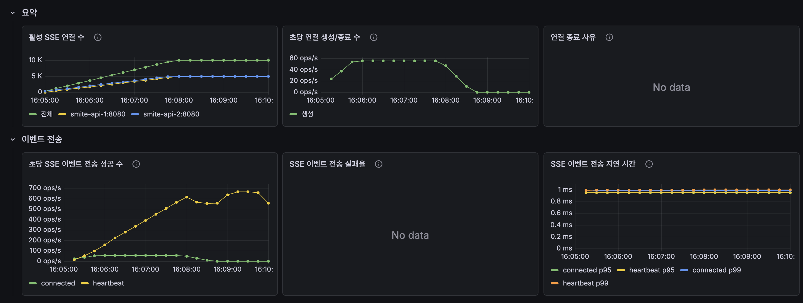
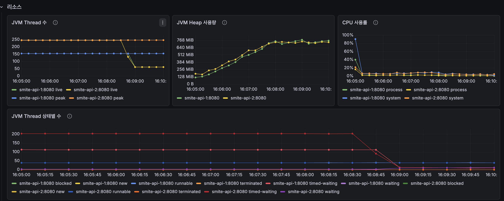
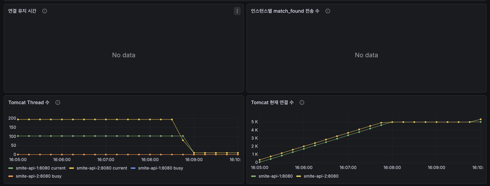
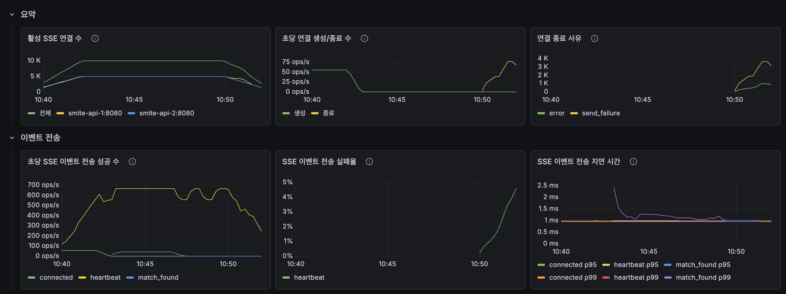
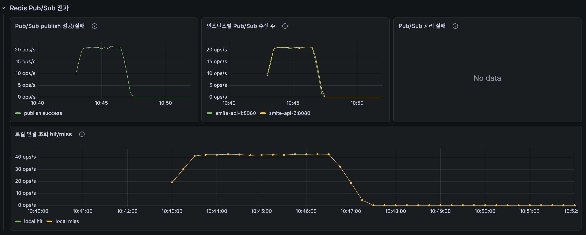
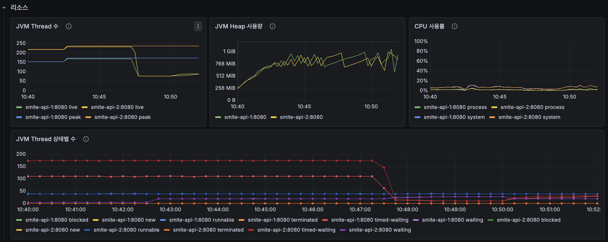

## 연결 유지 테스트 결과

~~~
========== SSE load test summary ==========
mode: connection
connections: 10000
sse connected: 10000/10000 (100.00%)
sse failed: 0
connected events: 10000
heartbeat events: 190796 (19.08 per connection)
open latency p50/p95/p99: 6ms / 16ms / 51ms
bytes received: 13452455
errors: {}
~~~

## 이벤트 전송 테스트

~~~
========== SSE load test summary ==========
mode: match
connections: 10000
sse connected: 10000/10000 (100.00%)
sse failed: 0
connected events: 10000
heartbeat events: 381434 (38.14 per connection)
open latency p50/p95/p99: 6ms / 15ms / 43ms
join success: 10000/10000
match_found received: 10000/10000 (100.00%)
match_found latency p50/p95/p99: 537ms / 992ms / 1041ms
bytes received: 27924494
errors: {}
~~~

## 분석 결과 (Grafana 지표 근거 기반)

### 최종 판단

MVC 기반 SSE는 **10,000명 연결 유지와 match_found 이벤트 전달을 정상 처리했다.**

이전 테스트에서 문제가 됐던 "2대 API 인스턴스 중 한쪽에 붙은 유저만 알림을 받는 문제"는 Redis Pub/Sub 적용 후 해결됐다.

이번 테스트의 핵심 결과는 다음과 같다.

- SSE 연결 성공률: `10000/10000 (100%)`
- joinQueue 성공률: `10000/10000 (100%)`
- match_found 수신률: `10000/10000 (100%)`
- match_found latency: `p50 537ms`, `p95 992ms`, `p99 1041ms`
- Pub/Sub 처리 실패: 없음
- Tomcat/MVC 스레드 병목: 확인되지 않음

다만 `JOIN_TPS=50` 목표 대비 서버 기준 `match_found` 전송량은 약 `40~42 events/s` 수준으로 보인다. 즉, 이번 결과는 "알림 누락" 문제가 아니라 **목표 50 events/s 대비 처리량 여유가 아직 부족한 상태**로 보는 것이 맞다.

### 1. 연결 유지 안정성: **합격**

판단:
- MVC SSE는 10,000 연결을 안정적으로 열고 유지했다.

근거 지표:
- `sse connected: 10000/10000 (100.00%)`
- `sse failed: 0`
- `errors: {}`
- 연결 유지 테스트 `open latency p50/p95/p99: 6ms / 16ms / 51ms`
- 이벤트 전송 테스트 `open latency p50/p95/p99: 6ms / 15ms / 43ms`
- Grafana `활성 SSE 연결 수`: 전체 약 10,000까지 도달
- 인스턴스별 활성 연결 수: 각 API 인스턴스 약 5,000 수준으로 분산

해석:
- 인증, SSE endpoint 연결, EventSource 스트림 생성은 정상이다.
- 10,000개 연결을 2대 API 인스턴스가 균등하게 나눠 가진다.
- 연결 생성 지연도 p95 기준 10ms대라 연결 오픈 자체는 병목으로 보이지 않는다.

---

### 2. heartbeat 전달 안정성: **합격**

판단:
- 연결된 사용자에게 heartbeat가 지속적으로 전달됐다.

근거 지표:
- 연결 유지 테스트 `heartbeat events: 190796 (19.08 per connection)`
- 이벤트 전송 테스트 `heartbeat events: 381434 (38.14 per connection)`
- Grafana `초당 SSE 이벤트 전송 성공 수`: heartbeat가 연결 유지 시간 동안 계속 증가
- Grafana `SSE 이벤트 전송 지연 시간`: heartbeat p95/p99가 약 1ms 부근

해석:
- SSE 연결이 열리기만 한 것이 아니라, 실제 이벤트 스트림이 계속 살아 있었다.
- heartbeat 지연도 낮아서 서버의 주기 전송 경로는 안정적이다.

---

### 3. match_found 전달 완전성: **합격**

판단:
- Pub/Sub 적용 후 match_found 알림이 10,000명 모두에게 전달됐다.

근거 지표:
- `join success: 10000/10000`
- `match_found received: 10000/10000 (100.00%)`
- Grafana `인스턴스별 match_found 전송 수`: 두 인스턴스 모두 약 `20~21 events/s` 수준으로 전송
- Grafana `Pub/Sub 처리 실패`: `No data`
- Grafana `Pub/Sub 수신 수`: 두 인스턴스 모두 publish 메시지를 수신

해석:
- 클라이언트 기준으로 모든 사용자가 `match_found`를 수신했다.
- 서버 기준으로도 두 API 인스턴스가 Pub/Sub 메시지를 모두 받고, 각자 자기 인스턴스에 연결된 유저에게 전송했다.
- 이전의 `5006/10000` 문제는 로컬 이벤트 구조 한계였고, 현재 Pub/Sub 구조에서는 해결된 것으로 판단한다.

주의:
- `match_found received`는 클라이언트 스크립트 기준 보조 지표다.
- 이번에는 Grafana 서버 지표도 같은 방향을 가리킨다.
- 따라서 결론은 **클라이언트 기준 100% 수신 + 서버 기준 양쪽 인스턴스 전송 확인**이다.

---

### 4. Pub/Sub 전파: **정상**

판단:
- Redis Pub/Sub 전파 경로는 정상이다.

근거 지표:
- Grafana `Pub/Sub publish 성공`: 약 `20~21 ops/s`
- Grafana `인스턴스별 Pub/Sub 수신 수`: 각 인스턴스 약 `20~21 ops/s`
- Grafana `Pub/Sub 처리 실패`: `No data`
- Grafana `로컬 연결 조회 hit/miss`: 약 `40~42 ops/s` 수준

해석:
- publish 수는 매칭 페어 수 기준이다.
- `20~21 publish/s`는 약 `20~21 pairs/s`를 의미한다.
- 각 Pub/Sub 메시지는 모든 API 인스턴스가 받으므로, 인스턴스별 수신 수가 publish 수와 비슷하게 나타나는 것이 정상이다.
- 각 메시지는 `userA`, `userB` 두 명을 조회하므로 local hit/miss는 publish 수의 약 2배 수준으로 나타난다.
- 멀티 인스턴스에서는 한 유저의 SSE 연결이 한 인스턴스에만 있으므로 `local_miss`는 실패가 아니라 정상 동작이다.

정리:
- `publish success` 있음
- 양쪽 인스턴스 `subscribe received` 있음
- `decode/dispatch failure` 없음
- `match_found send success` 있음

따라서 Pub/Sub 전파 구조는 목적에 맞게 동작했다.

---

### 5. match_found 전송량: **목표 대비 부족**

판단:
- 모든 유저에게 전달은 됐지만, 목표 `50 events/s`까지는 도달하지 못했다.

근거 지표:
- 테스트 조건: `JOIN_TPS=50`
- 목표 전송량: `50 match_found events/s`
- Grafana `match_found 전송량 vs 목표`: 실제 약 `40~42 events/s`
- Grafana `인스턴스별 match_found 전송 수`: 각 인스턴스 약 `20~21 events/s`
- 클라이언트 최종 결과: `match_found received: 10000/10000`

해석:
- 목표 50 events/s는 "유저 단위 이벤트 전송량"이다.
- 실제 서버 전송량은 약 40~42 events/s였으므로 목표보다 약 15~20% 낮다.
- 하지만 테스트 종료 시점까지 10,000명 전원이 수신했기 때문에 "누락"은 아니다.
- 현재 개선 포인트는 SSE 전달 안정성이 아니라, 매칭 성사 이벤트가 목표 속도만큼 생성/전송되는지 확인하는 것이다.

다음 분석에서 함께 볼 지표:
- `joinQueue` 실제 TPS
- 매칭 엔진 `pairs/s`
- `sse_notification_pubsub_publish_success_total`
- `sse_notification_events_send_success_total{event="match_found"}`

---

### 6. match_found 지연 시간: **양호**

판단:
- 수신된 match_found 이벤트는 약 1초 내외로 도착했다.

근거 지표:
- `match_found latency p50/p95/p99: 537ms / 992ms / 1041ms`
- Grafana `SSE 이벤트 전송 지연 시간`: 서버의 `SseEmitter.send()` 자체는 약 1ms 수준

해석:
- 클라이언트가 joinQueue를 시작한 뒤 match_found를 받기까지 p95가 약 1초다.
- 서버의 SSE send 시간은 매우 짧기 때문에, 1초 지연 대부분은 SSE 전송 자체보다 매칭 배치 주기, 큐 처리, 매칭 성사까지 걸린 시간으로 보는 것이 맞다.
- 현재 체감 기준으로는 안정적이다.

---

### 7. 스레드/리소스 관점: **병목 아님**

판단:
- 이번 테스트에서 MVC/Tomcat 스레드 병목은 보이지 않는다.

근거 지표:
- Grafana `JVM Thread 수`
  - live thread가 약 `230~240` 수준
  - 연결 10,000개에 비례해 폭증하지 않음
- Grafana `JVM Thread 상태별 수`
  - `timed-waiting` 중심
  - `runnable` 급증 없음
- Grafana `CPU 사용률`
  - 대부분 낮은 수준
  - 순간 spike는 있지만 지속적인 고부하는 아님
- Grafana `JVM Heap 사용량`
  - 연결 수 증가에 따라 상승하지만 1GiB 부근에서 유지
- Grafana `Tomcat Busy Thread 비율`
  - 이번 이미지에서는 `No data`
  - 따라서 Tomcat busy 비율은 이번 결과에서 판단 근거로 쓰지 않는다.

해석:
- MVC SSE가 10,000 연결을 유지한다고 해서 Tomcat worker thread가 연결 수만큼 점유되는 모습은 아니다.
- JVM thread도 연결 수에 비례해 증가하지 않았다.
- 현재 결과만으로 Netty 전환을 주장할 정도의 스레드 병목 근거는 없다.

---

## 이번 결과의 최종 결론

1. **MVC SSE는 10,000명 연결을 안정적으로 유지했다.**
2. **Redis Pub/Sub 적용 후 match_found 알림은 10,000명 모두에게 전달됐다.**
3. **Pub/Sub publish/subscribe/dispatch 실패는 보이지 않는다.**
4. **서버의 SSE send 지연은 매우 낮다.**
5. **Tomcat/MVC 스레드 병목은 현재 확인되지 않았다.**
6. **남은 개선 포인트는 목표 50 events/s 대비 실제 match_found 전송량이 약 40~42 events/s 수준이라는 점이다.**

따라서 현재 V1 MVC SSE의 결론은 다음과 같다.

> "SSE 알림 전달 구조는 정상 동작한다.  
> 10,000명 연결과 match_found 100% 전달은 달성했다.  
> 다만 목표 전송량 50 events/s를 안정적으로 맞추려면 joinQueue 실제 TPS, 매칭 엔진 pairs/s, Pub/Sub publish 수를 함께 보며 처리량 병목을 추가로 확인해야 한다."

다음 버전 비교에서 반드시 같이 볼 지표:

- `sse_notification_pubsub_publish_success_total{event="match_found"}`
- `sse_notification_pubsub_messages_received_total{event="match_found"}`
- `sse_notification_match_found_dispatch_local_hits_total`
- `sse_notification_events_send_success_total{event="match_found"}`
- `sse_notification_events_send_failures_total{event="match_found"}`
- 매칭 엔진 `pairs/s`
- joinQueue 실제 TPS
- JVM thread 상태별 수
- CPU/Heap 사용량
