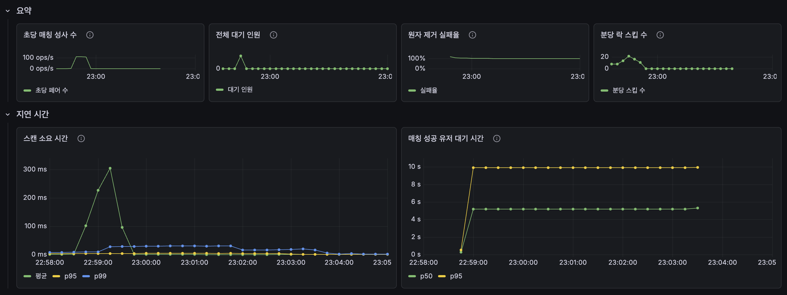
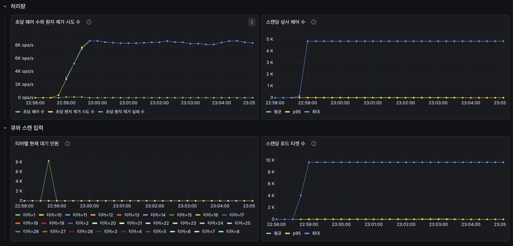
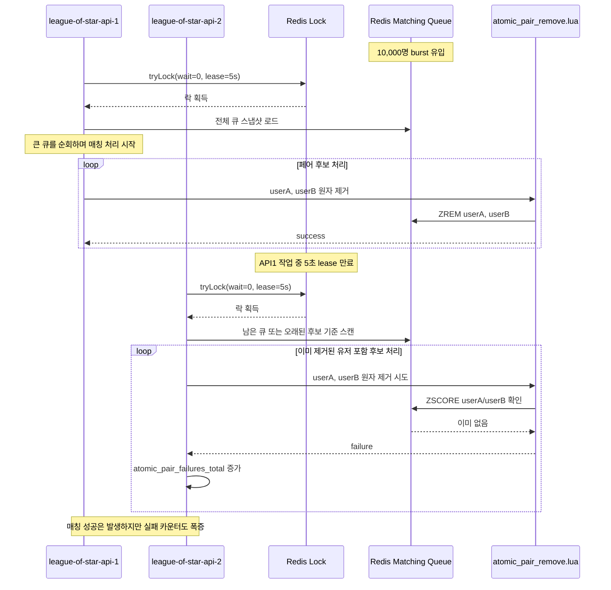
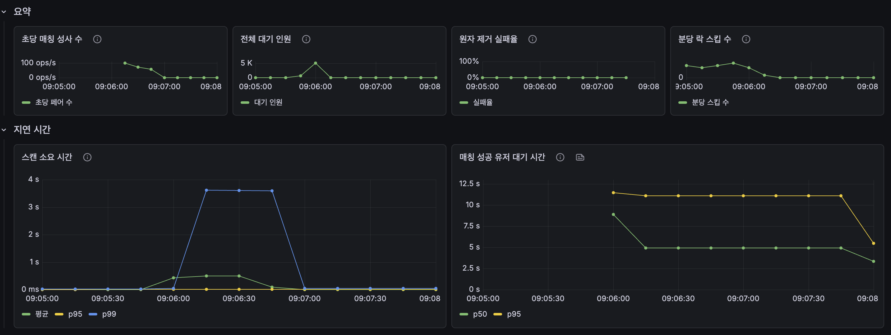
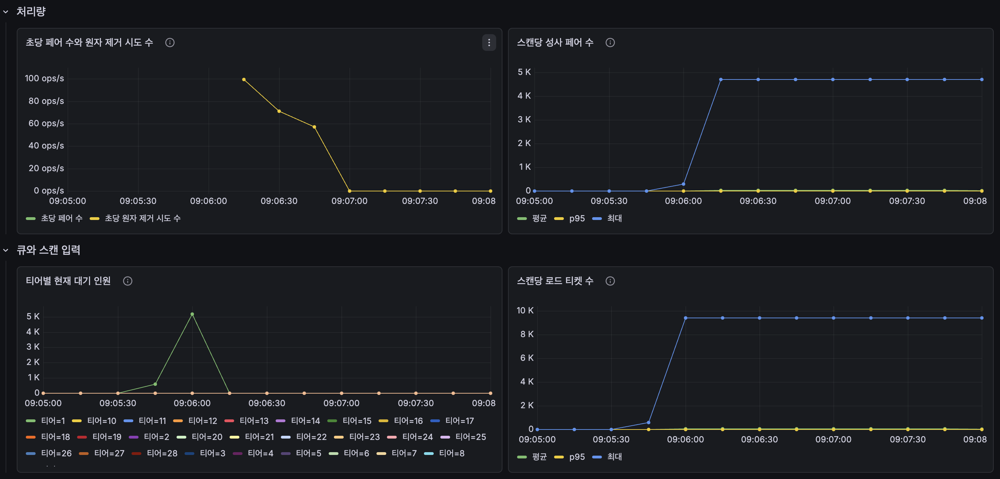

# 10000명 기준




## 실패 시나리오: 고정 lease time 기반 락 만료

> 이 내용은 Redisson watchdog 적용 전, 고정 `leaseTime=5s` 설정으로 실행한 실패 기록이다.

10,000명 burst 테스트에서는 `원자 제거 실패율`이 거의 100%에 가깝게 관측됐다.

이 결과는 매칭 자체가 전부 실패했다는 의미가 아니라, 한 인스턴스가 이미 큐에서 제거한 유저를 다른 인스턴스가 다시 제거하려고 시도하면서 실패 카운터가 폭증한 상황으로 해석한다.

현재 매칭 엔진은 분산 락을 잡을 때 고정 lease time을 사용한다.

```
lock.tryLock(0L, 5L, TimeUnit.SECONDS)
```

burst 상황에서는 한 번의 스캔에서 읽는 큐 크기가 매우 커진다. 이때 매칭 처리 시간이 5초를 넘으면, 아직 첫 번째 인스턴스가 작업 중이어도 Redis 락 lease가 만료될 수 있다.

그러면 두 번째 인스턴스가 새로 락을 획득하고 매칭 엔진을 실행한다. 그 결과 두 인스턴스가 같은 burst 대기열을 기준으로 원자 제거를 시도하게 되고, 이미 제거된 유저에 대한 `atomicPairRemove` 실패가 대량 발생한다.



## 현재 판단

현재 `V1 burst` 결과는 최종 성능 결과로 사용하면 안 된다.

| 항목 | 판단 |
| --- | --- |
| joinQueue burst 유입 | 요청은 들어감 |
| 매칭 성사 | 일부 정상 성사 |
| 원자 제거 실패율 | 비정상 |
| 원인 후보 | 고정 lease time 만료 후 매칭 엔진 중복 실행 |
| 다음 조치 | Redisson watchdog 방식 적용 후 재측정 |

이 실패 시나리오는 V1의 구조적 병목이라기보다, **매칭 엔진 락 유지 방식의 설정 문제**에 가깝다.

따라서 고정 lease time을 제거하고 Redisson watchdog이 락을 자동 연장하도록 변경한 뒤, 같은 10,000명 burst 테스트를 다시 실행한다.

----

## WatchDog 적용 결과




### 결론

Redisson watchdog 적용 후, 기존에 문제가 됐던 `원자 제거 실패율 100%` 현상은 사라졌다.

따라서 이전 burst 실패의 핵심 원인은 매칭 로직 자체가 아니라, **고정 lease time 만료로 인한 매칭 엔진 중복 실행**으로 보는 것이 맞다.

10,000명 burst는 V1 매칭 엔진 입장에서 부담이 큰 시나리오다. watchdog 적용 후 `매칭 성공 유저 대기 시간 p95`는 약 11초로, 캐주얼 게임 burst 허용 기준인 5초를 크게 넘었다. 다만 `스캔 소요 시간 p99`가 약 3.6초까지 튀어서 전체 큐 스캔 비용은 분명한 개선 후보로 남았다.

즉, watchdog 적용으로 **동시성 문제는 해결**됐지만, 10,000명 burst는 **캐주얼 게임 UX 성능 기준을 통과하지 못했다**.

### 결과 요약

| 지표 | 결과 | 판단 |
| --- | ---: | --- |
| 원자 제거 실패율 | 0% | 개선 성공 |
| 전체 대기 인원 | 약 5K까지 증가 후 0 수렴 | 회복 성공 |
| 초당 매칭 성사 수 | 초반 약 100 pair/s 근처까지 증가 | burst 큐 소진 진행 |
| 스캔당 성사 페어 수 | 최대 약 4.7K 페어 | 큰 큐를 한 번에 처리 |
| 스캔당 로드 티켓 수 | 최대 약 9.5K | 전체 큐 스캔 비용 증가 |
| 스캔 소요 시간 p99 | 약 3.6초 | V1 병목 후보 |
| 매칭 성공 유저 대기 시간 p50 | 약 5초 | burst 허용 경계 |
| 매칭 성공 유저 대기 시간 p95 | 약 11초 | burst 허용 5초 초과 |
| 분당 락 스킵 수 | 테스트 중 증가 후 0 수렴 | 중복 실행 방지 동작 |

### 해석

watchdog 적용 전에는 한 인스턴스가 매칭 처리 중이어도 5초 lease가 만료되면 다른 인스턴스가 락을 다시 획득할 수 있었다. 그 결과 이미 제거된 유저를 다시 제거하려고 시도하면서 `atomicPairRemove` 실패가 대량 발생했다.

watchdog 적용 후에는 작업 중 락이 자동 연장되므로, 긴 스캔이 진행되는 동안 다른 인스턴스가 같은 큐를 중복 스캔하지 않는다. 그 결과 `원자 제거 실패율`은 0%로 떨어졌다.

하지만 burst에서는 10,000명이 짧은 시간에 들어오기 때문에 한 번의 스캔에서 읽는 티켓 수가 약 9.5K까지 증가했다. V1은 전체 큐를 로드한 뒤 인메모리에서 FIFO 정렬과 후보 탐색을 수행하므로, 큐가 커질수록 스캔 시간이 크게 증가한다.

이번 결과에서 스캔 p99는 약 3.6초까지 올라갔다. 스케줄러는 1초 간격으로 실행되지만, 한 번의 스캔이 1초를 넘으면 다음 스캔은 밀릴 수밖에 없다. 이 때문에 매칭 성공 유저 대기 시간 p95도 약 11초까지 올라간 것으로 해석한다. 이 값은 burst 허용 기준인 5초를 넘으므로, V2 개선에서 줄여야 할 핵심 지표다.

### 이전 결과와 비교

| 항목 | watchdog 적용 전 | watchdog 적용 후 | 변화 |
| --- | ---: | ---: | --- |
| 원자 제거 실패율 | 거의 100% | 0% | 해결 |
| 원자 제거 실패 카운터 | 대량 증가 | 증가 없음 | 해결 |
| 매칭 엔진 중복 실행 | 발생 가능 | watchdog으로 방지 | 개선 |
| 큐 회복 | 실패 결과로 사용 불가 | 0 수렴 | 개선 |
| 매칭 대기 p95 | 실패 결과로 사용 불가 | 약 11초 | burst 허용 초과 |
| 스캔 p99 | 실패 결과로 사용 불가 | 약 3.6초 | V1 한계 확인 |

### 최종 판단

10,000명 burst 테스트는 watchdog 적용 후 **동시성 문제는 해결**했지만, **burst 성능 기준은 통과하지 못했다**.

매칭 대기 p95가 약 11초로 burst 허용 기준 5초를 초과했으므로, 다음처럼 정리하는 것이 맞다.

```text
Redisson watchdog 적용으로 10,000명 burst 상황에서 원자 제거 실패율 100% 문제를 0%로 개선했다.
다만 V1 전체 큐 스캔 구조에서는 burst 시 스캔 p99가 약 3.6초까지 증가했고,
매칭 성공 유저 대기 시간 p95가 약 11초까지 증가했다.
이는 burst 허용 기준 5초를 초과하므로,
이를 통해 V2에서는 큐 스캔 범위 축소 또는 티어별/청크 기반 처리 최적화가 필요함을 확인했다.
```

### 다음 개선 방향

| 개선 방향 | 이유 |
| --- | --- |
| 스캔당 처리량 제한 | 한 번의 스캔이 너무 길어지는 문제 완화 |
| 티어별 큐 분할 처리 최적화 | 전체 큐를 매번 크게 읽는 비용 감소 |
| 후보 탐색 범위 축소 | 인메모리 페어 탐색 비용 감소 |
| 매칭 엔진 전용 워커 분리 검토 | API 인스턴스와 배치 작업의 리소스 영향 분리 |

-----------
