# V1 Steady 부하 테스트 결과

## 결론

V1 매칭 엔진은 `5 TPS / 5분`, `25 TPS / 5분`, `50 TPS / 5분` 테스트를 모두 통과했다.

steady 테스트에서 가장 중요한 목표는 `매칭 성공 유저 대기 시간 p95 < 1초`이다. 기존 측정에서는 50 TPS에서도 약 1초 수준으로 유지됐고, 테스트 종료 후 전체 대기 인원도 0으로 수렴했다.

다만 이후 매칭 대기 시간 측정 기준을 스캔 시작 시각이 아니라 실제 페어별 `match found` 처리 시각으로 보정했으므로, 최종 수치는 50 TPS steady를 다시 측정해 확정한다.

API의 `joinQueue`는 50 TPS에서도 p95가 약 6~15ms 수준이라 병목으로 보이지 않는다. 대신 TPS가 커질수록 `스캔 소요 시간`, `스캔당 로드 티켓 수`, `스캔당 성사 페어 수`가 같이 증가했다. 따라서 V1 구조의 다음 병목 후보는 API가 아니라 **매칭 엔진의 전체 큐 스캔 비용**이다.

---

## 성공 기준

| 기준 | 목표 |
| --- | ---: |
| joinQueue 5xx 비율 | 1% 미만 |
| joinQueue p95 응답 시간 | 300ms 미만 |
| 매칭 성공 유저 대기 시간 p95 | 목표 1초 미만 / 허용 2초 미만 |
| 전체 대기 인원 | 테스트 종료 후 1분 내 0 수렴 |
| 초당 매칭 성사 수 | 목표 TPS의 절반에 근접 |
| 원자 제거 실패율 | join-only 테스트에서는 0에 가까워야 함 |

---

## 한눈에 보는 결과

| 지표 | 5 TPS / 5분 | 25 TPS / 5분 | 50 TPS / 5분 | 판단 |
| --- | ---: | ---: | ---: | --- |
| 총 요청 수 | 1,500명 | 7,500명 | 15,000명 | 요청량 증가 |
| 기대 매칭 수 | 750페어 | 3,750페어 | 7,500페어 | 정상 |
| 실제 매칭 수 | 약 750페어 | 약 3.7~3.8K 페어 | 약 7.5K 페어 | 기대값과 일치 |
| joinQueue 처리량 | 약 5 req/s | 약 25 req/s | 약 50 req/s | 목표 TPS 달성 |
| 인스턴스별 처리량 | 약 2.5 req/s | 약 12.5 req/s | 약 25 req/s | 8080/8081 균등 분산 |
| joinQueue p95 | 약 10~12ms | 약 8~9ms | 약 6~15ms | 300ms보다 충분히 낮음 |
| 매칭 대기 p95 | 약 1.1~1.2s | 약 0.9~1.0s | 약 0.95~1.0s | 목표 경계선 |
| 최대 대기 인원 | 약 5명 | 약 20~25명 | 약 50명 | 일시 증가 후 0 수렴 |
| 스캔 p95 | 약 10~12ms | 약 25~28ms | 약 50~60ms | TPS 증가에 따라 증가 |
| 스캔 p99 | 낮음 | 낮음 | 약 180~190ms | 아직 스케줄 주기보다 낮음 |
| 스캔당 로드 티켓 p95 | 약 6 | 약 28~30 | 약 55~60 | TPS 증가에 따라 증가 |
| JVM 상태 | 안정 | 안정 | 안정 | 병목 신호 없음 |

---

## 5 TPS / 5분 = 1,500명

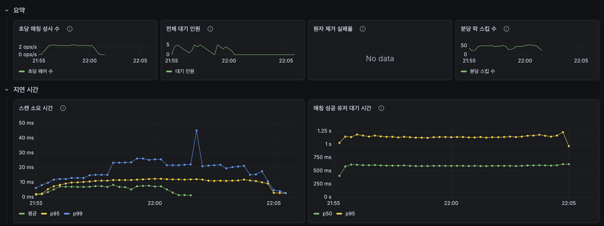
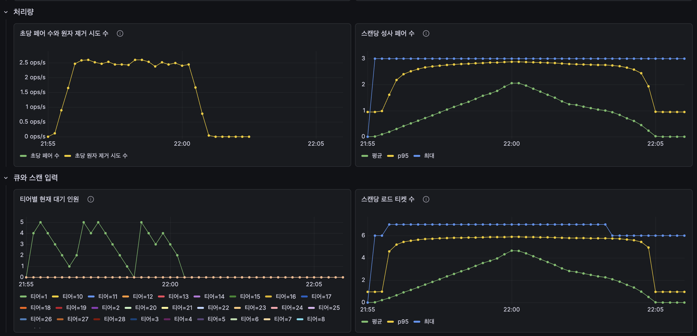
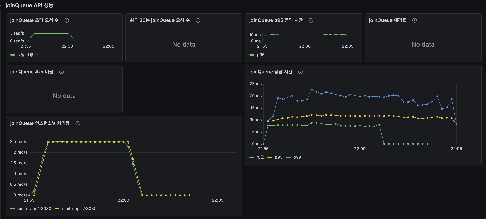
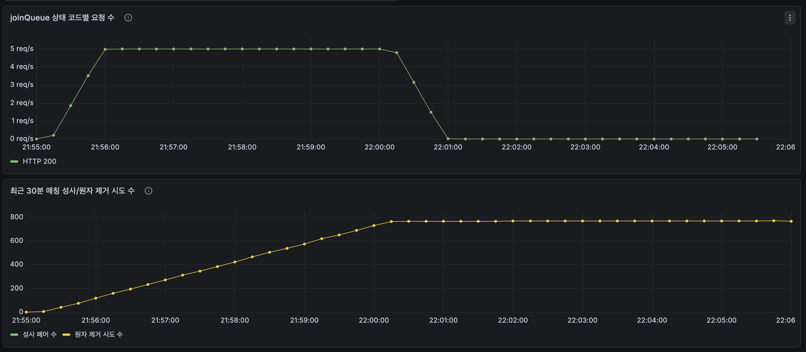
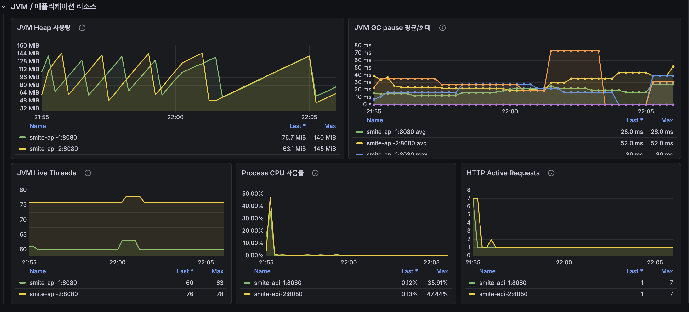

### 실행 조건

| 항목 | 값 |
| --- | ---: |
| 목표 TPS | 5 TPS |
| 실행 시간 | 5분 |
| 총 요청 수 | 1,500명 |
| 기대 매칭 수 | 750페어 |
| API 인스턴스 | 2개 |

### 결과

| 지표 | 결과 | 성공 기준 | 판단 |
| --- | ---: | ---: | --- |
| joinQueue 처리량 | 약 5 req/s | 5 req/s | 통과 |
| joinQueue p95 | 약 10~12ms | 300ms 미만 | 통과 |
| HTTP 상태 코드 | 200만 관측 | 5xx 1% 미만 | 통과 |
| 실제 매칭 수 | 약 750페어 | 750페어 | 통과 |
| 매칭 대기 p95 | 약 1.1~1.2s | 목표 1초 미만 / 허용 2초 미만 | 허용 |
| 최대 대기 인원 | 약 5명 | 종료 후 0 수렴 | 통과 |
| 스캔 p95 | 약 10~12ms | 스케줄 주기보다 낮음 | 통과 |
| 스캔당 로드 티켓 p95 | 약 6 | 낮을수록 좋음 | 안정 |

### 해석

5 TPS에서는 V1 매칭 엔진이 매우 안정적으로 동작했다.

1,500명이 들어왔고, 2명씩 매칭되므로 기대 매칭 수는 750페어다. 실제 결과도 약 750페어로 기대값과 맞았다.

사용자가 큐에 들어간 뒤 매칭될 때까지 걸린 시간 p95는 약 1.1~1.2초다. 목표 1초에는 살짝 못 미치지만 허용 기준 2초 안이다.

큐도 테스트 종료 후 0으로 줄었다. 즉, 매칭 엔진이 들어온 유저를 남김없이 처리했다.

JVM도 안정적이었다. Heap은 GC 후 내려왔고, CPU와 Thread도 계속 증가하지 않았다.

### 5 TPS 결론

`5 TPS / 5분`은 문제 없이 통과했다.

이 구간에서는 API, 매칭 엔진, Redis 큐, JVM 모두 병목 신호가 없다.

---

## 25 TPS / 5분 = 7,500명

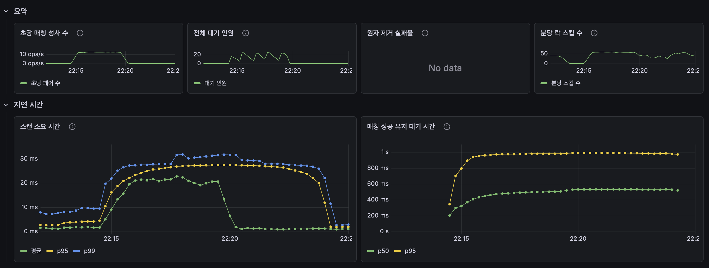
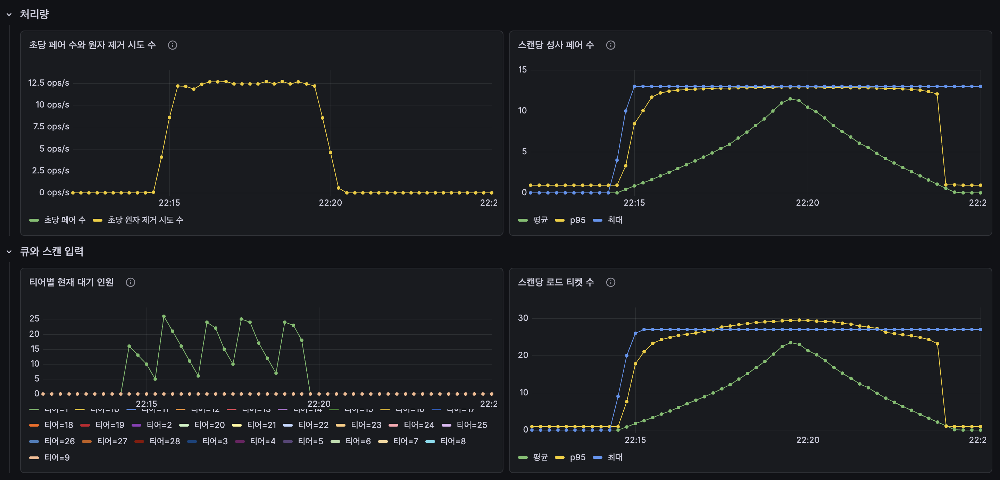
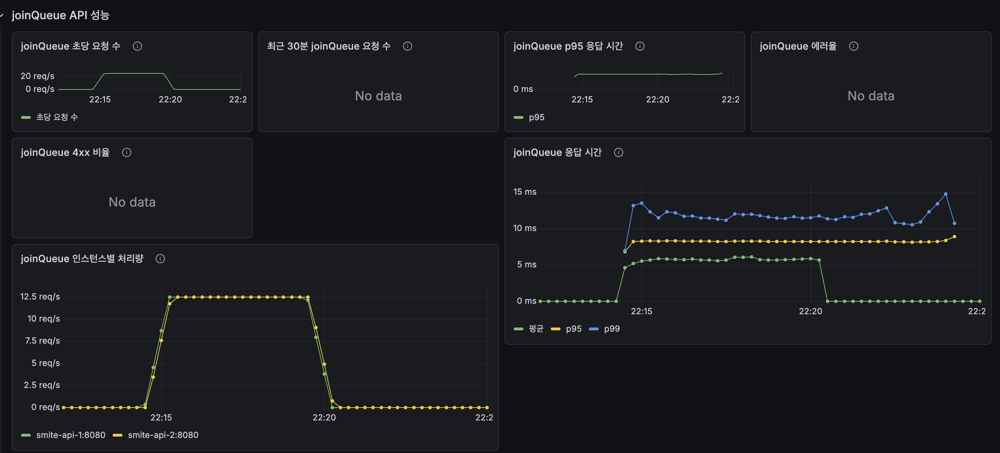
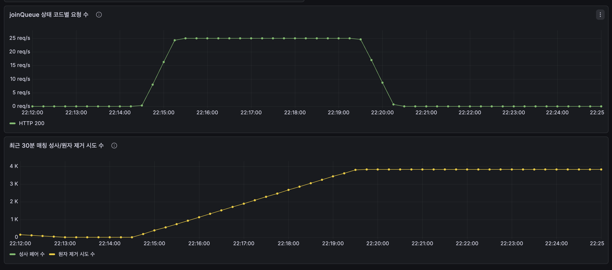
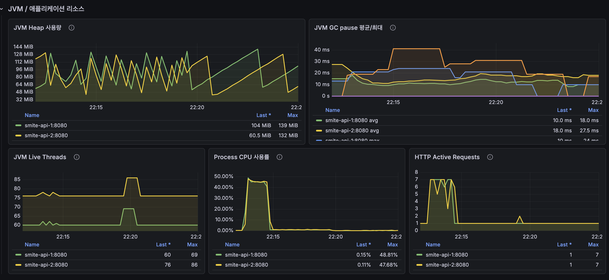

### 실행 조건

| 항목 | 값 |
| --- | ---: |
| 목표 TPS | 25 TPS |
| 실행 시간 | 5분 |
| 총 요청 수 | 7,500명 |
| 기대 매칭 수 | 3,750페어 |
| API 인스턴스 | 2개 |

### 결과

| 지표 | 결과 | 성공 기준 | 판단 |
| --- | ---: | ---: | --- |
| joinQueue 처리량 | 약 25 req/s | 25 req/s | 통과 |
| joinQueue p95 | 약 8~9ms | 300ms 미만 | 통과 |
| HTTP 상태 코드 | 200만 관측 | 5xx 1% 미만 | 통과 |
| 실제 매칭 수 | 약 3.7~3.8K 페어 | 3,750페어 | 통과 |
| 매칭 대기 p95 | 약 0.9~1.0s | 목표 1초 미만 / 허용 2초 미만 | 목표 근접 |
| 최대 대기 인원 | 약 20~25명 | 종료 후 0 수렴 | 통과 |
| 스캔 p95 | 약 25~28ms | 스케줄 주기보다 낮음 | 통과 |
| 스캔당 로드 티켓 p95 | 약 28~30 | 낮을수록 좋음 | 증가 |

### 해석

25 TPS는 5 TPS보다 요청량이 5배 큰 테스트다.

7,500명이 들어왔고, 기대 매칭 수는 3,750페어다. 실제 결과도 약 3.7~3.8K 페어로 기대값과 거의 같았다.

가장 중요한 `매칭 대기 p95`는 약 0.9~1.0초다. 캐주얼 게임 목표 기준인 1초에 근접한다.

큐는 테스트 중 최대 약 20~25명까지 쌓였지만, 테스트 종료 후 0으로 줄었다. 즉, 일시적으로 큐가 생기긴 했지만 엔진이 따라잡았다.

스캔 p95는 5 TPS의 약 10~12ms에서 25 TPS의 약 25~28ms로 증가했다. 스캔당 로드 티켓도 약 6에서 약 28~30으로 증가했다.

이 말은 TPS가 커질수록 매칭 엔진이 한 번에 읽고 처리해야 하는 큐 크기가 커진다는 뜻이다. 아직은 충분히 빠르지만, 더 큰 TPS에서는 이 부분이 병목이 될 가능성이 있다.

JVM은 안정적이었다. Heap, GC, Thread, CPU 모두 계속 증가하는 패턴이 없었다. 따라서 현재 성능 변화는 JVM 문제라기보다 매칭 엔진의 스캔 입력 증가 영향으로 보는 것이 맞다.

### 25 TPS 결론

`25 TPS / 5분`도 통과했다.

다만 5 TPS보다 `스캔 소요 시간`과 `스캔당 로드 티켓 수`가 확실히 증가했다.

---

## 50 TPS / 5분 = 15,000명

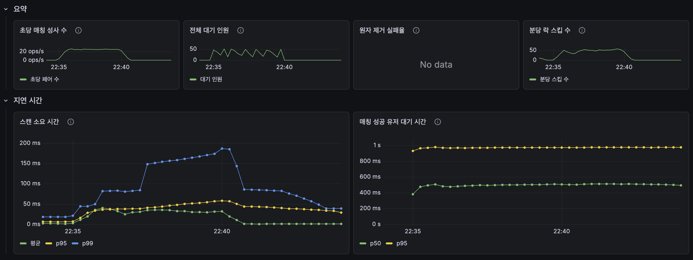
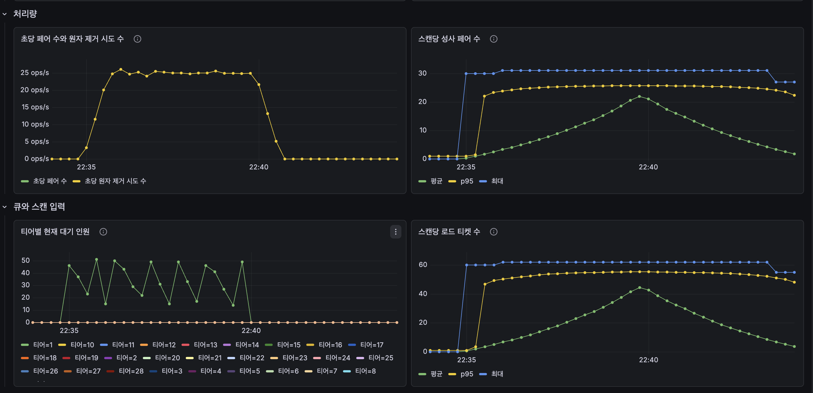
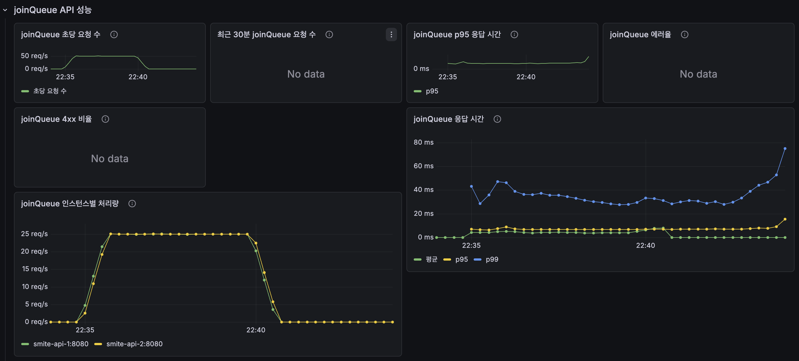
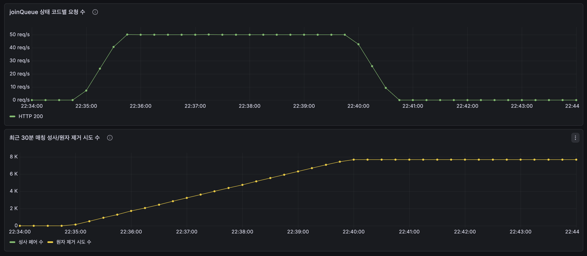
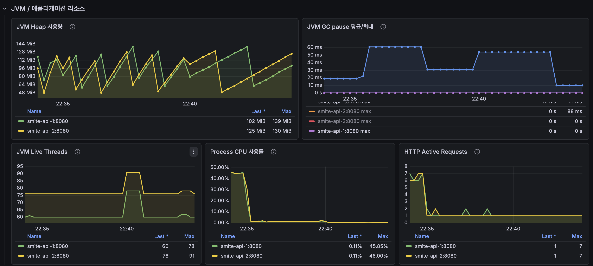

### 실행 조건

| 항목 | 값 |
| --- | ---: |
| 목표 TPS | 50 TPS |
| 실행 시간 | 5분 |
| 총 요청 수 | 15,000명 |
| 기대 매칭 수 | 7,500페어 |
| API 인스턴스 | 2개 |

### 결과

| 지표 | 결과 | 성공 기준 | 판단 |
| --- | ---: | ---: | --- |
| joinQueue 처리량 | 약 50 req/s | 50 req/s | 통과 |
| 인스턴스별 처리량 | 약 25 req/s | 균등 분산 | 통과 |
| joinQueue p95 | 약 6~15ms | 300ms 미만 | 통과 |
| joinQueue p99 | 대략 30~80ms | 참고 지표 | 안정 |
| HTTP 상태 코드 | 200만 관측 | 5xx 1% 미만 | 통과 |
| 실제 매칭 수 | 약 7.5K 페어 | 7,500페어 | 통과 |
| 초당 매칭 성사 수 | 약 20~25 pair/s | 25 pair/s 근접 | 통과 |
| 매칭 대기 p95 | 약 0.95~1.0s | 목표 1초 미만 / 허용 2초 미만 | 목표 경계선 |
| 최대 대기 인원 | 약 50명 | 종료 후 0 수렴 | 통과 |
| 스캔 p95 | 약 50~60ms | 스케줄 주기보다 낮음 | 통과 |
| 스캔 p99 | 약 180~190ms | 스케줄 주기보다 낮음 | 통과 |
| 스캔당 로드 티켓 p95 | 약 55~60 | 낮을수록 좋음 | 증가 |

### 해석

50 TPS는 5분 동안 15,000명이 매칭에 진입하는 테스트다. 2명씩 매칭되므로 기대 매칭 수는 7,500페어다.

실제 매칭 수도 약 7.5K 페어까지 올라갔다. 즉, 들어온 사용자를 거의 기대값대로 매칭했다.

`joinQueue` API는 안정적이었다. 전체 처리량은 약 50 req/s였고, 두 인스턴스가 각각 약 25 req/s씩 처리했다. p95 응답 시간도 약 6~15ms 수준이라 성공 기준인 300ms보다 훨씬 낮다. 5xx 에러도 보이지 않았다.

매칭 성공 유저 대기 시간 p95는 약 1초다. 50 TPS에서도 캐주얼 게임 목표 기준인 1초 경계선에 있다.

큐는 테스트 중 약 50명까지 쌓였지만, 테스트 종료 후 0으로 줄었다. 즉, 순간적으로 대기열이 생기더라도 매칭 엔진이 따라잡을 수 있었다.

다만 스캔 비용은 확실히 커졌다. 스캔 p95는 약 50~60ms, p99는 약 180~190ms까지 올라갔다. 아직 1초 스케줄 주기보다 낮아서 문제는 아니지만, TPS가 더 커지면 가장 먼저 봐야 할 지표다.

### JVM 해석

JVM은 50 TPS에서도 병목으로 보이지 않는다.

Heap은 두 인스턴스 모두 GC 후 다시 내려가는 패턴을 보였다. 계속 우상향하지 않기 때문에 메모리 누수 신호는 아니다.

Thread 수는 증가 후 안정화됐고, Process CPU도 테스트 중 순간적으로만 올라갔다. HTTP active request도 계속 쌓이지 않았다. 따라서 API 서버 내부에서 요청이 밀리는 상황은 아니다.

### GC 패널에서 한 인스턴스가 사라진 것처럼 보이는 이유

GC 패널에서 특정 인스턴스가 안 보이는 것처럼 보일 수 있다. 이건 인스턴스가 죽었거나 Prometheus 수집이 끊겼다는 의미로 보기는 어렵다.

이유는 GC 지표의 특성 때문이다.

| 원인 | 설명 |
| --- | --- |
| GC가 발생하지 않은 구간 | 해당 인스턴스에서 GC pause count가 증가하지 않으면 평균 GC pause 계산값이 거의 0으로 나온다. |
| `jvm_gc_pause_seconds_max` 특성 | max 값은 계속 누적되는 카운터가 아니라 최근 관측값 성격이라, 구간에 따라 0에 붙어서 보일 수 있다. |
| 그래프 겹침 | 0에 가까운 선은 x축이나 다른 0 값 선과 겹쳐서 화면에서 사라진 것처럼 보인다. |
| 같은 패널에 avg/max가 같이 있음 | 인스턴스 2개에 avg/max까지 합쳐져 여러 선이 겹치므로, 일부 선이 눈에 잘 안 띌 수 있다. |

중요한 건 다른 JVM 패널이다. 같은 시간대에 Heap, Thread, CPU, HTTP active request에서는 두 인스턴스가 모두 보인다. 그래서 GC 패널만 보고 한 인스턴스가 빠졌다고 판단하면 안 된다.

정확히 확인하려면 Prometheus에서 인스턴스별로 아래 지표를 따로 보면 된다.

```promql
jvm_gc_pause_seconds_count{instance="smite-api-1:8080"}
jvm_gc_pause_seconds_count{instance="smite-api-2:8080"}
jvm_gc_pause_seconds_max{instance="smite-api-1:8080"}
jvm_gc_pause_seconds_max{instance="smite-api-2:8080"}
```

### 50 TPS 결론

`50 TPS / 5분`도 통과했다.

API는 여전히 여유가 있고, 매칭 대기 시간도 약 1초 수준이다. 대기열도 테스트 종료 후 0으로 수렴했다.

하지만 스캔 p95/p99와 스캔당 로드 티켓 수가 가장 크게 증가했다. 따라서 V1에서 다음 개선 포인트는 `joinQueue API`가 아니라 **매칭 엔진이 매번 큐를 읽고 스캔하는 방식**이다.

---

## 최종 판단

V1 steady 테스트는 `5 TPS`, `25 TPS`, `50 TPS` 모두 성공했다.

| 항목 | 판단 |
| --- | --- |
| API 진입 성능 | 안정적 |
| 매칭 대기 시간 | 안정적 |
| 큐 회복 | 정상 |
| JVM 리소스 | 안정적 |
| 현재 병목 | 없음 |
| 다음 병목 후보 | 매칭 엔진의 전체 큐 스캔 비용 |

포트폴리오에 적을 핵심 문장은 다음과 같다.

```text
V1 매칭 엔진은 50 TPS를 5분간 유지하는 부하에서 15,000명의 매칭 진입 요청을 처리했고,
기대값에 가까운 약 7,500페어를 성사시켰다.
매칭 성공 유저 대기 시간 p95는 약 1초로 캐주얼 게임 목표 기준에 근접했고,
테스트 종료 후 Redis 대기열은 0으로 수렴했다.
```

다음 개선에서 비교할 핵심 지표는 다음 4개다.

| 지표 | 비교 이유 |
| --- | --- |
| 매칭 대기 p95 | 사용자가 체감하는 핵심 지표 |
| 스캔 p95/p99 | 매칭 엔진 내부 처리 비용 |
| 스캔당 로드 티켓 수 | 큐 스캔 범위가 커지는지 확인 |
| 테스트 종료 후 큐 수렴 시간 | 엔진이 유입량을 끝까지 처리하는지 확인 |
