# League of Smite - Domain Status

이 문서는 League of Smite 프로젝트의 핵심 도메인별 상태 전환 흐름을 정의합니다.

## 1. User (유저 상태)
유저의 서비스 이용 상태 흐름입니다.

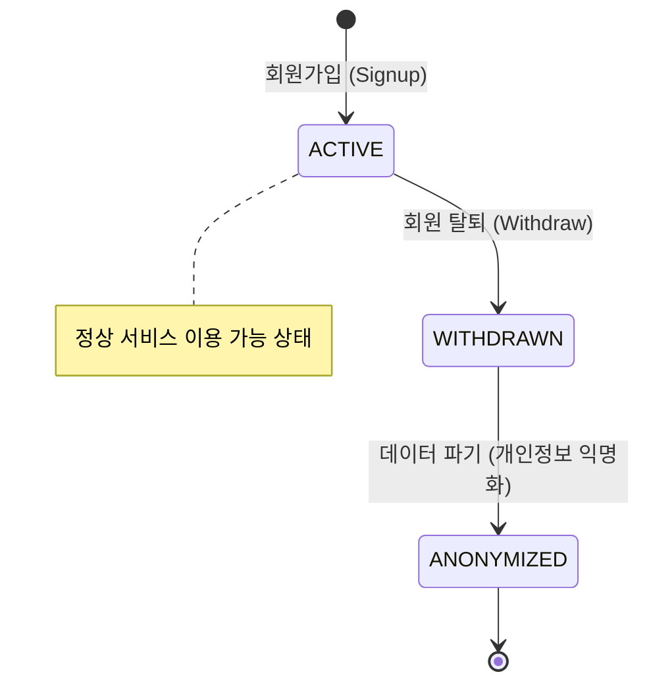

## 2. Match (매칭 상태)
매칭 큐에 진입한 순간부터 게임이 성사되기까지의 흐름입니다.

매칭 상태는 두 층으로 나누어 봅니다.

- **세션 상태**: matchId 단위의 전체 상태입니다. `FOUND`, `ACCEPTED`, `DECLINED`, `TIMEOUT`으로 정산됩니다.
- **유저 응답 상태**: 세션 안에서 각 유저가 10초 응답 윈도우 동안 어떤 응답을 했는지 나타냅니다. `PENDING`, `ACCEPTED`, `REJECTED`, `TIMEOUT`으로 관리됩니다.

한 명이 먼저 `ACCEPTED` 또는 `REJECTED`가 되어도 세션은 바로 종료되지 않습니다. 상대방의 10초 응답권을 보장하기 위해 세션은 `FOUND`를 유지합니다. 단, 양쪽 모두 `ACCEPTED`가 되면 즉시 `ACCEPTED`로 완료하고, 그 외 실패 조합은 10초 deadline 정산 시점에 최종 결과로 확정합니다.

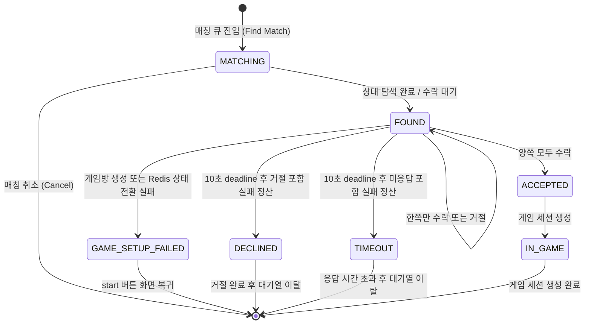

### 2.1 세션 상태와 유저 응답 상태

| 구분 | 상태 | 의미 |
|------|------|------|
| 세션 | `MATCHING` | 유저가 매칭 큐에서 상대를 찾는 중 |
| 세션 | `FOUND` | 상대를 찾았고 양쪽 수락/거절 응답을 기다리는 중 |
| 세션 | `ACCEPTED` | 양쪽 모두 수락하여 게임 세션 생성 대상 |
| 세션 | `GAME_SETUP_FAILED` | 양쪽 수락 후 게임방 생성 또는 Redis 상태 전환 실패로 게임 진입 실패 |
| 세션 | `DECLINED` | 거절이 포함되어 매칭 실패로 정산 완료 |
| 세션 | `TIMEOUT` | 10초 응답 윈도우 만료로 매칭 실패 정산 완료 |
| 유저 응답 | `PENDING` | 아직 수락/거절하지 않음 |
| 유저 응답 | `ACCEPTED` | 제한 시간 안에 수락함 |
| 유저 응답 | `REJECTED` | 제한 시간 안에 거절함 |
| 유저 응답 | `TIMEOUT` | 제한 시간 안에 응답하지 않음 |

### 2.2 시나리오별 상태 전이

#### 둘 다 수락

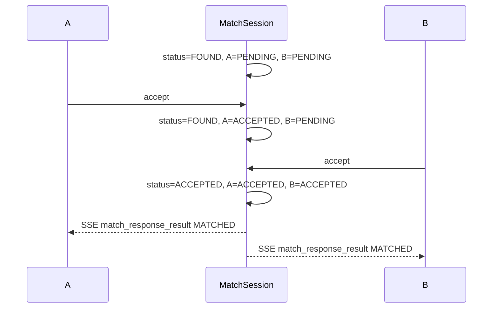

- A/B 모두 게임 대기 화면으로 이동합니다.
- `match_response_result` 이벤트에는 상대 `nickname`, `tier`, `tierScore`가 포함됩니다.
- 게임 세션 생성과 `gameId` payload 채우기는 별도 게임 이슈에서 처리하며, 이번 매칭 응답 이슈에서는 `game=null`을 유지합니다.

#### A 수락, B 거절

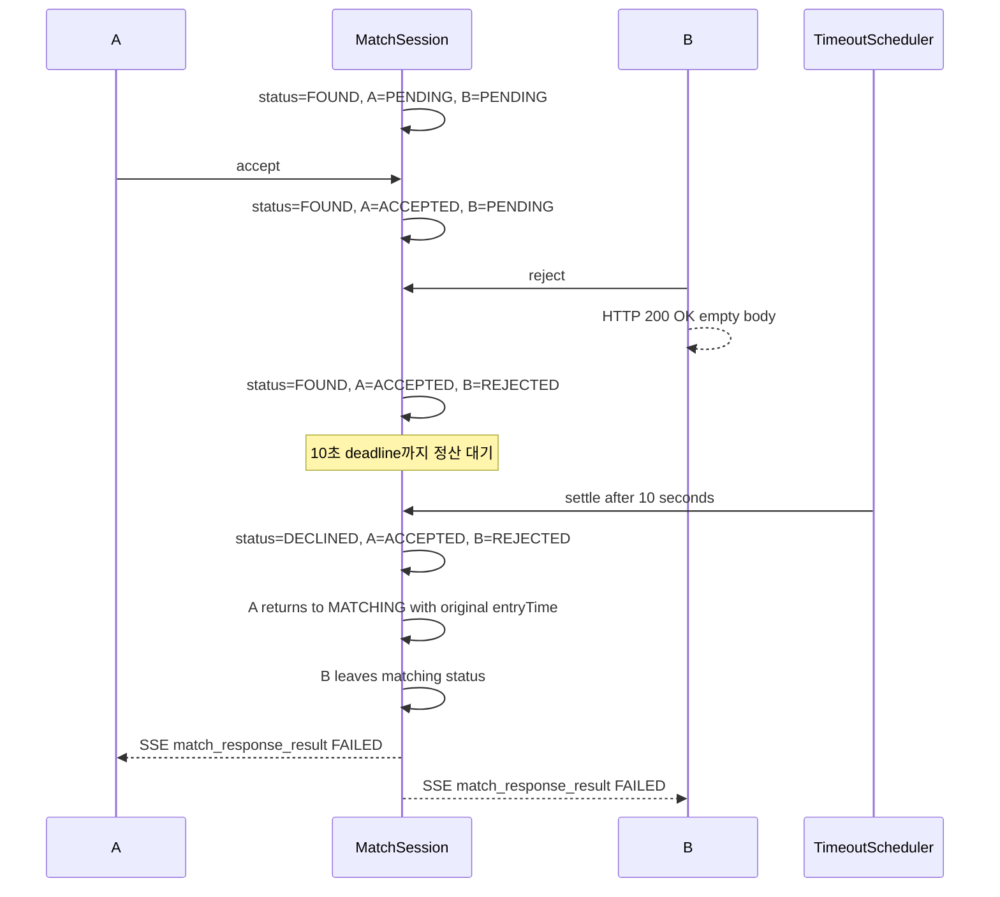

- A는 제한 시간 안에 수락했으므로 기존 `entryTime`으로 큐에 복귀합니다.
- B는 거절 후 정산 대기 상태를 유지하다가 최종 SSE 이벤트를 받은 뒤 start 버튼 화면으로 돌아갑니다.

#### A 거절, B 수락

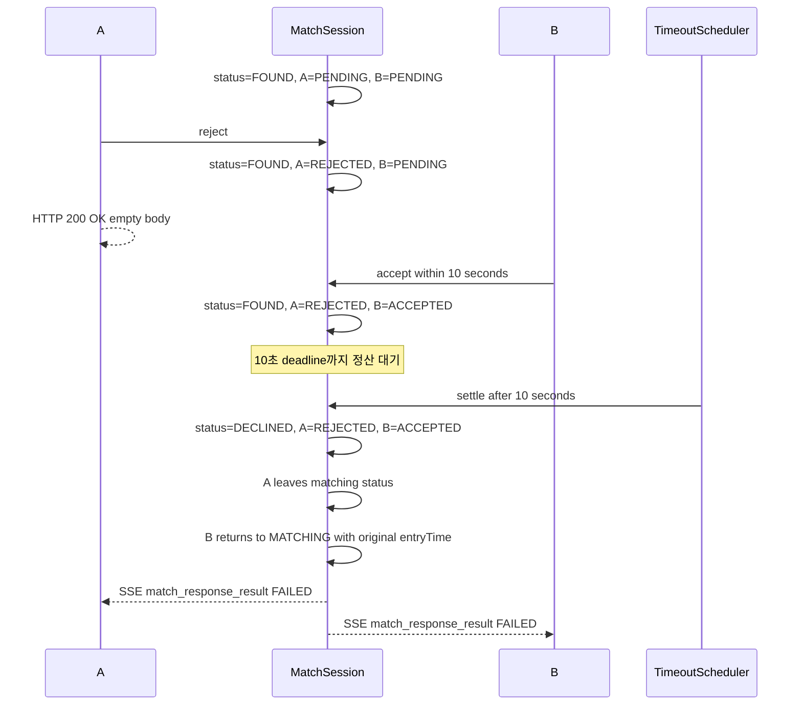

- A가 거절한 즉시 B에게 실패 SSE를 보내지 않습니다.
- A는 거절 후 start 버튼으로 바로 돌아가지 않고 정산 대기 상태를 유지합니다.
- B는 10초 응답권을 유지하고, 제한 시간 안에 수락했을 때만 큐 복귀 대상이 됩니다.

#### A 거절, B 미응답

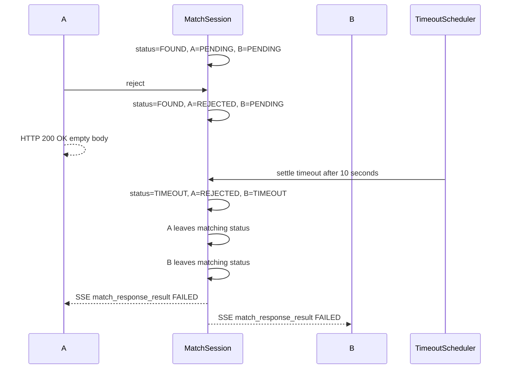

- B는 응답하지 않았으므로 큐에 복귀하지 않습니다.
- A는 거절 후 정산 대기 상태를 유지하고, timeout 정산 시점에 최종 이벤트를 받아 start 버튼 화면으로 돌아갑니다.

#### A 수락, B 미응답

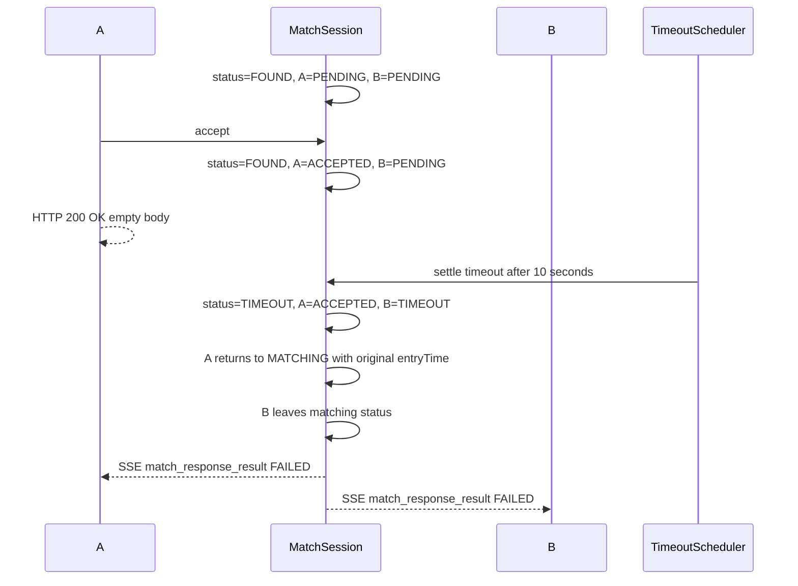

- A는 제한 시간 안에 수락했으므로 기존 `entryTime`으로 큐에 복귀합니다.
- B는 timeout이므로 큐에 복귀하지 않고 start 버튼 화면으로 돌아갑니다.

#### 둘 다 거절

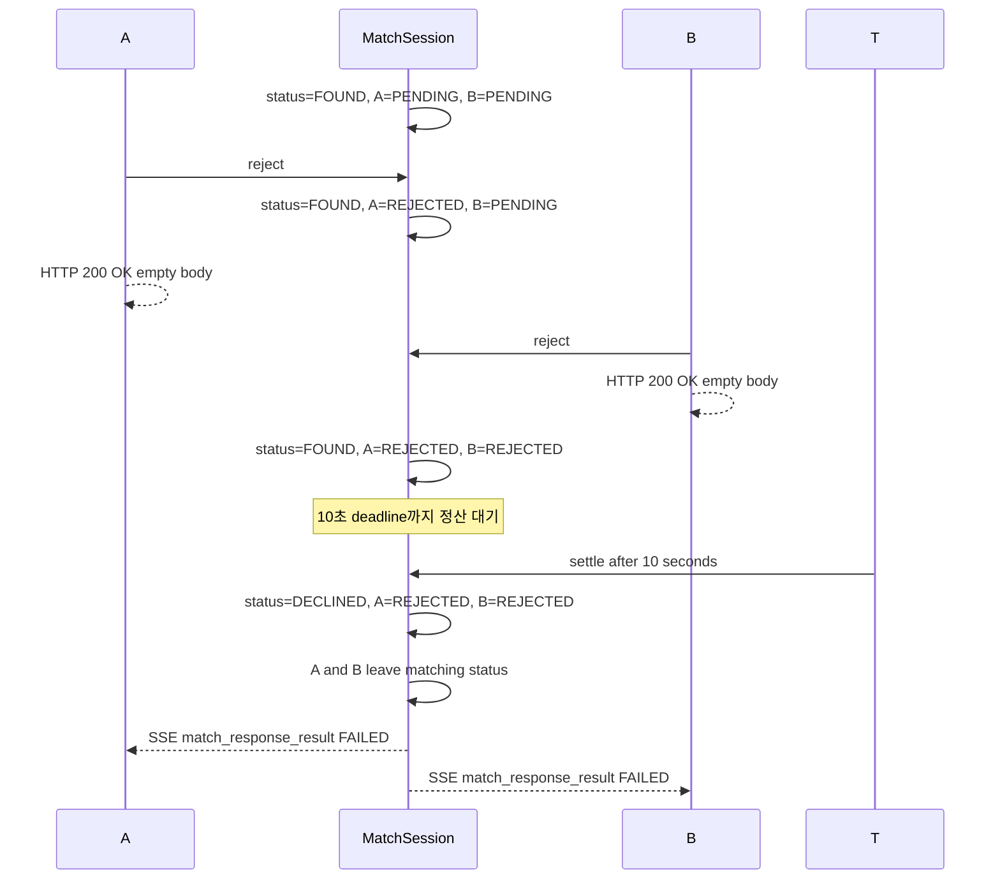

- 둘 다 거절했으므로 큐 복귀 대상은 없습니다.
- 각 유저는 reject HTTP 응답 이후 정산 대기 상태를 유지하고, 최종 SSE 이벤트로 start 버튼 화면에 돌아갑니다.

#### 둘 다 timeout

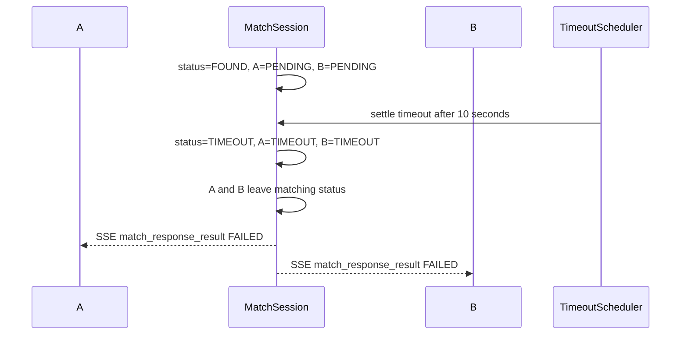

- 둘 다 제한 시간 안에 응답하지 않았으므로 큐 복귀 대상은 없습니다.
- 양쪽 모두 start 버튼 화면으로 돌아갑니다.

## 3. Game (게임 세션 상태)
실제 게임이 진행되는 과정의 상태 흐름입니다.

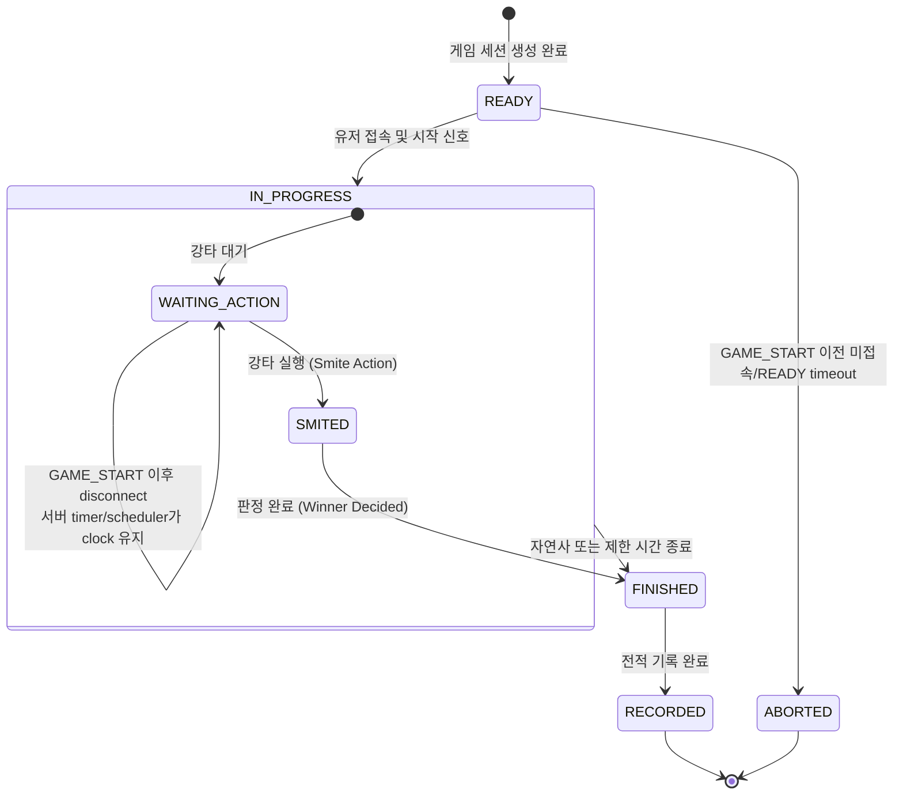

- `GAME_START` 이전 timeout은 유효한 판이 아니므로 `ABORTED` 처리하고 record/LP를 반영하지 않습니다.
- `GAME_START` 이후 disconnect는 gameRoom을 `ABORTED`로 만들지 않습니다.
- disconnect 유저는 이후 추가 입력을 할 수 없지만, 이미 서버가 수신한 액션은 유지합니다.
- WebSocket 연결이 모두 끊겨도 gameRoom 종료 작업은 서버 timer/scheduler 기준으로 완료합니다.
- 서버는 HP scenario와 수신 액션 기준으로 승/패/무승부를 판정하고, 그 결과만 record/LP에 반영합니다.

## 4. Game WebSocket Session (게임 대기 WebSocket 연결 상태)

게임 대기 WebSocket 연결 상태는 DB에 저장하지 않고 API 인스턴스 local memory registry에서 관리합니다.
이 상태는 `game_rooms.status` 또는 `game_participants.status`와 구분되는 일시적 연결 상태입니다.

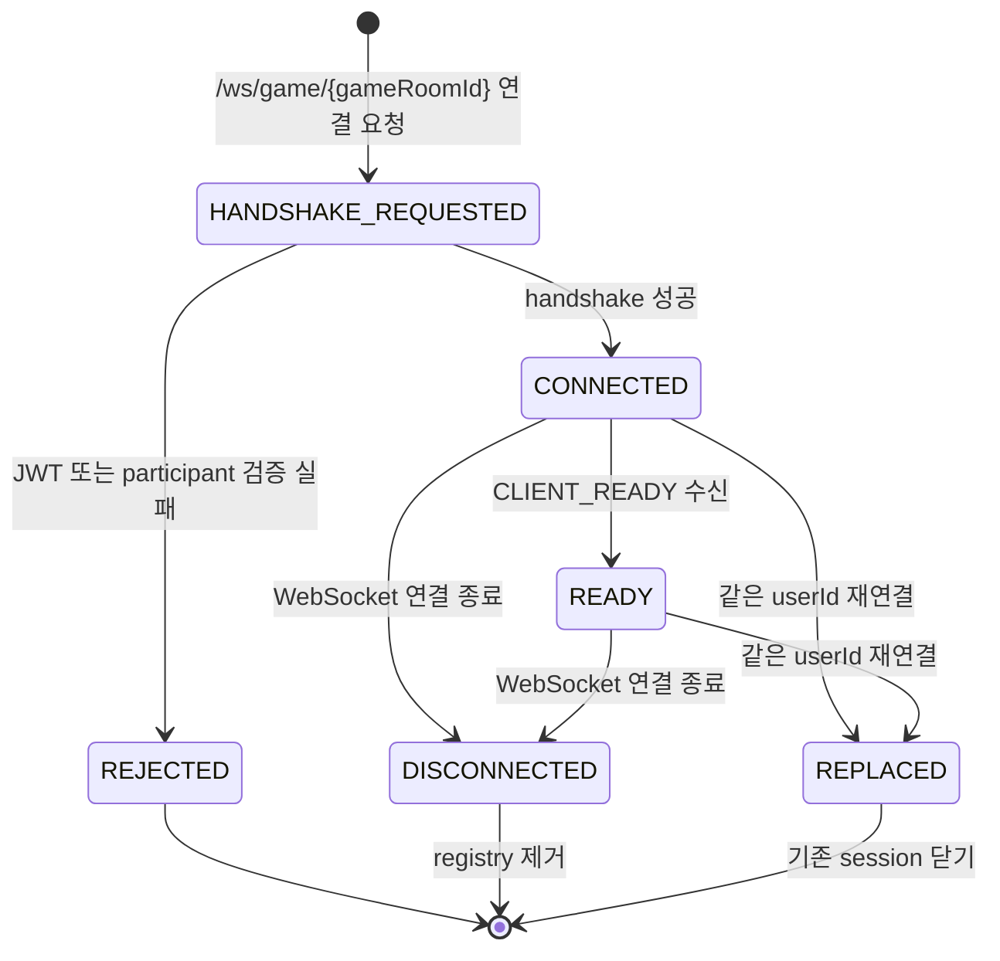

| 상태 | 저장 위치 | 의미 |
|------|-----------|------|
| `HANDSHAKE_REQUESTED` | 저장 안 함 | WebSocket upgrade 요청을 수신하고 handshake 검증 중 |
| `REJECTED` | 저장 안 함 | JWT 검증 실패, gameRoom 미존재, READY 아님, participant 아님으로 연결 거부 |
| `CONNECTED` | API local memory registry | handshake 성공 후 gameRoom/user 단위 WebSocket session 등록 완료 |
| `READY` | API local memory registry | 클라이언트가 `CLIENT_READY`를 보내 대기 준비 완료 |
| `DISCONNECTED` | registry에서 제거 | WebSocket 연결 종료로 session 제거 |
| `REPLACED` | registry에서 기존 session 제거 | 같은 userId가 같은 gameRoom에 재연결하여 기존 session을 새 session으로 교체 |

- 멀티 인스턴스 환경에서는 같은 `gameRoomId`의 두 참가자가 같은 API 인스턴스로 라우팅되어야 합니다.
- WebSocket session status는 일시적 연결 상태이므로 전적, LP, game record에 직접 반영하지 않습니다.
- GAME_START 이전 WebSocket 미접속, READY timeout, 연결 종료에 따른 gameRoom `ABORTED` 처리는 별도 timeout 정책에서 수행합니다.
- GAME_START 이후 disconnect는 session registry에서 제거되지만, gameRoom은 정상 판정 흐름을 유지합니다.

## 5. Password Reset (비밀번호 재설정)
Redis에서 관리되는 비밀번호 재설정 토큰의 수명 주기입니다.

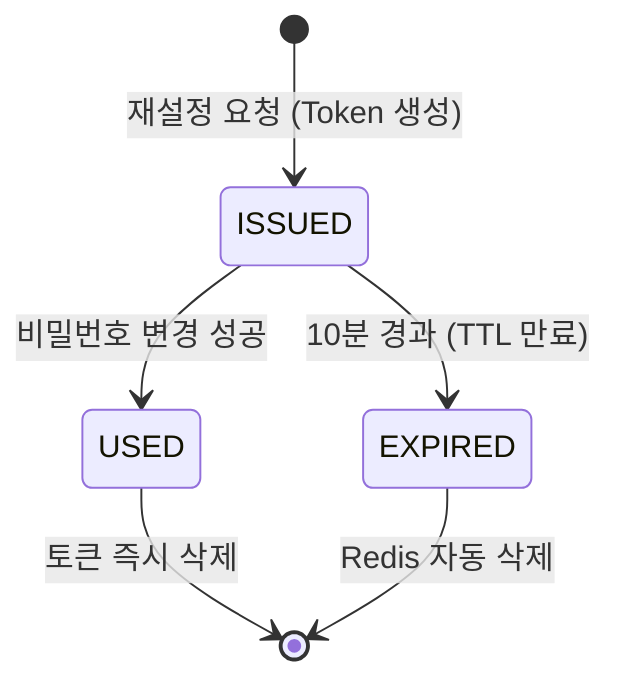
