# League of Star - Domain Status

이 문서는 League of Star 프로젝트의 핵심 도메인별 상태 전환 흐름을 정의합니다.

## 1. User (유저 상태)
유저의 서비스 이용 상태 흐름입니다.

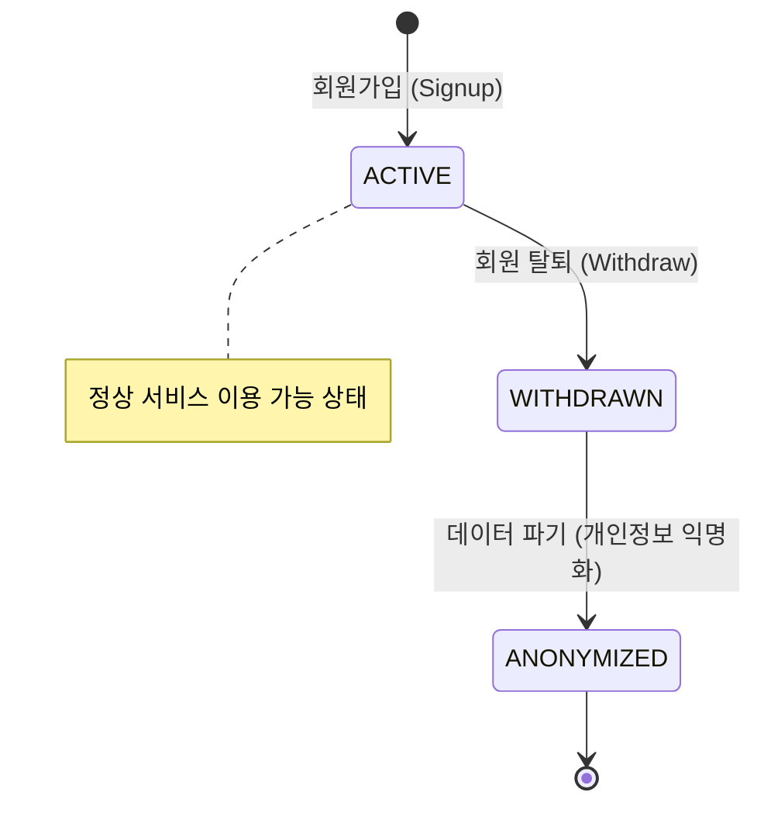

## 2. Match (매칭 상태)
매칭 큐에 진입한 순간부터 게임이 성사되기까지의 흐름입니다.

매칭 상태는 두 층으로 나누어 봅니다.

- **세션 상태**: matchId 단위의 전체 상태입니다. `FOUND`, `ACCEPTED`, `DECLINED`, `TIMEOUT`으로 정산됩니다.
- **유저 응답 상태**: 세션 안에서 각 유저가 10초 응답 윈도우 동안 어떤 응답을 했는지 나타냅니다. `PENDING`, `ACCEPTED`, `REJECTED`, `TIMEOUT`으로 관리됩니다.

한 명이 먼저 `ACCEPTED` 또는 `REJECTED`가 되어도 세션은 바로 종료되지 않습니다. 상대방의 10초 응답권을 보장하기 위해 세션은 `FOUND`를 유지합니다. 단, 양쪽 모두 `ACCEPTED`가 되면 즉시 `ACCEPTED`로 완료하고, 그 외 실패 조합은 10초 deadline 정산 시점에 최종 결과로 확정합니다.

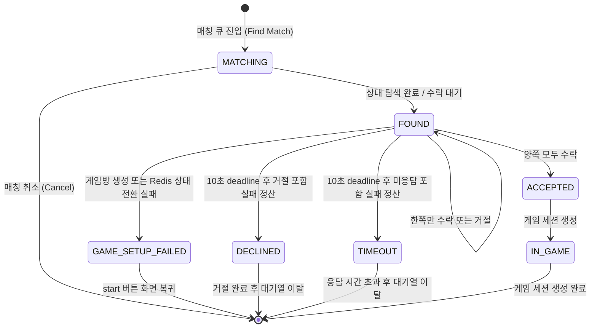

### 2.1 세션 상태와 유저 응답 상태

| 구분 | 상태 | 의미 |
|------|------|------|
| 세션 | `MATCHING` | 유저가 매칭 큐에서 상대를 찾는 중 |
| 세션 | `FOUND` | 상대를 찾았고 양쪽 수락/거절 응답을 기다리는 중 |
| 세션 | `ACCEPTED` | 양쪽 모두 수락하여 게임 세션 생성 대상 |
| 세션 | `GAME_SETUP_FAILED` | 양쪽 수락 후 게임방 생성 또는 Redis 상태 전환 실패로 게임 진입 실패 |
| 세션 | `DECLINED` | 거절이 포함되어 매칭 실패로 정산 완료 |
| 세션 | `TIMEOUT` | 10초 응답 윈도우 만료로 매칭 실패 정산 완료 |
| 유저 응답 | `PENDING` | 아직 수락/거절하지 않음 |
| 유저 응답 | `ACCEPTED` | 제한 시간 안에 수락함 |
| 유저 응답 | `REJECTED` | 제한 시간 안에 거절함 |
| 유저 응답 | `TIMEOUT` | 제한 시간 안에 응답하지 않음 |

### 2.2 시나리오별 상태 전이

#### 둘 다 수락

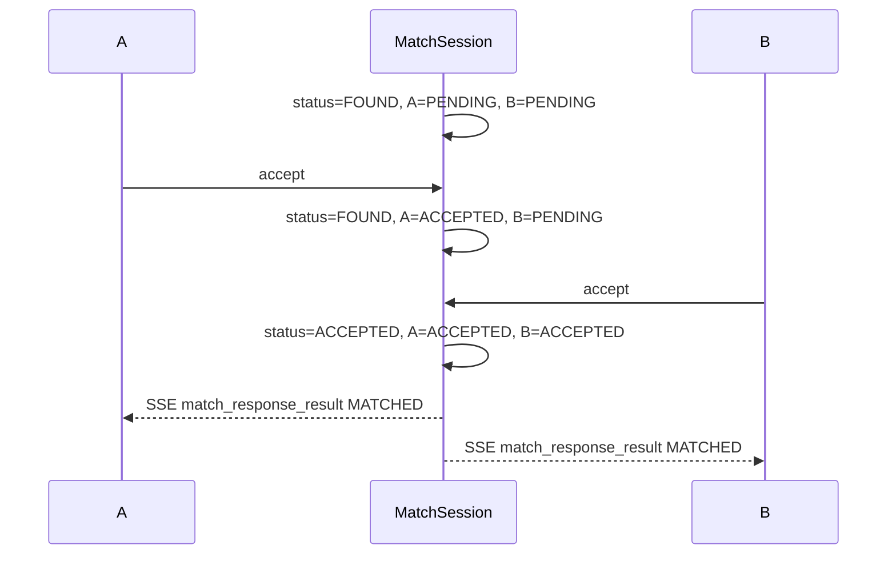

- A/B 모두 게임 대기 화면으로 이동합니다.
- `match_response_result` 이벤트에는 상대 `nickname`, `tier`, `tierScore`가 포함됩니다.
- 게임 세션 생성과 `gameId` payload 채우기는 별도 게임 이슈에서 처리하며, 이번 매칭 응답 이슈에서는 `game=null`을 유지합니다.

#### A 수락, B 거절

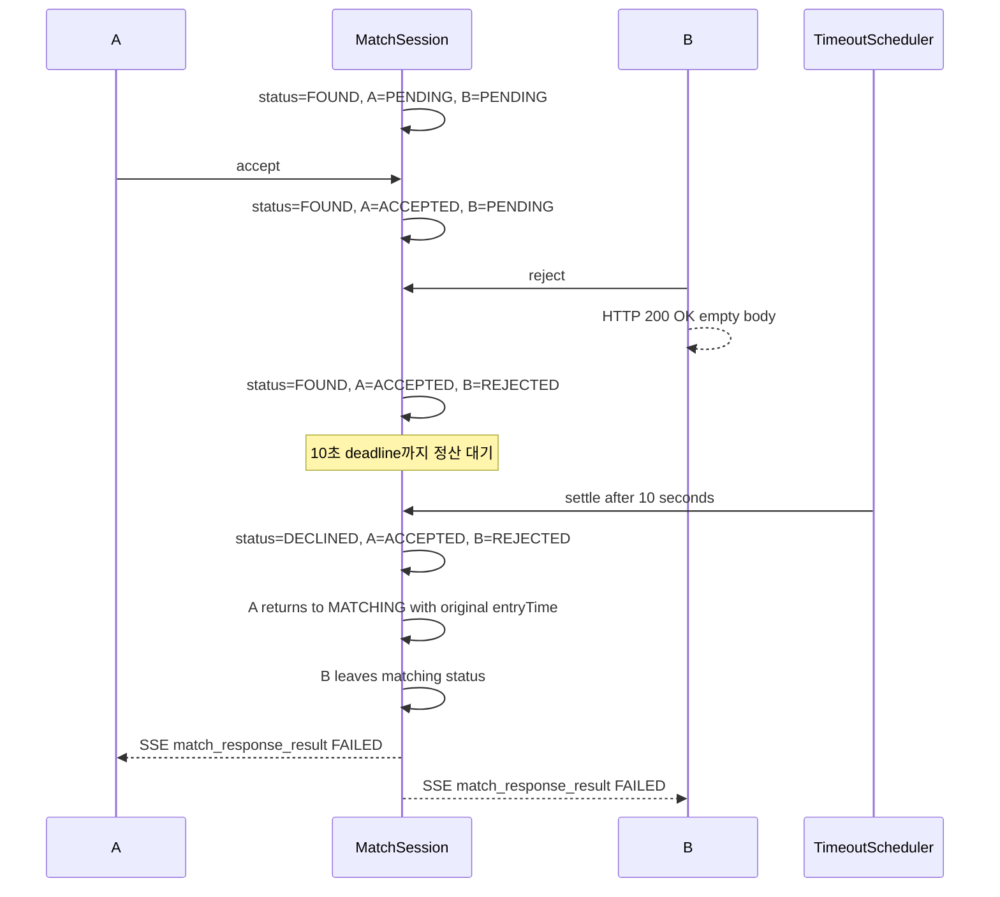

- A는 제한 시간 안에 수락했으므로 기존 `entryTime`으로 큐에 복귀합니다.
- B는 거절 후 정산 대기 상태를 유지하다가 최종 SSE 이벤트를 받은 뒤 start 버튼 화면으로 돌아갑니다.

#### A 거절, B 수락

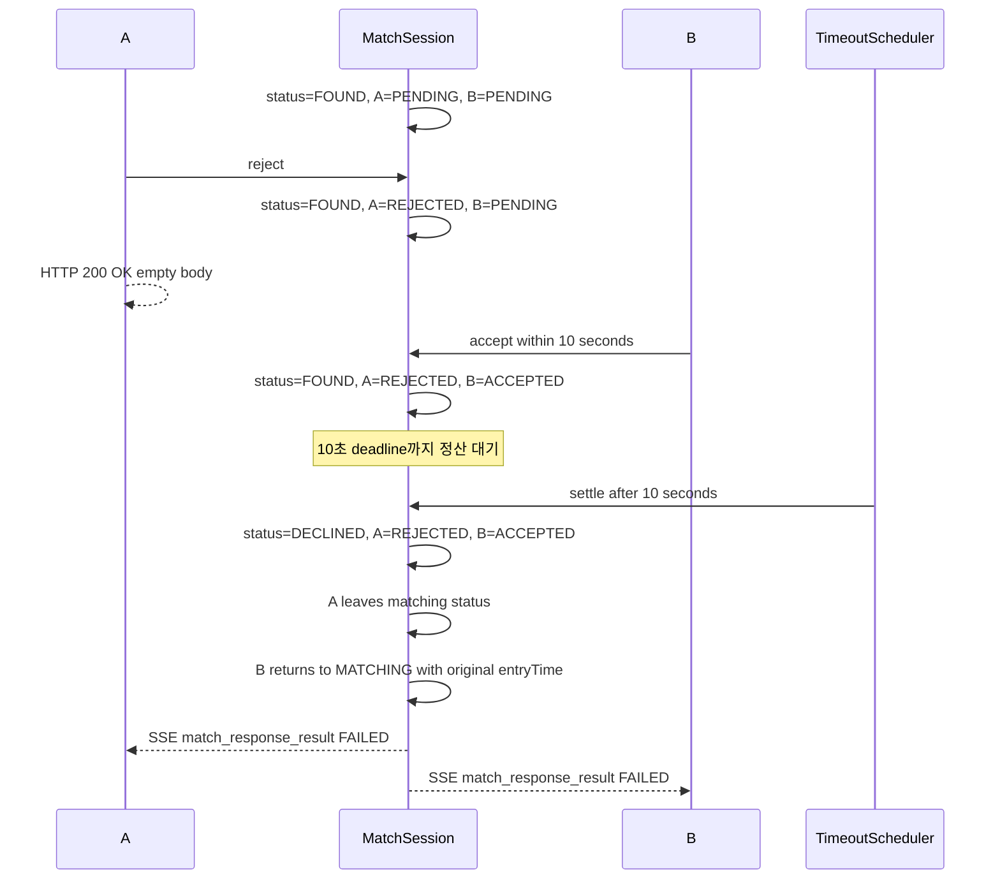

- A가 거절한 즉시 B에게 실패 SSE를 보내지 않습니다.
- A는 거절 후 start 버튼으로 바로 돌아가지 않고 정산 대기 상태를 유지합니다.
- B는 10초 응답권을 유지하고, 제한 시간 안에 수락했을 때만 큐 복귀 대상이 됩니다.

#### A 거절, B 미응답

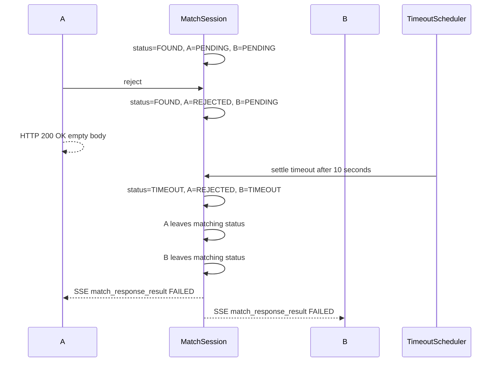

- B는 응답하지 않았으므로 큐에 복귀하지 않습니다.
- A는 거절 후 정산 대기 상태를 유지하고, timeout 정산 시점에 최종 이벤트를 받아 start 버튼 화면으로 돌아갑니다.

#### A 수락, B 미응답

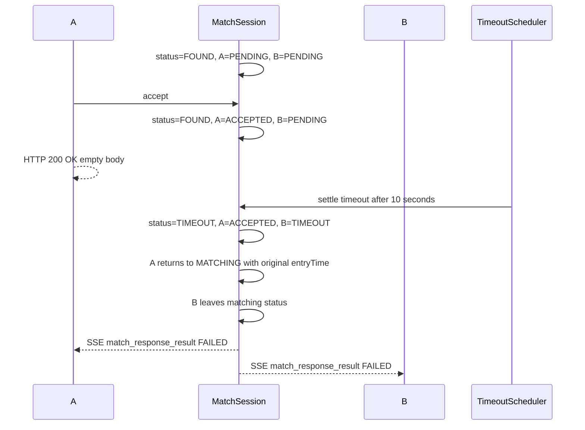

- A는 제한 시간 안에 수락했으므로 기존 `entryTime`으로 큐에 복귀합니다.
- B는 timeout이므로 큐에 복귀하지 않고 start 버튼 화면으로 돌아갑니다.

#### 둘 다 거절

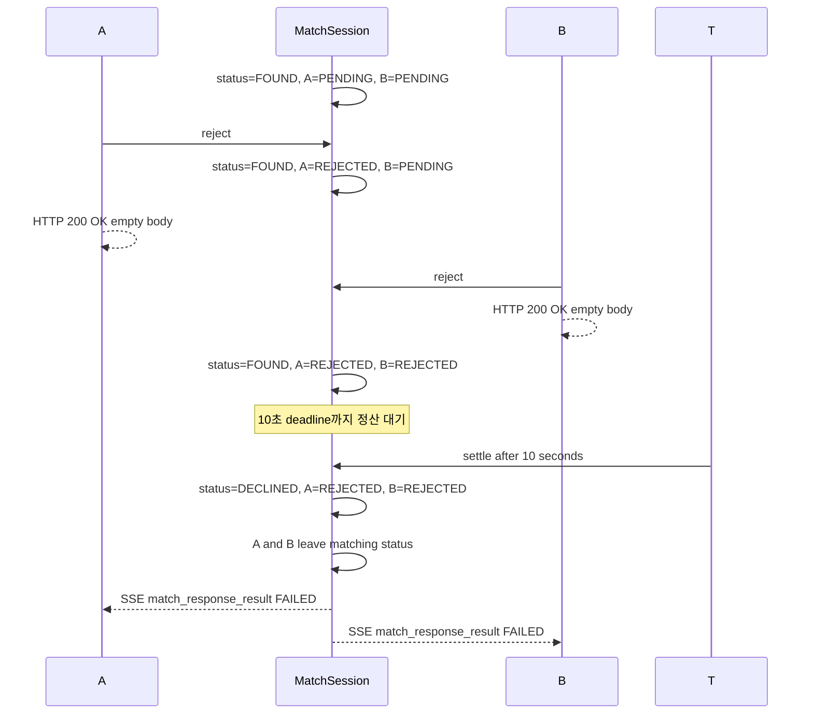

- 둘 다 거절했으므로 큐 복귀 대상은 없습니다.
- 각 유저는 reject HTTP 응답 이후 정산 대기 상태를 유지하고, 최종 SSE 이벤트로 start 버튼 화면에 돌아갑니다.

#### 둘 다 timeout

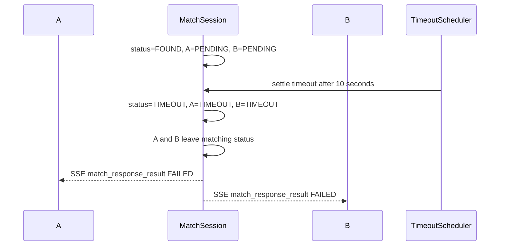

- 둘 다 제한 시간 안에 응답하지 않았으므로 큐 복귀 대상은 없습니다.
- 양쪽 모두 start 버튼 화면으로 돌아갑니다.

## 3. Game (게임 세션 상태)
실제 게임이 진행되는 과정의 상태 흐름입니다.

사용자-facing 입력명은 LIGHTNING이지만, 현재 WebSocket message type과 일부 reason/schema 이름은 레거시 `SMITE` 식별자를 유지합니다.

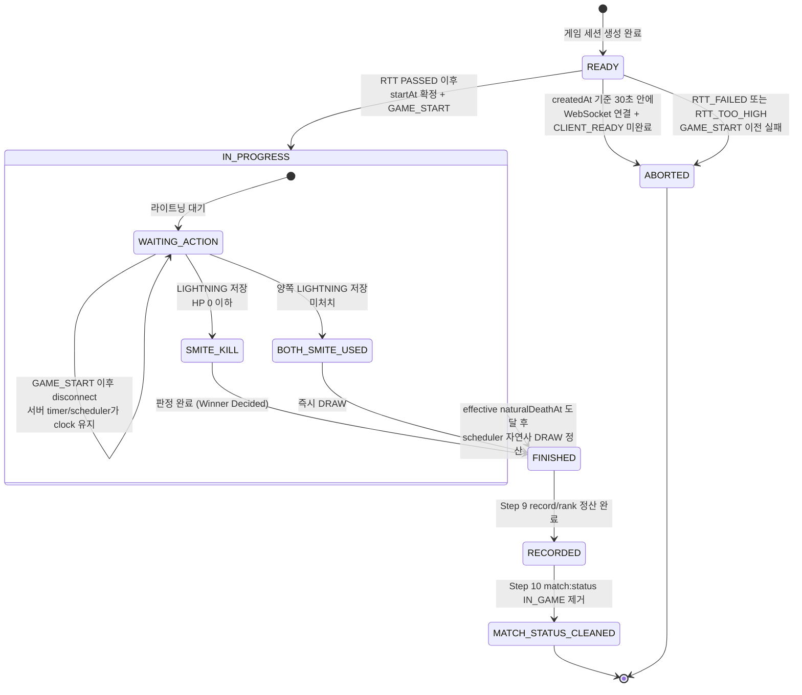

- `GAME_START` 이전 timeout은 **gameRoom `createdAt` 기준 30초**를 기준으로 합니다.
- 30초 안에 두 참가자가 모두 WebSocket에 연결하고 `CLIENT_READY`를 보내지 못하면 `ABORTED` 처리하고 record/LP를 반영하지 않습니다.
- RTT 측정은 양쪽 `CLIENT_READY` 이후 `GAME_START` 이전 단계입니다.
- RTT 측정 실패, median RTT 2000ms 초과, RTT 측정 중 WebSocket close/error는 모두 `GAME_START` 이전 실패로 보고 `ABORTED` 처리하며 record/LP를 반영하지 않습니다.
- RTT 실패 reason은 단순하게 `RTT_FAILED`, `RTT_TOO_HIGH`만 사용합니다.
- `GAME_START`는 양쪽 RTT `PASSED`가 확인된 경우에만 진행합니다. median RTT는 시작 전 품질 검사에만 사용하고 LIGHTNING 판정에는 사용하지 않습니다.
- 서버는 `startAt = serverNow + 4000ms`로 시작 시각을 확정하고, 클라이언트는 남은 시간이 3000ms 이하일 때 `3, 2, 1` countdown을 렌더링합니다.
- `COUNTDOWN`과 `GAME_START`는 countdown 종료 후가 아니라 `startAt` 전에 미리 전송하며, 반드시 같은 `startAt`을 사용합니다.
- `GAME_START` 이후 disconnect는 gameRoom을 `ABORTED`로 만들지 않습니다.
- disconnect 유저는 이후 추가 입력을 할 수 없지만, 이미 서버가 수신한 액션은 유지합니다.
- WebSocket 연결이 모두 끊겨도 gameRoom 종료 작업은 서버 timer/scheduler 기준으로 완료합니다.
- 종료 정산 deadline은 최초 `naturalDeathAt = startAt + scenario.durationMs`로 계산합니다.
- 한 명만 LIGHTNING을 사용했고 처치하지 못한 경우 원본 scenario HP에서 누적 LIGHTNING 데미지를 뺀 effective HP 기준으로 더 빠른 `naturalDeathAt`을 계산해 `game:end:pending` score를 앞당길 수 있습니다.
- deadline 등록에 실패하면 서버가 종료 정산을 보장할 수 없으므로 gameRoom/participants를 `ABORTED` 처리하고 상태 저장소 cleanup을 수행하며 record/LP를 반영하지 않습니다.
- `COUNTDOWN`/`GAME_START` 전송에 실패하면 등록된 deadline을 제거하고 gameRoom/participants를 `ABORTED` 처리하며 record/LP를 반영하지 않습니다.
- `IN_PROGRESS` 중 클라이언트는 gameRoom WebSocket으로 LIGHTNING 의도를 보낼 수 있습니다. 현재 wire type은 레거시 `SMITE`이며, 서버는 클라이언트 timestamp 없이 서버 수신 시각만 저장합니다.
- LIGHTNING 판정 시각은 `serverReceiveTimeMs - startAt`으로 계산하며, median RTT 또는 `RTT_PONG` 측정값으로 보정하지 않습니다.
- `smiteTimeMs < 100` 또는 scenario 범위 밖 LIGHTNING은 action으로 저장하지 않습니다.
- 서버는 저장된 HP scenario와 기존 `game_actions`를 기준으로 해당 시점 HP를 계산하고, 이전 LIGHTNING이 킬 실패였더라도 `1200` 데미지를 차감합니다.
- 유저당 gameRoom당 LIGHTNING은 한 번만 저장하며, 중복 LIGHTNING은 새 action을 만들지 않습니다.
- 결과가 확정되지 않은 LIGHTNING은 중간 응답을 전송하지 않습니다.
- LIGHTNING 적용 후 HP가 `0` 이하이면 같은 처리 흐름에서 gameRoom을 `FINISHED`로 확정하고 `GAME_RESULT`를 broadcast합니다.
- 양쪽 유저가 모두 LIGHTNING을 사용했는데 처치하지 못한 경우 같은 처리 흐름에서 gameRoom을 `DRAW`로 확정하고 `GAME_RESULT`를 broadcast합니다.
- 한 명만 LIGHTNING을 사용했고 처치하지 못한 경우 gameRoom은 `IN_PROGRESS`를 유지하며, 이후 상대 LIGHTNING 또는 자연사/제한 시간 종료 정산을 기다립니다.
- 이미 `FINISHED`된 gameRoom에 늦게 도착한 LIGHTNING은 새 action을 저장하지 않고 현재 session에 확정된 `GAME_RESULT`만 재응답합니다.
- scheduler는 `naturalDeathAt`에 도달한 gameRoom을 정산 대상으로 삼고, 이미 `IN_PROGRESS`가 아니면 no-op 처리합니다.
- scheduler는 due gameRoom을 row lock으로 다시 조회하고, 저장된 action 목록과 원본 scenario를 합성해 effective HP를 재계산합니다.
- due로 조회됐더라도 effective HP가 아직 `0`보다 크면 종료하지 않고 더 늦은 effective naturalDeathAt으로 `game:end:pending` score를 갱신합니다.
- 실패 LIGHTNING 직후의 deadline 앞당김과 scheduler due 재조정은 Redis Lua script를 분리합니다. 앞당김은 member가 없으면 등록할 수 있고 기존 deadline보다 빠른 경우만 반영하며, due 재조정은 이미 due인 기존 member만 뒤로 이동합니다.
- effective HP가 `0` 이하이고 gameRoom이 아직 `IN_PROGRESS`이면 자연사 `DRAW`로 `FINISHED` 전환하고 participants를 `FINISHED`로 전환합니다.
- 자연사 `DRAW`로 새로 종료된 경우 연결된 local WebSocket session에만 `GAME_RESULT(reason=NATURAL_DEATH_DRAW)`를 broadcast합니다. 연결이 없거나 전송에 실패해도 DB 결과는 유지하며 pending cleanup은 계속 시도합니다.
- 이미 `FINISHED` 또는 `ABORTED`인 gameRoom은 기존 결과/상태를 유지하고 no-op 처리합니다.
- 정산 완료 또는 no-op 이후에는 `game:end:pending` member cleanup을 best-effort로 수행합니다.
- 서버는 HP scenario와 수신 action 기준으로 승/패/무승부를 판정하고, gameRoom 결과를 DB의 source of truth로 둡니다.
- `game_records` 생성, 누적 전적, LP 반영, 배치/승급전 처리는 gameRoom 종료 확정 transaction과 분리된 Step 9 record/rank 정산 범위입니다.
- `RECORDED`는 `game_rooms.status` 값이 아니라 `FINISHED` gameRoom에 대해 참가자 2명분 `game_records`가 생성되고 rank 반영이 완료된 논리적 후처리 상태입니다.
- Step 9 record/rank 정산은 새로 `FINISHED` 된 gameRoom에 즉시 호출되며, 실패 시 FINISHED 상태를 되돌리지 않고 복구 scheduler가 `FINISHED + record count != 2` 대상을 재조회합니다. 자동 재정산은 `record count == 0`에 한정하고 `1`은 불완전 정산으로 로깅/알림 대상입니다.
- `MATCH_STATUS_CLEANED`는 `game_rooms.status` 값이 아니라 record/rank 정산 완료 후 참가자 Redis `match:status:{userId}=IN_GAME` 점유 상태가 해제된 논리적 후처리 상태입니다.
- 정상 종료 cleanup은 `FINISHED + game_records 2행` 기준에서만 수행하며, `record count == 0`은 record/rank 복구 우선, `record count == 1`은 불완전 정산으로 cleanup하지 않습니다.
- 정상 종료 cleanup은 `IN_GAME`만 제거합니다. 이미 새 매칭 플로우에 들어간 `MATCHING`, `FOUND`, `ACCEPTED`는 이전 gameRoom cleanup이 제거하지 않습니다.
- 정상 종료 cleanup은 유저를 `matching:queue:*`에 자동 복귀시키지 않으며, 재매칭은 사용자의 명시적 `joinQueue` 요청으로 시작합니다.
- 정상 종료 cleanup 실패는 gameRoom `FINISHED`, `GAME_RESULT`, record/rank 정산 결과를 되돌리지 않습니다. 별도 cleanup scheduler는 두지 않고 기존 record/rank recovery 흐름에서 best-effort로 재시도하며, Redis TTL을 최후 안전장치로 둡니다.
- `GAME_RESULT`는 종료 즉시 알림으로 유지하고 LP/rank/series delta는 포함하지 않습니다. 최종 결과 화면용 랭크 정보는 `GET /api/v1/games/{gameId}/summary`에서 조회합니다.
- 클라이언트는 `GAME_RESULT` 수신 후 summary API를 호출합니다. `FINISHED + game_records 0/1행`이면 `PENDING + retryAfterMillis`를 받고, `FINISHED + game_records 2행`이면 `DONE` summary를 받습니다.
- summary `DONE`은 `gameResult`, `winnerUserId`, `finishedAt`, `me`, `opponent`를 포함합니다. `me`와 `opponent`는 같은 schema로 `result`, `lpBefore`, `lpAfter`, `lpChange`, `rankBefore`, `rankAfter`, `seriesType`, `rankSeriesId`, `nickname`을 제공합니다.
- `DRAW` 결과는 `gameResult=DRAW`와 양쪽 player `result=DRAW`로 표현하고, 승자가 없으므로 `winnerUserId`만 `null`로 둡니다.

## 4. Game WebSocket Session (게임 대기 WebSocket 연결 상태)

게임 대기 WebSocket 연결 상태는 DB에 저장하지 않고 API 인스턴스 local memory registry에서 관리합니다.
이 상태는 `game_rooms.status` 또는 `game_participants.status`와 구분되는 일시적 연결 상태입니다.

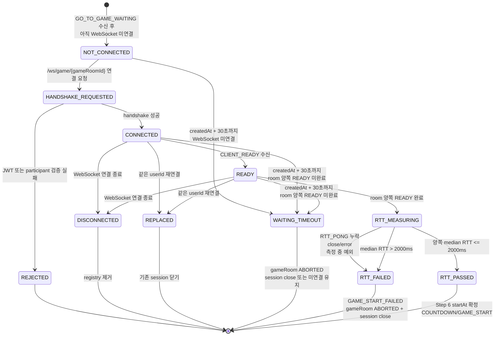

| 상태 | 저장 위치 | 의미 |
|------|-----------|------|
| `NOT_CONNECTED` | 저장 안 함 | `GO_TO_GAME_WAITING` 이후 아직 WebSocket handshake를 시작하지 않았거나 연결이 없는 논리 상태. DB gameRoom/participant는 timeout 전까지 `READY` 유지 |
| `HANDSHAKE_REQUESTED` | 저장 안 함 | WebSocket upgrade 요청을 수신하고 handshake 검증 중 |
| `REJECTED` | 저장 안 함 | JWT 검증 실패, gameRoom 미존재, READY 아님, participant 아님으로 연결 거부 |
| `CONNECTED` | API local memory registry | handshake 성공 후 gameRoom/user 단위 WebSocket session 등록 완료 |
| `READY` | API local memory registry | 클라이언트가 `CLIENT_READY`를 보내 대기 준비 완료 |
| `RTT_MEASURING` | Redis `game:rtt:{gameRoomId}` + API local memory | 양쪽 `CLIENT_READY` 완료 후 RTT 측정 중. 각 `RTT_PING`은 2500ms 안에 응답해야 하고 5회 측정 구조상 전체 측정은 최대 15초 안에 끝나야 함 |
| `RTT_PASSED` | Redis `game:rtt:{gameRoomId}` | 양쪽 median RTT가 2000ms 이하. RTT 측정값은 GAME_START 전 품질 검사에만 사용하며 LIGHTNING 판정 보정에는 사용하지 않음 |
| `GAME_STARTING` | WebSocket message | 서버가 `startAt = serverNow + 4000ms`를 확정하고 `COUNTDOWN`/`GAME_START`를 전송한 상태. 클라이언트는 남은 시간이 3000ms 이하일 때 countdown을 렌더링하고 `startAt`까지 대기 |
| `RTT_FAILED` | DB `game_rooms`, `game_participants`; 연결된 session은 close | `RTT_PONG` 응답 누락, WebSocket close/error, 측정 중 예외, median RTT 2000ms 초과로 gameRoom/participants가 `ABORTED` 된 상태 |
| `DISCONNECTED` | registry에서 제거 | WebSocket 연결 종료로 session 제거 |
| `REPLACED` | registry에서 기존 session 제거 | 같은 userId가 같은 gameRoom에 재연결하여 기존 session을 새 session으로 교체 |
| `WAITING_TIMEOUT` | DB `game_rooms`, `game_participants`; 연결된 session은 close | gameRoom `createdAt` 기준 30초 안에 room 양쪽 `READY`가 완료되지 않아 gameRoom/participants가 `ABORTED` 된 상태. 미연결 유저에게는 WebSocket 이벤트 전송 불가 |

- 멀티 인스턴스 환경에서는 같은 `gameRoomId`의 두 참가자가 같은 API 인스턴스로 라우팅되어야 합니다.
- `NOT_CONNECTED`, `HANDSHAKE_REQUESTED`, `REJECTED`는 WebSocket session이 없거나 아직 확정되지 않은 상태이므로 API local registry에 저장하지 않습니다.
- WebSocket session status는 일시적 연결 상태이므로 전적, LP, game record에 직접 반영하지 않습니다.
- GAME_START 이전 WebSocket 미접속과 READY timeout은 gameRoom `createdAt` 기준 30초 timeout 정책에서 수행합니다.
- RTT 측정 중 WebSocket 연결 종료는 별도 `PEER_LEFT` 상태를 만들지 않고 `RTT_FAILED`로 처리합니다.
- WebSocket 미연결 유저는 `WAITING_TIMEOUT` 이벤트를 받을 수 없습니다. 늦은 handshake는 gameRoom `ABORTED` 상태 검증에서 거절됩니다.
- GAME_START 진입 시 `COUNTDOWN`과 `GAME_START`는 같은 `startAt`을 사용하며, 클라이언트는 `GAME_START`를 받아도 즉시 시작하지 않고 `startAt`까지 대기합니다.
- GAME_START 이후 disconnect는 session registry에서 제거되지만, gameRoom은 정상 판정 흐름을 유지합니다.

## 5. Password Reset (비밀번호 재설정)
Redis에서 관리되는 비밀번호 재설정 토큰의 수명 주기입니다.

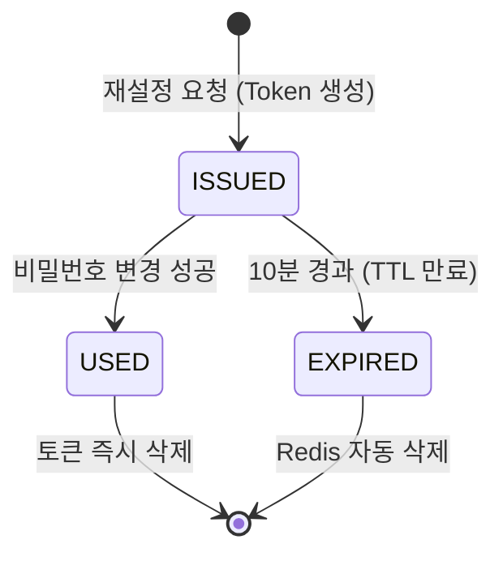
