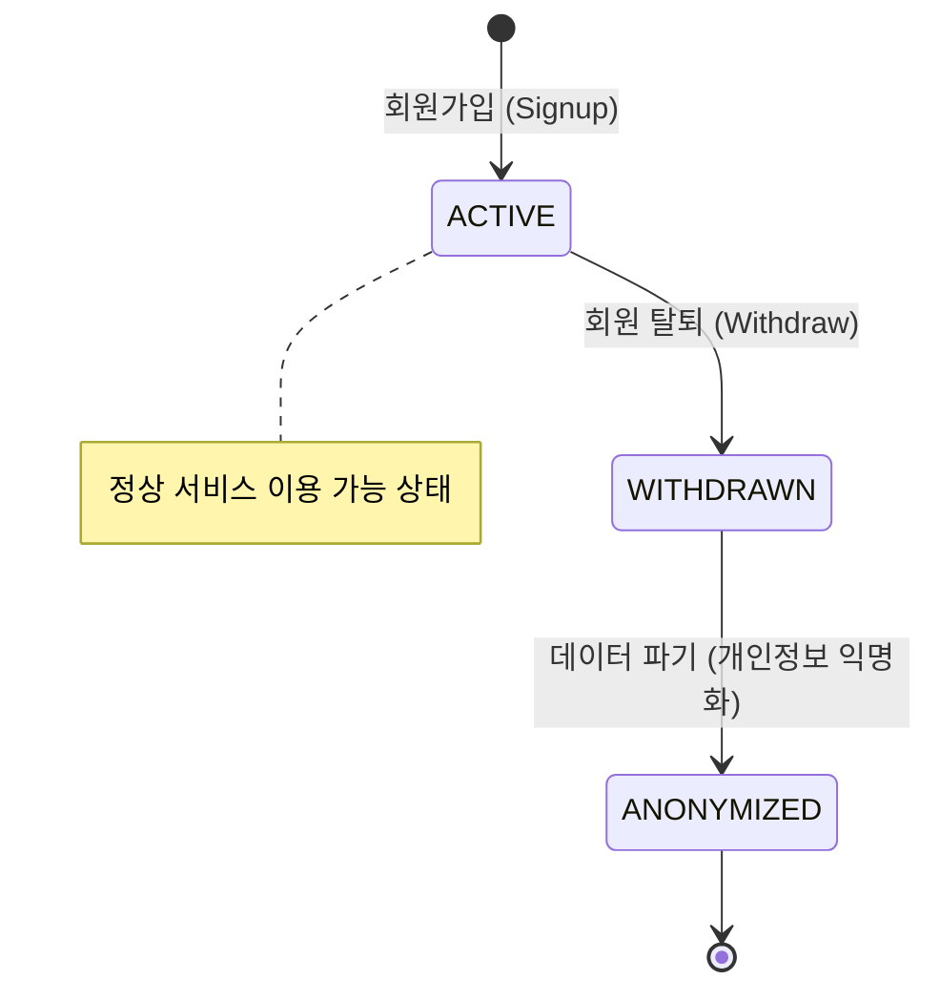
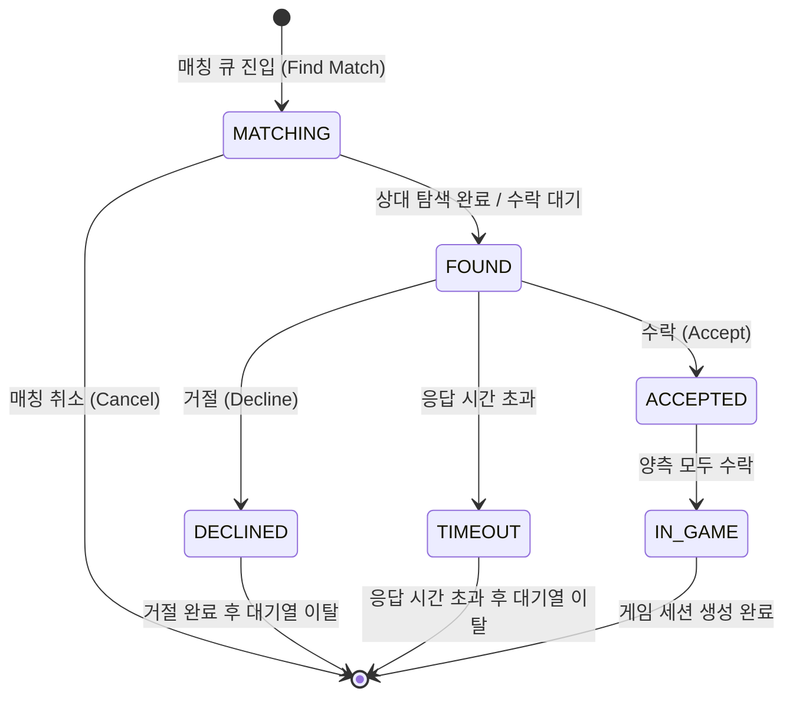
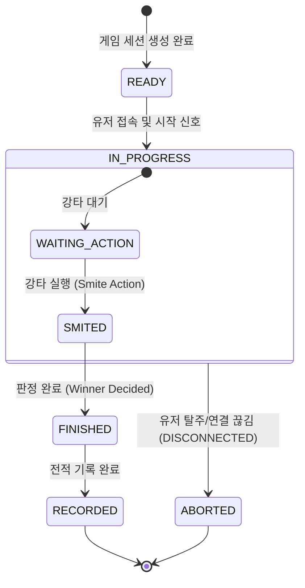
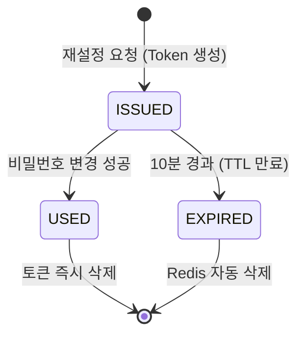

# League of Smite - Domain Status

이 문서는 League of Smite 프로젝트의 핵심 도메인별 상태 전환 흐름을 정의합니다.

## 1. User (유저 상태)
유저의 서비스 이용 상태 흐름입니다.

## 2. Match (매칭 상태)
매칭 큐에 진입한 순간부터 게임이 성사되기까지의 흐름입니다.

## 3. Game (게임 세션 상태)
실제 게임이 진행되는 과정의 상태 흐름입니다.

## 4. Password Reset (비밀번호 재설정)
Redis에서 관리되는 비밀번호 재설정 토큰의 수명 주기입니다.

