# League of Smite - Flow Status

이 문서는 매칭 시작부터 게임 대기 WebSocket 연결까지의 status 흐름을 시나리오별로 한 그림에서 확인하기 위한 문서입니다.

범위:

- 포함: 매칭 큐 진입, match found, accept/reject/timeout, gameRoom 생성, Redis 상태 전환, `GO_TO_GAME_WAITING`, WebSocket handshake, WebSocket `CONNECTED`
- 제외: `CLIENT_READY`, RTT, countdown, `GAME_START`, SMITE, game record/LP 반영

## 1. Overall Flow

```mermaid
flowchart LR
    START["User A/B<br/>Start Matching"]

    subgraph QUEUE["Matching Queue Phase"]
        US_MATCHING["UserStatusStore<br/>A = MATCHING<br/>B = MATCHING"]
        MQ_WAIT["MatchQueueStore<br/>A ticket: tierScore + entryTime<br/>B ticket: tierScore + entryTime"]
        FOUND["MatchPairingService<br/>tierScore/window matched"]
        MQ_REMOVED["MatchQueueStore<br/>A/B ticket removed"]
        US_FOUND["UserStatusStore<br/>A = FOUND<br/>B = FOUND"]
        MS_FOUND["MatchSessionStore<br/>session = FOUND<br/>A response = PENDING<br/>B response = PENDING"]
        MT_PENDING["MatchTimeoutStore<br/>matchId + deadline"]
        SSE_FOUND["SSE match_found<br/>sent to A/B"]
    end

    subgraph RESPONSE["Match Response Scenarios"]
        BOTH_ACCEPT["Scenario 1<br/>A ACCEPTED<br/>B ACCEPTED"]
        A_ACCEPT_B_REJECT["Scenario 2<br/>ACCEPTED + REJECTED"]
        A_ACCEPT_B_TIMEOUT["Scenario 3<br/>ACCEPTED + TIMEOUT"]
        BOTH_REJECT["Scenario 4<br/>REJECTED + REJECTED"]
        REJECT_TIMEOUT["Scenario 5<br/>REJECTED + TIMEOUT"]
        BOTH_TIMEOUT["Scenario 6<br/>TIMEOUT + TIMEOUT"]
    end

    subgraph FAIL["Failed Match Settlement"]
        MS_DECLINED["MatchSessionStore<br/>session = DECLINED<br/>or TIMEOUT"]
        RETURN_ACCEPTED["Accepted user only<br/>MatchQueueStore re-add<br/>UserStatusStore = MATCHING"]
        REMOVE_FAILED["Rejected/Timeout user<br/>UserStatusStore removed"]
        CLEANUP_FAIL["MatchTimeoutStore cleanup"]
        SSE_FAIL["SSE match_response_result<br/>outcome = FAILED<br/>action = GO_TO_MATCH_START"]
    end

    subgraph SETUP["Both Accepted Game Setup"]
        GAME_SETUP["GameSetupPort.setup(A, B)"]
        GAME_ROOM_READY["DB game_rooms<br/>status = READY"]
        GAME_PARTICIPANTS_READY["DB game_participants<br/>A = READY<br/>B = READY"]
        SCENARIO_SAVED["DB scenario_data<br/>8 ~ 17 sec HP scenario"]
        REDIS_ACCEPTED["MatchSessionStore<br/>session = ACCEPTED<br/>A response = ACCEPTED<br/>B response = ACCEPTED"]
        US_IN_GAME["UserStatusStore<br/>A = IN_GAME<br/>B = IN_GAME"]
        CLEANUP_SUCCESS["MatchTimeoutStore cleanup"]
        SSE_GO_WAITING["SSE match_response_result<br/>outcome = MATCHED<br/>action = GO_TO_GAME_WAITING<br/>gameRoomId/videoUrl/webSocketUrl"]
    end

    subgraph SETUP_FAIL["Game Setup Failed Scenarios"]
        SETUP_FAILED["Game room setup failed<br/>or Redis state transition failed"]
        GAME_ABORTED["If gameRoom already created<br/>DB game_rooms = ABORTED<br/>DB game_participants = ABORTED"]
        MS_SETUP_FAILED["MatchSessionStore<br/>session = GAME_SETUP_FAILED"]
        US_REMOVED_SETUP_FAIL["UserStatusStore<br/>A/B removed"]
        CLEANUP_SETUP_FAIL["MatchTimeoutStore cleanup"]
        SSE_SETUP_FAIL["SSE match_response_result<br/>outcome = FAILED<br/>reason = GAME_SETUP_FAILED<br/>action = GO_TO_MATCH_START"]
    end

    subgraph WS["Game Waiting WebSocket Connection"]
        CLIENT_CLOSE_SSE["Client<br/>EventSource.close()"]
        WS_REQUEST["Client WebSocket handshake<br/>GET /ws/game/{gameRoomId}?token=accessToken"]
        WS_AUTH["HandshakeInterceptor<br/>JWT valid?<br/>gameRoom READY?<br/>participant?"]
        WS_REJECT["Handshake rejected<br/>WebSocket not connected"]
        WS_CONNECTED["WebSocketSession<br/>attributes: gameRoomId, userId"]
        WS_REGISTRY["GameRoomWebSocketSessionRegistry<br/>A/B = CONNECTED<br/>local memory"]
    end

    START --> US_MATCHING
    US_MATCHING --> MQ_WAIT
    MQ_WAIT --> FOUND
    FOUND --> MQ_REMOVED
    MQ_REMOVED --> US_FOUND
    US_FOUND --> MS_FOUND
    MS_FOUND --> MT_PENDING
    MT_PENDING --> SSE_FOUND

    SSE_FOUND --> BOTH_ACCEPT
    SSE_FOUND --> A_ACCEPT_B_REJECT
    SSE_FOUND --> A_ACCEPT_B_TIMEOUT
    SSE_FOUND --> BOTH_REJECT
    SSE_FOUND --> REJECT_TIMEOUT
    SSE_FOUND --> BOTH_TIMEOUT

    A_ACCEPT_B_REJECT --> MS_DECLINED
    A_ACCEPT_B_TIMEOUT --> MS_DECLINED
    BOTH_REJECT --> MS_DECLINED
    REJECT_TIMEOUT --> MS_DECLINED
    BOTH_TIMEOUT --> MS_DECLINED
    MS_DECLINED --> RETURN_ACCEPTED
    MS_DECLINED --> REMOVE_FAILED
    RETURN_ACCEPTED --> CLEANUP_FAIL
    REMOVE_FAILED --> CLEANUP_FAIL
    CLEANUP_FAIL --> SSE_FAIL

    BOTH_ACCEPT --> GAME_SETUP
    GAME_SETUP --> GAME_ROOM_READY
    GAME_ROOM_READY --> GAME_PARTICIPANTS_READY
    GAME_PARTICIPANTS_READY --> SCENARIO_SAVED
    SCENARIO_SAVED --> REDIS_ACCEPTED
    REDIS_ACCEPTED --> US_IN_GAME
    US_IN_GAME --> CLEANUP_SUCCESS
    CLEANUP_SUCCESS --> SSE_GO_WAITING

    GAME_SETUP -. failure .-> SETUP_FAILED
    REDIS_ACCEPTED -. Redis failure .-> SETUP_FAILED
    US_IN_GAME -. Redis failure .-> SETUP_FAILED
    SETUP_FAILED --> GAME_ABORTED
    SETUP_FAILED --> MS_SETUP_FAILED
    GAME_ABORTED --> US_REMOVED_SETUP_FAIL
    MS_SETUP_FAILED --> US_REMOVED_SETUP_FAIL
    US_REMOVED_SETUP_FAIL --> CLEANUP_SETUP_FAIL
    CLEANUP_SETUP_FAIL --> SSE_SETUP_FAIL

    SSE_GO_WAITING --> CLIENT_CLOSE_SSE
    CLIENT_CLOSE_SSE --> WS_REQUEST
    WS_REQUEST --> WS_AUTH
    WS_AUTH -->|fail| WS_REJECT
    WS_AUTH -->|success| WS_CONNECTED
    WS_CONNECTED --> WS_REGISTRY
```

## 2. Scenario Summary

| 시나리오 | MatchSessionStore | UserStatusStore | MatchQueueStore | Game DB | 최종 클라이언트 이동 |
|---|---|---|---|---|---|
| `ACCEPTED + ACCEPTED` + game setup 성공 | `ACCEPTED` | A/B `IN_GAME` | A/B 제거 유지 | `game_rooms=READY`, participants `READY` | `GO_TO_GAME_WAITING` 후 WebSocket 연결 |
| `ACCEPTED + ACCEPTED` + game setup 실패 | `GAME_SETUP_FAILED` | A/B 제거 | A/B 복귀 없음 | 생성 전이면 없음 | `GO_TO_MATCH_START` |
| `ACCEPTED + ACCEPTED` + Redis 상태 전환 실패 | `GAME_SETUP_FAILED` best-effort | A/B 제거 best-effort | A/B 복귀 없음 | 생성된 gameRoom/participants `ABORTED` | `GO_TO_MATCH_START` |
| `ACCEPTED + REJECTED` | `DECLINED` | accepted user `MATCHING`, rejected user 제거 | accepted user 기존 entryTime으로 복귀 | 없음 | `GO_TO_MATCH_START` |
| `ACCEPTED + TIMEOUT` | `TIMEOUT` | accepted user `MATCHING`, timeout user 제거 | accepted user 기존 entryTime으로 복귀 | 없음 | `GO_TO_MATCH_START` |
| `REJECTED + REJECTED` | `DECLINED` | A/B 제거 | 복귀 없음 | 없음 | `GO_TO_MATCH_START` |
| `REJECTED + TIMEOUT` | `TIMEOUT` | A/B 제거 | 복귀 없음 | 없음 | `GO_TO_MATCH_START` |
| `TIMEOUT + TIMEOUT` | `TIMEOUT` | A/B 제거 | 복귀 없음 | 없음 | `GO_TO_MATCH_START` |

## 3. WebSocket Connection Status

| 단계 | 상태 | 저장 위치 |
|---|---|---|
| handshake 요청 | `HANDSHAKE_REQUESTED` | 저장 안 함 |
| handshake 실패 | `REJECTED` | 저장 안 함 |
| handshake 성공 | `CONNECTED` | API local memory `GameRoomWebSocketSessionRegistry` |

주의:

- WebSocket `CONNECTED`는 DB `game_participants.status=READY`와 다릅니다.
- `CLIENT_READY` 이후 상태는 이 문서 범위 밖이며, 다음 WebSocket 대기/RTT 단계에서 다룹니다.
- 멀티 인스턴스에서는 같은 `gameRoomId`가 같은 API 인스턴스로 라우팅되어야 WebSocket registry가 정상 동작합니다.

## 변경 이력

| 날짜 | 변경 내용 |
|------|----------|
| 2026-05-15 | 매칭 시작부터 WebSocket 연결까지 시나리오별 status 흐름을 하나의 Mermaid 다이어그램으로 정리 |
