# League of Smite - Flow Status

이 문서는 매칭 시작부터 게임 대기 WebSocket 연결까지의 status 흐름을 시나리오별로 한 그림에서 확인하기 위한 문서입니다.

범위:

- 포함: 매칭 큐 진입, match found, accept/reject/timeout, gameRoom 생성, Redis 상태 전환, `GO_TO_GAME_WAITING`, WebSocket handshake, `CLIENT_READY`, game waiting timeout, `GAME_WAITING_TIMEOUT`, RTT 측정 정책, `COUNTDOWN`, `GAME_START` 진입 정책
- 제외: SMITE, game record/LP 반영
- 게임 대기 WebSocket timeout 기준: gameRoom `createdAt`부터 **30초 안에 두 참가자의 WebSocket 연결과 `CLIENT_READY`가 모두 완료되어야 함**

## 1. Overall Flow

```mermaid
flowchart LR
    START["User A/B<br/>Start Matching"]

    subgraph QUEUE["Matching Queue Phase"]
        US_MATCHING["UserStatusStore<br/>A = MATCHING<br/>B = MATCHING"]
        MQ_WAIT["MatchQueueStore<br/>A ticket: tierScore + entryTime<br/>B ticket: tierScore + entryTime"]
        FOUND["MatchPairingService<br/>tierScore/window matched"]
        MQ_REMOVED["MatchQueueStore<br/>A/B ticket removed"]
        US_FOUND["UserStatusStore<br/>A = FOUND<br/>B = FOUND"]
        MS_FOUND["MatchSessionStore<br/>session = FOUND<br/>A response = PENDING<br/>B response = PENDING"]
        MT_PENDING["MatchTimeoutStore<br/>matchId + deadline"]
        SSE_FOUND["SSE match_found<br/>sent to A/B"]
    end

    subgraph RESPONSE["Match Response Scenarios"]
        BOTH_ACCEPT["Scenario 1<br/>A ACCEPTED<br/>B ACCEPTED"]
        A_ACCEPT_B_REJECT["Scenario 2<br/>ACCEPTED + REJECTED"]
        A_ACCEPT_B_TIMEOUT["Scenario 3<br/>ACCEPTED + TIMEOUT"]
        BOTH_REJECT["Scenario 4<br/>REJECTED + REJECTED"]
        REJECT_TIMEOUT["Scenario 5<br/>REJECTED + TIMEOUT"]
        BOTH_TIMEOUT["Scenario 6<br/>TIMEOUT + TIMEOUT"]
    end

    subgraph FAIL["Failed Match Settlement"]
        MS_DECLINED["MatchSessionStore<br/>session = DECLINED<br/>or TIMEOUT"]
        RETURN_ACCEPTED["Accepted user only<br/>MatchQueueStore re-add<br/>UserStatusStore = MATCHING"]
        REMOVE_FAILED["Rejected/Timeout user<br/>UserStatusStore removed"]
        CLEANUP_FAIL["MatchTimeoutStore cleanup"]
        SSE_FAIL["SSE match_response_result<br/>outcome = FAILED<br/>action = GO_TO_MATCH_START"]
    end

    subgraph SETUP["Both Accepted Game Setup"]
        GAME_SETUP["GameSetupPort.setup(A, B)"]
        GAME_ROOM_READY["DB game_rooms<br/>status = READY"]
        GAME_PARTICIPANTS_READY["DB game_participants<br/>A = READY<br/>B = READY"]
        SCENARIO_SAVED["DB scenario_data<br/>8 ~ 17 sec HP scenario"]
        REDIS_ACCEPTED["MatchSessionStore<br/>session = ACCEPTED<br/>A response = ACCEPTED<br/>B response = ACCEPTED"]
        US_IN_GAME["UserStatusStore<br/>A = IN_GAME<br/>B = IN_GAME"]
        CLEANUP_SUCCESS["MatchTimeoutStore cleanup"]
        SSE_GO_WAITING["SSE match_response_result<br/>outcome = MATCHED<br/>action = GO_TO_GAME_WAITING<br/>gameRoomId/videoUrl/webSocketUrl"]
    end

    subgraph SETUP_FAIL["Game Setup Failed Scenarios"]
        SETUP_FAILED["Game room setup failed<br/>or Redis state transition failed"]
        GAME_ABORTED["If gameRoom already created<br/>DB game_rooms = ABORTED<br/>DB game_participants = ABORTED"]
        MS_SETUP_FAILED["MatchSessionStore<br/>session = GAME_SETUP_FAILED"]
        US_REMOVED_SETUP_FAIL["UserStatusStore<br/>A/B removed"]
        CLEANUP_SETUP_FAIL["MatchTimeoutStore cleanup"]
        SSE_SETUP_FAIL["SSE match_response_result<br/>outcome = FAILED<br/>reason = GAME_SETUP_FAILED<br/>action = GO_TO_MATCH_START"]
    end

    subgraph WS["Game Waiting WebSocket Connection"]
        CLIENT_CLOSE_SSE["Client<br/>EventSource.close()"]
        WS_REQUEST["Client WebSocket handshake<br/>GET /ws/game/{gameRoomId}?token=accessToken"]
        WS_AUTH["HandshakeInterceptor<br/>JWT valid?<br/>gameRoom READY?<br/>participant?"]
        WS_REJECT["Handshake rejected<br/>WebSocket not connected"]
        WS_CONNECTED["WebSocketSession<br/>attributes: gameRoomId, userId"]
        WS_REGISTRY["GameRoomWebSocketSessionRegistry<br/>A/B = CONNECTED<br/>local memory"]
        WAITING_READY["Redis game:waiting:{gameRoomId}<br/>userAReady/userBReady"]
        WAITING_CLEANUP["Redis waiting cleanup<br/>HASH/ZSET 제거"]
        WAITING_TIMEOUT["Timeout Scheduler<br/>createdAt + 30s<br/>Redis ready + DB READY 확인"]
        GAME_WAITING_ABORT["DB game_rooms = ABORTED<br/>DB game_participants = ABORTED<br/>match:status 제거"]
        WS_TIMEOUT_EVENT["Redis Pub/Sub<br/>game_waiting_timeout"]
        WS_TIMEOUT_SEND["Local session 보유 인스턴스만<br/>GAME_WAITING_TIMEOUT 전송 후 close"]
    end

    subgraph RTT["RTT Measurement Before GAME_START"]
        RTT_STATE["Redis game:rtt:{gameRoomId}<br/>A/B status = PENDING"]
        RTT_PING["RTT_PING<br/>5 times per user"]
        RTT_RESULT{"median RTT<br/><= 2000ms?"}
        RTT_PASSED["A/B status = PASSED<br/>median 유지"]
        RTT_FAILED["status = FAILED<br/>RTT_FAILED or RTT_TOO_HIGH"]
        RTT_ABORT["DB game_rooms = ABORTED<br/>DB game_participants = ABORTED<br/>match:status 제거"]
        RTT_FAIL_EVENT["GAME_START_FAILED<br/>connected sockets only<br/>then close"]
        NEXT_GAME_START["Step 6<br/>startAt = serverNow + 4000ms"]
        IN_PROGRESS["DB game_rooms = IN_PROGRESS"]
        GAME_END_DEADLINE["Redis game:end:pending<br/>settlementDueAt = startAt + durationMs + 2000ms"]
        COUNTDOWN["COUNTDOWN<br/>startAt, display=3s"]
        GAME_START["GAME_START<br/>same startAt + scenario"]
    end

    START --> US_MATCHING
    US_MATCHING --> MQ_WAIT
    MQ_WAIT --> FOUND
    FOUND --> MQ_REMOVED
    MQ_REMOVED --> US_FOUND
    US_FOUND --> MS_FOUND
    MS_FOUND --> MT_PENDING
    MT_PENDING --> SSE_FOUND

    SSE_FOUND --> BOTH_ACCEPT
    SSE_FOUND --> A_ACCEPT_B_REJECT
    SSE_FOUND --> A_ACCEPT_B_TIMEOUT
    SSE_FOUND --> BOTH_REJECT
    SSE_FOUND --> REJECT_TIMEOUT
    SSE_FOUND --> BOTH_TIMEOUT

    A_ACCEPT_B_REJECT --> MS_DECLINED
    A_ACCEPT_B_TIMEOUT --> MS_DECLINED
    BOTH_REJECT --> MS_DECLINED
    REJECT_TIMEOUT --> MS_DECLINED
    BOTH_TIMEOUT --> MS_DECLINED
    MS_DECLINED --> RETURN_ACCEPTED
    MS_DECLINED --> REMOVE_FAILED
    RETURN_ACCEPTED --> CLEANUP_FAIL
    REMOVE_FAILED --> CLEANUP_FAIL
    CLEANUP_FAIL --> SSE_FAIL

    BOTH_ACCEPT --> GAME_SETUP
    GAME_SETUP --> GAME_ROOM_READY
    GAME_ROOM_READY --> GAME_PARTICIPANTS_READY
    GAME_PARTICIPANTS_READY --> SCENARIO_SAVED
    SCENARIO_SAVED --> REDIS_ACCEPTED
    REDIS_ACCEPTED --> US_IN_GAME
    US_IN_GAME --> CLEANUP_SUCCESS
    CLEANUP_SUCCESS --> SSE_GO_WAITING

    GAME_SETUP -. failure .-> SETUP_FAILED
    REDIS_ACCEPTED -. Redis failure .-> SETUP_FAILED
    US_IN_GAME -. Redis failure .-> SETUP_FAILED
    SETUP_FAILED --> GAME_ABORTED
    SETUP_FAILED --> MS_SETUP_FAILED
    GAME_ABORTED --> US_REMOVED_SETUP_FAIL
    MS_SETUP_FAILED --> US_REMOVED_SETUP_FAIL
    US_REMOVED_SETUP_FAIL --> CLEANUP_SETUP_FAIL
    CLEANUP_SETUP_FAIL --> SSE_SETUP_FAIL

    SSE_GO_WAITING --> CLIENT_CLOSE_SSE
    CLIENT_CLOSE_SSE --> WS_REQUEST
    WS_REQUEST --> WS_AUTH
    WS_AUTH -->|fail| WS_REJECT
    WS_AUTH -->|success| WS_CONNECTED
    WS_CONNECTED --> WS_REGISTRY
    WS_REGISTRY --> WAITING_READY
    WAITING_READY -->|양쪽 READY 완료| WAITING_CLEANUP
    WAITING_READY -->|30초 안에 미완료| WAITING_TIMEOUT
    WAITING_TIMEOUT --> GAME_WAITING_ABORT
    GAME_WAITING_ABORT --> WS_TIMEOUT_EVENT
    WS_TIMEOUT_EVENT --> WS_TIMEOUT_SEND
    WAITING_CLEANUP --> RTT_STATE
    RTT_STATE --> RTT_PING
    RTT_PING --> RTT_RESULT
    RTT_RESULT -->|yes| RTT_PASSED
    RTT_RESULT -->|no / timeout / close / error| RTT_FAILED
    RTT_PASSED --> NEXT_GAME_START
    NEXT_GAME_START --> IN_PROGRESS
    IN_PROGRESS --> GAME_END_DEADLINE
    GAME_END_DEADLINE --> COUNTDOWN
    IN_PROGRESS --> GAME_START
    RTT_FAILED --> RTT_ABORT
    RTT_ABORT --> RTT_FAIL_EVENT
```

## 2. Scenario Summary

| 시나리오 | MatchSessionStore | UserStatusStore | MatchQueueStore | Game DB | 최종 클라이언트 이동 |
|---|---|---|---|---|---|
| `ACCEPTED + ACCEPTED` + game setup 성공 | `ACCEPTED` | A/B `IN_GAME` | A/B 제거 유지 | `game_rooms=READY`, participants `READY` | `GO_TO_GAME_WAITING` 후 WebSocket 연결 |
| WebSocket 양쪽 READY + RTT 정상 | `ACCEPTED` | A/B `IN_GAME` | A/B 제거 유지 | `game_rooms=IN_PROGRESS`, participants `PLAYING` | `COUNTDOWN` / `GAME_START` 후 startAt 기준 게임 시작 |
| WebSocket 양쪽 READY + RTT 실패/초과 | `ACCEPTED` | A/B 제거 | A/B 복귀 없음 | `game_rooms=ABORTED`, participants `ABORTED` | `GAME_START_FAILED` 후 start 버튼 화면 |
| `ACCEPTED + ACCEPTED` + game setup 실패 | `GAME_SETUP_FAILED` | A/B 제거 | A/B 복귀 없음 | 생성 전이면 없음 | `GO_TO_MATCH_START` |
| `ACCEPTED + ACCEPTED` + Redis 상태 전환 실패 | `GAME_SETUP_FAILED` best-effort | A/B 제거 best-effort | A/B 복귀 없음 | 생성된 gameRoom/participants `ABORTED` | `GO_TO_MATCH_START` |
| `ACCEPTED + REJECTED` | `DECLINED` | accepted user `MATCHING`, rejected user 제거 | accepted user 기존 entryTime으로 복귀 | 없음 | `GO_TO_MATCH_START` |
| `ACCEPTED + TIMEOUT` | `TIMEOUT` | accepted user `MATCHING`, timeout user 제거 | accepted user 기존 entryTime으로 복귀 | 없음 | `GO_TO_MATCH_START` |
| `REJECTED + REJECTED` | `DECLINED` | A/B 제거 | 복귀 없음 | 없음 | `GO_TO_MATCH_START` |
| `REJECTED + TIMEOUT` | `TIMEOUT` | A/B 제거 | 복귀 없음 | 없음 | `GO_TO_MATCH_START` |
| `TIMEOUT + TIMEOUT` | `TIMEOUT` | A/B 제거 | 복귀 없음 | 없음 | `GO_TO_MATCH_START` |

## 3. WebSocket Connection Status

| 단계 | 상태 | 저장 위치 |
|---|---|---|
| handshake 요청 | `HANDSHAKE_REQUESTED` | 저장 안 함 |
| handshake 실패 | `REJECTED` | 저장 안 함 |
| handshake 성공 | `CONNECTED` | API local memory `GameRoomWebSocketSessionRegistry` |
| `CLIENT_READY` 수신 | `READY` | Redis `game:waiting:{gameRoomId}` + API local memory `GameRoomWebSocketSessionRegistry` |
| 30초 안에 양쪽 `READY` 미완료 | `ABORTED` | DB `game_rooms`, `game_participants`; Redis `game_waiting_timeout` Pub/Sub |
| 양쪽 `READY` 완료 후 RTT 측정 중 | `PENDING` | Redis `game:rtt:{gameRoomId}` |
| RTT median 2000ms 이하 | `PASSED` | Redis `game:rtt:{gameRoomId}`. SMITE 판정 보정을 위해 게임 종료 전까지 유지 |
| GAME_START 진입 | `IN_PROGRESS` | DB `game_rooms`; Redis `game:end:pending`; WebSocket `COUNTDOWN`, `GAME_START` | 양쪽 RTT `PASSED` 이후 `startAt = serverNow + 4000ms` 확정. `settlementDueAt = startAt + scenario.durationMs + 2000ms` 등록. 클라이언트는 남은 시간이 3000ms 이하일 때 countdown 렌더링 |
| RTT 응답 누락/close/error/예외 또는 median 2000ms 초과 | `FAILED` | DB `game_rooms`, `game_participants`; WebSocket `GAME_START_FAILED` |

주의:

- WebSocket `CONNECTED`는 DB `game_participants.status=READY`와 다릅니다.
- gameRoom `createdAt`부터 30초 안에 두 참가자가 WebSocket 연결과 `CLIENT_READY`를 모두 완료해야 RTT 측정 단계로 넘어갑니다.
- RTT 측정은 양쪽 `CLIENT_READY` 이후 `GAME_START` 이전에 수행합니다.
- 각 유저별 RTT는 5회 측정하고 median 값을 사용합니다.
- 각 `RTT_PING`은 2500ms 안에 응답해야 하며, 5회 측정 구조상 gameRoom 전체 RTT 측정은 최대 15초 안에 완료되어야 합니다.
- median RTT 2000ms 초과는 `RTT_TOO_HIGH`, 응답 누락/close/error/측정 중 예외는 `RTT_FAILED`로 처리합니다.
- RTT 실패/초과는 `GAME_START` 이전 실패이므로 gameRoom/participants를 `ABORTED`로 정리하고 record/LP를 반영하지 않습니다.
- GAME_START 진입 시 서버는 `startAt = serverNow + 4000ms`로 시작 시각을 확정하고, `COUNTDOWN`과 `GAME_START`를 `startAt` 전에 미리 전송합니다.
- GAME_START 진입 시 서버는 `game:end:pending`에 `settlementDueAt = startAt + scenario.durationMs + 2000ms`를 등록합니다.
- `game:end:pending` 등록에 실패하면 gameRoom/participants를 `ABORTED` 처리하고 `COUNTDOWN`/`GAME_START`를 전송하지 않으며 `game:end:pending`, match user status, RTT 상태, waiting 상태 cleanup을 시도합니다. 연결된 클라이언트에는 `GAME_START_FAILED`를 전송하고 record/LP는 반영하지 않습니다.
- `COUNTDOWN`/`GAME_START` 전송에 실패하면 gameRoom/participants를 `ABORTED` 처리하고 `game:end:pending`, match user status, RTT 상태, waiting 상태를 정리합니다.
- 클라이언트는 남은 시간이 3000ms 이하일 때 `3, 2, 1` countdown을 렌더링하고, `GAME_START`를 받아도 즉시 시작하지 않고 `startAt`까지 대기합니다.
- 멀티 인스턴스에서는 같은 `gameRoomId`가 같은 API 인스턴스로 라우팅되어야 WebSocket registry가 정상 동작합니다.
- timeout 판정은 local registry가 아니라 Redis waiting ready 상태와 DB gameRoom status를 기준으로 합니다.
- timeout 이벤트는 Redis Pub/Sub으로 모든 API 인스턴스에 전파하고, 실제 local session을 가진 인스턴스만 WebSocket 전송/close를 수행합니다.

## 변경 이력

| 날짜 | 변경 내용 |
|------|----------|
| 2026-05-15 | 매칭 시작부터 WebSocket 연결까지 시나리오별 status 흐름을 하나의 Mermaid 다이어그램으로 정리 |
| 2026-05-18 | 게임 대기 WebSocket timeout을 gameRoom `createdAt` 기준 30초로 확정하고 `CLIENT_READY` 완료 조건 명시 |
| 2026-05-19 | Redis waiting ready 상태, timeout scheduler, Pub/Sub, local session 보유 인스턴스 전송 흐름 반영 |
| 2026-05-19 | RTT 5회 median 측정, 2500ms per-ping timeout, 15초 전체 제한, RTT 실패/초과 시 GAME_START 이전 ABORTED 정책 반영 |
| 2026-05-20 | RTT 통과 후 `startAt = serverNow + 4000ms`, `COUNTDOWN`/`GAME_START` 사전 전송, 프론트 3초 countdown 정책 반영 |
| 2026-05-20 | GAME_START 이후 종료 정산 deadline을 `game:end:pending`에 등록하는 흐름 반영 |
