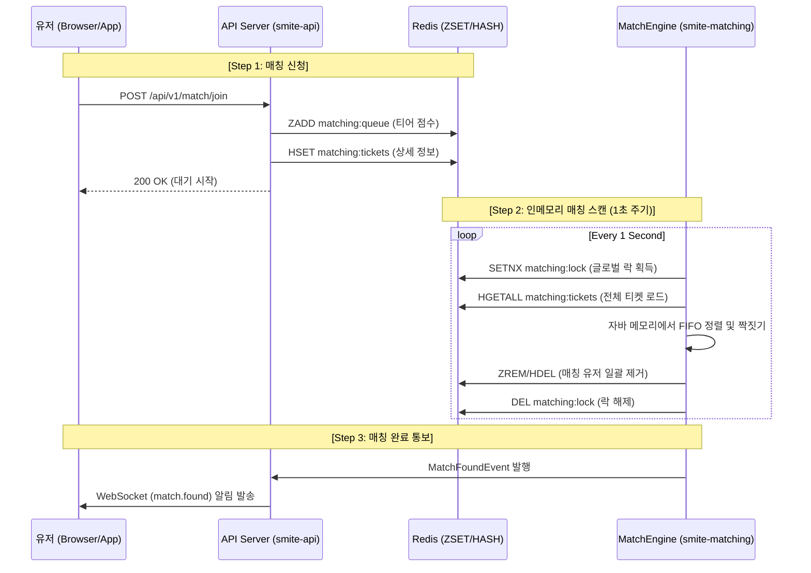
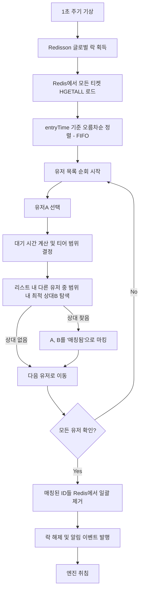

# Matching System Implementation Specification - V1 (Stage 1)

이 문서는 **Stage 1: 글로벌 락 + 인메모리 일괄 처리** 방식의 세부 구현 지침을 정의합니다.

---

## 1. 전체 프로세스 흐름 (Overall Flow)

매칭 요청부터 엔진의 탐색, 성사 알림까지의 전체 생명주기입니다.



---

## 2. 데이터 구조 상세 (Data Structures)

### 2.1 Redis Key 설계
| 구분 | Key 명칭 | 데이터 타입 | 주요 필드 / 값 |
| :--- | :--- | :--- | :--- |
| **대기열** | `matching:queue` | Sorted Set | **Member**: `userId`<br>**Score**: `tierScore` (1~28) |
| **티켓** | `matching:tickets` | Hash | **Field**: `userId`<br>**Value**: `{userId, tierScore, entryTime}` (JSON) |
| **글로벌 락** | `matching:lock` | String | **Value**: `locked` (TTL: 5s) |

### 2.2 매칭 티켓 객체 (Java)
```java
public record MatchTicket(
    Long userId,
    int tierScore,
    long entryTime
) {}
```

---

## 3. 엔진 내부 매칭 알고리즘 (Internal Logic)

매칭 엔진 워커는 1초마다 깨어나 아래 단계를 **원자적**으로 수행합니다.

### 3.1 단계별 로직 (Flowchart)



### 3.2 매칭 범위 확장 정책 (Sliding Window)
- **0 ~ 10초**: 본인 티어 점수 `±1`
- **11 ~ 20초**: 본인 티어 점수 `±2`
- **21 ~ 30초**: 본인 티어 점수 `±4`
- **31초 이상**: 본인 티어 점수 `±8` (최대 범위)

---

## 4. 동시성 및 정합성 보장 전략

1. **글로벌 락 (Redisson)**: `tryLock`을 사용하여 한 번에 하나의 엔진만 대기열을 처리하게 함으로써 '중복 매칭'을 원천 봉쇄합니다.
2. **원자적 삭제 검증**: `ZREM` 명령어의 리턴값(삭제된 개수)을 확인합니다. 만약 2명이 지워져야 하는데 1명만 지워졌다면, 그 사이 유저가 매칭을 취소한 것이므로 해당 매칭은 무효 처리하고 남은 1명은 다음 주기에 다시 매칭합니다.
3. **상태 불변성**: 자바 메모리에서 짝을 지을 때, 이미 매칭된 유저는 별도의 `Set<Long> matchedIds`에 보관하여 한 루프 내에서 중복 선택되지 않도록 합니다.
