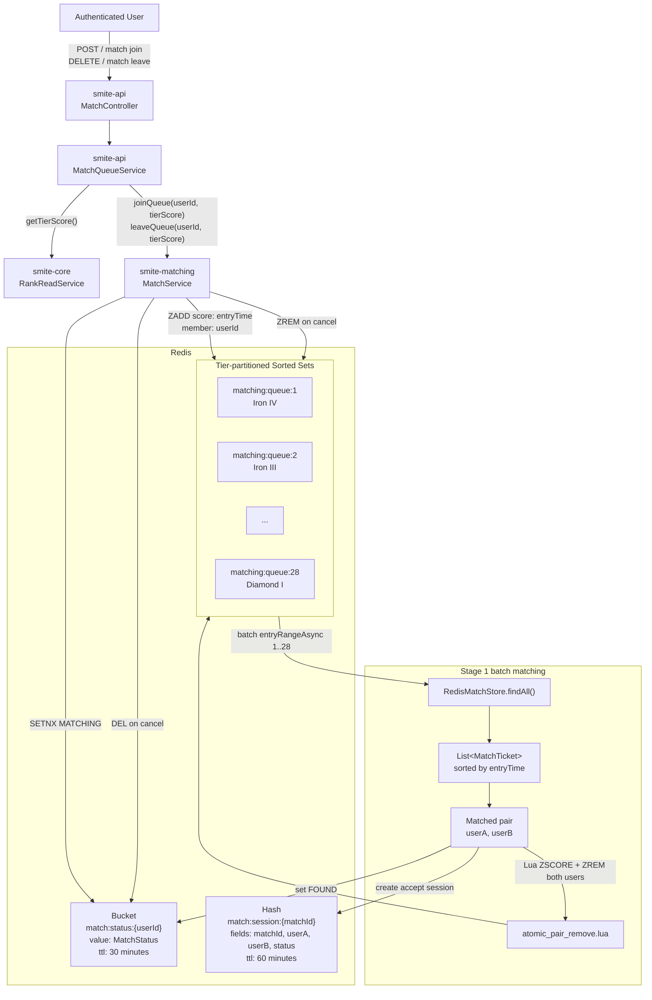
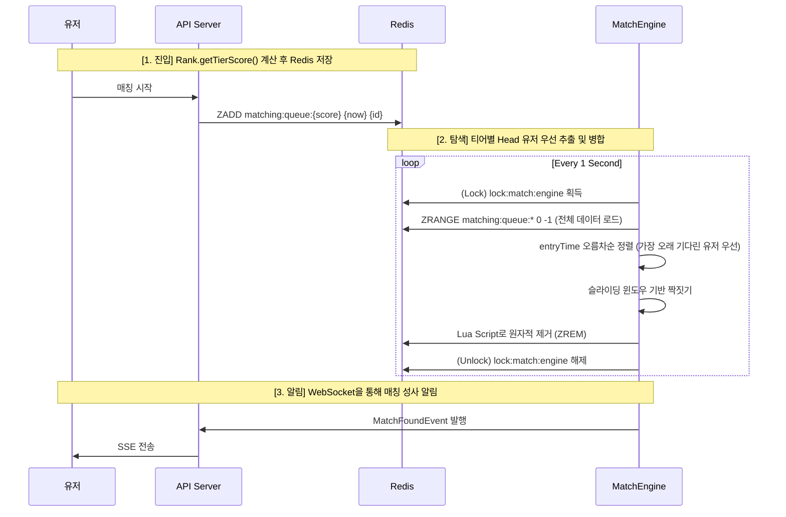

# Matching System Implementation Specification - V1 (Tier-Partitioned)

이 문서는 **Stage 1: 티어별 분할 ZSET + 인메모리 일괄 처리** 방식의 세부 구현 지침을 정의합니다.

---

## 1. 데이터 구조 설계 (Data Structures)

### 1.1 Redis 데이터 구조 시각화



### 1.2 Redis Key 명세 (Core Module 기반)
| Key 명칭 | 데이터 타입 | Score | Member |
| :--- | :--- | :--- | :--- |
| `matching:queue:{tierScore}` | Sorted Set | **entryTime** (ms) | **userId** (Long) |
| `match:session:{matchId}` | Hash (TTL 60분) | - | `{matchId, userA, userB, status}` |

> **[Core 연동]** `tierScore`는 `com.sang.smite.domain.rank.domain.vo.Rank` 클래스의 `getTierScore()` 공식을 따릅니다.
> - **범위**: 1 (아이언 IV) ~ 28 (다이아몬드 I)
> - **공식**: `(Tier_Level - 1) * 4 + (4 - Division_Value) + 1`

---

## 2. 전체 매칭 흐름 (Flowchart)



---

## 3. 핵심 로직 상세

### 3.1 인메모리 매칭 (Batch Processing)
- **데이터 로드**: 엔진은 매초 모든 티어 큐(1~28)의 유저를 메모리로 읽어와 하나의 `List<MatchTicket>`으로 통합합니다.
- **FIFO 우선순위**: 통합된 리스트를 **`entryTime` 오름차순**으로 정렬하여, 티어와 상관없이 **"가장 오래 기다린 사람"**부터 상대를 찾을 기회를 부여합니다.
- **매칭 시도**: 유저A가 선택되면, 리스트 내의 다른 유저 중 자신의 허용 티어 범위(`±N`)에 들면서 아직 짝이 지어지지 않은 첫 번째 유저B를 선택합니다.

### 3.2 원자적 제거 루아 스크립트 (Cross-Tier Removal)
두 유저의 티어가 다를 수 있으므로, 서로 다른 키를 동시에 처리해야 합니다.

```lua
-- KEYS[1]: queue:A, KEYS[2]: queue:B
-- ARGV[1]: userAId, ARGV[2]: userBId

local existsA = redis.call('ZSCORE', KEYS[1], ARGV[1])
local existsB = redis.call('ZSCORE', KEYS[2], ARGV[2])

if existsA and existsB then
    redis.call('ZREM', KEYS[1], ARGV[1])
    redis.call('ZREM', KEYS[2], ARGV[2])
    return 1 -- 성공
end
return 0 -- 실패
```

---

## 4. 매칭 범위 확장 정책 (Sliding Window)
- **0~10s**: `±1` (본인 포함 상하 1단계 티어 점수)
- **11~20s**: `±2`
- **21~30s**: `±4`
- **31s+**: `±8` (최대 확장)
