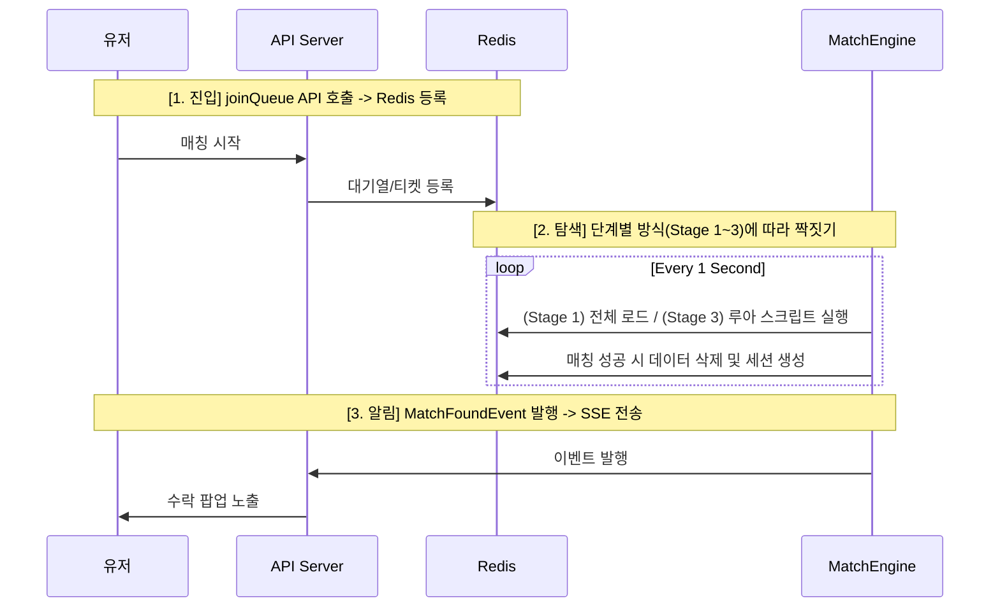
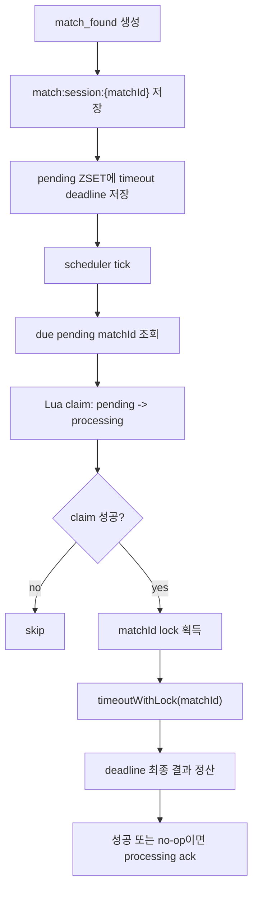

# League of Smite - Matching System Roadmap & Specification

이 문서는 League of Smite의 매칭 시스템이 초기 구축(Stage 1)부터 대규모 확장(Stage 3)까지 어떻게 진화하는지 상세 기술 명세를 정의합니다.

매칭 = 티어 큐 + FIFO 우선 + 대기 시간 기반 티어 확장 + Scheduler Batch 매칭 + 분산 락 + 원자적 제거
---

## 1. 개요 (Overview)
매칭 시스템은 유저의 실력(Tier Score)과 대기 시간을 고려하여 최적의 상대를 찾아줍니다. 
- **공통 원칙**: 모든 단계에서 **Redis는 매칭 큐/매칭 응답 상태의 저장소(Source of Truth)**로 활용됩니다.
  게임 진행 상태의 source of truth는 DB `game_rooms`, `game_participants`입니다.
- **진화 방향**: '구현의 단순함'에서 '동시성 극대화' 방향으로 발전합니다.

---

## 2. 공통 데이터 구조 (Common Data Structures)
모든 확장 단계에서 동일한 Redis 구조를 사용하여 데이터 마이그레이션 없이 로직만 교체 가능하도록 설계합니다.

- **매칭 대기열 (ZSET)**: `matching:queue:{tierScore}` (Member: userId, Score: entryTime)
  - *특징*: 티어별 물리적 격리 및 진입 시간 기반의 **자연스러운 FIFO** 보장.
- **유저 매칭 상태 (STRING)**: `match:status:{userId}`
  - *특징*: `MATCHING`, `FOUND`, `ACCEPTED`, `IN_GAME` 등 유저가 매칭/게임 플로우에 묶여 있는지 저장합니다.
  - gameRoom 생성 성공 이후에는 `IN_GAME`으로 전환하여 중복 큐 진입을 막습니다.
  - 정상 종료 후 `FINISHED + game_records 2행`이 확인되면 `IN_GAME`만 제거해 재매칭 가능 상태로 복구합니다.
  - cleanup은 유저를 자동으로 큐에 넣지 않고, 이후 사용자의 명시적 `joinQueue` 요청이 있어야 `MATCHING`으로 전환됩니다.
  - 게임의 실제 진행 상태는 Redis가 아니라 DB `game_rooms`, `game_participants`를 기준으로 판단합니다.
- **매칭 세션 (HASH)**: `match:session:{matchId}`
  - *특징*: 매칭 성사 후 수락/거절 상태를 관리하는 임시 데이터.
  - 양쪽 수락 후에도 게임 진행 상태를 확장 저장하지 않고, 매칭 응답 정산 기록으로만 유지합니다.
  - 클라이언트 수락/거절 모달 유효 시간은 10초입니다.
  - Redis 세션 TTL은 cleanup 실패 대비 안전장치로 60분을 둡니다.
- **응답 timeout pending index (ZSET)**: `match:response:timeout:pending`
  - *특징*: 아직 scheduler가 가져가지 않은 timeout 후보 matchId를 deadline epoch millis 기준으로 저장합니다.
- **응답 timeout processing index (ZSET)**: `match:response:timeout:processing`
  - *특징*: scheduler가 Lua claim으로 가져가 처리 중인 matchId를 processing lease 만료 시각 기준으로 저장합니다.

---

## 3. 단계별 매칭 구현 방식 (Implementation Stages)

### [Stage 1] 글로벌 락 + 인메모리 일괄 처리 (현재)
**규모**: 1,000~10,000 CCU 이벤트 피크 검증 | **특징**: 가장 단순하고 안정적
1. **Fetch**: `matching:queue:*` 모든 키의 데이터를 메모리로 로드 (티어별 28개 큐).
2. **Match**: 통합 리스트를 `entryTime` 순으로 정렬 후, 오래 기다린 유저부터 대기 시간에 따라 허용 티어 범위를 넓혀 짝을 찾음.
3. **Write**: **Lua Script**를 사용하여 서로 다른 티어 큐에 있는 유저들을 원자적으로 제거.
4. **Lock**: `lock:match:engine` 전역 락 사용. 고정 lease time 대신 Redisson watchdog으로 작업 중 락을 자동 연장.

### [Stage 2] 티어 그룹별 분산 락 (과도기)
**규모**: ~20,000 CCU | **특징**: 티어 구간별 독립적 병렬 처리
1. **Partition**: 특정 티어 구간(예: 10~15점)만 담당하는 엔진 워커 배치.
2. **Fetch**: 자기 담당 구역의 `matching:queue:{tierScore}` 키들만 감시.
3. **Lock**: `matching:lock:GOLD` 등 티어 구간별 락 사용.

### [Stage 3] 유저 단위 루아 스크립트 (최종)
**규모**: 20,000+ CCU | **특징**: 글로벌 락 제거, 극강의 동시성
1. **Trigger**: 매칭 엔진이 큐의 Head 유저를 타겟팅하여 루아 스크립트 즉시 실행.
2. **Atomic**: 루아 내부에서 인접 큐를 조회하고 즉시 제거하여 락 없이 원자성 확보.

---

## 4. 매칭 워크플로우 (Common Workflow)



---

## 5. 단계별 비교 요약 (Summary Table)

| 항목 | Stage 1 (인메모리) | Stage 2 (티어별 분산) | Stage 3 (루아 스크립트) |
| :--- | :--- | :--- | :--- |
| **복잡도** | 매우 낮음 | 중간 | 높음 |
| **Redis 통신** | 1~2회 (Batch) | 티어 그룹당 수회 | 유저당 1회 (Atomic) |
| **동시성** | 낮음 (Global Lock) | 중간 (Group Lock) | 매우 높음 (No Lock) |
| **추천 시점** | 초기 런칭 및 베타 | 유저 유입 급증 시 | 초대규모 글로벌 서비스 |

---

## 6. 매칭 응답 timeout 정산

매칭 성사 이후 10초 응답 윈도우가 끝나면 서버가 해당 matchId의 실패 조합을 최종 정산합니다. 남은 `PENDING` 응답은 `TIMEOUT`으로 바꾸고, 이미 수락/거절이 모두 기록된 실패 조합도 deadline 시점에 최종 결과로 확정합니다. 클라이언트는 모달 표시와 accept/reject 요청만 담당하고, 최종 정산은 서버가 책임집니다.

### 6.1 처리 흐름



### 6.2 claim과 lock의 역할

| 구분 | 역할 |
| :--- | :--- |
| Lua claim | 여러 API 인스턴스 scheduler 중 하나만 같은 timeout job을 가져가게 함 |
| `matchId` lock | accept/reject/timeout이 같은 match session을 동시에 수정하지 못하게 함 |

claim은 scheduler 중복 처리 비용을 줄이는 장치이고, lock은 세션 read-modify-write 정합성을 지키는 장치입니다. 둘은 대체 관계가 아닙니다.

### 6.3 실패 복구

```text
1. scheduler가 pending에서 due matchId 조회
2. Lua claim으로 pending -> processing 원자 이동
3. timeout 정산 성공 또는 no-op이면 processing에서 ack 제거
4. 처리 중 서버가 죽으면 processing에 남음
5. processing lease가 만료되면 Lua reclaim으로 pending에 복구
6. 다음 scheduler tick에서 재처리
```

### 6.4 정산 정책

| 응답 상태 | 처리 |
| :--- | :--- |
| `ACCEPTED + ACCEPTED` | accept 처리 시 즉시 성공 완료되어 timeout scheduler 대상 아님 |
| `ACCEPTED + REJECTED` | deadline 시 `DECLINED`, `ACCEPTED` 유저는 기존 `entryTime`으로 큐 복귀 |
| `ACCEPTED + PENDING` | `PENDING` 유저는 `TIMEOUT`, `ACCEPTED` 유저는 기존 `entryTime`으로 큐 복귀 |
| `REJECTED + REJECTED` | deadline 시 `DECLINED`, 두 유저 모두 큐 이탈 |
| `REJECTED + PENDING` | `PENDING` 유저는 `TIMEOUT`, 두 유저 모두 큐 이탈 |
| `PENDING + PENDING` | 두 유저 모두 `TIMEOUT`, 두 유저 모두 큐 이탈 |
| 이미 `ACCEPTED` / `DECLINED` / `TIMEOUT` | timeout scheduler는 no-op 후 index ack |

### 6.5 양쪽 수락 이후 게임방 생성 연결

`ACCEPTED + ACCEPTED`는 timeout scheduler 대상이 아니며, 서버는 즉시 gameRoom 생성 플로우로 진입합니다.

```text
ACCEPTED + ACCEPTED
-> game_rooms 생성
-> game_participants 2명 생성
-> scenario 생성/저장
-> match:session:{matchId} = ACCEPTED
-> match:status:{userA/userB} = IN_GAME
-> Redis 상태 전환 성공
-> match_response_result
   outcome=MATCHED
   reason=BOTH_ACCEPTED
   action=GO_TO_GAME_WAITING
   game={gameRoomId, videoUrl, webSocketUrl}
```

정상 종료 후에는 gameRoom 결과와 record/rank 정산이 DB 기준으로 완료된 뒤 `match:status:{userA/userB}=IN_GAME`만 best-effort로 제거합니다. `matching:queue:*`, `match:session:*`, `match:response:timeout:*`는 정상 종료 cleanup 대상이 아닙니다.

gameRoom 생성에 실패하면 두 유저를 매칭 큐에 자동 복귀시키지 않습니다.
서버는 실패 이벤트를 보내고, 클라이언트는 `GAME_SETUP_FAILED` reason에 대응하는 안내 문구를 표시한 뒤 start 버튼 화면으로 복귀합니다.

```text
gameRoom 생성 실패
-> match:status:{userA/userB} 제거
-> matching:queue 재삽입 없음
-> match_response_result
   outcome=FAILED
   reason=GAME_SETUP_FAILED
   action=GO_TO_MATCH_START
   game=null
```

gameRoom 생성은 성공했지만 Redis match session 또는 user status 전환이 실패하면 성공 이벤트를 발행하지 않습니다.
이 경우 이미 생성된 gameRoom과 participant는 `ABORTED`로 보상 처리하고, 두 유저 Redis status를 best-effort로 제거한 뒤 동일하게 `GAME_SETUP_FAILED` 이벤트를 발행합니다.

```text
gameRoom 생성 성공
-> Redis 상태 전환 실패
-> game_rooms.status = ABORTED
-> game_participants.status = ABORTED
-> match:status:{userA/userB} best-effort 제거
-> match:session:{matchId} = GAME_SETUP_FAILED
-> matching:queue 재삽입 없음
-> match_response_result
   outcome=FAILED
   reason=GAME_SETUP_FAILED
   action=GO_TO_MATCH_START
   game=null
```

매칭 SSE는 `match_response_result`까지 담당하고, `GO_TO_GAME_WAITING` 이후 게임 준비/RTT/카운트다운/SMITE/종료는 gameRoom WebSocket이 담당합니다.
`match_response_result`는 해당 matchId의 매칭 SSE 최종 이벤트이므로, 클라이언트는 이벤트 수신 후 매칭 SSE `EventSource.close()`를 호출합니다.
`GO_TO_GAME_WAITING`인 경우 매칭 SSE를 닫은 뒤 gameRoom WebSocket으로 전환합니다.

### 6.6 관측 지표

응답/timeout 지표는 `match_response_*` Prometheus metric으로 노출하고, Grafana 매칭 응답 전용 대시보드에서 확인합니다.

| 지표 | 의미 |
| :--- | :--- |
| `match_response_requests_total` | accept/reject 요청 시도/성공/실패 |
| `match_response_completions_total` | 최종 `accepted` / `declined` 완료 |
| `match_response_lock_failures_total` | matchId lock 획득 실패 |
| `match_response_timeout_claims_total` | timeout job claim 결과 |
| `match_response_timeout_reclaims_total` | processing job reclaim 결과 |
| `match_response_timeout_settlements_total` | timeout 정산 success/no-op/failure |
| `match_response_timeout_queue_returned_users_total` | timeout 정산으로 큐 복귀한 유저 수 |
| `match_response_timeout_pending_backlog` | pending timeout job 수 |
| `match_response_timeout_processing_backlog` | processing timeout job 수 |
| `match_response_timeout_processing_delay_seconds` | deadline 대비 실제 정산 지연 |

---

## 7. 매칭 정책과 성능 기준

### 7.1 시간 정책 분리

매칭 대기 시간과 수락/거절 모달 시간은 서로 다른 정책입니다.

| 구분 | 의미 | 기준 |
| :--- | :--- | :--- |
| 매칭 성공 유저 대기 시간 | `joinQueue` 진입 후 `match found`까지 걸린 시간 | 매칭 엔진 성능 지표 |
| 수락/거절 모달 유효 시간 | `match found` 이후 클라이언트가 응답할 수 있는 시간 | 10초 |
| 매칭 세션 Redis TTL | cleanup 실패 대비 서버 측 임시 세션 안전장치 TTL | 60분 |

수락/거절 모달 10초는 매칭 성사 이후부터 시작됩니다. 따라서 이 값을 매칭 대기 시간의 실패 기준으로 사용하지 않습니다.

### 7.2 매칭 대기 시간 등급

이 게임은 짧은 캐주얼 1:1 대전이므로 매칭 버튼을 누른 뒤 거의 즉시 상대가 잡히는 경험을 목표로 합니다.

| 테스트 유형 | 목표 | 허용 | 개선 필요 |
| :--- | ---: | ---: | ---: |
| steady 매칭 대기 p95 | 1초 미만 | 2초 미만 | 2초 이상 |
| burst 매칭 대기 p95 | 3초 미만 | 5초 미만 | 5초 이상 |

목표 기준은 최종적으로 달성해야 할 UX 기준입니다. 허용 기준은 V1이 장애 없이 처리 가능한 최소선이며, 허용 기준을 넘으면 매칭 엔진 구조 개선 대상으로 봅니다.

### 7.3 부하 테스트 공통 성공 기준

| 테스트 유형 | 기준 | 판단 |
| :--- | :--- | :--- |
| 공통 | joinQueue p95 < 300ms | API 진입 지연 확인 |
| 공통 | joinQueue 5xx < 1% | API 장애 여부 확인 |
| 공통 | 테스트 종료 후 큐가 1분 내 0으로 수렴 | 매칭 엔진이 유입을 끝까지 소화했는지 확인 |
| 공통 | join-only 원자 제거 실패율 0% 근접 | 취소/중복이 없는 조건에서 동시성 문제가 없는지 확인 |

### 7.4 매칭 엔진 병목 판단 지표

| 지표 | 판단 기준 |
| :--- | :--- |
| 스캔 소요 시간 p95/p99 | 스케줄 주기보다 길어지면 다음 스캔이 밀릴 수 있음 |
| 스캔당 로드 티켓 수 | 큐가 커질수록 전체 스캔 비용이 얼마나 증가하는지 확인 |
| 초당 매칭 성사 수 | 목표 joinQueue TPS의 절반에 근접해야 함 |
| 전체 대기 인원 | 테스트 중 일시 증가 가능하나 종료 후 빠르게 감소해야 함 |
| 분당 락 스킵 수 | 큐 적체와 함께 증가하면 전역 락 병목 가능성 |

### 7.5 현재 V1 부하 테스트 판단

| 시나리오 | 결과 | 판단 |
| :--- | :--- | :--- |
| 50 TPS / 5분 steady | 매칭 대기 p95 약 1초, 큐 0 수렴 | 목표 경계선, 지표 보정 후 재측정 필요 |
| 10,000명 burst, watchdog 적용 전 | 원자 제거 실패율 거의 100% | 고정 lease time 문제로 테스트 무효 |
| 10,000명 burst, watchdog 적용 후 | 원자 제거 실패율 0%, 매칭 대기 p95 약 11초 | 캐주얼 UX 기준 개선 필요 |

현재 V1은 steady 50 TPS에서는 목표에 근접하지만, 10,000명 burst에서는 매칭 대기 시간이 캐주얼 게임 기준을 크게 넘습니다. 다음 단계에서는 전체 큐 스캔 범위 축소 또는 티어별/청크 기반 처리 최적화가 필요합니다.

---

## 8. 확장 및 최적화 전략 (Scalability & Optimization)

본 시스템은 초기 구축의 단순함과 미래의 확장성을 모두 고려한 **3단계 성장형 아키텍처**를 지향합니다.

### 8.1 매칭 아키텍처 확장 로드맵

| 단계 | 방식 | 특징 | 적합 규모 |
| :--- | :--- | :--- | :--- |
| **Stage 1 (현재)** | **글로벌 락 + 인메모리 일괄 처리** | `matching:queue:*` 모든 키를 로드하여 자바 메모리에서 통합 매칭. | CCU 1,000 ~ 10,000 이벤트 피크 |
| **Stage 2 (중간)** | **티어 그룹별 분산 락** | 특정 티어 범위(예: 골드 구간)만 담당하는 엔진 배치. 구간별 독립적 병렬 처리. | CCU 5,000 ~ 20,000 |
| **Stage 3 (최종)** | **유저 단위 루아 스크립트** | 글로벌 락 제거. 루아 스크립트로 인접 큐를 즉시 조회하고 원자적으로 페어링. | CCU 20,000+ |

### 8.2 Stage 1에서 Stage 3로의 진화 (Transition)
- **전환 시점**: 동시 접속자가 늘어나 전체 큐 스캔 부하가 커지거나, 글로벌 락으로 인해 매칭 엔진의 처리 속도가 유저 유입 속도를 따라가지 못할 때 전환합니다.
- **구현 변경**: 
  - **Stage 1**: 모든 티어 큐 스캔 -> 자바 매칭 -> **다중 키 Lua Script** (원자적 제거)
  - **Stage 3**: 타겟 유저 선정 -> **탐색형 Lua Script** (루아 내부에서 인접 큐 탐색 및 즉시 제거)
  - *핵심 포인트*: 데이터 구조(`matching:queue:{tier}`)가 동일하므로, 인프라 변경 없이 로직 코드만 교체하여 확장이 가능합니다.

### 8.3 Lua Script를 이용한 원자적 페어링 (Stage 1용)
서로 다른 티어 큐에 있는 두 유저를 한 번에 확인하고 제거하여 정합성을 보장합니다.

**[Lua Script: `atomic_pair_remove.lua`]**
```lua
-- KEYS[1]: userA_queue_key, KEYS[2]: userB_queue_key
-- ARGV[1]: userAId, ARGV[2]: userBId

local existsA = redis.call('ZSCORE', KEYS[1], ARGV[1])
local existsB = redis.call('ZSCORE', KEYS[2], ARGV[2])

if existsA and existsB then
    redis.call('ZREM', KEYS[1], ARGV[1])
    redis.call('ZREM', KEYS[2], ARGV[2])
    return 1 -- 성공
end
return 0 -- 실패
```

### 8.4 기대 효과
1. **경쟁 감소**: 여러 서버에서 수백 개의 엔진 스레드가 동시에 돌아도 Redis 루아 스크립트의 원자성 덕분에 데이터가 꼬이지 않습니다.
2. **지연 시간 단축**: 불필요한 락 획득/해제 단계가 생략되어 매칭 처리 속도가 향상됩니다.
3. **무결성 보장**: 유저의 '매칭 취소'와 엔진의 '매칭 성공'이 겹치는 찰나의 순간을 완벽하게 방어합니다.

> **주의**: 현재 V1은 글로벌 락과 다중 키 Lua Script로 안정성을 확보합니다. 트래픽 증가로 전체 큐 스캔 비용이 커지면 Stage 2/3 방식으로 스캔 범위와 락 범위를 줄이는 리팩터링을 진행합니다.

---

## 9. 변경 이력

| 날짜 | 변경 내용 |
| :--- | :--- |
| 2026-05-13 | Redis를 매칭 큐/매칭 응답 상태의 source of truth로 한정하고, gameRoom 생성 후 Redis 상태 전환 성공 시 `IN_GAME` 유지 및 실패 시 `GAME_SETUP_FAILED` 실패 정책 추가 |
| 2026-05-13 | gameRoom 생성 실패 시 자동 큐 복귀하지 않고 status 제거 후 `GO_TO_MATCH_START`로 종료하는 정책으로 변경 |
| 2026-05-13 | Redis 상태 전환 실패 시 생성된 gameRoom/participant를 `ABORTED`로 보상 처리하고 성공 SSE를 발행하지 않는 정책 추가 |
| 2026-05-14 | `match_response_result` 수신 후 클라이언트가 매칭 SSE `EventSource.close()`를 호출하는 책임 명시 |
