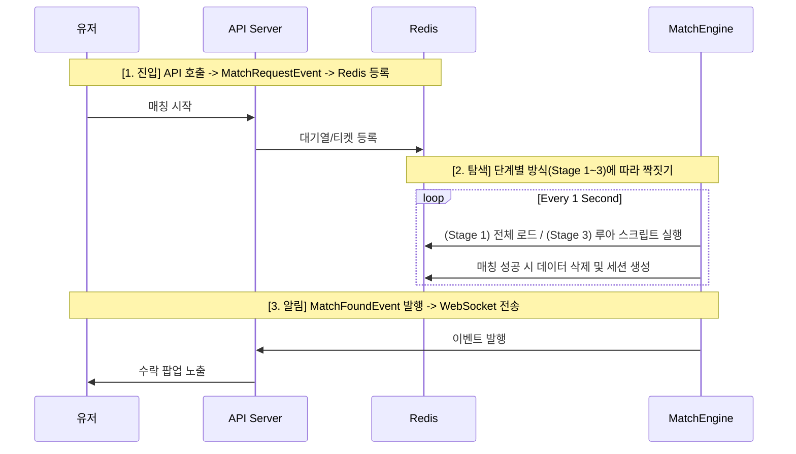

# League of Smite - Matching System Roadmap & Specification

이 문서는 League of Smite의 매칭 시스템이 초기 구축(Stage 1)부터 대규모 확장(Stage 3)까지 어떻게 진화하는지 상세 기술 명세를 정의합니다.

매칭 = 티어 큐 + FIFO 우선 + 인접 티어 확장 + Batch 매칭 + 원자적 제거
---

## 1. 개요 (Overview)
매칭 시스템은 유저의 실력(Tier Score)과 대기 시간을 고려하여 최적의 상대를 찾아줍니다. 
- **공통 원칙**: 모든 단계에서 **Redis는 상태의 저장소(Source of Truth)**로 활용됩니다.
- **진화 방향**: '구현의 단순함'에서 '동시성 극대화' 방향으로 발전합니다.

---

## 2. 공통 데이터 구조 (Common Data Structures)
모든 확장 단계에서 동일한 Redis 구조를 사용하여 데이터 마이그레이션 없이 로직만 교체 가능하도록 설계합니다.

- **매칭 대기열 (ZSET)**: `matching:queue:{tierScore}` (Member: userId, Score: entryTime)
  - *특징*: 티어별 물리적 격리 및 입입 시간 기반의 **자연스러운 FIFO** 보장.
- **매칭 세션 (HASH)**: `match:session:{matchId}`
  - *특징*: 매칭 성사 후 수락/거절 상태를 관리하는 TTL 기반 임시 데이터.

---

## 3. 단계별 매칭 구현 방식 (Implementation Stages)

### [Stage 1] 글로벌 락 + 인메모리 일괄 처리 (현재)
**규모**: ~5,000 CCU | **특징**: 가장 단순하고 안정적
1. **Fetch**: `matching:queue:*` 모든 키의 데이터를 메모리로 로드 (티어별 28개 큐).
2. **Match**: 통합 리스트를 `entryTime` 순으로 정렬 후, 인접 티어 큐 사이에서 최적의 짝을 찾음.
3. **Write**: **Lua Script**를 사용하여 서로 다른 티어 큐에 있는 유저들을 원자적으로 제거.
4. **Lock**: `matching:lock` (글로벌 락) 사용.

### [Stage 2] 티어 그룹별 분산 락 (과도기)
**규모**: ~20,000 CCU | **특징**: 티어 구간별 독립적 병렬 처리
1. **Partition**: 특정 티어 구간(예: 10~15점)만 담당하는 엔진 워커 배치.
2. **Fetch**: 자기 담당 구역의 `matching:queue:{tierScore}` 키들만 감시.
3. **Lock**: `matching:lock:GOLD` 등 티어 구간별 락 사용.

### [Stage 3] 유저 단위 루아 스크립트 (최종)
**규모**: 20,000+ CCU | **특징**: 글로벌 락 제거, 극강의 동시성
1. **Trigger**: 매칭 엔진이 큐의 Head 유저를 타겟팅하여 루아 스크립트 즉시 실행.
2. **Atomic**: 루아 내부에서 인접 큐를 조회하고 즉시 제거하여 락 없이 원자성 확보.

---

## 4. 매칭 워크플로우 (Common Workflow)



---

## 5. 단계별 비교 요약 (Summary Table)

| 항목 | Stage 1 (인메모리) | Stage 2 (티어별 분산) | Stage 3 (루아 스크립트) |
| :--- | :--- | :--- | :--- |
| **복잡도** | 매우 낮음 | 중간 | 높음 |
| **Redis 통신** | 1~2회 (Batch) | 티어 그룹당 수회 | 유저당 1회 (Atomic) |
| **동시성** | 낮음 (Global Lock) | 중간 (Group Lock) | 매우 높음 (No Lock) |
| **추천 시점** | 초기 런칭 및 베타 | 유저 유입 급증 시 | 초대규모 글로벌 서비스 |

---

---

## 8. 확장 및 최적화 전략 (Scalability & Optimization)

본 시스템은 초기 구축의 단순함과 미래의 확장성을 모두 고려한 **3단계 성장형 아키텍처**를 지향합니다.

### 8.1 매칭 아키텍처 확장 로드맵

| 단계 | 방식 | 특징 | 적합 규모 |
| :--- | :--- | :--- | :--- |
| **Stage 1 (현재)** | **글로벌 락 + 인메모리 일괄 처리** | `matching:queue:*` 모든 키를 로드하여 자바 메모리에서 통합 매칭. | CCU 1,000 ~ 5,000 |
| **Stage 2 (중간)** | **티어 그룹별 분산 락** | 특정 티어 범위(예: 골드 구간)만 담당하는 엔진 배치. 구간별 독립적 병렬 처리. | CCU 5,000 ~ 20,000 |
| **Stage 3 (최종)** | **유저 단위 루아 스크립트** | 글로벌 락 제거. 루아 스크립트로 인접 큐를 즉시 조회하고 원자적으로 페어링. | CCU 20,000+ |

### 8.2 Stage 1에서 Stage 3로의 진화 (Transition)
- **전환 시점**: 동시 접속자가 늘어나 전체 큐 스캔 부하가 커지거나, 글로벌 락으로 인해 매칭 엔진의 처리 속도가 유저 유입 속도를 따라가지 못할 때 전환합니다.
- **구현 변경**: 
  - **Stage 1**: 모든 티어 큐 스캔 -> 자바 매칭 -> **다중 키 Lua Script** (원자적 제거)
  - **Stage 3**: 타겟 유저 선정 -> **탐색형 Lua Script** (루아 내부에서 인접 큐 탐색 및 즉시 제거)
  - *핵심 포인트*: 데이터 구조(`matching:queue:{tier}`)가 동일하므로, 인프라 변경 없이 로직 코드만 교체하여 확장이 가능합니다.

### 8.3 Lua Script를 이용한 원자적 페어링 (Stage 1용)
서로 다른 티어 큐에 있는 두 유저를 한 번에 확인하고 제거하여 정합성을 보장합니다.

**[Lua Script: `atomic_pair_remove.lua`]**
```lua
-- KEYS[1]: userA_queue_key, KEYS[2]: userB_queue_key
-- ARGV[1]: userAId, ARGV[2]: userBId

local existsA = redis.call('ZSCORE', KEYS[1], ARGV[1])
local existsB = redis.call('ZSCORE', KEYS[2], ARGV[2])

if existsA and existsB then
    redis.call('ZREM', KEYS[1], ARGV[1])
    redis.call('ZREM', KEYS[2], ARGV[2])
    return 1 -- 성공
end
return 0 -- 실패
```

### 8.4 기대 효과
1. **경쟁 감소**: 여러 서버에서 수백 개의 엔진 스레드가 동시에 돌아도 Redis 루아 스크립트의 원자성 덕분에 데이터가 꼬이지 않습니다.
2. **지연 시간 단축**: 불필요한 락 획득/해제 단계가 생략되어 매칭 처리 속도가 향상됩니다.
3. **무결성 보장**: 유저의 '매칭 취소'와 엔진의 '매칭 성공'이 겹치는 찰나의 순간을 완벽하게 방어합니다.

> **주의**: 초기 구현 단계(1,000명 규모)에서는 글로벌 락으로 안정성을 먼저 확보한 뒤, 트래픽 증가 시 이 루아 스크립트 방식으로 리팩터링하는 로드맵을 권장합니다.
