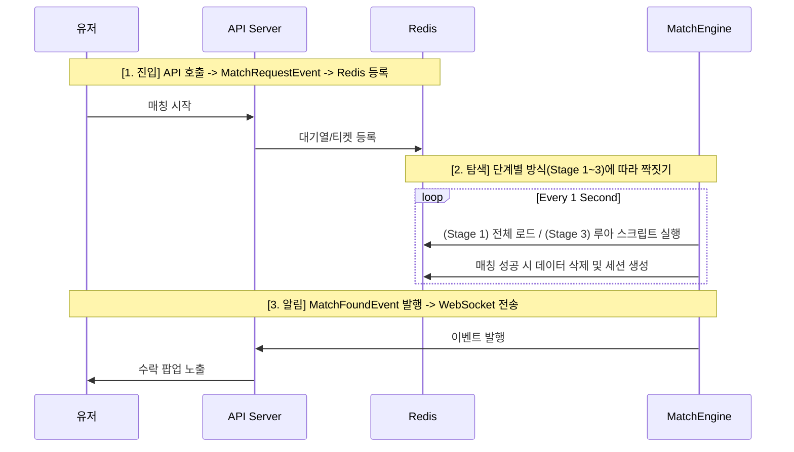

# League of Smite - Matching System Roadmap & Specification

이 문서는 League of Smite의 매칭 시스템이 초기 구축(Stage 1)부터 대규모 확장(Stage 3)까지 어떻게 진화하는지 상세 기술 명세를 정의합니다.

---

## 1. 개요 (Overview)
매칭 시스템은 유저의 실력(Tier Score)과 대기 시간을 고려하여 최적의 상대를 찾아줍니다. 
- **공통 원칙**: 모든 단계에서 **Redis는 상태의 저장소(Source of Truth)**로 활용됩니다.
- **진화 방향**: '구현의 단순함'에서 '동시성 극대화' 방향으로 발전합니다.

---

## 2. 공통 데이터 구조 (Common Data Structures)
모든 확장 단계에서 동일한 Redis 구조를 사용하여 데이터 마이그레이션 없이 로직만 교체 가능하도록 설계합니다.

- **매칭 대기열 (ZSET)**: `matching:queue` (Member: userId, Score: tierScore)
- **매칭 티켓 (HASH)**: `matching:tickets` (Field: userId, Value: JSON {tierScore, entryTime})
- **매칭 세션 (HASH)**: `match:session:{id}` (수락/거절 상태 관리)

---

## 3. 단계별 매칭 구현 방식 (Implementation Stages)

### [Stage 1] 글로벌 락 + 인메모리 일괄 처리 (현재)
**규모**: ~5,000 CCU | **특징**: 가장 단순하고 안정적
1. **Fetch**: `HGETALL matching:tickets`로 전체 대기 유저 정보를 자바 메모리로 로드.
2. **Match**: 자바 리스트를 정렬(FIFO)한 후 이중 루프로 짝짓기 수행 (네트워크 통신 0).
3. **Write**: 매칭된 유저 ID들을 모아 `ZREM`, `HDEL`로 일괄 삭제.
4. **Lock**: `matching:lock` (글로벌 락) 사용.

### [Stage 2] 티어 그룹별 분산 락 (과도기)
**규모**: ~20,000 CCU | **특징**: 엔진의 병렬 처리 가능
1. **Partition**: 티어 구간별로 담당 엔진을 배정 (예: 브론즈 엔진, 실버 엔진).
2. **Fetch**: `ZRANGEBYSCORE`를 사용하여 본인 담당 티어 구간 유저만 로드.
3. **Lock**: `matching:lock:GOLD`, `matching:lock:SILVER` 등 티어별 락 사용. 다른 티어 엔진끼리 서로 방해하지 않고 동시에 작동.

### [Stage 3] 유저 단위 루아 스크립트 (최종)
**규모**: 20,000+ CCU | **특징**: 동시성 극대화, 비차단형 처리
1. **Trigger**: 매칭 엔진이 유저 한 명을 타겟팅하여 루아 스크립트 실행.
2. **Atomic**: Redis 내부에서 `ZRANGEBYSCORE`로 상대를 찾고 `ZREM`까지 한 번의 원자적 연산으로 수행.
3. **Lock**: 글로벌/그룹 락 없음. Redis 싱글 스레드 특성을 이용한 완벽한 동시성 확보.

---

## 4. 매칭 워크플로우 (Common Workflow)

---

## 5. 단계별 비교 요약 (Summary Table)

| 항목 | Stage 1 (인메모리) | Stage 2 (티어별 분산) | Stage 3 (루아 스크립트) |
| :--- | :--- | :--- | :--- |
| **복잡도** | 매우 낮음 | 중간 | 높음 |
| **Redis 통신** | 1~2회 (Batch) | 티어 그룹당 수회 | 유저당 1회 (Atomic) |
| **동시성** | 낮음 (Global Lock) | 중간 (Group Lock) | 매우 높음 (No Lock) |
| **추천 시점** | 초기 런칭 및 베타 | 유저 유입 급증 시 | 초대규모 글로벌 서비스 |

---

## 6. 예외 및 트러블 슈팅 로드맵
- **매칭 지연**: Stage 1에서 루프 시간이 1초를 넘어가면 Stage 2로 확장을 검토합니다.
- **데이터 부정합**: 최종 삭제 시 삭제된 개수를 체크하여(`count == 2`), 유저의 취소 요청과 엔진의 성공 요청이 겹칠 때의 Race Condition을 방어합니다.
