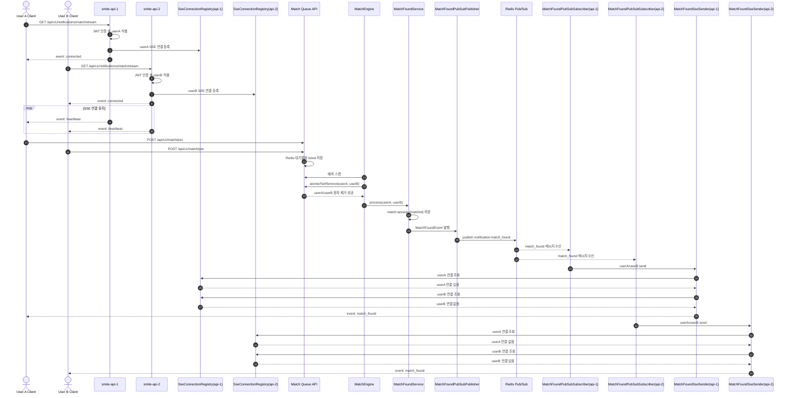
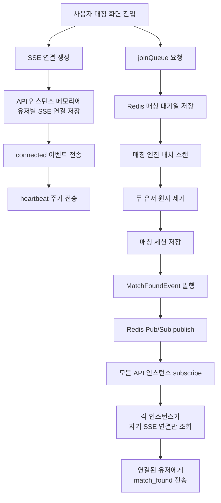

# SSE MVC 동작 흐름

이 문서는 현재 MVC 기반 SSE 매칭 알림 흐름을 정리합니다.

핵심 정책은 다음과 같습니다.

- 클라이언트는 매칭 시작 화면에 진입하면 먼저 SSE 연결을 생성합니다.
- 서버는 인증된 유저 ID 기준으로 SSE 연결을 현재 API 인스턴스 메모리에 저장합니다.
- 연결이 유지되는 동안 서버는 주기적으로 `heartbeat` 이벤트를 보냅니다.
- 매칭 엔진이 매칭을 성사시키면 `MatchFoundEvent`가 발생합니다.
- `MatchFoundEvent`는 Redis Pub/Sub channel로 publish됩니다.
- 모든 API 인스턴스는 같은 Pub/Sub 메시지를 subscribe합니다.
- 각 API 인스턴스는 자기 메모리의 `SseConnectionRegistry`에 연결된 유저에게만 `match_found` SSE 이벤트를 전송합니다.

## 흐름 해석

Pub/Sub 메시지는 모든 API 인스턴스가 받습니다. 하지만 SSE 연결 객체는 각 API 인스턴스의 메모리에만 존재합니다.

따라서 `smite-api-1`은 자기 인스턴스에 연결된 `userA`에게만 전송하고, `smite-api-2`는 자기 인스턴스에 연결된 `userB`에게만 전송합니다.

이 구조 덕분에 매칭 엔진이 어느 API 인스턴스에서 실행되더라도, 다른 인스턴스에 연결된 사용자에게도 `match_found` 알림을 전달할 수 있습니다.

## 간단 흐름

요약하면, 클라이언트는 매칭 시작과 동시에 SSE 연결을 열어두고 서버의 `heartbeat`를 받습니다. 이후 매칭이 성사되면 서버는 Redis Pub/Sub으로 모든 API 인스턴스에 `match_found` 메시지를 전파하고, 각 인스턴스는 자기에게 연결된 유저에게만 알림을 보냅니다.
