# WebSocket Client Flow

이 문서는 `ACCEPTED + ACCEPTED` 이후 클라이언트와 백엔드가 매칭 SSE에서 게임 대기 WebSocket으로 전환하는 흐름을 정리합니다.

범위:

- 포함: `match_response_result`, 매칭 SSE 종료, 게임 대기 화면 이동, MP4 preload, WebSocket handshake, `PLAYER_JOINED`, `CLIENT_READY`, `PLAYER_READY`, `PLAYER_LEFT`, `GAME_WAITING_TIMEOUT`, RTT 측정 메시지, `GAME_START_FAILED`, `COUNTDOWN`, `GAME_START`, 클라이언트 복구 정책, `ERROR`
- 제외: SMITE 판정, game record/LP 반영

## 1. 책임 경계

매칭 SSE는 `match_response_result` 최종 이벤트까지만 담당합니다.
`GO_TO_GAME_WAITING` 이후의 게임 대기 상태는 gameRoom WebSocket이 담당합니다.

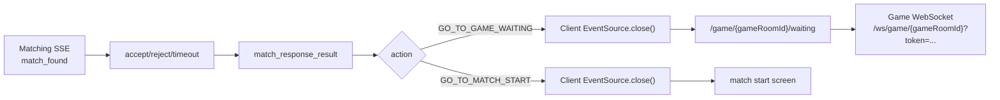

클라이언트 기준:

- `match_response_result`는 해당 `matchId`의 최종 SSE 이벤트입니다.
- `match_response_result` 수신 후 매칭 SSE `EventSource.close()`를 호출합니다.
- `GO_TO_GAME_WAITING`일 때만 게임 대기 화면으로 이동합니다.
- 게임 대기 화면부터는 WebSocket으로 연결/READY 상태를 처리합니다.

## 2. 수락-수락 전체 흐름

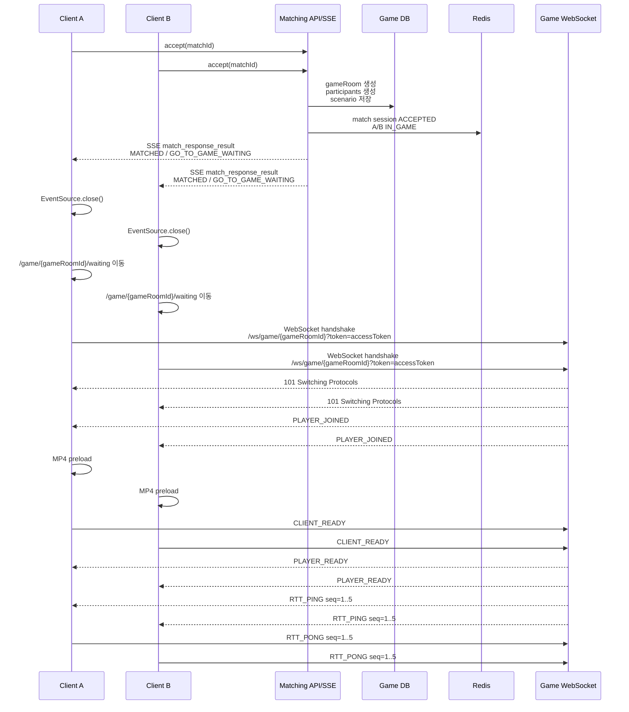

## 3. match_response_result 처리

양쪽 모두 수락하고 백엔드의 게임 준비가 성공하면 클라이언트는 매칭 SSE에서 최종 이벤트를 받습니다.

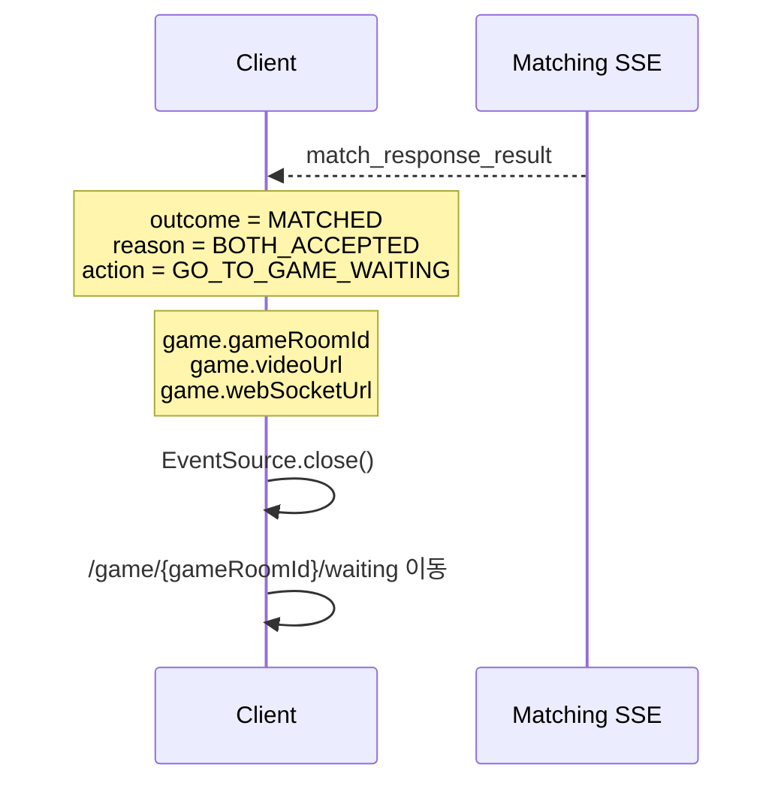

예상 payload:

```json
{
  "matchId": "match-id",
  "outcome": "MATCHED",
  "reason": "BOTH_ACCEPTED",
  "action": "GO_TO_GAME_WAITING",
  "opponent": {
    "userId": 2,
    "nickname": "opponent",
    "tier": "Gold IV",
    "tierScore": 13
  },
  "game": {
    "gameRoomId": 100,
    "videoUrl": "/assets/game/dragon-view.mp4",
    "webSocketUrl": "/ws/game/100"
  }
}
```

클라이언트 처리:

- `action=GO_TO_GAME_WAITING`이면 `game` payload가 있어야 합니다.
- `videoUrl`은 MP4 preload에 사용합니다.
- `webSocketUrl`은 WebSocket 연결 주소로 사용합니다.
- 브라우저 native WebSocket에서는 custom `Authorization` header를 붙이기 어렵기 때문에 MVP에서는 query parameter로 token을 전달합니다.

```ts
const socket = new WebSocket(`${webSocketUrl}?token=${accessToken}`);
```

## 4. 게임 준비 실패 흐름

gameRoom 생성, participant 저장, scenario 저장, Redis `IN_GAME` 상태 전환 중 실패하면 클라이언트는 게임 대기 화면으로 이동하지 않습니다.

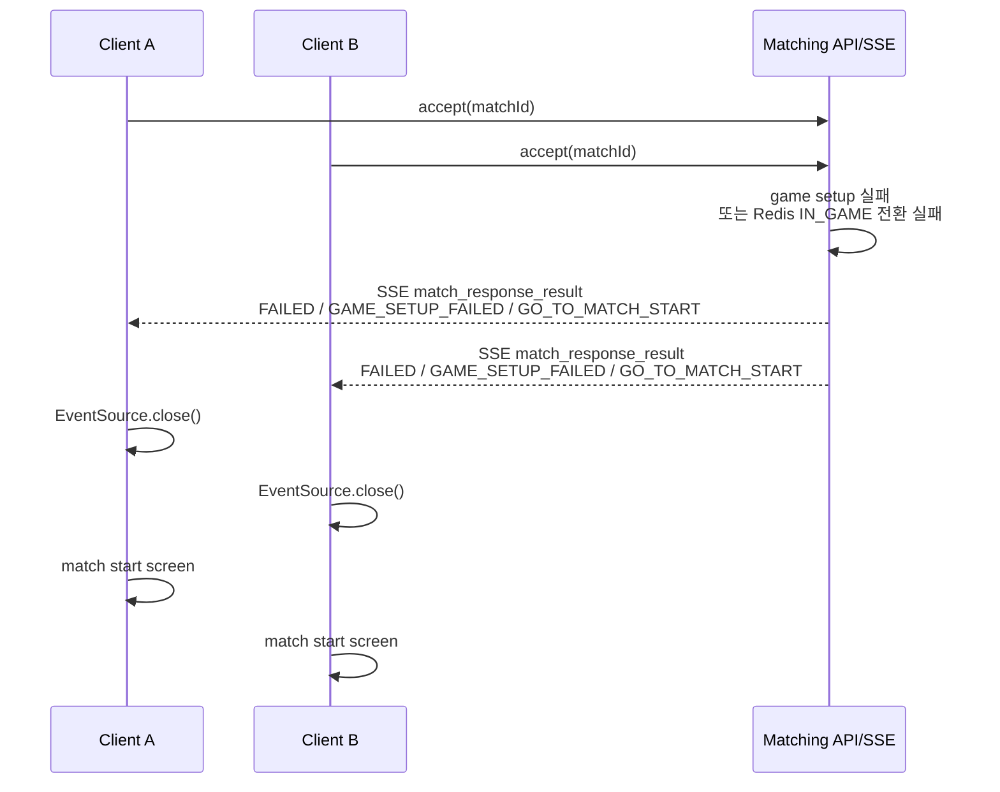

정책:

- 이 경우 WebSocket 연결을 시도하지 않습니다.
- 큐 자동 복귀는 하지 않습니다.
- 클라이언트는 실패 알림을 보여주고 매칭 시작 화면으로 이동합니다.

## 5. WebSocket handshake

`/ws/game/**` 경로는 HTTP security whitelist에 포함되지만, 실제 인증/인가는 WebSocket handshake interceptor에서 수행합니다.

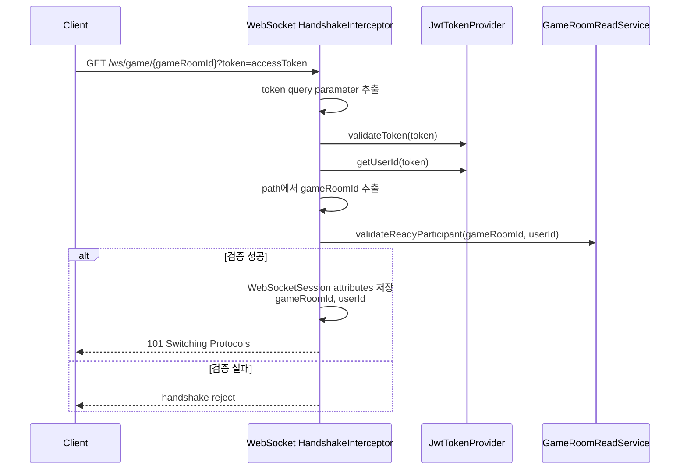

백엔드 검증:

- token 누락 또는 JWT 검증 실패: handshake 거부
- gameRoomId path 오류: handshake 거부
- gameRoom 없음, READY 아님, participant 아님: handshake 거부
- 검증 성공 시 `WebSocketSession` attributes에 `gameRoomId`, `userId` 저장

중요:

- WebSocket 메시지 payload로 전달된 `userId`, `gameRoomId`는 신뢰하지 않습니다.
- 백엔드는 handshake에서 검증하고 저장한 session attributes만 사용합니다.

## 6. 연결 성공과 PLAYER_JOINED

handshake가 성공하면 백엔드는 WebSocket session을 gameRoom registry에 등록하고 room 참가자에게 `PLAYER_JOINED`를 전송합니다.

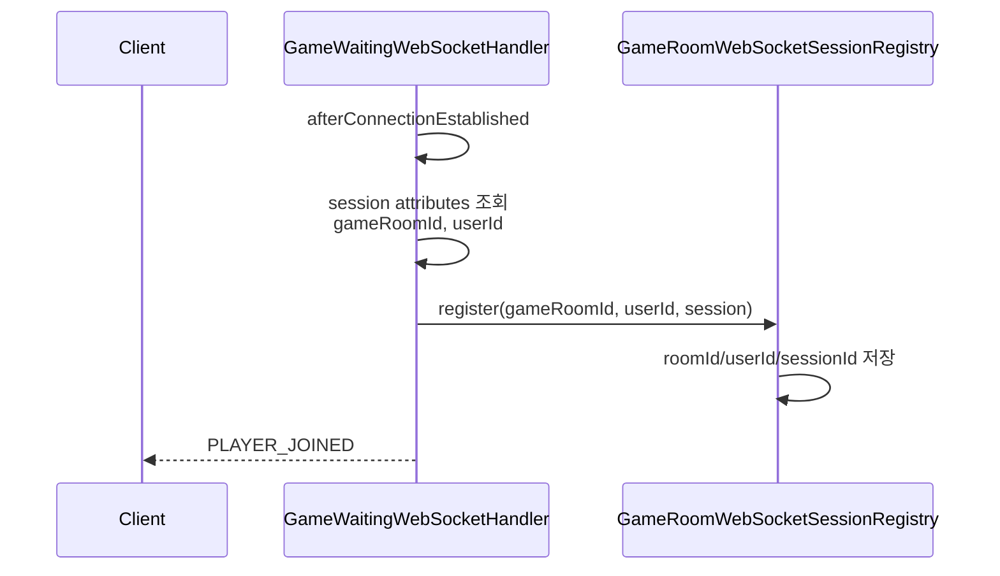

서버 메시지:

```json
{
  "type": "PLAYER_JOINED",
  "payload": {
    "userId": 1
  }
}
```

클라이언트 처리:

- gameRoom 참가자의 접속 상태를 UI에 반영합니다.
- 이 메시지는 게임 시작 신호가 아닙니다.
- `GAME_START`는 RTT 통과 이후 Step 6에서 별도 메시지로 처리합니다.

## 7. MP4 preload와 CLIENT_READY

클라이언트는 게임 대기 화면에서 MP4를 preload한 뒤 `CLIENT_READY`를 한 번 전송합니다.

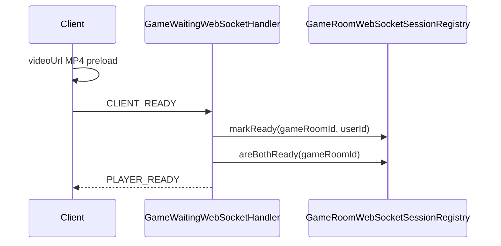

클라이언트 메시지:

```json
{
  "type": "CLIENT_READY",
  "payload": {}
}
```

서버 메시지:

```json
{
  "type": "PLAYER_READY",
  "payload": {
    "userId": 1,
    "bothReady": false
  }
}
```

양쪽 모두 READY가 되면:

```json
{
  "type": "PLAYER_READY",
  "payload": {
    "userId": 2,
    "bothReady": true
  }
}
```

주의:

- `bothReady=true`는 게임 시작 가능 상태일 뿐, `GAME_START` 메시지가 아닙니다.
- 양쪽 READY가 되면 서버는 RTT 측정 단계로 넘어갑니다.
- countdown, `GAME_START`는 RTT 통과 이후 Step 6에서 연결합니다.

## 8. 연결 종료와 PLAYER_LEFT

대기 중 한 참가자의 WebSocket 연결이 종료되면 백엔드는 registry에서 session을 제거하고 남은 참가자에게 `PLAYER_LEFT`를 전송합니다.

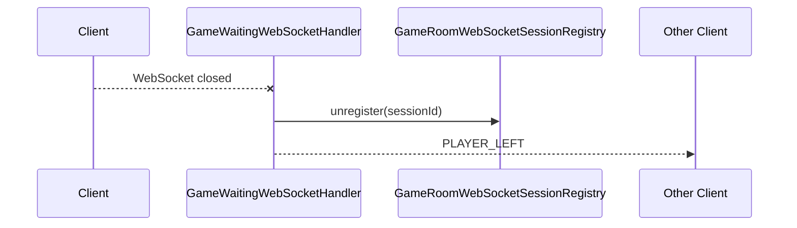

서버 메시지:

```json
{
  "type": "PLAYER_LEFT",
  "payload": {
    "userId": 1
  }
}
```

현재 처리 범위:

- registry에서 연결 상태 제거
- 남은 참가자에게 `PLAYER_LEFT` 알림

주의:

- 위 `PLAYER_LEFT`는 게임 대기 WebSocket의 연결 상태 알림입니다.
- `GAME_START` 이전에는 gameRoom `createdAt` 기준 30초 안에 두 참가자가 WebSocket 연결과 `CLIENT_READY`를 모두 완료하지 못하면 `ABORTED` 대상이 됩니다.
- `GAME_START` 이후에는 WebSocket 연결이 끊겨도 gameRoom을 즉시 중단하지 않고 서버 timer/scheduler가 종료 판정을 완료합니다.
- 서버는 `GAME_START` 확정 시 `gameEndAt = startAt + scenario.durationMs`, `settlementDueAt = gameEndAt + 2000ms`로 종료 정산 deadline을 등록합니다.
- deadline 등록 실패 시 서버는 gameRoom/participants를 `ABORTED` 처리하고 `COUNTDOWN`/`GAME_START`를 전송하지 않으며 record/LP를 반영하지 않습니다.

## 9. 게임 대기 Timeout과 미연결

gameRoom `createdAt` 기준 30초 안에 두 참가자가 모두 WebSocket 연결과 `CLIENT_READY` 전송을 완료하지 못하면 서버는 `GAME_START` 이전 timeout으로 판단합니다.

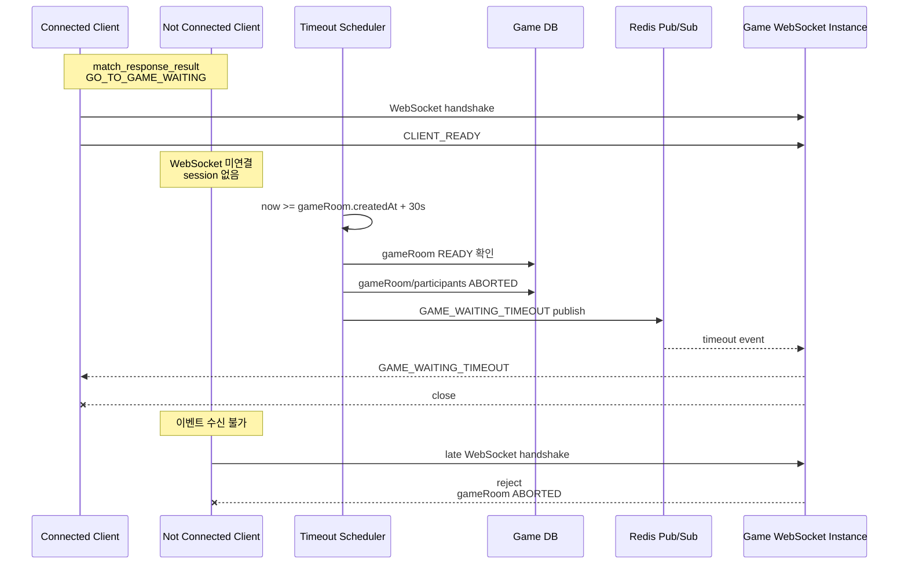

서버 메시지:

```json
{
  "type": "GAME_WAITING_TIMEOUT",
  "payload": {
    "gameRoomId": 100,
    "reason": "WAITING_TIMEOUT",
    "action": "GO_TO_MATCH_START"
  }
}
```

클라이언트 복구 정책:

- `GAME_WAITING_TIMEOUT`을 받으면 WebSocket을 닫고 start 버튼 화면으로 복귀합니다.
- WebSocket에 미연결된 유저는 timeout 이벤트를 받을 수 없습니다.
- 미연결 유저가 늦게 WebSocket handshake를 시도하면 gameRoom이 `ABORTED` 상태이므로 연결이 거절됩니다.
- handshake 실패, WebSocket close/error, 클라이언트 자체 30초 timer 만료는 start 버튼 화면 복귀 트리거로 처리합니다.
- API polling은 필수 흐름으로 두지 않습니다.
- 큐 자동 복귀는 하지 않습니다. start 버튼 화면으로 돌아간 뒤 유저가 직접 다시 매칭을 시작합니다.

복귀 트리거:

| 트리거 | 발생 조건 | 클라이언트 처리 |
|------|------|------|
| `GAME_WAITING_TIMEOUT` | 서버가 gameRoom `createdAt + 30초` 기준 timeout을 확정했고 현재 WebSocket session이 열려 있음 | timeout 안내 후 WebSocket 정리, start 버튼 화면 복귀 |
| handshake 실패 | 늦은 접속, 잘못된 token, participant 아님, gameRoom이 이미 `ABORTED`/`IN_PROGRESS` 등 `READY` 아님 | start 버튼 화면 복귀 |
| WebSocket close/error | 대기 중 연결이 닫히거나 transport error 발생 | start 버튼 화면 복귀 |
| 자체 30초 timer 만료 | `GO_TO_GAME_WAITING` 진입 후 30초 안에 다음 단계로 진행하지 못함 | start 버튼 화면 복귀 |

자체 30초 timer 기준:

- timer는 `GO_TO_GAME_WAITING` 수신 후 waiting 화면에 진입할 때 시작합니다.
- 서버 timeout 기준은 gameRoom `createdAt + 30초`입니다.
- 클라이언트 timer는 서버 판정의 대체 수단이 아니라, 미접속/네트워크 실패/이벤트 미수신 상황에서 화면을 복구하기 위한 UI 안전장치입니다.
- timer 만료 전에 `GAME_WAITING_TIMEOUT`, handshake 실패, close/error 중 하나가 먼저 발생하면 그 이벤트를 기준으로 복귀합니다.

권장 처리 순서:

```text
GO_TO_GAME_WAITING 수신
-> 매칭 SSE EventSource.close()
-> waiting 화면 진입
-> 30초 자체 timer 시작
-> WebSocket handshake 시도
-> MP4 preload 완료 후 CLIENT_READY 전송

다음 중 하나 발생 시 start 버튼 화면 복귀:
  - GAME_WAITING_TIMEOUT 수신
  - handshake 실패
  - WebSocket close/error
  - 자체 30초 timer 만료 전 GAME_START/다음 단계 이벤트 미수신
```

## 10. RTT 측정과 GAME_START_FAILED

양쪽 `CLIENT_READY`가 완료되면 서버는 `GAME_START` 전에 RTT를 측정합니다.

클라이언트는 `RTT_PING`을 받으면 같은 `seq`로 즉시 `RTT_PONG`을 반환해야 합니다.

```json
{
  "type": "RTT_PING",
  "payload": {
    "seq": 1
  }
}
```

```json
{
  "type": "RTT_PONG",
  "payload": {
    "seq": 1
  }
}
```

RTT 정책:

| 항목 | 기준 |
|------|------|
| 측정 횟수 | 유저별 5회 |
| 판정값 | median RTT |
| 정상 기준 | median RTT 2000ms 이하 |
| 개별 응답 제한 | `RTT_PING`마다 2500ms 안에 `RTT_PONG` 응답 |
| 전체 제한 | 5회 측정과 per-ping 2500ms timeout 기준 gameRoom RTT 측정은 최대 15초 안에 완료 |
| 실패 처리 | 응답 누락, WebSocket close/error, 측정 중 예외는 `RTT_FAILED` |
| 초과 처리 | median RTT 2000ms 초과는 `RTT_TOO_HIGH` |

RTT 실패/초과 시 서버는 `GAME_START_FAILED`를 전송하고 연결을 닫습니다.

```json
{
  "type": "GAME_START_FAILED",
  "payload": {
    "gameRoomId": 100,
    "reason": "RTT_FAILED",
    "action": "GO_TO_MATCH_START"
  }
}
```

클라이언트 처리:

- `RTT_PING`을 받으면 payload의 `seq`를 그대로 담아 `RTT_PONG`을 즉시 보냅니다.
- `GAME_START_FAILED`를 받으면 reason과 관계없이 WebSocket을 정리하고 start 버튼 화면으로 복귀합니다.
- `RTT_FAILED`, `RTT_TOO_HIGH`는 안내/로그 구분용이며 화면 이동 정책은 동일합니다.
- RTT 성공 후 `COUNTDOWN`과 `GAME_START`를 수신합니다. 두 메시지는 같은 `startAt`을 사용해야 합니다.

## 11. COUNTDOWN과 GAME_START

양쪽 RTT가 모두 `PASSED`이면 서버는 `startAt = serverNow + 4000ms`를 확정합니다.

서버는 `COUNTDOWN`과 `GAME_START`를 countdown 종료 후가 아니라 `startAt` 전에 미리 전송합니다. 클라이언트는 두 메시지를 받아도 즉시 게임을 시작하지 않고, payload의 `startAt`까지 대기합니다.

`COUNTDOWN` 예시:

```json
{
  "type": "COUNTDOWN",
  "payload": {
    "gameRoomId": 10,
    "serverTime": 1716192000000,
    "startAt": 1716192004000,
    "countdownDisplaySeconds": 3
  }
}
```

`GAME_START` 예시:

```json
{
  "type": "GAME_START",
  "payload": {
    "gameRoomId": 10,
    "serverTime": 1716192000000,
    "startAt": 1716192004000,
    "scenario": {}
  }
}
```

클라이언트 처리:

- `COUNTDOWN`을 받으면 `startAt`까지 남은 시간을 계산합니다.
- 남은 시간이 3000ms 이하가 되면 `3, 2, 1` countdown을 렌더링합니다.
- 메시지를 늦게 받아 남은 시간이 2초대이면 `2`부터 보여줄 수 있습니다. 그래도 실제 시작 기준은 `startAt`입니다.
- `GAME_START`를 받으면 scenario를 저장하고, `startAt` 도달 시 MP4 재생과 HP overlay를 시작합니다.
- `COUNTDOWN`과 `GAME_START`의 `startAt`이 다르면 잘못된 서버 메시지로 보고 시작하지 않습니다.

## 12. 잘못된 메시지 처리

클라이언트가 JSON 파싱이 불가능한 메시지나 server-only type을 보내면 백엔드는 `ERROR`를 응답합니다.

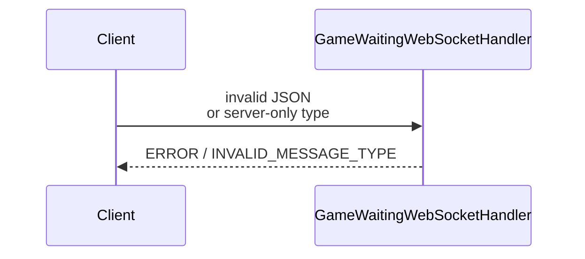

서버 메시지:

```json
{
  "type": "ERROR",
  "payload": {
    "code": "INVALID_MESSAGE_TYPE",
    "reason": "Unsupported WebSocket message type."
  }
}
```

현재 client message로 허용되는 type:

| type | 설명 |
|------|------|
| `CLIENT_READY` | MP4 preload 등 대기 준비 완료 |
| `RTT_PONG` | 서버 `RTT_PING`에 대한 RTT 측정 응답. payload의 `seq`를 그대로 반환 |

서버가 보내는 message type:

| type | 설명 |
|------|------|
| `PLAYER_JOINED` | gameRoom 참가자 WebSocket 연결 완료 |
| `PLAYER_READY` | gameRoom 참가자 READY 상태 변경 |
| `PLAYER_LEFT` | gameRoom 참가자 WebSocket 연결 종료 |
| `GAME_WAITING_TIMEOUT` | gameRoom `createdAt` 기준 30초 안에 양쪽 READY가 완료되지 않아 start 버튼 화면으로 복귀해야 함 |
| `RTT_PING` | 서버가 RTT 측정을 위해 보내는 ping. 클라이언트는 같은 `seq`로 `RTT_PONG` 응답 |
| `GAME_START_FAILED` | RTT 실패/초과로 GAME_START 전에 gameRoom이 `ABORTED` 되어 start 버튼 화면으로 복귀해야 함 |
| `COUNTDOWN` | 서버 기준 `startAt`까지 남은 시간을 렌더링하기 위한 시작 예고 |
| `GAME_START` | `startAt`과 HP scenario를 포함한 실제 게임 시작 데이터 |
| `ERROR` | 잘못된 메시지 또는 처리 불가 |

## 13. 클라이언트 UI 상태

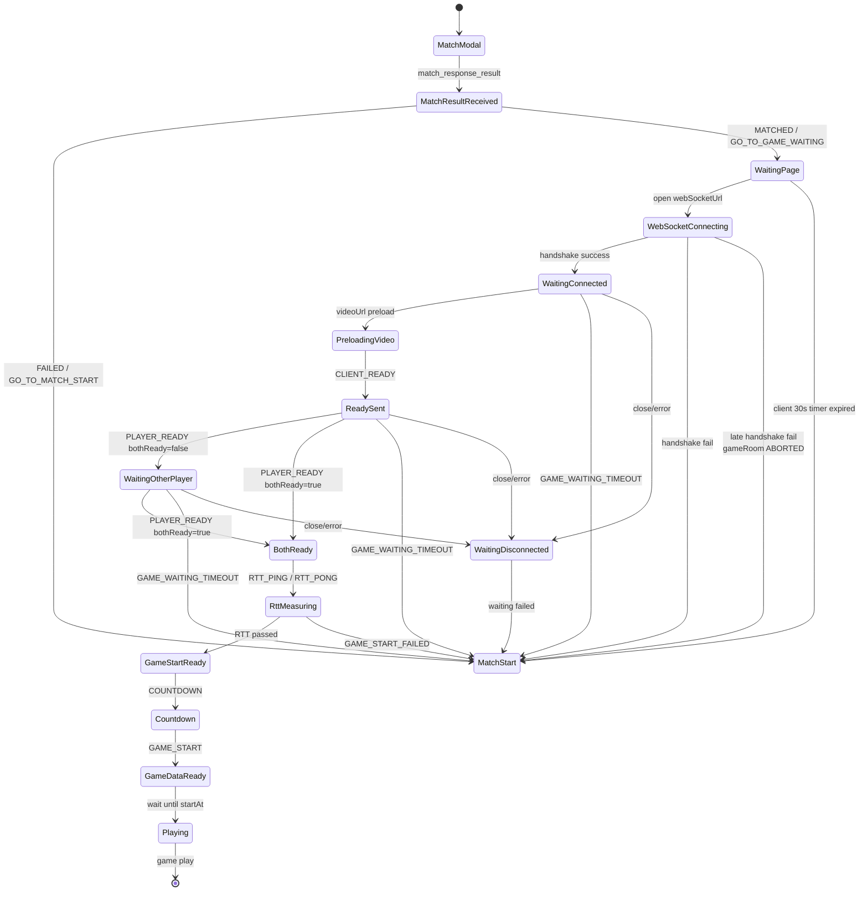

클라이언트 구현 체크리스트:

- `match_response_result` 수신 후 매칭 SSE를 닫습니다.
- `GO_TO_GAME_WAITING`일 때만 게임 대기 화면으로 이동합니다.
- `game.webSocketUrl`에 access token query parameter를 붙여 WebSocket에 연결합니다.
- WebSocket 연결 후 `PLAYER_JOINED`, `PLAYER_READY`, `PLAYER_LEFT`, `GAME_WAITING_TIMEOUT`, `RTT_PING`, `GAME_START_FAILED`, `COUNTDOWN`, `GAME_START`, `ERROR`를 처리합니다.
- MP4 preload 완료 후 `CLIENT_READY`를 한 번 전송합니다.
- `GAME_WAITING_TIMEOUT`, handshake 실패, close/error, 자체 30초 timer 만료 시 start 버튼 화면으로 복귀합니다.
- RTT 단계의 `GAME_START_FAILED` 수신 시 start 버튼 화면으로 복귀합니다.
- 복귀 시 기존 waiting 화면 상태, WebSocket 객체, 자체 timer를 정리합니다.
- `bothReady=true`를 `GAME_START`로 오해하지 않습니다.
- RTT 성공을 `GAME_START`로 오해하지 않습니다.
- `COUNTDOWN`과 `GAME_START`를 받아도 즉시 시작하지 않고, 같은 `startAt` 기준으로 대기한 뒤 게임을 시작합니다.
- SMITE는 후속 WebSocket 단계에서 별도로 처리합니다.

## 변경 이력

| 날짜 | 변경 내용 |
|------|----------|
| 2026-05-15 | 양쪽 수락 이후 매칭 SSE 종료, 게임 대기 WebSocket handshake, PLAYER_JOINED, CLIENT_READY, PLAYER_READY, PLAYER_LEFT 흐름 정리 |
| 2026-05-18 | gameRoom `createdAt` 기준 30초 waiting timeout, 미연결 유저 이벤트 수신 불가, `GAME_WAITING_TIMEOUT` 클라이언트 복귀 흐름 추가 |
| 2026-05-19 | RTT_PING/RTT_PONG, 5회 median RTT, 2500ms per-ping timeout, 15초 전체 제한, GAME_START_FAILED 복귀 정책 추가 |
| 2026-05-20 | `startAt = serverNow + 4000ms`, 프론트 3초 countdown 렌더링, `COUNTDOWN`/`GAME_START` 사전 수신 후 startAt 대기 정책 추가 |
