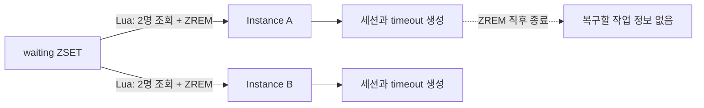
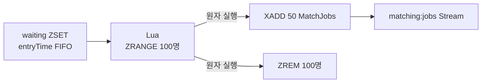
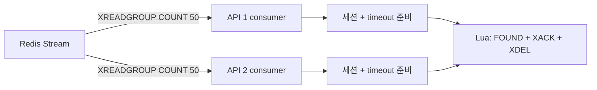
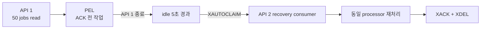

# Redis Streams 기반 매칭 작업 분배 및 장애 복구

## 문제

기존 매칭 엔진은 Lua로 FIFO 대기열의 두 사용자를 원자적으로 제거한 뒤, 같은 애플리케이션 프로세스가 세션과 응답 timeout을 생성했다. 두 인스턴스가 같은 사용자를 중복 선점하는 문제는 막았지만, `ZREM` 이후 Java 후처리 전에 인스턴스가 종료되면 제거된 사용자를 다시 찾을 공용 상태가 없었다.

이를 보완한 중간 구현은 별도의 processing Hash와 lease ZSET을 직접 관리했다. 복구는 가능했지만 claim 저장, 만료 인덱스, ACK, 원래 큐 복귀 로직을 애플리케이션이 모두 소유해야 했고, 실패한 작업은 대기열로 돌아가 다시 페어링되는 구조였다.

## 개선 전

| 상태 | 기존 직접 처리 | 중간 custom lease |
| --- | --- | --- |
| 대기열 제거 후 작업 보관 | 없음 | processing Hash |
| 처리 중 소유권 | 없음 | lease ZSET 직접 관리 |
| 인스턴스 종료 | 사용자 유실 가능 | waiting ZSET으로 복귀 |
| 재처리 단위 | 없음 | 사용자를 다시 페어링 |

## 해결

### 페어링과 MatchJob 생성을 원자 처리

50ms 주기의 producer가 FIFO 상위 100명을 조회해 50쌍을 만든다. Lua 안에서 각 쌍을 Redis Stream에 `XADD`한 뒤 waiting ZSET에서 `ZREM`하므로, 대기열에서는 사라졌지만 작업 기록은 없는 상태가 생기지 않는다.

두 API 인스턴스가 동시에 producer를 실행해도 Redis가 Lua를 순차 실행한다. 먼저 실행된 인스턴스가 상위 100명을 작업으로 바꾸면, 다음 인스턴스는 그다음 100명을 처리하므로 전역 분산 락이 필요하지 않다.

### Consumer Group으로 인스턴스별 병렬 처리

각 인스턴스는 서로 다른 consumer 이름으로 `XREADGROUP BLOCK`을 실행한다. Redis Consumer Group이 아직 전달되지 않은 작업을 consumer별로 분배하므로, 두 인스턴스는 같은 작업을 읽지 않고 최대 50건씩 병렬 후처리한다.

consumer는 세션과 timeout을 준비한 뒤 Lua 한 번으로 사용자 상태를 `FOUND`로 변경하고 `XACK`한다. ACK된 entry는 같은 Lua에서 `XDEL`해 Stream이 무한히 증가하지 않도록 했다. 알림 발행 실패는 이미 확정된 작업을 되돌리지 않고 timeout 경로에서 정리한다.

### PEL과 XAUTOCLAIM으로 작업 인계

consumer가 읽었지만 ACK하지 않은 작업은 Consumer Group의 PEL에 남는다. Recovery Scheduler는 1초마다 `XAUTOCLAIM`을 실행해 idle 5초를 넘긴 작업을 현재 인스턴스로 가져오고, 신규 작업과 같은 processor로 재처리한다.

Stream message ID를 `matchId`로 사용한다. 같은 작업이 재처리돼도 동일 세션 키와 timeout member를 덮어쓰므로, 복구 경로를 별도 비즈니스 로직으로 만들지 않고 기존 처리를 멱등하게 재사용할 수 있다.

## 검증

### 정상 부하

Docker API 2인스턴스에 500 VU로 5,000명을 동시에 진입시켰다. 워밍업을 제외한 3회에서 `waiting=0`, `PEL=0`, `session=2,500`, `status=5,000`, `Stream entry=0`을 확인했다.

| 실행 | 전체 매칭 완료 | join 실패율 | join API p95 | XREADGROUP / XACK |
| --- | ---: | ---: | ---: | ---: |
| 1회 | 6,008.626ms | 0% | 594.47ms | 52회 / 51회 |
| 2회 | 5,539.169ms | 0% | 460.01ms | 54회 / 53회 |
| 3회 | 5,467.525ms | 0% | 537.05ms | 52회 / 51회 |
| **평균** | **5,671.773ms** | **0%** | **530.51ms** | **약 53회 / 52회** |

| 구조 | 5,000명 전체 완료 평균 | Stream/processing 복구 상태 | 기존 직접 처리 대비 |
| --- | ---: | --- | ---: |
| 기존 즉시 제거 | 6,230.333ms | 없음 | 기준 |
| custom processing + Batch ACK | 6,779.705ms | 직접 구현한 lease | 8.8% 증가 |
| **Redis Streams Consumer Group** | **5,671.773ms** | **PEL + XAUTOCLAIM** | **9.0% 감소** |

join 요청은 5,000건 모두 성공했지만 p95 `300ms` 기준은 넘었다. 이는 매칭 후처리 정합성과 별개로 burst 상황의 API 진입 성능에 남아 있는 개선 항목으로 기록했다.

### 인스턴스 강제 종료

API 2를 정지한 상태에서 5,000명을 FIFO에 적재하고, CPU를 제한한 API 1이 50개 작업을 읽어 PEL에 등록한 순간 프로세스를 종료했다. 이후 API 2만 재개해 PEL 인계와 전체 완료를 검증했다.

| 검증 항목 | 결과 |
| --- | ---: |
| 종료 순간 PEL | 50 jobs = 100명 |
| 종료 순간 waiting | 4,800명 |
| XAUTOCLAIM 복구 | 50 jobs 전량 |
| 종료 후 복구 완료 | 5,004.243ms |
| 최종 waiting / PEL / Stream | 0 / 0 / 0 |
| 최종 세션 / 사용자 상태 | 2,500 / 5,000 |
| 중복·유실 | 0건 |

복구 시간 약 5초는 처리 지연이 아니라, 정상 처리 중인 느린 consumer의 작업을 성급히 빼앗지 않도록 설정한 `minIdle=5초` 정책값이다.

## 결과

- `XADD + ZREM`을 Lua로 묶어 대기열 제거와 복구 가능한 작업 생성을 원자 처리했다.
- Consumer Group으로 두 인스턴스가 전역 락 없이 서로 다른 MatchJob을 병렬 처리하도록 구성했다.
- PEL과 `XAUTOCLAIM`으로 consumer 종료 시 미완료 작업 50건을 전량 인계했다.
- 5,000명 테스트에서 2,500쌍을 중복·유실 없이 확정하고 완료 시간을 평균 5.672초로 측정했다.
- custom processing 저장소와 lease 관리 코드를 Redis 표준 전달·복구 모델로 대체했다.
